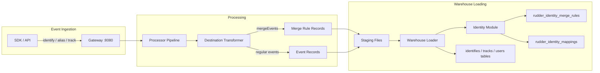
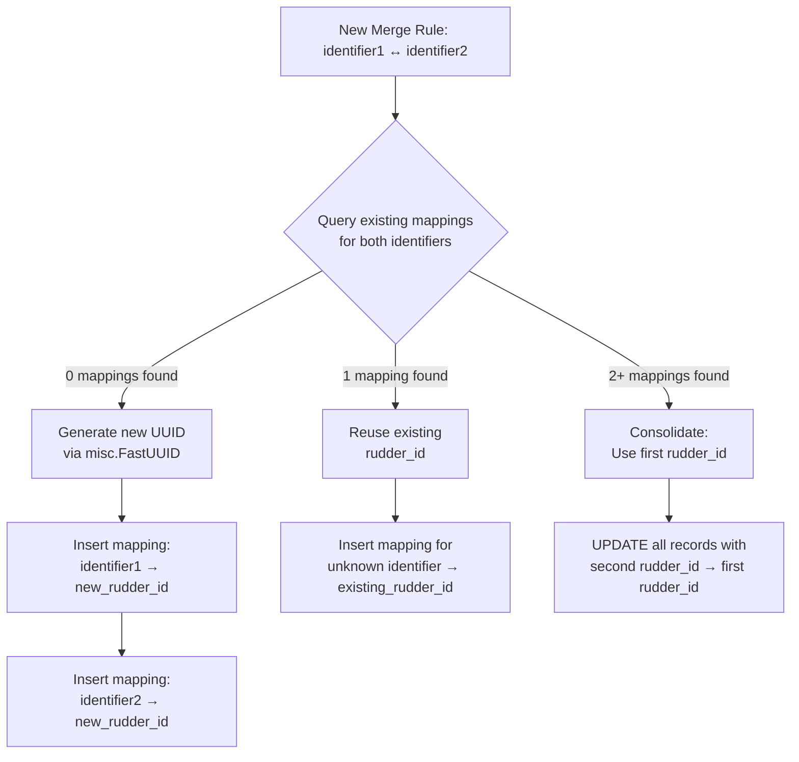
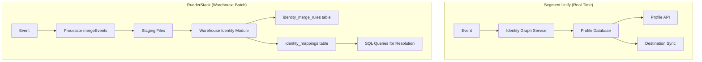
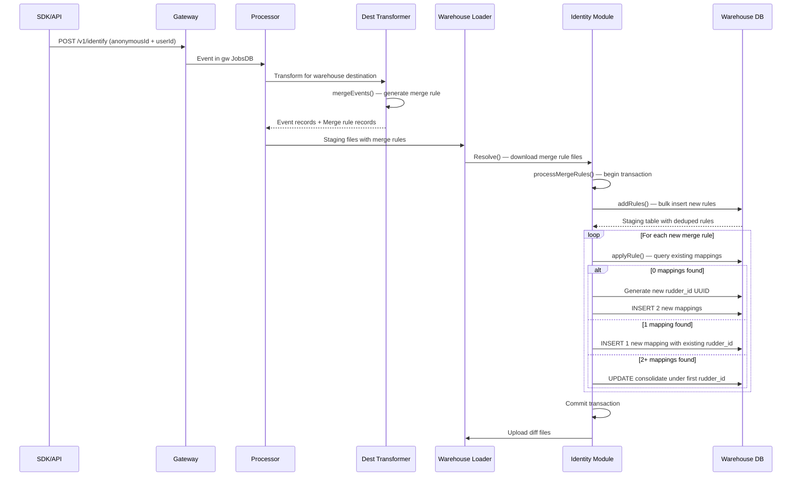

# Identity Resolution

Identity resolution in RudderStack unifies user touchpoints across devices, sessions, and channels by maintaining merge-rule tables in the data warehouse. When a user transitions from anonymous browsing to a known identity — or when two known identities are explicitly linked — RudderStack generates **merge rules** that map disparate identifiers to a single, unified `rudder_id`.

RudderStack's identity resolution uses a **warehouse-centric merge-rule approach**. Unlike real-time identity graph services, merge rules are written to warehouse tables during each sync cycle. The Processor's destination transformer generates merge-rule records from `identify`, `alias`, `track`, `page`, `screen`, and `group` events whenever both an `anonymousId` and a `userId` are present (or when an explicit `alias` or `merge` call is made). These rules are then resolved by the warehouse Identity module into unified identity mappings.

> **Important:** Identity resolution is currently supported for **Snowflake and BigQuery only** when `Warehouse.enableIDResolution` is set to `true` (disabled by default).
>
> Source: `warehouse/utils/utils.go:132` — `IdentityEnabledWarehouses = []string{SNOWFLAKE, BQ}`
> Source: `warehouse/utils/utils.go:196` — `enableIDResolution = config.GetBoolVar(false, "Warehouse.enableIDResolution")`

## Prerequisites

Before reading this guide, familiarize yourself with the following topics:

- [Alias Event Specification](../../api-reference/event-spec/alias.md) — Alias call for merging identities
- [Identify Event Specification](../../api-reference/event-spec/identify.md) — Identify call with userId and anonymousId
- [User Profiles and Traits](./profiles.md) — Profile data management
- [Warehouse Overview](../../warehouse/overview.md) — Warehouse service architecture
- [Data Flow Architecture](../../architecture/data-flow.md) — End-to-end pipeline

---

## Architecture Overview

The identity resolution pipeline spans three major stages of the RudderStack data pipeline:

1. **Event Ingestion:** Events containing identity pairs (`anonymousId` + `userId`, or `previousId` + `userId` via alias) flow through the Gateway on port 8080. The Gateway's `webAliasHandler()` routes alias calls through standard write-key authentication.
   - Source: `gateway/handle_http.go:57-59` — `webAliasHandler` and `webMergeHandler` at lines 62-64
2. **Merge Rule Generation:** The Processor's destination transformer generates merge-rule records via `mergeEvents()` in the embedded warehouse ID resolution module.
   - Source: `processor/internal/transformer/destination_transformer/embedded/warehouse/idresolution.go:15-71`
3. **Staging and Loading:** Merge rules are stored in staging files alongside regular event data. During each warehouse sync cycle, the Identity module (`warehouse/identity/identity.go`) downloads these staging files, processes merge rules within a database transaction, and resolves them into unified `rudder_id` assignments in the `rudder_identity_mappings` table.
   - Source: `warehouse/identity/identity.go:600-631`
4. **Router Gating:** The warehouse router checks `IDResolutionEnabled()` and verifies the warehouse type is in `IdentityEnabledWarehouses` before invoking `setupIdentityTables()` and optionally `populateHistoricIdentities()`.
   - Source: `warehouse/router/router.go:217`



---

## Merge Rule Generation

Merge rules are generated in the Processor stage when events contain identity pairs. The `mergeEvents()` function in the embedded warehouse transformer module checks whether identity resolution is enabled and whether the destination type supports it before generating merge-rule records.

- Source: `processor/internal/transformer/destination_transformer/embedded/warehouse/idresolution.go:15-26`

### Event Types That Generate Merge Rules

The `mergeProps()` dispatcher (lines 73-82) routes to three different handlers depending on event type:

1. **`merge` events** — Explicit merge with a `mergeProperties` array containing exactly two identity objects. The handler extracts `prop1Type`/`prop1Value` and `prop2Type`/`prop2Value` from the array elements.
   - Source: `processor/internal/transformer/destination_transformer/embedded/warehouse/idresolution.go:84-118` — `mergePropsForMergeEventType`

2. **`alias` events** — Merges `previousId` with `userId`. Both are mapped as `user_id` type identifiers.
   - Source: `processor/internal/transformer/destination_transformer/embedded/warehouse/idresolution.go:120-127` — `mergePropsForAliasEventType`

3. **Default events (`identify`, `track`, `page`, `screen`, `group`)** — Implicitly merge `anonymous_id` (from `anonymousId`) with `user_id` (from `userId`) when both are present.
   - Source: `processor/internal/transformer/destination_transformer/embedded/warehouse/idresolution.go:129-141` — `mergePropsForDefaultEventType`
   - Source: `processor/internal/transformer/destination_transformer/embedded/warehouse/internal/rules/rules.go` — DefaultRules map `anonymous_id` from `anonymousId`, `user_id` from `userId`

### Merge Rule Record Format

The output of `mergeEvents()` is a map with `data`, `metadata`, and `userId` keys:

- **`data`** contains: `merge_property_1_type`, `merge_property_1_value`, `merge_property_2_type`, `merge_property_2_value` (all string types)
- **`metadata`** contains: `table` (merge rules table name), `columns` (column type mappings), `isMergeRule: true`, `receivedAt`, `mergePropOne`, and optionally `mergePropTwo`
- **`userId`** is set to an empty string for merge-rule records

Source: `processor/internal/transformer/destination_transformer/embedded/warehouse/idresolution.go:39-70`

### Gating Conditions

Merge rules are **NOT** generated when any of the following conditions are true:

| Condition | Source |
|-----------|--------|
| `enableIDResolution` config is `false` (the default) | `idresolution.go:16` |
| Destination type not in identity-enabled list | `idresolution.go:19` — `utils.IsIdentityEnabled()` |
| `mergeProp1` is empty (no identity pair found) | `idresolution.go:26` |

### Example: Alias Call to Merge Rule

```javascript
// SDK alias call — link old identity to new identity
rudderanalytics.alias("new_user_id", "old_anonymous_id");
```

This generates the following merge-rule record:

```json
{
  "data": {
    "merge_property_1_type": "user_id",
    "merge_property_1_value": "old_anonymous_id",
    "merge_property_2_type": "user_id",
    "merge_property_2_value": "new_user_id"
  },
  "metadata": {
    "table": "rudder_identity_merge_rules",
    "isMergeRule": true,
    "receivedAt": "2024-01-15T10:30:00.000Z",
    "mergePropOne": "user_id:old_anonymous_id",
    "mergePropTwo": "user_id:new_user_id"
  },
  "userId": ""
}
```

---

## Identity Resolution Pipeline

The warehouse Identity module (`warehouse/identity/identity.go`, 632 lines) implements the full merge-rule resolution algorithm.

### Identity Module Structure

The `Identity` struct wraps all dependencies required for resolution:

| Field | Type | Purpose |
|-------|------|---------|
| `warehouseModel` | `model.Warehouse` | Warehouse configuration and metadata |
| `db` | `sqlmiddleware.DB` | PostgreSQL database connection for identity tables |
| `uploader` | `WarehouseManager` | Staging file management interface |
| `uploadID` | `int64` | Current upload batch identifier |
| `warehouseManager` | `WarehouseManager` | Interface for downloading identity rules |
| `downloader` | `Downloader` | File download interface |
| `encodingFactory` | `encoding.Factory` | Encoding factory for staging file formats |

Constructor: `New(ctx, wh, db, uploader, downloader, encodingFactory)` creates an Identity instance.

Source: `warehouse/identity/identity.go:40-60`

### Resolution Flow

`Resolve()` is the entry point called during each warehouse sync cycle:

1. Downloads merge-rule load files from the warehouse manager (staging area)
2. Calls `processMergeRules()` for each load file
3. Returns after all files are processed

Source: `warehouse/identity/identity.go:600-616`

### Process Merge Rules (Transaction)

`processMergeRules()` orchestrates the full resolution within a single database transaction:

1. **Begin transaction** — Opens a PostgreSQL transaction for atomic rule application
2. **`addRules()`** — Bulk inserts new merge rules into a staging table
3. **Iterate and apply** — Loops over each new merge rule, calling `applyRule()` for each
4. **Progress logging** — Every 1,000 rules processed, a progress log is emitted
5. **Upload diff files** — New identity mappings are written to files and uploaded to object storage
6. **Commit transaction** — Commits the transaction atomically

Source: `warehouse/identity/identity.go:513-598`

### Adding Rules (Bulk Insert)

`addRules()` handles high-throughput rule ingestion:

1. Creates a temporary staging table for merge rules
2. Downloads and decompresses gzip load files from object storage
3. Bulk inserts records via `pq.CopyIn` (PostgreSQL COPY protocol) for maximum throughput
4. **Deduplicates** against the permanent `rudder_identity_merge_rules` table using `DELETE FROM staging USING original` to remove already-existing rules
5. Inserts only new/distinct rules into the permanent table using `INSERT INTO ... SELECT DISTINCT ON (...) FROM staging ORDER BY id ASC`

Source: `warehouse/identity/identity.go:208-398`

### Applying Rules (Rudder ID Assignment)

`applyRule()` is the core resolution algorithm. For each merge rule (a pair of identifiers), it queries existing mappings in `rudder_identity_mappings` using `ARRAY_AGG(DISTINCT(rudder_id))`:



**Detailed three-way branching logic:**

- **Case: `len(rudderIDs) == 0` — No existing mappings:** Both identifiers are previously unseen. A new UUID is generated via `misc.FastUUID()` and assigned as the `rudder_id`. Two new mapping rows are inserted (one per identifier) using `INSERT ... ON CONFLICT DO NOTHING` with the unique constraint.

- **Case: `len(rudderIDs) == 1` — One existing mapping:** One identifier is already known. The existing `rudderIDs[0]` is reused. A new mapping row is inserted for the previously unknown identifier using `INSERT ... ON CONFLICT DO NOTHING`.

- **Case: `len(rudderIDs) >= 2` — Multiple existing mappings:** Both identifiers exist but under different `rudder_id` values. The algorithm consolidates by selecting `rudderIDs[0]` as the canonical ID, then issuing `UPDATE rudder_identity_mappings SET rudder_id = rudderIDs[0] WHERE rudder_id IN (rudderIDs[1:])` to point all records from the second (and any subsequent) `rudder_id` to the first. New mapping rows are also inserted for completeness.

Source: `warehouse/identity/identity.go:78-206`

### Historic Identity Resolution

`ResolveHistoricIdentities()` downloads historical merge rules from the warehouse manager and processes them through the same `processMergeRules()` pipeline. This is used for backfill and replay scenarios where merge rules from previously archived events need to be re-applied.

Source: `warehouse/identity/identity.go:618-631`

---

## Database Tables

Identity resolution creates and maintains two dedicated tables per warehouse namespace and destination.

### rudder_identity_merge_rules

The merge rules table records every identity merge relationship observed from events.

- **Table naming:** `rudder_identity_merge_rules_{namespace}_{destID}`
- Source: `warehouse/utils/utils.go:79` — `IdentityMergeRulesTable = "rudder_identity_merge_rules"`
- Source: `warehouse/utils/utils.go:564` — `IdentityMergeRulesTableName(namespace, destID)` function

| Column | Type | Description |
|--------|------|-------------|
| `merge_property_1_type` | STRING | Type of first identifier (e.g., `user_id`, `anonymous_id`) |
| `merge_property_1_value` | STRING | Value of first identifier |
| `merge_property_2_type` | STRING | Type of second identifier |
| `merge_property_2_value` | STRING | Value of second identifier |

Source: `warehouse/schema/schema.go:392-416` — `enhanceSchemaWithIDResolution()` adds 4 string columns

### rudder_identity_mappings

The resolved identity mappings table maps every observed identifier to its unified `rudder_id`. This is the primary table used for identity joins in analytics queries.

- **Table naming:** `rudder_identity_mappings_{namespace}_{destID}`
- **Unique constraint:** `unique_merge_property_{namespace}_{destID}` on `(merge_property_type, merge_property_value)`
- Source: `warehouse/utils/utils.go:80` — `IdentityMappingsTable = "rudder_identity_mappings"`
- Source: `warehouse/utils/utils.go:576-580` — `IdentityMappingsTableName()` and `IdentityMappingsUniqueMappingConstraintName()` functions

| Column | Type | Description |
|--------|------|-------------|
| `merge_property_type` | STRING | Identifier type (e.g., `user_id`, `anonymous_id`) |
| `merge_property_value` | STRING | Identifier value |
| `rudder_id` | STRING (UUID) | Unified identity UUID assigned by the resolution algorithm |
| `updated_at` | DATETIME | Timestamp of last update |

Source: `warehouse/schema/schema.go:392-416` — `enhanceSchemaWithIDResolution()` adds 3 strings + 1 datetime column

### Example SQL Queries

**Find all identifiers for a given user:**

```sql
SELECT merge_property_type, merge_property_value
FROM schema_name.rudder_identity_mappings
WHERE rudder_id = (
  SELECT rudder_id
  FROM schema_name.rudder_identity_mappings
  WHERE merge_property_type = 'user_id'
    AND merge_property_value = 'known_user_123'
);
```

**Join tracks with unified identity:**

```sql
SELECT t.*, m.rudder_id
FROM schema_name.tracks t
JOIN schema_name.rudder_identity_mappings m
  ON m.merge_property_type = 'anonymous_id'
  AND m.merge_property_value = t.anonymous_id;
```

---

## Configuration

### Configuration Parameters

| Parameter | Default | Type | Description |
|-----------|---------|------|-------------|
| `Warehouse.enableIDResolution` | `false` | bool | Master switch to enable identity resolution in warehouse sync |

Source: `warehouse/utils/utils.go:196` — `enableIDResolution = config.GetBoolVar(false, "Warehouse.enableIDResolution")`

### Supported Warehouses

| Warehouse | Identity Resolution Support |
|-----------|---------------------------|
| Snowflake | ✅ Supported |
| BigQuery | ✅ Supported |
| Redshift | ❌ Not supported |
| ClickHouse | ❌ Not supported |
| Databricks | ❌ Not supported |
| PostgreSQL | ❌ Not supported |
| MSSQL | ❌ Not supported |
| Azure Synapse | ❌ Not supported |
| Datalake | ❌ Not supported |

Source: `warehouse/utils/utils.go:132` — `IdentityEnabledWarehouses = []string{SNOWFLAKE, BQ}`

### Enabling Steps

1. Set `Warehouse.enableIDResolution: true` in `config.yaml` or via the corresponding environment variable.
2. Ensure your warehouse destination is **Snowflake** or **BigQuery**.
3. Identity tables (`rudder_identity_merge_rules`, `rudder_identity_mappings`) will be automatically created on the next sync cycle.
   - Source: `warehouse/schema/schema.go:392-416` — `enhanceSchemaWithIDResolution()` adds tables when enabled and the merge rules table already exists in the consolidated schema
4. The warehouse router verifies both `IDResolutionEnabled()` and warehouse type before invoking identity resolution.
   - Source: `warehouse/router/router.go:217`

See [Full Configuration Reference](../../reference/config-reference.md) for all available parameters.

---

## Comparison with Segment Unify Identity Resolution

Segment Unify provides a comprehensive real-time identity resolution platform. The following table compares its capabilities against RudderStack's warehouse-centric approach.

| Feature | Segment Unify | RudderStack | Status |
|---------|--------------|-------------|--------|
| Identity Graph (real-time) | ✅ Real-time graph with merge protection and flat matching logic | ❌ Warehouse-time merge rules (batch processing) | **Gap — no real-time graph** |
| Anonymous → Known Stitching | ✅ Automatic via identity graph on event arrival | ✅ Via merge rules (`anonymousId` + `userId`) during warehouse sync | **Parity (different mechanism)** |
| Alias / Merge Events | ✅ `alias` call and `merge` call | ✅ `alias` and `merge` event types supported | **Parity** |
| Default External IDs | ✅ 11 default types (`user_id`, `email`, `anonymous_id`, `android.id`, `android.idfa`, `android.push_token`, `ios.id`, `ios.idfa`, `ios.push_token`, `ga_client_id`, `group_id`) | ⚠️ `user_id` and `anonymous_id` only | **Partial — limited external ID support** |
| Custom External IDs | ✅ Configurable via `context.externalIds` array, `properties`, or `context.traits` | ❌ Not supported | **Gap** |
| Identity Resolution Settings | ✅ Configurable limits per identifier type, blocked values, priority ordering, out-of-the-box and custom rules | ❌ Fixed merge-rule logic (no configurable rules) | **Gap** |
| Merge Protection | ✅ Prevents runaway merges with configurable identifier limits and blocked values to prevent QA/development data corruption | ❌ No merge protection — all valid rules applied unconditionally | **Gap** |
| Identity Warehouse Sync | ✅ Profiles synced to warehouse via Profiles Sync | ✅ Native — merge rules and mappings live in the warehouse | **Architecture differs** |
| Profile API | ✅ REST API for querying resolved profiles with traits, events, and external IDs | ⚠️ SQL queries on warehouse `rudder_identity_mappings` table | **Partial** |
| Space Setup (Dev / Prod) | ✅ Dev space → Production space workflow for safe rule testing | ❌ Not applicable — warehouse-native configuration | **Gap (N/A)** |
| Profile Explorer UI | ✅ Visual profile browsing with identities, traits, and events | ❌ Not available | **Gap** |
| Supported Platforms | ✅ All sources and destinations | ⚠️ Snowflake and BigQuery only | **Partial — limited warehouse support** |

### Gap Analysis Notes

- **Real-Time vs. Batch:** Segment maintains a real-time identity graph that resolves identities as events arrive (three outcomes: create new profile, add to existing profile, merge existing profiles). RudderStack resolves identities during warehouse sync cycles (batch), meaning there is a latency between event ingestion and identity resolution equal to the warehouse sync interval.

- **External ID Breadth:** Segment automatically promotes 11 default identifier types from event context — including `email`, device IDs (`android.id`, `ios.id`), advertising IDs (`android.idfa`, `ios.idfa`), push tokens, and `ga_client_id`. RudderStack's merge rules operate primarily on `user_id` and `anonymous_id`, meaning cross-device identity stitching via device IDs or email is not automatically supported.

- **Merge Protection:** Segment provides configurable limits per identifier type to prevent identity graph corruption. For example, administrators can limit the number of `anonymous_id` values per profile or block specific test/QA values from being used as identifiers. RudderStack applies all valid merge rules without such safeguards, which can lead to identity corruption if malformed events are ingested.

- **Overall Parity Assessment:** Approximately **20% parity** (Critical severity). Core anonymous→known stitching works, but RudderStack lacks real-time resolution, configurable identity rules, external ID breadth, merge protection, and a Profile API.

See [Full Identity Gap Report](../../gap-report/identity-parity.md) for the complete remediation roadmap.



---

## Usage Examples

### Example 1: Anonymous to Known User Stitching

```javascript
// Step 1: Anonymous user visits website
rudderanalytics.track("Page Viewed", { url: "/pricing" });
// anonymousId: "anon_abc123" is automatically generated by the SDK

// Step 2: User signs up — link anonymous to known
rudderanalytics.identify("user_456", {
  email: "jane@example.com",
  name: "Jane Doe"
});
// Creates merge rule: anonymous_id:anon_abc123 ↔ user_id:user_456
```

After the next warehouse sync, both identifiers resolve to the same `rudder_id`, allowing you to join all anonymous browsing history with the known user profile.

### Example 2: Explicit Alias for Identity Merge

```javascript
// User consolidates old account with new account
rudderanalytics.alias("new_user_789", "old_user_456");
// Creates merge rule: user_id:old_user_456 ↔ user_id:new_user_789
```

### Example 3: Querying Resolved Identities in Warehouse

```sql
-- Find all sessions for a unified user across devices
SELECT s.*
FROM schema_name.sessions s
JOIN schema_name.rudder_identity_mappings m
  ON m.merge_property_type = 'anonymous_id'
  AND m.merge_property_value = s.anonymous_id
WHERE m.rudder_id = (
  SELECT rudder_id
  FROM schema_name.rudder_identity_mappings
  WHERE merge_property_type = 'user_id'
    AND merge_property_value = 'user_456'
  LIMIT 1
);
```

### Example 4: curl API Call for Alias

```bash
curl -X POST https://your-rudderstack-instance:8080/v1/alias \
  -H "Content-Type: application/json" \
  -H "Authorization: Basic <base64(writeKey:)>" \
  -d '{
    "userId": "new_user_789",
    "previousId": "old_user_456"
  }'
```

---

## Identity Resolution Sequence

The following sequence diagram shows the complete flow from SDK event to resolved warehouse identity:



---

## Best Practices

1. **Always Include Both IDs:** Ensure `identify` calls include both `anonymousId` and `userId` for proper anonymous→known stitching. Without both identifiers, no merge rule is generated.

2. **Use Alias for Account Merges:** When users consolidate accounts or change their canonical identifier, use `alias` calls to explicitly merge identity pairs. This creates a `user_id`↔`user_id` merge rule.

3. **Monitor Merge Rule Volume:** Large volumes of merge rules (100K+ per sync cycle) may impact warehouse sync performance. The `applyRule()` loop processes rules sequentially within a transaction. Monitor staging file sizes and consider more frequent sync cycles to keep per-batch rule counts manageable.

4. **Query via rudder_id:** Always join analytics queries through the `rudder_identity_mappings` table using `rudder_id` for unified user views. Direct `user_id` or `anonymous_id` lookups will not account for identity merges.

5. **Enable Only for Snowflake / BigQuery:** Identity resolution is currently limited to these two warehouses. Do not expect identity tables to appear for Redshift, ClickHouse, Databricks, PostgreSQL, MSSQL, Azure Synapse, or Datalake destinations.

6. **Test with Small Datasets First:** Since there is no merge protection, incorrect merge rules (e.g., from a shared device or test environment) cannot be reversed. Validate your event instrumentation before enabling identity resolution in production.

---

## Troubleshooting

### Identity tables not appearing

Verify that `Warehouse.enableIDResolution` is set to `true` in your configuration and that your warehouse destination type is either Snowflake or BigQuery. The `enhanceSchemaWithIDResolution()` function only adds identity tables when both conditions are met.

Source: `warehouse/schema/schema.go:248-249` — `isIDResolutionEnabled()` checks both the config flag and warehouse type

### Merge rules not being generated

Check that `enableIDResolution` is `true` in the processor configuration. The `mergeEvents()` function gates on this config value before generating any merge-rule records. Additionally, verify that the destination type supports identity resolution via `IsIdentityEnabled()`.

Source: `processor/internal/transformer/destination_transformer/embedded/warehouse/idresolution.go:16-19`

### Slow identity resolution

The `applyRule()` loop processes rules sequentially within a database transaction. For large rule sets (>10K new rules per sync), expect longer sync cycles. Progress is logged every 1,000 rules at line 554 of `identity.go`. Consider increasing sync frequency to reduce per-batch rule counts.

Source: `warehouse/identity/identity.go:554`

### Incorrect identity merges

Review the `rudder_identity_merge_rules` table for unexpected merge pairs. There is no merge protection mechanism — all valid merge rules are applied unconditionally. If incorrect merges have occurred, manual correction in the `rudder_identity_mappings` table may be required.

### Historic identities not resolving

Use `ResolveHistoricIdentities()` for backfill scenarios. This function downloads historical merge rules from the warehouse manager and processes them through the same `processMergeRules()` pipeline. Ensure the archiver has retained the relevant historical data.

Source: `warehouse/identity/identity.go:618-631`

---

## Related Resources

- [User Profiles and Traits](./profiles.md) — Profile data management and trait reference
- [Alias Event Specification](../../api-reference/event-spec/alias.md) — Alias call payload reference
- [Identify Event Specification](../../api-reference/event-spec/identify.md) — Identify call payload reference
- [Warehouse Overview](../../warehouse/overview.md) — Warehouse service architecture
- [Schema Evolution](../../warehouse/schema-evolution.md) — Automatic schema management including identity tables
- [Identity Parity Gap Report](../../gap-report/identity-parity.md) — Full Segment parity analysis with remediation roadmap
- [Data Flow Architecture](../../architecture/data-flow.md) — End-to-end event pipeline
- [Configuration Reference](../../reference/config-reference.md) — All configuration parameters
- [Glossary](../../reference/glossary.md) — Unified terminology reference
