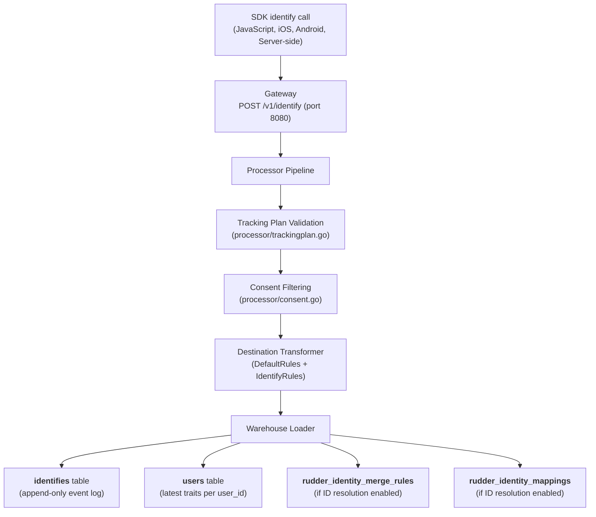

# User Profiles and Traits

RudderStack collects user profile data through [`identify`](../../api-reference/event-spec/identify.md) calls and stores traits as key-value pairs in your data warehouse. Each `identify` call carries a set of **traits** — arbitrary attributes describing a user (such as name, email, plan, or login count) — which are persisted as columns in warehouse tables for downstream querying and activation.

Profiles in RudderStack are **warehouse-centric**: traits flow from SDK `identify` calls through the ingestion pipeline, are transformed by the Processor, and are ultimately loaded into dedicated `identifies` and `users` tables in your configured warehouse destination. This architecture gives your data engineering team direct SQL access to all profile data within your own infrastructure — no separate profile database or proprietary API layer is required.

> **Prerequisite:** Before reading this guide, familiarize yourself with [Identity Resolution](./identity-resolution.md), which covers how RudderStack unifies anonymous and known identities across devices and sessions using merge-rule tables.

**Related documentation:**

- [Identify Event Specification](../../api-reference/event-spec/identify.md) — Payload reference for identify calls
- [Identity Parity Gap Report](../../gap-report/identity-parity.md) — Full Segment Unify comparison
- [Warehouse Overview](../../warehouse/overview.md) — Warehouse service architecture and connector catalog

---

## How User Profiles Work

The RudderStack profile lifecycle follows the standard event pipeline from SDK ingestion through warehouse loading:

1. **SDK / HTTP API Call:** A user sends an `identify` call with traits via an SDK (JavaScript, iOS, Android, server-side) or the HTTP API to the Gateway at port `8080`, endpoint `POST /v1/identify`.

   Source: `gateway/openapi.yaml:15-74` — POST `/v1/identify` endpoint definition

2. **Gateway Ingestion:** The Gateway authenticates the request using WriteKey Basic Auth (`writeKeyAuth`), validates the payload, and writes the event to the `gw` JobsDB partition for downstream processing.

   Source: `gateway/handle_http.go:37-39` — `webIdentifyHandler` wires `callType("identify", writeKeyAuth(webHandler()))`

3. **Processor Pipeline:** The Processor extracts traits from the event, applies tracking plan validation (`processor/trackingplan.go`) for schema enforcement, and runs consent filtering (`processor/consent.go`) to respect user privacy preferences (OneTrust, Ketch, Generic CMP).

4. **Destination Transformer:** The embedded warehouse destination transformer maps event fields and traits to warehouse columns according to the rules defined in the rules engine. For `identify` events, the `IdentifyRules` map defines field extraction for `context_ip`, `context_request_ip`, and `context_passed_ip`, while the `DefaultRules` map provides common fields including `id`, `user_id`, `anonymous_id`, `received_at`, `sent_at`, `timestamp`, `channel`, and `original_timestamp`.

   Source: `processor/internal/transformer/destination_transformer/embedded/warehouse/internal/rules/rules.go:18-33` — DefaultRules define field mappings for all event types
   Source: `processor/internal/transformer/destination_transformer/embedded/warehouse/internal/rules/rules.go:63-79` — IdentifyRules define identify-specific field mappings

5. **Warehouse Loading:** The warehouse loader creates or updates the `identifies` table (append-only, one row per identify call) and the `users` table (deduplicated view with latest trait values per `user_id`). Custom traits are flattened into individual columns through automatic schema evolution.

---

## Profile Data Model

RudderStack stores user profile data across multiple warehouse tables. The following tables are created per source-destination pair in your warehouse schema:

### Core Profile Tables

| Table | Purpose | Write Pattern |
|-------|---------|---------------|
| `identifies` | Stores every `identify` call with the full trait payload as flattened columns | Append-only — one row per identify event |
| `users` | Contains the latest trait values per `user_id` — a deduplicated, merged view of all identify calls for each user | Upsert — updated on each warehouse sync cycle |

The `identifies` table is the immutable event log: every identify call your application sends is recorded with all traits, timestamps, and context fields. The `users` table provides a convenience view containing only the most recent trait values for each `user_id`, making it the primary table for profile lookups.

### Identity Resolution Tables

When identity resolution is enabled, two additional tables are created to support cross-device identity stitching:

| Table | Purpose |
|-------|---------|
| `rudder_identity_merge_rules` | Stores merge-rule pairs mapping identity properties (e.g., `anonymous_id` ↔ `user_id`) |
| `rudder_identity_mappings` | Maps all known identity properties to a unified `rudder_id` |

Source: `warehouse/utils/utils.go:79-80` — `IdentityMergeRulesTable = "rudder_identity_merge_rules"`, `IdentityMappingsTable = "rudder_identity_mappings"`

> **Important:** Identity resolution tables are only created for **Snowflake** and **BigQuery** when `Warehouse.enableIDResolution` is set to `true` (disabled by default).
>
> Source: `warehouse/utils/utils.go:132` — `IdentityEnabledWarehouses = []string{SNOWFLAKE, BQ}`
> Source: `warehouse/utils/utils.go:196` — `enableIDResolution = config.GetBoolVar(false, "Warehouse.enableIDResolution")`

For full details on the identity resolution process, including the `applyRule()` three-way `rudder_id` assignment algorithm, see [Identity Resolution](./identity-resolution.md).

### Profile Data Flow

The following diagram illustrates the end-to-end flow of an `identify` event from SDK ingestion to warehouse profile tables:



---

## Traits

Traits are arbitrary key-value pairs sent in the `traits` object of an `identify` call. They represent pieces of information you know about a user — demographics, preferences, account attributes, behavioral indicators, or any custom data relevant to your application.

RudderStack treats traits as first-class data: each unique trait key becomes a column in your warehouse `identifies` and `users` tables, and all traits are forwarded to downstream destinations (CRM, analytics, marketing tools) via the Router.

### Sending Traits

You can send traits using any RudderStack SDK or the HTTP API directly.

**JavaScript SDK:**

```javascript
rudderanalytics.identify("user123", {
  name: "Jane Doe",
  email: "jane@example.com",
  plan: "enterprise",
  logins: 42,
  company: {
    name: "Acme Corp",
    employee_count: 500
  }
});
```

**HTTP API (curl):**

```bash
curl -X POST https://your-rudderstack-instance:8080/v1/identify \
  -H "Content-Type: application/json" \
  -H "Authorization: Basic <base64(writeKey:)>" \
  -d '{
    "userId": "user123",
    "traits": {
      "name": "Jane Doe",
      "email": "jane@example.com",
      "plan": "enterprise",
      "logins": 42
    }
  }'
```

Source: `gateway/openapi.yaml:15-29` — POST `/v1/identify` requires `writeKeyAuth` Basic Authentication

**Go (server-side):**

```go
package main

import (
    "bytes"
    "encoding/base64"
    "encoding/json"
    "net/http"
)

func sendIdentify(rudderURL, writeKey string) error {
    payload := map[string]interface{}{
        "userId": "user123",
        "traits": map[string]interface{}{
            "name":   "Jane Doe",
            "email":  "jane@example.com",
            "plan":   "enterprise",
            "logins": 42,
        },
    }
    body, err := json.Marshal(payload)
    if err != nil {
        return err
    }
    req, err := http.NewRequest("POST", rudderURL+"/v1/identify", bytes.NewReader(body))
    if err != nil {
        return err
    }
    req.Header.Set("Content-Type", "application/json")
    req.Header.Set("Authorization", "Basic "+base64.StdEncoding.EncodeToString([]byte(writeKey+":")))
    resp, err := http.DefaultClient.Do(req)
    if err != nil {
        return err
    }
    defer resp.Body.Close()
    return nil
}
```

### Reserved Traits

RudderStack honors a set of reserved trait names derived from the Segment Spec. These traits carry semantic meaning and are handled specially by downstream destinations — for example, the `email` trait is used by destinations like Mailchimp that require an email address for user identification.

| Trait | Type | Description |
|-------|------|-------------|
| `address` | Object | Street address of the user, optionally containing: `city`, `country`, `postalCode`, `state`, `street` |
| `age` | Number | Age of the user |
| `avatar` | String | URL to an avatar image for the user |
| `birthday` | Date | User's birthday (ISO 8601 date format recommended) |
| `company` | Object | Company the user represents, optionally containing: `name` (String), `id` (String or Number), `industry` (String), `employee_count` (Number), `plan` (String) |
| `createdAt` | Date | Date the user's account was first created (ISO 8601 date string recommended) |
| `description` | String | Description of the user |
| `email` | String | Email address of the user |
| `firstName` | String | First name of the user |
| `gender` | String | Gender of the user |
| `id` | String | Unique ID in your database for the user |
| `lastName` | String | Last name of the user |
| `name` | String | Full name of the user |
| `phone` | String | Phone number of the user |
| `title` | String | Job title of the user (e.g., "VP of Engineering") |
| `username` | String | Username — should be unique per user (like Twitter or GitHub usernames) |
| `website` | String | Website URL of the user |

Source: Cross-referenced with Segment reserved traits from `refs/segment-docs/src/unify/Traits/custom-traits.md:57-76`

> **Segment Parity:** RudderStack processes reserved traits identically to Segment's handling. All 17 reserved traits are recognized, forwarded to downstream destinations with the same field mappings, and stored as columns in warehouse tables. No migration changes are required for trait handling when switching from Segment to RudderStack.

### Trait Storage in Warehouses

Traits are stored as columns in the warehouse `identifies` and `users` tables through the following mechanisms:

- **Column creation:** Each unique trait key becomes a column in both the `identifies` and `users` tables. When a new trait key is first observed, schema evolution automatically creates the corresponding column in the warehouse.

- **Nested object flattening:** Nested trait objects are flattened using underscore separation. For example, sending `company.name` as a nested trait results in the warehouse column `context_traits_company_name`. This flattening applies recursively to all nested levels.

- **Schema evolution:** The schema handler consolidates staging schemas from incoming events, merges them with the cached warehouse schema, and optionally enhances the schema with identity resolution tables when enabled.

  Source: `warehouse/schema/schema.go:208-225` — Schema consolidation pipeline: `consolidateStagingSchemas()` → `consolidateWarehouseSchema()` → `overrideUsersWithIdentifiesSchema()` → `enhanceDiscardsSchema()` → `enhanceSchemaWithIDResolution()`

- **Type handling:** Trait values are mapped to warehouse-native column types. Strings become `VARCHAR`/`TEXT`, numbers become `INT`/`FLOAT`, booleans become `BOOLEAN`, and dates become `TIMESTAMP`. Type mismatches are handled by the warehouse discard mechanism.

For detailed column type mapping rules per warehouse, see [Schema Evolution](../../warehouse/schema-evolution.md).

---

## Accessing Profile Data

RudderStack provides three primary patterns for accessing user profile data:

### 1. Direct Warehouse Queries (Primary Pattern)

The primary access pattern for profile data is direct SQL queries against your warehouse. The `users` table provides a convenient, deduplicated view of the latest trait values per user.

**Example — Retrieve a user profile:**

```sql
SELECT user_id, email, name, plan, logins, context_traits_company_name
FROM schema_name.users
WHERE user_id = 'user123';
```

**Example — Query full identify event history:**

```sql
SELECT user_id, anonymous_id, email, name, received_at, timestamp
FROM schema_name.identifies
WHERE user_id = 'user123'
ORDER BY received_at DESC;
```

**Example — Join with identity mappings (when ID resolution is enabled):**

```sql
SELECT m.rudder_id, m.merge_property_type, m.merge_property_value, u.email, u.name
FROM schema_name.rudder_identity_mappings m
JOIN schema_name.users u ON m.merge_property_value = u.user_id
WHERE m.rudder_id = '<rudder_id_value>';
```

> **Note:** The `users` table contains the latest trait values per `user_id`. For full trait change history, query the `identifies` table which records every identify call as an immutable event row.

### 2. Warehouse gRPC API (Programmatic Access)

The warehouse service exposes a gRPC API on port `8082` for programmatic interaction with warehouse operations, including triggering syncs, checking upload status, and managing warehouse configurations.

See [Warehouse gRPC API](../../api-reference/warehouse-grpc-api.md) for the full API reference covering all 15 unary RPCs.

### 3. Downstream Destinations (Real-Time Forwarding)

Traits from `identify` calls are forwarded in real-time to all enabled cloud destinations (CRM, analytics, marketing tools, etc.) via the Router. This means profile data is simultaneously available in:

- Your configured warehouse (via the warehouse loading pipeline)
- All connected real-time destinations (via the Router's per-destination delivery workers)

The Router respects destination-specific field mappings, transformation rules, and event filtering configured in your workspace.

---

## Profile Completeness

Building comprehensive user profiles requires a thoughtful instrumentation strategy. The following practices help maximize profile completeness and data quality:

- **Send `identify` calls early and often.** Make an `identify` call when a user registers, logs in, updates their profile, changes their subscription plan, or modifies any key attribute. Each call updates the `users` table with the latest trait values.

- **Include `anonymousId` in all events.** Always include an `anonymousId` alongside `userId` in your events. This enables identity stitching — when identity resolution is enabled, RudderStack generates merge rules to link anonymous sessions with known user identities.

- **Use consistent trait names across all sources.** Trait names are case-sensitive in most warehouses. Sending `email` from one source and `Email` from another creates two separate columns. Standardize on a naming convention (recommended: `snake_case`) and enforce it through tracking plans.

- **Leverage schema evolution.** RudderStack automatically adds new columns when new traits are observed. You do not need to manually modify your warehouse schema — simply start sending new traits and they appear as columns on the next sync cycle.

- **Enrich progressively.** You do not need to send all traits in every `identify` call. RudderStack merges traits across calls for the same `userId` — the `users` table always reflects the latest known values from all sources.

---

## Comparison with Segment Unify Profiles

The following matrix compares RudderStack's profile and traits capabilities against Segment Unify. For the full identity resolution gap analysis, see [Identity Parity Gap Report](../../gap-report/identity-parity.md).

| Feature | Segment Unify | RudderStack | Status |
|---------|---------------|-------------|--------|
| Custom Traits (Identify-based) | ✅ Full support via Identify calls | ✅ Full support via Identify calls | **Parity** |
| Reserved Traits | ✅ 17 reserved traits with semantic handling | ✅ Same 17 reserved traits with identical handling | **Parity** |
| Trait Storage | ✅ Dedicated profile database (real-time) | ✅ Warehouse tables (`identifies` / `users`) | **Architecture differs** |
| Profile API (REST) | ✅ REST API with Basic auth, <200ms response (US/EU endpoints) | ⚠️ Warehouse SQL queries + gRPC API (port 8082) | **Partial — no REST Profile API** |
| Profile Explorer UI | ✅ Web UI for browsing individual user profiles | ❌ Not available | **Gap** |
| Computed Traits | ✅ Event counters, aggregations, most frequent, first/last, unique list | ❌ Not available — achievable via warehouse SQL or dbt | **Gap** |
| SQL Traits | ✅ Warehouse query-based traits imported back into Segment | ❌ Not available — use direct warehouse queries | **Gap** |
| Predictive Traits | ✅ AI/ML-based predictions (churn, LTV, purchase likelihood) | ❌ Not available | **Gap** |
| Trait Destinations | ✅ Real-time trait sync to 300+ destinations | ✅ Trait forwarding via Router to 90+ destinations | **Partial — fewer destinations** |
| Trait History | ✅ Full trait change history via Profile API | ✅ Full history in `identifies` table, latest in `users` | **Parity (different access pattern)** |
| Profile Sync to Warehouses | ✅ Profiles Sync pushes resolved profiles to warehouses | ✅ Native — profiles are warehouse-first | **Parity (architecture advantage)** |

Source: `refs/segment-docs/src/unify/index.md` — Segment Unify feature overview
Source: `refs/segment-docs/src/unify/profile-api.md` — Segment Profile API reference
Source: `refs/segment-docs/src/unify/Traits/computed-traits.md` — Segment Computed Traits
Source: `refs/segment-docs/src/unify/Traits/sql-traits.md` — Segment SQL Traits

### Gap Analysis Notes

**Architecture Difference:** Segment Unify maintains a dedicated real-time profile database backed by a persistent identity graph. Profile data is accessible via a REST API (the Profile API) with sub-200ms response times. RudderStack stores profile data in the customer's own data warehouse, providing full SQL-native access but without a dedicated real-time Profile API service. This is an architectural trade-off: RudderStack's approach gives teams full ownership and flexibility over their profile data at the cost of real-time API access.

**Computed Traits Gap:** Segment Unify offers automated per-user trait computation — event counters, aggregations (sum, average, min, max), most-frequent values, first/last values, and unique list operations — all maintained in real-time as events arrive. RudderStack users can achieve equivalent functionality by writing SQL queries against the `identifies` and `tracks` tables in their warehouse, or by using transformation tools like dbt to compute derived traits.

Source: `refs/segment-docs/src/unify/Traits/computed-traits.md:12-13` — Computed trait types: event counter, aggregation, most frequent, first, last, unique list

**SQL Traits Gap:** Segment SQL Traits allow users to run custom warehouse queries and import the results back into Segment as profile traits. RudderStack users already have direct warehouse access, so the equivalent workflow is to query the warehouse directly or use dbt/materialized views to create derived trait tables.

Source: `refs/segment-docs/src/unify/Traits/sql-traits.md:13` — SQL Traits import warehouse query results into Unify

**Gap Severity:** The Profile REST API and computed traits are classified as **Medium** priority gaps. Custom trait collection, reserved trait handling, and trait forwarding to destinations are at full parity. The warehouse-first architecture provides a distinct advantage for teams that prefer direct data access.

For the complete gap analysis with remediation recommendations, see [Identity Parity Gap Report](../../gap-report/identity-parity.md).

---

## Configuration

The following configuration parameters affect profile and identity resolution behavior:

| Parameter | Default | Type | Description |
|-----------|---------|------|-------------|
| `Warehouse.enableIDResolution` | `false` | bool | Enable identity merge rules and mappings tables in the warehouse schema. When enabled, `rudder_identity_merge_rules` and `rudder_identity_mappings` tables are created during warehouse sync. |

Source: `warehouse/utils/utils.go:196` — `enableIDResolution = config.GetBoolVar(false, "Warehouse.enableIDResolution")`

> **Supported Warehouses for Identity Resolution:** When `Warehouse.enableIDResolution` is set to `true`, identity resolution tables are created **only** for Snowflake and BigQuery. Other warehouse types (Redshift, ClickHouse, Databricks, PostgreSQL, MSSQL, Azure Synapse, Datalake) do not support identity resolution tables.
>
> Source: `warehouse/utils/utils.go:132` — `IdentityEnabledWarehouses = []string{SNOWFLAKE, BQ}`

For the complete configuration parameter reference including all warehouse, processor, router, and gateway settings, see [Configuration Reference](../../reference/config-reference.md).

---

## Best Practices

### 1. Consistent Trait Naming

Use `snake_case` for all trait names across all sources and SDKs. Trait names are case-sensitive in most warehouses — inconsistent naming (e.g., `firstName` from one source and `first_name` from another) creates separate columns. Enforce naming conventions through [tracking plans](../governance/tracking-plans.md) to control schema sprawl.

### 2. Send Identify Early and Often

Call `identify` at key lifecycle moments:

- **User registration** — Capture initial profile traits (name, email, plan)
- **User login** — Associate the anonymous session with the known user
- **Profile updates** — Record changes to contact details, plan, or preferences
- **Subscription changes** — Track plan upgrades, downgrades, or cancellations

Each `identify` call updates the `users` table with the latest trait values on the next warehouse sync cycle.

### 3. Include Anonymous ID

Always include an `anonymousId` in your events alongside `userId`. This is critical for identity stitching — when identity resolution is enabled, RudderStack uses the `anonymousId` ↔ `userId` pair to generate merge rules that link anonymous pre-login sessions with authenticated post-login profiles.

### 4. Flatten Complex Objects

Nested trait objects (e.g., `company.name`) are automatically flattened to underscore-separated column names (e.g., `context_traits_company_name`). For cleaner warehouse schemas, consider sending flat trait structures when possible. This avoids deeply nested column names and simplifies downstream queries.

### 5. Monitor Schema Growth

Each unique trait key creates a new column in your warehouse. Over time, uncontrolled instrumentation can lead to schema bloat with hundreds of columns. Use tracking plans to define the expected trait schema and block unexpected traits from creating columns.

---

## Troubleshooting

### Traits Not Appearing in Warehouse

1. **Verify events reach the Gateway.** Send a test `identify` call using curl and confirm you receive a `200 OK` response from `POST /v1/identify`.
2. **Check warehouse sync status.** Traits are loaded during warehouse sync cycles, not in real-time. Verify the warehouse upload is completing successfully (check the warehouse service logs or the gRPC API on port 8082).
3. **Confirm warehouse destination is enabled.** Verify that a warehouse destination is configured and enabled in your workspace configuration.
4. **Check for tracking plan blocks.** If a tracking plan is configured, verify that the `identify` event type and the specific traits are allowed by the plan's schema.

### Duplicate Columns in Warehouse

Inconsistent trait naming causes separate columns. For example, `email` and `Email` are distinct columns in case-sensitive warehouses (Snowflake, BigQuery, ClickHouse). Audit your instrumentation across all sources and standardize on a single naming convention. Use tracking plans to enforce consistent trait names.

### Identity Merge Rules Not Created

1. **Verify `Warehouse.enableIDResolution` is `true`** in your configuration (`config/config.yaml` or via the `RSERVER_WAREHOUSE_ENABLE_ID_RESOLUTION` environment variable).
2. **Confirm warehouse type is supported.** Identity resolution tables are only created for Snowflake and BigQuery. Other warehouse types do not support identity resolution.
3. **Check that events contain both `anonymousId` and `userId`.** Merge rules are only generated when both identifiers are present in the same event.

### Users Table Not Updating

The `users` table is refreshed during each warehouse sync cycle. If traits appear in the `identifies` table but not in `users`, the sync may still be in progress. Check the warehouse upload state and wait for the current cycle to complete.

---

## Related Resources

- [Identity Resolution Guide](./identity-resolution.md) — Cross-touchpoint identity unification with merge-rule resolution
- [Identify Event Specification](../../api-reference/event-spec/identify.md) — Identify call payload reference and response codes
- [Alias Event Specification](../../api-reference/event-spec/alias.md) — Alias call for explicit identity merging
- [Warehouse Overview](../../warehouse/overview.md) — Warehouse service architecture and connector catalog
- [Schema Evolution](../../warehouse/schema-evolution.md) — Automatic schema management and column type mapping
- [Identity Parity Gap Report](../../gap-report/identity-parity.md) — Full Segment Unify parity analysis
- [Configuration Reference](../../reference/config-reference.md) — All 200+ configuration parameters
- [Glossary](../../reference/glossary.md) — Unified terminology reference (RudderStack + Segment terms)
