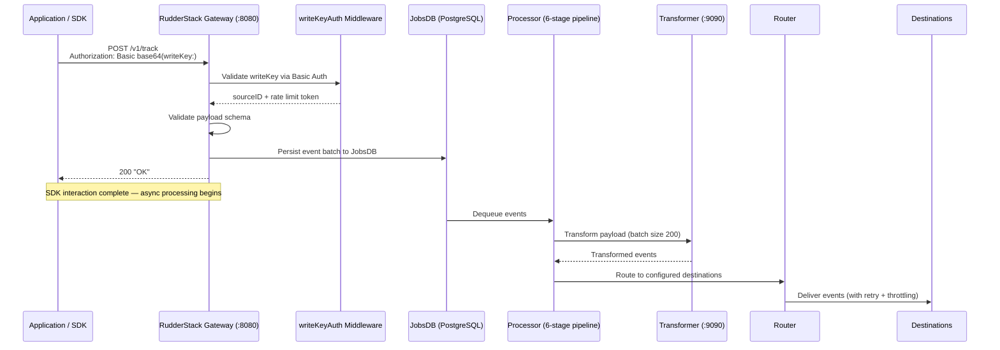

# SDK Swap Guide: Segment to RudderStack

Step-by-step guide for replacing Segment SDK libraries with RudderStack-compatible SDK initialization targeting the RudderStack data plane. This document is the foundational migration reference — it covers initialization pattern changes, endpoint configuration, authentication scheme migration, and event transmission compatibility for every supported SDK platform.

**Key insight:** RudderStack's Gateway exposes a **Segment-compatible HTTP API**. All six core event types (`identify`, `track`, `page`, `screen`, `group`, `alias`) use identical payload schemas. The only required SDK changes are the **endpoint URL** and **write key**. Event payload structure, field names, and semantics remain identical.

> Source: `gateway/openapi.yaml:1-4` (OpenAPI 3.0.3 Segment-compatible endpoint structure)

**Platforms covered:**

| Platform | SDK | Section |
|----------|-----|---------|
| Web | JavaScript (`@rudderstack/analytics-js`) | [JavaScript (Web) SDK](#javascript-web-sdk) |
| iOS | Swift / Objective-C (`Rudder`) | [iOS SDK](#ios-sdk) |
| Android | Kotlin / Java (`com.rudderstack.android.sdk:core`) | [Android SDK](#android-sdk) |
| Node.js | `@rudderstack/rudder-sdk-node` | [Node.js](#nodejs) |
| Python | `rudder-sdk-python` | [Python](#python) |
| Go | `github.com/rudderlabs/analytics-go` | [Go](#go) |
| Java | `com.rudderstack.sdk.java:analytics` | [Java](#java) |
| Ruby | `rudder_analytics_sync` | [Ruby](#ruby) |
| HTTP API | curl / any HTTP client | [Direct HTTP API](#direct-http-api) |

**How this guide is organized:**

Each SDK section follows a consistent structure:

1. **Prerequisites** — what you need before starting
2. **Package replacement** — remove Segment, install RudderStack
3. **Initialization change** — before/after code examples
4. **API method mapping** — method-by-method equivalence table
5. **Verification steps** — how to confirm the swap works
6. **Platform-specific notes** — features unique to each platform

**Related documentation:**

- [Segment Migration Guide](./segment-migration.md) — complete migration walkthrough
- [API Overview and Authentication](../../api-reference/index.md) — full authentication scheme details
- [Event Spec — Common Fields](../../api-reference/event-spec/common-fields.md) — shared payload fields
- [Glossary](../../reference/glossary.md) — unified terminology

---

## Table of Contents

- [SDK Communication Architecture](#sdk-communication-architecture)
- [Authentication](#authentication)
- [JavaScript (Web) SDK](#javascript-web-sdk)
- [iOS SDK](#ios-sdk)
- [Android SDK](#android-sdk)
- [Server-Side SDKs](#server-side-sdks)
  - [Node.js](#nodejs)
  - [Python](#python)
  - [Go](#go)
  - [Java](#java)
  - [Ruby](#ruby)
- [Direct HTTP API](#direct-http-api)
- [Configuration Reference](#configuration-reference)
- [Rollback Plan](#rollback-plan)
- [Troubleshooting](#troubleshooting)
- [Related Documentation](#related-documentation)

---

## SDK Communication Architecture

All SDKs communicate with the RudderStack Gateway over HTTP. The Gateway validates authentication, persists events to the durable JobsDB queue, and returns `200 OK` before any downstream processing begins. This means SDK integration is decoupled from destination delivery — events are accepted immediately and processed asynchronously.



> Source: `gateway/handle_http.go:77-99` (webHandler → webRequestHandler chain)
>
> Source: `gateway/handle_http_auth.go:24-57` (writeKeyAuth middleware flow)

**Gateway as the compatibility layer:**

- All public SDK events enter via **port 8080** on the data plane
- Authentication uses **HTTP Basic Auth** with the write key as username and an empty password — this is **identical to Segment's authentication scheme**
- Event payloads follow the **Segment Spec** structure: `userId`, `anonymousId`, `context`, `properties`, `traits`, `timestamp`, `type`
- The Gateway validates, batches (configurable batch size), and persists events to a durable PostgreSQL-backed queue before returning `200 OK`
- No SDK-side processing changes are needed — all transformation, routing, and delivery happens server-side
- Additional RudderStack-only endpoints: `/beacon/v1/*` (sendBeacon API), `/pixel/v1/*` (1×1 GIF pixel tracking)

> Source: `gateway/openapi.yaml:14-435` (7 public POST endpoints with writeKeyAuth security)

---

## Authentication

Understanding authentication is critical for a successful SDK swap. RudderStack implements five authentication schemes, but **only one is relevant to SDK traffic**: `writeKeyAuth`.

### Primary Scheme: writeKeyAuth (Used by All SDKs)

All SDK traffic uses HTTP Basic Authentication with the **write key as the username** and an **empty password**. This is identical to Segment's authentication mechanism.

```
Authorization: Basic base64("<WRITE_KEY>:")
```

**How it works internally:**

1. The Gateway extracts the write key from the `Authorization` header using Go's `r.BasicAuth()` method
2. The write key is validated against the `enabledWriteKeySourceMap` (populated from backend-config)
3. If the write key is valid and the source is enabled, the request is enriched with source metadata (`sourceID`, `workspaceID`, `sourceName`, `sourceCategory`) and passed to the handler
4. If the write key is invalid or missing, the request is rejected with `401 Unauthorized`

> Source: `gateway/handle_http_auth.go:24-57` (writeKeyAuth implementation)

**Endpoint coverage for writeKeyAuth:**

| Endpoint | HTTP Method | Handler | Auth |
|----------|-------------|---------|------|
| `/v1/identify` | POST | `webIdentifyHandler` | writeKeyAuth |
| `/v1/track` | POST | `webTrackHandler` | writeKeyAuth |
| `/v1/page` | POST | `webPageHandler` | writeKeyAuth |
| `/v1/screen` | POST | `webScreenHandler` | writeKeyAuth |
| `/v1/group` | POST | `webGroupHandler` | writeKeyAuth |
| `/v1/alias` | POST | `webAliasHandler` | writeKeyAuth |
| `/v1/batch` | POST | `webBatchHandler` | writeKeyAuth |
| `/v1/merge` | POST | `webMergeHandler` | writeKeyAuth |
| `/v1/import` | POST | `webImportHandler` | writeKeyAuth |
| `/beacon/v1/*` | POST | Beacon handler | writeKeyAuth |
| `/pixel/v1/*` | GET | Pixel handler | writeKeyAuth |

> Source: `gateway/handle_http.go:24-69` (handler registration with writeKeyAuth)

### Secondary Scheme: webhookAuth (Not Used by SDKs)

For webhook source ingestion only. Accepts the write key via query parameter `?writeKey=xxx` or via Basic Auth. The source must have category `"webhook"`.

> Source: `gateway/handle_http_auth.go:64-96`

### Internal Schemes (Not Used by SDKs)

These authentication schemes are used for internal server-to-server communication and are never relevant to SDK migrations:

| Scheme | Header | Usage |
|--------|--------|-------|
| `sourceIDAuth` | `X-Rudder-Source-Id` | Internal endpoints: extract, internal batch |
| `authDestIDForSource` | `X-Rudder-Destination-Id` | Reverse ETL, audience list endpoints |
| `replaySourceIDAuth` | `X-Rudder-Source-Id` | Replay endpoint (validated as replay source) |

> Source: `gateway/handle_http_auth.go:98-194`

### Auth Migration Summary

| Feature | Segment | RudderStack | Change Required |
|---------|---------|-------------|-----------------|
| Auth method | HTTP Basic Auth | HTTP Basic Auth | **None** |
| Credential format | `writeKey:` (empty password) | `writeKey:` (empty password) | **None** |
| Write key source | Segment workspace dashboard | RudderStack workspace / control plane | **Replace write key value** |
| Header format | `Authorization: Basic base64(writeKey:)` | `Authorization: Basic base64(writeKey:)` | **None** |
| Rate limiting | Segment-managed | Gateway-managed (configurable via `config.yaml`) | Server-side configuration |

> The authentication protocol is byte-for-byte identical. The only change is the write key value itself.

---

## JavaScript (Web) SDK

### Prerequisites

Before starting the JavaScript SDK swap, ensure you have:

- [ ] RudderStack data plane URL (e.g., `https://your-data-plane.example.com`) and port (default: `8080`)
- [ ] RudderStack source write key (from your RudderStack workspace)
- [ ] Node.js / npm environment (if using the npm package)
- [ ] Access to update your website's HTML or bundled JavaScript

### Step 1: Package Replacement

**NPM package swap:**

```bash
# Remove Segment SDK
npm uninstall @segment/analytics-next analytics.js

# Install RudderStack SDK
npm install @rudderstack/analytics-js
```

### Step 2: Initialization Change

**CDN snippet replacement:**

```html
<!-- ============================================ -->
<!-- BEFORE (Segment analytics.js CDN snippet)    -->
<!-- ============================================ -->
<script>
  !function(){var analytics=window.analytics=window.analytics||[];
  if(!analytics.initialize)if(analytics.invoked)window.console&&console.error&&console.error("Segment snippet included twice.");
  else{analytics.invoked=!0;analytics.methods=["trackSubmit","trackClick","trackLink","trackForm","pageview","identify","reset","group","track","ready","alias","debug","page","screen","once","off","on","addSourceMiddleware","addIntegrationMiddleware","setAnonymousId","addDestinationMiddleware","register"];
  analytics.factory=function(e){return function(){if(window.analytics.initialized)return window.analytics[e].apply(window.analytics,arguments);var i=Array.prototype.slice.call(arguments);i.unshift(e);analytics.push(i);return analytics}};
  for(var i=0;i<analytics.methods.length;i++){var key=analytics.methods[i];analytics[key]=analytics.factory(key)}
  analytics.load=function(key,e){var t=document.createElement("script");t.type="text/javascript";t.async=!0;t.setAttribute("data-global-segment-analytics-key","analytics");t.src="https://cdn.segment.com/analytics.js/v1/"+key+"/analytics.min.js";var n=document.getElementsByTagName("script")[0];n.parentNode.insertBefore(t,n);analytics._loadOptions=e};
  analytics._writeKey="SEGMENT_WRITE_KEY";
  analytics.load("SEGMENT_WRITE_KEY");
  analytics.page();
  }}();
</script>

<!-- ============================================ -->
<!-- AFTER (RudderStack JS SDK CDN snippet)       -->
<!-- ============================================ -->
<script>
  rudderanalytics=window.rudderanalytics=[];
  var methods=["setDefaultInstanceKey","load","ready","page","track","identify","alias","group","screen","reset","getAnonymousId","setAnonymousId"];
  for(var i=0;i<methods.length;i++){var method=methods[i];rudderanalytics[method]=function(a){return function(){rudderanalytics.push([a].concat(Array.prototype.slice.call(arguments)))}}(method)}
  rudderanalytics.load("RUDDERSTACK_WRITE_KEY","https://YOUR_DATA_PLANE_URL:8080");
  rudderanalytics.page();
</script>
<script src="https://cdn.rudderlabs.com/v3/modern/rsa.min.js"></script>
```

**NPM module replacement:**

```javascript
// ============================================
// BEFORE (Segment @segment/analytics-next)
// ============================================
import { AnalyticsBrowser } from '@segment/analytics-next'

const analytics = AnalyticsBrowser.load({
  writeKey: 'SEGMENT_WRITE_KEY'
})

await analytics.identify('user-123', { name: 'Jane Doe', email: 'jane@example.com' })
await analytics.track('Order Completed', { orderId: 'order-456', revenue: 99.99 })

// ============================================
// AFTER (RudderStack @rudderstack/analytics-js)
// ============================================
import { RudderAnalytics } from '@rudderstack/analytics-js'

const rudderanalytics = new RudderAnalytics()
rudderanalytics.load('RUDDERSTACK_WRITE_KEY', 'https://YOUR_DATA_PLANE_URL:8080')

rudderanalytics.identify('user-123', { name: 'Jane Doe', email: 'jane@example.com' })
rudderanalytics.track('Order Completed', { orderId: 'order-456', revenue: 99.99 })
```

### Step 3: API Method Mapping

All event API methods have **identical signatures and semantics**:

| Segment Method | RudderStack Method | Signature Parity | Notes |
|----------------|-------------------|------------------|-------|
| `analytics.identify(userId, traits)` | `rudderanalytics.identify(userId, traits)` | ✅ Identical | `traits` object schema identical |
| `analytics.track(event, properties)` | `rudderanalytics.track(event, properties)` | ✅ Identical | `properties` object schema identical |
| `analytics.page(category, name, props)` | `rudderanalytics.page(category, name, props)` | ✅ Identical | Auto-captures `url`, `title`, `referrer`, `path`, `search` |
| `analytics.screen(name, props)` | `rudderanalytics.screen(name, props)` | ✅ Identical | Rarely used in web context |
| `analytics.group(groupId, traits)` | `rudderanalytics.group(groupId, traits)` | ✅ Identical | Group `traits` schema identical |
| `analytics.alias(newId, oldId)` | `rudderanalytics.alias(newId, oldId)` | ✅ Identical | Maps to `userId` / `previousId` |
| `analytics.reset()` | `rudderanalytics.reset()` | ✅ Identical | Clears `anonymousId` and cached traits |

> Reference: `refs/segment-docs/src/connections/spec/common.md` (common fields specification)
>
> Source: `gateway/openapi.yaml:688-939` (payload schemas — IdentifyPayload, TrackPayload, PagePayload, ScreenPayload, GroupPayload, AliasPayload)

### RudderStack-Only Features (Web)

RudderStack's JavaScript SDK supports two additional tracking mechanisms not available in the standard Segment analytics.js:

**Beacon support (`/beacon/v1/*`):**

The RudderStack Gateway supports `navigator.sendBeacon()` via `/beacon/v1/*` endpoints. This is useful for reliable page unload tracking (`beforeunload`, `pagehide` events) where `XMLHttpRequest` may be cancelled by the browser.

```javascript
// The RudderStack JS SDK can be configured to use sendBeacon for page unload events
rudderanalytics.load('RUDDERSTACK_WRITE_KEY', 'https://YOUR_DATA_PLANE_URL:8080', {
  useBeacon: true  // Enables sendBeacon for event delivery
})
```

> Source: `gateway/handle_http.go` (beacon handler registration)

**Pixel tracking (`/pixel/v1/*`):**

RudderStack supports 1×1 transparent GIF pixel tracking via `GET /pixel/v1/*` endpoints. This is useful for email open tracking and environments where JavaScript execution is unavailable.

```html
<!-- Pixel tracking for email open events -->

```

> Source: `gateway/handle_http.go` (pixel handler registration)

### Verification Steps (Web)

After completing the SDK swap, verify the integration:

1. Open browser **DevTools → Network** tab
2. Filter requests by your data plane URL (e.g., `YOUR_DATA_PLANE_URL:8080`)
3. Trigger an `identify` call on your page
4. Verify the request:
   - **URL**: `https://YOUR_DATA_PLANE_URL:8080/v1/identify`
   - **Method**: `POST`
   - **Authorization header**: `Basic <base64(writeKey:)>`
   - **Response status**: `200 OK`
   - **Response body**: `"OK"`
5. Trigger `track` and `page` calls and verify the same pattern
6. Inspect the request payload — it should match the [Common Fields](../../api-reference/event-spec/common-fields.md) specification with `userId` or `anonymousId`, `type`, `context`, and `timestamp` fields

> For complete JavaScript SDK documentation, see: [JavaScript SDK Guide](../sources/javascript-sdk.md)

---

## iOS SDK

### Prerequisites

Before starting the iOS SDK swap, ensure you have:

- [ ] RudderStack data plane URL and write key
- [ ] Xcode with Swift Package Manager (SPM) or CocoaPods configured
- [ ] Minimum deployment target compatible with RudderStack iOS SDK

### Step 1: Package Replacement

**CocoaPods:**

```ruby
# Podfile — BEFORE (Segment)
pod 'Analytics', '~> 4.0'

# Podfile — AFTER (RudderStack)
pod 'Rudder', '~> 1.0'
```

Then run:

```bash
pod install
```

**Swift Package Manager:**

```swift
// Package.swift — BEFORE (Segment)
.package(url: "https://github.com/segmentio/analytics-swift.git", from: "1.0.0")

// Package.swift — AFTER (RudderStack)
.package(url: "https://github.com/rudderlabs/rudder-sdk-ios.git", from: "1.0.0")
```

### Step 2: Initialization Change

**Swift:**

```swift
// ============================================
// BEFORE (Segment Analytics-Swift)
// ============================================
import Segment

let config = Configuration(writeKey: "SEGMENT_WRITE_KEY")
    .trackApplicationLifecycleEvents(true)
    .flushInterval(30)
let analytics = Analytics(configuration: config)

// ============================================
// AFTER (RudderStack iOS SDK)
// ============================================
import Rudder

let config = RSConfig(writeKey: "RUDDERSTACK_WRITE_KEY")
    .dataPlaneURL("https://YOUR_DATA_PLANE_URL:8080")
    .trackLifecycleEvents(true)
    .flushQueueSize(30)
let client = RSClient.sharedInstance()
client.configure(with: config)
```

**Objective-C:**

```objc
// ============================================
// BEFORE (Segment Analytics-iOS)
// ============================================
#import <Analytics/SEGAnalytics.h>

SEGAnalyticsConfiguration *config = [SEGAnalyticsConfiguration configurationWithWriteKey:@"SEGMENT_WRITE_KEY"];
config.trackApplicationLifecycleEvents = YES;
config.flushAt = 20;
[SEGAnalytics setupWithConfiguration:config];

// ============================================
// AFTER (RudderStack iOS SDK)
// ============================================
#import <Rudder/Rudder.h>

RSConfig *config = [[RSConfig alloc] initWithWriteKey:@"RUDDERSTACK_WRITE_KEY"];
[config dataPlaneURL:@"https://YOUR_DATA_PLANE_URL:8080"];
[config trackLifecycleEvents:YES];
[config flushQueueSize:20];
[RSClient sharedInstanceWithConfig:config];
```

### Step 3: API Method Mapping (iOS)

**Swift method mapping:**

| Segment (Swift) | RudderStack (Swift) | Parity |
|-----------------|---------------------|--------|
| `analytics.identify(userId: "u1", traits: ["name": "Jane"])` | `client.identify("u1", traits: ["name": "Jane"])` | ✅ Identical semantics |
| `analytics.track(name: "Order Completed", properties: ["revenue": 99.99])` | `client.track("Order Completed", properties: ["revenue": 99.99])` | ✅ Identical semantics |
| `analytics.screen(title: "Home", properties: [:])` | `client.screen("Home", properties: [:])` | ✅ Identical semantics |
| `analytics.group(groupId: "g1", traits: ["name": "Acme"])` | `client.group("g1", traits: ["name": "Acme"])` | ✅ Identical semantics |
| `analytics.alias(newId: "user-123")` | `client.alias("user-123")` | ✅ Identical semantics |
| `analytics.reset()` | `client.reset()` | ✅ Identical |

### iOS-Specific Considerations

**Lifecycle event tracking:**

Both Segment and RudderStack iOS SDKs support automatic application lifecycle event tracking (`Application Opened`, `Application Installed`, `Application Updated`, `Application Backgrounded`). Ensure `trackLifecycleEvents` is enabled in the RudderStack config to maintain behavioral parity.

**Event queue and flush behavior:**

| Config | Segment | RudderStack | Notes |
|--------|---------|-------------|-------|
| Flush queue size | `flushAt` (default: 20) | `flushQueueSize` (default: 30) | Number of events before auto-flush |
| Flush interval | `flushInterval` (default: 30s) | `sleepTimeout` (default: 10s) | Time between flush attempts |
| Max queue size | `maxQueueSize` | `dbCountThreshold` (default: 10000) | Max events stored locally |

**IDFA / App Tracking Transparency (ATT):**

If you previously collected IDFA via Segment's `analytics-ios` `SEGAdSupportIntegration`, the equivalent in RudderStack requires adding the IDFA collection plugin separately. The core SDK does not collect IDFA by default in compliance with Apple's ATT framework.

### Verification Steps (iOS)

1. Run the app on a device or simulator
2. Use **Charles Proxy**, **Proxyman**, or Xcode's **Network Inspector** to inspect HTTPS traffic
3. Filter requests to `YOUR_DATA_PLANE_URL:8080`
4. Trigger `identify`, `track`, and `screen` calls from the app
5. Verify:
   - Requests go to `/v1/identify`, `/v1/track`, `/v1/screen`
   - `Authorization` header contains valid Basic Auth with your RudderStack write key
   - Response status is `200 OK`
   - Payload structure matches the [Segment Spec event schema](../../api-reference/event-spec/common-fields.md)

> For complete iOS SDK documentation, see: [iOS SDK Guide](../sources/ios-sdk.md)

---

## Android SDK

### Prerequisites

Before starting the Android SDK swap, ensure you have:

- [ ] RudderStack data plane URL and write key
- [ ] Android Studio with Gradle build system
- [ ] Minimum SDK version compatible with the RudderStack Android SDK

### Step 1: Package Replacement

**Gradle (build.gradle or build.gradle.kts):**

```groovy
// build.gradle — BEFORE (Segment)
dependencies {
    implementation 'com.segment.analytics.android:analytics:4.+'
}

// build.gradle — AFTER (RudderStack)
dependencies {
    implementation 'com.rudderstack.android.sdk:core:1.+'
}

// RudderStack packages are published to Maven Central:
repositories {
    mavenCentral()
    // Note: The legacy Bintray repository (dl.bintray.com) was sunset in May 2021.
    // All RudderStack Android SDK versions from 1.0.10+ are available exclusively on Maven Central.
}
```

Then sync your Gradle project.

### Step 2: Initialization Change

**Kotlin:**

```kotlin
// ============================================
// BEFORE (Segment Android SDK)
// ============================================
import com.segment.analytics.Analytics

class MyApplication : Application() {
    override fun onCreate() {
        super.onCreate()
        val analytics = Analytics.Builder(this, "SEGMENT_WRITE_KEY")
            .trackApplicationLifecycleEvents()
            .flushQueueSize(20)
            .build()
        Analytics.setSingletonInstance(analytics)
    }
}

// ============================================
// AFTER (RudderStack Android SDK)
// ============================================
import com.rudderstack.android.sdk.core.RudderClient
import com.rudderstack.android.sdk.core.RudderConfig

class MyApplication : Application() {
    companion object {
        lateinit var rudderClient: RudderClient
    }

    override fun onCreate() {
        super.onCreate()
        rudderClient = RudderClient.getInstance(
            this,
            "RUDDERSTACK_WRITE_KEY",
            RudderConfig.Builder()
                .withDataPlaneUrl("https://YOUR_DATA_PLANE_URL:8080")
                .withTrackLifecycleEvents(true)
                .withFlushQueueSize(20)
                .build()
        )
    }
}
```

**Java:**

```java
// ============================================
// BEFORE (Segment Android SDK)
// ============================================
import com.segment.analytics.Analytics;

public class MyApplication extends Application {
    @Override
    public void onCreate() {
        super.onCreate();
        Analytics analytics = new Analytics.Builder(this, "SEGMENT_WRITE_KEY")
            .trackApplicationLifecycleEvents()
            .flushQueueSize(20)
            .build();
        Analytics.setSingletonInstance(analytics);
    }
}

// ============================================
// AFTER (RudderStack Android SDK)
// ============================================
import com.rudderstack.android.sdk.core.RudderClient;
import com.rudderstack.android.sdk.core.RudderConfig;

public class MyApplication extends Application {
    private static RudderClient rudderClient;

    @Override
    public void onCreate() {
        super.onCreate();
        rudderClient = RudderClient.getInstance(
            this,
            "RUDDERSTACK_WRITE_KEY",
            new RudderConfig.Builder()
                .withDataPlaneUrl("https://YOUR_DATA_PLANE_URL:8080")
                .withTrackLifecycleEvents(true)
                .withFlushQueueSize(20)
                .build()
        );
    }

    public static RudderClient getRudderClient() {
        return rudderClient;
    }
}
```

### Step 3: API Method Mapping (Android)

**Kotlin method mapping:**

| Segment (Kotlin) | RudderStack (Kotlin) | Parity |
|-------------------|---------------------|--------|
| `Analytics.with(context).identify("u1", Traits().putName("Jane"), null)` | `rudderClient.identify("u1", RudderTraits().putName("Jane"), null)` | ✅ Identical semantics |
| `Analytics.with(context).track("Order Completed", Properties().putRevenue(99.99))` | `rudderClient.track("Order Completed", RudderProperty().putValue("revenue", 99.99))` | ✅ Identical semantics |
| `Analytics.with(context).screen("Home", "Main", Properties())` | `rudderClient.screen("Home", "Main", RudderProperty())` | ✅ Identical semantics |
| `Analytics.with(context).group("g1", Traits().putName("Acme"))` | `rudderClient.group("g1", RudderTraits().putName("Acme"))` | ✅ Identical semantics |
| `Analytics.with(context).alias("user-123")` | `rudderClient.alias("user-123")` | ✅ Identical semantics |
| `Analytics.with(context).reset()` | `rudderClient.reset()` | ✅ Identical |

### Android-Specific Considerations

**Application class initialization:**

Both Segment and RudderStack Android SDKs should be initialized in the `Application.onCreate()` method to ensure the SDK is available throughout the app lifecycle. Do not initialize in individual `Activity` classes.

**Event queue flush on background/kill:**

The RudderStack Android SDK automatically flushes queued events when the app transitions to the background or is killed. The flush behavior can be tuned via `RudderConfig.Builder` options:

| Config | Segment | RudderStack | Notes |
|--------|---------|-------------|-------|
| Flush queue size | `flushQueueSize` (default: 20) | `withFlushQueueSize` (default: 30) | Events before auto-flush |
| Flush interval | `flushInterval` (default: 30s) | `withSleepCount` (default: 10s) | Time between flush cycles |
| Max DB size | Not configurable | `withDbThresholdCount` (default: 10000) | Max events in local SQLite DB |

**ProGuard / R8 rules:**

If you use code shrinking, add ProGuard rules for the RudderStack SDK:

```proguard
# RudderStack SDK ProGuard rules
-keep class com.rudderstack.android.sdk.** { *; }
-dontwarn com.rudderstack.android.sdk.**
```

### Verification Steps (Android)

1. Run the app on an emulator or physical device
2. Use **Android Studio Network Inspector** or filter `logcat` with tag `RudderStack`
3. Trigger `identify`, `track`, and `screen` calls
4. Verify:
   - Events POST to `https://YOUR_DATA_PLANE_URL:8080/v1/identify` (or `/v1/track`, `/v1/screen`)
   - Response status is `200 OK`
   - Payload contains `userId` or `anonymousId`, `type`, `context` (with `library`, `os`, `device`, `screen`, `network` auto-populated)

> For complete Android SDK documentation, see: [Android SDK Guide](../sources/android-sdk.md)

---

## Server-Side SDKs

Server-side SDKs send events directly from your backend services. The migration pattern is consistent across all server-side languages: **replace the package, change the initialization (add data plane URL), and keep all event calls identical**.

All server-side SDKs use the same HTTP Basic Auth mechanism and the same payload format as the client-side SDKs.

> Source: `gateway/handle_http_auth.go:24-57` (same writeKeyAuth applies to all SDK traffic)

### Node.js

#### Package Replacement

```bash
# Remove Segment
npm uninstall analytics-node @segment/analytics-node

# Install RudderStack
npm install @rudderstack/rudder-sdk-node
```

#### Initialization Change

```javascript
// ============================================
// BEFORE (Segment analytics-node)
// ============================================
const Analytics = require('analytics-node')
const analytics = new Analytics('SEGMENT_WRITE_KEY')

// ============================================
// AFTER (RudderStack rudder-sdk-node)
// ============================================
const Analytics = require('@rudderstack/rudder-sdk-node')
const analytics = new Analytics('RUDDERSTACK_WRITE_KEY', {
  dataPlaneUrl: 'https://YOUR_DATA_PLANE_URL:8080'
})
```

#### Event Calls (Identical for Both)

```javascript
// These calls are IDENTICAL for both Segment and RudderStack SDKs.
// The only difference is the SDK initialization above.

analytics.identify({
  userId: 'user-123',
  traits: {
    name: 'Jane Doe',
    email: 'jane@example.com',
    plan: 'enterprise'
  }
})

analytics.track({
  userId: 'user-123',
  event: 'Order Completed',
  properties: {
    orderId: 'order-456',
    revenue: 99.99,
    currency: 'USD'
  }
})

analytics.page({
  userId: 'user-123',
  name: 'Home',
  properties: {
    url: 'https://example.com',
    referrer: 'https://google.com'
  }
})

analytics.screen({
  userId: 'user-123',
  name: 'Dashboard'
})

analytics.group({
  userId: 'user-123',
  groupId: 'company-789',
  traits: {
    name: 'Acme Corp',
    plan: 'enterprise',
    employees: 150
  }
})

analytics.alias({
  userId: 'user-123',
  previousId: 'anonymous-456'
})
```

#### Graceful Shutdown

```javascript
// Flush all queued events before process exit
process.on('SIGTERM', async () => {
  await analytics.flush()
  process.exit(0)
})
```

### Python

#### Package Replacement

```bash
# Remove Segment
pip uninstall analytics-python

# Install RudderStack
pip install rudder-sdk-python
```

#### Initialization Change

```python
# ============================================
# BEFORE (Segment analytics-python)
# ============================================
import analytics
analytics.write_key = 'SEGMENT_WRITE_KEY'

# ============================================
# AFTER (RudderStack rudder-sdk-python)
# ============================================
import rudderstack.analytics as analytics
analytics.write_key = 'RUDDERSTACK_WRITE_KEY'
analytics.dataPlaneUrl = 'https://YOUR_DATA_PLANE_URL:8080'
```

#### Event Calls (Identical for Both)

```python
# These calls are IDENTICAL for both Segment and RudderStack SDKs.

analytics.identify('user-123', {
    'name': 'Jane Doe',
    'email': 'jane@example.com'
})

analytics.track('user-123', 'Order Completed', {
    'orderId': 'order-456',
    'revenue': 99.99,
    'currency': 'USD'
})

analytics.page('user-123', 'Docs', 'SDK Guide', {
    'url': 'https://example.com/docs'
})

analytics.screen('user-123', 'Dashboard')

analytics.group('user-123', 'company-789', {
    'name': 'Acme Corp',
    'plan': 'enterprise'
})

analytics.alias('anonymous-456', 'user-123')
```

#### Graceful Shutdown

```python
import atexit
atexit.register(analytics.flush)
```

### Go

#### Package Replacement

```go
// go.mod — BEFORE (Segment)
require github.com/segmentio/analytics-go/v3

// go.mod — AFTER (RudderStack)
require github.com/rudderlabs/analytics-go
```

Then run:

```bash
go mod tidy
```

#### Initialization Change

```go
// ============================================
// BEFORE (Segment analytics-go)
// ============================================
import "github.com/segmentio/analytics-go/v3"

func main() {
    client := analytics.New("SEGMENT_WRITE_KEY")
    defer client.Close()
    // ... event calls
}

// ============================================
// AFTER (RudderStack analytics-go)
// ============================================
import "github.com/rudderlabs/analytics-go"

func main() {
    client, err := analytics.NewWithConfig("RUDDERSTACK_WRITE_KEY", analytics.Config{
        Endpoint: "https://YOUR_DATA_PLANE_URL:8080",
    })
    if err != nil {
        log.Fatalf("Failed to create analytics client: %v", err)
    }
    defer client.Close()
    // ... event calls
}
```

#### Event Calls (Identical for Both)

```go
// These calls are IDENTICAL for both Segment and RudderStack SDKs.

client.Enqueue(analytics.Identify{
    UserId: "user-123",
    Traits: analytics.NewTraits().
        SetName("Jane Doe").
        Set("email", "jane@example.com"),
})

client.Enqueue(analytics.Track{
    UserId: "user-123",
    Event:  "Order Completed",
    Properties: analytics.NewProperties().
        Set("orderId", "order-456").
        Set("revenue", 99.99).
        Set("currency", "USD"),
})

client.Enqueue(analytics.Page{
    UserId: "user-123",
    Name:   "Home",
    Properties: analytics.NewProperties().
        Set("url", "https://example.com"),
})

client.Enqueue(analytics.Screen{
    UserId: "user-123",
    Name:   "Dashboard",
})

client.Enqueue(analytics.Group{
    UserId:  "user-123",
    GroupId: "company-789",
    Traits:  analytics.NewTraits().Set("name", "Acme Corp"),
})

client.Enqueue(analytics.Alias{
    UserId:     "user-123",
    PreviousId: "anonymous-456",
})
```

### Java

#### Package Replacement

**Maven (pom.xml):**

```xml
<!-- BEFORE (Segment) -->
<dependency>
  <groupId>com.segment.analytics.java</groupId>
  <artifactId>analytics</artifactId>
  <version>3.5.1</version>
</dependency>

<!-- AFTER (RudderStack) -->
<dependency>
  <groupId>com.rudderstack.sdk.java</groupId>
  <artifactId>analytics</artifactId>
  <version>1.0.1</version>
</dependency>
```

**Gradle:**

```groovy
// BEFORE (Segment)
implementation 'com.segment.analytics.java:analytics:3.5.1'

// AFTER (RudderStack)
implementation 'com.rudderstack.sdk.java:analytics:1.0.1'
```

#### Initialization Change

```java
// ============================================
// BEFORE (Segment Java SDK)
// ============================================
import com.segment.analytics.Analytics;

Analytics analytics = Analytics.builder("SEGMENT_WRITE_KEY").build();

// ============================================
// AFTER (RudderStack Java SDK)
// ============================================
import com.rudderstack.sdk.java.analytics.RudderAnalytics;

RudderAnalytics analytics = RudderAnalytics.builder("RUDDERSTACK_WRITE_KEY")
    .setDataPlaneUrl("https://YOUR_DATA_PLANE_URL:8080")
    .build();
```

#### Event Calls (Identical Semantics)

```java
// Identify
analytics.enqueue(IdentifyMessage.builder()
    .userId("user-123")
    .traits(ImmutableMap.<String, Object>builder()
        .put("name", "Jane Doe")
        .put("email", "jane@example.com")
        .build()
    )
);

// Track
analytics.enqueue(TrackMessage.builder("Order Completed")
    .userId("user-123")
    .properties(ImmutableMap.<String, Object>builder()
        .put("orderId", "order-456")
        .put("revenue", 99.99)
        .build()
    )
);

// Page
analytics.enqueue(PageMessage.builder("Home")
    .userId("user-123")
    .properties(ImmutableMap.<String, Object>builder()
        .put("url", "https://example.com")
        .build()
    )
);

// Group
analytics.enqueue(GroupMessage.builder("company-789")
    .userId("user-123")
    .traits(ImmutableMap.<String, Object>builder()
        .put("name", "Acme Corp")
        .build()
    )
);

// Alias
analytics.enqueue(AliasMessage.builder("user-123")
    .previousId("anonymous-456")
);
```

#### Graceful Shutdown (Java)

```java
// Flush and close on shutdown
Runtime.getRuntime().addShutdownHook(new Thread(() -> {
    analytics.flush();
    analytics.shutdown();
}));
```

### Ruby

#### Package Replacement

```ruby
# Gemfile — BEFORE (Segment)
gem 'analytics-ruby', require: 'segment/analytics'

# Gemfile — AFTER (RudderStack)
gem 'rudder_analytics_sync'
```

Then run:

```bash
bundle install
```

#### Initialization Change

```ruby
# ============================================
# BEFORE (Segment analytics-ruby)
# ============================================
require 'segment/analytics'

Analytics = Segment::Analytics.new(
  write_key: 'SEGMENT_WRITE_KEY'
)

# ============================================
# AFTER (RudderStack rudder_analytics_sync)
# ============================================
require 'rudder_analytics_sync'

Analytics = RudderAnalyticsSync::Client.new(
  write_key: 'RUDDERSTACK_WRITE_KEY',
  data_plane_url: 'https://YOUR_DATA_PLANE_URL:8080'
)
```

#### Event Calls (Identical for Both)

```ruby
# These calls are IDENTICAL for both Segment and RudderStack SDKs.

Analytics.identify(
  user_id: 'user-123',
  traits: { name: 'Jane Doe', email: 'jane@example.com' }
)

Analytics.track(
  user_id: 'user-123',
  event: 'Order Completed',
  properties: { order_id: 'order-456', revenue: 99.99, currency: 'USD' }
)

Analytics.page(
  user_id: 'user-123',
  name: 'Home',
  properties: { url: 'https://example.com' }
)

Analytics.screen(
  user_id: 'user-123',
  name: 'Dashboard'
)

Analytics.group(
  user_id: 'user-123',
  group_id: 'company-789',
  traits: { name: 'Acme Corp', plan: 'enterprise' }
)

Analytics.alias(
  user_id: 'user-123',
  previous_id: 'anonymous-456'
)
```

#### Graceful Shutdown (Ruby)

```ruby
at_exit { Analytics.flush }
```

### Server-Side SDK Summary

| Language | Segment Package | RudderStack Package | Init Change | Event API Change |
|----------|----------------|---------------------|-------------|------------------|
| Node.js | `analytics-node` / `@segment/analytics-node` | `@rudderstack/rudder-sdk-node` | Add `dataPlaneUrl` option | **None** |
| Python | `analytics-python` | `rudder-sdk-python` | Add `dataPlaneUrl` attribute | **None** |
| Go | `github.com/segmentio/analytics-go/v3` | `github.com/rudderlabs/analytics-go` | Use `NewWithConfig` with `Endpoint` | **None** |
| Java | `com.segment.analytics.java:analytics` | `com.rudderstack.sdk.java:analytics` | Use builder with `setDataPlaneUrl` | **None** |
| Ruby | `analytics-ruby` | `rudder_analytics_sync` | Add `data_plane_url` option | **None** |

> For complete server-side SDK documentation, see: [Server-Side SDKs Guide](../sources/server-side-sdks.md)

---

## Direct HTTP API

For systems using direct HTTP calls instead of an SDK (custom integrations, serverless functions, IoT devices), the migration is minimal — **only the URL changes**. The payload format and authentication are identical.

### Track Event Example

```bash
# ============================================
# BEFORE (Segment HTTP API)
# ============================================
curl -X POST https://api.segment.io/v1/track \
  -u SEGMENT_WRITE_KEY: \
  -H 'Content-Type: application/json' \
  -d '{
    "userId": "user-123",
    "event": "Order Completed",
    "properties": {
      "orderId": "order-456",
      "revenue": 99.99,
      "currency": "USD"
    },
    "context": {
      "library": {
        "name": "custom-http",
        "version": "1.0.0"
      }
    },
    "timestamp": "2026-02-25T12:00:00Z"
  }'

# ============================================
# AFTER (RudderStack HTTP API) — only URL changes
# ============================================
curl -X POST https://YOUR_DATA_PLANE_URL:8080/v1/track \
  -u RUDDERSTACK_WRITE_KEY: \
  -H 'Content-Type: application/json' \
  -d '{
    "userId": "user-123",
    "event": "Order Completed",
    "properties": {
      "orderId": "order-456",
      "revenue": 99.99,
      "currency": "USD"
    },
    "context": {
      "library": {
        "name": "custom-http",
        "version": "1.0.0"
      }
    },
    "timestamp": "2026-02-25T12:00:00Z"
  }'
```

> Source: `gateway/openapi.yaml:75-134` (TrackPayload schema and `/v1/track` endpoint)
>
> Source: `gateway/handle_http_auth.go:24-57` (writeKeyAuth = HTTP Basic Auth with writeKey as username, empty password)

### Identify Event Example

```bash
curl -X POST https://YOUR_DATA_PLANE_URL:8080/v1/identify \
  -u RUDDERSTACK_WRITE_KEY: \
  -H 'Content-Type: application/json' \
  -d '{
    "userId": "user-123",
    "traits": {
      "name": "Jane Doe",
      "email": "jane@example.com",
      "plan": "enterprise",
      "company": {
        "id": "company-789",
        "name": "Acme Corp"
      }
    },
    "context": {
      "library": {
        "name": "custom-http",
        "version": "1.0.0"
      }
    },
    "timestamp": "2026-02-25T12:00:00Z"
  }'
```

> Source: `gateway/openapi.yaml:15-74` (IdentifyPayload schema and `/v1/identify` endpoint)

### Batch Endpoint Example

The `/v1/batch` endpoint accepts an array of mixed event types in a single request, reducing HTTP overhead for high-volume senders:

```bash
curl -X POST https://YOUR_DATA_PLANE_URL:8080/v1/batch \
  -u RUDDERSTACK_WRITE_KEY: \
  -H 'Content-Type: application/json' \
  -d '{
    "batch": [
      {
        "type": "identify",
        "userId": "user-123",
        "traits": {
          "name": "Jane Doe",
          "email": "jane@example.com"
        }
      },
      {
        "type": "track",
        "userId": "user-123",
        "event": "Login",
        "properties": {
          "method": "SSO"
        }
      },
      {
        "type": "page",
        "userId": "user-123",
        "name": "Dashboard",
        "properties": {
          "url": "https://example.com/dashboard"
        }
      }
    ]
  }'
```

> Source: `gateway/openapi.yaml:376-435` (BatchPayload schema — requires `batch` array)
>
> Source: `gateway/openapi.yaml:900-939` (BatchPayload component definition)

### HTTP API Endpoint Reference

All endpoints accept `Content-Type: application/json` and require `writeKeyAuth` (HTTP Basic Auth):

| Endpoint | Method | Description | Payload Schema |
|----------|--------|-------------|----------------|
| `/v1/identify` | POST | Associate user with traits | [IdentifyPayload](../../api-reference/event-spec/identify.md) |
| `/v1/track` | POST | Track user action with properties | [TrackPayload](../../api-reference/event-spec/track.md) |
| `/v1/page` | POST | Record web page view | [PagePayload](../../api-reference/event-spec/page.md) |
| `/v1/screen` | POST | Record mobile screen view | [ScreenPayload](../../api-reference/event-spec/screen.md) |
| `/v1/group` | POST | Link user to a group | [GroupPayload](../../api-reference/event-spec/group.md) |
| `/v1/alias` | POST | Merge user identities | [AliasPayload](../../api-reference/event-spec/alias.md) |
| `/v1/batch` | POST | Batch multiple events | [BatchPayload](../../api-reference/gateway-http-api.md) |

> For the full HTTP API specification, see: [Gateway HTTP API Reference](../../api-reference/gateway-http-api.md)

---

## Configuration Reference

The following table maps common SDK configuration options between Segment and RudderStack across all platforms. Use this as a quick-reference when migrating configuration settings.

### Cross-SDK Configuration Mapping

| Config Option | Segment Name | RudderStack Name | Default (RudderStack) | Notes |
|---------------|-------------|------------------|----------------------|-------|
| Write Key | `writeKey` | `writeKey` | — (required) | Identical parameter name — use your RudderStack key |
| API Endpoint | `host` / `apiHost` | `dataPlaneUrl` / `Endpoint` | `https://hosted.rudderlabs.com` | Change to your data plane URL with port 8080 |
| Flush Queue Size | `flushAt` / `flushQueueSize` | `flushQueueSize` / `withFlushQueueSize` | 30 | Number of events queued before auto-flush |
| Flush Interval | `flushInterval` | `flushInterval` / `sleepTimeout` | 10s | Time between automatic flush cycles |
| Max Queue Size | `maxQueueSize` | `maxQueueSize` / `dbCountThreshold` | 10000 | Maximum events stored locally before dropping |
| Retry Count | `maxRetries` | `maxRetryCount` | 3 | Maximum delivery retry attempts |
| Debug Mode | `debug: true` | `logLevel: 'DEBUG'` | `'ERROR'` | RudderStack uses configurable log levels |
| Request Timeout | `timeout` | `timeout` | 10s | HTTP request timeout |
| HTTPS | Default `https://` | Configurable (http or https) | https | RudderStack supports both for development flexibility |
| Gzip Compression | `gzip: true` | `gzip: true` | false | Compress request payloads |

### Platform-Specific Configuration Notes

**JavaScript (Web):**

```javascript
rudderanalytics.load('WRITE_KEY', 'https://DATA_PLANE_URL:8080', {
  logLevel: 'DEBUG',           // Equivalent to Segment's debug mode
  configUrl: 'https://...',    // RudderStack control plane URL
  queueOptions: {
    maxItems: 100              // Max events in queue
  },
  destSDKBaseURL: '...',       // CDN for device-mode destination SDKs
  lockIntegrationsVersion: true // Pin destination SDK versions
})
```

**Server-Side (Node.js):**

```javascript
const analytics = new Analytics('WRITE_KEY', {
  dataPlaneUrl: 'https://DATA_PLANE_URL:8080',
  flushAt: 20,                 // Flush after 20 events
  flushInterval: 10000,        // Flush every 10 seconds
  maxQueueSize: 1000,          // Max events in memory queue
  maxRetryCount: 3,            // Retry failed requests 3 times
  logLevel: 'debug'            // Enable debug logging
})
```

---

## Rollback Plan

If issues are discovered after the SDK swap, reverting is straightforward because the payload format is identical between Segment and RudderStack.

### Immediate Rollback

To rollback, simply change the endpoint URL and write key back to Segment values:

1. Replace the RudderStack write key with your original Segment write key
2. Replace the data plane URL with `https://api.segment.io`
3. Remove the `dataPlaneUrl` / `Endpoint` configuration (Segment SDKs default to their own API)
4. Deploy the reverted configuration

### Feature Flag Approach (Recommended)

For a controlled migration with zero-downtime rollback capability, use environment-driven configuration:

**Node.js example:**

```javascript
const useRudderStack = process.env.USE_RUDDERSTACK === 'true'

const writeKey = useRudderStack
  ? process.env.RUDDERSTACK_WRITE_KEY
  : process.env.SEGMENT_WRITE_KEY

const config = useRudderStack
  ? { dataPlaneUrl: process.env.RUDDERSTACK_DATA_PLANE_URL }
  : {}  // Segment SDK defaults to api.segment.io

const Analytics = useRudderStack
  ? require('@rudderstack/rudder-sdk-node')
  : require('analytics-node')

const analytics = new Analytics(writeKey, config)
```

**JavaScript (Web) example:**

```javascript
const useRudderStack = window.__CDP_CONFIG__?.provider === 'rudderstack'

if (useRudderStack) {
  rudderanalytics.load(
    window.__CDP_CONFIG__.writeKey,
    window.__CDP_CONFIG__.dataPlaneUrl
  )
} else {
  analytics.load(window.__CDP_CONFIG__.writeKey)
}
```

### Migration Window Recommendations

- **Keep Segment write keys active** for at least 2 weeks after the SDK swap
- **Run dual-send** during the migration window if critical (send events to both Segment and RudderStack simultaneously)
- **Monitor event volume** on both platforms during the transition to ensure no data loss
- **Validate downstream destinations** receive events correctly from RudderStack before decommissioning Segment

---

## Troubleshooting

### Common SDK Swap Issues

| Issue | Platform | Symptom | Resolution |
|-------|----------|---------|------------|
| CORS errors | Web | `Access-Control-Allow-Origin` blocked in browser console | Ensure the RudderStack Gateway is configured with proper CORS headers. Add your domain to the Gateway's CORS allowed origins list. |
| SSL/TLS certificate errors | All | SSL handshake failure, certificate validation error | Verify the SSL certificate on your data plane URL is valid and trusted. Use HTTP (not HTTPS) for local development only. |
| `401 Unauthorized` | All | `"Invalid write key"` or `"Invalid Authorization Header"` response | Verify you are using the **RudderStack write key** (not the Segment key). Check the write key is Base64-encoded correctly in the `Authorization` header. |
| Connection refused | All | Network error, `ECONNREFUSED`, no response | Verify the data plane URL and port `8080` are accessible from your network. Check firewall rules and DNS resolution. |
| Events not arriving at destinations | All | Gateway returns `200 OK` but downstream destinations receive no data | The Gateway accepted the events. Check that the **Transformer service** (port 9090) is running. Verify destination configurations in the RudderStack control plane. |
| Missing `anonymousId` | Web | `"non-identifiable request"` error from Gateway | Either `userId` or `anonymousId` must be present in every event. Ensure the SDK auto-generates `anonymousId` or pass `userId` explicitly. |
| `429 Too Many Requests` | All | Rate limiting response from Gateway | Reduce SDK flush frequency, increase batch size, or raise the Gateway rate limit in `config.yaml` (`Gateway.webPort.maxReqSize`, `Gateway.throttle`). |
| `413 Request Entity Too Large` | All | Payload rejected as too large | Reduce individual event payload size or batch size. The Gateway has a configurable max request size. |
| Events arriving with wrong `type` | All | Events classified incorrectly (e.g., `track` instead of `identify`) | Verify you are calling the correct SDK method (`identify`, `track`, `page`, etc.). The `type` field is set by the SDK method, not the payload. |
| Duplicate events | Mobile | Same event appears multiple times | Check SDK flush and retry configuration. Ensure the Gateway dedup service is enabled (`services/dedup`). |

> Source: `gateway/openapi.yaml` (response codes: 200, 400, 401, 404, 413, 429)
>
> Source: `gateway/handle_http_auth.go:34-53` (auth validation error paths: `NoWriteKeyInBasicAuth`, `InvalidWriteKey`, `SourceDisabled`)

### Debugging Tips

**Browser (JavaScript SDK):**

```javascript
// Enable debug logging
rudderanalytics.load('WRITE_KEY', 'DATA_PLANE_URL', {
  logLevel: 'DEBUG'
})
// Check browser console for detailed event logs
```

**Server-Side (Node.js):**

```javascript
const analytics = new Analytics('WRITE_KEY', {
  dataPlaneUrl: 'DATA_PLANE_URL',
  logLevel: 'debug'
})
// Monitor stdout for event transmission logs
```

**Direct HTTP (curl):**

```bash
# Verbose curl output to debug connection and auth issues
curl -v -X POST https://YOUR_DATA_PLANE_URL:8080/v1/track \
  -u RUDDERSTACK_WRITE_KEY: \
  -H 'Content-Type: application/json' \
  -d '{"userId":"test","event":"Test Event","properties":{}}'
```

---

## Related Documentation

### Migration Guides

- [Segment Migration Guide](./segment-migration.md) — complete end-to-end migration walkthrough (SDK, destinations, tracking plans, warehouse cutover)

### SDK Guides

- [JavaScript SDK Guide](../sources/javascript-sdk.md) — full JavaScript web SDK documentation
- [iOS SDK Guide](../sources/ios-sdk.md) — full iOS SDK documentation
- [Android SDK Guide](../sources/android-sdk.md) — full Android SDK documentation
- [Server-Side SDKs Guide](../sources/server-side-sdks.md) — full server-side SDK documentation (Node.js, Python, Go, Java, Ruby)

### API Reference

- [API Overview and Authentication](../../api-reference/index.md) — full authentication scheme details, API surface overview
- [Gateway HTTP API Reference](../../api-reference/gateway-http-api.md) — complete HTTP API endpoint reference
- [Event Spec — Common Fields](../../api-reference/event-spec/common-fields.md) — shared payload fields across all event types
- [Event Spec — Identify](../../api-reference/event-spec/identify.md) — identify call specification
- [Event Spec — Track](../../api-reference/event-spec/track.md) — track call specification
- [Event Spec — Page](../../api-reference/event-spec/page.md) — page call specification
- [Event Spec — Screen](../../api-reference/event-spec/screen.md) — screen call specification
- [Event Spec — Group](../../api-reference/event-spec/group.md) — group call specification
- [Event Spec — Alias](../../api-reference/event-spec/alias.md) — alias call specification

### Reference

- [Glossary](../../reference/glossary.md) — unified terminology (RudderStack + Segment cross-reference)
