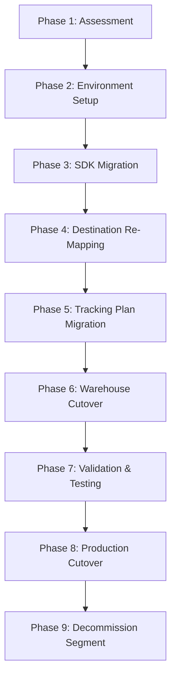
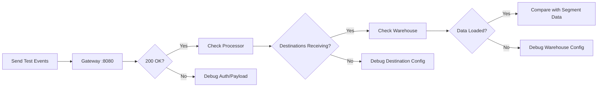

# Segment-to-RudderStack Migration Guide

Comprehensive, step-by-step guide for migrating your analytics infrastructure from Twilio Segment to RudderStack. This document covers the complete migration journey: assessment, environment setup, SDK swap, destination re-mapping, tracking plan migration, warehouse cutover, validation testing, production cutover, and Segment decommission.

**Key premise:** RudderStack exposes a **Segment-compatible HTTP API** on port 8080. All six core Segment Spec event types (`identify`, `track`, `page`, `screen`, `group`, `alias`) are natively supported with identical payload schemas. The only required changes are the **endpoint URL** and **write key** — event payloads, field names, and semantics remain identical.

> Source: `gateway/openapi.yaml` — OpenAPI 3.0.3 specification titled "RudderStack HTTP API" with Segment-compatible endpoint paths (`/v1/identify`, `/v1/track`, `/v1/page`, `/v1/screen`, `/v1/group`, `/v1/alias`, `/v1/batch`)

For SDK-only changes without a full platform migration, see [SDK Swap Guide](./sdk-swap-guide.md).

---

## Table of Contents

- [Prerequisites](#prerequisites)
- [Estimated Migration Time](#estimated-migration-time)
- [Migration Overview](#migration-overview)
- [API Compatibility](#api-compatibility)
- [Phase 1: Assessment](#phase-1-assessment)
- [Phase 2: Environment Setup](#phase-2-environment-setup)
- [Phase 3: SDK Migration](#phase-3-sdk-migration)
- [Phase 4: Destination Re-Mapping](#phase-4-destination-re-mapping)
- [Phase 5: Tracking Plan Migration](#phase-5-tracking-plan-migration)
- [Phase 6: Warehouse Cutover](#phase-6-warehouse-cutover)
- [Phase 7: Validation & Testing](#phase-7-validation--testing)
- [Phase 8: Production Cutover](#phase-8-production-cutover)
- [Phase 9: Decommission Segment](#phase-9-decommission-segment)
- [Troubleshooting](#troubleshooting)
- [Key Differences](#key-differences)
- [Related Documentation](#related-documentation)

---

## Prerequisites

Before starting the migration, ensure you have the following:

- **RudderStack data plane** — A running RudderStack instance with the Gateway accessible on port 8080
- **Workspace configuration** — RudderStack workspace configured with source write keys for each data source
- **Segment workspace access** — Access to your current Segment workspace for exporting configurations, destinations, and tracking plans
- **Test environment** — A staging or test environment for validation before production cutover
- **Transformer service** — The RudderStack Transformer service running on port 9090 (required for destination payload transformation)

> Source: `docker-compose.yml` — Defines the RudderStack service topology (db, backend, transformer, minio, etcd)

---

## Estimated Migration Time

| Integration Complexity | Sources | Destinations | Features | Estimated Time |
|---|---|---|---|---|
| Simple | 1–2 | < 10 | SDK only | 1–2 days |
| Medium | 5–10 | 10–30 | SDK + destinations | 1–2 weeks |
| Complex | 10+ | 30+ | SDK + destinations + tracking plans + warehouse | 2–4 weeks |

---

## Migration Overview

The migration follows a nine-phase approach, designed for incremental validation at each step:



| Phase | Description |
|---|---|
| **1. Assessment** | Inventory all Segment sources, destinations, tracking plans, warehouses, and event volume. |
| **2. Environment Setup** | Deploy RudderStack, configure workspace, set up destinations and warehouse connections. |
| **3. SDK Migration** | Replace Segment SDK endpoint URLs and write keys with RudderStack equivalents. |
| **4. Destination Re-Mapping** | Map each Segment destination to its RudderStack equivalent and transfer credentials. |
| **5. Tracking Plan Migration** | Export Segment Protocols rules and configure RudderStack Tracking Plans. |
| **6. Warehouse Cutover** | Run parallel warehouse syncs, validate data parity, and cut over consumers. |
| **7. Validation & Testing** | End-to-end testing of event ingestion, destination delivery, and warehouse loading. |
| **8. Production Cutover** | Gradual rollout of RudderStack in production with monitoring. |
| **9. Decommission Segment** | Disable Segment sources and destinations, archive configuration. |

---

## API Compatibility

RudderStack's Gateway implements a fully Segment-compatible HTTP API. All public endpoints, authentication schemes, and payload schemas are identical to Segment's API surface.

### Endpoint Parity

| Segment Endpoint | RudderStack Endpoint | Payload Parity | Notes |
|---|---|---|---|
| `POST api.segment.io/v1/identify` | `POST <DATA_PLANE>:8080/v1/identify` | ✅ Identical | userId, anonymousId, context.traits, timestamp |
| `POST api.segment.io/v1/track` | `POST <DATA_PLANE>:8080/v1/track` | ✅ Identical | userId, anonymousId, event, properties, timestamp |
| `POST api.segment.io/v1/page` | `POST <DATA_PLANE>:8080/v1/page` | ✅ Identical | userId, anonymousId, name, properties, timestamp |
| `POST api.segment.io/v1/screen` | `POST <DATA_PLANE>:8080/v1/screen` | ✅ Identical | userId, anonymousId, name, properties, timestamp |
| `POST api.segment.io/v1/group` | `POST <DATA_PLANE>:8080/v1/group` | ✅ Identical | userId, anonymousId, groupId, traits, timestamp |
| `POST api.segment.io/v1/alias` | `POST <DATA_PLANE>:8080/v1/alias` | ✅ Identical | userId, previousId, timestamp |
| `POST api.segment.io/v1/batch` | `POST <DATA_PLANE>:8080/v1/batch` | ✅ Identical | batch array of mixed event types |
| `POST api.segment.io/v1/import` | `POST <DATA_PLANE>:8080/v1/import` | ✅ Supported | Historical import endpoint |
| N/A | `POST <DATA_PLANE>:8080/v1/webhook` | RudderStack-only | Webhook ingestion endpoint |
| N/A | `POST <DATA_PLANE>:8080/beacon/v1/*` | RudderStack-only | `navigator.sendBeacon()` support |
| N/A | `GET <DATA_PLANE>:8080/pixel/v1/*` | RudderStack-only | Pixel tracking (1×1 GIF response) |

> Source: `gateway/openapi.yaml` — All endpoint definitions under `paths:`
> Reference: `refs/segment-docs/src/connections/spec/common.md` — Segment Spec structure

### Authentication Comparison

| Feature | Segment | RudderStack | Notes |
|---|---|---|---|
| Auth Method | HTTP Basic Auth | HTTP Basic Auth | Identical scheme |
| Auth Credential | Write Key as username, empty password | Write Key as username, empty password | Identical format |
| Header Format | `Authorization: Basic base64(writeKey:)` | `Authorization: Basic base64(writeKey:)` | Identical header |
| Additional Auth | N/A | sourceIDAuth (`X-Rudder-Source-Id`) | Internal endpoints only |
| Webhook Auth | Write key in header | Write key via header OR query param | RudderStack adds query param option |

> Source: `gateway/handle_http_auth.go:24-57` — `writeKeyAuth` middleware implementation
> Source: `gateway/openapi.yaml:679-686` — Security scheme definitions (`writeKeyAuth`, `sourceIDAuth`)

### Common Fields Parity

All Segment Spec common fields are supported with identical semantics:

| Field | Segment Spec | RudderStack API | Parity |
|---|---|---|---|
| `anonymousId` | ✅ | ✅ | Identical |
| `userId` | ✅ | ✅ | Identical |
| `context.app` | ✅ | ✅ | Identical |
| `context.campaign` | ✅ | ✅ | Identical |
| `context.device` | ✅ | ✅ | Identical |
| `context.ip` | ✅ | ✅ | Identical |
| `context.library` | ✅ | ✅ | Identical |
| `context.locale` | ✅ | ✅ | Identical |
| `context.network` | ✅ | ✅ | Identical |
| `context.os` | ✅ | ✅ | Identical |
| `context.page` | ✅ | ✅ | Identical |
| `context.referrer` | ✅ | ✅ | Identical |
| `context.screen` | ✅ | ✅ | Identical |
| `context.timezone` | ✅ | ✅ | Identical |
| `context.userAgent` | ✅ | ✅ | Identical |
| `context.userAgentData` | ✅ | ✅ | Identical |
| `timestamp` | ✅ | ✅ | Identical |
| `sentAt` | ✅ | ✅ | Identical |
| `receivedAt` | ✅ | ✅ | Auto-generated server-side |

> Reference: `refs/segment-docs/src/connections/spec/common.md` — Segment common fields specification
> Source: `gateway/openapi.yaml:688-940` — RudderStack payload schemas (IdentifyPayload through BatchPayload)

See also: [Event Spec — Common Fields](../../api-reference/event-spec/common-fields.md)

---

## Phase 1: Assessment

Before starting the migration, conduct a thorough assessment of your current Segment implementation.

### Assessment Checklist

- [ ] **Inventory Sources** — List all Segment sources by platform:
  - Web sources (JavaScript / analytics.js)
  - Mobile sources (iOS, Android, React Native, Flutter)
  - Server-side sources (Node.js, Python, Go, Java, Ruby)
  - Cloud sources (Salesforce, Stripe, Zendesk, etc.)
  - HTTP Tracking API direct integrations

- [ ] **Inventory Destinations** — For each active Segment destination, record:
  - Destination name and type (cloud, warehouse, stream)
  - API keys, tokens, and credentials
  - Event mappings and field transformations
  - Enabled/disabled status and filter rules

- [ ] **Inventory Tracking Plans** — Export all Segment Protocols configuration:
  - Tracking plan schemas (event names, required properties, data types)
  - Validation rules and enforcement mode (block vs. allow)
  - Anomaly detection settings

- [ ] **Inventory Warehouses** — List all warehouse connections:
  - Warehouse type (Snowflake, BigQuery, Redshift, PostgreSQL, etc.)
  - Schema names, sync frequency, and table structures
  - Credentials and access permissions

- [ ] **Document Event Volume** — Record current throughput metrics:
  - Events per second (peak and average)
  - Monthly event volume
  - RudderStack supports 50,000 events/sec with ordering guarantees

- [ ] **Document Custom Functions** — Identify Segment Functions requiring migration:
  - Source Functions → RudderStack User Transforms (JavaScript/Python)
  - Destination Functions → RudderStack Destination Transforms
  - Insert Functions → No direct equivalent (handle via User Transforms)

- [ ] **Identify Protocols Rules** — List all schema enforcement rules:
  - Required events and properties
  - Data type constraints
  - Allowed/blocked event lists

> See [Gap Report — Event Spec Parity](../../gap-report/event-spec-parity.md) for feature-level comparison
> See [Gap Report — Destination Catalog Parity](../../gap-report/destination-catalog-parity.md) for connector-level comparison

---

## Phase 2: Environment Setup

Deploy and configure your RudderStack instance to mirror your Segment workspace.

### Setup Checklist

- [ ] **Deploy RudderStack Data Plane**
  - **Docker:** `docker-compose up -d` (starts db, backend, transformer, minio, etcd)
  - **Kubernetes:** Deploy via Helm chart with appropriate resource allocations
  - **Developer machine:** Clone repository, configure `config/config.yaml`, run locally
  - Gateway listens on port **8080**, Warehouse service on port **8082**, Transformer on port **9090**

  > Source: `docker-compose.yml` — Service definitions for RudderStack components

- [ ] **Configure Workspace**
  - Create sources matching your Segment source types (web, iOS, Android, server-side)
  - Generate write keys for each source
  - Write keys are used identically to Segment for HTTP Basic Auth (`base64(writeKey:)`)

- [ ] **Set Up Destinations**
  - Map each Segment destination to the RudderStack equivalent connector
  - Transfer API keys, OAuth tokens, and configuration parameters
  - Verify destination-specific settings (event mappings, field mappings)

- [ ] **Configure Warehouse** (if applicable)
  - Set up warehouse connections (Snowflake, BigQuery, Redshift, ClickHouse, etc.)
  - Configure sync frequency and schema namespace
  - See: [Warehouse Destinations](../destinations/warehouse-destinations.md)

- [ ] **Verify Transformer Service**
  - Confirm the Transformer service is running on port 9090
  - Required for destination payload transformation
  - Verify health: `curl http://localhost:9090/health`

> See: [Installation Guide](../getting-started/installation.md) | [Configuration Guide](../getting-started/configuration.md)

---

## Phase 3: SDK Migration

The core migration principle is straightforward: **the only required change is the endpoint URL and write key**. All Segment SDKs send events to `api.segment.io/v1/*` — change this to `YOUR_DATA_PLANE_URL:8080/v1/*`. Event calls (`identify`, `track`, `page`, `screen`, `group`, `alias`) remain identical in signature, payload structure, and semantics.

> Source: `gateway/openapi.yaml` — Identical endpoint paths (`/v1/identify`, `/v1/track`, `/v1/page`, `/v1/screen`, `/v1/group`, `/v1/alias`, `/v1/batch`)

### JavaScript (Web)

```javascript
// BEFORE (Segment)
analytics.load('SEGMENT_WRITE_KEY')

// AFTER (RudderStack) — only change: endpoint URL and write key
const analytics = AnalyticsBrowser.load({
  writeKey: 'RUDDERSTACK_WRITE_KEY',
  cdnURL: 'https://YOUR_DATA_PLANE_URL'
})

// Event calls remain IDENTICAL:
analytics.identify('user-123', { name: 'Jane Doe', email: 'jane@example.com' })
analytics.track('Order Completed', { orderId: 'order-456', revenue: 99.99 })
analytics.page('Docs', 'SDK Guide')
analytics.group('company-789', { name: 'Acme Corp' })
analytics.alias('user-123', 'anonymous-456')
```

> See: [JavaScript SDK Guide](../sources/javascript-sdk.md)

### iOS (Swift)

```swift
// BEFORE (Segment)
let config = Configuration(writeKey: "SEGMENT_WRITE_KEY")

// AFTER (RudderStack) — change apiHost and writeKey
let config = Configuration(writeKey: "RUDDERSTACK_WRITE_KEY")
    .apiHost("YOUR_DATA_PLANE_URL:8080/v1")

// Event calls remain IDENTICAL:
analytics.identify(userId: "user-123", traits: ["name": "Jane Doe"])
analytics.track(name: "Order Completed", properties: ["revenue": 99.99])
analytics.screen(title: "Product Detail")
```

> See: [iOS SDK Guide](../sources/ios-sdk.md)

### Android (Kotlin)

```kotlin
// BEFORE (Segment)
analytics = Analytics("SEGMENT_WRITE_KEY", applicationContext)

// AFTER (RudderStack) — change apiHost and writeKey
analytics = Analytics("RUDDERSTACK_WRITE_KEY", applicationContext) {
    apiHost = "YOUR_DATA_PLANE_URL:8080/v1"
}

// Event calls remain IDENTICAL:
analytics.identify("user-123", buildJsonObject { put("name", "Jane Doe") })
analytics.track("Order Completed", buildJsonObject { put("revenue", 99.99) })
analytics.screen("Product Detail")
```

> See: [Android SDK Guide](../sources/android-sdk.md)

### Server-Side — Node.js

```javascript
// BEFORE (Segment)
const analytics = new Analytics({ writeKey: 'SEGMENT_WRITE_KEY' })

// AFTER (RudderStack) — change host and writeKey
const analytics = new Analytics({
  writeKey: 'RUDDERSTACK_WRITE_KEY',
  host: 'https://YOUR_DATA_PLANE_URL:8080'
})

// Event calls remain IDENTICAL:
analytics.identify({ userId: 'user-123', traits: { name: 'Jane Doe' } })
analytics.track({ userId: 'user-123', event: 'Order Completed', properties: { revenue: 99.99 } })
```

### Server-Side — Python

```python
# BEFORE (Segment)
analytics.write_key = 'SEGMENT_WRITE_KEY'

# AFTER (RudderStack) — change host and write_key
analytics.write_key = 'RUDDERSTACK_WRITE_KEY'
analytics.host = 'https://YOUR_DATA_PLANE_URL:8080'

# Event calls remain IDENTICAL:
analytics.identify('user-123', {'name': 'Jane Doe'})
analytics.track('user-123', 'Order Completed', {'revenue': 99.99})
```

### Server-Side — Go

```go
// BEFORE (Segment)
client := analytics.New("SEGMENT_WRITE_KEY")

// AFTER (RudderStack) — change Endpoint and write key
client, _ := analytics.NewWithConfig("RUDDERSTACK_WRITE_KEY", analytics.Config{
    Endpoint: "https://YOUR_DATA_PLANE_URL:8080",
})
defer client.Close()

// Event calls remain IDENTICAL:
client.Enqueue(analytics.Identify{
    UserId: "user-123",
    Traits: analytics.NewTraits().SetName("Jane Doe"),
})
client.Enqueue(analytics.Track{
    UserId: "user-123",
    Event:  "Order Completed",
})
```

### Direct HTTP API (curl)

```bash
# BEFORE (Segment)
curl -X POST https://api.segment.io/v1/track \
  -u SEGMENT_WRITE_KEY: \
  -H 'Content-Type: application/json' \
  -d '{"userId":"user-123","event":"Test","properties":{}}'

# AFTER (RudderStack) — only change: URL and write key
curl -X POST https://YOUR_DATA_PLANE_URL:8080/v1/track \
  -u RUDDERSTACK_WRITE_KEY: \
  -H 'Content-Type: application/json' \
  -d '{"userId":"user-123","event":"Test","properties":{}}'
```

> Source: `gateway/openapi.yaml` — Identical `/v1/track` endpoint definition with `writeKeyAuth` (HTTP Basic Auth) security scheme
> Source: `gateway/handle_http_auth.go:24-57` — `writeKeyAuth` middleware validates Basic Auth header with writeKey as username and empty password

For detailed per-SDK swap instructions including package replacement, initialization patterns, API method mapping tables, and verification steps, see [SDK Swap Guide](./sdk-swap-guide.md).

> See also: [Server-Side SDKs Guide](../sources/server-side-sdks.md)

---

## Phase 4: Destination Re-Mapping

RudderStack supports 90+ cloud destinations, 13 stream destinations, and 9 warehouse connectors. Most Segment destinations have direct equivalents in RudderStack.

### Destination Category Mapping

| Segment Category | RudderStack Equivalent | Notes |
|---|---|---|
| Cloud Destinations | Cloud Destinations (Router) | Direct mapping for most connectors — payload parity maintained |
| Warehouse Destinations | Warehouse Service (port 8082) | Enhanced with automatic schema evolution and identity resolution |
| Stream Destinations | Stream Destinations (StreamManager) | Kafka, Kinesis, Google Pub/Sub, Azure Event Hub, Firehose, EventBridge, Confluent Cloud |
| Functions (Source) | User Transforms | JavaScript/Python-based transformations (batch size 200) |
| Functions (Destination) | Destination Transforms | Per-destination payload shaping (batch size 100) |

> Source: `router/customdestinationmanager/` — Custom destination manager implementations
> Source: `services/streammanager/` — Stream destination integrations

### Re-Mapping Checklist

- [ ] **Export destination list** from Segment workspace (Settings → Destinations)
- [ ] **For each destination**, find the RudderStack equivalent in the [Destination Catalog](../destinations/index.md)
- [ ] **Transfer credentials** — API keys, OAuth tokens, and configuration parameters
- [ ] **Verify destination-specific settings:**
  - Event name mappings (if customized)
  - Field/property mappings and transformations
  - Event filters and allow/deny lists
  - Connection mode (cloud mode in RudderStack — all events route through Gateway)
- [ ] **Test each destination** with a single event before full migration
- [ ] **Verify payload parity** — compare RudderStack destination output with Segment's for critical destinations

> See: [Destination Catalog](../destinations/index.md) for all supported destinations
> See: [Gap Report — Destination Catalog Parity](../../gap-report/destination-catalog-parity.md) for full connector comparison

---

## Phase 5: Tracking Plan Migration

Segment Protocols maps to RudderStack Tracking Plans. Both provide schema validation and event governance, though the configuration interface differs.

### Tracking Plan Equivalence

| Segment Protocols Feature | RudderStack Equivalent | Status |
|---|---|---|
| Event schema validation | Tracking Plan enforcement | ✅ Supported |
| Required properties | Required property rules | ✅ Supported |
| Data type constraints | Type validation | ✅ Supported |
| Block violating events | Drop mode enforcement | ✅ Supported |
| Allow with violations | Allow-with-violations mode | ✅ Supported |
| Anomaly detection | Partial — basic violation reporting | ⚠️ Partial |
| Schema auto-discovery | Not available | ❌ Gap |

> Source: `processor/trackingplan.go` — Tracking plan enforcement logic in the Processor pipeline

### Migration Checklist

- [ ] **Export Segment tracking plans** — Download tracking plan schemas in JSON format from Segment Protocols
- [ ] **Map tracking plan rules** to RudderStack tracking plan format:
  - Event names and types (identify, track, page, screen, group)
  - Required and optional properties per event
  - Data type constraints (string, number, boolean, object, array)
- [ ] **Configure event validation rules** in RudderStack workspace
- [ ] **Set enforcement mode:**
  - **Drop** — reject events that violate the tracking plan (equivalent to Segment "Block")
  - **Allow with violations** — accept events but flag violations (equivalent to Segment "Allow")
- [ ] **Test tracking plan enforcement** with sample events:
  - Send a valid event → verify 200 OK and downstream delivery
  - Send a violating event → verify enforcement behavior (drop or flag)

> See: [Tracking Plans Guide](../governance/tracking-plans.md)
> See: [Gap Report — Protocols Parity](../../gap-report/protocols-parity.md) for feature comparison

---

## Phase 6: Warehouse Cutover

RudderStack's warehouse sync is **idempotent** and supports **backfill** — enabling safe parallel running during migration. The recommended approach is to run both Segment and RudderStack warehouse syncs simultaneously during a validation period, then cut over data consumers.

### Warehouse Migration Strategy

1. **Parallel schema setup** — Create a separate schema/namespace for RudderStack data (e.g., `rudderstack_events` alongside `segment_events`)
2. **Parallel sync** — Run both Segment and RudderStack warehouse syncs simultaneously for 24–48 hours minimum
3. **Data comparison** — Compare row counts, schema structures, and spot-check event payloads
4. **Consumer cutover** — Point dashboards, queries, and dbt models to the new schema
5. **Cleanup** — Disable Segment warehouse sync after the validation period

### Warehouse Connector Comparison

| Warehouse | Segment | RudderStack | Loading Strategy | Guide |
|---|---|---|---|---|
| Snowflake | ✅ | ✅ | Snowpipe Streaming / COPY INTO | [Snowflake Guide](../../warehouse/snowflake.md) |
| BigQuery | ✅ | ✅ | BigQuery Load API | [BigQuery Guide](../../warehouse/bigquery.md) |
| Redshift | ✅ | ✅ | S3 manifest COPY | [Redshift Guide](../../warehouse/redshift.md) |
| ClickHouse | ❌ | ✅ | INSERT (MergeTree) | [ClickHouse Guide](../../warehouse/clickhouse.md) |
| Databricks | ✅ | ✅ | COPY / INSERT / MERGE | [Databricks Guide](../../warehouse/databricks.md) |
| PostgreSQL | ✅ | ✅ | pq.CopyIn streaming | [PostgreSQL Guide](../../warehouse/postgres.md) |
| SQL Server | ❌ | ✅ | Bulk CopyIn | [MSSQL Guide](../../warehouse/mssql.md) |
| Azure Synapse | ❌ | ✅ | COPY INTO from blob storage | [Azure Synapse Guide](../../warehouse/azure-synapse.md) |
| Datalake (S3/GCS/Azure) | ✅ (S3 only) | ✅ (S3/GCS/Azure) | Parquet file export | [Datalake Guide](../../warehouse/datalake.md) |

> Source: `warehouse/integrations/` — Warehouse connector implementations for all 9 supported warehouses

### Cutover Checklist

- [ ] **Configure RudderStack warehouse destinations** (Snowflake, BigQuery, Redshift, etc.)
- [ ] **Set up parallel schema** — Use a new namespace (e.g., `rudderstack_events`) to avoid conflicts with existing Segment tables
- [ ] **Run parallel syncs** for minimum 24–48 hours
- [ ] **Compare row counts** between Segment and RudderStack warehouse tables
- [ ] **Compare schema structures** — Verify column names, data types, and table structures match
- [ ] **Spot-check event payloads** — Validate timestamps, user IDs, event properties, and context fields
- [ ] **Cut over data consumers** — Update dashboards, SQL queries, dbt models, and BI tools to reference the new schema
- [ ] **Disable Segment warehouse sync** after successful validation

> See: [Warehouse Sync Operations](../operations/warehouse-sync.md)
> See: [Gap Report — Warehouse Parity](../../gap-report/warehouse-parity.md)

---

## Phase 7: Validation & Testing

End-to-end validation ensures that events flow correctly from SDK ingestion through destination delivery and warehouse loading.

### Validation Flow



### Validation Checklist

**Step 1: Gateway Health** — Verify the Gateway is accepting events:

```bash
curl -X POST https://YOUR_DATA_PLANE_URL:8080/v1/track \
  -u YOUR_WRITE_KEY: \
  -H 'Content-Type: application/json' \
  -d '{
    "userId": "test-user",
    "event": "Migration Test",
    "properties": {
      "source": "migration-validation"
    }
  }'
# Expected response: "OK" (HTTP 200)
```

> Source: `gateway/openapi.yaml` — 200 OK response defined for all public endpoints

**Step 2: All Event Types** — Send one event per type and verify processing:

```bash
# Identify
curl -X POST https://YOUR_DATA_PLANE_URL:8080/v1/identify \
  -u YOUR_WRITE_KEY: \
  -H 'Content-Type: application/json' \
  -d '{"userId":"test-user","context":{"traits":{"name":"Test User","email":"test@example.com"}}}'

# Track
curl -X POST https://YOUR_DATA_PLANE_URL:8080/v1/track \
  -u YOUR_WRITE_KEY: \
  -H 'Content-Type: application/json' \
  -d '{"userId":"test-user","event":"Migration Validation","properties":{"step":"track-test"}}'

# Page
curl -X POST https://YOUR_DATA_PLANE_URL:8080/v1/page \
  -u YOUR_WRITE_KEY: \
  -H 'Content-Type: application/json' \
  -d '{"userId":"test-user","name":"Migration Guide","properties":{"url":"https://example.com/docs"}}'

# Screen
curl -X POST https://YOUR_DATA_PLANE_URL:8080/v1/screen \
  -u YOUR_WRITE_KEY: \
  -H 'Content-Type: application/json' \
  -d '{"userId":"test-user","name":"Dashboard","properties":{"section":"overview"}}'

# Group
curl -X POST https://YOUR_DATA_PLANE_URL:8080/v1/group \
  -u YOUR_WRITE_KEY: \
  -H 'Content-Type: application/json' \
  -d '{"userId":"test-user","groupId":"company-123","traits":{"name":"Acme Corp","plan":"enterprise"}}'

# Alias
curl -X POST https://YOUR_DATA_PLANE_URL:8080/v1/alias \
  -u YOUR_WRITE_KEY: \
  -H 'Content-Type: application/json' \
  -d '{"userId":"test-user","previousId":"anonymous-456"}'
```

For each event type, verify:
- `identify` → user traits stored correctly
- `track` → event name and properties propagated
- `page` → page name and URL recorded
- `screen` → screen name recorded
- `group` → group traits associated with user
- `alias` → identity merge executed

**Step 3: Destination Delivery** — Verify events arrive at each configured destination:
- Check destination dashboards or APIs for received events
- Verify event payloads match expected Segment Spec structure
- Confirm field mappings and transformations applied correctly

**Step 4: Warehouse Loading** — Verify events appear in warehouse tables:
- Check for new rows in `tracks`, `identifies`, `pages`, `screens`, `groups`, `aliases` tables
- Verify schema columns match expected structure
- Confirm timestamps and user IDs are correct

**Step 5: Payload Comparison** — For critical destinations, compare:
- RudderStack destination payload against known Segment output
- Field-by-field equivalence for event properties, context, and metadata
- Destination-specific transformations (e.g., mapping to destination's native schema)

**Step 6: Volume Testing** — Send representative event volume:
- Gradually increase load to match production event volume
- Monitor Gateway response times and error rates
- Verify throughput matches requirements (up to 50,000 events/sec)

**Step 7: Error Handling** — Verify error responses:

| Condition | Expected Status | Expected Response |
|---|---|---|
| Invalid write key | 401 Unauthorized | `"Invalid write key"` |
| Malformed JSON payload | 400 Bad Request | `"Invalid request"` |
| Rate limit exceeded | 429 Too Many Requests | `"Too many requests"` |
| Oversized payload | 413 Request Entity Too Large | `"Request size too large"` |
| Disabled source | 404 Not Found | `"Source does not accept webhook events"` |

> Source: `gateway/openapi.yaml` — Response codes (200, 400, 401, 404, 413, 429) defined per endpoint

---

## Phase 8: Production Cutover

After successful validation, execute a controlled production rollout.

### Pre-Cutover Checklist

- [ ] All destinations receiving events correctly in staging environment
- [ ] Warehouse schema matches production requirements
- [ ] Tracking plan enforcement verified and working
- [ ] Rollback plan documented and tested
- [ ] Maintenance window planned (if needed for zero-downtime constraint)
- [ ] Monitoring dashboards configured for RudderStack metrics

### Cutover Execution

1. **Deploy updated SDK configurations** to production applications
2. **Use feature flags for gradual rollout** (recommended):
   ```javascript
   // Example: Feature flag-based gradual rollout
   const analyticsConfig = {
     writeKey: featureFlags.useRudderStack
       ? process.env.RUDDERSTACK_WRITE_KEY
       : process.env.SEGMENT_WRITE_KEY,
     host: featureFlags.useRudderStack
       ? process.env.RUDDERSTACK_DATA_PLANE_URL
       : 'https://api.segment.io'
   }
   ```
3. **Rollout progression:** 1% → 10% → 50% → 100% over 1–2 weeks
4. **Monitor at each stage:**
   - Gateway health metrics (port 8080)
   - Destination delivery success rates
   - Warehouse sync completion
   - Error rates and latency

### Post-Cutover Monitoring

- [ ] **Event volume** — Compare with Segment baseline (should be equivalent)
- [ ] **Destination error rates** — Monitor for delivery failures
- [ ] **Warehouse sync** — Verify sync jobs completing on schedule
- [ ] **Latency metrics** — End-to-end event delivery time within acceptable bounds
- [ ] **Error rates** — Gateway 4xx/5xx rates within normal range

---

## Phase 9: Decommission Segment

After confirming stable production traffic through RudderStack, decommission your Segment workspace.

### Decommission Checklist

- [ ] **Verify zero Segment traffic** — Confirm all events are flowing through RudderStack (Segment workspace shows zero incoming events)
- [ ] **Disable Segment sources** — Turn off all sources in Segment workspace
- [ ] **Disable Segment destinations** — Turn off all destination connections
- [ ] **Disable Segment warehouse sync** — Stop warehouse loading from Segment
- [ ] **Archive Segment workspace** — Export and archive all Segment workspace configuration for reference:
  - Source configurations and write keys
  - Destination configurations and credentials
  - Tracking plan schemas
  - Protocols rules
- [ ] **Remove Segment SDK packages** from application codebases (if no longer needed)
- [ ] **Cancel Segment subscription** per your billing cycle
- [ ] **Update internal documentation** — Replace Segment references with RudderStack equivalents

---

## Troubleshooting

Common issues encountered during migration and their resolutions:

| Issue | Symptom | Resolution |
|---|---|---|
| 401 Unauthorized | Events rejected with `"Invalid write key"` | Verify you are using the RudderStack write key (not the Segment write key). Ensure the write key is Base64-encoded as `writeKey:` (with trailing colon) in the Basic Auth header. |
| 404 Source Disabled | Events rejected with `"Source does not accept webhook events"` | Enable the source in the RudderStack workspace. Verify the source type matches the endpoint being called. |
| Events not reaching destinations | Gateway returns 200 OK but destinations receive nothing | Check that the Transformer service is running on port 9090. Verify destination configuration (API keys, tokens). Check destination enable/disable status. |
| Warehouse schema mismatch | Tables not created or columns missing | Verify warehouse credentials and permissions. RudderStack requires CREATE TABLE, ALTER TABLE, and INSERT permissions. Check schema namespace configuration. |
| Rate limiting (429) | Events throttled with `"Too many requests"` | Adjust Gateway rate limiting configuration in `config/config.yaml` or reduce event burst volume. Consider horizontal scaling with GATEWAY/PROCESSOR deployment split. |
| Payload format errors (400) | `"invalid json"` or `"non-identifiable request"` | Ensure event payload is valid JSON. Every event must include either `anonymousId` or `userId` (or both). Verify Content-Type header is `application/json`. |
| CORS errors (Web SDK) | Browser blocks cross-origin requests | Configure CORS headers on the RudderStack Gateway or place it behind a reverse proxy with appropriate CORS policy. |
| SSL handshake failure | Connection errors from SDKs | Verify SSL certificate on the data plane URL. For development, you may use HTTP instead of HTTPS. |

> Source: `gateway/response/response.go` — Error response message constants
> Source: `gateway/handle_http_auth.go:24-57` — `writeKeyAuth` validation error paths (`NoWriteKeyInBasicAuth`, `InvalidWriteKey`, `SourceDisabled`)

See also: [Error Codes Reference](../../api-reference/error-codes.md)

---

## Key Differences

Notable differences between Segment and RudderStack to be aware of during and after migration:

| Feature | Segment | RudderStack | Impact |
|---|---|---|---|
| **Hosting** | Cloud-managed SaaS | Self-hosted (open source, Elastic License 2.0) | You manage infrastructure, scaling, and updates |
| **API Endpoint** | `api.segment.io` | Your data plane URL (port 8080) | Change SDK endpoint configuration |
| **Transformation** | Segment Functions (JS runtime) | User Transforms / Destination Transforms (JS/Python) | Different authoring interface; similar capability |
| **Protocols** | Segment Protocols (schema enforcement, anomaly detection) | Tracking Plans (schema enforcement) | Similar validation capability; anomaly detection is partial |
| **Identity Resolution** | Segment Unify (identity graph, profile sync, traits) | Warehouse Identity Resolution (`warehouse/identity/`) | Partial parity — warehouse-scoped identity merge |
| **Engage/Campaigns** | Segment Engage (audiences, journeys, campaigns) | Not available in Phase 1 | Explicitly out of scope for Phase 1 |
| **Reverse ETL** | Segment Reverse ETL (warehouse to destinations) | Not available in Phase 1 | Explicitly out of scope for Phase 1 |
| **Connection Modes** | Cloud mode and device mode | Cloud mode (all events route through Gateway) | Server-side routing only; no direct client-to-destination |
| **Replay** | Limited event replay | Full replay via Archiver (gzipped JSONL, 10-day retention) | Enhanced replay capability with source/date/hour organization |
| **Additional Endpoints** | N/A | Beacon (`/beacon/v1/*`), Pixel (`/pixel/v1/*`), Webhook | RudderStack-only ingestion features |
| **Warehouse Connectors** | 6 warehouses | 9 warehouses (adds ClickHouse, SQL Server, Azure Synapse) | Additional warehouse support |
| **Data Plane Control** | Segment-managed infrastructure | Full infrastructure control | Tune worker pools, batch sizes, retry policies |

> Source: `gateway/handle_http.go` — Handler registration for beacon, pixel, and webhook endpoints
> Source: `archiver/` — Event archival to object storage with gzipped JSONL format
> Source: `warehouse/identity/` — Warehouse identity resolution implementation

---

## Related Documentation

### Migration Resources
- [SDK Swap Guide](./sdk-swap-guide.md) — Detailed per-SDK migration instructions with package replacement and verification steps

### Event Specification
- [Event Spec — Common Fields](../../api-reference/event-spec/common-fields.md) — Shared event field reference
- [Event Spec — Identify](../../api-reference/event-spec/identify.md) — Identify call specification
- [Event Spec — Track](../../api-reference/event-spec/track.md) — Track call specification
- [Event Spec — Page](../../api-reference/event-spec/page.md) — Page call specification
- [Event Spec — Screen](../../api-reference/event-spec/screen.md) — Screen call specification
- [Event Spec — Group](../../api-reference/event-spec/group.md) — Group call specification
- [Event Spec — Alias](../../api-reference/event-spec/alias.md) — Alias call specification

### API Reference
- [Gateway HTTP API Reference](../../api-reference/gateway-http-api.md) — Full HTTP API documentation

### Source SDK Guides
- [JavaScript SDK Guide](../sources/javascript-sdk.md) — Web SDK integration
- [iOS SDK Guide](../sources/ios-sdk.md) — iOS SDK integration
- [Android SDK Guide](../sources/android-sdk.md) — Android SDK integration
- [Server-Side SDKs Guide](../sources/server-side-sdks.md) — Node.js, Python, Go, Java, Ruby

### Destinations and Governance
- [Destination Catalog](../destinations/index.md) — All supported destinations
- [Tracking Plans Guide](../governance/tracking-plans.md) — Tracking plan configuration and enforcement

### Operations
- [Warehouse Sync Operations](../operations/warehouse-sync.md) — Warehouse sync configuration and monitoring

### Gap Analysis
- [Gap Report — Event Spec Parity](../../gap-report/event-spec-parity.md) — Event-by-event parity analysis
- [Gap Report — Destination Catalog Parity](../../gap-report/destination-catalog-parity.md) — Connector coverage comparison

### Reference
- [Glossary](../../reference/glossary.md) — Unified RudderStack/Segment terminology
