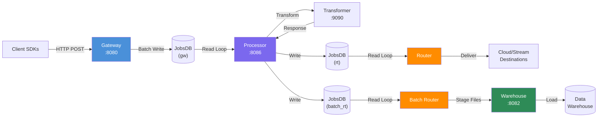
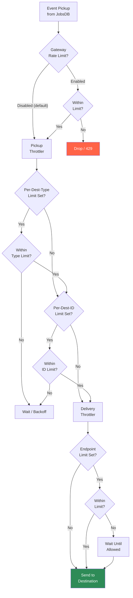
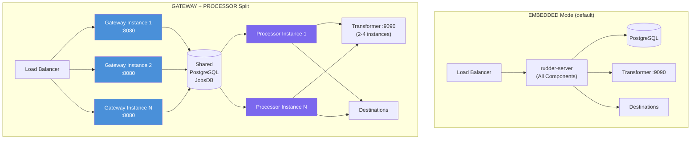

# Capacity Planning Guide

> **Target audience:** Senior engineers and data engineering teams managing production RudderStack deployments.

## Overview

This guide provides detailed configuration and tuning guidance for achieving **50,000 events/second** throughput with per-user event ordering guarantees in a production RudderStack deployment.

RudderStack uses a **durable pipeline architecture** where events traverse five independently tunable stages:

1. **Gateway** — HTTP ingestion, validation, deduplication, and batch writing to JobsDB
2. **Processor** — 6-stage event processing pipeline with user/destination transforms
3. **Router** — Real-time per-destination delivery with GCRA throttling and adaptive retry
4. **Batch Router** — Bulk delivery and staging file generation for warehouse destinations
5. **Warehouse** — 7-state upload state machine with schema evolution and parallel loading

Event ordering is maintained per-user via the `Router.guaranteeUserEventOrder` setting, which defaults to `true`.

> Source: config/config.yaml:104

**Prerequisites:**
- [Architecture Overview](../../architecture/overview.md)
- [Deployment Topologies](../../architecture/deployment-topologies.md)
- [Pipeline Stages](../../architecture/pipeline-stages.md)

---

## Pipeline Architecture for Throughput

### Event Flow Overview

The following diagram shows the end-to-end event flow with each independently tunable stage annotated:



Each stage has its own worker pool, batch size, and sleep configuration. Bottlenecks at any stage create backpressure via JobsDB queue depth. See [Pipeline Stages](../../architecture/pipeline-stages.md) for detailed stage architecture.

---

## Gateway Tuning

The Gateway is the HTTP ingestion layer that accepts Segment-compatible API calls on port 8080 and writes events to the Gateway JobsDB.

### Worker Pool Configuration

| Parameter | Config Key | Default | Type | Range | Description |
|-----------|-----------|---------|------|-------|-------------|
| Web Port | `Gateway.webPort` | 8080 | int | 1–65535 | HTTP listen port. Source: config/config.yaml:19 |
| Web Workers | `Gateway.maxUserWebRequestWorkerProcess` | 64 | int | 1–256 | Goroutines processing incoming HTTP requests. Source: config/config.yaml:20 |
| DB Writers | `Gateway.maxDBWriterProcess` | 256 | int | 1–1024 | Goroutines writing to JobsDB. Source: config/config.yaml:21 |
| Request Batch Size | `Gateway.maxUserRequestBatchSize` | 128 | int | 1–1024 | Max events batched per request worker. Source: config/config.yaml:23 |
| DB Batch Size | `Gateway.maxDBBatchSize` | 128 | int | 1–1024 | Max events batched per DB write. Source: config/config.yaml:24 |
| Request Batch Timeout | `Gateway.userWebRequestBatchTimeout` | 15ms | duration | 1ms–1s | Batch timeout for request accumulation. Source: config/config.yaml:25 |
| DB Batch Timeout | `Gateway.dbBatchWriteTimeout` | 5ms | duration | 1ms–1s | Batch timeout for DB writes. Source: config/config.yaml:26 |
| Max Request Size | `Gateway.maxReqSizeInKB` | 4000 | int | 100–65536 | Maximum request payload size in KB (~4 MB). Source: config/config.yaml:27 |

**How it works:** Incoming HTTP requests are distributed across `maxUserWebRequestWorkerProcess` goroutines. Each worker accumulates events into batches (up to `maxUserRequestBatchSize` or until `userWebRequestBatchTimeout` fires). Batches are then handed to `maxDBWriterProcess` goroutines that write to PostgreSQL in bulk (up to `maxDBBatchSize` per write or `dbBatchWriteTimeout`).

### Rate Limiting

Gateway rate limiting uses the **GCRA (Generic Cell Rate Algorithm)** and is **disabled by default**.

> Source: config/config.yaml:28 — `Gateway.enableRateLimit: false`

When enabled, the rate limiter enforces per-workspace event limits using a sliding window algorithm.

| Parameter | Config Key | Default | Type | Range | Description |
|-----------|-----------|---------|------|-------|-------------|
| Enable Rate Limit | `Gateway.enableRateLimit` | false | bool | true/false | Enable per-workspace rate limiting. Source: config/config.yaml:28 |
| Event Limit | `RateLimit.eventLimit` | 1000 | int | 1–1000000 | Max events per workspace per window. Source: config/config.yaml:15 |
| Rate Limit Window | `RateLimit.rateLimitWindow` | 60m | duration | 1m–24h | Time window for rate limit calculation. Source: config/config.yaml:16 |
| Buckets in Window | `RateLimit.noOfBucketsInWindow` | 12 | int | 1–100 | Number of sub-buckets for the sliding window. Source: config/config.yaml:17 |

**Implementation details:**

The `Factory` struct creates per-workspace throttlers using a map keyed by `workspaceId`. Each throttler reads its configuration from hierarchical config keys, allowing per-workspace overrides.

> Source: gateway/throttler/throttler.go:29–46

**Per-workspace override example:**

```yaml
# Override rate limit for a specific workspace
RateLimit:
  eventLimit: 1000           # Global default
  rateLimitWindow: 60m
  noOfBucketsInWindow: 12
  # Per-workspace override:
  ws_abc123def456:
    eventLimit: 5000          # This workspace gets 5x the limit
```

The per-workspace key format is `RateLimit.{workspaceID}.eventLimit`. If a workspace-specific key is set, it takes precedence over the global `RateLimit.eventLimit`.

> Source: gateway/throttler/throttler.go:117–131

### Webhook Configuration

Webhook sources have dedicated tuning parameters separate from the standard event API:

| Parameter | Config Key | Default | Type | Description |
|-----------|-----------|---------|------|-------------|
| Batch Timeout | `Gateway.webhook.batchTimeout` | 20ms | duration | Batch accumulation timeout for webhooks |
| Max Batch Size | `Gateway.webhook.maxBatchSize` | 32 | int | Max events per webhook batch |
| Transformer Workers | `Gateway.webhook.maxTransformerProcess` | 64 | int | Concurrent transformer workers for webhooks |
| Max Retry | `Gateway.webhook.maxRetry` | 5 | int | Max retry attempts for webhook processing |
| Max Retry Time | `Gateway.webhook.maxRetryTime` | 10s | duration | Max time for webhook retries |

> Source: config/config.yaml:32–40

### Scaling Recommendations for Gateway

For **50,000 events/sec** throughput:

1. Increase `maxUserWebRequestWorkerProcess` to **128** or higher
2. Increase `maxDBWriterProcess` to **512** or higher
3. Increase `maxUserRequestBatchSize` and `maxDBBatchSize` to **256**
4. Consider deploying in **GATEWAY mode** for horizontal scaling — see [Deployment Topologies](../../architecture/deployment-topologies.md)
5. Monitor `gateway_request_latency` and `gateway_batch_size` metrics for backpressure indicators

---

## Processor Tuning

The Processor reads events from the Gateway JobsDB and runs them through a 6-stage pipeline: preprocess → source hydration → pre-transform → user transform → destination transform → store.

### Worker Configuration

| Parameter | Config Key | Default | Type | Range | Description |
|-----------|-----------|---------|------|-------|-------------|
| Processor Web Port | `Processor.webPort` | 8086 | int | 1–65535 | Processor HTTP port. Source: config/config.yaml:185 |
| Loop Sleep | `Processor.loopSleep` | 10ms | duration | 1ms–1s | Minimum sleep between processing loops. Source: config/config.yaml:186 |
| Max Loop Sleep | `Processor.maxLoopSleep` | 5000ms | duration | 100ms–60s | Maximum sleep when idle. Source: config/config.yaml:187 |
| Store Timeout | `Processor.storeTimeout` | 5m | duration | 1m–30m | Timeout for storing processed events. Source: config/config.yaml:189 |
| Max Loop Events | `Processor.maxLoopProcessEvents` | 10000 | int | 100–100000 | Max events processed per loop iteration. Source: config/config.yaml:190 |
| Transform Batch Size | `Processor.transformBatchSize` | 100 | int | 10–1000 | Batch size for destination transforms. Source: config/config.yaml:191 |
| User Transform Batch Size | `Processor.userTransformBatchSize` | 200 | int | 10–1000 | Batch size for user transforms. Source: config/config.yaml:192 |
| Max HTTP Connections | `Processor.maxHTTPConnections` | 100 | int | 10–1000 | Max concurrent HTTP connections to Transformer service. Source: config/config.yaml:193 |
| Max HTTP Idle Connections | `Processor.maxHTTPIdleConnections` | 50 | int | 10–500 | Max idle HTTP connections to Transformer. Source: config/config.yaml:194 |

### Partition Workers

The Processor uses **partition workers** for parallel event processing. Each partition worker manages one or more pipeline workers, distributing events by UserID hash (MurmurHash) to maintain per-user ordering within partitions.

> Source: processor/partition_worker.go:31–49

**Key characteristics:**
- Jobs are distributed across pipeline workers via `misc.GetMurmurHash(job.UserID)`, ensuring all events for a given user are processed by the same pipeline worker in order
- Each pipeline worker runs the 6-stage pipeline as concurrent goroutines connected by buffered channels
- If a processing loop iteration completes faster than `loopSleep`, the worker sleeps for the remaining duration to avoid busy-waiting

See [Pipeline Stages](../../architecture/pipeline-stages.md) for the full 6-stage pipeline architecture.

### Deduplication Settings

| Parameter | Config Key | Default | Type | Description |
|-----------|-----------|---------|------|-------------|
| Enable Dedup | `Dedup.enableDedup` | false | bool | Enable event deduplication |
| Dedup Window | `Dedup.dedupWindow` | 3600s | duration | Time window for dedup checking (1 hour) |
| Memory Optimized | `Dedup.memOptimized` | true | bool | Use memory-optimized dedup backend |

> Source: config/config.yaml:204–207

When enabled, deduplication uses a BadgerDB or KeyDB backend to track message IDs within the configured time window. Enabling dedup adds per-event overhead; evaluate your throughput target before enabling in high-throughput scenarios.

### Scaling Recommendations for Processor

For **50,000 events/sec** throughput:

1. Increase `maxLoopProcessEvents` to **50000** to avoid read-loop bottlenecks
2. Increase `transformBatchSize` to **200** for better transform throughput
3. Increase `maxHTTPConnections` to **200** or higher
4. Scale the **Transformer service** (port 9090) to **2–4 instances** minimum
5. Deploy in **PROCESSOR mode** for horizontal scaling of the processing layer
6. Monitor `processor_loop_time` and `processor_transform_time` metrics

---

## Router Tuning

The Router delivers events in real-time to stream and cloud destinations with per-user ordering guarantees, GCRA-based throttling, and adaptive retry.

### Worker Pool and Batching

| Parameter | Config Key | Default | Type | Range | Description |
|-----------|-----------|---------|------|-------|-------------|
| Workers | `Router.noOfWorkers` | 64 | int | 1–256 | Number of concurrent routing workers. Source: config/config.yaml:109 |
| Query Batch Size | `Router.jobQueryBatchSize` | 10000 | int | 100–100000 | Max jobs queried per batch from JobsDB. Source: config/config.yaml:93 |
| Update Status Batch Size | `Router.updateStatusBatchSize` | 1000 | int | 100–10000 | Max jobs in status update batch. Source: config/config.yaml:94 |
| Jobs Per Worker Batch | `Router.noOfJobsToBatchInAWorker` | 20 | int | 1–100 | Max jobs batched per worker. Source: config/config.yaml:98 |
| Jobs Batch Timeout | `Router.jobsBatchTimeout` | 5s | duration | 1s–60s | Timeout for worker batch accumulation. Source: config/config.yaml:99 |
| Jobs Per Channel | `Router.noOfJobsPerChannel` | 1000 | int | 100–10000 | Channel buffer size per worker. Source: config/config.yaml:97 |
| Guarantee User Event Order | `Router.guaranteeUserEventOrder` | true | bool | true/false | Maintain per-user event ordering. Source: config/config.yaml:104 |
| Retry Time Window | `Router.retryTimeWindow` | 180m | duration | 1m–1440m | Time window for job retries. Source: config/config.yaml:112 |
| Min Retry Backoff | `Router.minRetryBackoff` | 10s | duration | 1s–300s | Minimum retry backoff interval. Source: config/config.yaml:107 |
| Max Retry Backoff | `Router.maxRetryBackoff` | 300s | duration | 10s–3600s | Maximum retry backoff interval. Source: config/config.yaml:108 |
| Max Failed Count | `Router.maxFailedCountForJob` | 3 | int | 1–100 | Max failures before job is aborted. Source: config/config.yaml:111 |

**Per-user ordering:** When `guaranteeUserEventOrder` is `true` (default), the Router ensures events for the same user are delivered in the order they were received. This is achieved by processing events per-user sequentially within each worker. Disabling this setting allows higher throughput at the cost of out-of-order delivery.

### Pickup Throttling (GCRA)

The Router implements a **three-level throttling architecture** for controlling event pickup rates from the JobsDB. Throttling uses the GCRA (Generic Cell Rate Algorithm) by default.

**Throttling hierarchy:**

1. **Per-Destination-Type** — Applies to all instances of a destination type (e.g., all MARKETO destinations):
   - `Router.throttler.{destType}.limit`
   - `Router.throttler.{destType}.timeWindow`

2. **Per-Destination-ID** — Applies to a specific destination instance:
   - `Router.throttler.{destType}.{destID}.limit`
   - `Router.throttler.{destType}.{destID}.timeWindow`

3. **Per-Event-Type** (optional) — Enables per-event-type throttling for a destination:
   - Enabled via `Router.throttler.{destType}.{destID}.throttlerPerEventType`
   - Or globally: `Router.throttler.{destType}.throttlerPerEventType`
   - Or: `Router.throttler.throttlerPerEventType`

> Source: router/throttler/config/config.go:10–16

**Throttling algorithm options:**

| Algorithm | Config Value | Description |
|-----------|-------------|-------------|
| GCRA (in-memory) | `gcra` | Default. Generic Cell Rate Algorithm, in-memory. Best for single-instance deployments. |
| Redis GCRA | `redis-gcra` | GCRA backed by Redis for distributed throttling across multiple instances. |
| Redis Sorted Set | `redis-sorted-set` | Redis sorted-set sliding window algorithm for distributed throttling. |

> Source: router/throttler/factory.go:26–29

**Configuration key:** `Router.throttler.limiter.type` (default: `gcra`)

> Source: router/throttler/factory.go:183

**Redis configuration** (required for `redis-gcra` or `redis-sorted-set`):

| Parameter | Config Key | Default | Description |
|-----------|-----------|---------|-------------|
| Redis Address | `Router.throttler.redisThrottler.addr` | localhost:6379 | Redis server address |
| Redis Username | `Router.throttler.redisThrottler.username` | "" | Redis username |
| Redis Password | `Router.throttler.redisThrottler.password` | "" | Redis password |

> Source: router/throttler/factory.go:169–181

**Throttling configuration example (MARKETO):**

```yaml
Router:
  throttler:
    algorithm: gcra
    MARKETO:
      limit: 45
      timeWindow: 20s
      # Per-destination-ID override:
      # xxxyyyzzSOU9pLRavMf0GuVnWV3:
      #   limit: 90
      #   timeWindow: 10s
```

> Source: config/config.yaml:121–133

**Adaptive throttling** can be enabled per destination to automatically adjust limits based on response codes:

```
Router.throttler.{destType}.{destID}.adaptiveEnabled: true
Router.throttler.{destType}.adaptiveEnabled: true
Router.throttler.adaptiveEnabled: true
```

When adaptive throttling is enabled, the system dynamically switches between static and adaptive throttling algorithms based on the destination's response patterns.

> Source: router/throttler/factory.go:97–101

The following diagram illustrates the throttling decision tree:



### Delivery Throttling

In addition to pickup throttling, the Router implements **per-endpoint delivery throttling** via the `DeliveryThrottler`. This provides fine-grained rate control at the destination endpoint level.

- **Key format:** `{destinationID}:{endpointPath}`
- **Algorithm:** Uses the static limiter exclusively (not adaptive)
- **Config keys:**
  - `Router.throttler.delivery.{destType}.{destID}.{endpointPath}.limit`
  - `Router.throttler.delivery.{destType}.{destID}.{endpointPath}.timeWindow`
  - Or with fallback: `Router.throttler.delivery.{destType}.{endpointPath}.limit`
- **Stats tracking:** `delivery_throttling_rate_limit` (Gauge), `delivery_throttling_wait_seconds` (Timer)

> Source: router/throttler/factory.go:128–155
> Source: router/throttler/internal/delivery/throttler.go:16–52

### Buffer Size Calculator

The Router uses a configurable buffer size strategy to manage worker channel capacity:

**1. Standard (default):** `max(noOfJobsToBatchInAWorker, noOfJobsPerChannel)`

Uses the larger of the batch size and channel buffer. This provides a conservative, predictable buffer size.

> Source: router/worker_buffer_calculator.go:18–29

**2. Experimental:** Throughput-based dynamic calculation

Calculates buffer size using: `max(throughput, queryBatchSize/workers, batchSize) × scalingFactor`

With configurable minimum and maximum bounds. When throughput is below 1 event/sec, the buffer size is set to 1 to introduce backpressure for slow processing scenarios.

> Source: router/worker_buffer_calculator.go:41–66

**Config key:** `Router.bufferSizeCalculatorType` (options: `standard`, `experimental`)

### Destination-Specific Router Overrides

Certain destinations require custom worker and connection settings due to API rate limits:

| Destination | `noOfWorkers` | Special Config | Rationale |
|-------------|--------------|----------------|-----------|
| GOOGLESHEETS | 1 | — | Single-threaded due to strict API quotas |
| MARKETO | 4 | Throttler: limit=45, timeWindow=20s | Lower workers + explicit rate limiting |
| BRAZE | 64 (default) | `forceHTTP1: true`, `httpTimeout: 120s`, `httpMaxIdleConnsPerHost: 32` | HTTP/1.1 forced for connection stability |

> Source: config/config.yaml:117–136

The per-destination override mechanism uses hierarchical config resolution:

```go
// Config resolution order (first match wins):
// 1. Router.{DEST_TYPE}.{key}
// 2. Router.{key}
```

> Source: router/config.go:28–30

---

## Batch Router Tuning

The Batch Router handles bulk event delivery for warehouse and batch-oriented destinations, generating staging files from event batches.

### Configuration Parameters

| Parameter | Config Key | Default | Type | Range | Description |
|-----------|-----------|---------|------|-------|-------------|
| Workers | `BatchRouter.noOfWorkers` | 8 | int | 1–64 | Concurrent batch routing workers. Source: config/config.yaml:142 |
| Query Batch Size | `BatchRouter.jobQueryBatchSize` | 100000 | int | 1000–1000000 | Max jobs queried per batch. Source: config/config.yaml:139 |
| Upload Frequency | `BatchRouter.uploadFreq` | 30s | duration | 5s–600s | Frequency of batch file uploads. Source: config/config.yaml:140 |
| Warehouse Max Retry Time | `BatchRouter.warehouseServiceMaxRetryTime` | 3h | duration | 30m–24h | Max wait time for warehouse service. Source: config/config.yaml:141 |
| Max Failed Count | `BatchRouter.maxFailedCountForJob` | 128 | int | 1–1000 | Max failures before abort. Source: config/config.yaml:143 |
| Retry Time Window | `BatchRouter.retryTimeWindow` | 180m | duration | 1m–1440m | Time window for retries. Source: config/config.yaml:144 |

**Tuning notes:** The Batch Router's `uploadFreq` controls how often staging files are flushed to object storage. Lower values reduce data latency to warehouses; higher values increase staging file size and reduce object storage write operations.

---

## Warehouse Tuning

The Warehouse service orchestrates data loading into data warehouse destinations via a 7-state upload state machine. See [Warehouse State Machine](../../architecture/warehouse-state-machine.md) for detailed state transition documentation.

### Configuration Parameters

| Parameter | Config Key | Default | Type | Range | Description |
|-----------|-----------|---------|------|-------|-------------|
| Mode | `Warehouse.mode` | embedded | string | embedded/master/slave/off | Warehouse service operational mode. Source: config/config.yaml:146 |
| Web Port | `Warehouse.webPort` | 8082 | int | 1–65535 | Warehouse HTTP/gRPC port. Source: config/config.yaml:147 |
| Upload Frequency | `Warehouse.uploadFreq` | 1800s | duration | 60s–86400s | Sync frequency (30 min default). Source: config/config.yaml:148 |
| Workers | `Warehouse.noOfWorkers` | 8 | int | 1–64 | Concurrent upload workers. Source: config/config.yaml:149 |
| Slave Worker Routines | `Warehouse.noOfSlaveWorkerRoutines` | 4 | int | 1–32 | Routines per slave worker. Source: config/config.yaml:150 |
| Main Loop Sleep | `Warehouse.mainLoopSleep` | 5s | duration | 1s–60s | Sleep between main loop iterations. Source: config/config.yaml:151 |
| Min Upload Backoff | `Warehouse.minUploadBackoff` | 60s | duration | 10s–600s | Minimum backoff between uploads. Source: config/config.yaml:154 |
| Max Upload Backoff | `Warehouse.maxUploadBackoff` | 1800s | duration | 60s–86400s | Maximum backoff between uploads. Source: config/config.yaml:155 |
| Prefetch Count | `Warehouse.warehouseSyncPreFetchCount` | 10 | int | 1–100 | Number of uploads to prefetch. Source: config/config.yaml:156 |
| Staging Files Batch Size | `Warehouse.stagingFilesBatchSize` | 960 | int | 100–10000 | Files per staging batch. Source: config/config.yaml:158 |

### Per-Warehouse Max Parallel Loads

Each warehouse connector has a configurable maximum for concurrent load operations. These limits control how many tables can be loaded in parallel during the data export state.

| Warehouse | Config Key | Default | Description |
|-----------|-----------|---------|-------------|
| Redshift | `Warehouse.redshift.maxParallelLoads` | 3 | Max concurrent COPY commands |
| Snowflake | `Warehouse.snowflake.maxParallelLoads` | 3 | Max concurrent PUT/COPY operations |
| BigQuery | `Warehouse.bigquery.maxParallelLoads` | 20 | Max concurrent load jobs (higher due to serverless architecture) |
| PostgreSQL | `Warehouse.postgres.maxParallelLoads` | 3 | Max concurrent COPY operations |
| MSSQL | `Warehouse.mssql.maxParallelLoads` | 3 | Max concurrent bulk inserts |
| Azure Synapse | `Warehouse.azure_synapse.maxParallelLoads` | 3 | Max concurrent COPY INTO commands |
| ClickHouse | `Warehouse.clickhouse.maxParallelLoads` | 3 | Max concurrent inserts |
| Databricks (DeltaLake) | `Warehouse.deltalake.maxParallelLoads` | 8 | Max concurrent COPY INTO / MERGE operations (code-level default) |
| Datalake (S3/GCS/Azure) | `Warehouse.s3_datalake.maxParallelLoads` | 8 | Max concurrent Parquet file writes (code-level default) |

> Source: config/config.yaml:162–183, warehouse/integrations/config/config.go:8–19

**Note:** BigQuery's default of 20 reflects its serverless architecture, which can handle significantly higher concurrency than traditional RDBMS-based warehouses. Databricks (DeltaLake) and Datalake (S3/GCS/Azure) use the code-level default of 8 as no explicit override is defined in `config/config.yaml`; the Datalake config key shown above (`s3_datalake`) applies to S3-backed datalakes, with `gcs_datalake` and `azure_datalake` variants available for GCS and Azure backends respectively. See [Warehouse Sync Guide](./warehouse-sync.md) for detailed per-connector operational configuration.

---

## Deployment Scaling Strategies

### Deployment Modes for Scaling

RudderStack supports three deployment modes that allow splitting the pipeline for horizontal scaling:



| Mode | Config | Components Active | Use Case |
|------|--------|-------------------|----------|
| **EMBEDDED** | `APP_TYPE=EMBEDDED` | Gateway + Processor + Router + Batch Router + Warehouse | Default single-binary deployment |
| **GATEWAY** | `APP_TYPE=GATEWAY` | Gateway only | Horizontal scaling of the ingestion layer |
| **PROCESSOR** | `APP_TYPE=PROCESSOR` | Processor + Router + Batch Router + Warehouse | Horizontal scaling of processing and routing |

See [Deployment Topologies](../../architecture/deployment-topologies.md) for detailed mode documentation.

### Horizontal Scaling with GATEWAY/PROCESSOR Split

The split deployment pattern provides independent scaling of ingestion and processing:

1. **Multiple GATEWAY instances** behind a load balancer handle event ingestion
2. **One or more PROCESSOR instances** handle event processing, routing, and warehouse loading
3. **Shared PostgreSQL (JobsDB)** provides durable event queuing between the two layers

**Key configuration:**

| Parameter | Config Key | Default | Description |
|-----------|-----------|---------|-------------|
| Max Process | `maxProcess` | 12 | Max goroutine multiplier for parallel processing. Source: config/config.yaml:1 |
| Enable Processor | `enableProcessor` | true | Enable event processing. Source: config/config.yaml:2 |
| Enable Router | `enableRouter` | true | Enable event routing. Source: config/config.yaml:3 |

### Scaling Checklist for 50,000 Events/Sec

Use this checklist as a step-by-step guide for achieving 50k events/sec throughput:

- [ ] **1. Split deployment:** Deploy separate GATEWAY and PROCESSOR instances (`APP_TYPE`)
- [ ] **2. Scale Gateway:** Run 2–4 Gateway instances behind a load balancer
- [ ] **3. Tune Gateway:** Set `maxUserWebRequestWorkerProcess: 128`, `maxDBWriterProcess: 512`, `maxUserRequestBatchSize: 256`, `maxDBBatchSize: 256`
- [ ] **4. Tune Processor:** Set `maxLoopProcessEvents: 50000`, `transformBatchSize: 200`, `maxHTTPConnections: 200`
- [ ] **5. Scale Transformer:** Run 2–4 Transformer service instances (port 9090)
- [ ] **6. Tune Router:** Set `noOfWorkers: 128`, `jobQueryBatchSize: 50000`
- [ ] **7. Tune Warehouse:** Adjust `maxParallelLoads` per warehouse type based on warehouse capacity
- [ ] **8. Tune PostgreSQL:** Increase `max_connections`, enable connection pooling (pgBouncer recommended), increase `shared_buffers`
- [ ] **9. Monitor:** Enable stats (`enableStats: true`) and set up dashboards for all pipeline stages

---

## JobsDB Tuning

JobsDB is the PostgreSQL-backed persistent job queue that provides durable event handoff between pipeline stages. Three main instances exist: GatewayDB, RouterDB, and BatchRouterDB.

### Database Configuration

| Parameter | Config Key | Default | Type | Description |
|-----------|-----------|---------|------|-------------|
| Max Dataset Size | `JobsDB.maxDSSize` | 100000 | int | Max rows per dataset partition. Source: config/config.yaml:67 |
| Max Table Size (MB) | `JobsDB.maxTableSizeInMB` | 300 | int | Max table size before rotation. Source: config/config.yaml:70 |
| Migration Threshold | `JobsDB.jobDoneMigrateThres` | 0.8 | float | Completion ratio triggering migration. Source: config/config.yaml:65 |
| Max Open Connections | `JobsDB.gw.maxOpenConnections` | 64 | int | Max PostgreSQL connections for GW dataset. Source: config/config.yaml:91 |
| Archival Days | `JobsDB.archivalTimeInDays` | 10 | int | Days before archival. Source: config/config.yaml:76 |
| Backup Enabled | `JobsDB.backup.enabled` | true | bool | Enable JobsDB backups. Source: config/config.yaml:79 |
| Migrate DS Loop Sleep | `JobsDB.migrateDSLoopSleepDuration` | 30s | duration | Sleep between migration checks. Source: config/config.yaml:71 |
| Add New DS Loop Sleep | `JobsDB.addNewDSLoopSleepDuration` | 5s | duration | Sleep between new dataset checks. Source: config/config.yaml:72 |
| Backup Row Batch Size | `JobsDB.backupRowsBatchSize` | 1000 | int | Rows per backup batch. Source: config/config.yaml:75 |

**Tuning notes for high throughput:**
- Increase `maxDSSize` for fewer dataset rotations (reduces migration overhead)
- Increase `maxOpenConnections` for higher concurrent write throughput
- Decrease `migrateDSLoopSleepDuration` for faster cleanup of completed datasets
- Consider pgBouncer for connection pooling when running multiple instances

---

## HTTP Tuning

Global HTTP server and client settings that affect all pipeline components:

| Parameter | Config Key | Default | Type | Description |
|-----------|-----------|---------|------|-------------|
| Client Timeout | `HttpClient.timeout` | 30s | duration | Default HTTP client timeout. Source: config/config.yaml:7 |
| Write Timeout | `Http.WriteTimeout` | 10s | duration | HTTP server write timeout. Source: config/config.yaml:11 |
| Idle Timeout | `Http.IdleTimeout` | 720s | duration | HTTP keep-alive idle timeout (12 min). Source: config/config.yaml:12 |
| Max Header Bytes | `Http.MaxHeaderBytes` | 524288 | int | Maximum header size (512 KB). Source: config/config.yaml:13 |

**Tuning notes:**
- Increase `Http.WriteTimeout` if clients experience timeouts on large batch payloads
- `Http.IdleTimeout` of 720s (12 minutes) keeps connections alive for SDK clients that send periodic batches
- For high-throughput scenarios, ensure the HTTP server is not bottlenecked by `MaxHeaderBytes`

---

## Monitoring and Alerting

### Key Metrics to Monitor

RudderStack exposes Prometheus/StatsD metrics for all pipeline components. Stats collection is enabled by default.

> Source: config/config.yaml:4 — `enableStats: true`
> Source: config/config.yaml:5 — `statsTagsFormat: influxdb`

**Per-component metrics:**

| Component | Key Metrics | What to Watch |
|-----------|------------|---------------|
| **Gateway** | Request rate, batch sizes, error rates, rate limit hits | Rising error rate or latency indicates ingestion bottleneck |
| **Processor** | Loop time, transform latency, event count per loop | Long loop times indicate Transformer or DB bottleneck |
| **Router** | Delivery latency, throttling rates, retry counts, failure rates | High throttling rates indicate destination rate limits |
| **Batch Router** | Upload frequency, staging file count, failure rate | Growing backlog indicates warehouse lag |
| **Warehouse** | Upload duration, schema evolution events, parallel load utilization | Stuck uploads indicate warehouse connectivity issues |
| **JobsDB** | Dataset count, pending events, migration frequency | Growing pending events indicate processing lag |

### Diagnostics

| Parameter | Config Key | Default | Description |
|-----------|-----------|---------|-------------|
| Enable Diagnostics | `Diagnostics.enableDiagnostics` | true | Master diagnostics toggle |
| Gateway Time Period | `Diagnostics.gatewayTimePeriod` | 60s | Gateway metrics collection interval |
| Router Time Period | `Diagnostics.routerTimePeriod` | 60s | Router metrics collection interval |

> Source: config/config.yaml:227–238

### Runtime Stats

Go runtime statistics for GC, CPU, and memory monitoring:

| Parameter | Config Key | Default | Description |
|-----------|-----------|---------|-------------|
| Enable | `RuntimeStats.enabled` | true | Enable Go runtime stats collection |
| Collection Interval | `RuntimeStats.statsCollectionInterval` | 10 | Seconds between collections |
| CPU Stats | `RuntimeStats.enableCPUStats` | true | Collect CPU metrics |
| Memory Stats | `RuntimeStats.enableMemStats` | true | Collect memory metrics |
| GC Stats | `RuntimeStats.enableGCStats` | true | Collect garbage collection metrics |

> Source: config/config.yaml:240–245

---

## Full Configuration Reference

For the complete list of 200+ configuration parameters, see:

- [Configuration Reference](../../reference/config-reference.md) — Complete `config.yaml` parameter documentation
- [Environment Variable Reference](../../reference/env-var-reference.md) — Environment-based configuration overrides

All configuration parameters can be set via `config.yaml` or environment variables with the `RSERVER_` prefix (e.g., `RSERVER_GATEWAY_WEB_PORT=8080`).

---

## Troubleshooting High-Throughput Issues

### Common Bottlenecks

| # | Bottleneck | Symptoms | Resolution |
|---|-----------|----------|------------|
| 1 | **Gateway backpressure** | Rising request latency, HTTP 503 responses | Increase `maxDBWriterProcess`, add Gateway instances |
| 2 | **Processor lag** | Growing GatewayDB pending events | Scale Transformer instances, increase `maxHTTPConnections`, increase `maxLoopProcessEvents` |
| 3 | **Router throttling** | Destination rate limit errors (429), growing RouterDB queue | Tune per-destination throttler `limit`/`timeWindow`, reduce `noOfWorkers` for rate-limited destinations |
| 4 | **Warehouse backlog** | Growing BatchRouterDB queue, stale warehouse data | Decrease `uploadFreq`, increase `maxParallelLoads`, check warehouse capacity |
| 5 | **JobsDB bloat** | PostgreSQL disk usage growing, slow queries | Check `maxDSSize` and `maxTableSizeInMB`, verify migration threshold, increase `maxOpenConnections` |
| 6 | **PostgreSQL saturation** | Connection errors, slow writes | Increase `maxOpenConnections`, deploy pgBouncer, increase PostgreSQL `max_connections` and `shared_buffers` |

### Example: Tuning for 50,000 Events/Sec

The following complete configuration snippet shows recommended settings for a high-throughput deployment using the GATEWAY/PROCESSOR split:

```yaml
# --- Gateway Instance (APP_TYPE=GATEWAY) ---
maxProcess: 12
enableProcessor: false
enableRouter: false
enableStats: true
statsTagsFormat: influxdb

Gateway:
  webPort: 8080
  maxUserWebRequestWorkerProcess: 128
  maxDBWriterProcess: 512
  maxUserRequestBatchSize: 256
  maxDBBatchSize: 256
  userWebRequestBatchTimeout: 15ms
  dbBatchWriteTimeout: 5ms
  maxReqSizeInKB: 4000
  enableRateLimit: false

JobsDB:
  maxDSSize: 200000
  maxTableSizeInMB: 500
  gw:
    maxOpenConnections: 128
```

```yaml
# --- Processor Instance (APP_TYPE=PROCESSOR) ---
maxProcess: 12
enableProcessor: true
enableRouter: true
enableStats: true
statsTagsFormat: influxdb

Processor:
  maxLoopProcessEvents: 50000
  transformBatchSize: 200
  userTransformBatchSize: 200
  maxHTTPConnections: 200
  maxHTTPIdleConnections: 100
  loopSleep: 10ms
  storeTimeout: 5m

Router:
  noOfWorkers: 128
  jobQueryBatchSize: 50000
  noOfJobsToBatchInAWorker: 50
  noOfJobsPerChannel: 2000
  guaranteeUserEventOrder: true
  minRetryBackoff: 10s
  maxRetryBackoff: 300s

BatchRouter:
  noOfWorkers: 16
  jobQueryBatchSize: 200000
  uploadFreq: 30s

Warehouse:
  mode: embedded
  noOfWorkers: 16
  uploadFreq: 900s
  stagingFilesBatchSize: 960
  snowflake:
    maxParallelLoads: 6
  bigquery:
    maxParallelLoads: 20
  redshift:
    maxParallelLoads: 6

JobsDB:
  maxDSSize: 200000
  maxTableSizeInMB: 500
  gw:
    maxOpenConnections: 128
```

### Testing Throughput with the Batch Endpoint

Use the following curl command to test batch event ingestion throughput:

```bash
# Send a batch of 100 events to test Gateway throughput
curl -X POST http://localhost:8080/v1/batch \
  -u '<WRITE_KEY>:' \
  -H 'Content-Type: application/json' \
  -d '{
    "batch": [
      {
        "type": "track",
        "event": "Load Test Event",
        "userId": "user-001",
        "properties": {
          "plan": "enterprise",
          "timestamp": "2026-01-01T00:00:00Z"
        }
      }
    ]
  }'
```

For sustained throughput testing, use tools like `wrk` or `vegeta`:

```bash
# Use wrk for sustained load testing (see utils/wrk/ for RudderStack-specific scripts)
wrk -t12 -c400 -d60s -s utils/wrk/batch.lua http://localhost:8080/v1/batch
```

### Monitoring Pipeline Health

```bash
# Check Gateway health
curl -s http://localhost:8080/health

# Check Warehouse service health
curl -s http://localhost:8082/health

# Check pending events in JobsDB (requires psql access)
psql -h localhost -p 5432 -U rudder -d jobsdb -c \
  "SELECT tablename, count FROM (
     SELECT schemaname || '.' || tablename AS tablename,
            (xpath('/row/cnt/text()',
              query_to_xml('SELECT count(*) AS cnt FROM ' || schemaname || '.' || tablename, false, true, ''))
            )[1]::text::bigint AS count
     FROM pg_tables
     WHERE tablename LIKE '%_jobs_%'
     ORDER BY count DESC
     LIMIT 10
   ) t WHERE count > 0;"
```

---

## Cross-References

- [Architecture Overview](../../architecture/overview.md) — System architecture and component topology
- [Deployment Topologies](../../architecture/deployment-topologies.md) — EMBEDDED, GATEWAY, PROCESSOR deployment modes
- [Pipeline Stages](../../architecture/pipeline-stages.md) — 6-stage Processor pipeline detail
- [Warehouse State Machine](../../architecture/warehouse-state-machine.md) — 7-state upload lifecycle
- [Warehouse Sync Guide](./warehouse-sync.md) — Warehouse sync configuration and monitoring
- [Configuration Reference](../../reference/config-reference.md) — Complete 200+ parameter reference
- [Environment Variable Reference](../../reference/env-var-reference.md) — Environment-based configuration
