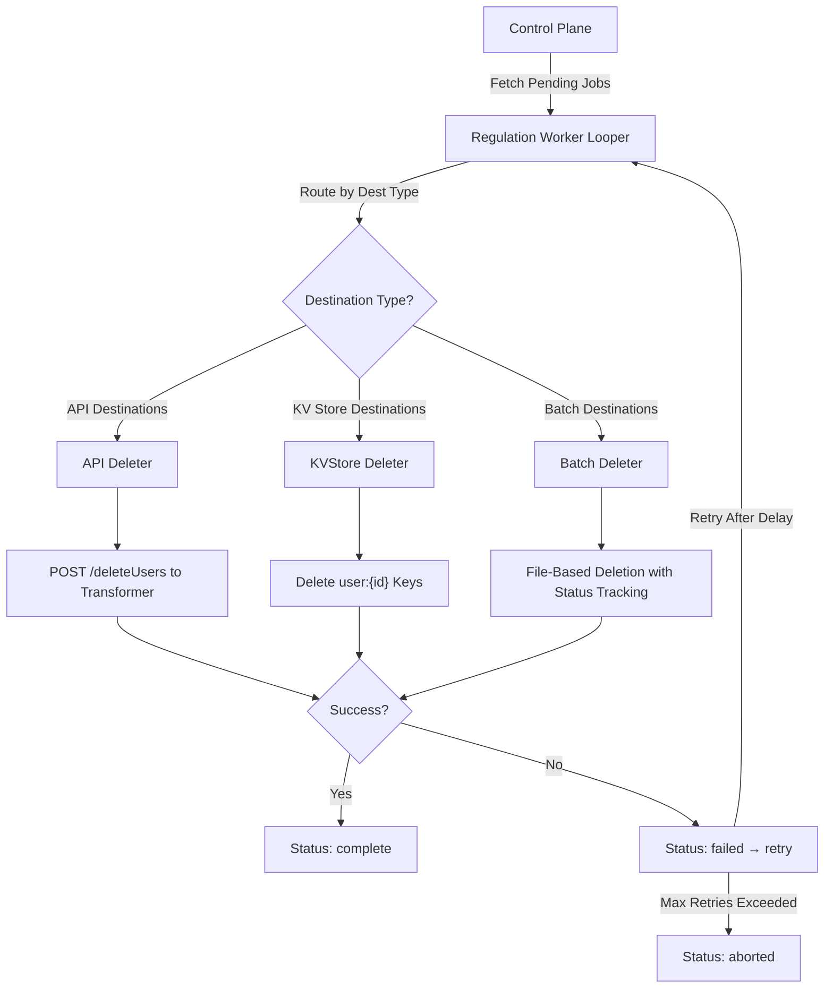
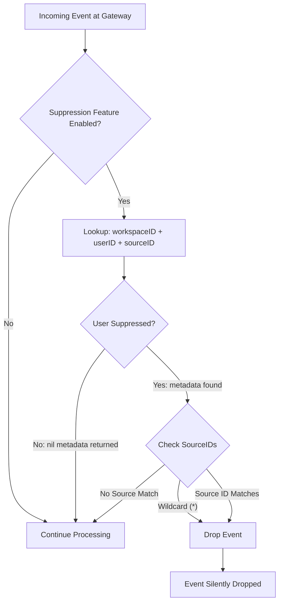
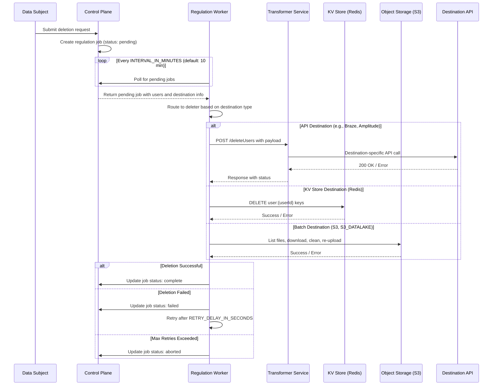

# Privacy and Compliance Operations Guide

RudderStack provides built-in support for **GDPR and CCPA data regulation compliance** through two primary mechanisms:

1. **Regulation Worker** — A standalone service that executes data deletion jobs across downstream destinations, ensuring user data is removed upon request.
2. **User Suppression** — A Gateway-level feature that prevents events from being processed for specific users, dropping them before they enter the processing pipeline.

Together, these mechanisms enable organizations to fulfill data subject access requests (DSARs), right-to-erasure obligations, and proactive event blocking for opted-out users.

> **Prerequisite reading:** [Architecture Overview](../../architecture/overview.md) for the overall system component topology.
>
> **Related:** [Security Architecture](../../architecture/security.md) for authentication, encryption, and SSRF protection details.
>
> **Related:** [Consent Management Guide](../governance/consent-management.md) for in-pipeline consent filtering that controls per-destination delivery based on CMP signals.

---

## Regulation Worker Architecture

### Overview

The Regulation Worker is a **standalone service** that executes data deletion jobs across destinations. It operates as an independent loop that polls for pending regulation jobs from the Control Plane backend configuration, routes deletion requests to destination-specific handlers based on the destination type, and reports completion or failure status back.

**Key characteristics:**

- Runs on a configurable loop interval (default: **10 minutes**)
- Fetches pending regulation jobs from the Control Plane backend config
- Routes deletion requests to **three destination-specific handler types**: API, KV Store, and Batch
- Supports OAuth v2 credential management for API destinations
- Tracks job status through a well-defined lifecycle: `pending` → `running` → `complete` / `failed` / `aborted`

Source: `regulation-worker/internal/service/looper.go`

### Regulation Job Model

The regulation job data model defines the core entities used throughout the deletion lifecycle.

**Job Structure:**

```go
// Source: regulation-worker/internal/model/model.go:37-45
type Job struct {
    ID             int
    WorkspaceID    string
    DestinationID  string
    Status         JobStatus
    Users          []User
    UpdatedAt      time.Time
    FailedAttempts int
}

// Source: regulation-worker/internal/model/model.go:47-50
type User struct {
    ID         string
    Attributes map[string]string
}
```

**Job Status Values:**

Source: `regulation-worker/internal/model/model.go:29-35`

| Status | Constant | Description |
|--------|----------|-------------|
| `pending` | `JobStatusPending` | Job is queued and awaiting execution |
| `running` | `JobStatusRunning` | Job is currently being processed by a deleter |
| `complete` | `JobStatusComplete` | Deletion completed successfully across all users in the job |
| `failed` | `JobStatusFailed` | Deletion failed — job will be retried after the configured retry delay |
| `aborted` | `JobStatusAborted` | Job permanently failed after max retries or due to unrecoverable error |

**Sentinel Error Types:**

Source: `regulation-worker/internal/model/model.go:8-13`

| Error | Description |
|-------|-------------|
| `ErrNoRunnableJob` | No pending jobs available for processing — worker sleeps for the configured interval |
| `ErrInvalidDestination` | Destination configuration is invalid or missing required fields |
| `ErrRequestTimeout` | API call to destination or Transformer service timed out — triggers retry with delay |
| `ErrDestNotSupported` | Destination type is not supported by any registered deleter (API, KV Store, or Batch) |

**Destination Model:**

```go
// Source: regulation-worker/internal/model/model.go:52-57
type Destination struct {
    Config        map[string]any
    DestDefConfig map[string]any
    DestinationID string
    Name          string
}
```

### Regulation Job Lifecycle

The following diagram illustrates how the Regulation Worker processes deletion jobs, routing them to the appropriate deleter based on destination type:



**Looper Behavior:**

Source: `regulation-worker/internal/service/looper.go:23-63`

1. The Looper reads `INTERVAL_IN_MINUTES` (default: 10) and `RETRY_DELAY_IN_SECONDS` (default: 60) from environment variables.
2. On each iteration, it calls `JobSvc` to fetch and execute the next pending job.
3. If `ErrNoRunnableJob` is returned, the worker sleeps for the configured interval before retrying.
4. If `ErrRequestTimeout` is returned, the worker sleeps for the retry delay before retrying.
5. Any other error causes the Looper to exit with the error.

---

## Deletion Strategies

RudderStack supports three distinct deletion strategies, each optimized for different destination types.

### API Deletion

**Used for:** Cloud destinations with REST APIs that support user deletion endpoints.

**Mechanism:** The Regulation Worker sends a `POST /deleteUsers` request to the **Transformer service** (port 9090), which handles the actual API call formatting per destination. The Transformer translates the generic deletion payload into destination-specific API calls.

Source: `regulation-worker/internal/delete/api/api.go`

**Supported Destinations (12 total):**

Source: `regulation-worker/internal/delete/api/api.go:35`

| Destination | Constant | Notes |
|-------------|----------|-------|
| Braze | `BRAZE` | User deletion via Braze REST API |
| Amplitude | `AM` | User deletion via Amplitude User Privacy API |
| Intercom | `INTERCOM` | User deletion via Intercom API |
| CleverTap | `CLEVERTAP` | User deletion via CleverTap Profile API |
| AppsFlyer | `AF` | User deletion via AppsFlyer GDPR API |
| Mixpanel | `MP` | User deletion via Mixpanel Data Deletion API |
| Google Analytics | `GA` | User deletion via GA User Deletion API |
| Iterable | `ITERABLE` | User deletion via Iterable GDPR API |
| Engage | `ENGAGE` | User deletion via Engage API |
| Custify | `CUSTIFY` | User deletion via Custify API |
| SendGrid | `SENDGRID` | User deletion via SendGrid Contact API |
| Sprig | `SPRIG` | User deletion via Sprig API |

> **Note:** The API deleter also queries the Transformer service's `FeaturesService.Regulations()` endpoint for a dynamically-reported list of supported destinations. If the Transformer returns an empty list, the deleter falls back to the hardcoded `SupportedDestinations` list above.
>
> Source: `regulation-worker/internal/delete/api/api.go:58-67`

**Deletion Flow:**

```
Regulation Worker → POST /deleteUsers → Transformer (port 9090) → Destination API
```

**Transformer GDPR Endpoint Payload:**

```go
// Source: regulation-worker/internal/delete/api/api.go:190-206
// Each deletion request is mapped to the following payload schema:
type apiDeletionPayloadSchema struct {
    JobID          string            // Regulation job ID
    DestType       string            // Lowercase destination name (e.g., "braze")
    Config         map[string]any    // Destination-specific configuration
    UserAttributes []map[string]string // User IDs and attributes to delete
}
```

**Example curl — Transformer GDPR Deletion:**

```bash
# The Regulation Worker sends this request to the Transformer service
curl -X POST http://localhost:9090/deleteUsers \
  -H "Content-Type: application/json" \
  -d '[{
    "jobId": "12345",
    "destType": "braze",
    "config": {
      "apiKey": "your-braze-api-key",
      "restApiUrl": "https://rest.iad-01.braze.com"
    },
    "userAttributes": [
      {"userId": "user-001"},
      {"userId": "user-002", "email": "user@example.com"}
    ]
  }]'
```

**Response Handling:**

Source: `regulation-worker/internal/delete/api/api.go:179-188`

| HTTP Status | Resulting Job Status | Description |
|-------------|---------------------|-------------|
| `200 OK` | `complete` | Deletion succeeded for all users |
| `404 Not Found` | `aborted` | Destination not supported by Transformer |
| `405 Method Not Allowed` | `aborted` | Destination not supported by Transformer |
| Other | `failed` | Temporary failure — job will be retried |

**OAuth Integration:**

For OAuth-enabled destinations, the API deleter integrates with the OAuth v2 subsystem to manage credential refresh. If the Transformer responds with an `authErrorCategory` of `REFRESH_TOKEN`, the deleter retries the request (up to `MaxOAuthRefreshRetryAttempts`). If the category is `AUTH_STATUS_INACTIVE`, the job is permanently aborted.

Source: `regulation-worker/internal/delete/api/api.go:69-171`

### KV Store Deletion

**Used for:** Key-value store destinations where user data is stored under predictable key patterns.

**Mechanism:** Directly connects to the KV store and deletes keys matching the `user:{userId}` pattern for each user in the job.

Source: `regulation-worker/internal/delete/kvstore/kvstore.go`

**Supported Destinations:**

Source: `regulation-worker/internal/delete/kvstore/kvstore.go:15`

| Destination | Constant | Key Pattern | Notes |
|-------------|----------|-------------|-------|
| Redis | `REDIS` | `user:{userId}` | Direct key deletion from Redis using the KV Store Manager |

**Deletion Process:**

Source: `regulation-worker/internal/delete/kvstore/kvstore.go:25-57`

1. A `KVDeleteManager` instance receives the job and destination configuration.
2. It instantiates a KV Store Manager (`kvstoremanager.New`) using the destination name and config (which includes Redis connection details such as host, port, password).
3. For each user in the job, it constructs the key as `user:{userId}` and calls `DeleteKey`.
4. If any key deletion fails, the job status is set to `failed` immediately and the remaining users are not processed.
5. If all deletions succeed, the job status is set to `complete`.

**Example Key Pattern:**

```
# For a user with ID "abc-123", the following key is deleted:
user:abc-123
```

### Batch Deletion

**Used for:** Storage and data lake destinations where data is stored in files (e.g., S3, GCS).

**Mechanism:** File-based deletion with progress tracking via a status tracker file. Files are downloaded, user data is removed, cleaned files are re-uploaded, and progress is tracked to support resumption after failures.

Source: `regulation-worker/internal/delete/batch/batch.go`

**Supported Destinations:**

Source: `regulation-worker/internal/delete/batch/batch.go:37`

| Destination | Constant | Notes |
|-------------|----------|-------|
| Amazon S3 | `S3` | File-based deletion with status tracking and exponential backoff |
| S3 Datalake | `S3_DATALAKE` | File-based deletion with status tracking and exponential backoff |

**Status Tracker File:**

Source: `regulation-worker/internal/delete/batch/batch.go:36`

The batch deleter uses a file named `rudderDeleteTracker.txt` (`StatusTrackerFileName`) to track which files have already been cleaned. This enables resumption of partially completed batch deletion jobs:

1. The tracker file stores the job ID on the first line, followed by the names of files that have been successfully cleaned.
2. When a job resumes, the deleter reads the tracker file and skips already-cleaned files.
3. If the job ID in the tracker file does not match the current job, the file is truncated and rewritten.

Source: `regulation-worker/internal/delete/batch/batch.go:100-184`

**Batch Deletion Process:**

1. List files under the job's prefix in the storage destination.
2. Read the status tracker file to identify already-cleaned files.
3. Remove already-cleaned files from the processing list using a two-pointer merge algorithm.
4. For each remaining file:
   a. Download the file locally (with exponential backoff, max 10 minutes).
   b. Remove user data from the file.
   c. Re-upload the cleaned file.
   d. Update the status tracker file.
5. Set job status to `complete` when all files are processed.

Source: `regulation-worker/internal/delete/batch/batch.go:64-98`

---

## Regulation Worker Configuration

### Required Environment Variables

The following environment variables must be set before running the Regulation Worker.

Source: `regulation-worker/README.md`

| Variable | Required | Default | Description |
|----------|----------|---------|-------------|
| `CONFIG_BACKEND_URL` | Yes | `https://api.rudderstack.com` | Control Plane backend URL for fetching regulation jobs and destination configurations |
| `WORKSPACE_TOKEN` | Yes (single-tenant) | — | Workspace authentication token. Required for single-tenant deployments |
| `WORKSPACE_NAMESPACE` | Yes (multi-tenant) | — | Workspace namespace identifier. Required for multi-tenant deployments |
| `DEST_TRANSFORM_URL` | Yes | `http://localhost:9090` | Transformer service URL for API deletion calls |

**Verification Script:**

```bash
#!/bin/bash
# Verify required environment variables for the Regulation Worker

REQUIRED_VARS=("CONFIG_BACKEND_URL" "DEST_TRANSFORM_URL")
OPTIONAL_VARS=("WORKSPACE_TOKEN" "WORKSPACE_NAMESPACE")

echo "=== Regulation Worker Environment Check ==="

for var in "${REQUIRED_VARS[@]}"; do
  if [ -z "${!var}" ]; then
    echo "❌ MISSING: $var"
  else
    echo "✅ SET: $var=${!var}"
  fi
done

for var in "${OPTIONAL_VARS[@]}"; do
  if [ -z "${!var}" ]; then
    echo "⚠️  NOT SET: $var (required for single-tenant or multi-tenant mode)"
  else
    echo "✅ SET: $var=<redacted>"
  fi
done

echo ""
echo "At least one of WORKSPACE_TOKEN or WORKSPACE_NAMESPACE must be set."
```

### Looper Configuration

The Regulation Worker's main loop is controlled by the following environment variables:

Source: `regulation-worker/internal/service/looper.go:26-33`

| Parameter | Environment Variable | Default | Type | Description |
|-----------|---------------------|---------|------|-------------|
| Loop Interval | `INTERVAL_IN_MINUTES` | `10` | int | Minutes between regulation job polling cycles. When no jobs are found, the worker sleeps for this duration. |
| Retry Delay | `RETRY_DELAY_IN_SECONDS` | `60` | int | Seconds to wait before retrying after a request timeout error. Applied when `ErrRequestTimeout` is encountered. |

### Backend Config Integration

The following `config.yaml` parameters control regulation-related behavior within the main RudderStack server's backend configuration subsystem.

Source: `config/config.yaml:208-216`

| Parameter | Config Key | Default | Type | Description |
|-----------|-----------|---------|------|-------------|
| Regulations Poll Interval | `BackendConfig.regulationsPollInterval` | `300s` | duration | Primary polling interval for fetching regulation jobs from the Control Plane |
| Max Regulations Per Request | `BackendConfig.maxRegulationsPerRequest` | `1000` | int | Maximum number of regulation jobs fetched per API request to the Control Plane |
| Regulations Page Size | `BackendConfig.Regulations.pageSize` | `50` | int | Page size for regulation job pagination when syncing with the data regulation service |
| Regulations Poll Interval (nested) | `BackendConfig.Regulations.pollInterval` | `300s` | duration | Alternate poll interval configuration used by the suppression syncer |

> **Full reference:** See [Configuration Reference](../../reference/config-reference.md) for the complete list of all 200+ configuration parameters.
>
> **Environment variables:** See [Environment Variable Reference](../../reference/env-var-reference.md) for the environment variable equivalent of each parameter.

---

## User Suppression

### Overview

User suppression prevents events from being processed for specific users at the **Gateway level** — before events enter the processing pipeline. When a user is suppressed, all incoming events for that user are dropped immediately, ensuring no data reaches any destination.

**Key characteristics:**

- Acts at the Gateway (pre-processing) — upstream of the Processor, Router, and Warehouse
- Supports **workspace-level**, **user-level**, and **source-level** suppression granularity
- Supports **wildcard suppression** (`*`) to block a user across all sources in a workspace
- Enabled by default: `Gateway.enableSuppressUserFeature: true`
- Enterprise feature: requires `EnterpriseToken` to be set; otherwise falls back to a NOOP handler

Source: `config/config.yaml:29`, `enterprise/suppress-user/factory.go:42-49`

### Suppression Model

The suppression data model defines the rules for blocking user events:

```go
// Source: enterprise/suppress-user/model/model.go:16-23
type Suppression struct {
    WorkspaceID string    `json:"workspaceId"`
    Canceled    bool      `json:"canceled"`
    UserID      string    `json:"userId"`
    CreatedAt   time.Time `json:"createdAt"`
    SourceIDs   []string  `json:"sourceIds"`
}

// Source: enterprise/suppress-user/model/model.go:25-27
type Metadata struct {
    CreatedAt time.Time
}
```

**Suppression Scope:**

| Scenario | `SourceIDs` Value | Behavior |
|----------|-------------------|----------|
| **Wildcard Suppression** | `["*"]` | Suppression applies to **ALL** sources in the workspace |
| **Source-Specific Suppression** | `["source-id-1", "source-id-2"]` | Suppression applies only to events from the listed source IDs |
| **Cancellation** | `Canceled: true` | Removes the suppression rule, re-enabling events for the user |

Source: `enterprise/suppress-user/model/model.go:14` — The `Wildcard` constant is defined as `"*"`.

### Suppression Backends

RudderStack provides two repository backends for storing suppression data, selectable via configuration.

Source: `enterprise/suppress-user/repository.go`, `enterprise/suppress-user/factory.go:58`

| Backend | Implementation | Selection Config | Use Case | Persistence | Notes |
|---------|---------------|-----------------|----------|-------------|-------|
| **BadgerDB** | `enterprise/suppress-user/internal/badgerdb/` | `BackendConfig.Regulations.useBadgerDB: true` (default) | Production | Yes — on-disk embedded database | Handles large suppression lists; supports seeding from backup service; default for production |
| **Memory** | `enterprise/suppress-user/internal/memory/` | `BackendConfig.Regulations.useBadgerDB: false` | Development, small-scale | No — in-memory only | Fast but data is lost on restart; suitable for development and testing |

Both backends implement the `Repository` interface:

```go
// Source: enterprise/suppress-user/repository.go:14-32
type Repository interface {
    Stop() error
    GetToken() ([]byte, error)
    Add(suppressions []model.Suppression, token []byte) error
    Suppressed(workspaceID, userID, sourceID string) (*model.Metadata, error)
    Backup(w io.Writer) error
    Restore(r io.Reader) error
}
```

**BadgerDB Initialization:**

When BadgerDB is selected (default), the factory initializes with a two-phase sync strategy:

1. **Latest Sync (fast start):** A "latest-export" is fetched from the suppression backup service to seed the database quickly, enabling the Gateway to start accepting requests.
2. **Full Sync (complete data):** A "full-export" is fetched asynchronously. Once complete, a `RepoSwitcher` atomically swaps the latest repository with the full repository.

Source: `enterprise/suppress-user/factory.go:67-128`

This two-phase approach minimizes Gateway startup latency while ensuring eventual consistency with the complete suppression list.

### Suppression Handler Flow

The suppression handler evaluates each incoming event against the suppression repository:



Source: `enterprise/suppress-user/handler.go:26-34`

**Handler Logic:**

1. `GetSuppressedUser(workspaceID, userID, sourceID)` is called for each event.
2. The handler delegates to the repository's `Suppressed` method, which checks the suppression store.
3. If the repository returns a non-nil `*Metadata`, the user is suppressed for the given workspace + source combination.
4. Sentinel errors `ErrRestoring` and `ErrKeyNotFound` are treated as non-fatal (the event is allowed through).
5. Any other error is logged but does not block the event.

### Suppression vs. Consent Filtering

RudderStack provides two complementary mechanisms for controlling event flow. Understanding when to use each is critical for a comprehensive privacy strategy:

| Feature | User Suppression | Consent Filtering |
|---------|-----------------|-------------------|
| **Location in Pipeline** | Gateway (pre-processing) | Processor (during pipeline) |
| **Mechanism** | Full event drop — event never enters the pipeline | Selective destination filtering — event is processed but delivery is controlled per destination |
| **Scope** | User-level (all events for a user) | Category/purpose-level (specific consent categories per destination) |
| **Management** | Control Plane managed via regulation API | CMP-managed (OneTrust, Ketch, Generic CMP) via `context.consentManagement` |
| **Granularity** | Workspace + User + Source | Source + Destination + Consent Category |
| **Use Case** | GDPR right-to-erasure, CCPA opt-out, account deletion | GDPR consent preferences, cookie consent, marketing opt-out |
| **Enterprise Requirement** | Yes — requires `EnterpriseToken` | No — available in all deployments |

> **Detailed consent filtering:** See [Consent Management Guide](../governance/consent-management.md) for OneTrust, Ketch, and Generic CMP configuration.

---

## GDPR Compliance Workflow

### End-to-End Deletion Flow

The following sequence diagram shows the complete lifecycle of a GDPR data deletion request:



### Handling Failures

The Regulation Worker implements a robust failure handling strategy:

**Retry Logic:**

| Scenario | Behavior | Configuration |
|----------|----------|---------------|
| API call timeout | Retry after delay | `RETRY_DELAY_IN_SECONDS` (default: 60) |
| Transformer returns non-200 | Job marked `failed`, retried on next loop iteration | `INTERVAL_IN_MINUTES` (default: 10) |
| OAuth token expired | Automatic refresh and retry | `MaxOAuthRefreshRetryAttempts` |
| OAuth account inactive | Job immediately `aborted` | — |
| KV store connection failure | Job marked `failed` | — |
| S3 download failure | Exponential backoff (max interval: 1 minute, max elapsed: 10 minutes) | Built-in backoff |
| No runnable jobs | Worker sleeps for interval | `INTERVAL_IN_MINUTES` (default: 10) |

Source: `regulation-worker/internal/service/looper.go:35-62`, `regulation-worker/internal/delete/batch/batch.go:227-250`

**Monitoring Failed Jobs:**

- Track the `FailedAttempts` field on each job to identify persistently failing deletions.
- Jobs that exceed the maximum retry threshold transition to `aborted` status.
- **Aborted jobs require manual intervention** — review the destination configuration, Transformer service health, and destination API availability.

**Stats Instrumentation:**

The Regulation Worker emits the following metrics for monitoring:

| Metric | Type | Tags | Description |
|--------|------|------|-------------|
| `regulation_worker_cleaning_time` | Timer | `destinationId`, `workspaceId`, `destinationType`, `jobType` | Duration of each deletion operation |
| `regulation_worker_delete_api_timeout` | Counter | `destinationId`, `workspaceId`, `destinationType`, `jobType` | Count of API deletion timeouts |

Source: `regulation-worker/internal/delete/api/api.go:109-117`, `regulation-worker/internal/delete/kvstore/kvstore.go:35-42`

### Data Retention and Archival

RudderStack's data retention configuration affects compliance audit capabilities:

| Parameter | Config Key | Default | Description |
|-----------|-----------|---------|-------------|
| Archival Time | `JobsDB.archivalTimeInDays` | `10` | Number of days before job records are archived to object storage |
| Gateway Backup | `JobsDB.backup.gw.enabled` | `true` | Enables backup of Gateway job records for audit trail |
| Router Backup | `JobsDB.backup.rt.enabled` | `true` | Enables backup of Router job records (failed only by default) |
| Batch Router Backup | `JobsDB.backup.batch_rt.enabled` | `false` | Enables backup of Batch Router job records |

Source: `config/config.yaml:76-88`

> **Important:** Gateway backup provides an event-level audit trail that is critical for compliance verification. Ensure `JobsDB.backup.gw.enabled` remains `true` in production.
>
> **Related:** See [Replay Guide](./replay.md) for understanding archival and data retention in the context of event replay.

---

## Operational Best Practices

### Monitoring Regulation Worker Health

Establish the following monitoring practices for production deployments:

1. **Job Queue Depth** — Monitor the number of jobs in `pending` status. A growing backlog may indicate Transformer service issues or destination API rate limiting.

2. **Completion Rate** — Track the ratio of `complete` to `failed` jobs per polling cycle. A high failure rate may indicate systemic connectivity issues.

3. **Deletion Latency** — Monitor the `regulation_worker_cleaning_time` metric per destination type. Spikes may indicate destination API degradation.

4. **Aborted Job Alerts** — Configure alerts for any jobs transitioning to `aborted` status. These require manual review and intervention.

5. **Transformer Health** — Verify the Transformer service at `DEST_TRANSFORM_URL` is available and responding. All API deletions depend on this service.

6. **OAuth Token Health** — For OAuth-enabled destinations, monitor for `AUTH_STATUS_INACTIVE` errors which indicate expired or revoked credentials.

### Scaling Considerations

| Aspect | Default Behavior | Scaling Recommendation |
|--------|-----------------|----------------------|
| Worker instances | Single-instance | For high-volume deletion workloads (thousands of concurrent jobs), consider running multiple worker instances partitioned by workspace |
| Transformer concurrency | Shared with event processing | Ensure the Transformer service has sufficient capacity for concurrent GDPR API calls alongside normal event transformation |
| Redis connection pool | Default pool settings | For bulk KV store deletions, tune the Redis connection pool size in the destination configuration |
| S3 download concurrency | 5 concurrent goroutines (default) | The batch deleter uses goroutine pools; adjust based on available CPU cores and network bandwidth |
| Polling interval | 10 minutes | Decrease `INTERVAL_IN_MINUTES` for faster deletion SLAs; increase to reduce Control Plane API load |

### Compliance Audit Trail

Maintaining a complete audit trail is essential for demonstrating GDPR compliance:

1. **Gateway Backup** — Provides an event-level audit trail of all ingested events. Enabled by default (`JobsDB.backup.gw.enabled: true`).

2. **Regulation Job History** — The Control Plane maintains a complete history of regulation jobs with status transitions, timestamps, and failure reasons.

3. **JobsDB Archival** — Archived job records are retained in object storage for the configured retention period (`JobsDB.archivalTimeInDays: 10`).

4. **Transformer Logs** — The Transformer service logs all GDPR API calls with destination, status code, and timing information.

**Recommended Audit Configuration:**

```yaml
# config.yaml — Recommended settings for compliance audit trail
JobsDB:
  archivalTimeInDays: 30          # Extend to 30 days for compliance retention
  backup:
    enabled: true
    gw:
      enabled: true                # MUST be true for compliance
      pathPrefix: "audit/gateway"  # Organize backups by purpose
    rt:
      enabled: true
      failedOnly: false            # Back up all router jobs, not just failures
```

---

## Troubleshooting

### Common Issues

| # | Issue | Symptoms | Root Cause | Resolution |
|---|-------|----------|------------|------------|
| 1 | **Jobs stuck in `pending`** | Jobs never transition to `running` | Control Plane connectivity failure or invalid `WORKSPACE_TOKEN` | Verify `CONFIG_BACKEND_URL` is reachable; confirm `WORKSPACE_TOKEN` or `WORKSPACE_NAMESPACE` is valid |
| 2 | **API deletions failing** | Jobs cycle between `running` and `failed` for API destinations | Transformer service unavailable or returning errors | Verify `DEST_TRANSFORM_URL` is correct and the Transformer service is healthy: `curl http://localhost:9090/health` |
| 3 | **KV store deletions failing** | Redis deletion jobs failing | Redis connectivity issues or missing credentials in destination config | Check Redis host, port, and password in the destination configuration; verify network connectivity |
| 4 | **Batch deletions failing** | S3/Datalake deletion jobs failing | Insufficient S3 permissions or bucket access issues | Verify IAM permissions include `s3:GetObject`, `s3:PutObject`, `s3:ListBucket`, and `s3:DeleteObject` |
| 5 | **Suppression not working** | Events for suppressed users still being processed | Feature disabled or BadgerDB health issues | Ensure `Gateway.enableSuppressUserFeature: true` in config; verify `EnterpriseToken` is set; check BadgerDB disk health |
| 6 | **OAuth destinations aborting** | API deletion jobs immediately aborted | OAuth credentials expired or revoked | Check the destination's OAuth configuration in the Control Plane; re-authorize the integration |
| 7 | **Slow batch deletions** | Batch deletion jobs taking hours | Large number of files to process, slow S3 downloads | Review exponential backoff settings; check network bandwidth; monitor `regulation_worker_cleaning_time` metric |

### Verifying Deletion Success

**Step-by-step verification process:**

1. **Check Job Status** — Query the Control Plane for the regulation job status:
   ```bash
   # Check regulation job status via Control Plane API
   curl -s -H "Authorization: Bearer ${WORKSPACE_TOKEN}" \
     "${CONFIG_BACKEND_URL}/workspaces/${WORKSPACE_ID}/regulations" | \
     python3 -m json.tool
   ```

2. **Verify Destination Data** — Confirm data removal directly in the destination system:
   - **API destinations:** Query the destination's user lookup API to confirm the user no longer exists.
   - **Redis:** Check that the key `user:{userId}` no longer exists: `redis-cli EXISTS user:abc-123`
   - **S3:** Verify that files have been cleaned: check the `rudderDeleteTracker.txt` status file.

3. **Review Transformer Logs** — For API deletions, check the Transformer service logs for the GDPR endpoint:
   ```bash
   # Search Transformer logs for deletion-related entries
   docker logs rudder-transformer 2>&1 | grep -i "deleteUsers"
   ```

4. **Monitor Metrics** — Check the `regulation_worker_cleaning_time` metric to verify deletion completed:
   ```bash
   # Query Prometheus for regulation worker metrics
   curl -s 'http://localhost:9090/api/v1/query?query=regulation_worker_cleaning_time' | \
     python3 -m json.tool
   ```

### Suppression Debugging

If user suppression is not working as expected:

1. **Verify Feature Flag:**
   ```bash
   # Check if suppression is enabled in config.yaml
   grep "enableSuppressUserFeature" config/config.yaml
   # Expected: enableSuppressUserFeature: true
   ```

2. **Verify Enterprise Token:**
   ```bash
   # Check if EnterpriseToken is set (required for suppression)
   echo ${ENTERPRISE_TOKEN:+"Enterprise token is set"}
   ```

3. **Check BadgerDB Health:**
   ```bash
   # Verify BadgerDB repository exists and sync marker is present
   ls -la /tmp/rudder/fullSuppression/.sync_done 2>/dev/null && \
     echo "✅ Full sync complete" || \
     echo "⚠️ Full sync not yet complete — using latest snapshot"
   ```

4. **Verify Suppression Backend Selection:**
   ```bash
   # Check which backend is configured
   grep "useBadgerDB" config/config.yaml
   # Default: true (production), false enables in-memory backend
   ```

---

## Cross-References

| Document | Description |
|----------|-------------|
| [Architecture Overview](../../architecture/overview.md) | System architecture and component topology |
| [Security Architecture](../../architecture/security.md) | Authentication, encryption, SSRF protection, and OAuth |
| [Consent Management](../governance/consent-management.md) | In-pipeline consent filtering with OneTrust, Ketch, and Generic CMP |
| [Configuration Reference](../../reference/config-reference.md) | Complete reference for all 200+ configuration parameters |
| [Environment Variable Reference](../../reference/env-var-reference.md) | Environment variable reference with descriptions and defaults |
| [Replay Guide](./replay.md) | Event replay and replay-on-failure operational guide |
| [Capacity Planning](./capacity-planning.md) | Pipeline throughput tuning and scaling guide |
