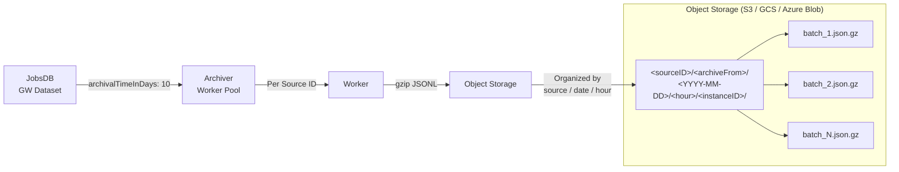
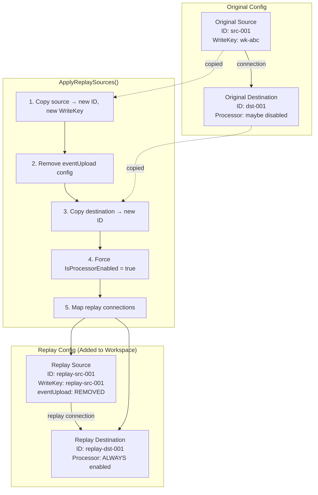
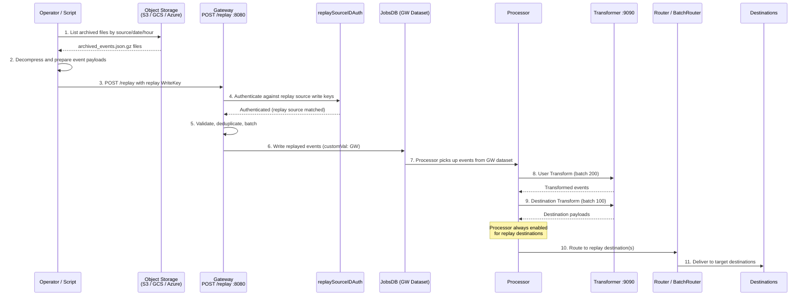
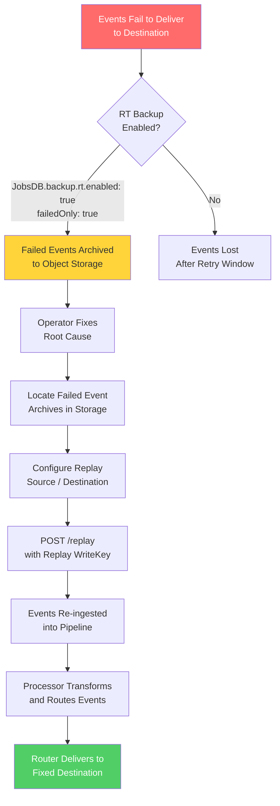

# Event Replay Guide

> Event replay and replay-on-failure operational guide covering the Archiver's partition-aware archival to object storage, replay HTTP handler, and re-ingestion pipeline. This is a critical operational guide for production teams needing to re-process historical events.

## Overview

RudderStack supports **event replay** — the ability to re-process historical events through the pipeline after they have been archived to object storage. Two key components enable this capability:

1. **Archiver** — A background worker pool that archives completed events from JobsDB to object storage (S3, GCS, Azure Blob) as gzip-compressed JSONL files, organized by source ID, date, and hour.
2. **Replay Handler** — An HTTP endpoint (`POST /replay`) on the Gateway that accepts previously archived events for re-ingestion into the pipeline through dedicated replay sources.

**Use cases:**

- **Disaster recovery** — Re-process events after a destination outage or data loss incident
- **Backfilling new destinations** — Replay historical events to newly added destinations
- **Re-processing after bugfixes** — Replay events through updated transformation logic after fixing a transform bug
- **Data recovery** — Restore events that were incorrectly filtered, dropped, or transformed

**Prerequisites:**

- Familiarity with the [Architecture Overview](../../architecture/overview.md) for system component context
- Understanding of the [End-to-End Data Flow](../../architecture/data-flow.md) for pipeline stage interactions
- Reference the [Configuration Reference](../../reference/config-reference.md) for all tunable parameters

---

## Archival Architecture

### Archiver Component

The Archiver runs as a background worker pool within the RudderStack server process. It reads completed events from the Gateway (GW) dataset in JobsDB and uploads them to configured object storage (S3, GCS, or Azure Blob) as gzip-compressed JSONL files.

**Key characteristics:**

- Implements a **worker pool pattern** with one dedicated worker goroutine per source ID
- Archives are stored as **gzip-compressed JSON Lines** (`.json.gz`) — one JSON event object per line
- Workers coordinate via channels and use configurable rate limiters for fetch, upload, and status update operations
- The Archiver is enabled by default and controlled by the `archival.Enabled` configuration parameter

**Source:** `archiver/archiver.go` (orchestrator), `archiver/worker.go` (per-source worker)

### Archival Pipeline

The following diagram shows how events flow from JobsDB through the Archiver worker pool to object storage.



### Archive File Organization

Archive files are organized in object storage using a hierarchical prefix structure derived from the source ID, archive origin, event creation timestamp, and server instance ID.

**Storage path structure:**

```
{bucket}/{sourceID}/{archiveFrom}/{YYYY-MM-DD}/{hour}/{instanceID}/{timestamp_range}_{workspaceID}_{uuid}.json.gz
```

The upload prefix components are constructed in `worker.go` as:

```go
prefixes := []string{
    w.sourceID,          // Source ID (partition key)
    w.archiveFrom,       // Archive origin — "gw" for Gateway events
    firstJobCreatedAt.Format("2006-01-02"),  // Date in YYYY-MM-DD format
    fmt.Sprintf("%d", firstJobCreatedAt.Hour()),  // Hour (0-23)
    w.config.instanceID, // Server instance ID (default "1")
}
```

**Source:** `archiver/worker.go:188-194`

**Each archived file contains:**

- Gzip-compressed JSON Lines format (one JSON object per line, newline-delimited)
- Each line represents a single event with the following marshaled structure:

```json
{
  "userId": "user-123",
  "payload": { /* original event payload */ },
  "createdAt": "2025-01-15T10:30:00Z",
  "messageId": "msg-abc-123"
}
```

**Source:** `archiver/worker.go:217-229` (marshalJob function)

### Archive File Creation Triggers

File creation and upload is triggered when any of the following conditions are met:

| Trigger | Config Key | Default | Description |
|---------|-----------|---------|-------------|
| **Payload size limit** | `archival.ArchivePayloadSizeLimit` | 1 GB | Maximum cumulative payload size per batch before triggering upload |
| **Events count limit** | `archival.ArchiveEventsLimit` | 100,000 | Maximum number of events per batch before triggering upload |
| **Upload frequency** | `archival.UploadFrequency` | 5 minutes | Maximum time between uploads — upload is deferred if neither size nor count limit is reached and the frequency has not elapsed |

When a worker fetches jobs from JobsDB, it checks whether `limitReached` is true (indicating the payload size or events limit was hit). If the limit was not reached, the worker defers the upload until the `uploadFrequency` interval has elapsed since the last upload. This prevents excessive small uploads while ensuring timely archival.

**Source:** `archiver/archiver.go:72-86` (config initialization), `archiver/worker.go:55-71` (trigger logic)

### Archiver Worker Pool

The Archiver orchestrator spawns and manages workers through the `workerpool` package:

- **Worker creation**: One worker goroutine is spawned **per source ID** discovered in JobsDB
- **Source discovery**: The orchestrator periodically calls `GetDistinctParameterValues(ctx, SourceID, "")` to discover all active source IDs in the GW dataset
- **Custom value filter**: Workers query for jobs with `customVal: "GW"` — the Gateway's custom value identifier. **Source:** `config/config.yaml:22` (`Gateway.CustomVal: GW`)
- **Concurrency**: Default **10 concurrent workers** controlled by `archival.ArchiveConcurrency`. Each concurrent operation (fetch, upload, status update) has its own rate limiter.
- **Idle timeout**: Workers that have been idle for `2 × uploadFrequency` (default 10 minutes) are automatically cleaned up
- **Archive sleep duration**: The pinger loop that discovers sources runs every `archival.ArchiveSleepDuration` (default 30 seconds)

**Source:** `archiver/archiver.go:96-194` (Start method and pinger loop)

### Archiver Configuration

Consolidated archiver-specific settings:

| Parameter | Config Key | Default | Type | Description |
|-----------|-----------|---------|------|-------------|
| Archiver Enabled | `archival.Enabled` | `true` | bool | Master toggle for the archiver component |
| Archive Concurrency | `archival.ArchiveConcurrency` | `10` | int | Maximum number of concurrent archive workers (reload-capable) |
| Payload Size Limit | `archival.ArchivePayloadSizeLimit` | `1073741824` (1 GB) | int64 | Maximum payload bytes per archive batch |
| Events Limit | `archival.ArchiveEventsLimit` | `100000` | int | Maximum events per archive batch |
| Upload Frequency | `archival.UploadFrequency` | `5m` | duration | Minimum interval between uploads per worker |
| Min Worker Sleep | `archival.MinWorkerSleep` | `1m` | duration | Minimum sleep duration for idle workers |
| Archive Sleep Duration | `archival.ArchiveSleepDuration` | `30s` | duration | Interval between source discovery pinger runs |
| Instance ID | `INSTANCE_ID` | `"1"` | string | Server instance identifier used in archive path prefix |
| Archiver Backup Batch Size | `Archiver.backupRowsBatchSize` | `100` | int | Archiver-specific row batch size override |
| JobsDB Max Retries (Archiver) | `JobsDB.Archiver.MaxRetries` | `3` | int | Maximum retries for archiver JobsDB operations (falls back to `JobsDB.MaxRetries`) |

**Source:** `archiver/archiver.go:48-93` (New function), `config/config.yaml:62-63`

### Archive Storage Configuration (JobsDB Backup)

The JobsDB backup settings control what categories of events are eligible for archival. These settings work in conjunction with the storage preferences configured in the Control Plane:

| Parameter | Config Key | Default | Type | Description |
|-----------|-----------|---------|------|-------------|
| Backup Enabled | `JobsDB.backup.enabled` | `true` | bool | Master backup/archival toggle for all datasets |
| GW Backup | `JobsDB.backup.gw.enabled` | `true` | bool | Enable archival of Gateway events |
| GW Path Prefix | `JobsDB.backup.gw.pathPrefix` | `""` | string | Storage path prefix for Gateway archives |
| RT Backup | `JobsDB.backup.rt.enabled` | `true` | bool | Enable archival of Router events |
| RT Failed Only | `JobsDB.backup.rt.failedOnly` | `true` | bool | Only archive failed Router events (not successful deliveries) |
| Batch RT Backup | `JobsDB.backup.batch_rt.enabled` | `false` | bool | Enable archival of Batch Router events |
| Batch RT Failed Only | `JobsDB.backup.batch_rt.failedOnly` | `false` | bool | Only archive failed Batch Router events |

**Source:** `config/config.yaml:78-88`

> **Note:** The `JobsDB.backup.*` settings determine what the workspace storage preferences report as archivable. The Archiver then checks these preferences via `storageProvider.GetStoragePreferences()` before uploading. If backup is disabled for a dataset type, the Archiver will abort those jobs with a descriptive error.

### Data Retention

Events in JobsDB are candidates for archival based on their age:

| Parameter | Config Key | Default | Description |
|-----------|-----------|---------|-------------|
| Archival Window | `JobsDB.archivalTimeInDays` | `10` | Days before events become archival candidates |
| Archiver Ticker | `JobsDB.archiverTickerTime` | `1440m` (24 hours) | How often the JobsDB archiver ticker runs |
| Backup Batch Size | `JobsDB.backupRowsBatchSize` | `1000` | Rows per backup batch in the JobsDB-level backup process |

**Source:** `config/config.yaml:75-77`

**Retention lifecycle:**

1. Events are ingested into the GW dataset in JobsDB
2. Events older than `archivalTimeInDays` (default **10 days**) become eligible for archival
3. The JobsDB archiver ticker runs every `archiverTickerTime` (default **24 hours**) to identify eligible events
4. The Archiver worker pool uploads eligible events to object storage
5. After successful archival, events are marked as `Succeeded` in JobsDB
6. Events may subsequently be purged from JobsDB based on dataset migration thresholds (`JobsDB.jobDoneMigrateThres: 0.8`)

---

## Replay Handler

### HTTP Endpoint

The Gateway exposes a dedicated `/replay` endpoint for triggering event replay. This endpoint accepts archived events for re-ingestion into the processing pipeline.

| Property | Value |
|----------|-------|
| **Endpoint** | `POST /replay` |
| **Handler** | `webReplayHandler()` |
| **Authentication** | `replaySourceIDAuth` middleware — authenticates using replay source write keys |
| **Port** | `8080` (default Gateway port, configurable via `Gateway.webPort`) |
| **Content-Type** | `application/json` |

The handler delegates to the standard Gateway `webHandler()` after applying the `callType("replay", ...)` wrapper and the `replaySourceIDAuth` authentication middleware. This means replayed events go through the same validation, deduplication, and batching pipeline as regular events, but are authenticated against replay source write keys rather than regular source write keys.

**Source:** `gateway/handle_http_replay.go:6-8`

### Replay Source Configuration

Replay is configured through the Control Plane backend config. The `ApplyReplaySources()` function transforms the workspace configuration to create dedicated replay sources and destinations that are separate from the original pipeline configuration.

**Transformation process:**



**Detailed transformation steps (from `ApplyReplaySources()`):**

1. **Source copying**: Each original source is copied to create a replay source with:
   - A **new unique Source ID** (derived from the replay config key)
   - A **new Write Key** (set to the new Source ID for authentication)
   - The **`OriginalID`** field set to the original source's ID for traceability
   - The **`eventUpload` configuration removed** via `jsonparser.Delete(s.Config, "eventUpload")` — this prevents replayed events from being re-archived

2. **Destination copying**: Each original destination is copied to create a replay destination with:
   - A **new unique Destination ID** (derived from the replay config key)
   - **`IsProcessorEnabled` forced to `true`** — the Processor is always enabled for replay destinations, regardless of the original destination's processor setting

3. **Connection mapping**: Replay connections map replay sources to replay destinations. Only replay sources that have at least one mapped destination are added to the workspace config.

**Source:** `backend-config/replay_types.go:13-61`

**This design ensures replayed events:**

| Guarantee | Mechanism | Source |
|-----------|-----------|--------|
| Don't get re-archived | `eventUpload` config removed from replay sources | `replay_types.go:29` |
| Are always processed | `IsProcessorEnabled = true` on replay destinations | `replay_types.go:40` |
| Route to correct destinations | Explicit connection mapping from replay source → replay destination | `replay_types.go:44-55` |
| Don't interfere with live traffic | Separate source/destination IDs from originals | `replay_types.go:27-28` |

### Replay Flow

The following sequence diagram illustrates the complete replay flow from identifying archived events through final delivery to destinations.



### Replay Data Types

The replay configuration uses the following type hierarchy defined in `backend-config/replay_types.go`:

| Type | Fields | Description |
|------|--------|-------------|
| `EventReplayConfigs` | `map[string]*EventReplayConfig` | Top-level map of replay configurations |
| `EventReplayConfig` | `Sources`, `Destinations`, `Connections` | Single replay configuration with source/dest/connection mappings |
| `EventReplaySource` | `OriginalSourceID string` | Maps a replay source to its original source |
| `EventReplayDestination` | `OriginalDestinationID string` | Maps a replay destination to its original destination |
| `EventReplayConnection` | `SourceID string`, `DestinationID string` | Maps a replay source to a replay destination |

**Source:** `backend-config/replay_types.go:64-81`

---

## Replay Operations

### Prerequisites for Replay

Before triggering a replay, ensure the following conditions are met:

| # | Prerequisite | Verification |
|---|-------------|-------------|
| 1 | **Archival is enabled** | `archival.Enabled: true` (archiver component toggle) |
| 2 | **GW backup is enabled** | `JobsDB.backup.enabled: true` and `JobsDB.backup.gw.enabled: true` |
| 3 | **Object storage configured** | S3, GCS, or Azure Blob storage credentials are configured (see [Environment Variable Reference](../../reference/env-var-reference.md)) |
| 4 | **Replay sources configured** | Control Plane workspace config contains `EventReplays` with replay source/destination pairs |
| 5 | **Replay source write key** | Obtain the replay source write key (same as the replay source ID) for authentication |
| 6 | **Archived events exist** | Events for the target date range exist in object storage |

### Triggering a Replay

Follow these steps to replay archived events:

**Step 1: Identify the date range and source**

Determine the source ID and date range of events you want to replay. Events are organized in object storage by source, date, and hour.

**Step 2: Locate archived files in object storage**

List archived files for the target source and date range:

```bash
# AWS S3 example: List archived files for a specific source and date
aws s3 ls s3://${BUCKET}/${SOURCE_ID}/gw/2025-01-15/ --recursive

# Example output:
# 2025-01-15 10:05:00  52428800 source-123/gw/2025-01-15/10/1/1737000000_1737003600_ws-abc_uuid.json.gz
# 2025-01-15 11:05:00  48762880 source-123/gw/2025-01-15/11/1/1737003600_1737007200_ws-abc_uuid.json.gz

# Google Cloud Storage example
gsutil ls gs://${BUCKET}/${SOURCE_ID}/gw/2025-01-15/

# Azure Blob Storage example
az storage blob list --container-name ${CONTAINER} --prefix "${SOURCE_ID}/gw/2025-01-15/"
```

**Step 3: Download and decompress archived files**

```bash
# Download a specific archive file
aws s3 cp s3://${BUCKET}/${SOURCE_ID}/gw/2025-01-15/10/1/batch_file.json.gz ./replay/

# Decompress the gzip file
gunzip ./replay/batch_file.json.gz

# Inspect the contents (one JSON event per line)
head -5 ./replay/batch_file.json
```

**Step 4: Configure replay source in Control Plane**

Ensure the replay source and destination are configured in the Control Plane backend config. The `ApplyReplaySources()` transformation creates the replay entities automatically from the `EventReplays` configuration.

**Step 5: Send archived events to the `/replay` endpoint**

```bash
# Replay a batch of archived events
# The replay source write key is the replay source ID
curl -X POST http://localhost:8080/replay \
  -H "Content-Type: application/json" \
  -H "Authorization: Basic $(echo -n 'replay-source-id:' | base64)" \
  -d @./replay/batch_file.json

# For large files, use a streaming approach with line-by-line replay
while IFS= read -r line; do
  curl -s -X POST http://localhost:8080/replay \
    -H "Content-Type: application/json" \
    -H "Authorization: Basic $(echo -n 'replay-source-id:' | base64)" \
    -d "$line"
done < ./replay/batch_file.json
```

> **Note:** The Gateway web port defaults to `8080` (`Gateway.webPort`). Adjust the URL if your deployment uses a different port. **Source:** `config/config.yaml:19`

**Step 6: Monitor replay progress**

Track replay progress through Processor and Router logs and metrics:

```bash
# Monitor Gateway request rate
curl -s http://localhost:8080/health | jq .

# Check Processor loop time and event throughput in logs
grep "processor" /var/log/rudderstack/server.log | tail -20

# Monitor Router delivery metrics for replay destinations
grep "replay" /var/log/rudderstack/server.log | tail -20
```

**Step 7: Verify events delivered to target destinations**

Confirm that replayed events appear in the target destinations. Check the Router and Batch Router job statuses in the admin interface or via logs.

### Replay-on-Failure Pattern

When events fail to deliver to a destination, the replay-on-failure pattern enables recovery after the root cause is fixed:



**Replay-on-failure workflow:**

1. **Detection**: Events fail to deliver to a destination (e.g., destination API outage, auth token expired, configuration error)
2. **Archival**: Failed Router events are automatically archived to object storage when `JobsDB.backup.rt.enabled: true` and `JobsDB.backup.rt.failedOnly: true` (both defaults). **Source:** `config/config.yaml:84-85`
3. **Root cause fix**: Operator diagnoses and fixes the issue (e.g., rotates API keys, updates destination config, contacts vendor)
4. **Replay**: After the fix, replay the failed events through dedicated replay source/destination pairs using the `POST /replay` endpoint
5. **Delivery**: The Processor processes replayed events (processor always enabled for replay destinations) and the Router delivers them to the now-functional destination

**This pattern provides at-least-once delivery semantics** — replayed events may have been partially delivered before the failure, so downstream destinations should be idempotent or capable of deduplication.

### Replay Best Practices

| Practice | Details |
|----------|---------|
| **Rate control** | Replay at a controlled rate to avoid overwhelming destinations. Use small batch sizes and introduce delays between requests. Monitor destination rate limit headers and the Router's GCRA throttler. |
| **Idempotency** | Ensure downstream destinations handle duplicate events gracefully. Replayed events may have been partially delivered before the original failure. Use `messageId` for deduplication where supported. |
| **Chronological ordering** | Replay events in chronological order by processing archive files sorted by their date/hour path prefix. The Archiver organizes files by `firstJobCreatedAt`, so iterating through files in directory order preserves temporal ordering. |
| **Monitoring** | Track replay progress via Gateway request rate on the `/replay` endpoint, Processor event throughput, and Router delivery rate for replay destinations. Watch for error spikes during replay. |
| **Small-batch testing** | Always test replay with a small date range (e.g., one hour) before replaying large volumes. Verify events appear correctly in the target destination before scaling up. |
| **Capacity planning** | Replayed events consume the same pipeline resources as live traffic. Ensure sufficient Processor and Router capacity during replay. See [Capacity Planning](./capacity-planning.md) for tuning guidance. |
| **Separate replay windows** | Schedule replays during low-traffic periods to minimize impact on live event processing. |

---

## Configuration Reference

### All Replay-Related Configuration Parameters

The following table consolidates all configuration parameters relevant to the archival and replay pipeline:

| Parameter | Config Key | Default | Type | Description |
|-----------|-----------|---------|------|-------------|
| Archiver Enabled | `archival.Enabled` | `true` | bool | Master toggle for the Archiver component |
| Archive Concurrency | `archival.ArchiveConcurrency` | `10` | int | Maximum concurrent archive workers |
| Payload Size Limit | `archival.ArchivePayloadSizeLimit` | `1073741824` (1 GB) | int64 | Max payload bytes per archive batch |
| Events Limit | `archival.ArchiveEventsLimit` | `100000` | int | Max events per archive batch |
| Upload Frequency | `archival.UploadFrequency` | `5m` | duration | Min interval between uploads per worker |
| Min Worker Sleep | `archival.MinWorkerSleep` | `1m` | duration | Min sleep for idle archive workers |
| Archive Sleep Duration | `archival.ArchiveSleepDuration` | `30s` | duration | Interval between source discovery pinger runs |
| Archiver Backup Batch Size | `Archiver.backupRowsBatchSize` | `100` | int | Archiver-specific row batch size |
| Backup Enabled | `JobsDB.backup.enabled` | `true` | bool | Master backup/archival toggle for all datasets |
| GW Backup Enabled | `JobsDB.backup.gw.enabled` | `true` | bool | Enable Gateway event archival |
| GW Path Prefix | `JobsDB.backup.gw.pathPrefix` | `""` | string | Storage path prefix for GW archives |
| RT Backup Enabled | `JobsDB.backup.rt.enabled` | `true` | bool | Enable Router event archival |
| RT Failed Only | `JobsDB.backup.rt.failedOnly` | `true` | bool | Only archive failed Router events |
| Batch RT Backup | `JobsDB.backup.batch_rt.enabled` | `false` | bool | Enable Batch Router event archival |
| Batch RT Failed Only | `JobsDB.backup.batch_rt.failedOnly` | `false` | bool | Only archive failed Batch Router events |
| Archival Window | `JobsDB.archivalTimeInDays` | `10` | int | Days before events become archival candidates |
| Archiver Ticker | `JobsDB.archiverTickerTime` | `1440m` | duration | How often the JobsDB archiver ticker runs (24h default) |
| Backup Batch Size | `JobsDB.backupRowsBatchSize` | `1000` | int | Rows per backup batch in JobsDB backup |
| Archiver Max Retries | `JobsDB.Archiver.MaxRetries` | `3` | int | Max retries for archiver JobsDB operations |
| Gateway Custom Value | `Gateway.CustomVal` | `"GW"` | string | Custom value filter for Gateway events in JobsDB |
| Gateway Web Port | `Gateway.webPort` | `8080` | int | HTTP port for Gateway (including /replay) |

**Source:** `archiver/archiver.go:48-93`, `config/config.yaml:19,22,62-88`

**Example: Enabling archival with custom retention**

```yaml
# config/config.yaml — Archival configuration example
archival:
  Enabled: true
  ArchiveConcurrency: 10
  ArchivePayloadSizeLimit: 1073741824  # 1 GB
  ArchiveEventsLimit: 100000
  UploadFrequency: 5m
  MinWorkerSleep: 1m
  ArchiveSleepDuration: 30s

JobsDB:
  archivalTimeInDays: 10     # Archive events older than 10 days
  archiverTickerTime: 1440m  # Run archiver every 24 hours
  backupRowsBatchSize: 1000
  backup:
    enabled: true
    gw:
      enabled: true          # Archive Gateway events
      pathPrefix: ""
    rt:
      enabled: true          # Archive Router events
      failedOnly: true       # Only failed deliveries
    batch_rt:
      enabled: false         # Batch Router archival disabled by default
      failedOnly: false
```

For the complete list of all 200+ configuration parameters, see [Configuration Reference](../../reference/config-reference.md). For environment variable overrides, see [Environment Variable Reference](../../reference/env-var-reference.md).

---

## Troubleshooting

### Common Issues

#### 1. Archives Not Appearing in Object Storage

**Symptoms:** Events are being processed but no archive files appear in S3/GCS/Azure Blob.

**Diagnostic steps:**

- Verify the archiver is enabled: `archival.Enabled: true`
- Verify backup is enabled: `JobsDB.backup.enabled: true` and `JobsDB.backup.gw.enabled: true`. **Source:** `config/config.yaml:79-81`
- Check object storage credentials and IAM permissions — the archiver needs `PutObject` (S3), `objects.create` (GCS), or `Blob Upload` (Azure) permissions
- Verify the archiver pinger is running by checking for `arc_active_partitions` metrics. **Source:** `archiver/archiver.go:175`
- Confirm events exist in JobsDB that are older than `archivalTimeInDays` (default 10 days)
- Check the archiver ticker interval: the JobsDB-level archiver runs every `archiverTickerTime` (default 24 hours). **Source:** `config/config.yaml:77`
- Check for workspace storage preferences: the archiver calls `storageProvider.GetStoragePreferences()` and aborts if storage is not subscribed. **Source:** `archiver/worker.go:76-94`

#### 2. Replay Endpoint Returning 401 Unauthorized

**Symptoms:** `POST /replay` returns HTTP 401.

**Diagnostic steps:**

- Verify the replay source write key is correct. The write key for replay sources is set to the replay source ID itself. **Source:** `backend-config/replay_types.go:28`
- Ensure the replay source exists in the Control Plane workspace config under `EventReplays`
- Verify `ApplyReplaySources()` has been called on the config (happens automatically during config processing)
- Check the `replaySourceIDAuth` middleware logs for authentication failures. **Source:** `gateway/handle_http_replay.go:7`
- Ensure the `Authorization` header uses Basic auth format: `Basic base64(writeKey:)` — note the trailing colon after the write key

#### 3. Replayed Events Not Being Processed

**Symptoms:** Events are accepted by `/replay` (HTTP 200) but never appear at destinations.

**Diagnostic steps:**

- Verify the replay destination has `IsProcessorEnabled: true` — this is forced automatically by `ApplyReplaySources()`. **Source:** `backend-config/replay_types.go:40`
- Check that replay connections are properly mapped in the `EventReplays` config — only sources with at least one destination are added. **Source:** `backend-config/replay_types.go:58-60`
- Monitor the Processor for errors processing replay events
- Verify the Processor is running and consuming from the GW dataset in JobsDB
- Check that the replay destination configuration is valid (not missing required fields)

#### 4. Replayed Events Being Re-Archived

**Symptoms:** Replayed events appear in object storage archives, creating a replay loop.

**Diagnostic steps:**

- This should not happen if `ApplyReplaySources()` correctly removes the `eventUpload` config: `jsonparser.Delete(s.Config, "eventUpload")`. **Source:** `backend-config/replay_types.go:29`
- Verify that the replay source config in the workspace does not have `eventUpload` set
- Check that the Config polling has refreshed since the replay configuration was added (`BackendConfig.pollInterval: 5s`). **Source:** `config/config.yaml:211`
- If the issue persists, inspect the transformed source config to confirm `eventUpload` is absent

#### 5. High Replay Latency

**Symptoms:** Replayed events take much longer than expected to reach destinations.

**Diagnostic steps:**

- Check Processor and Router capacity — replay adds to the total event volume. See [Capacity Planning](./capacity-planning.md) for tuning guidance
- Reduce replay batch sizes to avoid overwhelming the pipeline
- Monitor JobsDB GW dataset queue depth — a growing backlog indicates the Processor cannot keep up
- Check Router throttling settings — the GCRA throttler may be rate-limiting delivery to destinations. **Source:** `config/config.yaml:122`
- Consider scheduling replays during low-traffic periods
- Verify the Transformer service (port 9090) is healthy and responsive

#### 6. Archive Files Are Corrupted or Unreadable

**Symptoms:** Downloaded archive files cannot be decompressed or contain malformed JSON.

**Diagnostic steps:**

- Verify the file was fully uploaded before download — check for partial uploads caused by interrupted archiver operations
- Ensure the file is decompressed with `gunzip` before reading — archive files are gzip-compressed
- Each line in the decompressed file should be a valid JSON object with fields: `userId`, `payload`, `createdAt`, `messageId`. **Source:** `archiver/worker.go:218-224`
- Check for disk space issues on the server — the archiver creates temporary files in `{tmpDir}/rudder-backups/{sourceID}/` before uploading. **Source:** `archiver/worker.go:148-153`

#### 7. Archiver Workers Not Starting

**Symptoms:** The archiver is enabled but no `arc_uploaded_jobs` or `arc_processed_jobs` metrics appear.

**Diagnostic steps:**

- Check that `archival.Enabled: true` is set. **Source:** `archiver/archiver.go:68-70`
- Verify at least one source has events in the GW dataset — the orchestrator only creates workers for discovered source IDs
- Check the `arc_active_partitions` metric — a value of 0 indicates no sources were found
- Ensure the JobsDB GW database is accessible and the archiver has read permissions
- Check for errors in the archiver logs: `"Failed to fetch sources"`. **Source:** `archiver/archiver.go:172`

### Monitoring During Replay

Monitor the following metrics and logs during replay operations:

| Component | What to Monitor | Metric / Log Pattern |
|-----------|----------------|---------------------|
| **Gateway** | Request rate on `/replay` endpoint | HTTP request metrics for the replay call type |
| **Processor** | Event processing rate and loop time | Processor loop duration, events processed per loop |
| **Router** | Delivery rate and failure rate for replay destinations | `arc_uploaded_jobs` (archiver), Router delivery success/failure counts |
| **JobsDB** | GW dataset size during replay ingestion | Dataset row counts, pending events |
| **Archiver** | Archive upload metrics | `arc_uploaded_jobs`, `arc_processed_jobs`, `arc_active_partitions` |
| **Transformer** | Transform request latency | Transformer response times for user/destination transforms |

**Key archiver stats (from source code):**

- `arc_active_partitions_time` — Time to discover active source partitions. **Source:** `archiver/archiver.go:167`
- `arc_active_partitions` — Number of active source partitions (gauge). **Source:** `archiver/archiver.go:175`
- `arc_uploaded_jobs` — Count of successfully uploaded jobs, tagged by `workspaceId` and `sourceId`. **Source:** `archiver/worker.go:124`
- `arc_processed_jobs` — Count of processed jobs, tagged by `workspaceId`, `sourceId`, and `state`. **Source:** `archiver/worker.go:264`

---

## Cross-References

| Document | Description |
|----------|-------------|
| [Architecture Overview](../../architecture/overview.md) | High-level system architecture and deployment modes |
| [End-to-End Data Flow](../../architecture/data-flow.md) | Complete event lifecycle through the pipeline |
| [Capacity Planning](./capacity-planning.md) | Throughput tuning for 50k events/sec target |
| [Warehouse Sync](./warehouse-sync.md) | Warehouse sync operations and troubleshooting |
| [Configuration Reference](../../reference/config-reference.md) | Complete list of all 200+ configuration parameters |
| [Environment Variable Reference](../../reference/env-var-reference.md) | Environment variable overrides for containerized deployments |
