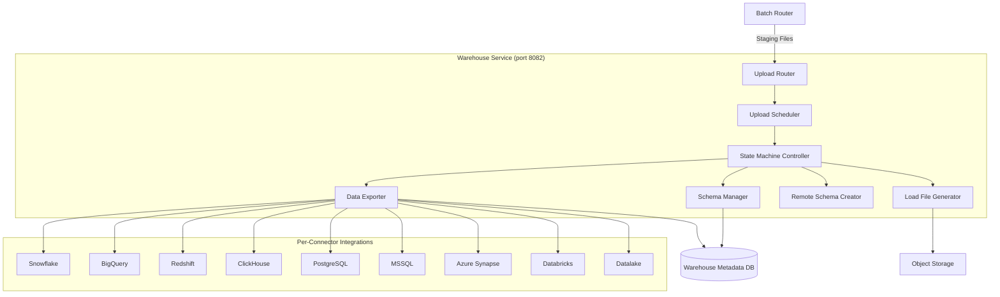
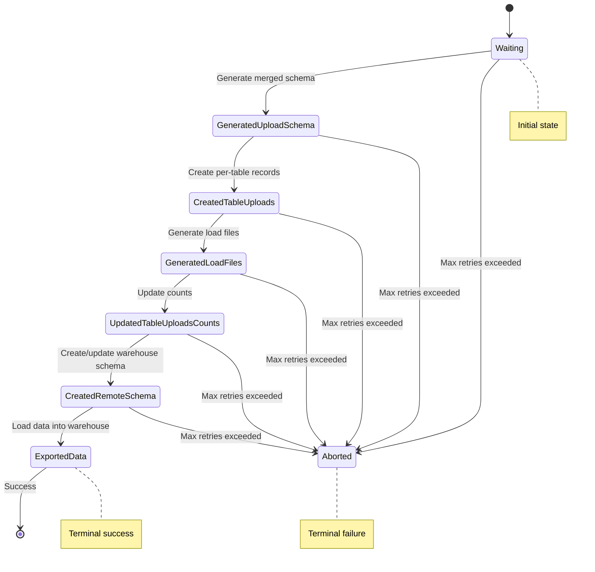
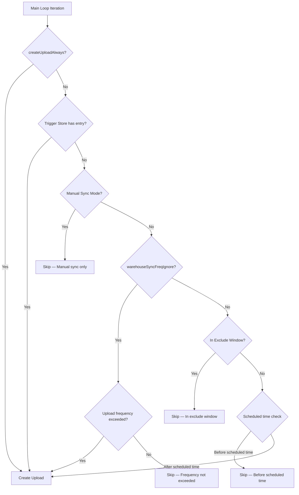

# Warehouse Sync Operations Guide

> Warehouse sync configuration, monitoring, and troubleshooting guide covering the 7-state upload lifecycle, schema evolution, parallel loading, and per-connector operational guidance.

## Overview

RudderStack's warehouse service loads event data from the processing pipeline into data warehouse destinations. It operates as a distinct service component that manages the full lifecycle of warehouse loading — from staging file ingestion through schema evolution and data export.

**Key characteristics:**

- Supports **9 warehouse connectors**: Snowflake, BigQuery, Redshift, PostgreSQL, ClickHouse, Databricks (Delta Lake), MSSQL, Azure Synapse, and S3/GCS/Azure Datalake
- Runs as an independent service on **port 8082** (configurable via `Warehouse.webPort`). Source: `config/config.yaml:147`
- Supports four operational modes: **embedded**, **master**, **slave**, and **off**
- Core operational concepts: **7-state upload lifecycle**, **schema evolution**, **parallel loading**, **scheduling**
- Staging files are received from the [Batch Router](../../architecture/data-flow.md) and converted into warehouse-optimized load files
- Uses PostgreSQL as its metadata store for upload tracking, schema caching, and staging file management

**Prerequisites:**

- Familiarity with the [Architecture Overview](../../architecture/overview.md) for system context
- Understanding of the [Warehouse State Machine](../../architecture/warehouse-state-machine.md) for detailed state transition logic
- Reference the [Warehouse Service Overview](../../warehouse/overview.md) for service architecture details

---

## Warehouse Service Architecture

### Operational Modes

The warehouse service can run in four modes, configured via `Warehouse.mode`. Source: `warehouse/app.go:117`, `config/config.yaml:146`

| Mode | Config Value | Description | Use Case |
|------|-------------|-------------|----------|
| Embedded | `embedded` | Warehouse runs within the main `rudder-server` process | Default; single-node deployments |
| Master | `master` | Warehouse runs as a standalone master coordinating slave workers | Large-scale, distributed warehouse loading |
| Slave | `slave` | Warehouse runs as a worker node receiving tasks from master | Horizontal scaling of warehouse loading |
| Off | `off` | Warehouse service disabled entirely | When warehouse sync is not needed |

**Default configuration:**

```yaml
# config/config.yaml
Warehouse:
  mode: embedded
```

In **embedded** mode, the warehouse service starts within the main `rudder-server` process and manages its own upload routing, scheduling, and execution. In **master/slave** mode, the master coordinates work distribution to slave instances via the PgNotifier system (PostgreSQL-based notification), enabling horizontal scaling of the data loading phase. Source: `warehouse/app.go:412-427`

### Components

The following diagram shows the internal architecture of the warehouse service:



**Component responsibilities:**

- **Upload Router** (`warehouse/router/router.go`): Manages per-destination-type routers, each maintaining a worker pool for concurrent upload processing. One router is spawned per enabled warehouse destination type.
- **Upload Scheduler** (`warehouse/router/scheduling.go`): Determines when uploads should be created based on timer-based frequency, exclude windows, manual triggers, and the `createUploadAlways` override.
- **State Machine Controller** (`warehouse/router/state.go`): Drives each upload through the 7-state lifecycle, handling state transitions, retries, and abort logic.
- **Schema Manager** (`warehouse/schema/schema.go`): Merges staging file schemas into consolidated upload schemas, manages schema caching with configurable TTL (default 720 minutes), and computes schema diffs.
- **Load File Generator**: Converts staging files (JSON) into warehouse-optimized load files (Parquet, CSV, or JSON) using connector-specific encoding. Source: `warehouse/encoding/`
- **Remote Schema Creator**: Executes DDL operations (CREATE TABLE, ALTER TABLE ADD COLUMN) on the remote warehouse to evolve the schema. Source: `warehouse/schema/`
- **Data Exporter**: Loads data into warehouse tables using connector-specific methods (COPY, MERGE, bulk insert, etc.).

---

## 7-State Upload Lifecycle

### State Machine Overview

Each warehouse upload (sync) traverses a **7-state lifecycle** plus an **Aborted** terminal state. The state machine is defined in `warehouse/router/state.go` and drives the upload through sequential processing stages. Each state has three sub-states: `in_progress`, `failed`, and `completed`. Source: `warehouse/router/state.go:9-15`

### State Definitions

| State | Name | Description |
|-------|------|-------------|
| 1 | `Waiting` | Upload is created and queued, waiting for a scheduling slot |
| 2 | `GeneratedUploadSchema` | Upload schema has been generated by merging staging file schemas |
| 3 | `CreatedTableUploads` | Per-table upload records have been created in the tracking database |
| 4 | `GeneratedLoadFiles` | Load files (Parquet/CSV/JSON) have been generated from staging files |
| 5 | `UpdatedTableUploadsCounts` | Table upload records updated with event counts and metadata |
| 6 | `CreatedRemoteSchema` | Schema has been created/updated in the remote warehouse (ALTER TABLE, CREATE TABLE) |
| 7 | `ExportedData` | Data has been loaded into the warehouse — **terminal success state** |
| — | `Aborted` | Upload permanently failed after exhausting retries — **terminal failure state** |

Source: `warehouse/router/state.go:19-82`

### Upload State Machine Diagram



- Any state can transition to `Aborted` after exceeding the retry time window (`Warehouse.retryTimeWindow`, default 180m). Source: `warehouse/router/upload.go:217`
- The `ExportedData` state is the terminal success state; `Aborted` is the terminal failure state. Both have `nextState: nil`. Source: `warehouse/router/state.go:80-81`
- Reference [Warehouse State Machine](../../architecture/warehouse-state-machine.md) for detailed state transition logic.

### State Transition Details

The state machine progresses linearly through the following transitions. Each transition is defined by the linked-list chain established in `warehouse/router/state.go:74-81`.

1. **Waiting → GeneratedUploadSchema**
   Merges schemas from all staging files for this upload batch. The `ConsolidateStagingFilesSchema` method in `warehouse/schema/schema.go:63` combines column types from individual staging files into a unified upload schema. Column type conflicts are resolved using type promotion rules (e.g., `int` → `float` → `string`).

2. **GeneratedUploadSchema → CreatedTableUploads**
   Creates tracking records for each table that will be loaded. Each table gets its own upload record in the `wh_table_uploads` table for independent status tracking. This enables per-table monitoring and independent retry.

3. **CreatedTableUploads → GeneratedLoadFiles**
   Converts staging files (JSON) into warehouse-optimized load files. The encoding format depends on the connector (Parquet, CSV, or JSON). Load file generation is coordinated via the PgNotifier in master/slave mode. Source: `warehouse/encoding/` for format details.

4. **GeneratedLoadFiles → UpdatedTableUploadsCounts**
   Updates event counts and metadata for each table upload. This step populates the `total_events` and related columns used for monitoring and progress tracking.

5. **UpdatedTableUploadsCounts → CreatedRemoteSchema**
   Executes DDL operations (CREATE TABLE, ALTER TABLE ADD COLUMN) on the remote warehouse. Schema evolution is automatic — the `TableSchemaDiff` method in `warehouse/schema/schema.go:66` computes the diff between existing and new schemas, and the connector applies the required DDL statements.

6. **CreatedRemoteSchema → ExportedData**
   Loads data into warehouse tables using connector-specific methods. Each connector implements its own loading strategy: Snowflake uses COPY FROM stage, BigQuery uses GCS-based loading, Redshift uses S3 MANIFEST-based COPY, ClickHouse uses bulk inserts, and PostgreSQL uses the COPY protocol.

---

## Scheduling and Upload Frequency

### Upload Scheduling

The upload scheduler determines when syncs should be triggered. The scheduling logic is implemented in `warehouse/router/scheduling.go` and is invoked by the router's main loop (`warehouse/router/router.go:491-534`) on each iteration.

### Scheduling Configuration

| Parameter | Config Key | Default | Type | Description |
|-----------|-----------|---------|------|-------------|
| Upload Frequency | `Warehouse.uploadFreqInS` | 1800 (30min) | int (seconds) | Default sync frequency interval |
| Sync Freq Ignore | `Warehouse.warehouseSyncFreqIgnore` | false | bool | Override per-destination sync frequency; use global `uploadFreqInS` only |
| Enable Jitter | `Warehouse.enableJitterForSyncs` | false | bool | Add random jitter to sync timing to avoid thundering herd |
| Prefetch Count | `Warehouse.warehouseSyncPreFetchCount` | 10 | int | Number of uploads to prefetch for scheduling |

Source: `config/config.yaml:148,156-158,161`, `warehouse/router/router.go:708,712-714`

### Scheduling Decision Flowchart



Source: `warehouse/router/scheduling.go:28-80`

### Scheduling Mechanisms

1. **Timer-Based** (default): Uploads are scheduled every `uploadFreqInS` interval (1800 seconds / 30 minutes by default). The scheduler checks whether enough time has elapsed since the last upload was created for each source-destination pair. Source: `warehouse/router/scheduling.go:44-49`

2. **Exclude Windows**: Time windows during which syncs should NOT run (e.g., during peak warehouse usage hours). Configured per destination in the Control Plane. The `checkCurrentTimeExistsInExcludeWindow` function handles both same-day and cross-midnight windows. Source: `warehouse/router/scheduling.go:94-117`

3. **Manual Sync**: When `ManualSyncSetting` is enabled for a destination, automatic uploads are blocked entirely. Syncs must be triggered via the Control Plane UI or API. Source: `warehouse/router/scheduling.go:40-42`

4. **Trigger Store**: Forced uploads via the trigger mechanism — the `triggerStore` (sync.Map) allows programmatic triggering per warehouse identifier. The `createUploadAlways` atomic boolean overrides all scheduling logic, enabling force-creation of uploads (settable via `rudder-cli`). Source: `warehouse/router/scheduling.go:30-37`, `warehouse/app.go:71`

### Upload Frequency Tuning

Choose your upload frequency based on your operational requirements:

- **Lower frequency** (e.g., `3600` / 1h): Reduces warehouse load, produces larger batches, better for cost-sensitive warehouses (Snowflake credit consumption, BigQuery slot usage). Increases data latency.
- **Higher frequency** (e.g., `300` / 5min): Reduces data latency, produces smaller batches, better for near-real-time analytics use cases. Increases warehouse load and may hit concurrency limits.

**Per-connector considerations:**

- **BigQuery**: Higher frequency is feasible due to serverless loading architecture (`maxParallelLoads: 20`). BigQuery handles high concurrency well.
- **Redshift / Snowflake**: Lower frequency recommended due to concurrent operation limits (`maxParallelLoads: 3`). Frequent small loads create many small files, degrading query performance.
- **ClickHouse**: Consider block size settings (`Warehouse.clickhouse.blockSize: 1000`). Very frequent syncs with small block sizes can fragment MergeTree partitions.

---

## Schema Evolution

### Automatic Schema Management

The warehouse service automatically manages table schemas in the target warehouse. Schema evolution occurs during the `CreatedRemoteSchema` state of the upload lifecycle.

- **New columns** are automatically added via ALTER TABLE operations
- **New tables** are automatically created via CREATE TABLE operations
- Schema is **never destructive** — columns are never dropped or renamed during automatic evolution
- Schema caching uses a configurable TTL (default 720 minutes) to reduce warehouse round-trips. Source: `warehouse/schema/schema.go:99`

Source: `warehouse/schema/schema.go`, [Schema Evolution](../../warehouse/schema-evolution.md) for detailed schema management documentation.

### Schema Merging

Upload schemas are generated by the `ConsolidateStagingFilesSchema` method, which merges column definitions from all staging files in the upload batch. Source: `warehouse/schema/schema.go:63`

- Column type conflicts are resolved using **type promotion rules** (e.g., `int` → `float` → `string`)
- Schema changes are tracked in the `wh_schemas` table for auditing
- Deprecated columns are identified using a UUID-tagged naming pattern (e.g., `abc-deprecated-dba626a7-...`). Source: `warehouse/schema/schema.go:34-36`
- Staging file schemas are paginated during consolidation (default page size: 100). Source: `warehouse/schema/schema.go:105`

### Schema-Related Configuration

| Parameter | Config Key | Default | Type | Description |
|-----------|-----------|---------|------|-------------|
| Enable ID Resolution | `Warehouse.enableIDResolution` | false | bool | Enable identity resolution during warehouse loading |
| Populate Historic Identities | `Warehouse.populateHistoricIdentities` | false | bool | Backfill historical identity merges |
| Schema TTL | `Warehouse.schemaTTLInMinutes` | 720 | int (minutes) | Time-to-live for cached warehouse schemas |
| Staging Files Schema Pagination | `Warehouse.stagingFilesSchemaPaginationSize` | 100 | int | Batch size for reading staging file schemas |
| Disable Alter | `Warehouse.disableAlter` | false | bool | Disable ALTER TABLE operations (schema freeze) |

Source: `config/config.yaml:159-160`, `warehouse/schema/schema.go:99,105`, `warehouse/router/upload.go:210`

---

## Parallel Loading

### Concurrent Upload Workers

The warehouse service uses a configurable worker pool for parallel upload processing. Workers are managed by each per-destination-type Router instance.

- **Default workers**: 8 per destination type (`Warehouse.noOfWorkers: 8`). Source: `config/config.yaml:149`, `warehouse/router/router.go:709`
- Each worker processes one upload at a time through the state machine
- Workers are assigned uploads by the upload job allocator (`warehouse/router/router.go:347-408`)
- Available workers = `noOfWorkers` - active worker count. Source: `warehouse/router/router.go:366`
- Per-destination-type override available: `Warehouse.{destType}.noOfWorkers`. Source: `warehouse/router/router.go:709`
- Max concurrent upload jobs per worker channel: 1 (configurable via `Warehouse.{destType}.maxConcurrentUploadJobs`). Source: `warehouse/router/router.go:702`

### Per-Warehouse Parallel Load Limits

Each warehouse connector has a configurable maximum for concurrent load operations. This limits the number of tables loaded in parallel during the `ExportedData` state.

| Warehouse | Config Key | Default | Rationale |
|-----------|-----------|---------|-----------|
| Snowflake | `Warehouse.snowflake.maxParallelLoads` | 3 | Concurrent stage PUT + COPY operations |
| BigQuery | `Warehouse.bigquery.maxParallelLoads` | 20 | Serverless architecture handles high concurrency |
| Redshift | `Warehouse.redshift.maxParallelLoads` | 3 | Limited concurrent COPY commands |
| PostgreSQL | `Warehouse.postgres.maxParallelLoads` | 3 | Connection pool limits |
| MSSQL | `Warehouse.mssql.maxParallelLoads` | 3 | Bulk CopyIn concurrency |
| Azure Synapse | `Warehouse.azure_synapse.maxParallelLoads` | 3 | COPY INTO concurrency |
| ClickHouse | `Warehouse.clickhouse.maxParallelLoads` | 3 | Insert concurrency |

Source: `config/config.yaml:162-176`

Reference [Capacity Planning](./capacity-planning.md) for overall tuning guidelines on worker counts and parallel load limits.

### Slave Worker Routines

In **master/slave** mode, each slave runs a configurable number of worker routines that receive upload tasks from the master via the PgNotifier system.

- Default slave worker routines: `Warehouse.noOfSlaveWorkerRoutines: 4`. Source: `config/config.yaml:150`
- Slaves connect to the master's PostgreSQL instance and listen for job notifications
- The notifier system is initialized in `warehouse/app.go:164-174` using the workspace identifier

---

## Retry and Error Handling

### Retry Configuration

| Parameter | Config Key | Default | Type | Description |
|-----------|-----------|---------|------|-------------|
| Min Retry Attempts | `Warehouse.minRetryAttempts` | 3 | int | Minimum retries before considering abort |
| Retry Time Window | `Warehouse.retryTimeWindow` | 180m | duration | Time window within which retries are allowed |
| Min Upload Backoff | `Warehouse.minUploadBackoff` | 60s | duration | Minimum wait between retries |
| Max Upload Backoff | `Warehouse.maxUploadBackoff` | 1800s | duration | Maximum wait between retries (exponential backoff cap) |

Source: `config/config.yaml:152-155`, `warehouse/router/upload.go:209,215-217`

### Exponential Backoff

Failed uploads use **exponential backoff** between retry attempts:

- Backoff range: `minUploadBackoff` (60s) → `maxUploadBackoff` (1800s)
- After each failed attempt, the backoff interval doubles up to the maximum
- After exhausting the retry time window (default 180m) **and** exceeding the minimum retry attempts (default 3), the upload is moved to `Aborted` state
- The `skipPreviouslyFailedTables` option (default `false`) can be enabled to skip tables that failed in previous attempts, allowing partial uploads to proceed. Source: `warehouse/router/upload.go:218`

### Common Failure Scenarios

1. **Schema creation failure**: Warehouse permissions insufficient for ALTER TABLE / CREATE TABLE. The service account needs DDL privileges on the target schema/database.
2. **Load file generation failure**: Object storage connectivity or permission issues. Verify bucket access and IAM/service account credentials.
3. **Data export failure**: Warehouse connectivity issues, query timeout, or compute quota exceeded. Check warehouse resource availability and timeout settings.
4. **Staging file corruption**: Malformed JSON in staging files from Batch Router. Check Batch Router logs for encoding errors.
5. **Long-running upload stat threshold**: Uploads running longer than `longRunningUploadStatThresholdInMin` (default 120 minutes) are flagged for monitoring. Source: `warehouse/router/upload.go:214`

---

## Warehouse-Specific Operational Notes

### Snowflake

- Uses external/internal stage for file staging
- Supports **Snowpipe Streaming** for near-real-time loading (reference internal doc: `warehouse/.cursor/docs/snowpipe-streaming.md`)
- Config: `Warehouse.snowflake.maxParallelLoads: 3`. Source: `config/config.yaml:165`
- Reference [Snowflake Guide](../../warehouse/snowflake.md) for complete connector documentation

### BigQuery

- Supports the **highest parallelism** (`maxParallelLoads: 20`) due to serverless architecture. Source: `config/config.yaml:167`
- Uses GCS as intermediate staging location for load file transfer
- Config: `Warehouse.bigquery.maxParallelLoads: 20`
- Reference [BigQuery Guide](../../warehouse/bigquery.md) for complete connector documentation

### Redshift

- Supports **IAM-based** and **password-based** authentication
- Uses S3 for staging with MANIFEST file-based loading for atomic batch loads
- Config: `Warehouse.redshift.maxParallelLoads: 3`. Source: `config/config.yaml:163`
- Reference [Redshift Guide](../../warehouse/redshift.md) for complete connector documentation

### ClickHouse

ClickHouse has additional configuration options for fine-tuning insert behavior:

| Parameter | Config Key | Default | Description |
|-----------|-----------|---------|-------------|
| Block Size | `Warehouse.clickhouse.blockSize` | 1000 | Rows per insert block |
| Pool Size | `Warehouse.clickhouse.poolSize` | 10 | Connection pool size |
| Disable Nullable | `Warehouse.clickhouse.disableNullable` | false | Use non-nullable columns (avoids `Nullable()` type wrapper) |
| Enable Arrays | `Warehouse.clickhouse.enableArraySupport` | false | Enable `Array` column type support |
| Query Debug Logs | `Warehouse.clickhouse.queryDebugLogs` | false | Enable query-level debug logging |

Source: `config/config.yaml:175-181`

Reference [ClickHouse Guide](../../warehouse/clickhouse.md) for complete connector documentation.

### Databricks (Delta Lake)

- Load table strategy: **`MERGE`** (default) — dedup-capable upsert using Delta Lake merge semantics. Source: `config/config.yaml:183`
- Alternative: **`APPEND`** — faster but no deduplication
- Config: `Warehouse.deltalake.loadTableStrategy: MERGE`
- Reference [Databricks Guide](../../warehouse/databricks.md) for complete connector documentation

### PostgreSQL

- Uses the PostgreSQL **COPY** protocol for high-throughput bulk loading
- Additional config: `Warehouse.postgres.enableSQLStatementExecutionPlan: false` — when enabled, logs SQL execution plans for debugging. Source: `config/config.yaml:170`
- Config: `Warehouse.postgres.maxParallelLoads: 3`. Source: `config/config.yaml:169`
- Reference [PostgreSQL Guide](../../warehouse/postgres.md) for complete connector documentation

### MSSQL

- Uses **bulk CopyIn** for high-throughput data loading
- Config: `Warehouse.mssql.maxParallelLoads: 3`. Source: `config/config.yaml:172`
- Reference [MSSQL Guide](../../warehouse/mssql.md) for complete connector documentation

### Azure Synapse

- Uses **COPY INTO** command for data ingestion from staging files
- Config: `Warehouse.azure_synapse.maxParallelLoads: 3`. Source: `config/config.yaml:174`
- Reference [Azure Synapse Guide](../../warehouse/azure-synapse.md) for complete connector documentation

---

## Monitoring Warehouse Syncs

### Key Metrics

The warehouse service exposes metrics via the configured stats backend (Prometheus/StatsD). Key metrics to monitor:

| Metric | Type | Description |
|--------|------|-------------|
| `upload_time` | Timer | Total time for a complete upload cycle |
| `user_tables_load_time` | Timer | Time spent loading user tables |
| `identity_tables_load_time` | Timer | Time spent loading identity tables |
| `other_tables_load_time` | Timer | Time spent loading other tables |
| `load_file_generation_time` | Timer | Time spent generating load files |
| `warehouse_failed_uploads` | Counter | Count of failed upload attempts |
| `total_rows_synced` | Counter | Total rows synced to warehouse |
| `num_staged_events` | Counter | Number of events staged for loading |
| `upload_success` | Counter | Count of successful uploads |
| `wh_processing_pending_jobs` | Gauge | Number of pending upload jobs |
| `wh_processing_available_workers` | Gauge | Number of available worker slots |
| `wh_processing_pickup_lag` | Timer | Time between upload creation and pickup |
| `wh_scheduler_warehouse_length` | Gauge | Number of warehouses in the scheduler |
| `warehouse_schema_size` | Histogram | Size of consolidated warehouse schemas |

Source: `warehouse/router/upload.go:232-247`, `warehouse/router/router.go:720-727`

### Health Checks

- **Warehouse HTTP endpoint**: `http://localhost:8082/health`
- Check upload queue depth via the `wh_processing_pending_jobs` gauge
- Monitor for uploads stuck in a single state for extended periods
- Track `Aborted` upload count — a rising count indicates persistent issues requiring investigation
- Monitor `wh_processing_pickup_lag` — high lag indicates worker pool saturation

```bash
# Verify warehouse service health
curl -s http://localhost:8082/health
```

### PgNotifier (Master/Slave Coordination)

When running in master/slave mode, the PgNotifier system coordinates work distribution. Monitor these settings:

| Parameter | Config Key | Default | Description |
|-----------|-----------|---------|-------------|
| Retrigger Interval | `PgNotifier.retriggerInterval` | 2s | Interval for retrying unclaimed notifications |
| Retrigger Count | `PgNotifier.retriggerCount` | 500 | Max notifications per retrigger cycle |
| Track Batch Interval | `PgNotifier.trackBatchInterval` | 2s | Interval for batch tracking updates |
| Max Attempt | `PgNotifier.maxAttempt` | 3 | Max attempts per notification before marking as failed |

Source: `config/config.yaml:246-250`

---

## Configuration Summary

### Complete Warehouse Configuration Table

Consolidated table of all warehouse-related configuration parameters:

| Parameter | Config Key | Default | Type | Description |
|-----------|-----------|---------|------|-------------|
| Mode | `Warehouse.mode` | `embedded` | string | Operational mode (embedded/master/slave/off) |
| Web Port | `Warehouse.webPort` | `8082` | int | HTTP/gRPC port for warehouse service |
| Upload Frequency | `Warehouse.uploadFreq` | `1800s` | duration | Default sync frequency |
| Workers | `Warehouse.noOfWorkers` | `8` | int | Concurrent upload workers per destination type |
| Slave Routines | `Warehouse.noOfSlaveWorkerRoutines` | `4` | int | Worker routines per slave instance |
| Main Loop Sleep | `Warehouse.mainLoopSleep` | `5s` | duration | Sleep between main loop iterations |
| Min Retry Attempts | `Warehouse.minRetryAttempts` | `3` | int | Minimum retries before considering abort |
| Retry Time Window | `Warehouse.retryTimeWindow` | `180m` | duration | Time window for retries |
| Min Upload Backoff | `Warehouse.minUploadBackoff` | `60s` | duration | Minimum backoff between retries |
| Max Upload Backoff | `Warehouse.maxUploadBackoff` | `1800s` | duration | Maximum backoff between retries |
| Prefetch Count | `Warehouse.warehouseSyncPreFetchCount` | `10` | int | Upload prefetch count for scheduling |
| Sync Freq Ignore | `Warehouse.warehouseSyncFreqIgnore` | `false` | bool | Override per-destination sync frequency |
| Staging Batch Size | `Warehouse.stagingFilesBatchSize` | `960` | int | Maximum staging files per upload batch |
| Enable ID Resolution | `Warehouse.enableIDResolution` | `false` | bool | Enable identity resolution during loading |
| Populate Historic Identities | `Warehouse.populateHistoricIdentities` | `false` | bool | Backfill historical identity merges |
| Enable Jitter | `Warehouse.enableJitterForSyncs` | `false` | bool | Add random jitter to sync timing |
| Max Open Connections | `Warehouse.maxOpenConnections` | `20` | int | Max PostgreSQL connections for warehouse DB |

Source: `config/config.yaml:145-183`, `warehouse/app.go:111-123`

### Per-Connector Configuration Summary

| Connector | maxParallelLoads | Additional Settings |
|-----------|-----------------|---------------------|
| Snowflake | 3 | — |
| BigQuery | 20 | — |
| Redshift | 3 | — |
| PostgreSQL | 3 | `enableSQLStatementExecutionPlan: false` |
| MSSQL | 3 | — |
| Azure Synapse | 3 | — |
| ClickHouse | 3 | `blockSize: 1000`, `poolSize: 10`, `disableNullable: false`, `enableArraySupport: false`, `queryDebugLogs: false` |
| Delta Lake | — | `loadTableStrategy: MERGE` |

Source: `config/config.yaml:162-183`

Reference [Configuration Reference](../../reference/config-reference.md) for the complete parameter list across all components.

### Example: Complete Warehouse Configuration Block

```yaml
# config/config.yaml — Warehouse section
Warehouse:
  mode: embedded                    # Operational mode
  webPort: 8082                     # HTTP/gRPC port
  uploadFreq: 1800s                 # 30-minute sync frequency
  noOfWorkers: 8                    # Upload workers per destination type
  noOfSlaveWorkerRoutines: 4        # Worker routines per slave
  mainLoopSleep: 5s                 # Main loop sleep
  minRetryAttempts: 3               # Min retries before abort
  retryTimeWindow: 180m             # Retry window
  minUploadBackoff: 60s             # Min backoff
  maxUploadBackoff: 1800s           # Max backoff
  warehouseSyncPreFetchCount: 10    # Prefetch count
  warehouseSyncFreqIgnore: false    # Override sync frequency
  stagingFilesBatchSize: 960        # Staging files per batch
  enableIDResolution: false         # Identity resolution
  populateHistoricIdentities: false # Historic identities
  enableJitterForSyncs: false       # Sync jitter
  redshift:
    maxParallelLoads: 3
  snowflake:
    maxParallelLoads: 3
  bigquery:
    maxParallelLoads: 20
  postgres:
    maxParallelLoads: 3
    enableSQLStatementExecutionPlan: false
  mssql:
    maxParallelLoads: 3
  azure_synapse:
    maxParallelLoads: 3
  clickhouse:
    maxParallelLoads: 3
    queryDebugLogs: false
    blockSize: 1000
    poolSize: 10
    disableNullable: false
    enableArraySupport: false
  deltalake:
    loadTableStrategy: MERGE

# PgNotifier — Master/Slave coordination
PgNotifier:
  retriggerInterval: 2s
  retriggerCount: 500
  trackBatchInterval: 2s
  maxAttempt: 3
```

---

## Troubleshooting

### Common Issues

1. **Uploads stuck in `Waiting`**
   - Check upload frequency — is the `uploadFreq` interval too long?
   - Check scheduling exclude windows — is the current time within an exclude window?
   - Check manual sync mode — is `ManualSyncSetting` enabled for the destination?
   - Verify the trigger store — use `rudder-cli` to force `createUploadAlways` if needed
   - Check worker availability — are all workers occupied? Monitor `wh_processing_available_workers`

2. **Uploads stuck in `GeneratedUploadSchema`**
   - Check staging file integrity — are staging files valid JSON?
   - Check disk space for temporary schema operations
   - Verify PostgreSQL connectivity for schema metadata storage
   - Check `warehouse_consolidated_schema_size` metric for unusually large schemas

3. **Uploads stuck in `CreatedRemoteSchema`**
   - Check warehouse permissions — the service account needs CREATE TABLE and ALTER TABLE privileges
   - Verify network connectivity to the warehouse
   - Check for warehouse-specific column type conflicts (e.g., reserved words as column names)
   - If `Warehouse.disableAlter: true`, schema changes are blocked

4. **Uploads stuck during data export (loading phase)**
   - Check warehouse capacity and compute resources
   - Verify parallel load limits are not exceeded (`maxParallelLoads`)
   - Check timeout settings — increase `Warehouse.dbHandleTimeout` if warehouse queries are slow
   - Monitor for warehouse-side errors (disk space, quota, concurrent query limits)

5. **Uploads moving to `Aborted`**
   - Check retry configuration — increase `retryTimeWindow` if failures are transient
   - Review warehouse error logs for root cause
   - Increase `minRetryAttempts` for destinations with intermittent connectivity
   - Check `warehouse_failed_uploads` metric for patterns

6. **Schema evolution errors**
   - Check warehouse column type compatibility — some warehouses don't support all type promotions
   - Ensure new column names don't conflict with reserved words
   - Review the schema diff log for unexpected column additions
   - Check `Warehouse.disableAlter` setting

7. **Slow staging file processing**
   - Increase `Warehouse.stagingFilesBatchSize` (default 960) for larger batches
   - Check object storage latency and throughput
   - Monitor load file generation time via `load_file_generation_time` metric
   - Verify encoding settings for the connector (Parquet vs CSV performance differs)

8. **Master/slave communication issues**
   - Verify PgNotifier PostgreSQL connectivity between master and slaves
   - Check `PgNotifier.maxAttempt` — increase if notifications are being dropped
   - Monitor `PgNotifier.retriggerInterval` and `retriggerCount` for tuning
   - Ensure all slaves can reach the shared PostgreSQL instance

### Diagnostic Commands

**Check upload state distribution:**

```bash
# Query warehouse uploads table for state distribution
psql -U ubuntu -d ubuntu -c \
  "SELECT status, count(*) FROM wh_uploads GROUP BY status ORDER BY count DESC;"
```

**Check staging file backlog:**

```bash
# Count pending staging files per source-destination pair
psql -U ubuntu -d ubuntu -c \
  "SELECT source_id, destination_id, count(*) FROM wh_staging_files
   WHERE status = 'waiting'
   GROUP BY source_id, destination_id
   ORDER BY count DESC;"
```

**Check recent upload errors:**

```bash
# View recent failed uploads with error details
psql -U ubuntu -d ubuntu -c \
  "SELECT id, source_id, destination_id, destination_type, status, error, updated_at
   FROM wh_uploads
   WHERE status LIKE '%failed%' OR status = 'aborted'
   ORDER BY updated_at DESC
   LIMIT 20;"
```

**Verify warehouse service connectivity:**

```bash
# Health check
curl -s http://localhost:8082/health

# Check if the service is listening
lsof -i :8082
```

**Check table upload status for a specific upload:**

```bash
# View per-table upload status
psql -U ubuntu -d ubuntu -c \
  "SELECT wh_upload_id, table_name, status, total_events, error
   FROM wh_table_uploads
   WHERE wh_upload_id = <UPLOAD_ID>
   ORDER BY table_name;"
```

---

## Cross-References

- [Architecture Overview](../../architecture/overview.md) — System architecture context
- [Warehouse State Machine](../../architecture/warehouse-state-machine.md) — Detailed state transition documentation
- [Data Flow](../../architecture/data-flow.md) — End-to-end event pipeline
- [Warehouse Service Overview](../../warehouse/overview.md) — Service architecture details
- [Schema Evolution](../../warehouse/schema-evolution.md) — Schema management details
- [Snowflake Guide](../../warehouse/snowflake.md) — Snowflake connector configuration
- [BigQuery Guide](../../warehouse/bigquery.md) — BigQuery connector configuration
- [Redshift Guide](../../warehouse/redshift.md) — Redshift connector configuration
- [Capacity Planning](./capacity-planning.md) — Throughput tuning and scaling
- [Configuration Reference](../../reference/config-reference.md) — All 200+ parameters
- [Environment Variable Reference](../../reference/env-var-reference.md) — Environment variables
