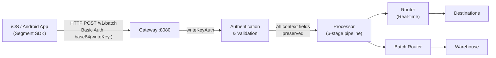

# Mobile SDK Compatibility Guide (iOS & Android)

RudderStack's Gateway is fully compatible with Segment's mobile SDKs — **`analytics-ios`** (Analytics-Swift) and **`analytics-android`** (Analytics-Kotlin). All five mobile event API calls (`identify`, `track`, `screen`, `group`, `alias`), the batch endpoint (`/v1/batch`), Write Key Basic Auth, automatic context collection, and application lifecycle events work identically to Segment. Migrating from Segment requires **only two changes**: swap the `apiHost` endpoint URL to your RudderStack data plane and replace the write key.

> **Key Migration Principle:** The RudderStack Gateway implements the Segment Spec at the HTTP protocol level. The existing Segment mobile SDK packages work as-is — no SDK replacement, fork, or wrapper is necessary. Only `apiHost` and `writeKey` configuration values change.

> Source: `gateway/openapi.yaml` — Segment-compatible HTTP API definition (all `/v1/*` endpoints)
> Source: `gateway/handle_http.go` — Handler chain wiring (`callType → writeKeyAuth → webHandler → webRequestHandler`)
> Source: `gateway/handle_http_auth.go:24-57` — `writeKeyAuth` middleware implementation
> Source: `gateway/handle.go` — Core request handler preserving all SDK context fields

Reference: `refs/segment-docs/src/connections/sources/catalog/libraries/mobile/ios/` — iOS SDK reference
Reference: `refs/segment-docs/src/connections/sources/catalog/libraries/mobile/android/` — Android SDK reference

---

## Table of Contents

- [Compatibility Status Overview](#compatibility-status-overview)
- [iOS SDK (Analytics-Swift)](#ios-sdk-analytics-swift)
  - [SDK Variants](#ios-sdk-variants)
  - [Configuration — Before & After](#ios-configuration--before--after)
  - [Supported Calls](#ios-supported-calls)
- [Android SDK (Analytics-Kotlin)](#android-sdk-analytics-kotlin)
  - [SDK Variants](#android-sdk-variants)
  - [Configuration — Before & After](#android-configuration--before--after)
  - [Supported Calls](#android-supported-calls)
- [Context Auto-Collection Fields](#context-auto-collection-fields)
  - [context.device](#contextdevice)
  - [context.os](#contextos)
  - [context.app](#contextapp)
  - [context.network](#contextnetwork)
  - [context.screen](#contextscreen)
  - [Context Field Verification Table](#context-field-verification-table)
  - [Full Context Payload Example](#full-context-payload-example)
- [Lifecycle Events](#lifecycle-events)
  - [Application Opened](#application-opened)
  - [Application Backgrounded](#application-backgrounded)
  - [Application Updated](#application-updated)
  - [Application Installed](#application-installed)
  - [Lifecycle Event Matrix](#lifecycle-event-matrix)
- [Gateway Processing Verification](#gateway-processing-verification)
- [Platform-Specific Considerations](#platform-specific-considerations)
  - [iOS Considerations](#ios-considerations)
  - [Android Considerations](#android-considerations)
- [Troubleshooting](#troubleshooting)
- [Cross-References](#cross-references)

---

## Compatibility Status Overview

- **iOS (Analytics-Swift):** ✅ Fully Compatible (Cloud Mode)
- **Android (Analytics-Kotlin):** ✅ Fully Compatible (Cloud Mode)

Both Segment mobile SDKs connect to the RudderStack Gateway on port 8080 using the same HTTP Basic Auth scheme, the same payload format, and the same batch endpoint (`/v1/batch`). All mobile-specific context fields and lifecycle events are preserved end-to-end through the Gateway processing pipeline.

### Combined Compatibility Matrix

| Feature | iOS (Analytics-Swift) | Android (Analytics-Kotlin) | Status |
|---------|----------------------|---------------------------|--------|
| `identify` | ✅ | ✅ | Verified |
| `track` | ✅ | ✅ | Verified |
| `screen` | ✅ | ✅ | Verified |
| `group` | ✅ | ✅ | Verified |
| `alias` | ✅ | ✅ | Verified |
| Batch endpoint (`/v1/batch`) | ✅ | ✅ | Verified |
| Write Key Basic Auth | ✅ | ✅ | Verified |
| Context auto-collection | ✅ | ✅ | Verified |
| Lifecycle events | ✅ | ✅ | Verified |
| Device-mode destinations | ⚠️ | ⚠️ | Not supported |

> **Device-mode limitation:** The RudderStack Gateway operates in **cloud mode** only. Device-mode destination forwarding (where the SDK sends events directly to a destination's client-side SDK) is a client-side SDK feature and is not handled by the server-side Gateway. All events flow through the Gateway → Processor → Router pipeline.

> Source: `gateway/handle_http.go:37-69` — All six event type handlers registered with `writeKeyAuth`

---

## iOS SDK (Analytics-Swift)

### iOS SDK Variants

| SDK | Status | Minimum Platform | Language |
|-----|--------|-----------------|----------|
| **Analytics-Swift** | **Recommended** | iOS 13+, macOS 10.15+, tvOS 11+, watchOS 7+ | Swift |
| Analytics-iOS | Legacy (maintenance only) | iOS 13+ | Objective-C |

> **Note:** New integrations should use Analytics-Swift. The legacy Analytics-iOS SDK is in maintenance mode. Both SDKs produce identical HTTP payloads and are fully compatible with the RudderStack Gateway.

Reference: `refs/segment-docs/src/connections/sources/catalog/libraries/mobile/ios/` — iOS SDK documentation

### iOS Configuration — Before & After

The only configuration change from Segment is setting `.apiHost()` to your RudderStack data plane URL and providing your RudderStack source write key.

**UIKit AppDelegate:**

```swift
import UIKit
import Segment

@UIApplicationMain
class AppDelegate: UIResponder, UIApplicationDelegate {
    var analytics: Analytics?

    func application(
        _ application: UIApplication,
        didFinishLaunchingWithOptions launchOptions: [UIApplication.LaunchOptionsKey: Any]?
    ) -> Bool {

        // =============================================
        // BEFORE (Segment — default api.segment.io/v1)
        // =============================================
        // let configuration = Configuration(writeKey: "SEGMENT_WRITE_KEY")
        //     .trackApplicationLifecycleEvents(true)

        // =============================================
        // AFTER (RudderStack — your data plane URL)
        // =============================================
        let configuration = Configuration(writeKey: "YOUR_RUDDERSTACK_WRITE_KEY")
            .apiHost("YOUR_DATA_PLANE_URL:8080/v1")
            .trackApplicationLifecycleEvents(true)
            .flushAt(20)
            .flushInterval(30)

        analytics = Analytics(configuration: configuration)
        return true
    }
}
```

**SwiftUI @main App:**

```swift
import SwiftUI
import Segment

@main
struct MyApp: App {
    let analytics: Analytics

    init() {
        // =============================================
        // BEFORE (Segment)
        // =============================================
        // let configuration = Configuration(writeKey: "SEGMENT_WRITE_KEY")

        // =============================================
        // AFTER (RudderStack)
        // =============================================
        let configuration = Configuration(writeKey: "YOUR_RUDDERSTACK_WRITE_KEY")
            .apiHost("YOUR_DATA_PLANE_URL:8080/v1")
            .trackApplicationLifecycleEvents(true)
            .flushAt(20)
            .flushInterval(30)

        analytics = Analytics(configuration: configuration)
    }

    var body: some Scene {
        WindowGroup {
            ContentView()
                .environment(\.analytics, analytics)
        }
    }
}
```

> **Important:** Replace `YOUR_DATA_PLANE_URL` with the hostname (or IP) of your RudderStack instance and `YOUR_RUDDERSTACK_WRITE_KEY` with the source write key from your workspace. The default Segment API host `api.segment.io/v1` is overridden by `.apiHost()`.

### iOS Supported Calls

All five mobile event API calls are fully supported. The SDK handles batching, authentication, and context enrichment automatically.

#### identify

```swift
analytics.identify(userId: "user-abc-123", traits: [
    "name": "Sarah Chen",
    "email": "sarah.chen@example.com",
    "plan": "Business",
    "createdAt": "2025-03-10T14:22:00Z"
])
```

**Gateway payload (JSON sent to `POST /v1/batch`):**

```json
{
  "type": "identify",
  "userId": "user-abc-123",
  "anonymousId": "B5A7F1C2-3D4E-5F6A-7B8C-9D0E1F2A3B4C",
  "traits": {
    "name": "Sarah Chen",
    "email": "sarah.chen@example.com",
    "plan": "Business",
    "createdAt": "2025-03-10T14:22:00Z"
  },
  "context": {
    "library": {
      "name": "analytics-ios",
      "version": "1.5.11"
    }
  },
  "timestamp": "2025-03-15T10:30:00.000Z",
  "messageId": "a1b2c3d4-e5f6-7890-abcd-ef1234567890"
}
```

#### track

```swift
analytics.track(name: "Product Viewed", properties: [
    "productId": "prod-9001",
    "productName": "Wireless Headphones",
    "price": 79.99,
    "currency": "USD"
])
```

**Gateway payload:**

```json
{
  "type": "track",
  "event": "Product Viewed",
  "userId": "user-abc-123",
  "anonymousId": "B5A7F1C2-3D4E-5F6A-7B8C-9D0E1F2A3B4C",
  "properties": {
    "productId": "prod-9001",
    "productName": "Wireless Headphones",
    "price": 79.99,
    "currency": "USD"
  },
  "context": {
    "library": {
      "name": "analytics-ios",
      "version": "1.5.11"
    }
  },
  "timestamp": "2025-03-15T10:31:00.000Z",
  "messageId": "f1e2d3c4-b5a6-7890-abcd-ef1234567891"
}
```

#### screen

```swift
analytics.screen(title: "Product Detail", category: "Shopping", properties: [
    "productId": "prod-9001",
    "productName": "Wireless Headphones"
])
```

**Gateway payload:**

```json
{
  "type": "screen",
  "name": "Product Detail",
  "userId": "user-abc-123",
  "anonymousId": "B5A7F1C2-3D4E-5F6A-7B8C-9D0E1F2A3B4C",
  "properties": {
    "productId": "prod-9001",
    "productName": "Wireless Headphones",
    "category": "Shopping"
  },
  "context": {
    "library": {
      "name": "analytics-ios",
      "version": "1.5.11"
    }
  },
  "timestamp": "2025-03-15T10:32:00.000Z",
  "messageId": "a2b3c4d5-e6f7-8901-bcde-f12345678902"
}
```

#### group

```swift
analytics.group(groupId: "org-456", traits: [
    "name": "Acme Technologies",
    "industry": "SaaS",
    "employees": 250,
    "plan": "Enterprise"
])
```

**Gateway payload:**

```json
{
  "type": "group",
  "groupId": "org-456",
  "userId": "user-abc-123",
  "anonymousId": "B5A7F1C2-3D4E-5F6A-7B8C-9D0E1F2A3B4C",
  "traits": {
    "name": "Acme Technologies",
    "industry": "SaaS",
    "employees": 250,
    "plan": "Enterprise"
  },
  "context": {
    "library": {
      "name": "analytics-ios",
      "version": "1.5.11"
    }
  },
  "timestamp": "2025-03-15T10:33:00.000Z",
  "messageId": "b3c4d5e6-f7a8-9012-cdef-123456789013"
}
```

#### alias

```swift
analytics.alias(newId: "user-abc-123")
```

**Gateway payload:**

```json
{
  "type": "alias",
  "userId": "user-abc-123",
  "previousId": "B5A7F1C2-3D4E-5F6A-7B8C-9D0E1F2A3B4C",
  "context": {
    "library": {
      "name": "analytics-ios",
      "version": "1.5.11"
    }
  },
  "timestamp": "2025-03-15T10:34:00.000Z",
  "messageId": "c4d5e6f7-a8b9-0123-defa-234567890124"
}
```

> Source: `gateway/openapi.yaml` — IdentifyPayload, TrackPayload, ScreenPayload, GroupPayload, AliasPayload schemas

---

## Android SDK (Analytics-Kotlin)

### Android SDK Variants

| SDK | Status | Min API | Language |
|-----|--------|---------|----------|
| **Analytics-Kotlin** | **Recommended** | API 21 (Android 5.0+) | Kotlin |
| Analytics-Android | Legacy (EOL March 2026) | API 14 (Android 4.0+) | Java |

> **End-of-Support Notice:** The legacy Analytics-Android SDK reaches end of support in March 2026. New integrations should use Analytics-Kotlin. Existing Analytics-Android users should plan migration to Analytics-Kotlin.

Reference: `refs/segment-docs/src/connections/sources/catalog/libraries/mobile/android/` — Android SDK documentation

### Android Configuration — Before & After

The only configuration change is the `apiHost` endpoint URL and write key. All event calls, batching, and context collection remain identical.

**Application class (Kotlin — Analytics-Kotlin):**

```kotlin
import android.app.Application
import com.segment.analytics.kotlin.android.Analytics
import com.segment.analytics.kotlin.core.Analytics

class MyApplication : Application() {

    companion object {
        lateinit var analytics: Analytics
    }

    override fun onCreate() {
        super.onCreate()

        // =============================================
        // BEFORE (Segment — default api.segment.io/v1)
        // =============================================
        // analytics = Analytics("SEGMENT_WRITE_KEY", applicationContext) {
        //     trackApplicationLifecycleEvents = true
        // }

        // =============================================
        // AFTER (RudderStack — your data plane URL)
        // =============================================
        analytics = Analytics("YOUR_RUDDERSTACK_WRITE_KEY", applicationContext) {
            apiHost = "YOUR_DATA_PLANE_URL:8080/v1"
            trackApplicationLifecycleEvents = true
            flushAt = 20
            flushInterval = 30
            collectDeviceId = true
        }
    }
}
```

**Activity onCreate (Kotlin):**

```kotlin
import android.os.Bundle
import androidx.appcompat.app.AppCompatActivity
import com.segment.analytics.kotlin.android.Analytics
import com.segment.analytics.kotlin.core.Analytics

class MainActivity : AppCompatActivity() {

    override fun onCreate(savedInstanceState: Bundle?) {
        super.onCreate(savedInstanceState)

        // Access the global Analytics instance
        val analytics = MyApplication.analytics

        // All event calls work identically — no changes from Segment
        analytics.identify("user-xyz-789")
        analytics.track("Activity Started")
    }
}
```

**Legacy Analytics-Android SDK (Java):**

```java
import com.segment.analytics.Analytics;
import java.util.concurrent.TimeUnit;

public class MyApplication extends Application {

    @Override
    public void onCreate() {
        super.onCreate();

        // BEFORE (Segment)
        // Analytics analytics = new Analytics.Builder(this, "SEGMENT_WRITE_KEY")
        //     .trackApplicationLifecycleEvents()
        //     .build();

        // AFTER (RudderStack)
        Analytics analytics = new Analytics.Builder(this, "YOUR_RUDDERSTACK_WRITE_KEY")
            .defaultApiHost("YOUR_DATA_PLANE_URL:8080/v1")
            .trackApplicationLifecycleEvents()
            .flushQueueSize(20)
            .flushInterval(30, TimeUnit.SECONDS)
            .build();

        Analytics.setSingletonInstance(analytics);
    }
}
```

> **Important:** Replace `YOUR_RUDDERSTACK_WRITE_KEY` with your RudderStack source write key and `YOUR_DATA_PLANE_URL` with your data plane hostname or IP. Initialize the Analytics client **once** in your Application class — instantiation is expensive and should use the singleton pattern.

### Android Supported Calls

All five mobile event API calls are fully supported. The SDK handles batching to `/v1/batch`, Write Key Basic Auth, and automatic context enrichment.

#### identify

```kotlin
analytics.identify("user-xyz-789", buildJsonObject {
    put("name", "Marcus Rivera")
    put("email", "marcus.rivera@example.com")
    put("plan", "Premium")
    put("createdAt", "2025-02-20T09:15:00Z")
})
```

**Gateway payload (JSON sent to `POST /v1/batch`):**

```json
{
  "type": "identify",
  "userId": "user-xyz-789",
  "anonymousId": "a1b2c3d4-5e6f-7a8b-9c0d-e1f2a3b4c5d6",
  "traits": {
    "name": "Marcus Rivera",
    "email": "marcus.rivera@example.com",
    "plan": "Premium",
    "createdAt": "2025-02-20T09:15:00Z"
  },
  "context": {
    "library": {
      "name": "analytics-android",
      "version": "1.16.3"
    }
  },
  "timestamp": "2025-03-15T11:00:00.000Z",
  "messageId": "d5e6f7a8-b9c0-1234-efab-567890abcdef"
}
```

#### track

```kotlin
analytics.track("Order Completed", buildJsonObject {
    put("orderId", "order-2025-0312")
    put("revenue", 149.99)
    put("currency", "USD")
    put("products", buildJsonArray {
        add(buildJsonObject {
            put("productId", "prod-5001")
            put("name", "Bluetooth Speaker")
            put("price", 149.99)
            put("quantity", 1)
        })
    })
})
```

**Gateway payload:**

```json
{
  "type": "track",
  "event": "Order Completed",
  "userId": "user-xyz-789",
  "anonymousId": "a1b2c3d4-5e6f-7a8b-9c0d-e1f2a3b4c5d6",
  "properties": {
    "orderId": "order-2025-0312",
    "revenue": 149.99,
    "currency": "USD",
    "products": [
      {
        "productId": "prod-5001",
        "name": "Bluetooth Speaker",
        "price": 149.99,
        "quantity": 1
      }
    ]
  },
  "context": {
    "library": {
      "name": "analytics-android",
      "version": "1.16.3"
    }
  },
  "timestamp": "2025-03-15T11:01:00.000Z",
  "messageId": "e6f7a8b9-c0d1-2345-fabc-67890abcdef1"
}
```

#### screen

```kotlin
analytics.screen("Product Detail", buildJsonObject {
    put("productId", "prod-5001")
    put("productName", "Bluetooth Speaker")
    put("category", "Electronics")
})
```

**Gateway payload:**

```json
{
  "type": "screen",
  "name": "Product Detail",
  "userId": "user-xyz-789",
  "anonymousId": "a1b2c3d4-5e6f-7a8b-9c0d-e1f2a3b4c5d6",
  "properties": {
    "productId": "prod-5001",
    "productName": "Bluetooth Speaker",
    "category": "Electronics"
  },
  "context": {
    "library": {
      "name": "analytics-android",
      "version": "1.16.3"
    }
  },
  "timestamp": "2025-03-15T11:02:00.000Z",
  "messageId": "f7a8b9c0-d1e2-3456-abcd-7890abcdef12"
}
```

#### group

```kotlin
analytics.group("company-321", buildJsonObject {
    put("name", "Nova Industries")
    put("industry", "Manufacturing")
    put("employees", 1200)
    put("plan", "Enterprise")
})
```

**Gateway payload:**

```json
{
  "type": "group",
  "groupId": "company-321",
  "userId": "user-xyz-789",
  "anonymousId": "a1b2c3d4-5e6f-7a8b-9c0d-e1f2a3b4c5d6",
  "traits": {
    "name": "Nova Industries",
    "industry": "Manufacturing",
    "employees": 1200,
    "plan": "Enterprise"
  },
  "context": {
    "library": {
      "name": "analytics-android",
      "version": "1.16.3"
    }
  },
  "timestamp": "2025-03-15T11:03:00.000Z",
  "messageId": "a8b9c0d1-e2f3-4567-bcde-890abcdef123"
}
```

#### alias

```kotlin
analytics.alias("user-xyz-789")
```

**Gateway payload:**

```json
{
  "type": "alias",
  "userId": "user-xyz-789",
  "previousId": "a1b2c3d4-5e6f-7a8b-9c0d-e1f2a3b4c5d6",
  "context": {
    "library": {
      "name": "analytics-android",
      "version": "1.16.3"
    }
  },
  "timestamp": "2025-03-15T11:04:00.000Z",
  "messageId": "b9c0d1e2-f3a4-5678-cdef-90abcdef1234"
}
```

> Source: `gateway/openapi.yaml` — IdentifyPayload, TrackPayload, ScreenPayload, GroupPayload, AliasPayload schemas

---

## Context Auto-Collection Fields

Both iOS and Android SDKs automatically populate the `context` object on every event with device, OS, application, network, and screen information. No manual instrumentation is required — the data is collected transparently by the SDK and sent to the Gateway on every request.

The Gateway's `webRequestHandler` in `gateway/handle.go` preserves all context fields without modification through the processing pipeline.

### context.device

Device information identifying the physical hardware.

| Field | Type | Description | iOS Example | Android Example |
|-------|------|-------------|-------------|-----------------|
| `context.device.id` | String | Unique device identifier. iOS: `identifierForVendor` (UUID). Android: DRM-based UUID or Advertising ID. | `"B5A7F1C2-3D4E-5F6A-7B8C-9D0E1F2A3B4C"` | `"a1b2c3d4-5e6f-7a8b-9c0d-e1f2a3b4c5d6"` |
| `context.device.manufacturer` | String | Device manufacturer name. | `"Apple"` | `"Samsung"` |
| `context.device.model` | String | Device hardware model identifier. | `"iPhone14,2"` | `"SM-G998B"` |
| `context.device.name` | String | User-assigned device name. | `"Sarah's iPhone"` | `"Marcus's Galaxy"` |
| `context.device.type` | String | Platform type — always `"ios"` or `"android"`. | `"ios"` | `"android"` |

### context.os

Operating system metadata.

| Field | Type | Description | iOS Example | Android Example |
|-------|------|-------------|-------------|-----------------|
| `context.os.name` | String | Operating system name. | `"iOS"` | `"Android"` |
| `context.os.version` | String | OS version string. | `"17.4"` | `"14"` |

### context.app

Application metadata from the app bundle.

| Field | Type | Description | iOS Example | Android Example |
|-------|------|-------------|-------------|-----------------|
| `context.app.name` | String | Application display name from `Info.plist` (iOS) or `PackageManager` (Android). | `"MyShopApp"` | `"MyShopApp"` |
| `context.app.version` | String | Application version string — `CFBundleShortVersionString` (iOS) or `versionName` (Android). | `"2.1.0"` | `"2.1.0"` |
| `context.app.build` | String | Build number — `CFBundleVersion` (iOS) or `versionCode` (Android). | `"87"` | `"87"` |
| `context.app.namespace` | String | Bundle identifier (iOS) or package name (Android). | `"com.example.myshopapp"` | `"com.example.myshopapp"` |

### context.network

Network connectivity state at the time of event creation.

| Field | Type | Description | iOS Example | Android Example |
|-------|------|-------------|-------------|-----------------|
| `context.network.bluetooth` | Boolean | Whether Bluetooth is enabled on the device. | `false` | `false` |
| `context.network.carrier` | String | Cellular carrier name. May be empty if no SIM is present. | `"AT&T"` | `"T-Mobile"` |
| `context.network.cellular` | Boolean | Whether the device has an active cellular data connection. | `false` | `true` |
| `context.network.wifi` | Boolean | Whether the device is connected via WiFi. | `true` | `false` |

### context.screen

Screen dimensions and density.

| Field | Type | Description | iOS Example | Android Example |
|-------|------|-------------|-------------|-----------------|
| `context.screen.density` | Number | Screen density — pixels per point (iOS) or dp density factor (Android). | `3.0` | `2.625` |
| `context.screen.height` | Number | Screen height in pixels. | `2532` | `2400` |
| `context.screen.width` | Number | Screen width in pixels. | `1170` | `1080` |

### Context Field Verification Table

The following table confirms that both iOS and Android SDKs populate identical context field paths, ensuring consistent downstream processing regardless of platform:

| Context Path | iOS (Analytics-Swift) | Android (Analytics-Kotlin) | Populated Automatically |
|--------------|-----------------------|---------------------------|------------------------|
| `context.device.id` | ✅ `identifierForVendor` | ✅ DRM UUID / Advertising ID | Yes |
| `context.device.manufacturer` | ✅ Always `"Apple"` | ✅ e.g., `"Samsung"`, `"Google"` | Yes |
| `context.device.model` | ✅ Hardware model string | ✅ `Build.MODEL` | Yes |
| `context.device.name` | ✅ User-assigned name | ✅ `Build.DEVICE` | Yes |
| `context.device.type` | ✅ `"ios"` | ✅ `"android"` | Yes |
| `context.os.name` | ✅ `"iOS"` | ✅ `"Android"` | Yes |
| `context.os.version` | ✅ e.g., `"17.4"` | ✅ e.g., `"14"` | Yes |
| `context.app.name` | ✅ `Info.plist` | ✅ `PackageManager` | Yes |
| `context.app.version` | ✅ `CFBundleShortVersionString` | ✅ `versionName` | Yes |
| `context.app.build` | ✅ `CFBundleVersion` | ✅ `versionCode` | Yes |
| `context.app.namespace` | ✅ Bundle Identifier | ✅ Package Name | Yes |
| `context.network.bluetooth` | ✅ | ✅ | Yes |
| `context.network.carrier` | ✅ | ✅ | Yes |
| `context.network.cellular` | ✅ | ✅ | Yes |
| `context.network.wifi` | ✅ | ✅ | Yes |
| `context.screen.density` | ✅ Scale factor | ✅ DPI density factor | Yes |
| `context.screen.height` | ✅ Pixels | ✅ Pixels | Yes |
| `context.screen.width` | ✅ Pixels | ✅ Pixels | Yes |
| `context.library.name` | ✅ `"analytics-ios"` | ✅ `"analytics-android"` | Yes |
| `context.library.version` | ✅ SDK version | ✅ SDK version | Yes |

> All context fields above are auto-collected by the SDK. No manual instrumentation is required. The Gateway preserves all context fields end-to-end through the processing pipeline.

### Full Context Payload Example

The following is a complete `track` event payload from an iOS device showing all context auto-collection fields populated:

```json
{
  "type": "track",
  "event": "Product Added to Cart",
  "userId": "user-abc-123",
  "anonymousId": "B5A7F1C2-3D4E-5F6A-7B8C-9D0E1F2A3B4C",
  "properties": {
    "productId": "prod-9001",
    "productName": "Wireless Headphones",
    "price": 79.99,
    "currency": "USD"
  },
  "context": {
    "device": {
      "id": "B5A7F1C2-3D4E-5F6A-7B8C-9D0E1F2A3B4C",
      "manufacturer": "Apple",
      "model": "iPhone14,2",
      "name": "Sarah's iPhone",
      "type": "ios"
    },
    "os": {
      "name": "iOS",
      "version": "17.4"
    },
    "app": {
      "name": "MyShopApp",
      "version": "2.1.0",
      "build": "87",
      "namespace": "com.example.myshopapp"
    },
    "network": {
      "bluetooth": false,
      "carrier": "AT&T",
      "cellular": false,
      "wifi": true
    },
    "screen": {
      "density": 3.0,
      "height": 2532,
      "width": 1170
    },
    "library": {
      "name": "analytics-ios",
      "version": "1.5.11"
    },
    "locale": "en-US",
    "timezone": "America/New_York"
  },
  "timestamp": "2025-03-15T10:30:00.000Z",
  "sentAt": "2025-03-15T10:30:01.000Z",
  "messageId": "e1f2a3b4-c5d6-7890-abcd-ef1234567890"
}
```

> Source: `gateway/handle.go` — `webRequestHandler` reads the request body and forwards the complete payload including all context fields to the processing pipeline without modification.

---

## Lifecycle Events

When `trackApplicationLifecycleEvents` is enabled during SDK initialization, both iOS and Android SDKs automatically track the following application lifecycle events. These events are sent as standard `track` calls to `POST /v1/batch` and are processed identically to manually tracked events.

### Application Opened

Fired each time the app enters the foreground — either from a cold start or returning from the background.

**Properties:**

| Property | Type | Description |
|----------|------|-------------|
| `from_background` | Boolean | `true` if the app was resumed from background; `false` on cold start. |
| `version` | String | Current app version string. |
| `build` | String | Current app build number. |
| `referring_application` | String | *(iOS only)* The bundle ID of the app that launched this app via URL scheme, if applicable. |
| `url` | String | Deep link URL that triggered the app open, if any. |

**JSON payload example:**

```json
{
  "type": "track",
  "event": "Application Opened",
  "userId": "user-abc-123",
  "anonymousId": "B5A7F1C2-3D4E-5F6A-7B8C-9D0E1F2A3B4C",
  "properties": {
    "from_background": false,
    "version": "2.1.0",
    "build": "87",
    "referring_application": "",
    "url": ""
  },
  "context": {
    "library": {
      "name": "analytics-ios",
      "version": "1.5.11"
    },
    "device": {
      "type": "ios",
      "manufacturer": "Apple",
      "model": "iPhone14,2"
    },
    "os": {
      "name": "iOS",
      "version": "17.4"
    },
    "app": {
      "name": "MyShopApp",
      "version": "2.1.0",
      "build": "87",
      "namespace": "com.example.myshopapp"
    }
  },
  "timestamp": "2025-03-15T10:00:00.000Z",
  "messageId": "lc-01-a1b2c3d4-e5f6-7890-abcd-ef1234567890"
}
```

### Application Backgrounded

Fired each time the app transitions to the background state.

**Properties:** None — the event carries no additional properties beyond the standard context fields.

**JSON payload example:**

```json
{
  "type": "track",
  "event": "Application Backgrounded",
  "userId": "user-abc-123",
  "anonymousId": "B5A7F1C2-3D4E-5F6A-7B8C-9D0E1F2A3B4C",
  "properties": {},
  "context": {
    "library": {
      "name": "analytics-android",
      "version": "1.16.3"
    },
    "device": {
      "type": "android",
      "manufacturer": "Samsung",
      "model": "SM-G998B"
    },
    "os": {
      "name": "Android",
      "version": "14"
    },
    "app": {
      "name": "MyShopApp",
      "version": "2.1.0",
      "build": "87",
      "namespace": "com.example.myshopapp"
    }
  },
  "timestamp": "2025-03-15T10:45:00.000Z",
  "messageId": "lc-02-b2c3d4e5-f6a7-8901-bcde-f12345678901"
}
```

### Application Updated

Fired on the first launch after the app version has changed (i.e., after an update from the App Store or Play Store).

**Properties:**

| Property | Type | Description |
|----------|------|-------------|
| `previous_version` | String | The version string before the update. |
| `previous_build` | String | The build number before the update. |
| `version` | String | The new (current) version string. |
| `build` | String | The new (current) build number. |

**JSON payload example:**

```json
{
  "type": "track",
  "event": "Application Updated",
  "userId": "user-abc-123",
  "anonymousId": "B5A7F1C2-3D4E-5F6A-7B8C-9D0E1F2A3B4C",
  "properties": {
    "previous_version": "2.0.0",
    "previous_build": "80",
    "version": "2.1.0",
    "build": "87"
  },
  "context": {
    "library": {
      "name": "analytics-ios",
      "version": "1.5.11"
    },
    "device": {
      "type": "ios",
      "manufacturer": "Apple",
      "model": "iPhone14,2"
    },
    "os": {
      "name": "iOS",
      "version": "17.4"
    },
    "app": {
      "name": "MyShopApp",
      "version": "2.1.0",
      "build": "87",
      "namespace": "com.example.myshopapp"
    }
  },
  "timestamp": "2025-03-15T10:00:01.000Z",
  "messageId": "lc-03-c3d4e5f6-a7b8-9012-cdef-234567890123"
}
```

### Application Installed

Fired on the very first launch of the app after installation (i.e., no previous version exists).

**Properties:**

| Property | Type | Description |
|----------|------|-------------|
| `version` | String | The installed app version string. |
| `build` | String | The installed app build number. |

**JSON payload example:**

```json
{
  "type": "track",
  "event": "Application Installed",
  "userId": "",
  "anonymousId": "a1b2c3d4-5e6f-7a8b-9c0d-e1f2a3b4c5d6",
  "properties": {
    "version": "2.1.0",
    "build": "87"
  },
  "context": {
    "library": {
      "name": "analytics-android",
      "version": "1.16.3"
    },
    "device": {
      "type": "android",
      "manufacturer": "Google",
      "model": "Pixel 8"
    },
    "os": {
      "name": "Android",
      "version": "14"
    },
    "app": {
      "name": "MyShopApp",
      "version": "2.1.0",
      "build": "87",
      "namespace": "com.example.myshopapp"
    }
  },
  "timestamp": "2025-03-15T09:00:00.000Z",
  "messageId": "lc-04-d4e5f6a7-b8c9-0123-efab-345678901234"
}
```

### Lifecycle Event Matrix

| Event | iOS | Android | Auto-tracked | Required Config |
|-------|-----|---------|-------------|-----------------|
| Application Opened | ✅ | ✅ | Yes | `.trackApplicationLifecycleEvents(true)` |
| Application Backgrounded | ✅ | ✅ | Yes | `.trackApplicationLifecycleEvents(true)` |
| Application Updated | ✅ | ✅ | Yes | `.trackApplicationLifecycleEvents(true)` |
| Application Installed | ✅ | ✅ | Yes | `.trackApplicationLifecycleEvents(true)` |

> **Tip:** Lifecycle events are valuable for measuring app engagement metrics such as DAU/MAU, session frequency, and upgrade adoption rates. Most analytics destinations (Amplitude, Mixpanel, etc.) recognize these standard event names.

**Enable lifecycle tracking (iOS):**

```swift
let configuration = Configuration(writeKey: "YOUR_WRITE_KEY")
    .apiHost("YOUR_DATA_PLANE_URL:8080/v1")
    .trackApplicationLifecycleEvents(true)
```

**Enable lifecycle tracking (Android — Kotlin):**

```kotlin
analytics = Analytics("YOUR_WRITE_KEY", applicationContext) {
    apiHost = "YOUR_DATA_PLANE_URL:8080/v1"
    trackApplicationLifecycleEvents = true
}
```

---

## Gateway Processing Verification

The RudderStack Gateway processes mobile SDK payloads through the same pipeline as all other SDK payloads. The following describes how mobile-specific data flows through the system:



**Key processing behaviors:**

1. **Context field preservation:** The `webRequestHandler` in `gateway/handle.go` reads the request body and forwards the complete JSON payload — including all `context.device`, `context.os`, `context.app`, `context.network`, and `context.screen` fields — to the processing pipeline without modification. No mobile-specific fields are stripped or transformed at the Gateway level.

2. **Request size limit:** The Gateway enforces a **4 MB maximum request size** (configurable via `Gateway.maxReqSizeInKB` in `config/config.yaml`). Mobile SDK batch payloads must not exceed this limit. The default SDK batching configuration (20 events per batch) stays well within this limit under normal usage.

3. **Batch endpoint usage:** Both iOS and Android SDKs batch events to `/v1/batch` by default. The batch endpoint accepts a `batch` array containing mixed event types (`identify`, `track`, `screen`, `group`, `alias`) in a single request. The Gateway splits the batch and processes each event individually.

4. **Write Key Basic Auth:** Both SDKs handle HTTP Basic Auth automatically on initialization. The write key is sent as the username with an empty password: `Authorization: Basic base64(writeKey:)`. The Gateway's `writeKeyAuth` middleware (`gateway/handle_http_auth.go:24-57`) validates the write key and enriches the request context with source metadata.

> Source: `gateway/handle.go:85-153` — `webRequestHandler` processes the payload and dispatches to the request handler
> Source: `gateway/handle_http_auth.go:24-57` — `writeKeyAuth` middleware validates Basic Auth and source enablement

---

## Platform-Specific Considerations

### iOS Considerations

**`page` vs `screen`:**
The `page` call is designed for web page views and is not typically used in mobile applications. On iOS, always use the `screen` call for tracking screen views. While the Gateway accepts both `page` and `screen` calls from any source, mobile analytics destinations expect `screen` events from mobile apps.

**Advertising ID (IDFA) Collection:**
Starting with iOS 14, apps must request user permission via the App Tracking Transparency (ATT) framework before accessing the IDFA. The SDK can optionally include the IDFA in `context.device.advertisingId` if:
- The user grants permission via the ATT prompt
- You configure the SDK with an IDFA collection plugin

```swift
// Optional: Add IDFA collection plugin (requires ATT permission)
import AdSupport
import AppTrackingTransparency

// Request ATT permission first
ATTrackingManager.requestTrackingAuthorization { status in
    if status == .authorized {
        // IDFA will be included in context.device.advertisingId
    }
}
```

**Background Task Handling for Event Flush:**
When the app enters the background, the SDK attempts to flush all queued events before the system suspends the process. iOS grants a limited background execution window (typically ~30 seconds). The SDK uses `UIApplication.beginBackgroundTask` to request additional time for the flush. If the flush does not complete within the allotted time, remaining events are persisted to the on-device queue and delivered on the next foreground entry.

### Android Considerations

**ProGuard/R8 Rules:**
If your Android project uses ProGuard or R8 for code shrinking, add keep rules for the Analytics SDK classes:

```proguard
# Analytics-Kotlin SDK
-keep class com.segment.analytics.kotlin.** { *; }
-dontwarn com.segment.analytics.kotlin.**

# Kotlin serialization (if using kotlinx.serialization)
-keepattributes *Annotation*
-keep class kotlinx.serialization.** { *; }
-dontwarn kotlinx.serialization.**
```

**Android Advertising ID:**
The Analytics-Kotlin SDK can optionally use the Google Advertising ID (GAID) as the device identifier. This requires adding the Play Services Ads dependency:

```kotlin
// build.gradle.kts
dependencies {
    implementation("com.google.android.gms:play-services-ads-identifier:18.0.1")
}
```

Then enable it in the SDK configuration:

```kotlin
analytics = Analytics("YOUR_WRITE_KEY", applicationContext) {
    apiHost = "YOUR_DATA_PLANE_URL:8080/v1"
    collectDeviceId = true
    useAdvertisingIdForDeviceId = true  // Use GAID instead of DRM-based UUID
}
```

**Battery Optimization (Doze Mode):**
Android's Doze mode restricts background network access when the device is idle. This can delay event delivery when the app is in the background. The SDK's persistent disk queue ensures that events are not lost — they are delivered when the app returns to the foreground or when a maintenance window opens. For time-sensitive event delivery, consider calling `analytics.flush()` before the app enters the background.

**Network Permission Requirements:**
Add the following permissions to your `AndroidManifest.xml`:

```xml
<uses-permission android:name="android.permission.INTERNET" />
<uses-permission android:name="android.permission.ACCESS_NETWORK_STATE" />
```

- `INTERNET` — Required for sending events to the Gateway.
- `ACCESS_NETWORK_STATE` — Enables the SDK to detect network type (WiFi, cellular) for the `context.network` object.

---

## Troubleshooting

The following table lists common issues encountered when integrating mobile SDKs with the RudderStack Gateway:

| Symptom | Probable Cause | Resolution |
|---------|---------------|------------|
| **401 Unauthorized** response | Invalid or missing write key in SDK configuration | Verify the write key matches an enabled source in your RudderStack workspace. Ensure the write key is passed to `Configuration(writeKey:)` (iOS) or `Analytics(writeKey, ...)` (Android). |
| **Events not arriving** at destinations | Incorrect `apiHost` URL or network connectivity issues | Verify the `apiHost` includes the correct hostname and port (default `8080`). Test connectivity with `curl -u YOUR_WRITE_KEY: https://YOUR_DATA_PLANE_URL:8080/health`. Check device network logs for failed HTTP requests. |
| **Missing context fields** (device, os, app) | SDK configuration flags not set or SDK not properly initialized | Verify the SDK is initialized once in `AppDelegate` (iOS) or `Application` (Android) before any event calls. Check that the SDK version supports context auto-collection. |
| **Lifecycle events not firing** | `trackApplicationLifecycleEvents` not enabled | Ensure `.trackApplicationLifecycleEvents(true)` (iOS) or `trackApplicationLifecycleEvents = true` (Android) is set in the SDK configuration. |
| **SSL certificate errors** | Self-signed or invalid TLS certificate on the data plane | For development, configure the SDK to trust custom certificates. For production, ensure a valid TLS certificate is installed. On iOS, add an ATS exception in `Info.plist` for non-HTTPS endpoints. |
| **413 Request Entity Too Large** | Batch payload exceeds 4 MB limit | Reduce `flushAt` to send smaller batches more frequently. Check for oversized event properties. The Gateway's max request size is configurable via `Gateway.maxReqSizeInKB`. |
| **429 Too Many Requests** | Gateway rate limiting is active | The SDK retries automatically with exponential backoff. If persistent, increase `flushInterval` to reduce request frequency or adjust Gateway rate limit configuration. |
| **Events delayed on Android** | Doze mode restricting background network | Call `analytics.flush()` before the app enters the background. Events in the persistent queue are delivered when connectivity resumes. |

**Debugging with curl:**

To manually test connectivity to your RudderStack Gateway, use the following curl command:

```bash
# Test from iOS context
curl -X POST https://YOUR_DATA_PLANE_URL:8080/v1/track \
  -H 'Content-Type: application/json' \
  -u 'YOUR_WRITE_KEY:' \
  -d '{
    "userId": "debug-user-1",
    "event": "Debug Test Event",
    "properties": { "source": "curl-debug" },
    "context": {
      "device": { "type": "ios", "manufacturer": "Apple" },
      "library": { "name": "analytics-ios", "version": "1.0.0" }
    }
  }'

# Expected response: HTTP 200 with body "OK"
```

> Source: `gateway/handle_http_auth.go:24-57` — `writeKeyAuth` returns `401` for invalid keys, `404` for disabled sources
> Source: `gateway/response/response.go` — Canonical response strings for error conditions

---

## Cross-References

### SDK Compatibility Guides

- [Segment SDK Migration Guide](./segment-sdk-migration.md) — Master migration guide with per-SDK instructions for endpoint URL swap and Write Key substitution
- [Web SDK Compatibility Guide](./web-sdk-guide.md) — JavaScript / Analytics 2.0 compatibility with beacon and pixel endpoints
- [Server SDK Compatibility Guide](./server-sdk-guide.md) — Node.js, Python, Go, Java, Ruby server-side SDK compatibility

### Platform SDK Guides

- [iOS SDK Integration Guide](../sources/ios-sdk.md) — Full iOS SDK integration reference with installation, initialization, and all event types
- [Android SDK Integration Guide](../sources/android-sdk.md) — Full Android SDK integration reference with installation, initialization, and all event types

### Migration Resources

- [SDK Swap Guide: Segment to RudderStack](../migration/sdk-swap-guide.md) — Complete step-by-step migration walkthrough for all platforms

### Architecture and Parity

- [Source Catalog Parity Analysis](../../gap-report/source-catalog-parity.md) — SDK compatibility matrix, cloud source gap inventory
- [Cloud Source Framework Architecture](../../architecture/cloud-source-framework.md) — Cloud source ingestion framework design

---

*Source: This document was generated from `gateway/openapi.yaml` (OpenAPI 3.0.3), `gateway/handle_http.go`, `gateway/handle_http_auth.go`, `gateway/handle.go`, and cross-referenced against `refs/segment-docs/src/connections/sources/catalog/libraries/mobile/ios/` and `refs/segment-docs/src/connections/sources/catalog/libraries/mobile/android/`.*
