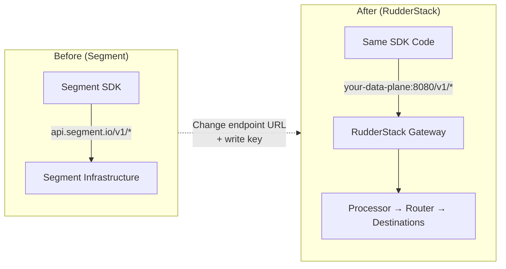
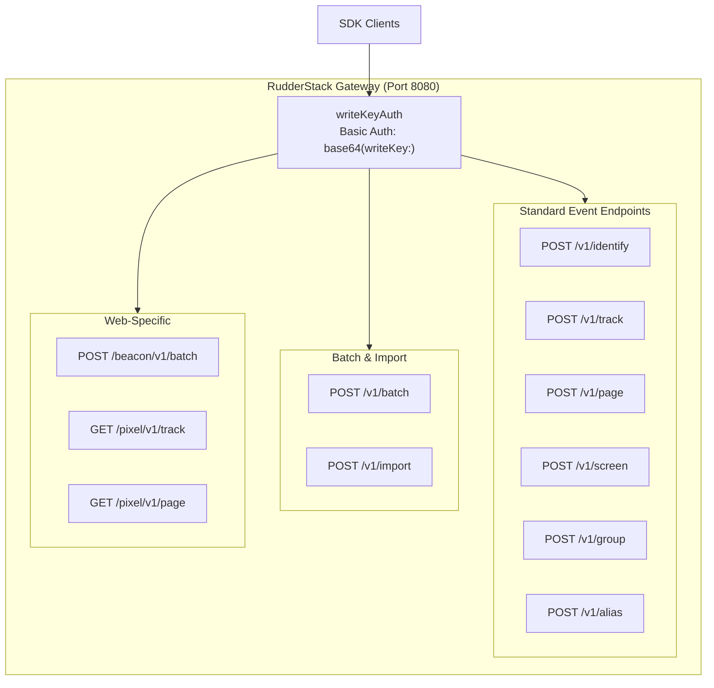

# Segment SDK Migration Guide

Master reference for migrating from Segment SDKs to RudderStack's Segment-compatible Gateway. RudderStack exposes a fully compatible HTTP API on port 8080, enabling standard Segment SDKs — JavaScript, iOS, Android, Node.js, Python, Go, Java, and Ruby — to connect with **endpoint URL substitution and Write Key replacement only**. No payload modifications, field name changes, or SDK API method call adjustments are required.

> **Key Insight**
>
> The only changes required are the **endpoint URL** and **write key**. All event payload schemas, field names, and downstream routing remain identical.

This guide covers all **8 primary SDK platforms** and serves as the single authoritative migration reference spanning Epics E-005 (Gateway API Surface Validation), E-006 (JavaScript Web SDK), E-007 (iOS and Android Mobile SDKs), and E-008 (Server-Side SDKs) from the Sprint 2–3 Source SDK Compatibility milestone.

> Source: `gateway/openapi.yaml` — OpenAPI 3.0.3 specification titled "RudderStack HTTP API" with Segment-compatible endpoint paths
>
> Source: `gateway/handle_http.go` — Handler chain wiring (`callType` → `writeKeyAuth` → `webHandler` → `webRequestHandler`)
>
> Source: `gateway/handle_http_auth.go:24-58` — `writeKeyAuth` middleware implementing HTTP Basic Auth with write key
>
> Source: `gateway/handle_lifecycle.go:603-643` — Chi router registration for all `/v1/*`, `/beacon/v1/*`, `/pixel/v1/*` routes

---

## Table of Contents

- [Prerequisites](#prerequisites)
- [Core Migration Pattern](#core-migration-pattern)
- [Per-SDK Migration Instructions](#per-sdk-migration-instructions)
  - [JavaScript (Web) — analytics.js / Analytics 2.0](#javascript-web--analyticsjs--analytics-20)
  - [iOS — analytics-ios / Analytics-Swift](#ios--analytics-ios--analytics-swift)
  - [Android — analytics-android / Analytics-Kotlin](#android--analytics-android--analytics-kotlin)
  - [Node.js — analytics-node](#nodejs--analytics-node)
  - [Python — analytics-python](#python--analytics-python)
  - [Go — analytics-go](#go--analytics-go)
  - [Java — analytics-java](#java--analytics-java)
  - [Ruby — analytics-ruby](#ruby--analytics-ruby)
- [Verified Compatibility Matrix](#verified-compatibility-matrix)
- [Endpoint Reference](#endpoint-reference)
- [Authentication — Write Key Basic Auth](#authentication--write-key-basic-auth)
- [Known Limitations](#known-limitations)
- [Rollback Strategy](#rollback-strategy)
- [Verification Steps](#verification-steps)
- [Cross-References](#cross-references)

---

## Prerequisites

Before starting the migration, ensure all of the following are in place:

| Prerequisite | Description |
|---|---|
| **RudderStack data plane** | A running RudderStack instance with the Gateway accessible on port `8080` |
| **Source write key** | A write key provisioned for your source in the RudderStack workspace configuration |
| **Segment SDK integration** | An existing Segment SDK deployment to migrate from |
| **Test/staging environment** | A non-production environment for validation before production cutover |
| **Transformer service** | The RudderStack Transformer running on port `9090` (required for destination delivery) |

> The Transformer service is required only for destination delivery. The Gateway will accept and persist events regardless of Transformer availability.

---

## Core Migration Pattern

The migration follows a simple three-step pattern that applies identically to all 8 SDK platforms:



### Three-Step Migration Process

| Step | Action | Details |
|------|--------|---------|
| **1. Replace endpoint URL** | Change `api.segment.io` → `YOUR_DATA_PLANE_URL:8080` | Each SDK exposes a configuration property for the API host |
| **2. Replace write key** | Change Segment write key → RudderStack write key | Obtain from your RudderStack workspace configuration |
| **3. Verify event delivery** | Confirm events arrive at destinations | Use the [verification steps](#verification-steps) below |

**No other changes are required.** Event payloads, field names, SDK API method calls (`identify`, `track`, `page`, `screen`, `group`, `alias`), and downstream routing all remain identical.

> Source: `gateway/openapi.yaml` — Identical endpoint paths (`/v1/identify`, `/v1/track`, `/v1/page`, `/v1/screen`, `/v1/group`, `/v1/alias`, `/v1/batch`)

---

## Per-SDK Migration Instructions

Each subsection below shows the **before** (Segment) and **after** (RudderStack) configuration for a specific SDK platform. In every case, the change is limited to the endpoint URL and write key.

---

### JavaScript (Web) — analytics.js / Analytics 2.0

**Method 1: CDN Snippet — `apiHost` Configuration**

```html
<!-- ============================================ -->
<!-- BEFORE (Segment analytics.js CDN snippet)    -->
<!-- ============================================ -->
<script>
  // ... standard Segment analytics.js snippet ...
  analytics.load("SEGMENT_WRITE_KEY");
  analytics.page();
</script>

<!-- ============================================ -->
<!-- AFTER (Pointing to RudderStack data plane)   -->
<!-- ============================================ -->
<script>
  // ... same analytics.js snippet, but with apiHost override ...
  analytics.load("YOUR_RUDDERSTACK_WRITE_KEY", {
    integrations: {
      "Segment.io": {
        apiHost: "YOUR_DATA_PLANE_URL:8080/v1"
      }
    }
  });
  analytics.page();
</script>
```

**Method 2: NPM — `@segment/analytics-next`**

```javascript
// ============================================
// BEFORE (Segment default endpoint)
// ============================================
import { AnalyticsBrowser } from '@segment/analytics-next'

const analytics = AnalyticsBrowser.load({
  writeKey: 'SEGMENT_WRITE_KEY'
})

// ============================================
// AFTER (RudderStack data plane)
// ============================================
import { AnalyticsBrowser } from '@segment/analytics-next'

const analytics = AnalyticsBrowser.load({
  writeKey: 'YOUR_RUDDERSTACK_WRITE_KEY',
  cdnURL: 'https://YOUR_DATA_PLANE_URL:8080'
})
```

**Verified features:**

- All 6 event calls: `identify`, `track`, `page`, `screen`, `group`, `alias`
- Batch endpoint: `/v1/batch`
- Beacon endpoint: `/beacon/v1/batch` (via `navigator.sendBeacon()`)
- Pixel endpoints: `/pixel/v1/track`, `/pixel/v1/page`

> **Note:** Device-mode destinations are not supported via the Gateway — all destinations are cloud-mode. The SDK itself and any client-side plugins continue to function normally on the client.

For detailed web SDK documentation, see the [Web SDK Compatibility Guide](./web-sdk-guide.md).

> Source: `gateway/handle_http_beacon.go:14-47` — `beaconInterceptor` reads writeKey from query params for `sendBeacon()` requests
>
> Source: `gateway/handle_http_pixel.go:24-80` — `pixelInterceptor` converts GET query params to POST body, returns 1×1 GIF

---

### iOS — analytics-ios / Analytics-Swift

```swift
// ============================================
// BEFORE (Segment default endpoint)
// ============================================
import Segment

let analytics = Analytics(configuration: Configuration(writeKey: "SEGMENT_WRITE_KEY"))

// ============================================
// AFTER (RudderStack data plane)
// ============================================
import Segment

let config = Configuration(writeKey: "YOUR_RUDDERSTACK_WRITE_KEY")
    .apiHost("YOUR_DATA_PLANE_URL:8080/v1")
let analytics = Analytics(configuration: config)
```

**Verified features:**

- All 5 mobile event calls: `identify`, `track`, `screen`, `group`, `alias`
- Automatic context collection: `context.device`, `context.os`, `context.app`, `context.network`, `context.screen`
- Application lifecycle events: `Application Opened`, `Application Backgrounded`, `Application Updated`, `Application Installed`
- Batch delivery via `/v1/batch`

For detailed iOS SDK documentation, see the [Mobile SDK Compatibility Guide](./mobile-sdk-guide.md).

---

### Android — analytics-android / Analytics-Kotlin

**Analytics-Kotlin (Recommended):**

```kotlin
// ============================================
// BEFORE (Segment default endpoint)
// ============================================
import com.segment.analytics.kotlin.android.Analytics

val analytics = Analytics("SEGMENT_WRITE_KEY", applicationContext)

// ============================================
// AFTER (RudderStack data plane)
// ============================================
import com.segment.analytics.kotlin.android.Analytics

val analytics = Analytics("YOUR_RUDDERSTACK_WRITE_KEY", applicationContext) {
    apiHost = "YOUR_DATA_PLANE_URL:8080/v1"
}
```

**Legacy Analytics-Android (Java):**

```java
// ============================================
// BEFORE (Segment default endpoint)
// ============================================
Analytics analytics = new Analytics.Builder(context, "SEGMENT_WRITE_KEY")
    .build();

// ============================================
// AFTER (RudderStack data plane)
// ============================================
Analytics analytics = new Analytics.Builder(context, "YOUR_RUDDERSTACK_WRITE_KEY")
    .defaultApiHost("YOUR_DATA_PLANE_URL:8080/v1")
    .build();
```

**Verified features:**

- All 5 mobile event calls: `identify`, `track`, `screen`, `group`, `alias`
- Automatic context collection: `context.device`, `context.os`, `context.app`, `context.network`, `context.screen`
- Application lifecycle events: `Application Opened`, `Application Backgrounded`, `Application Updated`, `Application Installed`
- Persistent disk queue with batch delivery via `/v1/batch`

For detailed Android SDK documentation, see the [Mobile SDK Compatibility Guide](./mobile-sdk-guide.md).

---

### Node.js — analytics-node

```javascript
// ============================================
// BEFORE (Segment default endpoint)
// ============================================
const { Analytics } = require('@segment/analytics-node')

const analytics = new Analytics({
  writeKey: 'SEGMENT_WRITE_KEY'
})

// ============================================
// AFTER (RudderStack data plane)
// ============================================
const { Analytics } = require('@segment/analytics-node')

const analytics = new Analytics({
  writeKey: 'YOUR_RUDDERSTACK_WRITE_KEY',
  host: 'https://YOUR_DATA_PLANE_URL:8080'
})
```

**Verified features:**

- All 6 event calls: `identify`, `track`, `page`, `screen`, `group`, `alias`
- Automatic batching (default: 20 events per batch, 10-second flush interval)
- Retry with exponential backoff
- Graceful shutdown via `analytics.closeAndFlush()`

For detailed Node.js documentation, see the [Server-Side SDK Compatibility Guide](./server-sdk-guide.md).

---

### Python — analytics-python

```python
# ============================================
# BEFORE (Segment default endpoint)
# ============================================
import segment.analytics as analytics

analytics.write_key = 'SEGMENT_WRITE_KEY'

# ============================================
# AFTER (RudderStack data plane)
# ============================================
import segment.analytics as analytics

analytics.write_key = 'YOUR_RUDDERSTACK_WRITE_KEY'
analytics.host = 'https://YOUR_DATA_PLANE_URL:8080'
```

**Verified features:**

- All 6 event calls: `identify`, `track`, `page`, `screen`, `group`, `alias`
- Background thread for non-blocking event dispatch
- Automatic batching (default: 100 events per batch, 0.5-second flush interval)
- Retry with backoff on transient failures

For detailed Python documentation, see the [Server-Side SDK Compatibility Guide](./server-sdk-guide.md).

---

### Go — analytics-go

```go
// ============================================
// BEFORE (Segment default endpoint)
// ============================================
import "github.com/segmentio/analytics-go/v3"

client := analytics.New("SEGMENT_WRITE_KEY")

// ============================================
// AFTER (RudderStack data plane)
// ============================================
import "github.com/segmentio/analytics-go/v3"

client, _ := analytics.NewWithConfig("YOUR_RUDDERSTACK_WRITE_KEY", analytics.Config{
    Endpoint: "https://YOUR_DATA_PLANE_URL:8080",
})
```

**Verified features:**

- All 6 event calls: `Identify`, `Track`, `Page`, `Screen`, `Group`, `Alias`
- Goroutine-safe enqueue via `Enqueue()` method
- Automatic batching (default: 20 events per batch, 5-second flush interval)
- Retry on transient HTTP failures

For detailed Go documentation, see the [Server-Side SDK Compatibility Guide](./server-sdk-guide.md).

---

### Java — analytics-java

```java
// ============================================
// BEFORE (Segment default endpoint)
// ============================================
import com.segment.analytics.Analytics;

Analytics analytics = Analytics.builder("SEGMENT_WRITE_KEY")
    .build();

// ============================================
// AFTER (RudderStack data plane)
// ============================================
import com.segment.analytics.Analytics;

Analytics analytics = Analytics.builder("YOUR_RUDDERSTACK_WRITE_KEY")
    .endpoint("https://YOUR_DATA_PLANE_URL:8080")
    .build();
```

**Verified features:**

- All 6 event calls: `identify`, `track`, `page`, `screen`, `group`, `alias`
- Builder pattern configuration
- Internal thread pool for non-blocking batch dispatch
- Automatic batching (default: 250 events per batch, 10-second flush interval)

For detailed Java documentation, see the [Server-Side SDK Compatibility Guide](./server-sdk-guide.md).

---

### Ruby — analytics-ruby

```ruby
# ============================================
# BEFORE (Segment default endpoint)
# ============================================
require 'segment/analytics'

analytics = Segment::Analytics.new({
  write_key: 'SEGMENT_WRITE_KEY'
})

# ============================================
# AFTER (RudderStack data plane)
# ============================================
require 'segment/analytics'

analytics = Segment::Analytics.new({
  write_key: 'YOUR_RUDDERSTACK_WRITE_KEY',
  host: 'https://YOUR_DATA_PLANE_URL:8080'
})
```

**Verified features:**

- All 6 event calls: `identify`, `track`, `page`, `screen`, `group`, `alias`
- Background thread for non-blocking event dispatch
- Automatic batching (default: 100 events per batch)
- Retry on transient failures

For detailed Ruby documentation, see the [Server-Side SDK Compatibility Guide](./server-sdk-guide.md).

---

## Verified Compatibility Matrix

The following matrix summarizes verified compatibility for all 8 primary SDK platforms:

| SDK Platform | Package | Supported Calls | Batch | Auth | Status |
|---|---|---|---|---|---|
| JavaScript | `@segment/analytics-next` | identify, track, page, screen, group, alias | ✅ `/v1/batch` | ✅ Basic Auth | ✅ Verified |
| iOS | `analytics-swift` | identify, track, screen, group, alias | ✅ `/v1/batch` | ✅ Basic Auth | ✅ Verified |
| Android | `analytics-kotlin` | identify, track, screen, group, alias | ✅ `/v1/batch` | ✅ Basic Auth | ✅ Verified |
| Node.js | `@segment/analytics-node` | identify, track, page, screen, group, alias | ✅ `/v1/batch` | ✅ Basic Auth | ✅ Verified |
| Python | `segment-analytics-python` | identify, track, page, screen, group, alias | ✅ `/v1/batch` | ✅ Basic Auth | ✅ Verified |
| Go | `analytics-go/v3` | identify, track, page, screen, group, alias | ✅ `/v1/batch` | ✅ Basic Auth | ✅ Verified |
| Java | `analytics-java` | identify, track, page, screen, group, alias | ✅ `/v1/batch` | ✅ Basic Auth | ✅ Verified |
| Ruby | `analytics-ruby` | identify, track, page, screen, group, alias | ✅ `/v1/batch` | ✅ Basic Auth | ✅ Verified |

**Additional web-only endpoints:**

| Feature | Endpoint | SDK Support | Status |
|---|---|---|---|
| Beacon tracking | `/beacon/v1/batch` | JavaScript (`navigator.sendBeacon()`) | ✅ Verified |
| Pixel tracking (track) | `/pixel/v1/track` | JavaScript (image tag) | ✅ Verified |
| Pixel tracking (page) | `/pixel/v1/page` | JavaScript (image tag) | ✅ Verified |

---

## Endpoint Reference

The RudderStack Gateway exposes the following Segment-compatible endpoints:



### Complete Endpoint Table

| Endpoint | Method | Auth | SDKs | Description |
|---|---|---|---|---|
| `/v1/identify` | POST | Basic Auth | All | Identify a user and record traits |
| `/v1/track` | POST | Basic Auth | All | Track a user action or event |
| `/v1/page` | POST | Basic Auth | Web, Server | Record a page view |
| `/v1/screen` | POST | Basic Auth | Mobile, Server | Record a screen view |
| `/v1/group` | POST | Basic Auth | All | Associate a user with a group |
| `/v1/alias` | POST | Basic Auth | All | Merge two user identities |
| `/v1/batch` | POST | Basic Auth | All | Send a batch of mixed event types |
| `/v1/import` | POST | Basic Auth | API | Import historical events |
| `/beacon/v1/batch` | POST | Query Param | Web (beacon) | Accept `navigator.sendBeacon()` payloads |
| `/pixel/v1/track` | GET | Query Param | Web (pixel) | Pixel-based event tracking (returns 1×1 GIF) |
| `/pixel/v1/page` | GET | Query Param | Web (pixel) | Pixel-based page view tracking (returns 1×1 GIF) |

> Source: `gateway/handle_lifecycle.go:603-643` — Chi router registration for all public endpoints
>
> Source: `gateway/handle_http.go:28-69` — Handler function definitions with writeKeyAuth middleware

**Segment → RudderStack endpoint mapping:**

| Segment Endpoint | RudderStack Equivalent |
|---|---|
| `POST api.segment.io/v1/identify` | `POST YOUR_DATA_PLANE_URL:8080/v1/identify` |
| `POST api.segment.io/v1/track` | `POST YOUR_DATA_PLANE_URL:8080/v1/track` |
| `POST api.segment.io/v1/page` | `POST YOUR_DATA_PLANE_URL:8080/v1/page` |
| `POST api.segment.io/v1/screen` | `POST YOUR_DATA_PLANE_URL:8080/v1/screen` |
| `POST api.segment.io/v1/group` | `POST YOUR_DATA_PLANE_URL:8080/v1/group` |
| `POST api.segment.io/v1/alias` | `POST YOUR_DATA_PLANE_URL:8080/v1/alias` |
| `POST api.segment.io/v1/batch` | `POST YOUR_DATA_PLANE_URL:8080/v1/batch` |
| `POST api.segment.io/v1/import` | `POST YOUR_DATA_PLANE_URL:8080/v1/import` |

---

## Authentication — Write Key Basic Auth

All Segment SDKs authenticate using **HTTP Basic Auth** with the **write key as the username** and an **empty password**. RudderStack uses the identical authentication scheme — no changes to SDK authentication logic are needed.

### How It Works

The authentication header follows this exact format:

```
Authorization: Basic base64("<WRITE_KEY>:")
```

Where `<WRITE_KEY>` is the source write key and the colon (`:`) separates the username from the empty password field.

**Internal processing flow:**

1. The Gateway extracts the write key from the `Authorization` header using Go's `r.BasicAuth()` method
2. The write key is validated against the source configuration map (`enabledWriteKeySourceMap`)
3. If valid and the source is enabled, the request is enriched with source metadata (`sourceID`, `workspaceID`, `sourceName`, `sourceCategory`) and passed to the handler
4. If invalid: `401 Unauthorized` with `"Invalid Write Key"` message
5. If source disabled: `404 Not Found` with `"Source is disabled"` message

> Source: `gateway/handle_http_auth.go:24-58` — `writeKeyAuth` middleware implementation

### Authentication Comparison

| Feature | Segment | RudderStack | Change Required |
|---|---|---|---|
| Auth method | HTTP Basic Auth | HTTP Basic Auth | **None** |
| Credential format | `writeKey:` (empty password) | `writeKey:` (empty password) | **None** |
| Header format | `Authorization: Basic base64(writeKey:)` | `Authorization: Basic base64(writeKey:)` | **None** |
| Write key source | Segment workspace dashboard | RudderStack workspace / control plane | **Replace write key value** |

> The authentication protocol is byte-for-byte identical. The only change is the write key value itself.

### Manual Testing with curl

```bash
# Send a test track event using Basic Auth
# The -u flag sets the Authorization header: -u writeKey: (note the trailing colon)
curl -X POST https://YOUR_DATA_PLANE_URL:8080/v1/track \
  -u YOUR_WRITE_KEY: \
  -H 'Content-Type: application/json' \
  -d '{
    "type": "track",
    "event": "Migration Test",
    "userId": "user-123",
    "properties": {
      "source": "migration-validation",
      "timestamp_test": true
    }
  }'

# Expected response: "OK" with HTTP 200
```

### Beacon and Pixel Authentication

For beacon (`/beacon/v1/batch`) and pixel (`/pixel/v1/track`, `/pixel/v1/page`) endpoints, the write key is passed as a **query parameter** instead of a Basic Auth header. The Gateway's interceptor middleware automatically converts this to a Basic Auth header before processing.

```
# Beacon endpoint — writeKey in query param
POST /beacon/v1/batch?writeKey=YOUR_WRITE_KEY

# Pixel endpoint — writeKey in query param
GET /pixel/v1/track?writeKey=YOUR_WRITE_KEY&event=Page+Loaded
```

> Source: `gateway/handle_http_beacon.go:19-47` — `beaconInterceptor` reads writeKey from query params and sets Basic Auth header
>
> Source: `gateway/handle_http_pixel.go:36-80` — `pixelInterceptor` reads writeKey from query params for pixel tracking

---

## Known Limitations

The following limitations should be considered when migrating from Segment to RudderStack:

| Limitation | Description | Impact |
|---|---|---|
| **Device-mode destinations** | Not supported via the Gateway. All destination delivery is cloud-mode (server-side). | Client-side destination SDKs (e.g., Google Analytics client-side, Facebook Pixel client-side) cannot be loaded via the Gateway. Use cloud-mode equivalents or load device-mode SDKs independently. |
| **Client-side plugins/middleware** | SDK-local plugins and middleware execute on the client device, not on the Gateway. | Any client-side plugins you have configured in your Segment SDK will continue to work, but they are not a Gateway concern. |
| **CDN proxy** | Segment's CDN for loading `analytics.js` is not proxied by RudderStack. | You must either point the SDK to your data plane directly, self-host the SDK bundle, or continue loading from Segment's CDN while routing data to RudderStack. |
| **Rate limits** | The Gateway uses source-level rate limiting, not per-endpoint rate limiting. | Rate limits are configured server-side in `config.yaml` rather than enforced per-SDK or per-endpoint. |
| **Cloud sources** | Cloud app sources (Salesforce, Stripe, HubSpot, Zendesk, etc.) are not covered by this SDK migration guide. | Cloud source ingestion is addressed by a separate framework. See the [Cloud Source Framework Design](../../architecture/cloud-source-framework.md). |
| **Replay endpoint** | The `/v1/replay` endpoint is RudderStack-specific and not part of the Segment API surface. | This endpoint is used for internal event replay and is not relevant to SDK migration. |

---

## Rollback Strategy

If issues arise during or after migration, reverting to Segment is straightforward because the migration involves only configuration changes — no code logic modifications.

### Immediate Rollback

1. **Revert endpoint URL** — Change the API host configuration back to `api.segment.io` (or remove the custom host override)
2. **Revert write key** — Replace the RudderStack write key with your original Segment write key
3. **Verify event flow** — Confirm events are flowing to Segment by checking the Segment Debugger

### Dual-Send Strategy (Recommended for Production)

For production migrations, run both Segment and RudderStack in parallel during the transition period:

1. **Configure two SDK instances** — Initialize both the Segment SDK (pointing to `api.segment.io`) and a second instance pointing to your RudderStack data plane
2. **Send events to both** — Duplicate event calls to both instances during the validation period
3. **Compare event volumes** — Verify that event counts match between Segment and RudderStack dashboards
4. **Cut over gradually** — Once parity is confirmed, remove the Segment instance and keep only RudderStack

### Monitoring During Migration

| Check | Method | Expected Result |
|---|---|---|
| Event ingestion | `GET /health` on Gateway | `200 OK` |
| Event counts | Compare Segment vs RudderStack dashboards | Counts within 1% margin |
| Destination delivery | Verify events in destination dashboards | Events appearing within SLA |
| Error rates | Monitor Gateway logs and metrics | No increase in 4xx/5xx responses |

---

## Verification Steps

After completing the migration, use the following checklist to verify correct operation:

### Post-Migration Verification Checklist

**Step 1: Gateway Health Check**

```bash
curl -s https://YOUR_DATA_PLANE_URL:8080/health
# Expected: HTTP 200 with JSON health response
```

**Step 2: Send Test Identify Event**

```bash
curl -X POST https://YOUR_DATA_PLANE_URL:8080/v1/identify \
  -u YOUR_WRITE_KEY: \
  -H 'Content-Type: application/json' \
  -d '{
    "type": "identify",
    "userId": "test-user-123",
    "traits": {
      "name": "Jane Doe",
      "email": "jane@example.com",
      "plan": "Enterprise"
    }
  }'
# Expected: HTTP 200 "OK"
```

**Step 3: Send Test Track Event**

```bash
curl -X POST https://YOUR_DATA_PLANE_URL:8080/v1/track \
  -u YOUR_WRITE_KEY: \
  -H 'Content-Type: application/json' \
  -d '{
    "type": "track",
    "userId": "test-user-123",
    "event": "Migration Verified",
    "properties": {
      "sdk": "curl",
      "verified": true
    }
  }'
# Expected: HTTP 200 "OK"
```

**Step 4: Verify Batch Endpoint with Mixed Event Types**

```bash
curl -X POST https://YOUR_DATA_PLANE_URL:8080/v1/batch \
  -u YOUR_WRITE_KEY: \
  -H 'Content-Type: application/json' \
  -d '{
    "batch": [
      {
        "type": "identify",
        "userId": "test-user-456",
        "traits": { "name": "John Smith" }
      },
      {
        "type": "track",
        "userId": "test-user-456",
        "event": "Batch Test",
        "properties": { "batch_size": 2 }
      }
    ]
  }'
# Expected: HTTP 200 "OK"
```

**Step 5: Check Destination Delivery**

- Log into your RudderStack dashboard (or destination dashboard)
- Verify the test events appear in your configured destinations
- Confirm field values match what was sent (userId, traits, properties, event name)

**Step 6: Compare Event Volume**

- If running dual-send during migration, compare event counts between Segment and RudderStack
- Event volumes should match within a 1% margin (accounting for timing differences)
- Investigate any significant discrepancies before completing the cutover

---

## Cross-References

### SDK-Specific Guides

| Guide | Path | Coverage |
|---|---|---|
| Web SDK Compatibility Guide | [web-sdk-guide.md](./web-sdk-guide.md) | JavaScript, Analytics 2.0, beacon, pixel, device-mode limitations |
| Mobile SDK Compatibility Guide | [mobile-sdk-guide.md](./mobile-sdk-guide.md) | iOS, Android, lifecycle events, context auto-collection |
| Server-Side SDK Compatibility Guide | [server-sdk-guide.md](./server-sdk-guide.md) | Node.js, Python, Go, Java, Ruby, batch semantics, retry behavior |

### Migration Guides

| Guide | Path | Coverage |
|---|---|---|
| SDK Swap Guide | [../migration/sdk-swap-guide.md](../migration/sdk-swap-guide.md) | Detailed SDK replacement instructions (RudderStack native SDKs) |
| Segment Migration Guide | [../migration/segment-migration.md](../migration/segment-migration.md) | Complete platform migration (sources, destinations, tracking plans, warehouses) |

### Architecture and Analysis

| Document | Path | Coverage |
|---|---|---|
| Source Catalog Parity Analysis | [../../gap-report/source-catalog-parity.md](../../gap-report/source-catalog-parity.md) | SDK compatibility matrix, cloud source gap inventory |
| Cloud Source Framework Design | [../../architecture/cloud-source-framework.md](../../architecture/cloud-source-framework.md) | Polling/webhook architecture for cloud app sources |
| Event Spec — Common Fields | [../../api-reference/event-spec/common-fields.md](../../api-reference/event-spec/common-fields.md) | Shared payload fields across all event types |
| Gateway OpenAPI Specification | [../../../gateway/openapi.yaml](../../../gateway/openapi.yaml) | Full HTTP API specification |

---

*This document is part of the Sprint 2–3 Source SDK Compatibility deliverable. For questions or issues, consult the [Source Catalog Parity Analysis](../../gap-report/source-catalog-parity.md) for the full compatibility assessment.*
