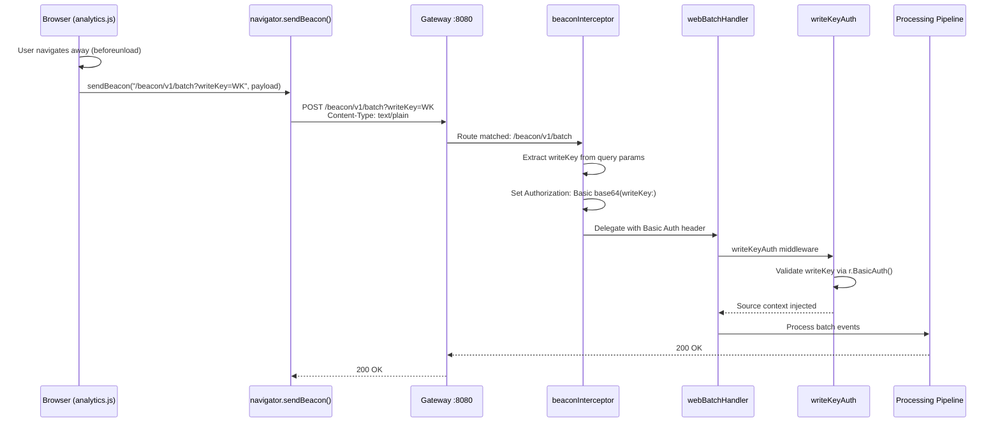
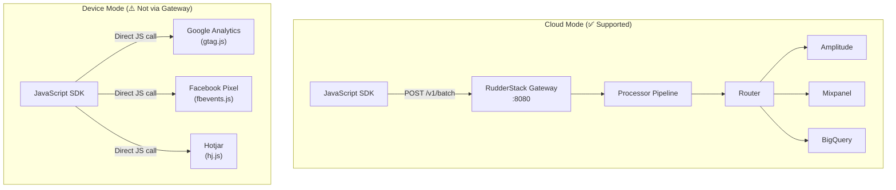

# JavaScript Web SDK Compatibility Guide

> **Status:** ✅ Fully Compatible (Cloud Mode)
> **Last Updated:** 2026-03-16
> **Epic:** E-006 — JavaScript Web SDK Compatibility Testing
> **Sprint:** 2–3 Source SDK Compatibility

RudderStack's Gateway is **fully compatible** with Segment's `analytics.js` and Analytics 2.0 SDKs in cloud mode. Existing Segment JavaScript SDK deployments can send events to a RudderStack data plane by changing **only the endpoint URL and write key** — all payloads, field names, call semantics, and authentication are identical.

This guide documents endpoint coverage, payload formats, migration configuration, beacon and pixel tracking, device-mode limitations, and troubleshooting for the JavaScript web SDK.

> **Source references:**
>
> - `gateway/openapi.yaml` — OpenAPI 3.0.3 specification for all Gateway HTTP endpoints
> - `gateway/handle_http.go` — Handler chain wiring (`callType` → `writeKeyAuth` → `webHandler`)
> - `gateway/handle_http_auth.go` — `writeKeyAuth` middleware (HTTP Basic Auth with write key)
> - `gateway/handle_http_beacon.go` — Beacon batch handler with query-param write key interception
> - `gateway/handle_http_pixel.go` — Pixel tracking handler (query params → JSON, 1×1 GIF response)
>
> **Segment reference:** `refs/segment-docs/src/connections/sources/catalog/libraries/website/javascript/`

---

## Table of Contents

- [Compatibility Status Overview](#compatibility-status-overview)
- [Migration Configuration](#migration-configuration)
- [Supported Calls with Payload Examples](#supported-calls-with-payload-examples)
  - [identify](#identify)
  - [track](#track)
  - [page](#page)
  - [screen](#screen)
  - [group](#group)
  - [alias](#alias)
- [Batch Endpoint](#batch-endpoint)
- [Beacon Endpoint](#beacon-endpoint)
- [Pixel Endpoint](#pixel-endpoint)
- [CORS Configuration](#cors-configuration)
- [Context Auto-Collection](#context-auto-collection)
- [Analytics 2.0 Specifics](#analytics-20-specifics)
- [Device-Mode Limitations](#device-mode-limitations)
- [Troubleshooting](#troubleshooting)
- [Cross-References](#cross-references)

---

## Compatibility Status Overview

The following table summarizes the compatibility status of every feature relevant to Segment's JavaScript web SDK when used against the RudderStack Gateway.

| Feature | Endpoint | Status | Notes |
|---------|----------|--------|-------|
| `identify` call | `POST /v1/identify` | ✅ Verified | Full payload compatibility |
| `track` call | `POST /v1/track` | ✅ Verified | Full payload compatibility |
| `page` call | `POST /v1/page` | ✅ Verified | Auto-collected `context.page` fields preserved |
| `screen` call | `POST /v1/screen` | ✅ Verified | Full payload compatibility |
| `group` call | `POST /v1/group` | ✅ Verified | Full payload compatibility |
| `alias` call | `POST /v1/alias` | ✅ Verified | `previousId` / `userId` mapping preserved |
| Batch endpoint | `POST /v1/batch` | ✅ Verified | Mixed event types in single batch supported |
| Beacon endpoint | `POST /beacon/v1/batch` | ✅ Verified | `navigator.sendBeacon()` with query-param auth |
| Pixel tracking (track) | `GET /pixel/v1/track` | ✅ Verified | Query params → JSON conversion, 1×1 GIF response |
| Pixel tracking (page) | `GET /pixel/v1/page` | ✅ Verified | Query params → JSON conversion, 1×1 GIF response |
| Write Key Basic Auth | `Authorization: Basic base64(writeKey:)` | ✅ Verified | Identical to Segment authentication scheme |
| CORS support | All endpoints | ✅ Verified | `rs/cors` middleware allows browser origins |
| Device-mode destinations | N/A | ⚠️ Not Supported | Cloud-mode only — see [Device-Mode Limitations](#device-mode-limitations) |
| Middleware / Enrichment plugins | N/A | ⚠️ Client-side only | Plugins execute in the browser before events reach the Gateway |

> Source: `gateway/handle_http.go:37-68` — All handler functions use the `callType` → `writeKeyAuth` → `webHandler` middleware chain.
>
> Source: `gateway/handle_http_auth.go:24-57` — `writeKeyAuth` middleware validates `Authorization: Basic base64(writeKey:)`.

---

## Migration Configuration

Migrating a Segment JavaScript SDK deployment to RudderStack requires changing **only two values**: the endpoint URL and the write key. No event-level code changes are needed — all `analytics.identify()`, `analytics.track()`, `analytics.page()`, and other calls remain identical.

### CDN Snippet Configuration

**Before (Segment):**

```html
<script>
  !function(){var analytics=window.analytics=window.analytics||[];
  if(!analytics.initialize)if(analytics.invoked)window.console&&console.error&&
  console.error("Snippet included twice.");else{analytics.invoked=!0;
  analytics.methods=["trackSubmit","trackClick","trackLink","trackForm",
  "pageview","identify","reset","group","track","ready","alias","debug",
  "page","screen","once","off","on","addSourceMiddleware",
  "addIntegrationMiddleware","setAnonymousId","addDestinationMiddleware",
  "register"];analytics.factory=function(e){return function(){
  if(window.analytics.initialized)return window.analytics[e].apply(
  window.analytics,arguments);var i=Array.prototype.slice.call(arguments);
  i.unshift(e);analytics.push(i);return analytics}};for(var i=0;
  i<analytics.methods.length;i++){var key=analytics.methods[i];
  analytics[key]=analytics.factory(key)}analytics.load=function(key,e){
  var t=document.createElement("script");t.type="text/javascript";t.async=!0;
  t.src="https://cdn.segment.com/analytics.js/v1/"+key+"/analytics.min.js";
  var n=document.getElementsByTagName("script")[0];
  n.parentNode.insertBefore(t,n);analytics._loadOptions=e};
  analytics._writeKey="SEGMENT_WRITE_KEY";
  analytics.load("SEGMENT_WRITE_KEY");
  analytics.page();
  }}();
</script>
```

**After (RudderStack — using Segment SDK with `apiHost` override):**

```html
<script>
  // Same Segment snippet as above — only the load() options change:
  analytics.load("RUDDERSTACK_WRITE_KEY", {
    integrations: {
      "Segment.io": {
        apiHost: "YOUR_DATA_PLANE_HOST:8080/v1"
      }
    }
  });
  analytics.page();
</script>
```

> **Key change:** Replace `SEGMENT_WRITE_KEY` with your RudderStack source write key and set `apiHost` to point at your RudderStack data plane (default port `8080`). No other snippet changes are needed.

### NPM Package Configuration (`@segment/analytics-next`)

**Before (Segment):**

```javascript
import { AnalyticsBrowser } from '@segment/analytics-next'

const analytics = AnalyticsBrowser.load({
  writeKey: 'SEGMENT_WRITE_KEY'
})
```

**After (RudderStack):**

```javascript
import { AnalyticsBrowser } from '@segment/analytics-next'

const analytics = AnalyticsBrowser.load({
  writeKey: 'RUDDERSTACK_WRITE_KEY',
  cdnURL: 'https://YOUR_DATA_PLANE_HOST:8080'
})
```

### Write Key Substitution

| Parameter | Segment Value | RudderStack Value |
|-----------|---------------|-------------------|
| Write Key | Segment workspace write key | RudderStack source write key |
| Endpoint URL | `api.segment.io/v1` | `YOUR_DATA_PLANE_HOST:8080/v1` |
| CDN URL | `cdn.segment.com` | Your data plane URL |
| Auth Header | `Authorization: Basic base64(writeKey:)` | `Authorization: Basic base64(writeKey:)` — **identical** |

> **No code changes required** beyond the endpoint URL and write key values. All `analytics.identify()`, `analytics.track()`, `analytics.page()`, `analytics.screen()`, `analytics.group()`, and `analytics.alias()` calls work identically.

---

## Supported Calls with Payload Examples

Each subsection below shows the complete JSON payload as sent by the JavaScript SDK over the wire to the RudderStack Gateway. All payloads include the standard fields: `anonymousId`, `messageId`, `timestamp`, `sentAt`, `context`, `integrations`, and `type`.

### identify

Associates a user with their actions and records traits about them. Call when a user signs up, logs in, or updates their profile.

**JavaScript call:**

```javascript
analytics.identify('user-123', {
  name: 'Jane Doe',
  email: 'jane@example.com',
  plan: 'Enterprise',
  createdAt: '2024-01-15T10:30:00Z'
})
```

**Payload sent to `POST /v1/identify`:**

```json
{
  "type": "identify",
  "userId": "user-123",
  "anonymousId": "507f191e-810c-4d3b-9de8-60ea00000000",
  "traits": {
    "name": "Jane Doe",
    "email": "jane@example.com",
    "plan": "Enterprise",
    "createdAt": "2024-01-15T10:30:00Z"
  },
  "context": {
    "library": {
      "name": "analytics.js",
      "version": "2.10.0"
    },
    "page": {
      "url": "https://example.com/settings",
      "path": "/settings",
      "referrer": "https://example.com/dashboard",
      "title": "Settings — Example App",
      "search": ""
    },
    "userAgent": "Mozilla/5.0 (Macintosh; Intel Mac OS X 10_15_7) AppleWebKit/537.36 (KHTML, like Gecko) Chrome/120.0.0.0 Safari/537.36",
    "locale": "en-US",
    "channel": "client"
  },
  "integrations": {
    "All": true
  },
  "messageId": "ajs-next-1a2b3c4d5e6f",
  "timestamp": "2024-01-15T10:30:00.000Z",
  "sentAt": "2024-01-15T10:30:00.123Z"
}
```

> Source: `gateway/handle_http.go:37-39` — `webIdentifyHandler` wires `callType("identify", writeKeyAuth(webHandler()))`.

### track

Records a user action (event) with associated properties. The primary method for capturing behavioral data.

**JavaScript call:**

```javascript
analytics.track('Order Completed', {
  orderId: 'order-456',
  revenue: 99.99,
  currency: 'USD',
  products: [
    { productId: 'p-001', name: 'Widget', price: 49.99, quantity: 2 }
  ]
})
```

**Payload sent to `POST /v1/track`:**

```json
{
  "type": "track",
  "userId": "user-123",
  "anonymousId": "507f191e-810c-4d3b-9de8-60ea00000000",
  "event": "Order Completed",
  "properties": {
    "orderId": "order-456",
    "revenue": 99.99,
    "currency": "USD",
    "products": [
      {
        "productId": "p-001",
        "name": "Widget",
        "price": 49.99,
        "quantity": 2
      }
    ]
  },
  "context": {
    "library": {
      "name": "analytics.js",
      "version": "2.10.0"
    },
    "page": {
      "url": "https://example.com/checkout/complete",
      "path": "/checkout/complete",
      "referrer": "https://example.com/checkout",
      "title": "Order Confirmation — Example App",
      "search": ""
    },
    "userAgent": "Mozilla/5.0 (Macintosh; Intel Mac OS X 10_15_7) AppleWebKit/537.36 (KHTML, like Gecko) Chrome/120.0.0.0 Safari/537.36",
    "locale": "en-US",
    "channel": "client"
  },
  "integrations": {
    "All": true
  },
  "messageId": "ajs-next-7g8h9i0j1k2l",
  "timestamp": "2024-01-15T10:35:00.000Z",
  "sentAt": "2024-01-15T10:35:00.045Z"
}
```

> Source: `gateway/handle_http.go:42-44` — `webTrackHandler` wires `callType("track", writeKeyAuth(webHandler()))`.

### page

Records a page view with auto-collected page context. Typically the first call on every page load. Analytics.js automatically collects `url`, `path`, `referrer`, `title`, and `search` from the browser.

**JavaScript call:**

```javascript
analytics.page('Docs', 'Web SDK Guide', {
  author: 'Engineering Team'
})
```

**Payload sent to `POST /v1/page`:**

```json
{
  "type": "page",
  "userId": "user-123",
  "anonymousId": "507f191e-810c-4d3b-9de8-60ea00000000",
  "name": "Web SDK Guide",
  "category": "Docs",
  "properties": {
    "url": "https://example.com/docs/web-sdk-guide",
    "path": "/docs/web-sdk-guide",
    "referrer": "https://example.com/docs",
    "title": "Web SDK Guide — Example Docs",
    "search": "",
    "author": "Engineering Team"
  },
  "context": {
    "library": {
      "name": "analytics.js",
      "version": "2.10.0"
    },
    "page": {
      "url": "https://example.com/docs/web-sdk-guide",
      "path": "/docs/web-sdk-guide",
      "referrer": "https://example.com/docs",
      "title": "Web SDK Guide — Example Docs",
      "search": ""
    },
    "userAgent": "Mozilla/5.0 (Macintosh; Intel Mac OS X 10_15_7) AppleWebKit/537.36 (KHTML, like Gecko) Chrome/120.0.0.0 Safari/537.36",
    "locale": "en-US",
    "channel": "client"
  },
  "integrations": {
    "All": true
  },
  "messageId": "ajs-next-3m4n5o6p7q8r",
  "timestamp": "2024-01-15T10:40:00.000Z",
  "sentAt": "2024-01-15T10:40:00.012Z"
}
```

> Source: `gateway/handle_http.go:47-49` — `webPageHandler` wires `callType("page", writeKeyAuth(webHandler()))`.

### screen

Records a screen view. While primarily used by mobile SDKs, the JavaScript SDK also supports `analytics.screen()` for hybrid applications or PWAs.

**JavaScript call:**

```javascript
analytics.screen('Dashboard', {
  section: 'overview'
})
```

**Payload sent to `POST /v1/screen`:**

```json
{
  "type": "screen",
  "userId": "user-123",
  "anonymousId": "507f191e-810c-4d3b-9de8-60ea00000000",
  "name": "Dashboard",
  "properties": {
    "section": "overview"
  },
  "context": {
    "library": {
      "name": "analytics.js",
      "version": "2.10.0"
    },
    "page": {
      "url": "https://example.com/dashboard",
      "path": "/dashboard",
      "referrer": "https://example.com/login",
      "title": "Dashboard — Example App",
      "search": ""
    },
    "userAgent": "Mozilla/5.0 (Macintosh; Intel Mac OS X 10_15_7) AppleWebKit/537.36 (KHTML, like Gecko) Chrome/120.0.0.0 Safari/537.36",
    "locale": "en-US",
    "channel": "client"
  },
  "integrations": {
    "All": true
  },
  "messageId": "ajs-next-9s0t1u2v3w4x",
  "timestamp": "2024-01-15T10:45:00.000Z",
  "sentAt": "2024-01-15T10:45:00.034Z"
}
```

> Source: `gateway/handle_http.go:52-54` — `webScreenHandler` wires `callType("screen", writeKeyAuth(webHandler()))`.

### group

Associates a user with a group (company, team, organization) and records group traits.

**JavaScript call:**

```javascript
analytics.group('group-567', {
  name: 'Acme Corp',
  industry: 'Technology',
  employees: 250,
  plan: 'Enterprise'
})
```

**Payload sent to `POST /v1/group`:**

```json
{
  "type": "group",
  "userId": "user-123",
  "anonymousId": "507f191e-810c-4d3b-9de8-60ea00000000",
  "groupId": "group-567",
  "traits": {
    "name": "Acme Corp",
    "industry": "Technology",
    "employees": 250,
    "plan": "Enterprise"
  },
  "context": {
    "library": {
      "name": "analytics.js",
      "version": "2.10.0"
    },
    "page": {
      "url": "https://example.com/settings/team",
      "path": "/settings/team",
      "referrer": "https://example.com/settings",
      "title": "Team Settings — Example App",
      "search": ""
    },
    "userAgent": "Mozilla/5.0 (Macintosh; Intel Mac OS X 10_15_7) AppleWebKit/537.36 (KHTML, like Gecko) Chrome/120.0.0.0 Safari/537.36",
    "locale": "en-US",
    "channel": "client"
  },
  "integrations": {
    "All": true
  },
  "messageId": "ajs-next-5y6z7a8b9c0d",
  "timestamp": "2024-01-15T10:50:00.000Z",
  "sentAt": "2024-01-15T10:50:00.067Z"
}
```

> Source: `gateway/handle_http.go:67-69` — `webGroupHandler` wires `callType("group", writeKeyAuth(webHandler()))`.

### alias

Links two user identities together, typically an anonymous ID with a known user ID. Used when a previously anonymous visitor signs up or logs in.

**JavaScript call:**

```javascript
analytics.alias('user-123', '507f191e-810c-4d3b-9de8-60ea00000000')
```

**Payload sent to `POST /v1/alias`:**

```json
{
  "type": "alias",
  "userId": "user-123",
  "previousId": "507f191e-810c-4d3b-9de8-60ea00000000",
  "context": {
    "library": {
      "name": "analytics.js",
      "version": "2.10.0"
    },
    "page": {
      "url": "https://example.com/welcome",
      "path": "/welcome",
      "referrer": "https://example.com/signup",
      "title": "Welcome — Example App",
      "search": ""
    },
    "userAgent": "Mozilla/5.0 (Macintosh; Intel Mac OS X 10_15_7) AppleWebKit/537.36 (KHTML, like Gecko) Chrome/120.0.0.0 Safari/537.36",
    "locale": "en-US",
    "channel": "client"
  },
  "integrations": {
    "All": true
  },
  "messageId": "ajs-next-1e2f3g4h5i6j",
  "timestamp": "2024-01-15T10:55:00.000Z",
  "sentAt": "2024-01-15T10:55:00.089Z"
}
```

> Source: `gateway/handle_http.go:57-59` — `webAliasHandler` wires `callType("alias", writeKeyAuth(webHandler()))`.

---

## Batch Endpoint

The `/v1/batch` endpoint accepts multiple events in a single HTTP request. This is the **default transport** for Analytics 2.0 — events are queued in the browser and flushed periodically or when the queue reaches a configurable size.

### Endpoint

```
POST /v1/batch
Authorization: Basic base64(writeKey:)
Content-Type: application/json
```

### Batch Payload Format

The batch payload wraps an array of individual events in a `batch` field, with top-level `sentAt` and `context` fields:

```json
{
  "batch": [
    {
      "type": "identify",
      "userId": "user-123",
      "anonymousId": "507f191e-810c-4d3b-9de8-60ea00000000",
      "traits": {
        "name": "Jane Doe",
        "email": "jane@example.com"
      },
      "context": {
        "library": { "name": "analytics.js", "version": "2.10.0" },
        "page": { "url": "https://example.com/", "path": "/", "title": "Home" }
      },
      "messageId": "ajs-next-batch-001",
      "timestamp": "2024-01-15T11:00:00.000Z"
    },
    {
      "type": "track",
      "userId": "user-123",
      "anonymousId": "507f191e-810c-4d3b-9de8-60ea00000000",
      "event": "Button Clicked",
      "properties": {
        "label": "Get Started",
        "color": "blue"
      },
      "context": {
        "library": { "name": "analytics.js", "version": "2.10.0" },
        "page": { "url": "https://example.com/", "path": "/", "title": "Home" }
      },
      "messageId": "ajs-next-batch-002",
      "timestamp": "2024-01-15T11:00:01.000Z"
    },
    {
      "type": "page",
      "userId": "user-123",
      "anonymousId": "507f191e-810c-4d3b-9de8-60ea00000000",
      "name": "Pricing",
      "properties": {
        "url": "https://example.com/pricing",
        "path": "/pricing",
        "title": "Pricing — Example App",
        "referrer": "https://example.com/"
      },
      "context": {
        "library": { "name": "analytics.js", "version": "2.10.0" },
        "page": { "url": "https://example.com/pricing", "path": "/pricing", "title": "Pricing — Example App" }
      },
      "messageId": "ajs-next-batch-003",
      "timestamp": "2024-01-15T11:00:02.000Z"
    }
  ],
  "sentAt": "2024-01-15T11:00:03.000Z"
}
```

### Timestamp Fields

| Field | Scope | Description |
|-------|-------|-------------|
| `timestamp` | Per event | When the event occurred (set by the SDK at event creation time) |
| `sentAt` | Top-level | When the batch was transmitted to the Gateway (set at flush time) |

The Gateway uses the difference between `sentAt` and `timestamp` to adjust for client clock skew when computing `receivedAt`.

> Source: `gateway/handle_http.go:28-30` — `webBatchHandler` wires `callType("batch", writeKeyAuth(webHandler()))`, delegating to the same `webRequestHandler` pipeline used by individual event endpoints.

---

## Beacon Endpoint

The `/beacon/v1/batch` endpoint is designed for `navigator.sendBeacon()`, which fires reliably during page unload events (`beforeunload`, `visibilitychange`). Analytics 2.0 uses this endpoint to ensure events queued at page exit are delivered without being cancelled by browser navigation.

### Endpoint

```
POST /beacon/v1/batch?writeKey=RUDDERSTACK_WRITE_KEY
Content-Type: text/plain
```

### How It Works

1. The JavaScript SDK calls `navigator.sendBeacon(url, data)` with the batch payload as a `Blob` or string.
2. The browser transmits the payload as a `text/plain` or `application/x-www-form-urlencoded` POST request (not `application/json`).
3. The write key is passed as a **query parameter** (`?writeKey=...`) because `sendBeacon` does not support custom `Authorization` headers.
4. The Gateway's `beaconInterceptor` reads the write key from the query string, sets it as a Basic Auth header internally, and delegates to `webBatchHandler`.

### Content-Type Handling

Unlike standard API calls that use `application/json`, `sendBeacon()` may produce any of the following Content-Types depending on the data format:

| Content-Type | When Used | Gateway Support |
|-------------|-----------|-----------------|
| `text/plain` | `sendBeacon(url, stringPayload)` | ✅ Accepted |
| `application/x-www-form-urlencoded` | `sendBeacon(url, formData)` | ✅ Accepted |
| `application/json` | `sendBeacon(url, jsonBlob)` | ✅ Accepted |

The Gateway reads the raw request body regardless of Content-Type and parses it as JSON.

### Beacon Flow



> Source: `gateway/handle_http_beacon.go:14-16` — `beaconBatchHandler` wires `beaconInterceptor(webBatchHandler())`.
>
> Source: `gateway/handle_http_beacon.go:19-46` — `beaconInterceptor` reads `writeKey` from `r.URL.Query()`, calls `r.SetBasicAuth(writeKey[0], "")`, then delegates to the batch handler.

---

## Pixel Endpoint

The `/pixel/v1/track` and `/pixel/v1/page` endpoints support image-tag-based tracking using `` elements. This mechanism works in environments where JavaScript execution is restricted (email clients, AMP pages, minimal HTML).

### Endpoints

| Endpoint | HTTP Method | Event Type |
|----------|-------------|------------|
| `/pixel/v1/track` | `GET` | Track event |
| `/pixel/v1/page` | `GET` | Page event |

### How It Works

1. An `` tag is embedded in the page with query parameters encoding the event data.
2. The browser issues a `GET` request to load the image.
3. The Gateway's `pixelInterceptor` reads the write key and event data from query parameters.
4. The interceptor converts query parameters into a JSON POST body and sets Basic Auth from the write key.
5. The converted request is passed to the standard `webTrackHandler` or `webPageHandler`.
6. A 1×1 transparent GIF is **always** returned to the browser regardless of processing outcome.

### Image Tag Examples

**Track pixel:**

```html

```

**Page pixel:**

```html

```

### Query Parameter to JSON Conversion

The `pixelInterceptor` converts GET query parameters to a JSON payload. Nested properties use dot notation in query params (e.g., `properties.campaign` becomes `{"properties": {"campaign": "..."}}`).

**Converted JSON body for the track pixel example:**

```json
{
  "type": "track",
  "event": "Email Opened",
  "anonymousId": "user-anon-789",
  "properties": {
    "campaign": "spring-promo",
    "source": "email"
  },
  "channel": "web",
  "integrations": { "All": true },
  "originalTimestamp": "2024-01-15T12:00:00.000Z",
  "sentAt": "2024-01-15T12:00:00.000Z"
}
```

### Response

All pixel requests return a **1×1 transparent GIF** image with `Content-Type: image/gif`, regardless of whether the event was processed successfully. This ensures the browser renders the tracking pixel correctly even if there is an authentication or validation error.

> Source: `gateway/handle_http_pixel.go:24-31` — `pixelPageHandler` and `pixelTrackHandler` wire `pixelInterceptor(type, webHandler())`.
>
> Source: `gateway/handle_http_pixel.go:36-89` — `pixelInterceptor` extracts `writeKey` from query params, calls `r.SetBasicAuth(writeKey[0], "")`, converts params to JSON, and always writes a GIF response.
>
> Source: `gateway/handle_http_pixel.go:92-130` — `preparePixelPayload` maps query parameters to JSON body with `sjson.SetBytes`, adds default `channel: "web"`, `integrations: {"All": true}`, and type-specific fields (`event` for track, `name` for page).

---

## CORS Configuration

The RudderStack Gateway includes CORS (Cross-Origin Resource Sharing) support to allow browser-based SDKs to send events from any origin. The Gateway uses the [`github.com/rs/cors`](https://github.com/rs/cors) middleware.

### Default CORS Behavior

- **Allowed Origins:** All origins (`*`) — configurable via Gateway settings
- **Allowed Methods:** `GET`, `POST`, `OPTIONS`
- **Allowed Headers:** `Content-Type`, `Authorization`, and other standard headers
- **Credentials:** Supported (for write key in `Authorization` header)
- **Preflight Caching:** Enabled for browser performance

### Verifying CORS

Test that your data plane accepts cross-origin requests:

```bash
curl -sI -X OPTIONS \
  -H "Origin: https://example.com" \
  -H "Access-Control-Request-Method: POST" \
  -H "Access-Control-Request-Headers: Content-Type,Authorization" \
  https://YOUR_DATA_PLANE_HOST:8080/v1/track
```

Expected response headers:

```
Access-Control-Allow-Origin: https://example.com
Access-Control-Allow-Methods: POST
Access-Control-Allow-Headers: Content-Type, Authorization
```

> If CORS headers are missing, verify that the Gateway's CORS middleware is enabled and that no reverse proxy is stripping CORS headers.

---

## Context Auto-Collection

The JavaScript SDK (both `analytics.js` and Analytics 2.0) automatically collects the following context fields on every event. These fields are preserved unchanged through the Gateway pipeline.

### Auto-Collected Fields

| Context Path | Value Source | Example |
|-------------|-------------|---------|
| `context.page.url` | `document.location.href` or canonical link | `"https://example.com/dashboard"` |
| `context.page.path` | `location.pathname` or canonical path | `"/dashboard"` |
| `context.page.referrer` | `document.referrer` | `"https://example.com/login"` |
| `context.page.title` | `document.title` | `"Dashboard — Example App"` |
| `context.page.search` | `location.search` | `"?utm_source=google"` |
| `context.userAgent` | `navigator.userAgent` | `"Mozilla/5.0 (Macintosh; ...)"` |
| `context.library.name` | SDK identifier | `"analytics.js"` |
| `context.library.version` | SDK build version | `"2.10.0"` |
| `context.locale` | `navigator.language` | `"en-US"` |
| `context.campaign.source` | UTM `utm_source` param | `"google"` |
| `context.campaign.medium` | UTM `utm_medium` param | `"cpc"` |
| `context.campaign.name` | UTM `utm_campaign` param | `"spring-promo"` |
| `context.campaign.term` | UTM `utm_term` param | `"analytics"` |
| `context.campaign.content` | UTM `utm_content` param | `"header-banner"` |
| `context.channel` | Hardcoded by SDK | `"client"` |

### UTM Campaign Tracking

The JavaScript SDK automatically parses UTM query parameters from the page URL and populates the `context.campaign` object:

| UTM Parameter | Context Field |
|---------------|---------------|
| `utm_source` | `context.campaign.source` |
| `utm_medium` | `context.campaign.medium` |
| `utm_campaign` | `context.campaign.name` |
| `utm_term` | `context.campaign.term` |
| `utm_content` | `context.campaign.content` |

### Verification

To verify that context fields are being preserved through the Gateway, send a test event and inspect the webhook payload at your destination:

```bash
curl -X POST https://YOUR_DATA_PLANE_HOST:8080/v1/track \
  -H "Content-Type: application/json" \
  -u "RUDDERSTACK_WRITE_KEY:" \
  -d '{
    "type": "track",
    "userId": "test-user",
    "event": "Context Test",
    "context": {
      "library": { "name": "analytics.js", "version": "2.10.0" },
      "page": { "url": "https://example.com", "path": "/", "title": "Home" },
      "userAgent": "Mozilla/5.0 Test Agent",
      "locale": "en-US",
      "campaign": { "source": "google", "medium": "cpc" },
      "channel": "client"
    }
  }'
```

All `context.*` fields should appear unchanged in the destination payload.

---

## Analytics 2.0 Specifics

Analytics 2.0 (`@segment/analytics-next`) is the modern iteration of Segment's JavaScript SDK. It introduces architectural improvements while maintaining full API compatibility with `analytics.js` classic.

### `_metadata` Field

Analytics 2.0 payloads may include a `_metadata` field containing internal SDK telemetry. This field is used for:

- **Bundled integrations metadata:** Lists which destination plugins are loaded in the browser.
- **Unbundled integrations:** Lists integrations that are handled server-side (cloud-mode).
- **Plugin versions:** Tracks versions of loaded plugins for debugging.

Example `_metadata` in a track payload:

```json
{
  "type": "track",
  "event": "Page Loaded",
  "_metadata": {
    "bundled": ["Google Analytics 4", "Hotjar"],
    "unbundled": ["Amplitude", "Mixpanel"],
    "bundledIds": ["ga4", "hotjar"]
  }
}
```

The Gateway preserves the `_metadata` field as-is — it passes through the processing pipeline without modification. Destinations that do not require this field simply ignore it.

### Plugin Architecture

Analytics 2.0 uses a plugin-based architecture where integrations are loaded as separate JavaScript modules:

- **Before plugins:** Execute before the event is sent (enrichment, consent).
- **Enrichment plugins:** Add data to events (e.g., auto-collected page context).
- **Destination plugins:** Deliver events to third-party services.
- **After plugins:** Execute after event delivery (logging, debugging).

All plugin processing happens **client-side in the browser** before events reach the Gateway. The Gateway receives the fully processed event payload — no plugin configuration is needed on the server side.

### Performance Improvements

Analytics 2.0 includes several performance improvements over classic `analytics.js`:

| Feature | Classic analytics.js | Analytics 2.0 |
|---------|---------------------|---------------|
| Loading | Single large bundle | Modular, code-split plugins |
| Event queuing | Synchronous | Async with Promise-based API |
| Default transport | XHR | `fetch()` with `sendBeacon` fallback |
| Bundle size | ~70KB gzipped | ~10KB core + per-plugin |

These improvements are SDK-side and do not affect Gateway compatibility. The HTTP payloads sent to the Gateway are identical regardless of which SDK version is used.

---

## Device-Mode Limitations

> **⚠️ Important:** Device-mode destinations are **not supported** via the RudderStack Gateway. The Gateway operates exclusively in **cloud mode**.

### Cloud Mode vs Device Mode

There are two modes for delivering events from a JavaScript SDK to destinations:



| Aspect | Cloud Mode | Device Mode |
|--------|-----------|-------------|
| Data flow | SDK → Gateway → Processor → Router → Destination | SDK → Destination (direct, in-browser) |
| Gateway involvement | ✅ Yes — events routed through the pipeline | ❌ No — events bypass the Gateway entirely |
| Server-side transformation | ✅ Available | ❌ Not available |
| Data residency control | ✅ Events pass through your infrastructure | ❌ Events go directly to third-party services |
| Ad blocker resilience | ✅ First-party domain routing | ❌ Third-party scripts may be blocked |
| Destination JS required | ❌ No client-side scripts needed | ✅ Destination's JavaScript must load in browser |

### Common Device-Mode-Only Destinations

Some destinations require device-mode because they depend on client-side JavaScript for functionality (e.g., session recording, heatmaps, client-side A/B testing):

| Destination | Device-Mode Requirement | Cloud-Mode Workaround |
|-------------|------------------------|----------------------|
| Google Analytics (gtag.js) | Page-level interaction tracking | ✅ Cloud-mode supported via Measurement Protocol |
| Facebook Pixel | Client-side conversion tracking | ✅ Cloud-mode supported via Conversions API |
| Hotjar | Session recording, heatmaps | ❌ No server-side API — device-mode only |
| FullStory | Session replay | ❌ No server-side API — device-mode only |
| Heap | Auto-capture, session replay | ⚠️ Partial — server-side track API available |
| Optimizely | Client-side A/B testing | ❌ No server-side equivalent for client experiments |
| Google Tag Manager | Tag container management | ❌ Client-side tag container only |

### Recommendation

For destinations that require device-mode:

1. **Load the destination's JavaScript SDK directly** alongside the analytics SDK in the browser.
2. **Use cloud-mode through the Gateway** for all destinations that support a server-side API.
3. **Hybrid approach:** Send events via the Gateway (cloud-mode) for server-side destinations, and use device-mode for the few destinations that require client-side JavaScript.

---

## Troubleshooting

| Symptom | Likely Cause | Resolution |
|---------|-------------|------------|
| **CORS errors** in browser console | Gateway CORS middleware not allowing the request origin | Verify the Gateway's CORS configuration allows your domain. Check that no reverse proxy is stripping `Access-Control-Allow-*` headers. Test with `curl -X OPTIONS` as shown in [CORS Configuration](#cors-configuration). |
| **401 Unauthorized** response | Invalid or missing write key in the `Authorization` header | Verify the write key is correct. Ensure it is encoded as `Basic base64(writeKey:)` with an empty password (trailing colon). Check that the source is enabled in the workspace configuration. |
| **Beacon events not arriving** | `/beacon/v1/batch` route not reachable or write key not in query params | Verify the beacon endpoint is accessible. Ensure the SDK passes `?writeKey=...` as a query parameter (not in the `Authorization` header). Check that the data plane URL includes the correct port. |
| **Missing page context** fields | `analytics.page()` not called before other events | Ensure `analytics.page()` is called early in the page lifecycle. The SDK caches page context and includes it in subsequent events. |
| **Events queued but not sent** | SDK flush settings or network issues | Check `flushAt` (default 20) and `flushInterval` (default 10000ms) settings. Verify network connectivity to the data plane. Open browser DevTools Network tab to inspect outgoing requests. |
| **Pixel tracking returns 200 but events missing** | Write key not included in pixel URL query params | Ensure the `` src URL includes `?writeKey=YOUR_KEY`. The pixel endpoint always returns a 1×1 GIF even on auth failure — check Gateway logs for errors. |
| **Duplicate events** | Page re-renders causing `analytics.page()` to fire multiple times | Use a flag or SPA router integration to call `analytics.page()` only on actual navigation changes. Deduplicate by `messageId` at the destination. |
| **Large payload rejected (413)** | Request body exceeds the 4MB Gateway limit | Reduce batch size by lowering `flushAt`. Remove large binary data from event properties. The Gateway enforces a configurable maximum request size (default 4MB via `config.yaml`). |

---

## Cross-References

### Related SDK Guides

- [Segment SDK Migration Guide](./segment-sdk-migration.md) — Master migration walkthrough for all SDK platforms
- [Mobile SDK Compatibility Guide](./mobile-sdk-guide.md) — iOS and Android SDK compatibility documentation
- [Server-Side SDK Compatibility Guide](./server-sdk-guide.md) — Node.js, Python, Go, Java, Ruby SDK documentation

### Related Source Guides

- [JavaScript Web SDK Integration Guide](../sources/javascript-sdk.md) — Detailed integration guide for the RudderStack JavaScript SDK
- [SDK Swap Guide: Segment to RudderStack](../migration/sdk-swap-guide.md) — Step-by-step SDK replacement instructions

### Event Specification

- [Common Fields](../../api-reference/event-spec/common-fields.md) — Fields shared across all event types
- [Identify Spec](../../api-reference/event-spec/identify.md) — Identify call specification
- [Track Spec](../../api-reference/event-spec/track.md) — Track call specification
- [Page Spec](../../api-reference/event-spec/page.md) — Page call specification
- [Screen Spec](../../api-reference/event-spec/screen.md) — Screen call specification
- [Group Spec](../../api-reference/event-spec/group.md) — Group call specification
- [Alias Spec](../../api-reference/event-spec/alias.md) — Alias call specification

### Architecture

- [Cloud Source Framework Design](../../architecture/cloud-source-framework.md) — Cloud source ingestion architecture (E-009)
- [Source Catalog Parity Analysis](../../gap-report/source-catalog-parity.md) — SDK compatibility and cloud source gap analysis
- [Sprint Roadmap](../../gap-report/sprint-roadmap.md) — Sprint 2–3 Source SDK Compatibility epic tracking

### Gateway Source Code References

| File | Description |
|------|-------------|
| `gateway/openapi.yaml` | OpenAPI 3.0.3 specification for all HTTP endpoints |
| `gateway/handle_http.go` | Handler chain wiring — all event type handlers |
| `gateway/handle_http_auth.go` | Write Key Basic Auth middleware (`writeKeyAuth`) |
| `gateway/handle_http_beacon.go` | Beacon batch handler and `beaconInterceptor` |
| `gateway/handle_http_pixel.go` | Pixel tracking handler and `pixelInterceptor` |
| `gateway/handle_lifecycle.go` | Chi router route registration for all endpoints |
| `gateway/handle.go` | Core request handler — payload processing pipeline |
