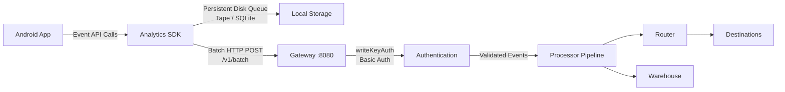

# Android SDK Integration Guide

This guide documents how to send event data from Android applications to the RudderStack Customer Data Platform (CDP). RudderStack's Gateway exposes a Segment-compatible HTTP API on port 8080, enabling existing Segment Analytics-Android or Analytics-Kotlin SDK implementations to point to RudderStack by changing only the API endpoint URL and write key. All event calls — `identify`, `track`, `screen`, `group`, and `alias` — route and transform identically to Segment behavior.

**SDK Variants:**

| SDK | Status | Min API | Language |
|-----|--------|---------|----------|
| Analytics-Kotlin | **Recommended** | API 21 (Android 5.0+) | Kotlin |
| Analytics-Android | Legacy (EOL March 2026) | API 14 (Android 4.0+) | Java |

> **Note:** The legacy Analytics-Android SDK reaches end of support in March 2026. New integrations should use Analytics-Kotlin. Existing Analytics-Android users should plan migration to Analytics-Kotlin.

*Reference: `refs/segment-docs/src/connections/sources/catalog/libraries/mobile/android/index.md`*

## Prerequisites

Before integrating the Android SDK, ensure you have:

- A running RudderStack instance with an accessible data plane URL
- A **Source write key** from your RudderStack workspace configuration
- Android Studio with a Kotlin or Java project
- Minimum Android API 21 (Kotlin SDK) or API 14 (legacy Java SDK)
- Network connectivity from the device to the RudderStack Gateway (port 8080)

---

## Architecture

The following diagram illustrates the data flow from an Android application through the RudderStack pipeline:



**Key architectural behaviors:**

- **Persistent disk queue:** Events are written to a persistent disk-based queue immediately upon invocation. This queue survives app crashes, process kills, and device restarts. The legacy SDK uses the [Tape](http://square.github.io/tape/) library (up to 1000 events); the Kotlin SDK uses SQLite-backed storage.
- **Batching:** The SDK accumulates events in the queue and flushes them in batches (default: 20 events per batch) via HTTP POST to the Gateway's `/v1/batch` endpoint. Flushes also occur on a periodic interval (default: 30 seconds).
- **Automatic context collection:** The SDK automatically collects device information, Android version, app details, network state, screen dimensions, locale, and timezone — attaching this data to every event's `context` object.
- **Authentication:** All requests use HTTP Basic Auth with the source write key as the username and an empty password. The SDK handles this automatically on initialization.

*Source: `gateway/handle_http.go` — handler chain: `callType → writeKeyAuth → webHandler → webRequestHandler`*
*Source: `gateway/openapi.yaml` — endpoint definitions and writeKeyAuth security scheme*

---

## Installation

### Analytics-Kotlin SDK (Recommended)

Add the SDK dependency to your module-level build file.

**Kotlin DSL (`build.gradle.kts`):**

```kotlin
// build.gradle.kts (Module-level)
dependencies {
    implementation("com.segment.analytics.kotlin:android:1.16.+")
}
```

**Groovy DSL (`build.gradle`):**

```groovy
// build.gradle (Module-level)
dependencies {
    implementation 'com.segment.analytics.kotlin:android:1.16.+'
}
```

### Legacy Analytics-Android SDK

> **End-of-Support Notice:** The legacy Analytics-Android SDK reaches end of support in March 2026. Migrate to Analytics-Kotlin for continued support and new features.

```groovy
// build.gradle (Module-level)
dependencies {
    implementation 'com.segment.analytics.android:analytics:4.+'
}
```

*Reference: `refs/segment-docs/src/connections/sources/catalog/libraries/mobile/android/index.md`*

### Required Permissions

Add the following permissions to your `AndroidManifest.xml`:

```xml
<!-- AndroidManifest.xml -->
<uses-permission android:name="android.permission.INTERNET" />
<uses-permission android:name="android.permission.ACCESS_NETWORK_STATE" />
```

- `INTERNET` — Required for sending events to the Gateway.
- `ACCESS_NETWORK_STATE` — Enables the SDK to detect network type (WiFi, cellular) for the `context.network` object.

---

## Initialization

Initialize the SDK in your `Application` subclass to ensure it is available throughout the app lifecycle. The critical change from a default Segment configuration is setting the `apiHost` to your RudderStack data plane URL.

### Analytics-Kotlin SDK

```kotlin
import android.app.Application
import com.segment.analytics.kotlin.android.Analytics
import com.segment.analytics.kotlin.core.Analytics

class MyApplication : Application() {

    companion object {
        lateinit var analytics: Analytics
    }

    override fun onCreate() {
        super.onCreate()
        analytics = Analytics("YOUR_WRITE_KEY", applicationContext) {
            apiHost = "YOUR_DATA_PLANE_URL:8080/v1"
            trackApplicationLifecycleEvents = true
            flushAt = 20
            flushInterval = 30
            collectDeviceId = true
        }
    }
}
```

### Legacy Analytics-Android SDK (Java)

```java
import com.segment.analytics.Analytics;
import java.util.concurrent.TimeUnit;

public class MyApplication extends Application {

    @Override
    public void onCreate() {
        super.onCreate();

        Analytics analytics = new Analytics.Builder(this, "YOUR_WRITE_KEY")
            .defaultApiHost("YOUR_DATA_PLANE_URL:8080/v1")
            .trackApplicationLifecycleEvents()
            .flushQueueSize(20)
            .flushInterval(30, TimeUnit.SECONDS)
            .build();

        // Register as global singleton
        Analytics.setSingletonInstance(analytics);
    }
}
```

> **Important:** Replace `YOUR_WRITE_KEY` with your RudderStack source write key and `YOUR_DATA_PLANE_URL` with your data plane hostname or IP address. Only initialize the Analytics client **once** — instantiation is expensive and should use the singleton pattern.

*Source: `gateway/openapi.yaml` — writeKeyAuth security scheme (HTTP Basic Auth)*

---

## Configuration

The following table documents all available configuration parameters:

| Parameter | Type | Default | Description |
|-----------|------|---------|-------------|
| `writeKey` | String | **Required** | Source write key from your RudderStack workspace configuration. |
| `apiHost` | String | `"api.segment.io/v1"` | RudderStack data plane URL. Set to `"YOUR_DATA_PLANE_URL:8080/v1"` for self-hosted instances. |
| `flushAt` | Int | `20` | Number of events to queue before triggering a batch flush. |
| `flushInterval` | Int | `30` | Seconds between automatic flush cycles. |
| `trackApplicationLifecycleEvents` | Boolean | `false` | Automatically track `Application Installed`, `Application Updated`, `Application Opened`, and `Application Backgrounded` events. |
| `collectDeviceId` | Boolean | `true` | Include a device identifier in the `context.device.id` field. Uses DRM API by default. |
| `useAdvertisingIdForDeviceId` | Boolean | `false` | Use the Google Advertising ID as the device identifier instead of the DRM-based ID. Requires Play Services Ads dependency. |
| `trackDeepLinks` | Boolean | `false` | Automatically track deep link open events. |
| `defaultProjectSettings` | Settings? | `null` | Fallback project settings used if the remote configuration fetch fails. |

*Reference: `refs/segment-docs/src/connections/sources/catalog/libraries/mobile/android/index.md`*

---

## Identify

The `identify` call ties a user to their actions and records traits about them. Call `identify` when a user registers, logs in, or updates their profile information.

> **Cross-reference:** [Identify Event Spec](../../api-reference/event-spec/identify.md) for the full payload schema and Segment behavioral parity details.

### Kotlin (Analytics-Kotlin)

```kotlin
analytics.identify("user-123", buildJsonObject {
    put("name", "Jane Doe")
    put("email", "jane@example.com")
    put("plan", "Enterprise")
    put("createdAt", "2024-01-15T10:30:00Z")
})
```

### Java (Legacy SDK)

```java
Analytics.with(context).identify("user-123",
    new Traits()
        .putName("Jane Doe")
        .putEmail("jane@example.com")
        .putValue("plan", "Enterprise")
        .putValue("createdAt", "2024-01-15T10:30:00Z"),
    null);
```

### Parameters

| Parameter | Type | Required | Description |
|-----------|------|----------|-------------|
| `userId` | String | Yes* | Unique user identifier from your database. *Required if no `anonymousId` is present. |
| `traits` | JsonObject / Traits | No | User traits such as `name`, `email`, `plan`, `company`, `createdAt`, etc. |
| `options` | Options | No | Extra options for destination routing (e.g., enabling/disabling specific destinations). |

The SDK automatically sends the cached `userId` and `anonymousId` with every event. Traits are also sent in the `context.traits` field on subsequent calls.

*Source: `gateway/openapi.yaml` — IdentifyPayload schema (userId, anonymousId, context.traits, timestamp)*

---

## Track

The `track` call records user actions. Each action is an "event" with a required name and optional properties. The `event` field is **required** in the Track payload.

> **Cross-reference:** [Track Event Spec](../../api-reference/event-spec/track.md) for the full payload schema, semantic events, and Segment behavioral parity details.

### Kotlin (Analytics-Kotlin)

```kotlin
analytics.track("Order Completed", buildJsonObject {
    put("orderId", "order-456")
    put("revenue", 99.99)
    put("currency", "USD")
    put("products", buildJsonArray {
        add(buildJsonObject {
            put("productId", "p-001")
            put("name", "Widget")
            put("price", 49.99)
            put("quantity", 2)
        })
    })
})
```

### Java (Legacy SDK)

```java
Analytics.with(context).track("Order Completed",
    new Properties()
        .putValue("orderId", "order-456")
        .putRevenue(99.99)
        .putCurrency("USD"));
```

### Parameters

| Parameter | Type | Required | Description |
|-----------|------|----------|-------------|
| `event` | String | **Yes** | Name of the action (e.g., `"Order Completed"`, `"Product Viewed"`). Use Object + Past Tense Verb naming. |
| `properties` | JsonObject / Properties | No | Arbitrary metadata about the event. Reserved properties: `revenue` (Number), `currency` (String, ISO 4217), `value` (Number). |
| `options` | Options | No | Extra options for destination routing. |

*Source: `gateway/openapi.yaml` — TrackPayload schema (event field is required)*

---

## Screen

The `screen` call records screen views in Android applications. This is the **mobile equivalent of the Page call** used in web tracking. Call `screen` whenever a user navigates to a new screen (Activity, Fragment, or composable).

> **Cross-reference:** [Screen Event Spec](../../api-reference/event-spec/screen.md) for the full payload schema and Segment behavioral parity details.

### Kotlin (Analytics-Kotlin)

```kotlin
analytics.screen("Product Detail", buildJsonObject {
    put("productId", "p-001")
    put("productName", "Widget")
    put("category", "Shopping")
})
```

### Java (Legacy SDK)

```java
// With category and name
Analytics.with(context).screen("Shopping", "Product Detail",
    new Properties()
        .putValue("productId", "p-001")
        .putValue("productName", "Widget"));

// With name only
Analytics.with(context).screen(null, "Product Detail",
    new Properties()
        .putValue("productId", "p-001"));
```

### Parameters

| Parameter | Type | Required | Description |
|-----------|------|----------|-------------|
| `category` | String | No* | Category for the screen. *Optional if `name` is provided. |
| `name` | String | No* | Name of the screen being viewed. *Optional if `category` is provided. |
| `properties` | JsonObject / Properties | No | Arbitrary metadata about the screen view. |
| `options` | Options | No | Extra options for destination routing. |

### Automatic Screen Tracking (Legacy SDK)

The legacy SDK can automatically instrument screen calls using the `label` attribute of Activities declared in `AndroidManifest.xml`:

```java
Analytics analytics = new Analytics.Builder(context, writeKey)
    .recordScreenViews()
    .build();
```

> **Note:** Fragments and Compose destinations do not trigger automatic screen calls. Use manual `screen()` calls for these.

*Source: `gateway/openapi.yaml` — ScreenPayload schema (name, properties, context)*

---

## Group

The `group` call associates a user with a group such as a company, organization, or account. The `groupId` field is **required**.

> **Cross-reference:** [Group Event Spec](../../api-reference/event-spec/group.md) for the full payload schema, reserved traits, and Segment behavioral parity details.

### Kotlin (Analytics-Kotlin)

```kotlin
analytics.group("company-789", buildJsonObject {
    put("name", "Acme Corp")
    put("industry", "Technology")
    put("employees", 500)
    put("plan", "Enterprise")
})
```

### Java (Legacy SDK)

```java
Analytics.with(context).group("user-123", "company-789",
    new Traits()
        .putValue("name", "Acme Corp")
        .putValue("industry", "Technology")
        .putEmployees(500));
```

### Parameters

| Parameter | Type | Required | Description |
|-----------|------|----------|-------------|
| `groupId` | String | **Yes** | Unique identifier for the group in your database. |
| `traits` | JsonObject / Traits | No | Group traits: `name`, `industry`, `employees`, `plan`, `website`, etc. |
| `options` | Options | No | Extra options for destination routing. |

*Source: `gateway/openapi.yaml` — GroupPayload schema (groupId is required)*

---

## Alias

The `alias` call merges two user identities, linking a `previousId` (typically the `anonymousId`) to a new `userId`. This is an advanced method used for identity resolution in specific destinations (e.g., Mixpanel, Kissmetrics).

> **Cross-reference:** [Alias Event Spec](../../api-reference/event-spec/alias.md) for the full payload schema, identity graph implications, and Segment behavioral parity details.

### Kotlin (Analytics-Kotlin)

```kotlin
// Links the current anonymousId to the new userId
analytics.alias("user-123")
```

### Java (Legacy SDK)

```java
// Links the current anonymousId to the new userId
Analytics.with(context).alias("user-123");
// Follow up with an identify to attach traits
Analytics.with(context).identify("user-123");
```

### Parameters

| Parameter | Type | Required | Description |
|-----------|------|----------|-------------|
| `newId` / `userId` | String | **Yes** | The new canonical user identifier to merge into. |

The SDK automatically supplies the current `anonymousId` as the `previousId` in the alias payload. After calling `alias`, follow up with an `identify` call to associate traits with the new identity.

*Source: `gateway/openapi.yaml` — AliasPayload schema (userId, previousId)*

---

## Automatic Context Collection

The SDK automatically populates the `context` object on every event with device, OS, app, network, screen, and locale information. No manual configuration is required — this data is collected transparently.

| Context Field | Description | Example Value |
|--------------|-------------|---------------|
| `context.app.name` | Application name from `PackageManager` | `"MyApp"` |
| `context.app.version` | Application `versionName` | `"1.2.3"` |
| `context.app.build` | Application `versionCode` | `"45"` |
| `context.app.namespace` | Application package name | `"com.example.myapp"` |
| `context.device.id` | Device ID (DRM-based UUID or Advertising ID) | `"a1b2c3d4-..."` |
| `context.device.manufacturer` | Device manufacturer | `"Google"` |
| `context.device.model` | Device model identifier | `"Pixel 7"` |
| `context.device.type` | Device platform type | `"android"` |
| `context.device.advertisingId` | Google Advertising ID (if enabled) | `"7A3CBEA0-..."` |
| `context.os.name` | Operating system name | `"Android"` |
| `context.os.version` | Android version string | `"14"` |
| `context.locale` | Device locale (IETF BCP 47) | `"en-US"` |
| `context.timezone` | Device timezone (tzdata) | `"America/New_York"` |
| `context.screen.width` | Screen width in pixels | `1080` |
| `context.screen.height` | Screen height in pixels | `2400` |
| `context.screen.density` | Screen density (dpi bucket factor) | `2.625` |
| `context.network.wifi` | WiFi connection active | `true` |
| `context.network.cellular` | Cellular connection active | `false` |
| `context.network.carrier` | Cellular carrier name | `"T-Mobile"` |
| `context.network.bluetooth` | Bluetooth enabled | `false` |
| `context.library.name` | SDK library name | `"analytics-kotlin"` |
| `context.library.version` | SDK library version | `"1.16.0"` |

> **Note:** The `context.device.advertisingId` field is only populated if `useAdvertisingIdForDeviceId` is enabled and the Google Play Services Ads library is included. From Analytics-Android v4.10.1+, the Android ID (`Settings.Secure.ANDROID_ID`) is no longer collected to comply with Google's [User Data Policy](https://support.google.com/googleplay/android-developer/answer/10144311?hl=en) (see also: [Google Play Policies](https://developer.android.com/distribute/play-policies)).

*Reference: `refs/segment-docs/src/connections/sources/catalog/libraries/mobile/android/index.md`*
*Cross-reference: [Common Fields](../../api-reference/event-spec/common-fields.md) for the full context specification*

---

## Application Lifecycle Events

When `trackApplicationLifecycleEvents` is enabled during initialization, the SDK automatically tracks the following events:

| Event Name | Trigger | Properties |
|------------|---------|------------|
| `Application Installed` | First launch after install | `version`, `build` |
| `Application Updated` | First launch after a version change | `version`, `build`, `previous_version`, `previous_build` |
| `Application Opened` | Each time the app enters the foreground | `version`, `from_background` |
| `Application Backgrounded` | Each time the app enters the background | *(none)* |

### Persistent Disk Queue

The SDK uses a persistent disk-based queue to ensure event delivery reliability:

- **Crash resilience:** Events survive app crashes, process kills, and device restarts because they are written to disk immediately upon invocation.
- **Queue capacity:** The legacy SDK (Tape-based) stores up to **1000 events** on disk. The Kotlin SDK uses SQLite with configurable capacity.
- **Flush triggers:** The queue is flushed when **either** the event count threshold (`flushAt`, default 20) is reached **or** the flush interval (`flushInterval`, default 30 seconds) elapses — whichever comes first.
- **Offline support:** Events queued while offline are automatically sent when connectivity is restored.

*Reference: `refs/segment-docs/src/connections/sources/catalog/libraries/mobile/android/index.md`*

---

## Authentication

The SDK authenticates with the RudderStack Gateway using the **writeKeyAuth** scheme — HTTP Basic Auth with the source write key as the username and an empty password. The SDK handles this automatically when initialized with a write key.

**Authentication scheme details:**

| Property | Value |
|----------|-------|
| Type | HTTP Basic Auth |
| Username | Source write key |
| Password | Empty string |
| Header format | `Authorization: Basic base64(writeKey:)` |

### Debugging with curl

To verify connectivity or debug payloads outside the SDK, use curl with Basic Auth:

```bash
curl -X POST https://YOUR_DATA_PLANE_URL:8080/v1/track \
  -H 'Content-Type: application/json' \
  -u YOUR_WRITE_KEY: \
  -d '{
    "userId": "user-1",
    "event": "Test Event",
    "properties": {
      "source": "curl_debug"
    },
    "context": {
      "device": {
        "type": "android",
        "model": "Pixel 7"
      },
      "os": {
        "name": "Android",
        "version": "14"
      }
    }
  }'
```

A successful response returns HTTP 200 with body `"OK"`.

*Source: `gateway/openapi.yaml` — writeKeyAuth security scheme definition*
*Source: `gateway/handle_http_auth.go` — `writeKeyAuth` middleware extracts write key via `r.BasicAuth()` and validates against registered sources*

---

## Error Handling

The Gateway returns standard HTTP response codes for all API requests. The SDK handles retries automatically with exponential backoff for transient errors.

| HTTP Code | Status | Description | Recommended Action |
|-----------|--------|-------------|-------------------|
| 200 | OK | Event accepted and queued for processing | Success — no action needed |
| 400 | Bad Request | Invalid payload format or missing required fields | Check payload structure; ensure `event` is set for Track calls, `groupId` for Group calls |
| 401 | Unauthorized | Invalid or missing write key | Verify the write key matches your RudderStack source configuration |
| 404 | Not Found | Endpoint not found or source disabled | Check the endpoint URL path and verify the source is enabled |
| 413 | Request Entity Too Large | Payload exceeds the maximum allowed size | Reduce payload size; split large batches into smaller chunks |
| 429 | Too Many Requests | Rate limit exceeded | SDK retries automatically with backoff; consider increasing flush interval |

> **Note:** The SDK handles transient errors (429, 5xx) with automatic retry and exponential backoff. Events remain in the persistent disk queue until successfully delivered.

*Source: `gateway/openapi.yaml` — response definitions for all `/v1/*` endpoints*

---

## ProGuard / R8 Configuration

If your Android project uses ProGuard or R8 for code shrinking and obfuscation, add the following rules to your `proguard-rules.pro` file:

### Analytics-Kotlin SDK

```proguard
# Segment Analytics-Kotlin SDK
-keep class com.segment.analytics.kotlin.** { *; }
-dontwarn com.segment.analytics.kotlin.**

# Kotlin serialization (if using kotlinx.serialization)
-keepattributes *Annotation*
-keep class kotlinx.serialization.** { *; }
-dontwarn kotlinx.serialization.**
```

### Legacy Analytics-Android SDK

```proguard
# Segment Analytics-Android SDK
-keep class com.segment.analytics.** { *; }
-dontwarn com.segment.analytics.**
```

> **Note:** If you are using device-mode destination SDKs (packaged alongside the Analytics SDK), add keep rules for each destination SDK as well. Check the destination's documentation for specific ProGuard requirements.

---

## Migrating from Segment

Migrating an existing Segment Android integration to RudderStack requires minimal changes. The event API calls (`identify`, `track`, `screen`, `group`, `alias`) remain identical — only the endpoint configuration and write key need to be updated.

### Migration Steps

1. **Update the API host** from the Segment default to your RudderStack data plane URL.
2. **Replace the write key** with your RudderStack source write key.
3. **No changes** to event calls — all `identify`, `track`, `screen`, `group`, and `alias` calls work identically.

### Analytics-Kotlin SDK Migration

```kotlin
// BEFORE (Segment)
analytics = Analytics("SEGMENT_WRITE_KEY", applicationContext) {
    // Uses default api.segment.io/v1
}

// AFTER (RudderStack)
analytics = Analytics("RUDDERSTACK_WRITE_KEY", applicationContext) {
    apiHost = "YOUR_DATA_PLANE_URL:8080/v1"  // Only change needed
}
```

### Legacy Analytics-Android SDK Migration

```java
// BEFORE (Segment)
Analytics analytics = new Analytics.Builder(this, "SEGMENT_WRITE_KEY")
    .trackApplicationLifecycleEvents()
    .build();

// AFTER (RudderStack)
Analytics analytics = new Analytics.Builder(this, "RUDDERSTACK_WRITE_KEY")
    .defaultApiHost("YOUR_DATA_PLANE_URL:8080/v1")  // Only change needed
    .trackApplicationLifecycleEvents()
    .build();
```

All event payloads, context collection, batching behavior, and retry logic remain unchanged.

> **See also:** [SDK Swap Migration Guide](../migration/sdk-swap-guide.md) for a comprehensive migration walkthrough covering all SDK platforms.
> **See also:** [Source Catalog Parity Analysis](../../gap-report/source-catalog-parity.md) for a detailed comparison of Segment and RudderStack source SDK capabilities.

---

## Related Documentation

### Event Specification

- [Common Fields](../../api-reference/event-spec/common-fields.md) — Shared fields across all event types (context, timestamps, integrations)
- [Identify](../../api-reference/event-spec/identify.md) — Identify call specification and traits reference
- [Track](../../api-reference/event-spec/track.md) — Track call specification, event naming, and semantic events
- [Screen](../../api-reference/event-spec/screen.md) — Screen call specification (mobile equivalent of Page)
- [Group](../../api-reference/event-spec/group.md) — Group call specification and group traits
- [Alias](../../api-reference/event-spec/alias.md) — Alias call specification and identity graph implications

### API Reference

- [Gateway HTTP API Reference](../../api-reference/gateway-http-api.md) — Full HTTP API reference for all Gateway endpoints

### Migration

- [SDK Swap Migration Guide](../migration/sdk-swap-guide.md) — Step-by-step migration from Segment SDKs
- [Source Catalog Parity Analysis](../../gap-report/source-catalog-parity.md) — Segment vs. RudderStack source SDK comparison

### Other SDK Guides

- [JavaScript Web SDK Guide](./javascript-sdk.md) — Web browser integration
- [iOS SDK Guide](./ios-sdk.md) — iOS and Apple platform integration
- [Server-Side SDKs Guide](./server-side-sdks.md) — Node.js, Python, Go, Java, Ruby server-side integration
