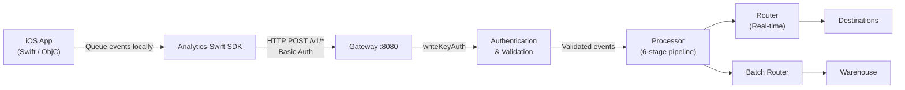

# iOS SDK Integration Guide

This guide documents how to send event data from iOS and Apple platform applications to the RudderStack Customer Data Platform (CDP) using the Segment-compatible HTTP API exposed on port 8080. RudderStack's Gateway implements the full Segment Spec API surface, enabling Segment's Analytics-Swift SDK to work with RudderStack by changing only the endpoint URL and write key.

> **Segment Behavioral Parity:** All event API calls (`identify`, `track`, `screen`, `group`, `alias`) are processed identically to Segment behavior. Payload schemas, field semantics, and context enrichment follow the same specification. Any payload accepted by Segment's API is accepted and processed identically by RudderStack.

**Platform Support:**

| Platform | Minimum Version |
|----------|----------------|
| iOS      | 13.0+          |
| iPadOS   | 13.0+          |
| tvOS     | 11.0+          |
| watchOS  | 7.0+           |
| macOS    | 10.15+         |

Source: `gateway/openapi.yaml` — Segment-compatible HTTP API definition
Reference: `refs/segment-docs/src/connections/sources/catalog/libraries/mobile/apple/index.md` — Analytics-Swift SDK reference

---

## Table of Contents

- [Prerequisites](#prerequisites)
- [Architecture](#architecture)
- [Installation](#installation)
- [Initialization](#initialization)
- [Configuration](#configuration)
- [Identify](#identify)
- [Track](#track)
- [Screen](#screen)
- [Group](#group)
- [Alias](#alias)
- [Batch Events](#batch-events)
- [Automatic Context Collection](#automatic-context-collection)
- [Application Lifecycle Events](#application-lifecycle-events)
- [Authentication](#authentication)
- [Error Handling](#error-handling)
- [Migrating from Segment](#migrating-from-segment)
- [Related Documentation](#related-documentation)

---

## Prerequisites

Before integrating the iOS SDK with RudderStack, ensure you have:

- **A running RudderStack instance** with the Gateway accessible at your data plane URL (default port `8080`)
- **A Source write key** from your RudderStack workspace configuration
- **Xcode 13.0+** with Swift 5.5 or later
- **iOS 13.0+ deployment target** (or the equivalent minimum version for other Apple platforms listed above)

---

## Architecture

The iOS SDK sends events to RudderStack's Gateway over HTTP. Events are queued locally on the device, batched by the SDK, and transmitted via `POST` requests to the Gateway's `/v1/*` endpoints. The Gateway authenticates each request using HTTP Basic Auth with the source write key, then routes validated events through the Processor pipeline to all configured destinations and warehouses.



**Data flow summary:**

1. **Event creation** — Your app calls `identify`, `track`, `screen`, `group`, or `alias` on the Analytics SDK instance.
2. **Local queue** — The SDK queues events on-device in persistent storage, ensuring delivery even if the app is terminated.
3. **Batching** — When the queue reaches the `flushAt` threshold or the `flushInterval` timer fires, the SDK flushes events as a batch `POST` to `/v1/batch`.
4. **Authentication** — The Gateway extracts the write key from the HTTP Basic Auth header and validates it against the workspace configuration.
5. **Processing** — Validated events enter the Processor's six-stage pipeline (preprocess → source hydration → pre-transform → user transform → destination transform → store).
6. **Routing** — The Router delivers events to real-time destinations; the Batch Router handles bulk/warehouse destinations.

Source: `gateway/handle_http.go` — Handler chain wiring (`writeKeyAuth(webHandler())`)
Source: `gateway/openapi.yaml` — Endpoint definitions and security schemes
Source: `gateway/handle_http_auth.go:24-57` — `writeKeyAuth` middleware implementation

---

## Installation

### Swift Package Manager (Recommended)

**Option A — Xcode UI:**

1. In Xcode, navigate to **File → Add Packages** (Xcode 13+) or **File → Swift Packages → Add Package Dependency** (Xcode 12).
2. Enter the repository URL:
   ```
   https://github.com/segmentio/analytics-swift.git
   ```
3. Select a version rule (for example, **Up to Next Major** from `1.0.0`).
4. Add the package to your application target.

**Option B — Package.swift:**

Add the dependency to your `Package.swift` manifest:

```swift
dependencies: [
    .package(url: "https://github.com/segmentio/analytics-swift.git", from: "1.0.0")
],
targets: [
    .target(
        name: "YourApp",
        dependencies: [
            .product(name: "Segment", package: "analytics-swift")
        ]
    )
]
```

After adding the package, import the SDK in your source files:

```swift
import Segment
```

### CocoaPods

Add the Segment pod to your `Podfile`:

```ruby
# Podfile
platform :ios, '13.0'
use_frameworks!

target 'YourApp' do
  pod 'Segment', '~> 1.0'
end
```

Then install:

```bash
pod install
```

Open the generated `.xcworkspace` file and import the SDK:

```swift
import Segment
```

Reference: `refs/segment-docs/src/connections/sources/catalog/libraries/mobile/apple/index.md` — Installation instructions

---

## Initialization

### UIKit (AppDelegate)

Initialize the Analytics client in your `AppDelegate.didFinishLaunchingWithOptions` method. The critical configuration change from Segment is setting `.apiHost()` to point to your RudderStack data plane URL instead of the default Segment endpoint.

```swift
import UIKit
import Segment

@UIApplicationMain
class AppDelegate: UIResponder, UIApplicationDelegate {
    var analytics: Analytics?

    func application(
        _ application: UIApplication,
        didFinishLaunchingWithOptions launchOptions: [UIApplication.LaunchOptionsKey: Any]?
    ) -> Bool {
        let configuration = Configuration(writeKey: "YOUR_WRITE_KEY")
            .apiHost("YOUR_DATA_PLANE_URL:8080/v1")
            .trackApplicationLifecycleEvents(true)
            .flushAt(20)
            .flushInterval(30)

        analytics = Analytics(configuration: configuration)
        return true
    }
}
```

### SwiftUI (@main App)

For SwiftUI-based applications, initialize the Analytics client in your `@main` App struct:

```swift
import SwiftUI
import Segment

@main
struct MyApp: App {
    let analytics: Analytics

    init() {
        let configuration = Configuration(writeKey: "YOUR_WRITE_KEY")
            .apiHost("YOUR_DATA_PLANE_URL:8080/v1")
            .trackApplicationLifecycleEvents(true)
            .flushAt(20)
            .flushInterval(30)

        analytics = Analytics(configuration: configuration)
    }

    var body: some Scene {
        WindowGroup {
            ContentView()
                .environment(\.analytics, analytics)
        }
    }
}
```

### Objective-C

For Objective-C applications:

```objc
@import Segment;

- (BOOL)application:(UIApplication *)application
    didFinishLaunchingWithOptions:(NSDictionary *)launchOptions {

    SEGConfiguration *config = [[SEGConfiguration alloc] initWithWriteKey:@"YOUR_WRITE_KEY"];
    config.apiHost = @"YOUR_DATA_PLANE_URL:8080/v1";
    config.trackApplicationLifecycleEvents = YES;
    config.flushAt = 20;
    config.flushInterval = 30;

    self.analytics = [[SEGAnalytics alloc] initWithConfiguration:config];

    return YES;
}
```

> **Important:** Replace `YOUR_DATA_PLANE_URL` with the hostname (or IP) of your RudderStack instance and `YOUR_WRITE_KEY` with the source write key from your workspace. The default Segment API host `api.segment.io/v1` must be changed to your RudderStack Gateway address.

Reference: `refs/segment-docs/src/connections/sources/catalog/libraries/mobile/apple/index.md` — Initialization patterns

---

## Configuration

The following table documents all configuration options available when initializing the Analytics client. These options control batching behavior, automatic tracking, and network configuration.

| Parameter | Type | Default | Description |
|-----------|------|---------|-------------|
| `writeKey` | `String` | **Required** | Source write key from your RudderStack workspace configuration. Used for HTTP Basic Auth against the Gateway. |
| `apiHost` | `String` | `"api.segment.io/v1"` | RudderStack data plane URL. Set to `"YOUR_DATA_PLANE_URL:8080/v1"` to route events to your RudderStack instance. |
| `cdnHost` | `String` | `"cdn-settings.segment.com/v1"` | CDN host for retrieving remote settings. Set to your RudderStack config endpoint if applicable. |
| `flushAt` | `Int` | `20` | Number of events to queue before the SDK sends a batch. When the queue reaches this count, events are flushed to the Gateway. |
| `flushInterval` | `TimeInterval` | `30` | Interval in seconds between automatic flushes. The SDK sends queued events at this interval regardless of queue size. |
| `trackApplicationLifecycleEvents` | `Bool` | `true` | Automatically track application lifecycle events (`Application Installed`, `Application Updated`, `Application Opened`, `Application Backgrounded`). |
| `autoAddSegmentDestination` | `Bool` | `true` | Automatically add the cloud-mode Segment Destination plugin. Set to `false` if you want manual control over destination plugins. |
| `trackDeepLinks` | `Bool` | `false` | Automatically track deep link opens as events. |
| `defaultSettings` | `Settings` | `{}` | Fallback settings object used when the settings endpoint is unreachable due to network failure. |
| `requestFactory` | `RequestFactory?` | `nil` | Custom `URLRequest` factory for advanced network configuration (proxies, custom headers, certificate pinning). |

Reference: `refs/segment-docs/src/connections/sources/catalog/libraries/mobile/apple/index.md` — Configuration options table

---

## Identify

The `identify` call ties a user to their actions and records any traits you know about them — such as email, name, or subscription plan. After an identify call, the SDK caches the `userId` and includes it in all subsequent event calls.

**When to call identify:**
- After a user registers or creates an account
- After a user logs in (to link anonymous activity to the known user)
- When a user updates their profile traits (email, name, plan change)

For the full Identify specification including all fields, payload schema, and behavioral parity details, see [Identify Event Spec](../../api-reference/event-spec/identify.md).

### Swift Example

```swift
analytics.identify(userId: "user-123", traits: [
    "name": "Jane Doe",
    "email": "jane@example.com",
    "plan": "Enterprise",
    "createdAt": "2024-01-15T10:30:00Z"
])
```

### Objective-C Example

```objc
[self.analytics identify:@"user-123"
                  traits:@{
    @"name": @"Jane Doe",
    @"email": @"jane@example.com",
    @"plan": @"Enterprise",
    @"createdAt": @"2024-01-15T10:30:00Z"
}];
```

### Parameters

| Parameter | Type | Required | Description |
|-----------|------|----------|-------------|
| `userId` | `String` | Yes* | Unique user identifier from your database. *Required if no `anonymousId` is set. |
| `traits` | `[String: Any]` | No | Dictionary of user traits (e.g., `name`, `email`, `plan`, `createdAt`). Traits are persisted and sent with future events via the `context.traits` field. |

The SDK automatically includes the `context` object (device, OS, app, network, locale, timezone), generates an `anonymousId` (UUID) if none exists, and sets the `timestamp` and `messageId` fields.

**Gateway endpoint:** `POST /v1/identify` — Payload conforms to the `IdentifyPayload` schema.

Source: `gateway/openapi.yaml:15-74` — Identify endpoint definition
Source: `gateway/openapi.yaml:688-721` — `IdentifyPayload` schema

---

## Track

The `track` call records user actions along with any properties that describe the action. Each action is known as an **event** and has a name (e.g., `"Order Completed"`) and an optional dictionary of properties.

For the full Track specification including semantic events, reserved properties, and behavioral parity, see [Track Event Spec](../../api-reference/event-spec/track.md).

### Swift Example

```swift
analytics.track(name: "Order Completed", properties: [
    "orderId": "order-456",
    "revenue": 99.99,
    "currency": "USD",
    "products": [
        ["productId": "p-001", "name": "Widget", "price": 49.99, "quantity": 2]
    ]
])
```

### Objective-C Example

```objc
[self.analytics track:@"Order Completed"
           properties:@{
    @"orderId": @"order-456",
    @"revenue": @99.99,
    @"currency": @"USD",
    @"products": @[
        @{@"productId": @"p-001", @"name": @"Widget", @"price": @49.99, @"quantity": @2}
    ]
}];
```

### Parameters

| Parameter | Type | Required | Description |
|-----------|------|----------|-------------|
| `name` | `String` | **Yes** | Name of the event being tracked (e.g., `"Order Completed"`, `"Button Clicked"`). Maps to the `event` field in the `TrackPayload`. |
| `properties` | `[String: Any]` | No | Dictionary of properties associated with the event (e.g., `orderId`, `revenue`, `currency`). |

**Gateway endpoint:** `POST /v1/track` — The `event` field is **required** in the payload.

Source: `gateway/openapi.yaml:75-134` — Track endpoint definition
Source: `gateway/openapi.yaml:722-755` — `TrackPayload` schema (note: `event` field is required)

---

## Screen

The `screen` call records whenever a user views a screen in your mobile app. It is the **mobile equivalent** of the [Page](../../api-reference/event-spec/page.md) call used in web applications. Use Screen calls to track navigation patterns, measure screen-level engagement, and build mobile conversion funnels.

For the full Screen specification, see [Screen Event Spec](../../api-reference/event-spec/screen.md).

### Swift Example

```swift
analytics.screen(title: "Product Detail", category: "Shopping", properties: [
    "productId": "p-001",
    "productName": "Widget"
])
```

### Objective-C Example

```objc
[self.analytics screen:@"Product Detail"
              category:@"Shopping"
            properties:@{
    @"productId": @"p-001",
    @"productName": @"Widget"
}];
```

### Parameters

| Parameter | Type | Required | Description |
|-----------|------|----------|-------------|
| `title` | `String` | No | Name of the screen being viewed (maps to `name` in the `ScreenPayload`). |
| `category` | `String` | No | Category of the screen (e.g., `"Shopping"`, `"Settings"`, `"Onboarding"`). |
| `properties` | `[String: Any]` | No | Dictionary of properties associated with the screen view. |

> **Note:** Screen calls are the mobile-specific equivalent of Page calls. On iOS, use `screen` for tracking screen views; use `page` only in web SDKs. Both calls map to the same pipeline and destination handling.

**Gateway endpoint:** `POST /v1/screen`

Source: `gateway/openapi.yaml:195-255` — Screen endpoint definition
Source: `gateway/openapi.yaml:790-825` — `ScreenPayload` schema

---

## Group

The `group` call associates a user with a group — such as a company, organization, account, or team. It lets you record traits about the group (company name, industry, employee count) that downstream destinations use for account-level analytics.

For the full Group specification, see [Group Event Spec](../../api-reference/event-spec/group.md).

### Swift Example

```swift
analytics.group(groupId: "company-789", traits: [
    "name": "Acme Corp",
    "industry": "Technology",
    "employees": 500,
    "plan": "Enterprise"
])
```

### Objective-C Example

```objc
[self.analytics group:@"company-789"
               traits:@{
    @"name": @"Acme Corp",
    @"industry": @"Technology",
    @"employees": @500,
    @"plan": @"Enterprise"
}];
```

### Parameters

| Parameter | Type | Required | Description |
|-----------|------|----------|-------------|
| `groupId` | `String` | **Yes** | Unique identifier for the group (e.g., company ID, account ID). |
| `traits` | `[String: Any]` | No | Dictionary of traits associated with the group (e.g., `name`, `industry`, `employees`, `plan`). |

**Gateway endpoint:** `POST /v1/group` — The `groupId` field is **required** in the payload.

Source: `gateway/openapi.yaml:256-317` — Group endpoint definition
Source: `gateway/openapi.yaml:826-867` — `GroupPayload` schema

---

## Alias

The `alias` call merges two user identities, linking the current `anonymousId` to a new `userId`. This is an advanced method — use it only when you need to explicitly connect an anonymous visitor profile with a known user identity for downstream destinations that require it.

For the full Alias specification, see [Alias Event Spec](../../api-reference/event-spec/alias.md).

### Swift Example

```swift
analytics.alias(newId: "user-123")
// Links the current anonymousId to "user-123"
```

### Objective-C Example

```objc
[self.analytics alias:@"user-123"];
// Links the current anonymousId to "user-123"
```

### Parameters

| Parameter | Type | Required | Description |
|-----------|------|----------|-------------|
| `newId` | `String` | **Yes** | The new user ID to associate with the current anonymous profile. Maps to `userId` in the `AliasPayload`. The SDK automatically sets `previousId` to the current `anonymousId`. |

> **Tip:** In most implementations, calling `identify` is sufficient. Use `alias` only when downstream destinations (e.g., Mixpanel, Kissmetrics) require explicit identity merging. After an `alias` call, subsequent events are attributed to the merged identity.

**Gateway endpoint:** `POST /v1/alias`

Source: `gateway/openapi.yaml:318-375` — Alias endpoint definition
Source: `gateway/openapi.yaml:868-899` — `AliasPayload` schema

---

## Batch Events

The SDK automatically batches events and sends them via `POST /v1/batch`. You can also manually trigger a flush:

```swift
// Force flush all queued events immediately
analytics.flush()
```

The batch endpoint accepts an array of mixed event types (`identify`, `track`, `screen`, `group`, `alias`) in a single HTTP request, reducing network overhead on mobile connections.

**Batching behavior:**
- Events are flushed when the queue reaches `flushAt` (default: 20 events)
- Events are flushed at each `flushInterval` (default: 30 seconds)
- Events are flushed when the app enters the background (if lifecycle tracking is enabled)
- Calling `analytics.flush()` forces an immediate flush

**Gateway endpoint:** `POST /v1/batch` — Accepts a `BatchPayload` containing an array of events.

Source: `gateway/openapi.yaml:376-435` — Batch endpoint definition
Source: `gateway/openapi.yaml:900-939` — `BatchPayload` schema

---

## Automatic Context Collection

The iOS SDK automatically collects device, application, and environment information and includes it in the `context` object of every event. This data enables downstream destinations to segment users by device type, OS version, app version, and network conditions without any additional instrumentation.

| Context Field | Description | Example Value |
|--------------|-------------|---------------|
| `context.app.name` | Application display name from `Info.plist` | `"MyApp"` |
| `context.app.version` | Application version (`CFBundleShortVersionString`) | `"1.2.3"` |
| `context.app.build` | Application build number (`CFBundleVersion`) | `"45"` |
| `context.app.namespace` | Application bundle identifier | `"com.example.myapp"` |
| `context.device.id` | Vendor device identifier (`identifierForVendor`) | `"B5A7F1C2-..."` |
| `context.device.manufacturer` | Device manufacturer | `"Apple"` |
| `context.device.model` | Device hardware model identifier | `"iPhone15,2"` |
| `context.device.name` | User-assigned device name | `"Jane's iPhone"` |
| `context.device.type` | Device platform type | `"ios"` |
| `context.os.name` | Operating system name | `"iOS"` |
| `context.os.version` | Operating system version | `"17.2"` |
| `context.locale` | Device locale (language + region) | `"en-US"` |
| `context.timezone` | Device timezone identifier | `"America/New_York"` |
| `context.screen.width` | Screen width in pixels | `1170` |
| `context.screen.height` | Screen height in pixels | `2532` |
| `context.screen.density` | Screen scale factor (points to pixels ratio) | `3.0` |
| `context.network.wifi` | Whether the device is connected via WiFi | `true` |
| `context.network.cellular` | Whether the device is connected via cellular | `false` |
| `context.network.bluetooth` | Whether Bluetooth is enabled | `false` |
| `context.library.name` | SDK library name | `"analytics-swift"` |
| `context.library.version` | SDK library version | `"1.5.11"` |

> **Note:** The context fields listed above are automatically populated by the SDK. You do not need to set them manually. Additional custom context can be merged by providing a `context` dictionary in individual event calls.

For the full common fields specification including `anonymousId`, `messageId`, `timestamp`, `sentAt`, and `integrations`, see [Common Fields](../../api-reference/event-spec/common-fields.md).

Reference: `refs/segment-docs/src/connections/sources/catalog/libraries/mobile/apple/index.md` — Automatic context collection

---

## Application Lifecycle Events

When `trackApplicationLifecycleEvents` is enabled in the SDK configuration, the SDK automatically tracks the following events without any additional code:

| Event Name | Trigger | Properties Included |
|------------|---------|---------------------|
| `Application Installed` | First launch after initial install | `version`, `build` |
| `Application Updated` | First launch after the app version changes | `version`, `build`, `previous_version`, `previous_build` |
| `Application Opened` | Each time the app enters the foreground | `version`, `build`, `from_background` |
| `Application Backgrounded` | Each time the app enters the background | *(none)* |

**Enable lifecycle tracking:**

```swift
let configuration = Configuration(writeKey: "YOUR_WRITE_KEY")
    .apiHost("YOUR_DATA_PLANE_URL:8080/v1")
    .trackApplicationLifecycleEvents(true)  // Enable lifecycle events
```

These events are sent as standard `track` calls to `POST /v1/track` with the event names listed above. They are processed identically to manually tracked events and are forwarded to all configured destinations.

> **Tip:** Lifecycle events are useful for measuring app engagement metrics such as DAU/MAU, session frequency, and upgrade adoption rates. Most analytics destinations (Amplitude, Mixpanel, etc.) recognize these standard event names.

Reference: `refs/segment-docs/src/connections/sources/catalog/libraries/mobile/apple/index.md` — Lifecycle events

---

## Authentication

The iOS SDK uses **HTTP Basic Authentication** with the source write key. This is the `writeKeyAuth` security scheme defined in the Gateway's OpenAPI specification and is identical to Segment's authentication model.

**How it works:**
1. The SDK sends the **write key** as the HTTP Basic Auth **username**.
2. The **password** is left **empty** (empty string).
3. The SDK encodes `YOUR_WRITE_KEY:` (note the trailing colon) as Base64 and sends it in the `Authorization` header.

The SDK handles authentication automatically when initialized with a valid write key. No additional authentication configuration is required.

### Manual Request for Debugging

To test your RudderStack Gateway connection from an iOS device or simulator, use curl:

```bash
curl -X POST https://YOUR_DATA_PLANE_URL:8080/v1/track \
  -H 'Content-Type: application/json' \
  -u 'YOUR_WRITE_KEY:' \
  -d '{
    "userId": "test-user-1",
    "event": "Test Event",
    "properties": {
      "source": "curl-debug"
    },
    "context": {
      "device": {
        "type": "ios",
        "manufacturer": "Apple"
      },
      "library": {
        "name": "analytics-swift",
        "version": "1.0.0"
      }
    }
  }'
```

**Expected response:** `200 OK` with body `"OK"`

If you receive `401 Unauthorized`, verify that:
- The write key is correct and corresponds to an enabled source
- The write key is sent as the username in Basic Auth (not in a custom header)
- The Authorization header value is `Basic <base64(WRITE_KEY:)>`

Source: `gateway/openapi.yaml:678-682` — `writeKeyAuth` security scheme definition
Source: `gateway/handle_http_auth.go:24-57` — `writeKeyAuth` middleware implementation (validates Basic Auth, extracts write key, checks source is enabled)

---

## Error Handling

The Gateway returns standard HTTP status codes for all event endpoints. The SDK handles retries automatically with exponential backoff for transient failures (5xx and 429 responses).

### Response Codes

| HTTP Code | Status | Description | Recommended Action |
|-----------|--------|-------------|-------------------|
| **200** | OK | Event accepted and enqueued for processing | Success — no action needed |
| **400** | Bad Request | Invalid payload format, missing required fields, or malformed JSON | Check the payload structure against the endpoint schema. Verify required fields (`event` for Track, `groupId` for Group) are present. |
| **401** | Unauthorized | Missing or invalid write key in the Authorization header | Verify the write key is correct and the source is enabled. Ensure Basic Auth encoding is correct. |
| **404** | Not Found | Source does not accept events or the endpoint path is incorrect | Verify the endpoint URL and that the source is configured to accept events. |
| **413** | Request Entity Too Large | Payload exceeds the Gateway's maximum request size limit | Reduce the payload size. Break large batch requests into smaller batches. Check `Gateway.maxReqSizeInKB` configuration. |
| **429** | Too Many Requests | Rate limit exceeded (Gateway throttling is active) | The SDK retries automatically with exponential backoff. If persistent, check the Gateway's rate limiting configuration. |

### SDK Retry Behavior

The SDK automatically retries failed requests using exponential backoff:
- **Retryable errors** (429, 5xx): The SDK queues the events and retries with increasing delay.
- **Non-retryable errors** (400, 401, 404, 413): The SDK drops the events after logging the error. Fix the root cause (payload format, write key, URL) before re-sending.
- **Network failures**: Events remain in the persistent queue and are retried when connectivity is restored.

Source: `gateway/openapi.yaml:30-72` — Response code definitions for event endpoints

---

## Migrating from Segment

If you have an existing Segment Analytics-Swift integration, migrating to RudderStack requires **minimal code changes**. The Gateway's Segment-compatible API surface means your event calls (`identify`, `track`, `screen`, `group`, `alias`) work identically — only the endpoint and authentication credentials need to change.

### Migration Steps

**Step 1 — Update the API host:**

Change `.apiHost()` from the default Segment endpoint to your RudderStack data plane URL:

```swift
// Before (Segment)
let configuration = Configuration(writeKey: "SEGMENT_WRITE_KEY")
    // apiHost defaults to "api.segment.io/v1"

// After (RudderStack)
let configuration = Configuration(writeKey: "RUDDERSTACK_WRITE_KEY")
    .apiHost("YOUR_DATA_PLANE_URL:8080/v1")
```

**Step 2 — Update the write key:**

Replace the Segment write key with your RudderStack source write key from your workspace configuration.

**Step 3 — Verify event delivery:**

After the configuration change, all existing event calls continue to work without modification:

```swift
// These calls work identically with RudderStack — no changes needed
analytics.identify(userId: "user-123", traits: ["email": "jane@example.com"])
analytics.track(name: "Order Completed", properties: ["revenue": 99.99])
analytics.screen(title: "Home")
analytics.group(groupId: "company-789", traits: ["name": "Acme Corp"])
analytics.alias(newId: "user-123")
```

### What Changes

| Aspect | Segment | RudderStack | Change Required? |
|--------|---------|-------------|-----------------|
| SDK package | `analytics-swift` | `analytics-swift` (same) | **No** |
| Import statement | `import Segment` | `import Segment` (same) | **No** |
| API host | `api.segment.io/v1` | `YOUR_DATA_PLANE_URL:8080/v1` | **Yes** |
| Write key | Segment write key | RudderStack source write key | **Yes** |
| Event methods | `identify`, `track`, `screen`, `group`, `alias` | Identical | **No** |
| Payload format | Segment Spec | Segment Spec (identical) | **No** |
| Authentication | Basic Auth (write key) | Basic Auth (write key) | **No** |
| Context fields | Auto-collected | Auto-collected (identical) | **No** |
| Lifecycle events | Supported | Supported (identical) | **No** |
| Batching | Automatic | Automatic (identical) | **No** |

> **Key insight:** Because RudderStack's Gateway implements the Segment Spec at the protocol level, the existing `analytics-swift` SDK package works as-is. No SDK replacement, fork, or wrapper is necessary. The same SDK binary communicates with RudderStack by changing only the API host URL and write key.

For a comprehensive migration walkthrough covering all platforms (JS, iOS, Android, server-side), see [SDK Swap Migration Guide](../migration/sdk-swap-guide.md).

For the full source catalog parity analysis comparing RudderStack and Segment SDK coverage, see [Source Catalog Parity Analysis](../../gap-report/source-catalog-parity.md).

---

## Related Documentation

### Event Specifications

- [Common Fields](../../api-reference/event-spec/common-fields.md) — Shared fields across all event types (`anonymousId`, `context`, `messageId`, `timestamp`, `integrations`)
- [Identify](../../api-reference/event-spec/identify.md) — User identification and traits
- [Track](../../api-reference/event-spec/track.md) — User action tracking with properties
- [Screen](../../api-reference/event-spec/screen.md) — Mobile screen view tracking
- [Page](../../api-reference/event-spec/page.md) — Web page view tracking (web equivalent of Screen)
- [Group](../../api-reference/event-spec/group.md) — User-to-group association
- [Alias](../../api-reference/event-spec/alias.md) — Identity merging

### API Reference

- [Gateway HTTP API Reference](../../api-reference/gateway-http-api.md) — Full endpoint reference for all Gateway HTTP endpoints

### Migration and Parity

- [SDK Swap Migration Guide](../migration/sdk-swap-guide.md) — Step-by-step migration from Segment SDKs to RudderStack
- [Source Catalog Parity Analysis](../../gap-report/source-catalog-parity.md) — SDK compatibility and source gap inventory

### Other SDK Guides

- [JavaScript SDK Guide](./javascript-sdk.md) — Web SDK integration
- [Android SDK Guide](./android-sdk.md) — Android SDK integration
- [Server-Side SDKs Guide](./server-side-sdks.md) — Node.js, Python, Go, Java, Ruby

---

*Source: This document was generated from `gateway/openapi.yaml` (OpenAPI 3.0.3), `gateway/handle_http.go`, `gateway/handle_http_auth.go`, and cross-referenced against `refs/segment-docs/src/connections/sources/catalog/libraries/mobile/apple/index.md`.*
