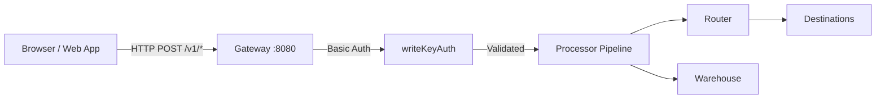

# JavaScript Web SDK Integration Guide

This guide documents how to send event data from websites to the RudderStack Customer Data Platform (CDP) using the Segment-compatible HTTP API exposed by the Gateway on port 8080. It covers SDK installation, initialization, all five core event API calls (`identify`, `track`, `page`, `group`, `alias`), batch delivery, authentication, error handling, and single-page application (SPA) considerations.

RudderStack's Gateway implements a **Segment Spec-compatible HTTP API** — existing Segment Analytics.js deployments can point to a RudderStack data plane by changing only the endpoint URL and write key. All event payload schemas, field semantics, and downstream routing are identical to Segment behavior.

> **Source references:**
>
> - `gateway/openapi.yaml:1-940` — OpenAPI 3.0.3 specification defining all public HTTP endpoints and payload schemas
> - `gateway/handle_http.go:1-153` — Handler chain architecture (`callType` → `writeKeyAuth` → `webHandler` → `webRequestHandler`)
> - `gateway/handle_http_auth.go:21-58` — `writeKeyAuth` middleware implementing HTTP Basic Auth with write key
> - `refs/segment-docs/src/connections/sources/catalog/libraries/website/javascript/index.md` — Segment Analytics.js reference
> - `refs/segment-docs/src/connections/sources/catalog/libraries/website/javascript/quickstart.md` — Segment Analytics.js quickstart

---

## Table of Contents

- [Prerequisites](#prerequisites)
- [Architecture](#architecture)
- [Installation](#installation)
- [Configuration](#configuration)
- [Identify](#identify)
- [Track](#track)
- [Page](#page)
- [Group](#group)
- [Alias](#alias)
- [Batch API](#batch-api)
- [Authentication](#authentication)
- [Error Handling](#error-handling)
- [Single-Page Applications](#single-page-applications)
- [Migrating from Segment](#migrating-from-segment)
- [Related Documentation](#related-documentation)

---

## Prerequisites

Before integrating the JavaScript SDK, ensure you have:

| Prerequisite | Description |
|---|---|
| **RudderStack data plane** | A running RudderStack instance with the Gateway accessible (default port `8080`) |
| **Source write key** | A write key provisioned for your JavaScript source in the RudderStack workspace configuration |
| **Basic HTML/JavaScript** | Familiarity with adding scripts to web pages and making HTTP requests |

> The write key authenticates every event sent from the browser to the Gateway. It is passed as the username in HTTP Basic Auth with an empty password.
>
> Source: `gateway/openapi.yaml:678-682` — `writeKeyAuth` security scheme definition

---

## Architecture

The JavaScript SDK sends events from the browser to the RudderStack Gateway via HTTP POST requests. The Gateway authenticates, validates, and queues events for the processing pipeline.



**Request processing chain:**

Each incoming event request follows this middleware chain before reaching the core request handler:

1. **`callType` middleware** — Tags the request with the event type (e.g., `"identify"`, `"track"`, `"page"`).
2. **`writeKeyAuth` middleware** — Extracts the write key from the HTTP `Authorization` header (Basic Auth), validates it against the workspace configuration, and verifies the source is enabled.
3. **`webHandler`** — Delegates to `webRequestHandler`.
4. **`webRequestHandler`** — Opens a tracing span, decodes the JSON payload, calls the `RequestHandler.ProcessRequest` method, records metrics, and returns the HTTP response.

> Source: `gateway/handle_http.go:37-69` — Individual handler functions (`webIdentifyHandler`, `webTrackHandler`, `webPageHandler`, `webScreenHandler`, `webAliasHandler`, `webGroupHandler`, `webBatchHandler`) each wire `callType(type, writeKeyAuth(webHandler()))`.
>
> Source: `gateway/handle_http.go:83-136` — `webRequestHandler` implementation with tracing, payload decoding, error handling, and response writing.
>
> Source: `gateway/handle_http_auth.go:24-58` — `writeKeyAuth` middleware extracting Basic Auth credentials and validating write key.

---

## Installation

You can integrate the JavaScript SDK into your website using either a CDN snippet or an NPM package.

### Method 1: CDN Snippet (Recommended for Quick Setup)

Paste the following snippet into the `<head>` tag of your HTML page, **below the `<title>` tag** (to ensure `document.title` is captured correctly):

```html
<script>
  !function(){var analytics=window.analytics=window.analytics||[];if(!analytics.initialize)if(analytics.invoked)window.console&&console.error&&console.error("Snippet included twice.");else{analytics.invoked=!0;analytics.methods=["trackSubmit","trackClick","trackLink","trackForm","pageview","identify","reset","group","track","ready","alias","debug","page","screen","once","off","on","addSourceMiddleware","addIntegrationMiddleware","setAnonymousId","addDestinationMiddleware","register"];analytics.factory=function(e){return function(){if(window.analytics.initialized)return window.analytics[e].apply(window.analytics,arguments);var i=Array.prototype.slice.call(arguments);if(["track","screen","alias","group","page","identify"].indexOf(e)>-1){var c=document.querySelector("link[rel='canonical']");i.push({__t:"bpc",c:c&&c.getAttribute("href")||void 0,p:location.pathname,u:location.href,s:location.search,t:document.title,r:document.referrer})}i.unshift(e);analytics.push(i);return analytics}};for(var i=0;i<analytics.methods.length;i++){var key=analytics.methods[i];analytics[key]=analytics.factory(key)}analytics.load=function(key,i){var t=document.createElement("script");t.type="text/javascript";t.async=!0;t.setAttribute("data-global-segment-analytics-key","analytics");t.src="https://cdn.segment.com/analytics.js/v1/" + key + "/analytics.min.js";var n=document.getElementsByTagName("script")[0];n.parentNode.insertBefore(t,n);analytics._loadOptions=i};analytics._writeKey="YOUR_WRITE_KEY";analytics.SNIPPET_VERSION="5.2.1";
    analytics.load("YOUR_WRITE_KEY");
    analytics.page();
  }}();
</script>
```

**Configuration for RudderStack:**

When using a self-hosted RudderStack data plane, you must configure the SDK to send events to your data plane URL instead of the default Segment endpoint. Replace `YOUR_WRITE_KEY` with your RudderStack source write key and configure the `apiHost` option:

```html
<script>
  // After the snippet loads, configure the data plane URL:
  analytics.load("YOUR_WRITE_KEY", {
    integrations: {
      "Segment.io": {
        apiHost: "YOUR_DATA_PLANE_URL:8080/v1"
      }
    }
  });
  analytics.page();
</script>
```

> **Note:** The snippet loads asynchronously and does not block page rendering. The final `analytics.page()` call automatically records the initial page view.
>
> Reference: `refs/segment-docs/src/connections/sources/catalog/libraries/website/javascript/quickstart.md` — Segment snippet installation pattern

### Method 2: NPM Package (Recommended for SPAs and Build Systems)

Install the analytics package using your preferred package manager:

```bash
# npm
npm install @segment/analytics-next

# yarn
yarn add @segment/analytics-next

# pnpm
pnpm add @segment/analytics-next
```

Import and initialize the analytics instance, pointing to your RudderStack data plane:

```javascript
import { AnalyticsBrowser } from '@segment/analytics-next'

export const analytics = AnalyticsBrowser.load({
  writeKey: 'YOUR_WRITE_KEY',
  // Point to your self-hosted RudderStack data plane
  cdnURL: 'https://YOUR_DATA_PLANE_URL'
})
```

Alternatively, use deferred initialization for consent-gated loading:

```javascript
import { AnalyticsBrowser } from '@segment/analytics-next'

export const analytics = new AnalyticsBrowser()

// Buffer events before consent is granted
analytics.identify('user-123', { name: 'Jane Doe' })
analytics.track('Page Loaded')

// Load and flush buffered events only after consent
if (userConsentsToTracking) {
  analytics.load({
    writeKey: 'YOUR_WRITE_KEY',
    cdnURL: 'https://YOUR_DATA_PLANE_URL'
  })
}
```

> Reference: `refs/segment-docs/src/connections/sources/catalog/libraries/website/javascript/index.md` — NPM package installation and deferred loading patterns

---

## Configuration

The following configuration parameters control SDK behavior. When migrating from Segment, the primary change is pointing `dataPlaneUrl` (or `cdnURL`/`apiHost`) to your RudderStack instance instead of `api.segment.io`.

| Parameter | Type | Default | Description |
|-----------|------|---------|-------------|
| `writeKey` | `string` | **Required** | Source write key from your RudderStack workspace configuration. Used for HTTP Basic Auth. |
| `dataPlaneUrl` | `string` | **Required** | URL of your RudderStack data plane (e.g., `https://your-instance:8080`). Replaces `api.segment.io` for self-hosted deployments. |
| `cdnURL` | `string` | Segment CDN | CDN URL for loading the analytics library bundle. Override for self-hosted setups. |
| `logLevel` | `string` | `"ERROR"` | Logging verbosity. Accepted values: `"DEBUG"`, `"INFO"`, `"WARN"`, `"ERROR"`. |
| `flushAt` | `number` | `20` | Number of events to queue before sending a batch request to the Gateway. |
| `flushInterval` | `number` | `10000` | Interval in milliseconds between automatic queue flushes. |
| `timeout` | `number` | `300` | Timeout in milliseconds for callback functions and helper methods (`trackLink`, `trackForm`). |

> Source: `gateway/openapi.yaml:678-682` — `writeKeyAuth` security scheme (Basic Auth with write key as username)

---

## Identify

The Identify call ties a user to their actions and records traits about them. Call it when a user registers, logs in, or updates their profile information.

> **Cross-reference:** [Identify Event Spec](../../api-reference/event-spec/identify.md) | [Common Fields](../../api-reference/event-spec/common-fields.md)

### Method Signature

```javascript
analytics.identify([userId], [traits], [options], [callback])
```

### Parameters

| Parameter | Type | Required | Description |
|-----------|------|----------|-------------|
| `userId` | `string` | Yes* | Unique user identifier from your database. *Required if no `anonymousId` is set.* |
| `traits` | `object` | No | Dictionary of user traits (e.g., `name`, `email`, `plan`). Cached in `localStorage` and merged across calls. |
| `options` | `object` | No | Options dictionary for integrations overrides, context additions, or anonymous ID setting. |
| `callback` | `function` | No | Executed after a 300 ms timeout, giving the browser time to make outbound requests. |

### Example

```javascript
analytics.identify('user-123', {
  name: 'Jane Doe',
  email: 'jane@example.com',
  plan: 'Enterprise',
  createdAt: '2024-01-15T10:30:00Z'
})
```

### Reserved Traits

The following reserved trait names have standardized semantic meaning and are passed through to destinations unchanged:

`address`, `age`, `avatar`, `birthday`, `company`, `createdAt`, `description`, `email`, `firstName`, `gender`, `id`, `lastName`, `name`, `phone`, `title`, `username`, `website`

You may include any additional custom traits beyond this list.

### Payload Sent to Gateway

The SDK transmits the following JSON payload to `POST /v1/identify`:

```json
{
  "type": "identify",
  "userId": "user-123",
  "anonymousId": "507f191e-810c-1972-9de8-60ea00000000",
  "traits": {
    "name": "Jane Doe",
    "email": "jane@example.com",
    "plan": "Enterprise",
    "createdAt": "2024-01-15T10:30:00Z"
  },
  "context": {
    "library": {
      "name": "analytics.js",
      "version": "2.x.x"
    },
    "page": {
      "url": "https://example.com/dashboard",
      "title": "Dashboard",
      "path": "/dashboard",
      "referrer": "https://example.com/"
    },
    "userAgent": "Mozilla/5.0 ..."
  },
  "timestamp": "2024-01-15T10:30:00.000Z",
  "messageId": "ajs-next-<uuid>"
}
```

> Source: `gateway/openapi.yaml:688-721` — `IdentifyPayload` schema: `userId`, `anonymousId`, `context` (with `traits`, `ip`, `library`), `timestamp`
>
> Source: `gateway/handle_http.go:37-39` — `webIdentifyHandler` wires `callType("identify", writeKeyAuth(webHandler()))`

---

## Track

The Track call records user actions (events) with optional associated properties. It is the primary method for capturing behavioral data.

> **Cross-reference:** [Track Event Spec](../../api-reference/event-spec/track.md) | [Common Fields](../../api-reference/event-spec/common-fields.md)

### Method Signature

```javascript
analytics.track(event, [properties], [options], [callback])
```

### Parameters

| Parameter | Type | Required | Description |
|-----------|------|----------|-------------|
| `event` | `string` | **Yes** | Name of the event (e.g., `"Order Completed"`, `"Product Viewed"`). This is the only required argument. |
| `properties` | `object` | No | Dictionary of properties associated with the event (e.g., `revenue`, `productId`, `currency`). |
| `options` | `object` | No | Options dictionary for integrations overrides and context additions. |
| `callback` | `function` | No | Executed after a 300 ms timeout. |

### Example

```javascript
analytics.track('Order Completed', {
  orderId: 'order-456',
  revenue: 99.99,
  currency: 'USD',
  products: [
    { productId: 'p-001', name: 'Widget', price: 49.99, quantity: 2 }
  ]
})
```

### Semantic Events

The Segment Spec defines standard event names for common use cases (ecommerce, video, etc.). These semantic events are passed through to destinations unchanged. Examples include:

- **Ecommerce:** `Product Viewed`, `Product Added`, `Order Completed`, `Checkout Started`
- **Lifecycle:** `Signed Up`, `Logged In`, `Logged Out`, `Account Deleted`
- **Content:** `Article Completed`, `Video Playback Started`, `Video Playback Completed`

Using standard event names ensures consistent mapping across destinations.

### Payload Sent to Gateway

```json
{
  "type": "track",
  "userId": "user-123",
  "anonymousId": "507f191e-810c-1972-9de8-60ea00000000",
  "event": "Order Completed",
  "properties": {
    "orderId": "order-456",
    "revenue": 99.99,
    "currency": "USD",
    "products": [
      { "productId": "p-001", "name": "Widget", "price": 49.99, "quantity": 2 }
    ]
  },
  "context": {
    "library": { "name": "analytics.js", "version": "2.x.x" },
    "page": { "url": "https://example.com/checkout", "title": "Checkout" }
  },
  "timestamp": "2024-01-15T10:35:00.000Z"
}
```

> Source: `gateway/openapi.yaml:722-755` — `TrackPayload` schema: `userId`, `anonymousId`, `event` (name of the event), `properties`, `context`, `timestamp`
>
> Source: `gateway/handle_http.go:42-44` — `webTrackHandler` wires `callType("track", writeKeyAuth(webHandler()))`

---

## Page

The Page call records page views on your website, along with optional properties about the viewed page. It is typically the first call fired on every page load.

> **Cross-reference:** [Page Event Spec](../../api-reference/event-spec/page.md) | [Common Fields](../../api-reference/event-spec/common-fields.md)

### Method Signature

```javascript
analytics.page([category], [name], [properties], [options], [callback])
```

### Parameters

| Parameter | Type | Required | Description |
|-----------|------|----------|-------------|
| `category` | `string` | No | Category of the page (e.g., `"Docs"`, `"Pricing"`). If only one string is passed, it is treated as `name`. |
| `name` | `string` | No | Name of the page (e.g., `"JavaScript SDK Guide"`). |
| `properties` | `object` | No | Dictionary of page properties. Analytics.js automatically collects `url`, `title`, `referrer`, and `path`. |
| `options` | `object` | No | Options dictionary for integrations overrides and context additions. |
| `callback` | `function` | No | Executed after a 300 ms timeout. |

### Default Properties

Analytics.js automatically populates the following properties on every Page call:

| Property | Source | Description |
|----------|--------|-------------|
| `url` | `document.location.href` (or canonical URL) | Full URL of the current page |
| `title` | `document.title` | Page title |
| `path` | `location.pathname` (or canonical path) | URL path component |
| `referrer` | `document.referrer` | Previous page URL |

You can override any of these by explicitly setting them in the `properties` object.

### Examples

```javascript
// Basic page call — auto-captures url, title, path, referrer
analytics.page()

// Named page call with category
analytics.page('Docs', 'JavaScript SDK Guide', {
  url: window.location.href,
  referrer: document.referrer
})

// Page call with custom properties
analytics.page('Pricing', {
  title: 'RudderStack Pricing',
  url: 'https://example.com/pricing',
  path: '/pricing',
  referrer: 'https://example.com/'
})
```

> **Note:** The CDN snippet includes a `analytics.page()` call at the end by default, which fires on initial page load. For single-page applications, you must call `analytics.page()` manually on each route change — see [Single-Page Applications](#single-page-applications).
>
> Source: `gateway/openapi.yaml:756-789` — `PagePayload` schema: `userId`, `anonymousId`, `name`, `properties`, `context`, `timestamp`
>
> Source: `gateway/handle_http.go:47-49` — `webPageHandler` wires `callType("page", writeKeyAuth(webHandler()))`

---

## Group

The Group call associates a user with a group — such as a company, organization, account, or team. It lets you record custom traits about that group.

> **Cross-reference:** [Group Event Spec](../../api-reference/event-spec/group.md) | [Common Fields](../../api-reference/event-spec/common-fields.md)

### Method Signature

```javascript
analytics.group(groupId, [traits], [options], [callback])
```

### Parameters

| Parameter | Type | Required | Description |
|-----------|------|----------|-------------|
| `groupId` | `string` | **Yes** | Unique identifier for the group in your database. |
| `traits` | `object` | No | Dictionary of group traits (e.g., `name`, `industry`, `employees`). Cached in `localStorage`. |
| `options` | `object` | No | Options dictionary for integrations overrides and context additions. |
| `callback` | `function` | No | Executed after a 300 ms timeout. |

### Example

```javascript
analytics.group('company-789', {
  name: 'Acme Corp',
  industry: 'Technology',
  employees: 500,
  plan: 'Enterprise'
})
```

### Payload Sent to Gateway

```json
{
  "type": "group",
  "userId": "user-123",
  "anonymousId": "507f191e-810c-1972-9de8-60ea00000000",
  "groupId": "company-789",
  "traits": {
    "name": "Acme Corp",
    "industry": "Technology",
    "employees": 500,
    "plan": "Enterprise"
  },
  "context": {
    "library": { "name": "analytics.js", "version": "2.x.x" }
  },
  "timestamp": "2024-01-15T10:40:00.000Z"
}
```

> Source: `gateway/openapi.yaml:826-867` — `GroupPayload` schema: `userId`, `anonymousId`, `groupId`, `traits`, `context`, `timestamp`
>
> Source: `gateway/handle_http.go:67-69` — `webGroupHandler` wires `callType("group", writeKeyAuth(webHandler()))`

---

## Alias

The Alias call merges two user identities — typically linking an anonymous visitor to a known user ID. This is an advanced method used when specific destinations require explicit identity merging.

> **Cross-reference:** [Alias Event Spec](../../api-reference/event-spec/alias.md) | [Common Fields](../../api-reference/event-spec/common-fields.md)

### Method Signature

```javascript
analytics.alias(userId, [previousId], [options], [callback])
```

### Parameters

| Parameter | Type | Required | Description |
|-----------|------|----------|-------------|
| `userId` | `string` | **Yes** | The new canonical user ID to associate with the user. |
| `previousId` | `string` | No | The previous ID (anonymous or known) that the user was recognized by. Defaults to the current `anonymousId`. |
| `options` | `object` | No | Options dictionary for integrations overrides. |
| `callback` | `function` | No | Executed after a 300 ms timeout. |

### Example

```javascript
// Merge anonymous visitor with known user after login
analytics.alias('user-123', 'anonymous-456')
```

### Payload Sent to Gateway

```json
{
  "type": "alias",
  "userId": "user-123",
  "previousId": "anonymous-456",
  "context": {
    "library": { "name": "analytics.js", "version": "2.x.x" }
  },
  "timestamp": "2024-01-15T10:45:00.000Z"
}
```

> **Important:** Alias operations are **permanent** — there is no "un-alias" operation. Most identity resolution workflows do not require Alias; the Identify call handles anonymous-to-known user association automatically for the majority of destinations.
>
> Source: `gateway/openapi.yaml:868-899` — `AliasPayload` schema: `userId`, `previousId`, `context`, `timestamp`
>
> Source: `gateway/handle_http.go:57-59` — `webAliasHandler` wires `callType("alias", writeKeyAuth(webHandler()))`

---

## Batch API

The Batch endpoint lets you send multiple events in a single HTTP request. The SDK automatically batches events based on the `flushAt` and `flushInterval` configuration parameters. You can also use the batch endpoint directly via HTTP.

### SDK Auto-Batching

The SDK queues events in memory and flushes them when either:

- The queue reaches `flushAt` events (default: 20), or
- The `flushInterval` timer fires (default: 10,000 ms)

No additional configuration is required — batching is handled transparently.

### Direct HTTP Batch Request

For server-side or manual integration, send a `POST /v1/batch` request:

```bash
curl -X POST https://YOUR_DATA_PLANE_URL:8080/v1/batch \
  -H 'Content-Type: application/json' \
  -u YOUR_WRITE_KEY: \
  -d '{
    "batch": [
      {
        "type": "identify",
        "userId": "user-1",
        "traits": { "name": "Jane Doe", "email": "jane@example.com" }
      },
      {
        "type": "track",
        "userId": "user-1",
        "event": "Login",
        "properties": { "method": "SSO" }
      },
      {
        "type": "page",
        "userId": "user-1",
        "name": "Dashboard",
        "properties": { "url": "https://example.com/dashboard" }
      }
    ]
  }'
```

Each element in the `batch` array must include a `type` field (`"identify"`, `"track"`, `"page"`, `"screen"`, `"group"`, or `"alias"`) and the corresponding payload fields for that event type. The `batch` field is **required**.

> Source: `gateway/openapi.yaml:376-435` — `POST /v1/batch` endpoint definition
>
> Source: `gateway/openapi.yaml:900-939` — `BatchPayload` schema: `batch` (required array) with `allOf` combining all six payload types, plus `type` discriminator field
>
> Source: `gateway/handle_http.go:28-30` — `webBatchHandler` wires `callType("batch", writeKeyAuth(webHandler()))`

---

## Authentication

All requests to the Gateway's public endpoints require HTTP Basic Authentication using the source write key.

### Authentication Scheme: `writeKeyAuth`

| Property | Value |
|----------|-------|
| **Scheme** | HTTP Basic Auth |
| **Username** | Your source write key |
| **Password** | Empty string |
| **Header** | `Authorization: Basic <base64(writeKey:)>` |

The `writeKeyAuth` middleware in the Gateway:

1. Extracts the write key from the `Authorization` header via `r.BasicAuth()`.
2. Validates the write key against the workspace configuration.
3. Verifies the source is enabled.
4. Augments the request context with source authentication metadata.
5. Rejects the request with `401 Unauthorized` if the write key is missing, invalid, or the source is disabled.

### curl Example

```bash
# The -u flag sets Basic Auth (writeKey as username, empty password)
curl -X POST https://YOUR_DATA_PLANE_URL:8080/v1/track \
  -H 'Content-Type: application/json' \
  -u YOUR_WRITE_KEY: \
  -d '{
    "userId": "user-1",
    "event": "Test Event",
    "properties": { "key": "value" }
  }'
```

> **Note:** The write key is included in client-side JavaScript and is visible in browser developer tools. It authenticates the source but does not provide user-level access control. Ensure your workspace configuration restricts write key permissions appropriately.
>
> Source: `gateway/openapi.yaml:678-682` — `writeKeyAuth` security scheme: `type: http`, `scheme: basic`
>
> Source: `gateway/handle_http_auth.go:24-58` — `writeKeyAuth` middleware: `r.BasicAuth()` extraction, write key validation, source enabled check, context augmentation

---

## Error Handling

The Gateway returns standard HTTP status codes for all event API endpoints. The SDK handles retries internally for transient errors, but your application should account for these responses when making direct HTTP calls.

### Response Codes

| Code | Status | Response Body Example | Recommended Action |
|------|--------|----------------------|-------------------|
| `200` | OK | `"OK"` | Success — event accepted and queued for processing. |
| `400` | Bad Request | `"Invalid request"` | Check payload format, required fields, and JSON validity. |
| `401` | Unauthorized | `"Invalid Authorization Header"` | Verify write key is correct and included in Basic Auth header. |
| `404` | Not Found | `"Source does not accept webhook events"` | Check endpoint URL — must be `/v1/{type}` where type is `identify`, `track`, `page`, `screen`, `group`, `alias`, or `batch`. |
| `413` | Request Entity Too Large | `"Request size too large"` | Reduce payload size. Split large batch requests into smaller chunks. |
| `429` | Too Many Requests | `"Too many requests"` | Implement exponential backoff retry. The Gateway's rate limiter is active — reduce request rate. |

> Source: `gateway/openapi.yaml:30-72` — Response definitions for the `/v1/identify` endpoint (identical response schema applies to all public endpoints)

---

## Single-Page Applications

In traditional multi-page websites, the `analytics.page()` call at the end of the CDN snippet fires on each full page load. **Single-page applications (SPAs)** do not trigger full page loads on route changes, so you must call `analytics.page()` manually whenever the route changes.

### React Router Example

```javascript
import { useEffect } from 'react'
import { useLocation } from 'react-router-dom'
import { analytics } from './analytics' // Your initialized analytics instance

function App() {
  const location = useLocation()

  useEffect(() => {
    analytics.page()
  }, [location])

  return (
    // Your route definitions
    <Routes>{/* ... */}</Routes>
  )
}
```

### Vue Router Example

```javascript
import { analytics } from './analytics'

router.afterEach((to) => {
  analytics.page(to.name, {
    path: to.path,
    url: window.location.origin + to.fullPath
  })
})
```

### Next.js (App Router) Example

```javascript
'use client'

import { usePathname } from 'next/navigation'
import { useEffect } from 'react'
import { analytics } from '@/lib/analytics'

export function AnalyticsProvider({ children }) {
  const pathname = usePathname()

  useEffect(() => {
    analytics.page()
  }, [pathname])

  return children
}
```

> **Key point:** Page calls are **not** automatically fired on client-side route changes in SPAs. You must instrument each route transition explicitly.
>
> Reference: `refs/segment-docs/src/connections/sources/catalog/libraries/website/javascript/index.md` — Page method documentation noting SPA considerations and manual page calls

---

## Migrating from Segment

Migrating an existing Segment Analytics.js deployment to RudderStack requires minimal changes. The Gateway's HTTP API is fully compatible with the Segment Spec — all event calls (`identify`, `track`, `page`, `group`, `alias`) use identical payload schemas and field semantics.

### Migration Steps

1. **Change the API endpoint** — Point your SDK from `api.segment.io` to your RudderStack data plane URL (e.g., `https://your-instance:8080`).

2. **Update the write key** — Replace your Segment write key with the source write key from your RudderStack workspace configuration.

3. **No event call changes required** — All `analytics.identify()`, `analytics.track()`, `analytics.page()`, `analytics.group()`, and `analytics.alias()` calls work identically. Payload schemas, reserved traits, semantic events, and context fields are fully compatible.

### CDN Snippet Migration

```javascript
// Before (Segment):
analytics.load("SEGMENT_WRITE_KEY");

// After (RudderStack):
analytics.load("RUDDERSTACK_WRITE_KEY", {
  integrations: {
    "Segment.io": {
      apiHost: "YOUR_DATA_PLANE_URL:8080/v1"
    }
  }
});
```

### NPM Package Migration

```javascript
// Before (Segment):
AnalyticsBrowser.load({ writeKey: 'SEGMENT_WRITE_KEY' })

// After (RudderStack):
AnalyticsBrowser.load({
  writeKey: 'RUDDERSTACK_WRITE_KEY',
  cdnURL: 'https://YOUR_DATA_PLANE_URL'
})
```

> For a comprehensive migration walkthrough covering all SDKs (JavaScript, iOS, Android, server-side), see the [SDK Swap Guide](../migration/sdk-swap-guide.md).
>
> For a detailed analysis of SDK compatibility gaps between Segment and RudderStack, see the [Source Catalog Parity Analysis](../../gap-report/source-catalog-parity.md).

---

## Related Documentation

### Event Specification

- [Common Fields](../../api-reference/event-spec/common-fields.md) — Shared fields across all event types (`anonymousId`, `context`, `integrations`, `messageId`, `timestamp`)
- [Identify](../../api-reference/event-spec/identify.md) — Full Identify call specification and payload reference
- [Track](../../api-reference/event-spec/track.md) — Full Track call specification, semantic events, and properties reference
- [Page](../../api-reference/event-spec/page.md) — Full Page call specification with default properties
- [Group](../../api-reference/event-spec/group.md) — Full Group call specification and group traits reference
- [Alias](../../api-reference/event-spec/alias.md) — Full Alias call specification and identity merging reference

### API and Architecture

- [Gateway HTTP API Reference](../../api-reference/gateway-http-api.md) — Complete HTTP API reference for all Gateway endpoints
- [API Overview and Authentication](../../api-reference/index.md) — Authentication schemes and API overview

### Migration and Parity

- [SDK Swap Migration Guide](../migration/sdk-swap-guide.md) — Step-by-step guide for replacing Segment SDKs with RudderStack
- [Source Catalog Parity Analysis](../../gap-report/source-catalog-parity.md) — Gap analysis of SDK compatibility between Segment and RudderStack

### Other SDK Guides

- [iOS SDK Guide](./ios-sdk.md) — iOS mobile SDK integration
- [Android SDK Guide](./android-sdk.md) — Android mobile SDK integration
- [Server-Side SDKs Guide](./server-side-sdks.md) — Node.js, Python, Go, Java, and Ruby server-side SDK integration
