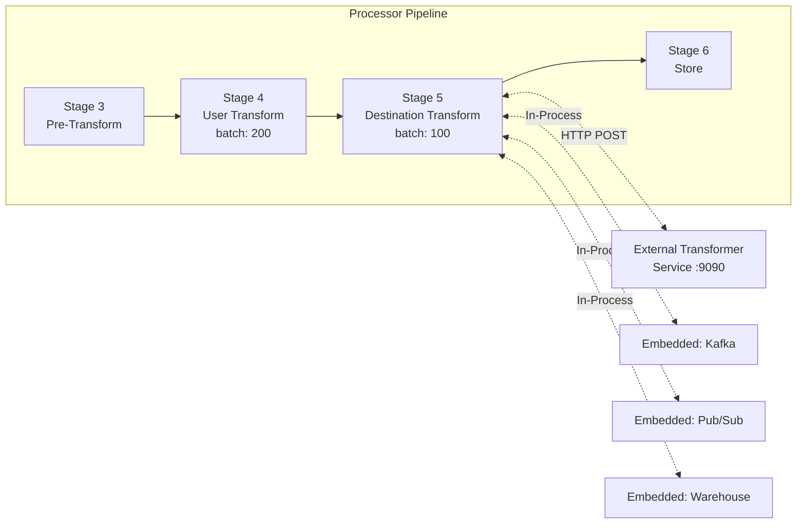
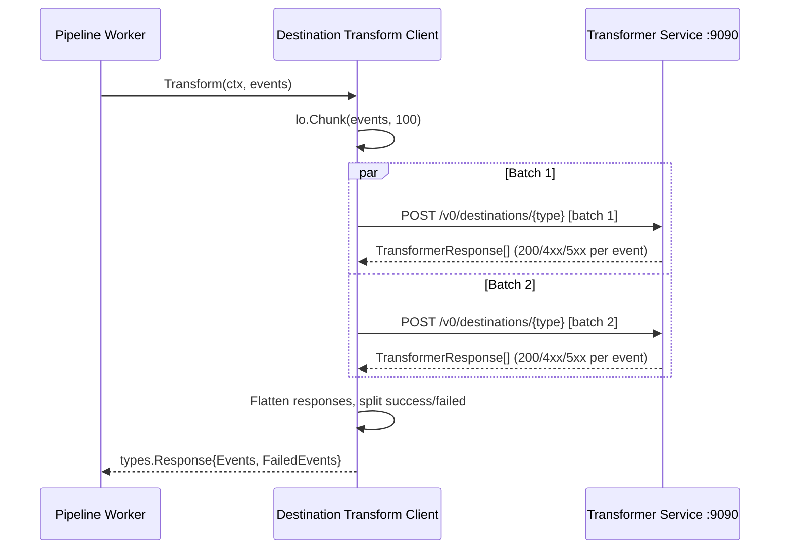
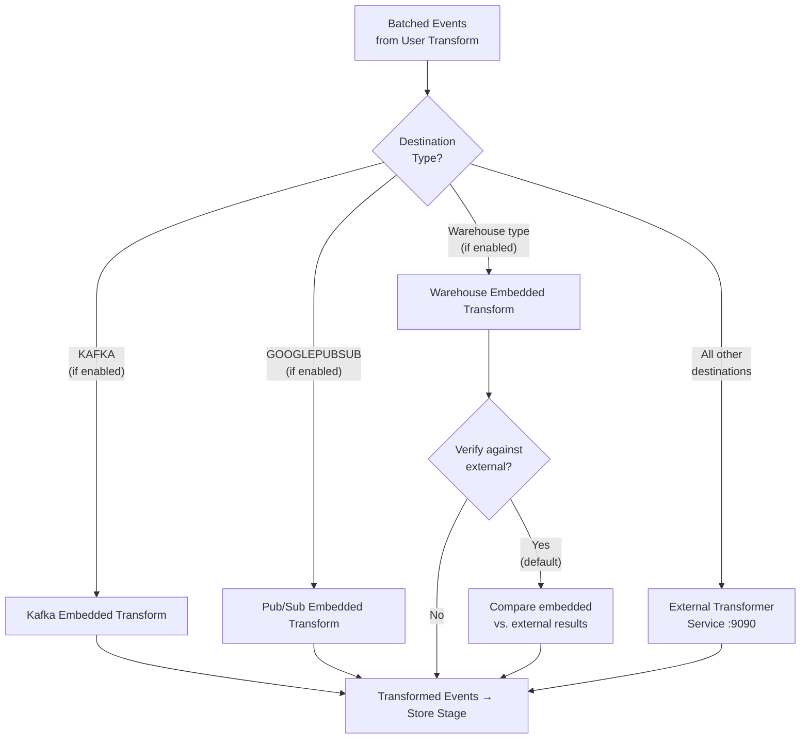

# Destination Transforms

Destination transforms are the **5th stage** in the Processor's six-stage pipeline, executing after [user transforms](./user-transforms.md) and before the store stage. Their purpose is to **shape event payloads for specific destination requirements** before events are persisted to JobsDB for routing and delivery.

While user transforms apply source-agnostic, user-defined custom logic (JavaScript/Python), destination transforms are **destination-specific payload shaping** — they map, reformat, and enrich event fields to match the exact schema and protocol requirements of each target destination. Every destination type has its own transformation logic that converts the RudderStack canonical event format into the destination-native format.

**Key characteristics:**

- **Execution mode:** External (via the Transformer service at `DEST_TRANSFORM_URL`, default `http://localhost:9090`) or embedded (in-process for Kafka, Pub/Sub, and Warehouse destinations)
- **Batch size:** 100 events per batch (configurable via `Processor.DestinationTransformer.batchSize`)
- **Concurrency:** Batches are sent concurrently to the Transformer service via goroutines
- **One-to-many mapping:** A single input event can produce zero, one, or multiple output events per destination
- **Compaction support:** Feature-gated payload compaction reduces network overhead for large event batches

> **Source:** `processor/pipeline_worker.go:36` (destination transform channel), `processor/pipeline_worker.go:175-188` (destination transform goroutine), `processor/internal/transformer/destination_transformer/destination_transformer.go:71-106` (client configuration)

**Prerequisites:**
- [Transformation Architecture Overview](./overview.md) — multi-layer transformation system context
- [Pipeline Stages Architecture](../../architecture/pipeline-stages.md) — six-stage pipeline documentation

---

## Table of Contents

- [Architecture](#architecture)
  - [Pipeline Position](#pipeline-position)
  - [TransformerClients Interface](#transformerclients-interface)
- [External Destination Transforms](#external-destination-transforms)
  - [Transform Flow](#transform-flow)
  - [Compacted Payloads](#compacted-payloads)
  - [Example: Destination Transform Logic](#example-destination-transform-logic)
- [Embedded Destination Transforms](#embedded-destination-transforms)
  - [Kafka (Embedded)](#kafka-embedded)
  - [Google Pub/Sub (Embedded)](#google-pubsub-embedded)
  - [Warehouse (Embedded)](#warehouse-embedded)
  - [Embedded Transform Registration](#embedded-transform-registration)
- [Router Transformer](#router-transformer)
  - [Transformer Interface](#transformer-interface)
  - [Transform Types](#transform-types)
  - [Compaction and Dehydration](#compaction-and-dehydration)
  - [Proxy Request and Adapter Pattern](#proxy-request-and-adapter-pattern)
- [Configuration](#configuration)
  - [Processor Destination Transform Parameters](#processor-destination-transform-parameters)
  - [Embedded Transform Parameters](#embedded-transform-parameters)
  - [Router Transformer Parameters](#router-transformer-parameters)
- [Error Handling](#error-handling)
- [Performance Tuning](#performance-tuning)
- [Related Documentation](#related-documentation)

---

## Architecture

### Pipeline Position

Destination transforms occupy **Stage 5** of the Processor pipeline, receiving events from the user transform stage (Stage 4) and passing transformed events to the store stage (Stage 6). Within the `pipelineWorker`, Stage 5 runs as a dedicated goroutine that reads from the `destinationtransform` channel and writes to the `store` channel:



The destination transform flow operates as follows:

1. **Events arrive** from the user transform stage, already processed by user-defined custom transforms
2. **Events are grouped by destination** — each destination type receives its own batch of events
3. **Transform routing decision** — for each destination:
   - Check if an **embedded transform** exists and is enabled (Kafka, Pub/Sub, Warehouse)
   - If embedded: transform locally without external service call
   - If external: batch events (100 per batch) and send to the Transformer service
4. **Transformer service returns** transformed events with per-event success/failure status codes
5. **Successful events** (HTTP 200) proceed to the store stage for persistence and routing
6. **Failed events** are collected separately with error details for reporting

> **Source:** `processor/pipeline_worker.go:175-188` (destination transform goroutine), `processor/internal/transformer/destination_transformer/destination_transformer.go:386-415` (`Transform` method — routing decision)

### TransformerClients Interface

The Processor uses a unified `TransformerClients` interface to access all transformation clients. The destination transform client is one of five clients managed by this interface:

```go
type TransformerClients interface {
    User() UserClient
    UserMirror() UserClient
    Destination() DestinationClient
    TrackingPlan() TrackingPlanClient
    SrcHydration() SrcHydrationClient
}
```

The `DestinationClient` interface defines a single method:

```go
type DestinationClient interface {
    Transform(ctx context.Context, events []types.TransformerEvent) types.Response
}
```

The `NewClients()` constructor creates the destination client via `destination_transformer.New()`, which initializes the HTTP client, configures batch sizes, retry policies, and registers embedded transform implementations.

> **Source:** `processor/transformer/clients.go:20-22` (`DestinationClient` interface), `processor/transformer/clients.go:36-42` (`Clients` struct), `processor/transformer/clients.go:44-50` (`TransformerClients` interface), `processor/transformer/clients.go:60-72` (`NewClients` constructor)

---

## External Destination Transforms

External destination transforms are the default execution mode for most destinations. Events are sent over HTTP POST to the **Transformer service**, a separate containerized process that hosts destination-specific transformation logic written in JavaScript/TypeScript.

The Transformer service is the **same service** used for user transforms (Stage 4), but destination transforms are routed to different endpoints based on the destination type.

### Transform Flow

The external transform flow is implemented in the `Client.transform()` method:

1. **Batch events** — Events are split into batches of 100 (configurable) using `lo.Chunk(clientEvents, batchSize)`
2. **Construct destination URL** — The destination type is appended to the base transform URL: `{DEST_TRANSFORM_URL}/v0/destinations/{destination_type}`. For warehouse destinations, query parameters are added for ID resolution and ClickHouse array support
3. **Send batches concurrently** — Each batch is sent as a goroutine via `sendBatch()`, enabling parallel processing across batches
4. **Track metrics** — Each request is instrumented with labels for endpoint, stage (`"dest_transformer"`), destination type, source type, workspace ID, and source ID
5. **Aggregate responses** — Responses are collected from all batches. Events with HTTP 200 status are routed to `Events` (success); all others are routed to `FailedEvents`



The `sendBatch()` method handles HTTP communication with exponential backoff retry:

- **Payload serialization:** Events are marshaled to JSON (or compacted JSON when supported)
- **HTTP headers:** `Content-Type: application/json`, `X-Feature-Gzip-Support: ?1`, `X-Feature-Filter-Code: ?1`
- **Retry:** Exponential backoff via `backoff.NewExponentialBackOff()` with configurable max interval and max retries
- **Version check:** On HTTP 200, validates `apiVersion` header matches `SupportedTransformerApiVersion`
- **Non-200 responses:** Generates per-event failure responses with the status code and error body

> **Source:** `processor/internal/transformer/destination_transformer/destination_transformer.go:141-224` (`transform` method), `processor/internal/transformer/destination_transformer/destination_transformer.go:226-361` (`sendBatch` and `doPost` methods), `processor/internal/transformer/destination_transformer/destination_transformer.go:363-377` (`destTransformURL` method)

### Compacted Payloads

The destination transform client supports **compacted payloads** to reduce network overhead. When enabled (feature-gated via the Transformer features service), the request payload is restructured to deduplicate shared destination and connection metadata:

**Standard payload format:**
```json
[
  {"message": {...}, "metadata": {...}, "destination": {...}, "connection": {...}},
  {"message": {...}, "metadata": {...}, "destination": {...}, "connection": {...}}
]
```

**Compacted payload format:**
```json
{
  "input": [
    {"message": {...}, "metadata": {...}},
    {"message": {...}, "metadata": {...}}
  ],
  "destinations": {"dest_id": {...}},
  "connections": {"src_id:dest_id": {...}}
}
```

When compaction is active, the `X-Content-Format: json+compactedv1` header is added to the request to signal the Transformer service to expect the compacted format.

> **Source:** `processor/internal/transformer/destination_transformer/destination_transformer.go:432-456` (`getRequestPayload` method), `processor/internal/transformer/destination_transformer/destination_transformer.go:55-69` (`WithFeatureService` option)

### Example: Destination Transform Logic

The following example illustrates the type of transformation logic the Transformer service applies for a hypothetical analytics destination. Each destination has its own transformation module in the Transformer service that converts the RudderStack canonical event into the destination-native format:

```javascript
// Example: Destination Transform for a hypothetical analytics destination
// The Transformer service applies this logic per-destination type
function transformForAnalytics(event) {
  return {
    event_name: event.event || event.type,
    user_id: event.userId || event.anonymousId,
    properties: {
      ...event.properties,
      source: 'rudderstack',
      received_at: event.receivedAt,
    },
    timestamp: event.originalTimestamp || event.timestamp,
  };
}
```

The actual transformation logic varies significantly by destination — a Google Analytics transform maps events to the GA4 Measurement Protocol, a Facebook Pixel transform maps to the Conversions API, and a Kafka transform structures events with topics, keys, and partition metadata. Each transformation is maintained in the external Transformer service repository.

---

## Embedded Destination Transforms

Certain high-volume destinations have transforms built **directly into the Processor** as compiled Go code, bypassing the external Transformer service entirely. Embedded transforms provide:

- **Lower latency** — No HTTP round-trip to the Transformer service
- **Higher throughput** — In-process execution with no serialization/deserialization overhead
- **Reduced dependency** — Operation continues even if the Transformer service is temporarily unavailable (for these specific destinations only)

Currently, three destination types support embedded transforms: **Kafka**, **Google Pub/Sub**, and **Warehouse** destinations.



### Kafka (Embedded)

The Kafka embedded transform converts events directly into the Kafka destination format without an external service call. The transform is registered in the `embeddedTransformerImpls` map with the key `"KAFKA"`.

**Transform logic:**
- Extracts `userId` (falls back to `anonymousId` if `userId` is empty)
- Resolves the **topic** using a priority cascade:
  1. `integrations.KAFKA.topic` field on the event (highest priority)
  2. `eventToTopicMap` or `eventTypeToTopicMap` from destination config (when `enableMultiTopic` is `true`)
  3. Default `topic` from destination config (lowest priority)
- Structures the output as `{message, userId, topic}`, optionally including `schemaId` from the integrations object
- Appends the resolved topic to `RudderID` metadata for downstream routing: `{rudderID}<<>>{topic}`
- Events without a resolvable topic are returned as failed events with HTTP 500

**Multi-topic support:** When `enableMultiTopic` is enabled in the destination config, events are routed to different Kafka topics based on event type (`identify`, `screen`, `page`, `group`, `alias`) via `eventTypeToTopicMap`, or by track event name via `eventToTopicMap`.

> **Source:** `processor/internal/transformer/destination_transformer/embedded/kafka/kafka.go:16-75` (`Transform` function), `processor/internal/transformer/destination_transformer/embedded/kafka/kafka.go:77-117` (topic resolution and multi-topic filtering)

### Google Pub/Sub (Embedded)

The Google Pub/Sub embedded transform converts events into the Pub/Sub destination format. The transform is registered in the `embeddedTransformerImpls` map with the key `"GOOGLEPUBSUB"`.

**Transform logic:**
- Extracts `userId` (falls back to `anonymousId` if `userId` is empty)
- Resolves the **topic** using a priority cascade:
  1. Event name match in `eventToTopicMap` (case-insensitive)
  2. Event type match in `eventToTopicMap` (case-insensitive)
  3. Wildcard `*` match in `eventToTopicMap`
  4. Returns a failure if no topic is resolved
- Extracts **attributes** from the event payload based on the `eventToAttributesMap` destination config. Attributes are resolved by searching the event message, then nested within `properties`, `traits`, and `context.traits` source keys
- Structures the output as `{userId, message, topicId, attributes}`

> **Source:** `processor/internal/transformer/destination_transformer/embedded/pubsub/pubsub.go:18-63` (`Transform` function), `processor/internal/transformer/destination_transformer/embedded/pubsub/pubsub.go:91-116` (topic resolution), `processor/internal/transformer/destination_transformer/embedded/pubsub/pubsub.go:134-163` (attribute extraction)

### Warehouse (Embedded)

The warehouse embedded transform is the most complex embedded transform, converting events into the warehouse-native format with schema-aware processing, column sanitization, type inference, and identity resolution. Unlike Kafka and Pub/Sub, the warehouse transform is managed separately through a `warehouseClient` interface:

```go
type warehouseClient interface {
    Transform(ctx context.Context, clientEvents []types.TransformerEvent) types.Response
    CompareResponsesAndUpload(ctx context.Context, events []types.TransformerEvent, legacyResponse types.Response)
}
```

**Key capabilities:**
- **Event type dispatching:** Handles `track`, `identify`, `page`, `screen`, `group`, `alias`, and `extract` event types with type-specific processing flows
- **Schema management:** Sanitizes table and column names per destination type (Snowflake, Postgres, BigQuery, Redshift, etc.), enforces column count limits (`WH_MAX_COLUMNS_IN_EVENT`, default 1600), and infers data types from payload values
- **Identity resolution:** Optionally generates merge rule events for identity graph construction (controlled via `Warehouse.enableIDResolution`)
- **JSON path handling:** Detects and processes nested JSON structures, converting dotted paths to canonical underscore-separated column names
- **Concurrent processing:** Events are processed concurrently using `errgroup` with configurable concurrency limits (`Warehouse.concurrentTransformations`, default 1)
- **Context enrichment:** Optionally populates source and destination information in the event context (`WH_POPULATE_SRC_DEST_INFO_IN_CONTEXT`, default `true`)

**Verification mode:** When both `Processor.enableWarehouseTransformations` and `Processor.verifyWarehouseTransformations` are enabled (the default), the system runs both the embedded transform AND the external Transformer service, then compares the results. This dual-execution mode is designed for validation during rollout:

1. External Transformer service result is used as the authoritative response
2. Embedded transform result is compared against the external result
3. Mismatches are logged and uploaded to S3 for analysis via the sampling uploader
4. Metrics are emitted: `embedded_destination_transform_matched_events` and `embedded_destination_transform_mismatched_events`

Once validation is complete, disable `Processor.verifyWarehouseTransformations` to use only the embedded transform.

> **Source:** `processor/internal/transformer/destination_transformer/destination_transformer.go:42-45` (`warehouseClient` interface), `processor/internal/transformer/destination_transformer/destination_transformer.go:97-99` (warehouse config), `processor/internal/transformer/destination_transformer/destination_transformer.go:386-415` (`Transform` routing for warehouse), `processor/internal/transformer/destination_transformer/embedded/warehouse/transformer.go:62-95` (`New` constructor)

### Embedded Transform Registration

Embedded transforms for Kafka and Pub/Sub are registered in a static map that maps destination type names to transform functions:

```go
var embeddedTransformerImpls = map[string]transformer{
    "GOOGLEPUBSUB": pubsub.Transform,
    "KAFKA":        kafka.Transform,
}
```

The `Transform` method on the `Client` checks this map to determine the execution path:

1. **Warehouse check first:** If the destination type is a pseudo-warehouse destination and `Processor.enableWarehouseTransformations` is enabled, route to the warehouse embedded transform
2. **Embedded map lookup:** If the destination type exists in `embeddedTransformerImpls`, check if the embedded transform is enabled via `Processor.Transformer.Embedded.{DEST_TYPE}.Enabled` (default: `false`)
3. **Verification mode:** If `Processor.Transformer.Embedded.{DEST_TYPE}.Verify` is `true` (default), run both the embedded and external transforms, compare results, and return the external (legacy) result
4. **Embedded-only mode:** If verify is disabled, return only the embedded transform result
5. **External fallback:** If no embedded transform is available or enabled, fall back to the external Transformer service

> **Source:** `processor/internal/transformer/destination_transformer/destination_transformer.go:381-384` (embedded transform map), `processor/internal/transformer/destination_transformer/destination_transformer.go:386-415` (`Transform` method with routing logic)

---

## Router Transformer

After events leave the Processor (with destination transforms applied) and are persisted to JobsDB, they enter the **Router**. The Router has its own Transformer component for additional routing-level transformations required for event delivery. This is a separate transformation layer from the Processor's destination transforms.

### Transformer Interface

The Router Transformer implements the `Transformer` interface:

```go
type Transformer interface {
    Transform(transformType string, transformMessage *types.TransformMessageT) []types.DestinationJobT
    ProxyRequest(ctx context.Context, proxyReqParams *ProxyRequestParams) ProxyRequestResponse
}
```

| Method | Purpose |
|--------|---------|
| `Transform` | Transforms events for batch or router delivery. Accepts a transform type (`BATCH` or `ROUTER_TRANSFORM`) and a message containing events, destination config, and job metadata. Returns an array of `DestinationJobT` with transformed payloads. |
| `ProxyRequest` | Proxies delivery requests to destinations via the Transformer service. Supports OAuth v2 integration for authenticated destination delivery. Returns per-job response codes and bodies. |

The Router Transformer is instantiated per destination type via `NewTransformer()`, which sets up HTTP clients (standard and OAuth v2), transport configuration, and feature service integration.

> **Source:** `router/transformer/transformer.go:113-116` (`Transformer` interface), `router/transformer/transformer.go:120-135` (`NewTransformer` constructor), `router/transformer/transformer.go:562-611` (`setup` method)

### Transform Types

The Router Transformer supports two transform types:

| Transform Type | Constant | Transformer Endpoint | Description |
|---------------|----------|---------------------|-------------|
| **Batch** | `BATCH` | `getBatchURL()` | Batches multiple events for a single destination into an optimized delivery payload. Used by the batch router for destinations that support bulk ingestion. |
| **Router Transform** | `ROUTER_TRANSFORM` | `getRouterTransformURL()` | Applies routing-level transforms for per-event delivery. Wraps the response in an `output` field with additional routing metadata. |

Both types send events to the Transformer service via HTTP POST with JSON payloads, supporting the same compaction and version-checking behavior as Processor destination transforms.

> **Source:** `router/transformer/transformer.go:44-46` (constants), `router/transformer/transformer.go:168-398` (`Transform` method)

### Compaction and Dehydration

The Router Transformer supports two payload optimization techniques:

**Compaction:** When enabled (feature-gated via the Transformer features service), event payloads are restructured into a compacted format that deduplicates shared destination and connection metadata, reducing request size. Compaction support is determined at setup time by calling `featuresService.SupportDestTransformCompactedPayloadV1()` and then applied consistently for the entire request.

**Dehydration/Hydration:** Before sending events to the Transformer service, the transform message is **dehydrated** — large or repetitive fields are extracted and stored separately. After receiving the response, the destination jobs are **rehydrated** by merging the preserved data back into the transformed payloads. This reduces the amount of data transmitted to the Transformer service while preserving full payload fidelity.

```go
// Dehydrate before sending to Transformer
transformMessageCopy, preservedData := transformMessage.Dehydrate()

// ... transform via Transformer service ...

// Rehydrate response
destinationJobs.Hydrate(preservedData)
```

> **Source:** `router/transformer/transformer.go:171-172` (dehydration), `router/transformer/transformer.go:393` (hydration), `router/transformer/transformer.go:605-610` (compaction setup)

### Proxy Request and Adapter Pattern

The `ProxyRequest` method delivers transformed events to destinations via the Transformer service's proxy endpoint. It supports two proxy protocol versions through the **adapter pattern**:

| Adapter | Version | Payload Structure | Response Structure |
|---------|---------|-------------------|-------------------|
| `v0Adapter` | v0 | Single `metadata` object per request | Single response per request — same status code applied to all job IDs |
| `v1Adapter` | v1 | Array of `metadata` objects per request | Array of per-job responses with individual status codes and error messages |

The adapter is selected at construction time via `NewTransformerProxyAdapter(version, logger)`, which returns a `v0Adapter` by default or a `v1Adapter` when version `"v1"` is specified.

The proxy URL construction prioritizes `DELIVERY_TRANSFORMER_URL` for dedicated delivery deployments, falling back to `DEST_TRANSFORM_URL` for backward compatibility:

```
{DELIVERY_TRANSFORMER_URL || DEST_TRANSFORM_URL}/{version}/destinations/{dest_type}/proxy
```

OAuth v2 integration is built into the proxy request flow. The OAuth HTTP client handles token refresh, expiration management, and auth error categorization transparently. Auth error categories (`CategoryRefreshToken`, `CategoryAuthStatusInactive`) trigger interceptor responses that override the proxy response status code and body.

> **Source:** `router/transformer/transformer_proxy_adapter.go:21-25` (`transformerProxyAdapter` interface), `router/transformer/transformer_proxy_adapter.go:58-65` (`v0Adapter` and `v1Adapter` structs), `router/transformer/transformer_proxy_adapter.go:183-190` (`getTransformerProxyURL`), `router/transformer/transformer_proxy_adapter.go:192-198` (`NewTransformerProxyAdapter`)

---

## Configuration

### Processor Destination Transform Parameters

| Parameter | Default | Type | Description |
|-----------|---------|------|-------------|
| `DEST_TRANSFORM_URL` | `http://localhost:9090` | string | Base URL for the external Transformer service. Destination type is appended as `/v0/destinations/{type}`. |
| `Processor.DestinationTransformer.batchSize` | `100` | int | Number of events per batch sent to the Transformer service. Also aliased as `Processor.transformBatchSize`. |
| `Processor.DestinationTransformer.maxRetry` | `30` | int | Maximum number of retry attempts for failed transformer requests. Also aliased as `Processor.maxRetry`. |
| `Processor.DestinationTransformer.failOnError` | `false` | bool | When `true`, a transformer request failure causes the pipeline to panic. When `false` (default), individual events are marked as failed. Also aliased as `Processor.Transformer.failOnError`. |
| `Processor.DestinationTransformer.maxRetryBackoffInterval` | `30s` | duration | Maximum interval between retry attempts (exponential backoff cap). Also aliased as `Processor.maxRetryBackoffInterval`. |
| `Processor.DestinationTransformer.maxLoggedEvents` | `100` | int | Maximum number of events to log for debugging during transform comparison (embedded vs. external). |
| `HttpClient.procTransformer.timeout` | `600s` | duration | HTTP client timeout for Processor-to-Transformer service requests. Applies to both user and destination transforms. |

> **Source:** `processor/internal/transformer/destination_transformer/destination_transformer.go:77-84` (configuration initialization)

### Embedded Transform Parameters

| Parameter | Default | Type | Description |
|-----------|---------|------|-------------|
| `Processor.enableWarehouseTransformations` | `false` | bool | Enables the embedded warehouse transform client. When `false`, warehouse events are sent to the external Transformer service. |
| `Processor.verifyWarehouseTransformations` | `true` | bool | When `true` and warehouse transforms are enabled, runs both embedded and external transforms and compares results. Set to `false` in production after validation. |
| `Processor.Transformer.Embedded.KAFKA.Enabled` | `false` | bool | Enables the embedded Kafka transform. Pattern: `Processor.Transformer.Embedded.{DEST_TYPE}.Enabled`. |
| `Processor.Transformer.Embedded.KAFKA.Verify` | `true` | bool | Enables verification mode for the Kafka embedded transform (compares with external). |
| `Processor.Transformer.Embedded.GOOGLEPUBSUB.Enabled` | `false` | bool | Enables the embedded Google Pub/Sub transform. |
| `Processor.Transformer.Embedded.GOOGLEPUBSUB.Verify` | `true` | bool | Enables verification mode for the Pub/Sub embedded transform. |
| `Warehouse.enableIDResolution` | `false` | bool | Enables identity resolution merge rule generation in warehouse transforms. |
| `WH_POPULATE_SRC_DEST_INFO_IN_CONTEXT` | `true` | bool | Populates source and destination metadata in the event context during warehouse transformation. |
| `WH_MAX_COLUMNS_IN_EVENT` | `1600` | int | Maximum number of columns allowed per event in warehouse transforms. Events exceeding this limit are rejected. |
| `Warehouse.concurrentTransformations` | `1` | int | Number of concurrent event transformations within the warehouse embedded transformer. |

> **Source:** `processor/internal/transformer/destination_transformer/destination_transformer.go:97-99` (warehouse config), `processor/internal/transformer/destination_transformer/destination_transformer.go:401-413` (Kafka/Pub/Sub embedded config), `processor/internal/transformer/destination_transformer/embedded/warehouse/transformer.go:82-87` (warehouse transformer config)

### Router Transformer Parameters

| Parameter | Default | Type | Description |
|-----------|---------|------|-------------|
| `DELIVERY_TRANSFORMER_URL` | *(empty)* | string | Dedicated URL for delivery transformations. When set, takes priority over `DEST_TRANSFORM_URL` for proxy requests. |
| `DEST_TRANSFORM_URL` | `http://localhost:9090` | string | Fallback URL for delivery transformations when `DELIVERY_TRANSFORMER_URL` is not set. |
| `Processor.maxRetry` | `30` | int | Maximum retry count for router transformer requests. |
| `Processor.retrySleep` | `100ms` | duration | Sleep duration between retries for router transformer requests. Also aliased as `Processor.retrySleepInMS`. |
| `Transformer.Client.disableKeepAlives` | `true` | bool | Disables HTTP keep-alive connections to the Transformer service. |
| `Transformer.Client.maxHTTPConnections` | `100` | int | Maximum number of concurrent HTTP connections per host. |
| `Transformer.Client.maxHTTPIdleConnections` | `10` | int | Maximum number of idle HTTP connections per host. |
| `HttpClient.backendProxy.timeout` | `600s` | duration | HTTP client timeout for Router-to-Transformer proxy requests. Also aliased as `HttpClient.routerTransformer.timeout`. |

> **Source:** `router/transformer/transformer.go:255-259` (retry config), `router/transformer/transformer.go:562-574` (transport config), `router/transformer/transformer.go:613-634` (client config), `router/transformer/transformer_proxy_adapter.go:183-190` (proxy URL config)

For the full configuration reference, see [Configuration Reference](../../reference/config-reference.md).

---

## Error Handling

The destination transform client implements multi-layered error handling to ensure pipeline resilience:

**Per-event error handling:**
- Events that fail transformation receive a `TransformerResponse` with a non-200 `StatusCode` and an `Error` field containing the failure description
- Successful events (HTTP 200) are collected in `Response.Events`; failed events are collected in `Response.FailedEvents`
- One-to-many mapping is preserved — a single input event can produce multiple output events, and failures are tracked per output event

**Retry behavior:**
- The `sendBatch()` method uses **exponential backoff** with `backoff.NewExponentialBackOff()`
- Maximum retry attempts: configurable via `Processor.DestinationTransformer.maxRetry` (default: **30**)
- Maximum backoff interval: configurable via `Processor.DestinationTransformer.maxRetryBackoffInterval` (default: **30 seconds**)
- Retries are triggered for non-terminal HTTP status codes (determined by `IsJobTerminated()`)
- Terminal status codes (200, 400, 404, 413) do not trigger retries

**`failOnError` behavior:**
- When `false` (default): On exhausting all retries, the batch returns a `TransformerRequestFailure` status code, allowing the pipeline to continue processing other events
- When `true`: A single transform failure causes the pipeline to panic, halting processing. This mode is used for strict data integrity requirements where no event loss is acceptable

**Version incompatibility:**
- On successful responses (HTTP 200), the client validates the `apiVersion` response header against `SupportedTransformerApiVersion`
- A version mismatch triggers an error that halts processing, preventing data corruption from incompatible transformer versions

**Embedded transform error handling:**
- Kafka: Returns HTTP 500 `FailedEvents` for events without a resolvable topic
- Pub/Sub: Returns HTTP 400 `FailedEvents` for events without a resolvable topic or missing event type
- Warehouse: Events exceeding `WH_MAX_COLUMNS_IN_EVENT` are rejected; data type violations are tracked via `violationErrors`

> **Source:** `processor/internal/transformer/destination_transformer/destination_transformer.go:196-223` (response aggregation), `processor/internal/transformer/destination_transformer/destination_transformer.go:281-361` (`doPost` with retry logic), `processor/internal/transformer/destination_transformer/destination_transformer.go:342-347` (`failOnError` behavior)

---

## Performance Tuning

The destination transform stage is a critical throughput bottleneck in the pipeline. The following tuning guidance helps achieve the **50,000 events/second** target with ordering guarantees.

**Batch size optimization:**
- The default batch size of **100** balances throughput and latency. Increase `Processor.DestinationTransformer.batchSize` for high-volume destinations to reduce HTTP round-trips. Decrease for latency-sensitive destinations where smaller batches complete faster.
- The number of batches per transform call is `ceil(events / batchSize)`. Each batch is processed as a separate goroutine, so larger batch sizes reduce goroutine overhead.

**Enable embedded transforms:**
- For Kafka and Pub/Sub destinations, enable embedded transforms to eliminate external HTTP round-trips:
  ```yaml
  Processor:
    Transformer:
      Embedded:
        KAFKA:
          Enabled: true
          Verify: false  # Disable after validation
        GOOGLEPUBSUB:
          Enabled: true
          Verify: false  # Disable after validation
  ```
- For warehouse destinations, enable embedded transforms after validation:
  ```yaml
  Processor:
    enableWarehouseTransformations: true
    verifyWarehouseTransformations: false  # Disable after validation
  ```

**Disable verification mode in production:**
- Verification mode runs both embedded and external transforms, effectively doubling the transformation work. Once embedded transform results are validated against the external service, disable verification:
  - `Processor.verifyWarehouseTransformations: false`
  - `Processor.Transformer.Embedded.KAFKA.Verify: false`
  - `Processor.Transformer.Embedded.GOOGLEPUBSUB.Verify: false`

**Payload compaction:**
- Compaction is feature-gated via the Transformer features service. When enabled, compacted payloads reduce request sizes by deduplicating shared destination and connection metadata across events in a batch. This is especially effective for high-volume sources sending to few destinations.

**Transformer service scaling:**
- The Transformer service (port 9090) is a separate process that can be scaled horizontally. For high throughput:
  - Deploy multiple Transformer service replicas behind a load balancer
  - Increase `Transformer.Client.maxHTTPConnections` to allow more concurrent connections per host
  - Tune `HttpClient.procTransformer.timeout` to match expected transform latency

**HTTP client tuning:**
- Disable keep-alive connections (`Transformer.Client.disableKeepAlives: true`, the default) for better connection distribution across Transformer replicas
- Increase `Transformer.Client.maxHTTPConnections` (default: 100) for higher concurrency
- Set appropriate timeouts to prevent resource exhaustion from slow transforms

For comprehensive capacity planning guidance, see [Capacity Planning](../../guides/operations/capacity-planning.md).

---

## Related Documentation

- [Transformation Architecture Overview](./overview.md) — multi-layer transformation system context and pipeline position
- [User Transforms Developer Guide](./user-transforms.md) — JavaScript/Python custom transformation authoring
- [Segment Functions Equivalent](./functions.md) — comparison with Segment Functions capabilities
- [Pipeline Stages Architecture](../../architecture/pipeline-stages.md) — complete six-stage pipeline documentation
- [Stream Destinations](../destinations/stream-destinations.md) — Kafka, Pub/Sub, Kinesis, and other stream destination guides
- [Warehouse Destinations](../destinations/warehouse-destinations.md) — warehouse connector overview and loading pipeline
- [Configuration Reference](../../reference/config-reference.md) — complete parameter reference for all subsystems
