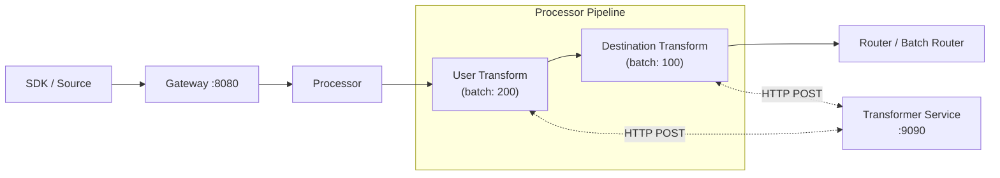
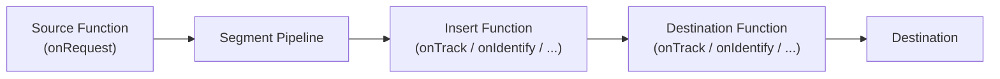

# Segment Functions Equivalent

This document compares RudderStack's transformation capabilities with [Segment Functions](https://segment.com/docs/connections/functions/) and provides a practical guide for teams evaluating or migrating between the two platforms. It documents the current state of RudderStack's transformation framework, identifies functional gaps relative to Segment Functions, and outlines remediation paths.

**Segment Functions** provides three function types — Source Functions, Destination Functions, and Insert Functions — powered by AWS Lambda, processing events individually via per-event handlers, and scoped to a workspace with no additional infrastructure required.

**RudderStack's equivalent** is a two-stage transformation framework within the Processor pipeline: **User Transforms** (default batch size 200) and **Destination Transforms** (default batch size 100), both executed via an external Transformer service (default: `http://localhost:9090`). RudderStack uses a centralized, batch-oriented Transformer service; Segment uses distributed Lambda functions with per-event handlers.

**Overall parity: ~40%.** RudderStack has robust transformation capability but lacks the self-contained Functions model that Segment provides. Key gaps include the absence of Source Functions, per-event typed handlers, and a function management API. RudderStack has notable advantages in Python runtime support, native batch processing, and transform mirroring for A/B testing.

For a detailed, feature-by-feature gap analysis, see the [Functions Parity Gap Report](../../gap-report/functions-parity.md).

> **Prerequisites:**
> - [Transformation Architecture Overview](./overview.md) — multi-layer transformation system and Transformer service architecture
> - [Pipeline Stages Architecture](../../architecture/pipeline-stages.md) — six-stage Processor pipeline with channel orchestration

---

## Table of Contents

- [Architecture Comparison](#architecture-comparison)
- [Segment Functions Overview](#segment-functions-overview)
- [RudderStack Transformation Capabilities](#rudderstack-transformation-capabilities)
- [Feature Comparison](#feature-comparison)
- [Transformer Service Configuration](#transformer-service-configuration)
- [Gap Analysis Summary](#gap-analysis-summary)
- [Migrating from Segment Functions](#migrating-from-segment-functions)
- [Related Documentation](#related-documentation)

---

## Architecture Comparison

RudderStack and Segment take fundamentally different architectural approaches to custom transformations. This section illustrates both pipelines and highlights the key trade-offs.

### RudderStack Transformation Pipeline

RudderStack's transformations are **pipeline stages within the Processor**, delegating execution to an external Transformer service over HTTP. Events flow through a six-stage pipeline; user-defined custom transforms execute at Stage 4, and destination-specific transforms execute at Stage 5.



> **Source:** `processor/pipeline_worker.go:18-73` (pipeline worker struct with 6 channels), `processor/internal/transformer/user_transformer/user_transformer.go:48` (`USER_TRANSFORM_URL` defaults to `http://localhost:9090`)

### Segment Functions Pipeline

Segment Functions are **standalone components alongside the pipeline**, powered by AWS Lambda. Each function type operates at a different point in the event lifecycle: Source Functions ingest external data, Insert Functions transform data pre-destination, and Destination Functions deliver data to external services.



> **Source:** `refs/segment-docs/src/connections/functions/index.md:5-13` (Functions overview and three function types)

### Key Architectural Differences

| Dimension | RudderStack Transforms | Segment Functions |
|-----------|----------------------|-------------------|
| **Processing model** | Batch-oriented (200/100 event batches) | Per-event handlers (`onTrack`, `onIdentify`, etc.) |
| **Runtime** | External Transformer service (Node.js + Python) | AWS Lambda (Node.js v18) |
| **Pipeline integration** | Pipeline stages within the Processor (Stages 4 & 5) | Standalone components alongside the pipeline |
| **Language support** | JavaScript **and** Python | JavaScript only |
| **Scoping** | Service-level configuration | Workspace-scoped with per-function settings |
| **Infrastructure** | Self-hosted Transformer service container | Managed (no infrastructure required) |
| **Function types** | User Transforms + Destination Transforms | Source Functions + Destination Functions + Insert Functions |

> **Source:** `processor/pipeline_worker.go:32-37` (channel initialization), `processor/internal/transformer/user_transformer/user_transformer.go:42-82` (user transformer configuration)

---

## Segment Functions Overview

Segment Functions provides three distinct function types, each serving a specific role in the event lifecycle. All functions are workspace-scoped, powered by AWS Lambda, and require no additional infrastructure.

### Source Functions

**Purpose:** Receive external data from webhooks and create Segment events or objects using custom JavaScript logic.

- **Handler:** `onRequest(request, settings)` — receives an HTTPS request object, returns events via Segment helpers (`Segment.identify()`, `Segment.track()`, `Segment.group()`, `Segment.page()`, `Segment.screen()`, `Segment.alias()`, `Segment.set()`)
- **Request processing:** Full HTTP request access — `request.json()`, `request.headers`, `request.url`
- **External API calls:** `fetch()` support for enrichment or annotation of incoming data
- **Limits:** 512 KiB maximum payload size, 5-second execution timeout
- **Use cases:** Ingest from unsupported sources, transform or validate incoming webhooks, enrich data via external APIs before event creation

> **Source:** `refs/segment-docs/src/connections/functions/source-functions.md:10-12` (capabilities), `refs/segment-docs/src/connections/functions/source-functions.md:35-42` (`onRequest()` handler definition)

### Destination Functions

**Purpose:** Transform events and send them to any external tool or API with custom delivery logic.

- **Event-specific handlers:** `onTrack(event, settings)`, `onIdentify(event, settings)`, `onGroup(event, settings)`, `onPage(event, settings)`, `onScreen(event, settings)`, `onAlias(event, settings)`, `onDelete(event, settings)`, `onBatch(events, settings)`
- **External delivery:** Full `fetch()` support (node-fetch polyfill) for sending data to external services
- **Batch support:** Optional `onBatch` handler with a 10-second / 20-event flush window (default), maximum 400 events per batch via support request
- **Error handling:** Retry and discard semantics — functions can throw typed errors to control event disposition
- **Use cases:** Send data to services unavailable in the catalog, transform data before downstream delivery, enrich outgoing data

> **Source:** `refs/segment-docs/src/connections/functions/destination-functions.md:9-11` (capabilities), `refs/segment-docs/src/connections/functions/destination-functions.md:44-52` (handler list)

### Insert Functions

**Purpose:** Transform data between source and destination as a pre-destination middleware hook.

- **Event-specific handlers:** Same as Destination Functions — `onTrack`, `onIdentify`, `onPage`, `onScreen`, `onGroup`, `onAlias`, `onDelete`, `onBatch`
- **Return semantics:** Handlers must `return event` to forward the (potentially modified) event to the downstream destination
- **Error types:** `EventNotSupported`, `InvalidEventPayload`, `ValidationError`, `RetryError`, `DropEvent`
- **Per-destination scoping:** Each insert function is connected to a specific destination
- **Single event return:** Unlike Source/Destination Functions, Insert Functions return exactly one event per invocation
- **Use cases:** PII redaction, data enrichment via Profile API or third-party sources, tokenization/encryption/decryption, advanced custom filtering with nested logic

> **Source:** `refs/segment-docs/src/connections/functions/insert-functions.md:6-13` (capabilities), `refs/segment-docs/src/connections/functions/insert-functions.md:68-78` (handler list), `refs/segment-docs/src/connections/functions/insert-functions.md:120-180` (error types)

### Function Type Comparison

| Function Type | Segment | RudderStack Equivalent | Parity |
|---------------|---------|------------------------|--------|
| Source Functions | ✅ `onRequest` handler creates events from webhooks | ❌ No equivalent — Gateway accepts pre-formatted events only | 0% |
| Destination Functions | ✅ Per-event typed handlers deliver to external APIs | ⚠️ Destination Transforms (batch-based, connector-tied) | 30% |
| Insert Functions | ✅ Pre-destination middleware with typed handlers | ⚠️ User Transforms (batch-based, not per-destination scoped) | 40% |

---

## RudderStack Transformation Capabilities

RudderStack's transformation framework consists of two primary transformation stages within the Processor pipeline, both executing via the external Transformer service. Additionally, RudderStack supports embedded (in-process) transforms for select high-volume destinations.

### User Transforms (≈ Insert Functions)

User Transforms are custom JavaScript or Python transformations applied to events **before** destination routing. They execute at **Stage 4** of the Processor's six-stage pipeline.

**Key characteristics:**

- **Batch size:** 200 events per batch (configurable via `Processor.UserTransformer.batchSize` or `Processor.userTransformBatchSize`)
- **Execution:** Events are sent as HTTP POST requests to the external Transformer service at `USER_TRANSFORM_URL` (default: `http://localhost:9090`)
- **Python support:** Available via `PYTHON_TRANSFORM_URL` (separate endpoint) with optional version ID filtering via `PYTHON_TRANSFORM_VERSION_IDS`
- **Retry:** Maximum 30 retries (configurable via `Processor.UserTransformer.maxRetry`) with exponential backoff, 30-second maximum backoff interval
- **Timeout:** 600 seconds per HTTP call (configurable via `HttpClient.procTransformer.timeout`)
- **Mirroring:** Supports transformation mirroring via `USER_TRANSFORM_MIRROR_URL` for A/B testing of transform logic against a separate Transformer instance
- **One-to-many mapping:** A single input event can produce zero, one, or multiple output events — batches are chunked and processed concurrently, then flattened into a single output stream

> **Source:** `processor/internal/transformer/user_transformer/user_transformer.go:42-82` (client constructor with all configuration), `processor/internal/transformer/user_transformer/user_transformer.go:107-196` (`Transform` method with batch chunking and concurrent processing)

**Example — JavaScript User Transform:**

```javascript
// Example User Transformation (JavaScript)
// Executed via the Transformer service for each batch of events
export function transformEvent(event, metadata) {
  // Enrich event with custom property
  event.properties = event.properties || {};
  event.properties.processed_at = new Date().toISOString();

  // PII redaction example
  if (event.context && event.context.traits) {
    delete event.context.traits.ssn;
    delete event.context.traits.credit_card;
  }

  // Event filtering — return null to drop the event
  if (event.event === 'internal_debug') {
    return null;
  }

  return event;
}
```

**Example — Python User Transform:**

```python
# Example User Transformation (Python)
# Executed via the Python Transformer service (PYTHON_TRANSFORM_URL)
from datetime import datetime, timezone

def transform_event(event, metadata):
    # Enrich event with custom property
    if 'properties' not in event:
        event['properties'] = {}
    event['properties']['processed_at'] = datetime.now(timezone.utc).isoformat()

    # Filter out internal events — return None to drop
    if event.get('event', '').startswith('internal_'):
        return None

    # PII redaction
    traits = event.get('context', {}).get('traits', {})
    traits.pop('ssn', None)
    traits.pop('credit_card', None)

    return event
```

### Destination Transforms (≈ Destination Functions)

Destination Transforms shape event payloads **per-destination** before delivery. They execute at **Stage 5** of the Processor pipeline.

**Key characteristics:**

- **Batch size:** 100 events per batch (configurable via `Processor.DestinationTransformer.batchSize` or `Processor.transformBatchSize`)
- **Execution:** Events are sent as HTTP POST requests to the external Transformer service at `DEST_TRANSFORM_URL` (default: `http://localhost:9090`). The destination type is appended to the URL to route to the correct transformer endpoint.
- **Embedded transforms:** Built-in, in-process support for Kafka, Google Pub/Sub, and Warehouse destinations — these bypass the external Transformer service for lower latency. Embedded transforms are implemented directly in Go within the `destination_transformer/embedded/` package.
- **Warehouse transforms:** Enable via `Processor.enableWarehouseTransformations` (default: `false`), verify via `Processor.verifyWarehouseTransformations` (default: `true`).
- **Compaction:** Supports compacted payloads via `X-Content-Format: json+compactedv1` when the Transformer feature service indicates support, reducing payload sizes for supported destination types.
- **Retry:** Maximum 30 retries (configurable via `Processor.DestinationTransformer.maxRetry`) with exponential backoff, 30-second maximum backoff interval.

> **Source:** `processor/internal/transformer/destination_transformer/destination_transformer.go:71-106` (client constructor with all configuration), `processor/internal/transformer/destination_transformer/destination_transformer.go:141-224` (`transform` method)

---

## Feature Comparison

The following matrix provides a comprehensive feature-by-feature comparison between Segment Functions and RudderStack's transformation framework.

| Feature | Segment Functions | RudderStack Transforms | Parity | Notes |
|---------|------------------|------------------------|--------|-------|
| Custom source ingestion | ✅ Source Functions (`onRequest`) | ❌ Not available | 0% | Gateway webhook endpoints provide partial coverage for pre-formatted events |
| Custom destination delivery | ✅ Destination Functions (typed handlers) | ⚠️ Destination transforms (batch) | 30% | No per-event typed handlers; transforms tied to existing connectors |
| Pre-destination middleware | ✅ Insert Functions | ⚠️ User transforms | 40% | Batch-based vs per-event; not per-destination scoped |
| JavaScript runtime | ✅ Node.js v18 (Lambda) | ✅ Via Transformer service | 80% | Similar capabilities; RudderStack runtime is self-hosted |
| Python runtime | ❌ Not available | ✅ Via Python Transformer URL | N/A | **RudderStack advantage** |
| Per-event typed handlers | ✅ `onTrack`, `onIdentify`, `onPage`, `onScreen`, `onGroup`, `onAlias`, `onDelete` | ❌ Batch processing only | 0% | All events processed uniformly in batches |
| Environment variables / secrets | ✅ Per-function env vars and secrets | ⚠️ Config-level only | 30% | No per-function secrets management |
| Function management API | ✅ Full CRUD API with UI editor | ❌ Not available | 0% | No programmatic function lifecycle management |
| Function versioning | ✅ Version history with save/deploy separation | ❌ Not available | 0% | No rollback capability |
| Real-time logging | ✅ In-console `console.log()` output | ⚠️ Transformer service logs | 20% | No per-function log granularity |
| Batch processing | ⚠️ Optional `onBatch` (10s / 20-event window) | ✅ Native (200 / 100 batch sizes) | N/A | **RudderStack advantage** — higher throughput for high-volume pipelines |
| External HTTP requests | ✅ `fetch()` within Lambda | ⚠️ Via Transformer capabilities | 30% | Depends on Transformer service implementation |
| Error handling classes | ✅ `EventNotSupported`, `RetryError`, `DropEvent`, `InvalidEventPayload`, `ValidationError` | ⚠️ Success / fail response | 30% | No typed error semantics for individual event disposition |
| Transform mirroring / A/B test | ❌ Not available | ✅ Mirror URLs for comparison | N/A | **RudderStack advantage** — `USER_TRANSFORM_MIRROR_URL` enables A/B testing |
| Embedded transforms | ❌ All external (Lambda) | ✅ Kafka, Pub/Sub, Warehouse in-process | N/A | **RudderStack advantage** — lower latency for high-volume destinations |
| Functions Copilot (AI-assisted) | ✅ AI-powered function generation | ❌ Not available | 0% | Low priority gap |

> **Source:** `processor/internal/transformer/user_transformer/user_transformer.go:67` — `batchSize = conf.GetReloadableIntVar(200, 1, "Processor.UserTransformer.batchSize", "Processor.userTransformBatchSize")`
> **Source:** `processor/internal/transformer/destination_transformer/destination_transformer.go:82` — `batchSize = conf.GetReloadableIntVar(100, 1, "Processor.DestinationTransformer.batchSize", "Processor.transformBatchSize")`
> **Source:** `refs/segment-docs/src/connections/functions/destination-functions.md:44-52` — event-specific handler list
> **Source:** `refs/segment-docs/src/connections/functions/insert-functions.md:68-78` — insert function handlers and error types

---

## Transformer Service Configuration

The following table lists all configuration parameters relevant to RudderStack's transformation framework. Parameters are set via `config/config.yaml` or environment variables.

| Parameter | Default | Type | Description |
|-----------|---------|------|-------------|
| `USER_TRANSFORM_URL` | `http://localhost:9090` | string | User transformation service URL. Falls back to `DEST_TRANSFORM_URL` if not set. |
| `PYTHON_TRANSFORM_URL` | _(empty)_ | string | Python transformation service URL. When set, Python transforms are routed to this endpoint. |
| `DEST_TRANSFORM_URL` | `http://localhost:9090` | string | Destination transformation service URL. |
| `USER_TRANSFORM_MIRROR_URL` | _(empty)_ | string | Mirror URL for user transform A/B testing. When set, events are also sent to this endpoint for comparison. |
| `PYTHON_TRANSFORM_MIRROR_URL` | _(empty)_ | string | Mirror URL for Python user transform A/B testing. |
| `Processor.UserTransformer.batchSize` | `200` | int | Number of events per user transform batch. Also configurable as `Processor.userTransformBatchSize`. |
| `Processor.DestinationTransformer.batchSize` | `100` | int | Number of events per destination transform batch. Also configurable as `Processor.transformBatchSize`. |
| `Processor.UserTransformer.maxRetry` | `30` | int | Maximum retry attempts for user transform HTTP calls. Also configurable as `Processor.maxRetry`. |
| `Processor.DestinationTransformer.maxRetry` | `30` | int | Maximum retry attempts for destination transform HTTP calls. Also configurable as `Processor.maxRetry`. |
| `Processor.UserTransformer.failOnError` | `false` | bool | When `true`, pipeline fails on any user transform error. Also configurable as `Processor.Transformer.failOnError`. |
| `Processor.DestinationTransformer.failOnError` | `false` | bool | When `true`, pipeline fails on any destination transform error. Also configurable as `Processor.Transformer.failOnError`. |
| `Processor.UserTransformer.maxRetryBackoffInterval` | `30s` | duration | Maximum backoff interval between user transform retries. Also configurable as `Processor.maxRetryBackoffInterval`. |
| `Processor.DestinationTransformer.maxRetryBackoffInterval` | `30s` | duration | Maximum backoff interval between destination transform retries. Also configurable as `Processor.maxRetryBackoffInterval`. |
| `Processor.UserTransformer.failOnUserTransformTimeout` | `false` | bool | When `true`, treat user transform timeouts as pipeline failures. Also configurable as `Processor.Transformer.failOnUserTransformTimeout`. |
| `Processor.UserTransformer.cpDownEndlessRetries` | `true` | bool | Enable endless retries when the control plane connection is down during user transforms. |
| `HttpClient.procTransformer.timeout` | `600s` | duration | HTTP client timeout for all transformer service calls (user transforms and destination transforms). |
| `Processor.enableWarehouseTransformations` | `false` | bool | Enable embedded (in-process) warehouse transforms instead of routing through the external Transformer service. |
| `Processor.verifyWarehouseTransformations` | `true` | bool | When warehouse transforms are enabled, verify embedded transform results against external Transformer results. |

> **Source:** `processor/internal/transformer/user_transformer/user_transformer.go:48-67` (user transformer configuration parameters)
> **Source:** `processor/internal/transformer/destination_transformer/destination_transformer.go:77-99` (destination transformer configuration parameters)

For the complete configuration reference including all 200+ parameters, see [Configuration Reference](../../reference/config-reference.md).

---

## Gap Analysis Summary

The following table summarizes the key functional gaps between RudderStack's transformation framework and Segment Functions. Gap IDs are consistent with the [Functions Parity Gap Report](../../gap-report/functions-parity.md).

| Gap ID | Description | Severity | Remediation Path |
|--------|-------------|----------|------------------|
| **FN-001** | No Source Functions runtime — cannot receive webhooks and create events via custom logic | **High** | Implement a Lambda-compatible source function execution engine with `onRequest()` handler, event creation API, and external `fetch()` capability |
| **FN-002** | No self-contained Destination Functions — no standalone custom destination delivery logic | **High** | Implement per-event destination function execution with typed handlers (`onTrack`, `onIdentify`, `onGroup`, `onPage`, `onScreen`, `onAlias`, `onDelete`, `onBatch`) |
| **FN-003** | No Insert Functions (middleware pattern) — no per-destination, pre-delivery hooks | **Medium** | Extend user transform pipeline with per-destination scoped insert hooks supporting typed event handlers and return-event semantics |
| **FN-004** | No Function management API (CRUD) — no programmatic function lifecycle | **High** | Implement Functions REST API for creating, reading, updating, deleting, and listing functions with workspace scoping |
| **FN-005** | No per-event typed handlers (`onTrack`, `onIdentify`, etc.) — batch-only processing | **Medium** | Add event-type routing within the function execution runtime to dispatch events to type-specific handlers |
| **FN-006** | Limited environment variable / secret management — config-level only | **Medium** | Implement per-function settings and secrets management with scoped handler-level access |

### RudderStack Advantages

While the overall gap assessment favors Segment in the Functions category, RudderStack's transformation framework provides several notable advantages:

1. **Python runtime support** — RudderStack supports Python transforms in addition to JavaScript via `PYTHON_TRANSFORM_URL`. Segment Functions supports JavaScript only. This is a significant advantage for data engineering teams that prefer Python for data manipulation.

2. **Native batch processing** — RudderStack processes transforms in configurable batches (200 events for user transforms, 100 for destination transforms), providing higher throughput for high-volume pipelines. Segment's `onBatch` handler is optional and not universally supported.

3. **Transform mirroring for A/B testing** — The `USER_TRANSFORM_MIRROR_URL` configuration enables sending events to a parallel Transformer instance for comparison, enabling safe testing of transformation changes without affecting production traffic.

4. **Embedded transforms for high-volume destinations** — Kafka, Google Pub/Sub, and Warehouse destinations support in-process transforms that bypass the external Transformer service, reducing latency for the highest-volume data streams.

5. **Self-hosted Transformer service** — The Transformer runs in the customer's own infrastructure (`rudderstack/rudder-transformer:latest`), providing full data residency control, custom extensibility, and no vendor lock-in.

For the full gap analysis with all 12 identified gaps (FN-001 through FN-012), severity ratings, and implementation effort estimates, see the [Functions Parity Gap Report](../../gap-report/functions-parity.md).

---

## Migrating from Segment Functions

This section provides guidance for teams migrating from Segment Functions to RudderStack's transformation framework. Each Segment Function type requires a different migration approach due to architectural differences.

### Source Functions Migration

**Current status:** No direct RudderStack equivalent exists for Segment Source Functions.

**Interim workaround:**

1. Deploy a lightweight HTTP service (e.g., a Node.js or Python web server) that receives webhooks from external systems.
2. In the service, parse the incoming request and transform it into RudderStack-compatible event payloads conforming to the [Segment Spec](../../api-reference/event-spec/common-fields.md).
3. Forward the transformed events to the RudderStack Gateway HTTP API (`POST http://<gateway>:8080/v1/track`, `/v1/identify`, etc.) with the appropriate Write Key for authentication.
4. Optionally apply User Transforms at Stage 4 for additional enrichment or filtering.

**Limitations:** This approach requires additional infrastructure management — the core benefit of Segment Source Functions (no infrastructure) is not preserved. Gap closure for FN-001 is tracked in the [Sprint Roadmap](../../gap-report/sprint-roadmap.md).

### Destination Functions Migration

**Migration approach:** Map Segment Destination Function logic into RudderStack User Transforms.

**Step-by-step:**

1. **Identify handler logic:** Extract the business logic from each Segment event handler (`onTrack`, `onIdentify`, etc.).
2. **Consolidate into a single transform:** Since RudderStack processes all event types in a single batch transform function, consolidate the per-event-type logic using conditional branching:

```javascript
// Migrated Segment Destination Function → RudderStack User Transform
export function transformEvent(event, metadata) {
  const eventType = event.type;

  switch (eventType) {
    case 'track':
      // Logic from Segment's onTrack handler
      event.properties = event.properties || {};
      event.properties.enriched = true;
      break;

    case 'identify':
      // Logic from Segment's onIdentify handler
      if (!event.context.traits.email) {
        return null; // Drop event (equivalent to DropEvent in Segment)
      }
      break;

    case 'page':
      // Logic from Segment's onPage handler
      break;

    default:
      // Handle other event types or pass through
      break;
  }

  return event;
}
```

3. **Convert error handling:** Replace Segment's typed error classes with RudderStack transform patterns:
   - `throw new EventNotSupported(...)` → Return `null` to drop unsupported events
   - `throw new DropEvent(...)` → Return `null` to drop filtered events
   - `throw new RetryError(...)` → Allow the transform to fail, triggering the Transformer service's built-in retry logic (up to 30 retries with exponential backoff)
   - `throw new InvalidEventPayload(...)` → Return `null` or modify the event to add a validation error flag

4. **Migrate external API calls:** If the Segment function used `fetch()` for external API calls, implement equivalent logic within the RudderStack Transformer service's capabilities or pre-enrich data upstream.

### Insert Functions Migration

**Migration approach:** Map Segment Insert Function logic into RudderStack User Transforms (closest equivalent).

**Key adjustments:**

1. **Batch processing adaptation:** Segment Insert Functions process one event at a time. RudderStack User Transforms receive batches of 200 events. The `transformEvent` function is called per-event within the batch, so per-event logic translates directly — the batch size is transparent to the transform code.

2. **Per-destination scoping loss:** Segment Insert Functions are scoped to a specific destination. RudderStack User Transforms apply globally to all events before routing. To replicate per-destination behavior, add destination-aware conditional logic:

```javascript
// Simulating per-destination scoping in a RudderStack User Transform
export function transformEvent(event, metadata) {
  // Check the destination configuration to apply destination-specific logic
  const destType = metadata.destinationType;

  if (destType === 'AMPLITUDE') {
    // Insert function logic specific to Amplitude
    event.properties.amplitude_session_id = generateSessionId(event);
  }

  if (destType === 'MIXPANEL') {
    // Insert function logic specific to Mixpanel
    event.properties.distinct_id = event.userId || event.anonymousId;
  }

  return event;
}
```

3. **Error handling conversion:**
   - `throw new EventNotSupported('...')` → Return `null` to filter unsupported event types
   - `throw new DropEvent('...')` → Return `null` to prevent downstream delivery
   - `throw new RetryError('...')` → Allow the transform to fail for retry
   - `throw new InvalidEventPayload('...')` → Return `null` or add error metadata to the event

4. **Return semantics:** Segment Insert Functions return exactly one event; returning `event` forwards it, not returning drops it. RudderStack User Transforms follow the same pattern — `return event` to forward, `return null` to drop.

---

## Related Documentation

- [Transformation Architecture Overview](./overview.md) — Multi-layer transformation architecture, Transformer service details, and transformation lifecycle
- [User Transforms Developer Guide](./user-transforms.md) — JavaScript and Python custom transformation development guide
- [Destination Transforms Reference](./destination-transforms.md) — Destination-specific payload transformation reference
- [Pipeline Stages Architecture](../../architecture/pipeline-stages.md) — Six-stage Processor pipeline with channel orchestration and stage-by-stage documentation
- [Functions Parity Gap Report](../../gap-report/functions-parity.md) — Detailed feature-by-feature gap analysis with all 12 gaps (FN-001 through FN-012), severity ratings, and remediation architecture
- [Configuration Reference](../../reference/config-reference.md) — Complete reference for all 200+ configuration parameters including Processor and Transformer settings
