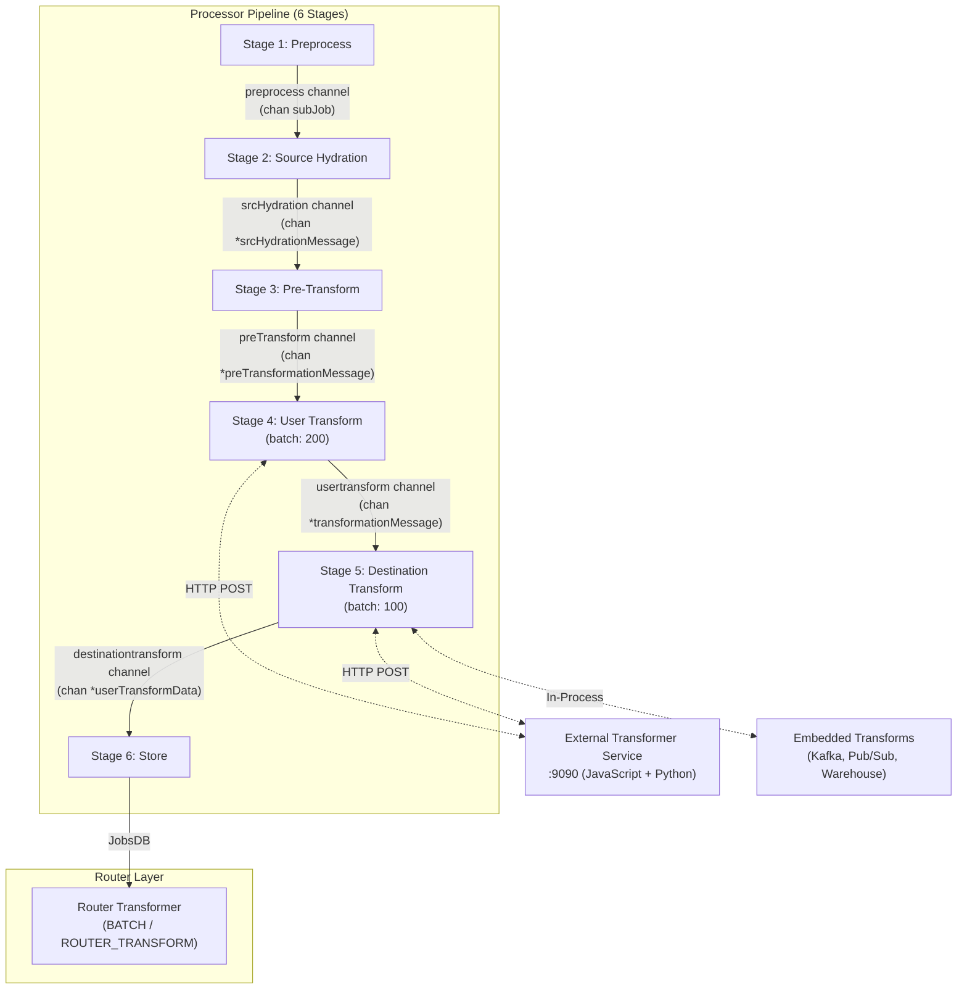
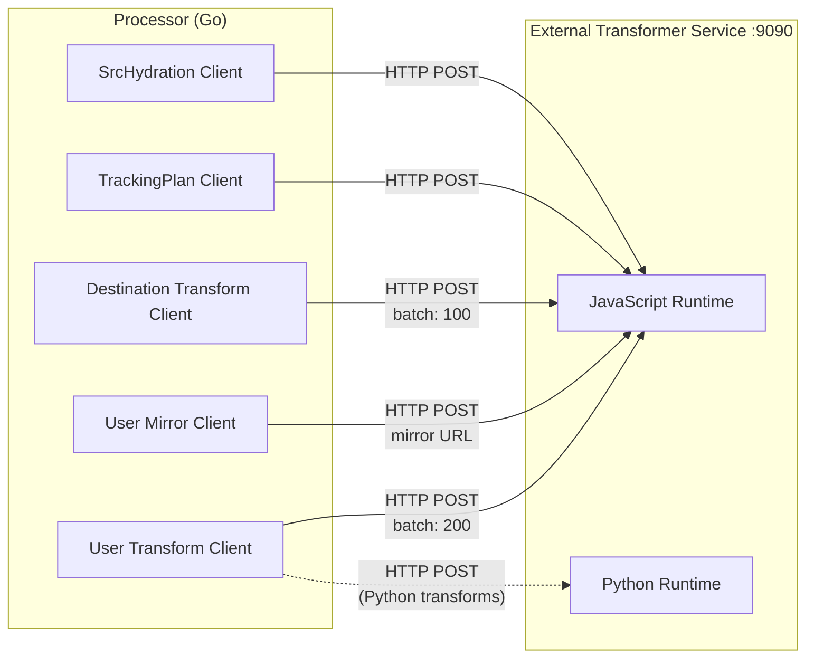

# Transformation System Overview

RudderStack's transformation system is a multi-layer architecture that modifies, enriches, and shapes events at multiple points in the data pipeline before they reach their final destinations. The system is designed around three distinct transformation layers operating at different pipeline stages, unified by a shared external Transformer service.

**Transformation layers:**

1. **Processor-level transformations** — User-defined custom transforms (JavaScript/Python) and destination-specific payload shaping, executed within the Processor's six-stage pipeline as Stages 4 and 5.
2. **Router-level transformations** — Additional transforms for batch optimization, compaction, and OAuth-integrated delivery at the Router layer.
3. **Embedded transformations** — In-process transforms for high-volume destinations (Kafka, Google Pub/Sub, Warehouse) that bypass the external Transformer service for lower latency.

All external transformations are executed via the **Transformer service**, a separate containerized process running on port 9090 (configurable). The Processor communicates with this service over HTTP POST requests, sending events in configurable batch sizes. The transformation system supports both **JavaScript** and **Python** custom transform runtimes.

> **Source:** `processor/pipeline_worker.go:1-236`, `processor/transformer/clients.go:1-89`, `router/transformer/transformer.go:1-135`

**Prerequisites:**
- [Pipeline Stages Architecture](../../architecture/pipeline-stages.md) — detailed six-stage pipeline documentation
- [End-to-End Data Flow](../../architecture/data-flow.md) — complete event lifecycle from SDK to warehouse

---

## Table of Contents

- [Pipeline Architecture](#pipeline-architecture)
  - [Transformation-Relevant Stages](#transformation-relevant-stages)
- [Transformer Service](#transformer-service)
- [TransformerClients Interface](#transformerclients-interface)
- [Transformation Types](#transformation-types)
- [Key Configuration](#key-configuration)
- [Transformation Lifecycle](#transformation-lifecycle)
- [Related Documentation](#related-documentation)

---

## Pipeline Architecture

The Processor executes a six-stage pipeline for every event batch. Each stage runs as an independent goroutine within a `pipelineWorker`, connected to adjacent stages by typed, buffered Go channels. This design enables concurrent processing across stages with natural backpressure — a slow transformation stage does not block upstream processing (up to buffer capacity), and a slow database write does not block downstream transformations.

The transformation system primarily operates within Stages 2 through 5, with an additional transformation layer at the Router after events are persisted to JobsDB.



> **Source:** `processor/pipeline_worker.go:18-73` (struct definition with 6 channels), `processor/pipeline_worker.go:76-230` (`start()` method launching 6 goroutines)

### Transformation-Relevant Stages

Each of the six pipeline stages is defined as a method on the `workerHandle` interface. The following stages are directly relevant to the transformation system:

**Stage 2 — Source Hydration**

Enriches events with source-level context from the backend configuration. This stage is **not user-configurable** — it automatically hydrates events with source metadata (source ID, source type, workspace settings) using the `SrcHydration` client. The SrcHydration client communicates with the external Transformer service to apply source-level enrichment logic.

> **Source:** `processor/pipeline_worker.go:116-136` (src hydration goroutine), `processor/partition_worker_handle.go:25` (`srcHydrationStage` method)

**Stage 3 — Pre-Transform**

Performs event filtering, deduplication, consent checks (OneTrust, Ketch, Generic CMP), and **tracking plan validation** before events enter the transformation pipeline. This stage uses the `TrackingPlan` client to validate events against configured tracking plan schemas via the external Transformer service. Events that fail validation are either dropped or marked with violations depending on the tracking plan configuration.

> **Source:** `processor/pipeline_worker.go:138-158` (pre-transform goroutine), `processor/partition_worker_handle.go:26` (`pretransformStage` method)

**Stage 4 — User Transform**

Executes **user-defined custom transformations** written in JavaScript or Python. Events are batched (default batch size: **200**, configurable via `Processor.UserTransformer.batchSize`) and sent to the external Transformer service via HTTP POST. The User Transform client supports two modes:

- **Standard mode** — Applies the configured user transformation to events.
- **Mirror mode** — Sends events to a separate mirror Transformer URL for A/B testing of transformation logic. Mirror mode is enabled via `ForMirroring()` option and uses separate `USER_TRANSFORM_MIRROR_URL` and `PYTHON_TRANSFORM_MIRROR_URL` endpoints.

User transforms support one-to-many event mapping — a single input event can produce zero, one, or multiple output events. Events are chunked into batches using `lo.Chunk()`, and each batch is processed concurrently via goroutines. The response for each batch is flattened into a single output stream, with events routed to either the success or failure path based on the HTTP status code (200 = success, all others = failure).

> **Source:** `processor/pipeline_worker.go:160-173` (user transform goroutine), `processor/internal/transformer/user_transformer/user_transformer.go:42-82` (client configuration), `processor/internal/transformer/user_transformer/user_transformer.go:107-196` (`Transform` method)

**Stage 5 — Destination Transform**

Shapes event payloads per-destination before they are stored to JobsDB for routing. Events are batched (default batch size: **100**, configurable via `Processor.DestinationTransformer.batchSize`) and sent to the external Transformer service. This stage supports three execution modes:

- **External transforms** — Standard HTTP-based transformation via the Transformer service for most destinations. The destination type is appended to the base URL to route to the correct transformer endpoint.
- **Embedded transforms** — In-process transformations for high-volume destinations (Kafka, Google Pub/Sub, Warehouse) that bypass the external service for lower latency. These are implemented directly in Go within the `destination_transformer/embedded/` package.
- **Warehouse transforms** — Toggleable via `Processor.enableWarehouseTransformations` (default: `false`). When enabled, warehouse events are processed by an embedded warehouse transform client instead of the external Transformer service.

The Destination Transform client also supports **compaction** (feature-gated via the Transformer features service), which reduces payload sizes for supported destination types by using a compacted JSON format (`X-Content-Format: json+compactedv1`).

> **Source:** `processor/pipeline_worker.go:175-188` (destination transform goroutine), `processor/internal/transformer/destination_transformer/destination_transformer.go:71-106` (client configuration), `processor/internal/transformer/destination_transformer/destination_transformer.go:141-224` (`transform` method)

**Router Transformer**

After events are persisted to JobsDB by Stage 6, the Router applies an additional transformation layer during delivery. The Router Transformer operates with two transform types:

- **`BATCH`** — Combines multiple events destined for the same endpoint into a single batch payload. The batch URL is resolved via `getBatchURL()`.
- **`ROUTER_TRANSFORM`** — Applies router-level transformation logic for destinations that require custom routing behavior. The transform URL is resolved via `getRouterTransformURL()`.

The Router Transformer integrates with **OAuth v2** for authenticated destination delivery, using `OAuthTransport` to transparently augment requests with access tokens. It also supports **compaction and dehydration** — separating large event payloads from metadata to reduce memory pressure during transformation.

> **Source:** `router/transformer/transformer.go:44-48` (BATCH and ROUTER_TRANSFORM constants), `router/transformer/transformer.go:112-135` (`Transformer` interface and `NewTransformer` constructor), `router/transformer/transformer.go:168-250` (`Transform` method)

---

## Transformer Service

The Transformer service is a **separate containerized process** that serves as the execution runtime for all external transformations. It is deployed as a Docker service alongside the main `rudder-server` process and handles both user-defined custom transforms and destination-specific payload shaping.

**Key characteristics:**

| Property | Value |
|----------|-------|
| Default URL | `http://localhost:9090` |
| Docker image | `rudderstack/rudder-transformer:latest` |
| Protocol | HTTP POST with JSON payloads |
| JavaScript runtime | Built-in |
| Python runtime | Optional (separate service at `PYTHON_TRANSFORM_URL`) |
| Timeout | 600 seconds (configurable via `HttpClient.procTransformer.timeout`) |
| Retry policy | Up to 30 retries with exponential backoff (30s max interval) |

The Processor communicates with the Transformer service through four specialized clients, each targeting different transformation endpoints:



**URL resolution:**

- **Destination transforms:** `DEST_TRANSFORM_URL` environment variable (default: `http://localhost:9090`). The destination type is appended as a path segment (e.g., `/v0/destinations/google_analytics`).
- **User transforms:** `USER_TRANSFORM_URL` environment variable. Falls back to `DEST_TRANSFORM_URL` if not set.
- **Python transforms:** `PYTHON_TRANSFORM_URL` environment variable. Empty by default (Python transforms disabled unless explicitly configured).
- **Mirror transforms:** `USER_TRANSFORM_MIRROR_URL` and `PYTHON_TRANSFORM_MIRROR_URL` for A/B testing mode.

> **Source:** `processor/internal/transformer/user_transformer/user_transformer.go:48-49` (URL configuration), `processor/internal/transformer/destination_transformer/destination_transformer.go:77` (destination URL), `docker-compose.yml` (Transformer service deployment)

---

## TransformerClients Interface

The `TransformerClients` interface provides a unified access point for all five transformation clients used by the Processor. It is defined in the `processor/transformer` package and implemented by the `Clients` struct.

```go
// TransformerClients provides access to all transformation clients.
// Source: processor/transformer/clients.go:44-50
type TransformerClients interface {
    User() UserClient
    UserMirror() UserClient
    Destination() DestinationClient
    TrackingPlan() TrackingPlanClient
    SrcHydration() SrcHydrationClient
}
```

Each client type is defined as a separate interface with a specific contract:

```go
// Client interfaces for each transformation type.
// Source: processor/transformer/clients.go:20-34
type DestinationClient interface {
    Transform(ctx context.Context, events []types.TransformerEvent) types.Response
}

type UserClient interface {
    Transform(ctx context.Context, events []types.TransformerEvent) types.Response
}

type TrackingPlanClient interface {
    Validate(ctx context.Context, events []types.TransformerEvent) types.Response
}

type SrcHydrationClient interface {
    Hydrate(ctx context.Context, req types.SrcHydrationRequest) (types.SrcHydrationResponse, error)
}
```

### Client Summary

| Client | Interface | Purpose | Batch Size | Config Key |
|--------|-----------|---------|------------|------------|
| User | `UserClient` | Custom user-defined transforms (JavaScript/Python) | 200 | `Processor.UserTransformer.batchSize` |
| UserMirror | `UserClient` | A/B testing transforms (mirror mode with separate URLs) | 200 | Same as User |
| Destination | `DestinationClient` | Per-destination payload shaping | 100 | `Processor.DestinationTransformer.batchSize` |
| TrackingPlan | `TrackingPlanClient` | Tracking plan schema validation | — | — |
| SrcHydration | `SrcHydrationClient` | Source context enrichment | — | — |

All five clients are created by the `NewClients()` constructor function and injected into the Processor's `LifecycleManager` during startup:

```go
// NewClients creates all transformation clients.
// Source: processor/transformer/clients.go:60-72
func NewClients(conf *config.Config, log logger.Logger, statsFactory stats.Stats,
    options ...func(*opts)) TransformerClients {
    return &Clients{
        user:         user_transformer.New(conf, log, statsFactory),
        userMirror:   user_transformer.New(conf, log, statsFactory, user_transformer.ForMirroring()),
        destination:  destination_transformer.New(conf, log, statsFactory, opts.destinationOpts...),
        trackingplan: trackingplan_validation.New(conf, log, statsFactory),
        srcHydration: sourcehydration.New(conf, log, statsFactory),
    }
}
```

The `LifecycleManager` in `processor/manager.go` wires the `TransformerClients` into the Processor's `Handle` via `Handle.Setup()`. The `New()` factory function (line 109) creates the `LifecycleManager` with all dependencies including the transformer clients, which are constructed by calling `transformer.NewClients()` with the application's config, logger, and stats instances.

> **Source:** `processor/transformer/clients.go:36-89`, `processor/manager.go:27-50` (LifecycleManager struct), `processor/manager.go:109-158` (`New` factory function)

---

## Transformation Types

The following table provides a comprehensive summary of all transformation types in the RudderStack pipeline, their execution context, and configuration:

| Transform Type | Stage | Batch Size | Runtime | Custom Code | Purpose |
|----------------|-------|------------|---------|-------------|---------|
| Source Hydration | Stage 2 | — | External (Transformer) | No | Automatically enrich events with source-level context from backend config |
| TrackingPlan Validation | Stage 3 | — | External (Transformer) | No | Validate events against tracking plan schemas; flag or drop violations |
| User Transforms | Stage 4 | 200 | External (JS/Python) | **Yes** | Custom event modification, filtering, enrichment via user-defined code |
| Destination Transforms | Stage 5 | 100 | External or Embedded | No (config-driven) | Per-destination payload shaping and field mapping |
| Embedded Transforms | Stage 5 | — | In-process (Go) | No | High-performance transforms for Kafka, Pub/Sub, Warehouse |
| Router Transforms | Router | — | External (Transformer) | No | Batch optimization, compaction, and OAuth-integrated delivery |

### Detailed Descriptions

- **Source Hydration** — Enriches raw events with source-level metadata (source configuration, workspace settings) from the backend config. Not user-configurable; runs automatically for all events.

- **TrackingPlan Validation** — Validates event payloads against user-configured tracking plan schemas. Events that fail validation are either dropped or annotated with violation metadata depending on the tracking plan enforcement mode. See [Tracking Plans Guide](../governance/tracking-plans.md) for configuration details.

- **User Transforms** — The primary extension point for custom event processing logic. Users write JavaScript or Python functions that receive event batches and can modify, filter, split, or enrich events before destination-specific processing. Supports one-to-many mapping. See [User Transforms Developer Guide](./user-transforms.md) for writing custom transforms.

- **Destination Transforms** — Applies destination-specific payload shaping and field mapping. These transforms convert the normalized RudderStack event format into the format expected by each destination (e.g., mapping `properties` to Google Analytics parameters, converting `traits` to Salesforce fields). See [Destination Transforms Reference](./destination-transforms.md) for per-destination details.

- **Embedded Transforms** — In-process Go implementations for high-volume streaming destinations. These bypass the external Transformer service entirely for lower latency and higher throughput. Currently implemented for Kafka (`embedded/kafka`), Google Pub/Sub (`embedded/pubsub`), and Warehouse (`embedded/warehouse`).

- **Router Transforms** — Applied at the Router layer after events are stored to JobsDB. Supports two modes: `BATCH` (combining events into batch payloads) and `ROUTER_TRANSFORM` (custom routing transformations). Integrates with OAuth v2 for authenticated delivery. See the [Segment Functions Equivalent](./functions.md) for comparison with Segment's transformation model.

---

## Key Configuration

The following table lists the most important configuration parameters for the transformation system. All parameters can be set via `config/config.yaml` or overridden via environment variables using the `RSERVER_` prefix convention.

| Parameter | Default | Type | Description |
|-----------|---------|------|-------------|
| `DEST_TRANSFORM_URL` | `http://localhost:9090` | `string` | Primary Transformer service URL for destination transforms |
| `USER_TRANSFORM_URL` | (falls back to `DEST_TRANSFORM_URL`) | `string` | User transform service URL; defaults to destination transform URL if unset |
| `PYTHON_TRANSFORM_URL` | (empty — disabled) | `string` | Python transform service URL; empty disables Python runtime |
| `USER_TRANSFORM_MIRROR_URL` | (empty — disabled) | `string` | Mirror URL for A/B testing of user transforms |
| `PYTHON_TRANSFORM_MIRROR_URL` | (empty — disabled) | `string` | Mirror URL for A/B testing of Python transforms |
| `Processor.UserTransformer.batchSize` | `200` | `int` | Number of events per batch sent to user transform service |
| `Processor.DestinationTransformer.batchSize` | `100` | `int` | Number of events per batch sent to destination transform service |
| `Processor.enableWarehouseTransformations` | `false` | `bool` | Enable embedded warehouse transforms (bypasses external Transformer) |
| `Processor.verifyWarehouseTransformations` | `true` | `bool` | Compare embedded warehouse transforms against external Transformer output |
| `HttpClient.procTransformer.timeout` | `600s` | `duration` | HTTP client timeout for Transformer service requests |
| `Processor.UserTransformer.maxRetry` | `30` | `int` | Maximum retry attempts for failed user transform requests |
| `Processor.DestinationTransformer.maxRetry` | `30` | `int` | Maximum retry attempts for failed destination transform requests |
| `Processor.UserTransformer.maxRetryBackoffInterval` | `30s` | `duration` | Maximum backoff interval between retries for user transforms |
| `Processor.DestinationTransformer.maxRetryBackoffInterval` | `30s` | `duration` | Maximum backoff interval between retries for destination transforms |
| `Processor.UserTransformer.failOnError` | `false` | `bool` | Panic on unrecoverable user transform errors (instead of marking as failed) |
| `Processor.UserTransformer.failOnUserTransformTimeout` | `false` | `bool` | Treat user transform timeouts as fatal errors |

> **Source:** `processor/internal/transformer/user_transformer/user_transformer.go:48-67` (user transform config), `processor/internal/transformer/destination_transformer/destination_transformer.go:77-99` (destination transform config)
>
> For the complete configuration reference, see [Configuration Reference](../../reference/config-reference.md).

---

## Transformation Lifecycle

The following diagram shows the complete lifecycle of an event as it flows through the transformation system, from initial ingestion through final delivery:

```mermaid
flowchart LR
    E["Event Received"] --> GW["Gateway<br/>:8080"]
    GW --> PP["1. Preprocess<br/>(validation, batching)"]
    PP --> SH["2. Source Hydration<br/>(source context enrichment)"]
    SH --> PT["3. Pre-Transform<br/>(consent, tracking plan,<br/>event filtering)"]
    PT --> UT["4. User Transform<br/>(custom JS/Python,<br/>batch: 200)"]
    UT --> DT["5. Dest Transform<br/>(per-destination shaping,<br/>batch: 100)"]
    DT --> ST["6. Store<br/>(persist to JobsDB)"]
    ST --> RT["Router Transform<br/>(batch optimization,<br/>OAuth delivery)"]
    RT --> DEL["Delivery to<br/>Destination"]
```



### Step-by-Step Walkthrough

1. **Ingestion** — The event is received by the Gateway on port 8080 via HTTP POST (e.g., `/v1/track`, `/v1/identify`). The Gateway validates the request, authenticates the write key, deduplicates the event, and writes it to the Gateway JobsDB.

2. **Preprocessing (Stage 1)** — The Processor reads pending jobs from the Gateway JobsDB. The `preprocessStage()` method performs initial event deserialization, metadata extraction, and sub-job creation for pipeline processing.

3. **Source Hydration (Stage 2)** — The `srcHydrationStage()` enriches events with source-level context from the backend configuration using the `SrcHydration` client. This adds source metadata, workspace settings, and destination configurations to each event.

4. **Pre-Transform (Stage 3)** — The `pretransformStage()` applies consent filtering (OneTrust, Ketch, Generic CMP), tracking plan validation via the `TrackingPlan` client, event filtering rules, and deduplication checks. Events that fail consent or tracking plan checks are routed to the error path.

5. **User Transform (Stage 4)** — Events are batched in groups of 200 (configurable) and sent to the external Transformer service via the `User` client. Custom JavaScript or Python transformation code executes on the Transformer service, and transformed events are returned. Supports one-to-many mapping — a single event can produce multiple output events.

6. **Destination Transform (Stage 5)** — Events are batched in groups of 100 (configurable) and shaped per-destination. For most destinations, this is handled by the external Transformer service via the `Destination` client. For Kafka, Pub/Sub, and Warehouse, embedded in-process transforms execute directly in Go for lower latency.

7. **Store (Stage 6)** — Transformed events are persisted to the Router JobsDB (for real-time destinations) and Batch Router JobsDB (for batch/warehouse destinations). Sub-job merging occurs at this stage for multi-fragment batches.

8. **Router Transform** — The Router reads jobs from the Router JobsDB and applies final transformations for batch optimization (`BATCH` type) or custom routing logic (`ROUTER_TRANSFORM` type). OAuth v2 tokens are transparently injected for authenticated destination delivery.

9. **Delivery** — Events are delivered to their final destination via the Router's HTTP delivery pipeline, with retry logic, throttling, and ordering guarantees.

---

## Related Documentation

### Transformation Guides
- [User Transforms Developer Guide](./user-transforms.md) — Write custom JavaScript and Python event transformations
- [Destination Transforms Reference](./destination-transforms.md) — Per-destination payload shaping and field mapping
- [Segment Functions Equivalent](./functions.md) — Comparison with Segment Functions, gap analysis, and migration guidance

### Architecture References
- [Pipeline Stages Architecture](../../architecture/pipeline-stages.md) — Detailed six-stage Processor pipeline with channel orchestration diagrams
- [End-to-End Data Flow](../../architecture/data-flow.md) — Complete event lifecycle from SDK ingestion to warehouse loading

### Gap Analysis
- [Functions Parity Gap Report](../../gap-report/functions-parity.md) — Transformation/Functions gap analysis comparing RudderStack transforms vs Segment Functions

### Configuration
- [Configuration Reference](../../reference/config-reference.md) — All 200+ configuration parameters including Processor and Transformer settings
