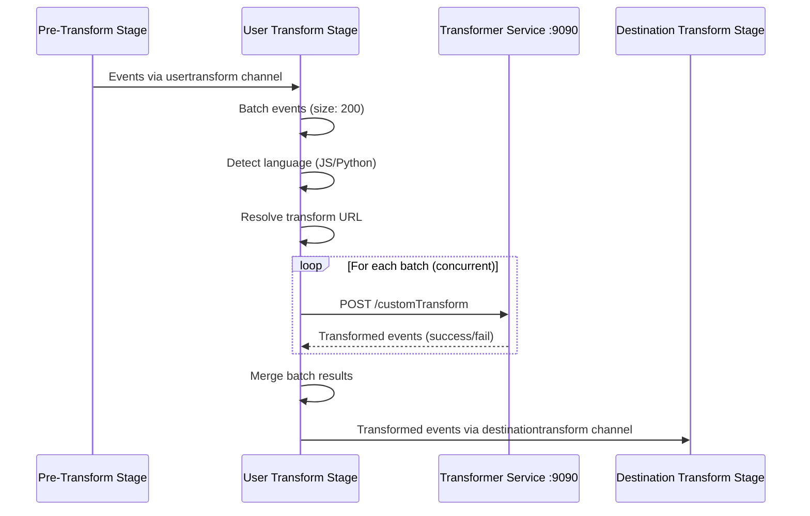

# User Transforms

User transforms allow you to write custom **JavaScript** or **Python** functions that modify, enrich, filter, or route events before they reach destination-specific transformations. They are the primary extension point for injecting custom business logic into the RudderStack event pipeline.

**Key characteristics:**

- **Pipeline position:** Stage 4 of the six-stage Processor pipeline — after the pre-transform stage (tracking plan validation, consent checks, event filtering), before the destination transform stage.
- **Execution model:** Events are sent over HTTP POST to the external **Transformer service** (default: `http://localhost:9090`) which executes user-defined functions in an isolated runtime.
- **Batch processing:** Events are grouped into batches of **200** (configurable via `Processor.UserTransformer.batchSize`) and batches are processed concurrently.
- **Language support:** JavaScript (primary, always available) and Python (optional, requires a separate Python Transformer service at `PYTHON_TRANSFORM_URL`).
- **One-to-many mapping:** A single input event can produce zero, one, or multiple output events. Returning `null` drops the event entirely.

**Common use cases:**

- **PII redaction** — Strip or mask sensitive fields (email, SSN, credit card) before events reach destinations.
- **Event enrichment** — Add computed properties, timestamps, or external lookup data.
- **Event filtering** — Drop internal test events, bot traffic, or events from blocked sources.
- **Data normalization** — Standardize event names, property types, and naming conventions.
- **Custom routing** — Change event types (e.g., convert `page` to `track`) to alter downstream routing behavior.

> **Source:** `processor/internal/transformer/user_transformer/user_transformer.go:42-82` (client configuration), `processor/pipeline_worker.go:160-173` (Stage 4 goroutine)

**Prerequisites:**
- [Transformation Architecture Overview](./overview.md) — multi-layer transformation system context
- [Pipeline Stages Architecture](../../architecture/pipeline-stages.md) — six-stage pipeline details

---

## Table of Contents

- [How User Transforms Work](#how-user-transforms-work)
  - [Execution Flow](#execution-flow)
  - [Post-Transform Processing](#post-transform-processing)
- [Writing JavaScript Transforms](#writing-javascript-transforms)
  - [Basic Event Enrichment](#basic-event-enrichment)
  - [PII Redaction](#pii-redaction)
  - [Event Filtering](#event-filtering-drop-events)
  - [Event Routing](#event-routing-modify-event-type)
- [Writing Python Transforms](#writing-python-transforms)
  - [Event Enrichment with Python](#event-enrichment-with-python)
  - [Data Normalization](#data-normalization-with-python)
  - [Filtering and Dropping Events](#filtering-and-dropping-events-python)
- [Transform Mirroring](#transform-mirroring)
- [Configuration](#configuration)
- [Error Handling](#error-handling)
- [Debugging Transforms](#debugging-transforms)
- [Performance Tuning](#performance-tuning)
- [Related Documentation](#related-documentation)

---

## How User Transforms Work

The user transform stage sits at Position 4 in the Processor's six-stage pipeline. Events flow through buffered Go channels between stages, with each stage running as a dedicated goroutine. The user transform goroutine reads from the `usertransform` channel and writes transformed events to the `destinationtransform` channel.

### Execution Flow



The step-by-step execution flow:

1. **Channel receive** — Events arrive from the pre-transform stage via the `usertransform` buffered channel (`chan *transformationMessage`). The pre-transform stage has already applied tracking plan validation, consent filtering, and event filtering.

2. **Transformation ID extraction** — The user transform client extracts the transformation ID from `clientEvents[0].Destination.Transformations[0].ID`. This ID identifies which user-defined function to execute on the Transformer service.

3. **Language detection** — The `getTransformationInfo()` method inspects the first event's `Destination.Transformations[0].Language` field to determine whether the transform is written in JavaScript or Python. If no language is specified, it defaults to `"javascript"`.

4. **URL resolution** — The `userTransformURL()` method selects the appropriate Transformer service URL:
   - **JavaScript transforms:** `USER_TRANSFORM_URL` + `/customTransform` (default: `http://localhost:9090/customTransform`)
   - **Python transforms:** `PYTHON_TRANSFORM_URL` + `/customTransform` (only if `PYTHON_TRANSFORM_URL` is configured and the version ID is allowed)
   - **Mirroring mode:** Uses `USER_TRANSFORM_MIRROR_URL` or `PYTHON_TRANSFORM_MIRROR_URL` instead. If the mirror URL is empty, events are skipped and counted.

5. **Batching** — Events are chunked into batches of 200 (configurable) using `lo.Chunk(clientEvents, batchSize)`.

6. **Concurrent dispatch** — Each batch is sent concurrently to the Transformer service via a dedicated goroutine. The `sendBatch()` method serializes the batch to JSON, sends an HTTP POST request with `Content-Type: application/json`, and deserializes the response.

7. **Retry with backoff** — If the Transformer service returns a non-terminal status code, the client retries with exponential backoff (max interval: 30s, max retries: 30). If the control plane is down (`StatusCPDown`), the client retries endlessly (when `cpDownEndlessRetries` is true).

8. **Result merging** — After all batches complete, results are flattened into a single response. Events with HTTP 200 status are routed to the success path; all others are routed to the failure path.

9. **Channel send** — Merged results are forwarded to the destination transform stage via the `destinationtransform` channel.

> **Source:** `processor/internal/transformer/user_transformer/user_transformer.go:107-196` (Transform method), `processor/internal/transformer/user_transformer/user_transformer.go:410-440` (URL resolution), `processor/internal/transformer/user_transformer/user_transformer.go:450-463` (language detection)

### Post-Transform Processing

After user transforms execute, the Processor extracts updated metadata from the transformation response:

- **Event name update** — If the transformed output contains an `"event"` field (string), it replaces the original event name in metadata. This allows transforms to rename events (e.g., converting `"Page Viewed"` to `"Product Viewed"`).
- **Event type update** — If the transformed output contains a `"type"` field (string), it replaces the original event type in metadata. This allows transforms to change the event type (e.g., converting `"page"` to `"track"`).

These updated metadata values are propagated to all downstream stages, affecting destination transform routing and final payload construction.

> **Source:** `processor/processor.go:1060-1071` (post-transform event name and type extraction)

---

## Writing JavaScript Transforms

JavaScript is the primary language for user transforms. The Transformer service executes user-defined JavaScript functions in an isolated runtime. Each function receives an event object and metadata, and must return the transformed event (or `null` to drop it).

**Function signature:**

```javascript
export function transformEvent(event, metadata) {
  // Modify, enrich, or filter the event
  // Return the event to pass it through, or null to drop it
  return event;
}
```

**Key conventions:**

- The function **must** be named `transformEvent` and exported.
- The `event` parameter contains the full event payload (properties, traits, context, etc.).
- The `metadata` parameter provides additional context about the event source and destination.
- Return the modified `event` object to pass it through.
- Return `null` to drop the event from the pipeline entirely.
- One-to-many: Return an array of events to fan out a single input into multiple outputs.

### Basic Event Enrichment

Add computed properties, timestamps, or static metadata to every event passing through the pipeline:

```javascript
// Add a custom property to all events
export function transformEvent(event, metadata) {
  event.properties = event.properties || {};
  event.properties.platform = 'rudderstack';
  event.properties.processed_at = new Date().toISOString();
  return event;
}
```

### PII Redaction

Remove or mask sensitive personally identifiable information before events reach any destination:

```javascript
// Remove sensitive fields from events
export function transformEvent(event, metadata) {
  // Redact PII from traits
  if (event.context && event.context.traits) {
    delete event.context.traits.ssn;
    delete event.context.traits.creditCard;
    // Mask email — keep first character and domain
    if (event.context.traits.email) {
      const [local, domain] = event.context.traits.email.split('@');
      event.context.traits.email = local[0] + '***@' + domain;
    }
  }
  return event;
}
```

### Event Filtering (Drop Events)

Selectively drop events that should not reach downstream destinations. Return `null` to remove an event from the pipeline:

```javascript
// Filter out internal test events
export function transformEvent(event, metadata) {
  // Drop internal test events by name prefix
  if (event.event && event.event.startsWith('test_')) {
    return null; // Returning null drops the event
  }
  // Drop events from specific test SDKs
  if (event.context && event.context.library && event.context.library.name === 'test-sdk') {
    return null;
  }
  return event;
}
```

### Event Routing (Modify Event Type)

Change the event type or name to alter how downstream destination transforms process the event. The Processor extracts updated `type` and `event` fields from the transform output and propagates them to all subsequent pipeline stages.

```javascript
// Convert page events to track events for product pages
export function transformEvent(event, metadata) {
  if (event.type === 'page' && event.properties && event.properties.category === 'product') {
    event.type = 'track';
    event.event = 'Product Viewed';
  }
  return event;
}
```

> **Note:** When you modify `event.type` or `event.event`, the Processor updates the event metadata accordingly (`Output["type"]` and `Output["event"]`), which affects routing decisions in the destination transform stage. Source: `processor/processor.go:1060-1071`

---

## Writing Python Transforms

Python transforms provide an alternative runtime for teams that prefer Python for data manipulation. Python transforms require a **separate Python Transformer service** running at a dedicated URL, configured independently from the JavaScript Transformer service.

**Setup requirements:**

- Deploy a Python Transformer service and configure its URL via `PYTHON_TRANSFORM_URL`.
- Optionally restrict which transformation versions use the Python runtime via `PYTHON_TRANSFORM_VERSION_IDS_ENABLE` and `PYTHON_TRANSFORM_VERSION_IDS` (comma-separated list of allowed version IDs).
- Python transforms follow the same batch processing model as JavaScript transforms — events are batched (default: 200) and sent concurrently.

> **Source:** `processor/internal/transformer/user_transformer/user_transformer.go:49-58` (Python URL and version ID configuration)

**Function signature:**

```python
def transform_event(event, metadata):
    """Transform a single event.
    
    Args:
        event: Dict containing the full event payload.
        metadata: Dict with source and destination context.
    
    Returns:
        The modified event dict, or None to drop the event.
    """
    return event
```

### Event Enrichment with Python

```python
from datetime import datetime

def transform_event(event, metadata):
    """Enrich event with processing metadata and timestamps."""
    if 'properties' not in event:
        event['properties'] = {}
    
    event['properties']['processed_at'] = datetime.utcnow().isoformat()
    event['properties']['pipeline_version'] = '1.68.1'
    
    return event
```

### Data Normalization with Python

Standardize event names, property types, and naming conventions across all sources:

```python
def transform_event(event, metadata):
    """Normalize event names and property types."""
    # Normalize event name to snake_case
    if 'event' in event:
        event['event'] = event['event'].lower().replace(' ', '_').replace('-', '_')
    
    # Ensure consistent property types for revenue tracking
    props = event.get('properties', {})
    if 'revenue' in props:
        props['revenue'] = float(props['revenue'])
    if 'quantity' in props:
        props['quantity'] = int(props['quantity'])
    
    return event
```

### Filtering and Dropping Events (Python)

```python
def transform_event(event, metadata):
    """Filter out low-value events and blocked sources."""
    # Drop events without any user identity
    if not event.get('userId') and not event.get('anonymousId'):
        return None  # Drop the event
    
    # Drop events from blocked IP addresses
    blocked_ips = {'10.0.0.1', '192.168.1.100'}
    if event.get('context', {}).get('ip') in blocked_ips:
        return None
    
    return event
```

---

## Transform Mirroring

Transform mirroring enables **A/B testing of transformation logic** by running events through both a primary and mirror Transformer service simultaneously. This allows you to validate new transformation code against production traffic without affecting the primary pipeline.

**How mirroring works:**

1. The `TransformerClients` interface exposes two user transform clients:
   - `User()` — The **standard** client that processes events for the primary pipeline.
   - `UserMirror()` — The **mirror** client, created with the `ForMirroring()` option, that sends events to a separate Transformer URL.
2. Mirror transforms run **in parallel** with primary transforms — the mirror result does not affect the primary pipeline output.
3. If the mirror URL is empty (not configured), events are **skipped** and counted via the `processor_transformer_skipped_events_for_mirroring` metric.

**Mirror URL configuration:**

| Parameter | Description |
|-----------|-------------|
| `USER_TRANSFORM_MIRROR_URL` | Mirror Transformer URL for JavaScript transforms |
| `PYTHON_TRANSFORM_MIRROR_URL` | Mirror Transformer URL for Python transforms |

**Operational modes:**

| Mode | Parameter | Default | Description |
|------|-----------|---------|-------------|
| Fire-and-forget | `Processor.userTransformationMirroring.fireAndForget` | `false` | When enabled, the mirror transform result is discarded without waiting for completion |
| Sanity sampling | `Processor.userTransformationMirroring.sanitySampling` | `0.0` | Fraction of events to sample for comparison between primary and mirror results (0.0 = disabled) |

**Example setup:**

To A/B test a new JavaScript transformation:

1. Deploy a second Transformer service instance with the new transformation code.
2. Set `USER_TRANSFORM_MIRROR_URL` to point to the new instance (e.g., `http://transformer-v2:9090`).
3. Monitor `processor_transformer_skipped_events_for_mirroring` to verify events are flowing to the mirror.
4. Enable sanity sampling (`Processor.userTransformationMirroring.sanitySampling = 0.01`) to compare 1% of primary vs. mirror results.
5. Once validated, swap the primary `USER_TRANSFORM_URL` to point to the new instance and remove the mirror configuration.

> **Source:** `processor/internal/transformer/user_transformer/user_transformer.go:38-39` (ForMirroring option), `processor/internal/transformer/user_transformer/user_transformer.go:73-79` (mirror URL override and skip counter), `processor/transformer/clients.go:60-71` (NewClients creating User and UserMirror), `processor/processor.go:764-765` (mirroring config parameters)

---

## Configuration

All user transform configuration parameters, verified against source code:

| Parameter | Default | Type | Description |
|-----------|---------|------|-------------|
| `USER_TRANSFORM_URL` | `http://localhost:9090` | string | JavaScript Transformer service URL. Falls back to `DEST_TRANSFORM_URL` if not set. The `/customTransform` path is appended automatically. |
| `PYTHON_TRANSFORM_URL` | *(empty)* | string | Python Transformer service URL. When empty, Python transforms fall back to the JavaScript URL or are skipped in mirroring mode. |
| `PYTHON_TRANSFORM_VERSION_IDS_ENABLE` | `false` | bool | Enable version ID filtering for Python transforms. When enabled, only transformations with version IDs listed in `PYTHON_TRANSFORM_VERSION_IDS` are routed to the Python service. |
| `PYTHON_TRANSFORM_VERSION_IDS` | *(empty)* | string | Comma-separated list of transformation version IDs allowed to use the Python Transformer service. Only effective when `PYTHON_TRANSFORM_VERSION_IDS_ENABLE` is `true`. |
| `USER_TRANSFORM_MIRROR_URL` | *(empty)* | string | Mirror Transformer URL for JavaScript transform A/B testing. When empty, mirror events are skipped. |
| `PYTHON_TRANSFORM_MIRROR_URL` | *(empty)* | string | Mirror Transformer URL for Python transform A/B testing. When empty, mirror events are skipped. |
| `Processor.UserTransformer.batchSize` | `200` | int | Number of events per batch sent to the Transformer service. Fallback key: `Processor.userTransformBatchSize`. |
| `Processor.UserTransformer.maxRetry` | `30` | int | Maximum retry attempts on transform HTTP request failure. Fallback key: `Processor.maxRetry`. |
| `Processor.UserTransformer.failOnUserTransformTimeout` | `false` | bool | When `true`, events are marked as failed if the transform request times out. When `false` (default), timeouts cause a panic and pipeline restart. Fallback key: `Processor.Transformer.failOnUserTransformTimeout`. |
| `Processor.UserTransformer.failOnError` | `false` | bool | When `true`, any transform HTTP error causes events to be marked as failed instead of panicking. Fallback key: `Processor.Transformer.failOnError`. |
| `Processor.UserTransformer.cpDownEndlessRetries` | `true` | bool | When `true`, retries endlessly if the control plane is unreachable (status code `StatusCPDown`). Overrides `maxRetry` for CP-down scenarios. |
| `Processor.UserTransformer.maxRetryBackoffInterval` | `30s` | duration | Maximum interval between retries using exponential backoff. Fallback key: `Processor.maxRetryBackoffInterval`. |
| `Processor.collectInstanceLevelStats` | `false` | bool | When `true`, collects per-Transformer-instance metrics using the `X-Instance-ID` response header, enabling tracking of duration differences across Transformer workers. |
| `HttpClient.procTransformer.timeout` | `600s` | duration | HTTP client timeout for all Processor-to-Transformer requests. Applies to both user and destination transforms. |
| `Processor.userTransformationMirroring.fireAndForget` | `false` | bool | When `true`, mirror transform results are discarded without waiting for completion. |
| `Processor.userTransformationMirroring.sanitySampling` | `0.0` | float64 | Fraction of events to sample for primary vs. mirror result comparison (0.0 = disabled, 1.0 = all events). |

> **Source:** `processor/internal/transformer/user_transformer/user_transformer.go:42-82` (all configuration parameters in `New()` constructor), `processor/processor.go:764-765` (mirroring parameters)

For the complete configuration reference including all 200+ parameters, see [Configuration Reference](../../reference/config-reference.md).

---

## Error Handling

The user transform client implements a multi-layered error handling strategy that balances resilience with data integrity.

### Transform Failures

Individual events can fail without failing the entire batch. After the Transformer service processes a batch, each event in the response is categorized by HTTP status code:

- **HTTP 200 (OK)** — Event successfully transformed; routed to the success output.
- **HTTP 400, 404, 413** — Terminal errors; the event is routed to the failure output with the error message.
- **All other status codes** — Non-terminal errors that trigger retry logic.

When `Processor.UserTransformer.failOnError` is `false` (default), non-terminal errors cause the entire pipeline to panic and restart, ensuring no events are silently lost. When set to `true`, failed events are marked as failed and processing continues.

> **Source:** `processor/internal/transformer/user_transformer/user_transformer.go:276-303` (status code handling and response parsing)

### Timeout Handling

The HTTP client timeout is controlled by `HttpClient.procTransformer.timeout` (default: 600 seconds). When a request times out:

- If `failOnUserTransformTimeout` is `true`: The event batch is marked as failed with a `"transformer request timed out"` error message and a `TransformerRequestTimeout` status code.
- If `failOnUserTransformTimeout` is `false` (default): The timeout error propagates up and causes a pipeline panic.

> **Source:** `processor/internal/transformer/user_transformer/user_transformer.go:389-394` (timeout handling in `doPost`)

### Control Plane Down

When the Transformer service reports that the control plane is unreachable (`StatusCPDown`), the client enters a special retry mode:

- If `cpDownEndlessRetries` is `true` (default): The client retries **endlessly** with exponential backoff until the control plane recovers. The `processor_control_plane_down` gauge is set to 1 during the outage and reset to 0 on recovery. This prevents event loss during transient control plane failures.
- If `cpDownEndlessRetries` is `false`: The client respects the `maxRetry` limit and stops retrying after the configured number of attempts.

The `processor_user_transformer_cp_down_retries` counter tracks the number of CP-down retry attempts.

> **Source:** `processor/internal/transformer/user_transformer/user_transformer.go:229-273` (endless retry loop for CP-down scenarios)

### Retry Strategy

For standard HTTP errors (non-terminal, non-CP-down), the client uses exponential backoff:

- **Algorithm:** Exponential backoff via `backoff.NewExponentialBackOff()`
- **Maximum interval:** Capped at `maxRetryBackoffInterval` (default: 30 seconds)
- **Maximum attempts:** `maxRetry + 1` (default: 31 total attempts)
- **Retry metric:** `processor_user_transformer_http_retries` counter incremented on each retry

> **Source:** `processor/internal/transformer/user_transformer/user_transformer.go:316-385` (doPost retry logic)

---

## Debugging Transforms

### Transformer Service Logs

The Transformer service (running on port 9090) logs all transformation execution errors. Check the Transformer service container logs for:

- JavaScript runtime errors (syntax errors, undefined references, type mismatches)
- Python runtime errors (import failures, exception traces)
- Timeout errors on long-running transforms
- Memory pressure on transforms processing large event payloads

### Metrics to Monitor

The user transform client emits the following stats, all tagged with `stage: "user_transformer"`, destination type, source type, workspace ID, source ID, destination ID, and transformation ID:

| Metric | Type | Description |
|--------|------|-------------|
| `processor_transformer_request_batch_count` | Histogram | Number of batches per transform call |
| `processor_transformer_sent` | Count | Total events sent to the Transformer service |
| `processor_transformer_received` | Count | Total successful events received back |
| `processor_transformer_skipped_events_for_mirroring` | Count | Events skipped due to empty mirror URL |
| `processor_user_transformer_cp_down_retries` | Count | Retry attempts due to control plane being down |
| `processor_user_transformer_http_retries` | Count | Retry attempts due to HTTP connection errors |
| `processor_control_plane_down` | Gauge | 1 when control plane is unreachable, 0 when recovered |
| `transformer_client_request_total_events` | Count | Events in the request to the Transformer |
| `transformer_client_response_total_events` | Count | Events in the response from the Transformer |
| `transformer_client_request_total_bytes` | Count | Request payload size in bytes |
| `transformer_client_response_total_bytes` | Count | Response payload size in bytes |
| `transformer_client_total_time` | Timer | Total round-trip time for the transform request |

Enable `Processor.collectInstanceLevelStats` to additionally collect `processor_transform_duration_diff_time` (timer) tagged by `instanceWorker`, which tracks the difference between total request duration and the Transformer service's self-reported processing time via the `X-Response-Time` header.

> **Source:** `processor/internal/transformer/user_transformer/user_transformer.go:148-152, 189-191, 304-307, 340-358` (metric instrumentation throughout the client)

### Common Issues

| Issue | Symptom | Resolution |
|-------|---------|------------|
| Transform function returns `null` unexpectedly | Events silently dropped; `processor_transformer_received` count lower than `processor_transformer_sent` | Review transform logic — `null` return drops the event. Add logging in the transform function to trace execution. |
| JavaScript type error in transform | Events fail with HTTP 400; appear in `FailedEvents` response | Check for undefined property access. Use optional chaining or null checks (e.g., `event.properties?.revenue`). |
| Transform timeout on complex logic | `transformer_client_total_time` exceeds `HttpClient.procTransformer.timeout` | Simplify transform logic, remove external API calls, or increase `HttpClient.procTransformer.timeout`. |
| Python transforms not executing | Events routed to JavaScript Transformer instead | Verify `PYTHON_TRANSFORM_URL` is set. Check `PYTHON_TRANSFORM_VERSION_IDS_ENABLE` and ensure the transformation's version ID is in `PYTHON_TRANSFORM_VERSION_IDS`. |
| Control plane down loop | `processor_user_transformer_cp_down_retries` increasing continuously | Verify control plane connectivity. If intentional (e.g., during maintenance), set `Processor.UserTransformer.cpDownEndlessRetries` to `false` to bound retries. |

---

## Performance Tuning

### Batch Size

The default batch size of **200** events is optimized for typical transformation workloads. Adjust based on your transform complexity:

- **Increase batch size** (e.g., 500–1000) for simple transforms (property additions, field renames) to reduce HTTP overhead.
- **Decrease batch size** (e.g., 50–100) for complex transforms (external API calls, heavy computation) to avoid timeouts and reduce per-batch latency.

Configuration: `Processor.UserTransformer.batchSize` (default: `200`)

### Timeout Tuning

The default HTTP timeout of **600 seconds** provides generous headroom. For production deployments:

- **Reduce to 30–60s** for simple, fast transforms to fail quickly on unresponsive Transformer services.
- **Keep at 600s** (or increase) for transforms that make external HTTP calls, database lookups, or process large event payloads.

Configuration: `HttpClient.procTransformer.timeout` (default: `600s`)

### Retry Strategy

The default retry configuration (30 retries, 30s max backoff) provides resilience against transient failures. Tune based on your SLA requirements:

- **Reduce retries** (e.g., 5–10) for latency-sensitive pipelines where fast failure is preferred.
- **Increase max backoff** (e.g., 60s) for pipelines that can tolerate delay during Transformer service recovery.

### Concurrent Batch Processing

All batches within a single `Transform()` call are dispatched concurrently via goroutines. For a call with 1000 events at batch size 200, this means 5 concurrent HTTP requests to the Transformer service. Ensure:

- The Transformer service has sufficient worker capacity to handle concurrent requests.
- Network bandwidth and connection pool limits can accommodate the parallel load.
- The Transformer service's resource limits (CPU, memory) are sized for concurrent batch execution.

### Python Transform Scaling

Python transforms use a **separate URL** (`PYTHON_TRANSFORM_URL`), enabling independent scaling:

- Deploy dedicated Python Transformer service instances sized for your Python transform workload.
- Use version ID filtering (`PYTHON_TRANSFORM_VERSION_IDS`) to route only specific transformations to the Python service.
- Monitor `processor_transformer_sent` and `transformer_client_total_time` metrics separately for Python transforms to identify bottlenecks.

### Throughput Target: 50,000 Events/Second

At the target throughput of 50,000 events/second with default batch size 200:

- **~250 batches/second** are dispatched to the Transformer service.
- Each batch requires an HTTP round-trip (serialization → network → execution → deserialization).
- The Transformer service must sustain 250 concurrent requests with sub-second response times.
- Consider deploying multiple Transformer service replicas behind a load balancer.
- Use the GATEWAY/PROCESSOR deployment split to horizontally scale the Processor independently.

For detailed capacity planning guidance, see [Capacity Planning](../../guides/operations/capacity-planning.md).

> **Source:** `processor/internal/transformer/user_transformer/user_transformer.go:146-168` (batching and concurrent dispatch), `processor/internal/transformer/user_transformer/user_transformer.go:67` (batch size configuration)

---

## Related Documentation

- [Transformation Architecture Overview](./overview.md) — Multi-layer transformation system context, Transformer service architecture, and TransformerClients interface
- [Destination Transforms Reference](./destination-transforms.md) — Destination-specific payload transformation (Stage 5), embedded transforms, and compaction
- [Segment Functions Equivalent](./functions.md) — Gap analysis comparing RudderStack user transforms with Segment Functions
- [Pipeline Stages Architecture](../../architecture/pipeline-stages.md) — Complete six-stage Processor pipeline with channel orchestration diagrams
- [Configuration Reference](../../reference/config-reference.md) — All 200+ configuration parameters including Processor and Transformer settings
