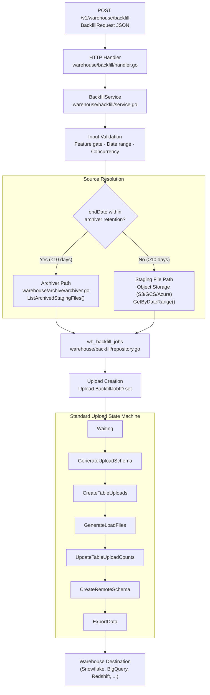
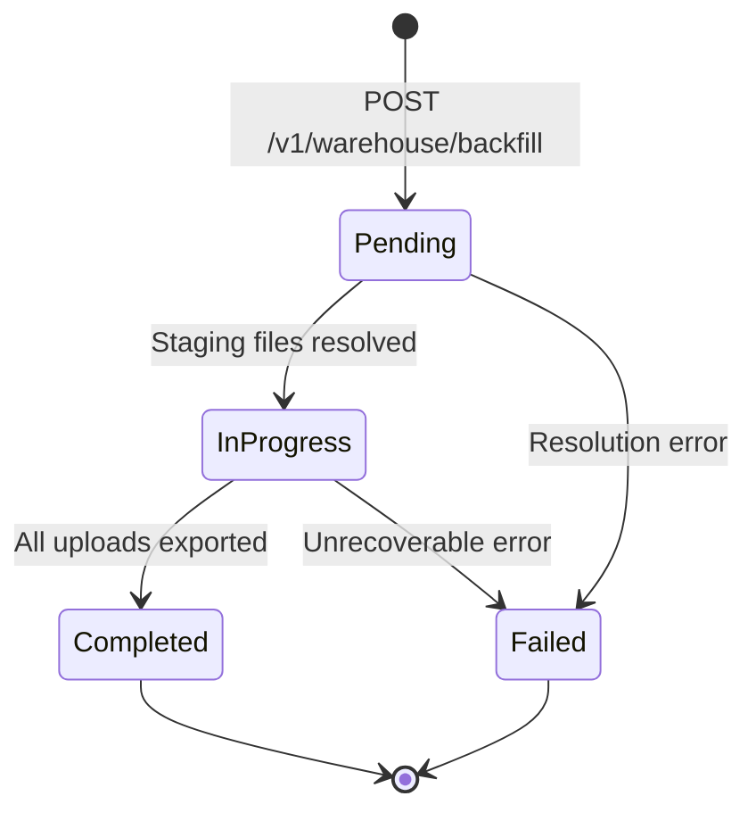

# Warehouse Backfill API

The warehouse backfill feature enables historical data sync for a specified date range, source, and warehouse destination. It allows operators to re-process archived staging data from the archiver (within its 10-day retention window) or from staging files stored in object storage (for data beyond the archiver retention window).

Backfill integrates with the existing 7-state upload state machine by introducing `BackfillPending` and `BackfillInProgress` states that route uploads through the standard warehouse pipeline.

> Source: `warehouse/backfill/`

---

## Architecture

The backfill pipeline is coordinated by the `BackfillService` orchestrator, which receives requests from the HTTP handler, validates inputs, resolves the appropriate data source (archiver or staging files), creates a tracked upload with a `BackfillJobID`, and feeds it into the standard 7-state upload state machine for warehouse loading.



The `BackfillService` runs a background monitor loop (context-cancellable ticker, matching the `CronArchiver` pattern from `warehouse/archive/cron.go`) that periodically checks tracked jobs, resolves staging files for pending jobs, and detects completed or failed jobs.

> Source: `warehouse/backfill/service.go:98-165`, `warehouse/backfill/handler.go:39-55`

---

## REST API Endpoints

The backfill API exposes two endpoints registered on the warehouse HTTP server (port `8082`) via the Chi router in `warehouse/api/http.go`.

### POST /v1/warehouse/backfill — Trigger Backfill

Triggers a new backfill job for the specified source, destination, and date range.

**Request:**

| Property | Location | Type | Required | Description |
|----------|----------|------|----------|-------------|
| `Content-Type` | Header | string | Yes | Must be `application/json` |
| `source_id` | Body | string | Yes | Event source identifier |
| `destination_id` | Body | string | Yes | Warehouse destination identifier |
| `workspace_id` | Body | string | Yes | Workspace identifier for tenant isolation |
| `start_date` | Body | string (ISO 8601 / RFC 3339) | Yes | Inclusive start of the backfill date range |
| `end_date` | Body | string (ISO 8601 / RFC 3339) | Yes | Inclusive end of the backfill date range |

**Request Body Example:**

```json
{
    "source_id": "src_abc123",
    "destination_id": "dest_xyz789",
    "workspace_id": "wks_456def",
    "start_date": "2024-01-01T00:00:00Z",
    "end_date": "2024-01-15T23:59:59Z"
}
```

**Success Response (201 Created):**

```json
{
    "jobID": 42,
    "status": "pending"
}
```

**Error Responses:**

| HTTP Status | Condition | Example Response |
|-------------|-----------|------------------|
| `400 Bad Request` | Missing required fields, invalid JSON, `start_date` after `end_date`, date range exceeds `maxDateRangeDays` | `{"status": "error", "message": "source_id is required"}` |
| `403 Forbidden` | Backfill feature is disabled (`Warehouse.backfill.enabled = false`) | `{"status": "error", "message": "backfill feature is disabled"}` |
| `429 Too Many Requests` | Active backfill job count has reached `maxConcurrentJobs` | `{"status": "error", "message": "concurrent backfill job limit reached"}` |
| `500 Internal Server Error` | Unexpected internal failure | `{"status": "error", "message": "internal server error"}` |

> Source: `warehouse/backfill/handler.go:57-109`

### GET /v1/warehouse/backfill/{jobID} — Get Backfill Job Status

Retrieves the current state and full metadata of a backfill job.

**Request:**

| Property | Location | Type | Required | Description |
|----------|----------|------|----------|-------------|
| `jobID` | Path parameter | int64 | Yes | Backfill job identifier |

**Success Response (200 OK):**

```json
{
    "id": 42,
    "source_id": "src_abc123",
    "destination_id": "dest_xyz789",
    "workspace_id": "wks_456def",
    "start_date": "2024-01-01T00:00:00Z",
    "end_date": "2024-01-15T23:59:59Z",
    "status": "in_progress",
    "metadata": null,
    "created_at": "2024-01-20T10:30:00Z",
    "updated_at": "2024-01-20T10:35:00Z"
}
```

**Error Responses:**

| HTTP Status | Condition | Example Response |
|-------------|-----------|------------------|
| `400 Bad Request` | Invalid (non-numeric) job ID | `{"status": "error", "message": "invalid job ID"}` |
| `404 Not Found` | No backfill job exists with the given ID | `{"status": "error", "message": "backfill job not found"}` |
| `500 Internal Server Error` | Unexpected internal failure | `{"status": "error", "message": "failed to get backfill status"}` |

> Source: `warehouse/backfill/handler.go:111-141`

---

## Data Source Resolution

The backfill service resolves the data source for each request based on whether the requested date range falls within the archiver's retention window. This two-path strategy balances access speed (archiver path for recent data) with coverage (staging file path for historical data).

### Archiver Path (Within Retention Window)

When the requested `end_date` is within the archiver's retention window (default: 10 days, configured via `JobsDB.archivalTimeInDays`), the backfill service queries archived staging file metadata through the `ArchiverQuerier` interface.

The archiver stores staging files with configurable retention (default 5-day archival cycle, 90-day retention). For backfill purposes, the key constraint is the archiver's retention window — staging file metadata remains accessible for the duration of the retention period.

```
Backfill Request (recent dates)
    → ArchiverQuerier.ListArchivedStagingFiles(sourceID, destID, startDate, endDate)
    → Returns staging file IDs from archived metadata
    → Creates upload with resolved staging file range
```

### Staging File Path (Beyond Retention Window)

When the requested date range extends beyond the archiver's retention window, the backfill service falls back to querying staging files directly from the staging file repository, which reads from object storage (S3, GCS, or Azure Blob Storage).

```
Backfill Request (historical dates)
    → StagingFileQuerier.GetByDateRange(sourceID, destID, startDate, endDate)
    → Returns staging file IDs from object storage metadata
    → Creates upload with resolved staging file range
```

### Source Selection Logic

The source selection is automatic and transparent to the API caller. The `BackfillService` determines the appropriate path based on the current time and the archiver's retention window:

| Condition | Path | Interface |
|-----------|------|-----------|
| `now() - endDate ≤ ArchiverRetentionWindowDays` (10 days) | Archiver | `ArchiverQuerier` |
| `now() - endDate > ArchiverRetentionWindowDays` | Staging Files | `StagingFileQuerier` |

> Source: `warehouse/backfill/service.go:70-92`, `warehouse/backfill/config.go:68-73`

---

## Configuration Reference

All backfill configuration keys are nested under the `Warehouse.backfill.*` namespace and support runtime reload without process restart. They follow the reloadable variable pattern (`GetReloadableBoolVar`, `GetReloadableIntVar`, `GetReloadableDurationVar`) established in `warehouse/archive/archiver.go`.

| Configuration Key | Type | Default | Description |
|-------------------|------|---------|-------------|
| `Warehouse.backfill.enabled` | bool | `false` | Enable or disable the backfill feature. When disabled, API requests return `403 Forbidden` and the background monitor does not run. |
| `Warehouse.backfill.maxDateRangeDays` | int | `90` | Maximum number of days allowed in a single backfill date range. Requests exceeding this limit are rejected with `400 Bad Request`. |
| `Warehouse.backfill.maxConcurrentJobs` | int | `3` | Maximum number of backfill jobs that can be active (pending or in-progress) concurrently across all sources and destinations. Excess requests are rejected with `429 Too Many Requests`. |
| `Warehouse.backfill.monitorIntervalSeconds` | duration (seconds) | `60` | Interval between consecutive iterations of the background monitor loop. The monitor checks tracked jobs for status transitions and detects stalled or timed-out jobs. |

> Source: `warehouse/backfill/config.go:15-73`

---

## Backfill Status Lifecycle

Each backfill job progresses through a linear state machine with two terminal states. Status transitions are managed by the `BackfillService` monitor loop and reflected in the `wh_backfill_jobs.status` column.

### Status Constants

| Status | Value | Description |
|--------|-------|-------------|
| Pending | `pending` | Job has been created but not yet started processing. Staging file resolution has not begun. |
| In Progress | `in_progress` | Job is actively processing — staging files have been resolved and uploads are being executed through the state machine. |
| Completed | `completed` | Job has finished successfully — all uploads created from the backfill have reached `ExportedData` state. |
| Failed | `failed` | Job has failed — an unrecoverable error occurred during staging file resolution or upload processing. |

### State Diagram



The `IsTerminal()` and `IsActive()` helper functions in `warehouse/backfill/model.go` provide predicates for status classification:

- **Terminal states**: `completed`, `failed` — the job will not transition further
- **Active states**: `pending`, `in_progress` — the job is counted against the concurrency limit

> Source: `warehouse/backfill/model.go:13-30`, `warehouse/backfill/model.go:131-143`

---

## Integration with Upload State Machine

Backfill uploads integrate with the existing 7-state upload state machine defined in `warehouse/router/state.go`. The integration is designed to be fully backward compatible — standard uploads (without a `BackfillJobID`) traverse the state machine exactly as before.

### Backfill Upload Flow

When the `BackfillService` creates an upload for a backfill job, it sets the `Upload.BackfillJobID` field to the associated `wh_backfill_jobs.id`. This field serves as the integration marker between the backfill subsystem and the upload state machine.

1. **Backfill Service** creates an upload with `BackfillJobID` set to the job's ID
2. The upload enters the **Waiting** state (standard entry point)
3. The upload progresses through all 7 states in order:

```
Waiting → GenerateUploadSchema → CreateTableUploads → GenerateLoadFiles
→ UpdateTableUploadCounts → CreateRemoteSchema → ExportData
```

4. On completion (`ExportedData`), the backfill monitor detects the terminal state and transitions the parent `BackfillJob` to `Completed`
5. On failure (`Aborted`), the backfill monitor transitions the parent `BackfillJob` to `Failed`

### Backward Compatibility

| Upload Type | `BackfillJobID` | State Machine Behavior |
|-------------|-----------------|------------------------|
| Standard upload (from Processor staging files) | `nil` | No change — existing 7-state progression unchanged |
| Backfill upload (from backfill API) | Non-nil (references `wh_backfill_jobs.id`) | Same 7-state progression; parent backfill job tracks aggregate status |

The `BackfillJobID` column is added to the `wh_uploads` table as a nullable foreign key referencing `wh_backfill_jobs(id)`. Existing upload rows have `NULL` in this column, preserving full backward compatibility.

### State Machine Extension Points

The upload state machine in `warehouse/router/state.go` defines 7 states as a linked list:

```
waitingState → generateUploadSchemaState → createTableUploadsState
→ generateLoadFilesState → updateTableUploadCountsState
→ createRemoteSchemaState → exportDataState → nil (terminal)
```

Backfill uploads follow the same state chain. The `BackfillPending` and `BackfillInProgress` status constants in `warehouse/internal/model/upload.go` extend the upload status vocabulary without modifying the state transition logic itself — they are used by the backfill service for its own job-level tracking, not as upload-level states.

> Source: `warehouse/router/state.go:19-82`, `warehouse/internal/model/upload.go:10-25`

---

## Database Schema

The backfill feature introduces one new table and one new column, managed via the migration `000042_add_backfill_tracking.up.sql`.

### wh_backfill_jobs Table

| Column | Type | Constraints | Description |
|--------|------|-------------|-------------|
| `id` | `BIGSERIAL` | `PRIMARY KEY` | Auto-generated unique identifier |
| `source_id` | `VARCHAR(64)` | `NOT NULL` | Event source identifier |
| `destination_id` | `VARCHAR(64)` | `NOT NULL` | Warehouse destination identifier |
| `workspace_id` | `VARCHAR(64)` | `NOT NULL` | Workspace identifier for tenant isolation |
| `start_date` | `TIMESTAMPTZ` | `NOT NULL` | Inclusive start of the backfill date range |
| `end_date` | `TIMESTAMPTZ` | `NOT NULL` | Inclusive end of the backfill date range |
| `status` | `VARCHAR(64)` | `NOT NULL DEFAULT 'pending'` | Current lifecycle status (`pending`, `in_progress`, `completed`, `failed`) |
| `metadata` | `JSONB` | | Optional JSON metadata associated with the job |
| `created_at` | `TIMESTAMPTZ` | `NOT NULL DEFAULT NOW()` | Record creation timestamp |
| `updated_at` | `TIMESTAMPTZ` | | Last update timestamp |

### wh_uploads Column Addition

| Column | Type | Constraints | Description |
|--------|------|-------------|-------------|
| `backfill_job_id` | `BIGINT` | `REFERENCES wh_backfill_jobs(id)` | Nullable foreign key linking an upload to its parent backfill job. `NULL` for standard (non-backfill) uploads. |

> Source: `sql/migrations/warehouse/000042_add_backfill_tracking.up.sql`, `warehouse/backfill/repository.go:17-24`

---

## Usage Examples

### Trigger a Backfill

```bash
curl -X POST http://localhost:8082/v1/warehouse/backfill \
  -H "Content-Type: application/json" \
  -d '{
    "source_id": "src_abc123",
    "destination_id": "dest_xyz789",
    "workspace_id": "wks_456def",
    "start_date": "2024-01-01T00:00:00Z",
    "end_date": "2024-01-15T23:59:59Z"
  }'
```

**Expected Response (201 Created):**

```json
{
    "jobID": 42,
    "status": "pending"
}
```

### Check Backfill Status

```bash
curl http://localhost:8082/v1/warehouse/backfill/42
```

**Expected Response (200 OK):**

```json
{
    "id": 42,
    "source_id": "src_abc123",
    "destination_id": "dest_xyz789",
    "workspace_id": "wks_456def",
    "start_date": "2024-01-01T00:00:00Z",
    "end_date": "2024-01-15T23:59:59Z",
    "status": "completed",
    "metadata": null,
    "created_at": "2024-01-20T10:30:00Z",
    "updated_at": "2024-01-20T11:45:00Z"
}
```

### Poll for Completion

```bash
# Poll every 30 seconds until the job reaches a terminal state
while true; do
  STATUS=$(curl -s http://localhost:8082/v1/warehouse/backfill/42 | jq -r '.status')
  echo "Backfill job 42 status: $STATUS"
  if [ "$STATUS" = "completed" ] || [ "$STATUS" = "failed" ]; then
    break
  fi
  sleep 30
done
```

> Source: `warehouse/api/http.go:161-197`

---

## Limitations and Constraints

| Constraint | Value | Configurable | Description |
|------------|-------|--------------|-------------|
| Maximum date range | 90 days (default) | Yes (`Warehouse.backfill.maxDateRangeDays`) | A single backfill request cannot span more than this number of days. Split larger ranges into multiple requests. |
| Maximum concurrent jobs | 3 (default) | Yes (`Warehouse.backfill.maxConcurrentJobs`) | The total number of active (pending + in-progress) backfill jobs across all sources and destinations. Excess requests are rejected with `429 Too Many Requests`. |
| Archiver retention window | 10 days | Yes (`JobsDB.archivalTimeInDays`) | Data within this window is resolved from the archiver for faster access. Data beyond this window is resolved from staging files in object storage. |
| Feature gate | Disabled by default | Yes (`Warehouse.backfill.enabled`) | The backfill feature must be explicitly enabled. When disabled, all API requests return `403 Forbidden`. |
| Selective sync integration | Respects exclusions | N/A | Backfill uploads respect selective sync exclusions (E-034). Tables and columns excluded via selective sync configuration are also excluded during backfill processing. |
| Upload state machine | Standard 7-state | N/A | Backfill uploads traverse the same 7-state upload pipeline as standard uploads. All retry logic, error classification, and abort thresholds apply equally. |
| Workspace isolation | Enforced | N/A | Backfill jobs are scoped to the workspace identified by `workspace_id`. Cross-workspace backfill is not supported. |

> Source: `warehouse/backfill/config.go:41-73`, `warehouse/backfill/model.go:101-128`

---

## Prometheus Metrics

The backfill service emits the following Prometheus-compatible metrics via the `stats.Stats` framework:

| Metric Name | Type | Description |
|-------------|------|-------------|
| `warehouse.backfill.triggered` | Counter | Incremented each time a backfill job is successfully created |
| `warehouse.backfill.failed` | Counter | Incremented each time a backfill job transitions to `failed` status |
| `warehouse.backfill.completed` | Counter | Incremented each time a backfill job transitions to `completed` status |

These metrics are initialized in the `NewBackfillService` constructor using `statsFactory.NewStat()`, following the instrumentation pattern from `warehouse/router/upload_stats.go`.

> Source: `warehouse/backfill/service.go:206-213`

---

## Source References

| File | Purpose |
|------|---------|
| `warehouse/backfill/service.go` | `BackfillService` orchestrator — validates requests, manages job lifecycle, runs background monitor |
| `warehouse/backfill/handler.go` | HTTP handler for `POST /v1/warehouse/backfill` and `GET /v1/warehouse/backfill/{jobID}` |
| `warehouse/backfill/config.go` | Configuration keys, defaults, and reloadable variable initialization |
| `warehouse/backfill/model.go` | Domain models (`BackfillJob`, `BackfillRequest`, `BackfillResponse`), status constants, sentinel errors |
| `warehouse/backfill/repository.go` | CRUD repository for the `wh_backfill_jobs` table |
| `warehouse/api/http.go` | Endpoint registration in the Chi router (`addMasterEndpoints`) |
| `warehouse/router/state.go` | 7-state upload state machine (backfill uploads traverse this pipeline) |
| `warehouse/archive/archiver.go` | Archiver integration for staging file resolution within the retention window |
| `warehouse/internal/model/upload.go` | Upload status constants and `Upload` struct (extended with `BackfillJobID`) |
| `sql/migrations/warehouse/000042_add_backfill_tracking.up.sql` | Database migration creating `wh_backfill_jobs` table and `backfill_job_id` column |
