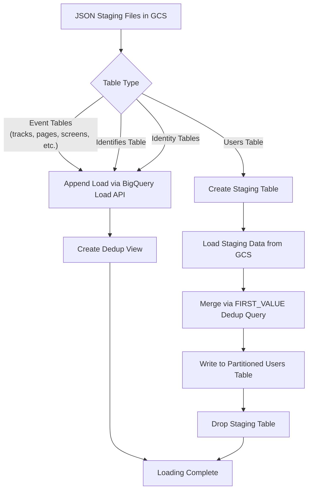

# BigQuery Connector Guide

RudderStack's BigQuery connector supports warehouse loading via the Google BigQuery API with parallel loading, custom date/time partitioning, load-by-folder path optimization, and JSON-based (newline-delimited JSON) staging files. The connector leverages Google Cloud Storage (GCS) as the intermediate staging layer, loading JSON data into BigQuery tables with automatic schema evolution, deduplication views, and partition-aware idempotent writes.

BigQuery is unique among RudderStack's warehouse connectors in that it uses **JSON encoding** (not CSV or Parquet) for staging files and supports both ingestion-time partitioning and custom column-based partitioning. The connector also provides an instrumentation middleware layer for slow query logging and query metrics emission.

**Related Documentation:**

[Warehouse Overview](overview.md) | [Schema Evolution](schema-evolution.md) | [Encoding Formats](encoding-formats.md)

> Source: `warehouse/integrations/bigquery/bigquery.go`

---

## Prerequisites

Before configuring the BigQuery connector, ensure the following requirements are met:

- **Google Cloud Project** — A GCP project with the BigQuery API enabled
- **Service Account** — A GCP service account with the following IAM roles:
  - `roles/bigquery.dataEditor` — BigQuery Data Editor (create/update/delete tables and data)
  - `roles/bigquery.jobUser` — BigQuery Job User (run BigQuery jobs including loads and queries)
- **BigQuery Dataset** — A dataset in BigQuery corresponding to the RudderStack namespace (the namespace maps directly to a BigQuery dataset)
- **Google Cloud Storage Bucket** — A GCS bucket for staging JSON load files (the warehouse service writes staging files to GCS before loading into BigQuery)
- **RudderStack Warehouse Service** — The warehouse service must be running and accessible (default port `8082`)

### Table Name Constraint

BigQuery enforces a maximum table name length of **127 characters**. RudderStack enforces this limit when generating staging table names to ensure compatibility.

> Source: `warehouse/integrations/bigquery/bigquery.go:62-63`

---

## Setup

Follow these steps to configure BigQuery as a warehouse destination in RudderStack:

### Step 1: Create a GCP Service Account

1. Navigate to the [GCP Console IAM & Admin](https://console.cloud.google.com/iam-admin/serviceaccounts) page
2. Create a new service account (or select an existing one)
3. Assign the `BigQuery Data Editor` and `BigQuery Job User` roles
4. Generate a JSON key file for the service account

### Step 2: Configure the Destination

Provide the following settings when configuring BigQuery as a destination:

| Setting | Description |
|---------|-------------|
| **Project ID** | The GCP project ID where the BigQuery dataset resides |
| **Credentials** | The full contents of the service account JSON key file |
| **Namespace** | Maps to the BigQuery dataset name. If the dataset does not exist, RudderStack will attempt to create it |
| **Location** | The geographic location for the dataset (defaults to `US` if not specified) |
| **Partition Column** | *(Optional)* Custom partition column — see [Custom Partitioning](#custom-partitioning) |
| **Partition Type** | *(Optional)* Partition granularity (`hour` or `day`) — see [Custom Partitioning](#custom-partitioning) |

### Step 3: Test the Connection

Verify connectivity using a curl command against the warehouse API:

```bash
curl -X POST http://localhost:8082/v1/warehouse/validate \
  -H "Content-Type: application/json" \
  -d '{
    "destination": {
      "config": {
        "project": "your-gcp-project-id",
        "credentials": "{...service-account-json...}",
        "namespace": "your_dataset_name",
        "location": "US"
      },
      "destinationDefinition": {
        "name": "BQ"
      }
    }
  }'
```

> Source: `warehouse/integrations/bigquery/bigquery.go:888-896` (Setup), `warehouse/integrations/bigquery/bigquery.go:342-381` (CreateSchema)

---

## Configuration Parameters

The following configuration parameters control BigQuery connector behavior. These are set in `config/config.yaml` under the `Warehouse.bigquery` namespace.

| Parameter | Default | Type | Description |
|-----------|---------|------|-------------|
| `Warehouse.bigquery.setUsersLoadPartitionFirstEventFilter` | `true` | `bool` | Enables partition filter optimization for the users table during load operations. When enabled, queries against the users table use first-event-based partition filters to reduce scan costs. |
| `Warehouse.bigquery.customPartitionsEnabled` | `false` | `bool` | Enables custom date/time column-based partitioning for tables. When disabled, tables use BigQuery's default ingestion-time partitioning. See [Custom Partitioning](#custom-partitioning). |
| `Warehouse.bigquery.enableDeleteByJobs` | `false` | `bool` | Enables job-based deletion support for the `DeleteBy` operation. When disabled, `DeleteBy` SQL statements are logged but not executed. Used for source-level data cleanup operations. |
| `Warehouse.bigquery.customPartitionsEnabledWorkspaceIDs` | `[]` (empty) | `[]string` | List of workspace IDs for which custom partitioning is enabled, even if the global `customPartitionsEnabled` flag is `false`. Allows selective rollout of custom partitioning per workspace. |
| `Warehouse.bigquery.slowQueryThreshold` | `5m` | `duration` | Threshold duration for slow query logging. Queries exceeding this duration are logged by the middleware layer with query text and execution time. |
| `Warehouse.bigquery.loadByFolderPath` | `false` | `bool` | Enables folder-path-based loading optimization. When enabled, the connector loads all JSON files from a GCS folder path using a wildcard (`/*`) instead of listing individual file URIs. Reduces API overhead for tables with many staging files. |
| `Warehouse.bigquery.maxParallelLoads` | `20` | `int` | Maximum number of tables that can be loaded in parallel during a single upload cycle. BigQuery's high default (20) reflects its ability to handle concurrent load jobs efficiently. |
| `Warehouse.bigquery.columnCountLimit` | `10000` | `int` | Maximum number of columns allowed per table. Aligns with BigQuery's native column limit. Tables exceeding this limit trigger a `ColumnCountError`. |

> Source: `warehouse/integrations/bigquery/bigquery.go:47-55` (config struct), `warehouse/integrations/bigquery/bigquery.go:130-135` (initialization), `config/config.yaml:166-167`, `warehouse/integrations/config/config.go:26`

---

## Data Type Mappings

### RudderStack → BigQuery

The following table shows how RudderStack's internal data types map to BigQuery field types during table creation and schema evolution:

| RudderStack Type | BigQuery Type |
|------------------|---------------|
| `boolean` | `BOOLEAN` |
| `int` | `INTEGER` |
| `float` | `FLOAT` |
| `string` | `STRING` |
| `datetime` | `TIMESTAMP` |

> Source: `warehouse/integrations/bigquery/bigquery.go:67-73`

### BigQuery → RudderStack

When fetching existing schemas from BigQuery (e.g., during schema reconciliation), the connector maps BigQuery types back to RudderStack types:

| BigQuery Type | RudderStack Type |
|---------------|------------------|
| `BOOLEAN` | `boolean` |
| `BOOL` | `boolean` |
| `INTEGER` | `int` |
| `INT64` | `int` |
| `NUMERIC` | `float` |
| `FLOAT` | `float` |
| `FLOAT64` | `float` |
| `STRING` | `string` |
| `BYTES` | `string` |
| `DATE` | `datetime` |
| `DATETIME` | `datetime` |
| `TIME` | `datetime` |
| `TIMESTAMP` | `datetime` |

Any BigQuery type not in this mapping is recorded as a missing data type via the `rudder_missing_datatype` counter metric.

> Source: `warehouse/integrations/bigquery/bigquery.go:76-90`

---

## Loading Strategies

The BigQuery connector uses a JSON-based loading pipeline that stages newline-delimited JSON files in Google Cloud Storage and then loads them into BigQuery using the BigQuery Load API. The loading strategy differs based on table type.

### Loading Flow



### Event Table Loading (Append)

For standard event tables (`tracks`, `pages`, `screens`, custom event tables), the connector:

1. Resolves GCS staging file references (individual files or folder path with wildcard)
2. Creates a `GCSReference` with `SourceFormat = JSON`, `MaxBadRecords = 0`, `IgnoreUnknownValues = false`
3. Determines the output table name — either the raw table name or a partition-decorated name (`tableName$YYYYMMDD` or `tableName$YYYYMMDDHH`)
4. Executes a BigQuery Load job from GCS into the target table (append mode)
5. Waits for job completion and collects load statistics (rows inserted)

The partition decorator is **avoided** when:
- Custom partitioning is enabled via global config or workspace ID list
- A time-unit column partition (e.g., `received_at`) is configured

> Source: `warehouse/integrations/bigquery/bigquery.go:450-580` (loadTable, loadTableByAppend)

### Users Table Loading (Merge via Staging)

The users table requires a merge strategy to maintain the latest user profile traits. The loading process:

1. Loads the `identifies` table first (append strategy)
2. Creates a temporary staging table for the `users` data
3. Loads the new users data from GCS into the staging table
4. Executes a deduplication merge query that:
   - Extracts `FIRST_VALUE` (ordered by `received_at DESC`) for each user property
   - Unions the existing users view with the new staging data
   - Partitions by `id` to deduplicate
   - Selects `DISTINCT` rows from the merged result
5. Writes the merged result to the partitioned users table (append mode with `WriteAppend` disposition)
6. Drops the staging table during cleanup

The `FIRST_VALUE ... IGNORE NULLS ... ORDER BY received_at DESC` window function ensures that the most recent non-null value for each trait is preserved across all events for a given user.

> Source: `warehouse/integrations/bigquery/bigquery.go:622-730` (LoadUserTables)

### Deduplication Views

For tables that require deduplication (users, identifies, discards, identity tables), the connector creates a BigQuery **view** with the naming convention `<tableName>_view`. The view uses `ROW_NUMBER() OVER (PARTITION BY <partition_key> ORDER BY loaded_at DESC)` to select only the latest row for each partition key.

The deduplication view considers data from the **last 60 days** (60 × 24 × 60 × 60 × 1,000,000 microseconds) to balance query performance with data freshness.

Views can be skipped by setting the `skipViews` destination configuration option.

#### Partition Key Map

The following table shows the deduplication partition keys for each system table:

| Table | Partition Key(s) |
|-------|-----------------|
| `users` | `id` |
| `identifies` | `id` |
| `discards` | `row_id, column_name, table_name` |
| `identity_mappings` | `merge_property_type, merge_property_value` |
| `identity_merge_rules` | `merge_property_1_type, merge_property_1_value, merge_property_2_type, merge_property_2_value` |

For any table not in this map, the default partition key is `id`.

> Source: `warehouse/integrations/bigquery/bigquery.go:92-98` (partitionKeyMap), `warehouse/integrations/bigquery/bigquery.go:252-316` (deduplicationQuery)

### Load-by-Folder Path Optimization

When `Warehouse.bigquery.loadByFolderPath` is enabled, the connector resolves a single GCS folder path with a wildcard suffix (`/*`) instead of enumerating individual staging file URIs. This reduces the size of the BigQuery Load API request payload and is beneficial when a table has many staging files in a single upload cycle.

The folder path is derived by extracting the directory portion of a sample load file location and appending `/*`.

> Source: `warehouse/integrations/bigquery/bigquery.go:495-503` (folder path resolution), `warehouse/integrations/bigquery/bigquery.go:1263-1265` (loadFolder)

---

## Custom Partitioning

BigQuery supports time-based table partitioning to improve query performance and reduce scan costs. The RudderStack connector supports both ingestion-time partitioning (default) and custom column-based partitioning.

### Partition Configuration

Custom partitioning is controlled by two destination-level settings and two global configuration flags:

| Setting | Source | Description |
|---------|--------|-------------|
| Partition Column | Destination config (`partitionColumn`) | The column to partition on. Must be one of the supported columns (see below). |
| Partition Type | Destination config (`partitionType`) | The partition granularity: `hour` or `day`. |
| `Warehouse.bigquery.customPartitionsEnabled` | `config.yaml` | Global toggle to enable custom partitioning for all workspaces. |
| `Warehouse.bigquery.customPartitionsEnabledWorkspaceIDs` | `config.yaml` | Selective workspace IDs for custom partitioning enablement. |

### Supported Partition Columns

The connector validates partition columns against a strict allowlist:

| Column Name | Description |
|-------------|-------------|
| `_PARTITIONTIME` | BigQuery's built-in ingestion-time pseudo-column |
| `loaded_at` | RudderStack's load timestamp |
| `received_at` | Event receipt timestamp |
| `sent_at` | Event send timestamp |
| `timestamp` | Event timestamp |
| `original_timestamp` | Original event timestamp |

> Source: `warehouse/integrations/bigquery/partition.go:19-26`

### Supported Partition Types

| Partition Type | BigQuery Mapping | Date Format |
|---------------|------------------|-------------|
| `hour` | `HourPartitioningType` | `2006-01-02T15` (e.g., `2024-01-15T14`) |
| `day` | `DayPartitioningType` | `2006-01-02` (e.g., `2024-01-15`) |

> Source: `warehouse/integrations/bigquery/partition.go:28-31`, `warehouse/integrations/bigquery/partition.go:84-103`

### Partition Decorator Behavior

When loading data, the connector determines whether to use a **partition decorator** (`tableName$YYYYMMDD`) or load directly into the table:

- **Partition decorator used:** When using default ingestion-time partitioning without custom column partitioning — data is written to a specific partition like `tableName$20240115`
- **Partition decorator avoided:** When custom column-based partitioning is enabled (either globally or per workspace), or when a time-unit column partition is configured. In this case, BigQuery manages partition assignment based on the data in the partition column.

The partition decorator is avoided for custom column partitions because the partition ID in the decorator must exactly match the data being written. Since data may span multiple partitions, specifying a single decorator would cause errors.

> Source: `warehouse/integrations/bigquery/partition.go:33-58`

### Partition Date Calculation

The partition date string used for decorators is computed based on the configured partition type:

- **Hour partitioning:** `YYYYMMDDTHH` format → cleaned to `YYYYMMDDHH` for the decorator
- **Day partitioning:** `YYYY-MM-DD` format → cleaned to `YYYYMMDD` for the decorator
- **No partition type:** Defaults to day format `YYYY-MM-DD`

> Source: `warehouse/integrations/bigquery/partition.go:84-109`

---

## Instrumentation and Middleware

The BigQuery connector wraps the native `bigquery.Client` with a middleware layer that provides slow query logging and structured observability. The middleware is transparent to the connector's core logic and intercepts `Run` and `Read` operations on BigQuery queries.

### Middleware Client

The `middleware.Client` wraps the standard BigQuery client and adds:

| Capability | Description |
|------------|-------------|
| **Slow Query Logging** | Queries exceeding the `slowQueryThreshold` (default: 5 minutes) are logged with the full query text and execution duration. |
| **Structured Key-Value Context** | Each middleware client instance is initialized with contextual key-value pairs (source ID, destination ID, workspace ID, schema name) that are included in all log entries. |
| **Configurable Threshold** | The slow query threshold is configurable via `Warehouse.bigquery.slowQueryThreshold`. The middleware default (before config override) is 300 seconds. |

### Intercepted Operations

| Method | Description |
|--------|-------------|
| `Run(ctx, query)` | Executes a BigQuery query and logs if execution time exceeds the threshold |
| `Read(ctx, query)` | Reads query results and logs if execution time exceeds the threshold |

The middleware does **not** intercept Load API operations (table loading from GCS), as those are managed through the `LoaderFrom` API path which does not go through the middleware query interface.

> Source: `warehouse/integrations/bigquery/middleware/middleware.go:1-91`

---

## Encoding Format

BigQuery uses **JSON encoding** (newline-delimited JSON) for staging files. This is distinct from other warehouse connectors that use CSV or Parquet formats.

### BigQuery-Specific Timestamp Formats

| Format Constant | Value | Usage |
|----------------|-------|-------|
| `BQLoadedAtFormat` | `2006-01-02 15:04:05.999999 Z` | Timestamp format for the `loaded_at` column in BigQuery |
| `BQUuidTSFormat` | `2006-01-02 15:04:05 Z` | Timestamp format for UUID-based timestamp columns |

### JSON Loading Configuration

When creating a GCS reference for BigQuery loading, the connector configures:

- `SourceFormat = JSON` — Newline-delimited JSON
- `MaxBadRecords = 0` — Zero tolerance for malformed records (strict mode)
- `IgnoreUnknownValues = false` — Reject records with fields not in the table schema

Column names in JSON output use **provider-cased** formatting (lowercase for BigQuery).

See [Encoding Formats](encoding-formats.md) for details on the encoding factory and format selection logic.

> Source: `warehouse/encoding/encoding.go:17-18`, `warehouse/integrations/bigquery/bigquery.go:470-473`

---

## Schema Management

The BigQuery connector integrates with RudderStack's automatic schema evolution system with several BigQuery-specific behaviors.

### Dataset as Namespace

The BigQuery **dataset** maps directly to the RudderStack **namespace**. When `CreateSchema` is called:

1. The connector checks if the dataset already exists via `ds.Metadata(ctx)`
2. If not found (HTTP 404), it creates the dataset with the configured location (default: `US`)
3. If the dataset already exists (HTTP 409 on create), the error is silently ignored

> Source: `warehouse/integrations/bigquery/bigquery.go:342-381`

### Column Management

- **Adding Columns:** The connector adds new columns by fetching the current table metadata, appending new `FieldSchema` entries, and calling `tableRef.Update()`. If a single column already exists (HTTP 409), the error is ignored gracefully.
- **Altering Columns:** BigQuery does not support column type alteration — the `AlterColumn` method is a no-op that returns an empty response.
- **Column Name Casing:** All column names fetched from BigQuery are lowercased during schema reconciliation via `strings.ToLower(columnName)`.

> Source: `warehouse/integrations/bigquery/bigquery.go:907-952` (AddColumns, AlterColumn), `warehouse/integrations/bigquery/bigquery.go:1011-1012`

### Discards Table

The BigQuery discards table (`rudder_discards`) uses the same schema as other warehouse connectors but includes a `loaded_at` column that enables `ORDER BY loaded_at DESC` in the deduplication view query. This is BigQuery-specific — the presence of `loaded_at` in the column map triggers the ordering clause.

> Source: `warehouse/integrations/bigquery/bigquery.go:259-261`

See [Schema Evolution](schema-evolution.md) for comprehensive documentation on schema diffing, type coercion, and deprecated column cleanup.

---

## Error Handling and Troubleshooting

The BigQuery connector defines a set of error pattern mappings that classify BigQuery API errors into actionable categories for the warehouse upload state machine.

### Error Mappings

| Error Type | Pattern | Description |
|------------|---------|-------------|
| `PermissionError` | `googleapi: Error 403: Access Denied` | The service account lacks required IAM roles. Verify `bigquery.dataEditor` and `bigquery.jobUser` roles are assigned. |
| `ResourceNotFoundError` | `googleapi: Error 404: Not found: Dataset .*` | The specified dataset (namespace) does not exist. Verify the dataset name and project ID in the destination configuration. |
| `ConcurrentQueriesError` | `googleapi: Error 400: Job exceeded rate limits: Your project_and_region exceeded quota for concurrent queries.` | The project has exceeded BigQuery's concurrent query limit. Reduce `maxParallelLoads` or request a quota increase from GCP. |
| `ConcurrentQueriesError` | `googleapi: Error 400: Exceeded rate limits: too many concurrent queries for this project_and_region.` | Variant of the concurrent query rate limit error. Same resolution as above. |
| `ColumnCountError` | `googleapi: Error 400: Too many total leaf fields: .*, max allowed field count: 10000` | A table has exceeded BigQuery's 10,000 column limit. Review event schemas to reduce property cardinality or configure `columnCountLimit` to enforce a lower limit. |

> Source: `warehouse/integrations/bigquery/bigquery.go:100-121`

### Common Troubleshooting Scenarios

#### Connection Failures

- **Symptom:** `creating bigquery client: ...` error during Setup
- **Cause:** Invalid service account credentials or network connectivity issues
- **Resolution:**
  1. Verify the service account JSON key is valid and not expired
  2. Ensure the GCP project ID matches the project in the credentials
  3. Check network connectivity to `bigquery.googleapis.com`

#### Dataset Creation Failures

- **Symptom:** `Creating schema` error during CreateSchema
- **Cause:** Insufficient permissions or invalid location
- **Resolution:**
  1. Verify the service account has `bigquery.datasets.create` permission
  2. Ensure the specified location is a valid BigQuery region (e.g., `US`, `EU`, `us-east1`)
  3. Check if the dataset already exists with a different location (BigQuery does not allow location changes)

#### Load Job Failures

- **Symptom:** `status for append job: job status with errors: ...`
- **Cause:** Schema mismatch between JSON staging files and BigQuery table, or malformed JSON records
- **Resolution:**
  1. Check the BigQuery job error details in GCP Console → BigQuery → Job History
  2. Verify the table schema matches the expected column types
  3. Ensure staging files contain valid newline-delimited JSON
  4. Check that `MaxBadRecords = 0` is appropriate — all records must be valid

#### Rate Limit Errors

- **Symptom:** `googleapi: Error 429` or `exceeded rate limits`
- **Cause:** Too many concurrent API requests to BigQuery
- **Resolution:**
  1. Reduce `Warehouse.bigquery.maxParallelLoads` (default: 20)
  2. Request a quota increase from GCP for your project
  3. Distribute loads across multiple GCP projects if possible

---

## Idempotency and Backfill

The BigQuery connector supports idempotent loading and backfill operations through a combination of append-based loading, deduplication views, and partition-aware writes.

### Merge Dedup Strategy

BigQuery tables are loaded using an **append-only** strategy — data is always appended, never replaced in-place. Deduplication is achieved through **views** that apply `ROW_NUMBER() OVER (PARTITION BY ...)` window functions:

1. Each table has a corresponding `<tableName>_view` that deduplicates rows
2. The view partitions by the table's dedup key (e.g., `id` for users) and orders by `loaded_at DESC`
3. Only the row with `__row_number = 1` (most recent) is returned
4. The view considers a 60-day sliding window for partition pruning

This approach ensures that re-loading the same data (backfill) does not create duplicates from the consumer's perspective — the view always returns the latest version of each record.

### Staging File-Based Backfill

Backfill operations use the same staging file pipeline as regular loads:

1. The warehouse service generates JSON staging files from the backfill source data
2. Files are uploaded to GCS in the standard staging path
3. The BigQuery Load API appends the data to the target table
4. Deduplication views ensure only the latest records are visible to downstream queries

### Partition-Aware Idempotent Loading

Idempotency is maintained through partition-aware loading:

- **Ingestion-time partitions:** Data is loaded into date-specific partitions (`tableName$YYYYMMDD`). Re-loading the same data on the same day appends to the same partition, and the deduplication view resolves duplicates.
- **Custom column partitions:** BigQuery automatically assigns rows to partitions based on the partition column value. The deduplication view uses `TIMESTAMP_TRUNC` on the partition column for efficient partition pruning.

### DeleteBy for Source Cleanup

The `DeleteBy` operation supports idempotent source-level data cleanup:

```sql
DELETE FROM `namespace`.`table`
WHERE
  context_sources_job_run_id <> @jobrunid AND
  context_sources_task_run_id <> @taskrunid AND
  context_source_id = @sourceid AND
  received_at < @starttime;
```

This operation is gated behind `Warehouse.bigquery.enableDeleteByJobs` (default: `false`) and only executes when explicitly enabled.

> Source: `warehouse/integrations/bigquery/bigquery.go:398-448` (DeleteBy), `warehouse/integrations/bigquery/bigquery.go:252-316` (deduplicationQuery)

---

## Performance Tuning

### Parallel Load Configuration

BigQuery supports a high degree of parallelism for load operations. The `Warehouse.bigquery.maxParallelLoads` parameter (default: `20`) controls how many tables are loaded concurrently during a single upload cycle. This is the highest default among all warehouse connectors, reflecting BigQuery's ability to handle concurrent load jobs efficiently.

**Tuning guidance:**
- **Increase** if you have many tables and want faster upload cycles (limited by BigQuery project quotas)
- **Decrease** if you encounter `ConcurrentQueriesError` rate limit errors
- Monitor the `warehouse_load_table_column_limit` gauge metric for column limit proximity

### Load-by-Folder Optimization

Enable `Warehouse.bigquery.loadByFolderPath = true` when:
- Tables have many staging files per upload cycle
- You want to reduce BigQuery Load API request payload size
- GCS folder structure naturally groups staging files by table

The folder path optimization uses a single wildcard GCS URI (`gs://bucket/path/*`) instead of enumerating individual file URIs, reducing API overhead.

### Slow Query Threshold Tuning

Adjust `Warehouse.bigquery.slowQueryThreshold` to control slow query logging sensitivity:
- **Lower values** (e.g., `1m`) — More aggressive logging, useful for identifying optimization opportunities
- **Higher values** (e.g., `10m`) — Less noise in logs, suitable for production environments with complex queries
- **Default** (`5m`) — Balanced threshold suitable for most deployments

### Custom Partitioning for Query Performance

Enable custom partitioning to optimize query performance for downstream analytics:

- **Day partitioning** on `received_at` — Best for most use cases, provides date-level partition pruning
- **Hour partitioning** on `received_at` — For high-volume tables where hour-level granularity significantly reduces scan costs
- **`_PARTITIONTIME`** — Uses BigQuery's ingestion-time partitioning with custom granularity

Partitioning reduces query costs by limiting the amount of data scanned when queries include partition filter predicates.

### Staging Table Cleanup

The connector automatically cleans up dangling staging tables during the `Cleanup` phase. Staging tables are identified by the `rudder_staging_` prefix and are dropped after the upload cycle completes. This prevents accumulation of temporary tables that would consume storage.

> Source: `warehouse/integrations/bigquery/bigquery.go:805-852` (dropDanglingStagingTables)

---

## Identity Resolution

The BigQuery connector supports RudderStack's identity resolution pipeline through dedicated identity tables:

- **`rudder_identity_merge_rules`** — Stores merge rules mapping `anonymous_id` ↔ `user_id` relationships, partitioned by a 4-part composite key
- **`rudder_identity_mappings`** — Stores identity mapping entries, partitioned by `merge_property_type, merge_property_value`

The `DownloadIdentityRules` method extracts identity data from core event tables (`tracks`, `pages`, `screens`, `identifies`, `aliases`) by querying for distinct `anonymous_id` / `user_id` pairs in batches of 10,000 rows. Results are written as gzipped JSONL for downstream identity graph processing.

> Source: `warehouse/integrations/bigquery/bigquery.go:1085-1202` (DownloadIdentityRules), `warehouse/integrations/bigquery/bigquery.go:1043-1053` (LoadIdentityMergeRulesTable, LoadIdentityMappingsTable)

---

## Connector Lifecycle

The BigQuery connector implements the standard warehouse integrations interface with the following lifecycle methods:

| Method | Description |
|--------|-------------|
| `Setup(ctx, warehouse, uploader)` | Initializes the connector with warehouse config, sets up the BigQuery client via middleware |
| `CreateSchema(ctx)` | Creates the BigQuery dataset (namespace) if it does not exist |
| `CreateTable(ctx, tableName, columnMap)` | Creates a table with the appropriate partitioning strategy and deduplication view |
| `AddColumns(ctx, tableName, columnsInfo)` | Adds new columns to an existing table via schema update |
| `AlterColumn(ctx, ...)` | No-op — BigQuery does not support column type changes |
| `LoadTable(ctx, tableName)` | Loads a single event table via append from GCS |
| `LoadUserTables(ctx)` | Loads identifies and users tables with merge deduplication |
| `LoadIdentityMergeRulesTable(ctx)` | Loads the identity merge rules table |
| `LoadIdentityMappingsTable(ctx)` | Loads the identity mappings table |
| `FetchSchema(ctx)` | Queries `INFORMATION_SCHEMA` to retrieve the current dataset schema |
| `DropTable(ctx, tableName)` | Drops a table and its corresponding dedup view |
| `DeleteBy(ctx, tableNames, params)` | Executes source-level data cleanup (gated by `enableDeleteByJobs`) |
| `Cleanup(ctx)` | Drops dangling staging tables and closes the BigQuery client |
| `Connect(ctx, warehouse)` | Returns a client connection for ad-hoc operations |
| `IsEmpty(ctx, warehouse)` | Checks if any core event tables contain data |
| `TestConnection(ctx, warehouse)` | Connection test (no-op — returns nil) |
| `ErrorMappings()` | Returns the error classification patterns for BigQuery API errors |

> Source: `warehouse/integrations/bigquery/bigquery.go:123-1273`
