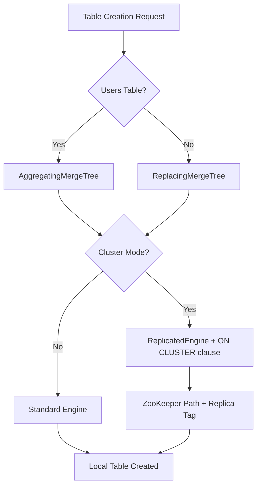
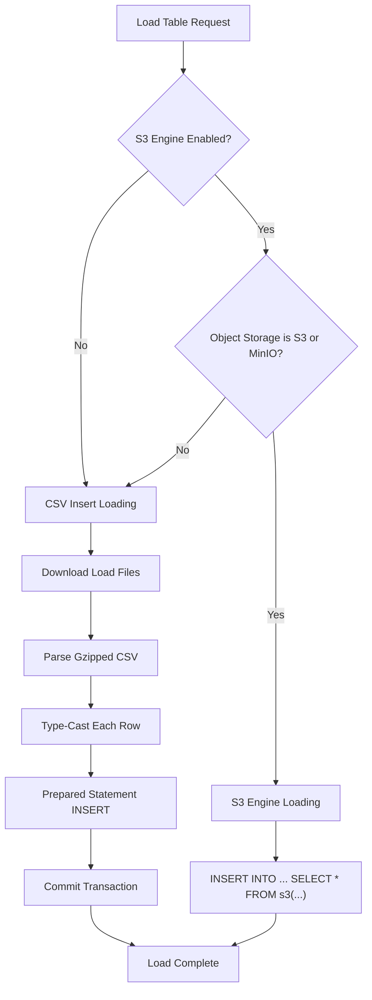

# ClickHouse Connector Guide

RudderStack's ClickHouse connector supports data loading with MergeTree engine families — **ReplacingMergeTree** for event and deduplication tables, **AggregatingMergeTree** for users tables — along with cluster-aware ingestion via replicated engine variants, S3 COPY engine loading for bulk ingestion, nullable column enforcement, and comprehensive data type mappings including array types. The connector uses CSV-based staging files (gzip-compressed) and supports both single-node and clustered ClickHouse deployments.

**Related Documentation:**

[Warehouse Overview](overview.md) | [Schema Evolution](schema-evolution.md) | [Encoding Formats](encoding-formats.md)

> Source: `warehouse/integrations/clickhouse/clickhouse.go`

---

## Prerequisites

Before configuring the ClickHouse connector, ensure the following requirements are met:

- **ClickHouse server** — Single-node instance or ClickHouse cluster with ZooKeeper/ClickHouse Keeper coordination
- **Database and user** — A dedicated database with a user that has write permissions (`INSERT`, `CREATE TABLE`, `ALTER TABLE`, `DROP TABLE`)
- **Object storage** (optional) — S3-compatible storage (AWS S3 or MinIO) for S3 engine-based bulk loading
- **TLS certificates** (optional) — CA root certificate for secure connections when `secure` is enabled
- **Network connectivity** — RudderStack warehouse service (port 8082) must be able to reach the ClickHouse TCP port (default 9000)

> **Important:** ClickHouse does not support a native `BOOLEAN` type. RudderStack maps booleans to `UInt8` with values `0` (false) and `1` (true).

> Source: `warehouse/integrations/clickhouse/clickhouse.go:50`

---

## Setup

### Step 1: Configure Connection

Provide the following connection parameters in your RudderStack destination configuration:

| Parameter | Description | Example |
|-----------|-------------|---------|
| `host` | ClickHouse server hostname or IP | `clickhouse.example.com` |
| `port` | ClickHouse TCP port | `9000` |
| `database` | Target database name | `rudderstack` |
| `user` | ClickHouse username | `rudder_user` |
| `password` | ClickHouse password | `••••••••` |

The connector builds a TCP DSN string in the format:

```
tcp://host:port?username=<user>&password=<pass>&database=<db>&block_size=<size>&pool_size=<pool>&...
```

> Source: `warehouse/integrations/clickhouse/clickhouse.go:253-298`

### Step 2: Configure TLS (Optional)

For secure connections, configure the following:

| Parameter | Description |
|-----------|-------------|
| `secure` | Enable TLS encryption (`true`/`false`) |
| `skip_verify` | Skip server certificate verification (`true`/`false`) |
| `ca_certificate` | PEM-encoded CA root certificate string |

When a CA certificate is provided, the connector registers a per-destination TLS configuration using the destination ID as the TLS config key. This ensures each destination can use a separate certificate chain.

```go
// Each destination gets its own TLS config registered globally
clickhouse.RegisterTLSConfig(destinationID, &tls.Config{
    RootCAs: caCertPool,
})
```

> Source: `warehouse/integrations/clickhouse/clickhouse.go:301-335`

### Step 3: Configure Cluster (Optional)

For ClickHouse cluster deployments, set the **cluster name** in the destination configuration. When a cluster name is provided:

- All DDL statements include the `ON CLUSTER "cluster_name"` clause
- Table engines switch to replicated variants (`ReplicatedReplacingMergeTree`, `ReplicatedAggregatingMergeTree`)
- ZooKeeper paths are automatically generated for replica coordination

### Step 4: Enable S3 Engine Loading (Optional)

For workspaces requiring bulk loading via the ClickHouse S3 engine, add the workspace ID to the `s3EngineEnabledWorkspaceIDs` configuration list. The object storage backend must be S3 or MinIO.

> Source: `warehouse/integrations/clickhouse/clickhouse.go:231`

---

## Configuration Parameters

The following parameters control ClickHouse connector behavior. All parameters are prefixed with `Warehouse.clickhouse.` in `config/config.yaml` or set via environment variables.

| Parameter | Default | Type | Description |
|-----------|---------|------|-------------|
| `Warehouse.clickhouse.maxParallelLoads` | `3` | int | Maximum number of tables loaded in parallel during a single upload cycle |
| `Warehouse.clickhouse.queryDebugLogs` | `"false"` | string | Enable ClickHouse driver-level query debug logging |
| `Warehouse.clickhouse.blockSize` | `"1000000"` | string | ClickHouse block size for batch inserts (rows per block) |
| `Warehouse.clickhouse.poolSize` | `"100"` | string | Connection pool size for the ClickHouse driver |
| `Warehouse.clickhouse.readTimeout` | `"300"` | string | Read timeout in seconds for ClickHouse connections |
| `Warehouse.clickhouse.writeTimeout` | `"1800"` | string | Write timeout in seconds for ClickHouse connections (30 minutes default) |
| `Warehouse.clickhouse.compress` | `false` | bool | Enable compression for data transmitted to ClickHouse |
| `Warehouse.clickhouse.disableNullable` | `false` | bool | Disable `Nullable()` wrappers on columns for non-identifies/non-users tables. When enabled, columns use default values instead of NULL |
| `Warehouse.clickhouse.execTimeOutInSeconds` | `600` | duration (seconds) | Timeout for individual SQL statement execution (10 minutes) |
| `Warehouse.clickhouse.commitTimeOutInSeconds` | `600` | duration (seconds) | Timeout for transaction commit operations (10 minutes) |
| `Warehouse.clickhouse.loadTableFailureRetries` | `3` | int | Number of retry attempts for failed table load operations |
| `Warehouse.clickhouse.numWorkersDownloadLoadFiles` | `8` | int | Number of parallel workers for downloading load files from object storage |
| `Warehouse.clickhouse.s3EngineEnabledWorkspaceIDs` | `[]` (empty) | string slice | List of workspace IDs that use S3 engine for bulk loading instead of CSV insert |
| `Warehouse.clickhouse.slowQueryThreshold` | `5m` | duration | Threshold for logging slow queries |
| `Warehouse.clickhouse.disableLoadTableStats` | `false` | bool | Disable pre/post load row count tracking (can be set per workspace) |
| `Warehouse.clickhouse.maxLoadDelay` | `0` | duration (seconds) | Maximum random delay before starting a table load (jitter for load distribution, per workspace) |

> **Note:** The config file at `config/config.yaml` uses simplified defaults (e.g., `blockSize: 1000`, `poolSize: 10`) while the Go code constructor uses the full defaults shown above.

> Source: `warehouse/integrations/clickhouse/clickhouse.go:213-250`, `config/config.yaml:175-181`

### Connection Parameters

These parameters are set per-destination in the RudderStack Control Plane:

| Parameter | Type | Description |
|-----------|------|-------------|
| `host` | string | ClickHouse server hostname |
| `port` | string | ClickHouse TCP port (default: `9000`) |
| `database` | string | Target database name |
| `user` | string | ClickHouse username |
| `password` | string | ClickHouse password |
| `secure` | bool | Enable TLS encryption |
| `skip_verify` | bool | Skip TLS certificate verification |
| `ca_certificate` | string | PEM-encoded CA root certificate |
| `cluster` | string | ClickHouse cluster name (empty for single-node) |

> Source: `warehouse/integrations/clickhouse/clickhouse.go:301-324`

---

## Data Type Mappings

### RudderStack → ClickHouse

The connector maps RudderStack data types to ClickHouse types as follows:

| RudderStack Type | ClickHouse Type | Notes |
|------------------|-----------------|-------|
| `int` | `Int64` | 64-bit signed integer |
| `array(int)` | `Array(Int64)` | Array of 64-bit integers |
| `float` | `Float64` | 64-bit double-precision float |
| `array(float)` | `Array(Float64)` | Array of 64-bit floats |
| `string` | `String` | Variable-length string |
| `array(string)` | `Array(String)` | Array of strings |
| `datetime` | `DateTime` | Date and time (second precision) |
| `array(datetime)` | `Array(DateTime)` | Array of DateTime values |
| `boolean` | `UInt8` | 0 = false, 1 = true (no native bool) |
| `array(boolean)` | `Array(UInt8)` | Array of UInt8 boolean values |

> Source: `warehouse/integrations/clickhouse/clickhouse.go:51-62`

### Special Column Name Mappings

Certain column names receive special ClickHouse types for query optimization:

| Column Name | ClickHouse Type | Reason |
|-------------|-----------------|--------|
| `event` | `LowCardinality(String)` | High-cardinality optimization for event names |
| `event_text` | `LowCardinality(String)` | High-cardinality optimization for event text |

> Source: `warehouse/integrations/clickhouse/clickhouse.go:64-67`

### Default Values (When Nullable is Disabled)

When `disableNullable` is set to `true`, columns that receive invalid or missing values use these defaults instead of `NULL`:

| RudderStack Type | Default Value |
|------------------|---------------|
| `int` | `0` |
| `float` | `0.0` |
| `boolean` | `0` |
| `datetime` | `1970-01-01 00:00:00` |

> Source: `warehouse/integrations/clickhouse/clickhouse.go:69-74`

### ClickHouse → RudderStack (Reverse Mappings)

When fetching schema from ClickHouse, the connector maps ClickHouse types back to RudderStack types. This mapping handles standard types, Nullable variants, and `SimpleAggregateFunction` wrappers used in users tables:

| ClickHouse Type | RudderStack Type |
|-----------------|------------------|
| `Int8`, `Int16`, `Int32`, `Int64` | `int` |
| `Nullable(Int8)`, `Nullable(Int16)`, `Nullable(Int32)`, `Nullable(Int64)` | `int` |
| `Array(Int64)`, `Array(Nullable(Int64))` | `array(int)` |
| `Float32`, `Float64` | `float` |
| `Nullable(Float32)`, `Nullable(Float64)` | `float` |
| `Array(Float64)`, `Array(Nullable(Float64))` | `array(float)` |
| `String`, `Nullable(String)` | `string` |
| `LowCardinality(String)`, `LowCardinality(Nullable(String))` | `string` |
| `Array(String)`, `Array(Nullable(String))` | `array(string)` |
| `DateTime`, `Nullable(DateTime)` | `datetime` |
| `Array(DateTime)`, `Array(Nullable(DateTime))` | `array(datetime)` |
| `UInt8`, `Nullable(UInt8)` | `boolean` |
| `Array(UInt8)`, `Array(Nullable(UInt8))` | `array(boolean)` |
| `SimpleAggregateFunction(anyLast, Nullable(Int8))` | `int` |
| `SimpleAggregateFunction(anyLast, Nullable(Int16))` | `int` |
| `SimpleAggregateFunction(anyLast, Nullable(Int32))` | `int` |
| `SimpleAggregateFunction(anyLast, Nullable(Int64))` | `int` |
| `SimpleAggregateFunction(anyLast, Nullable(Float32))` | `float` |
| `SimpleAggregateFunction(anyLast, Nullable(Float64))` | `float` |
| `SimpleAggregateFunction(anyLast, Nullable(String))` | `string` |
| `SimpleAggregateFunction(anyLast, Nullable(DateTime))` | `datetime` |
| `SimpleAggregateFunction(anyLast, Nullable(UInt8))` | `boolean` |

The `SimpleAggregateFunction(anyLast, ...)` types appear in users tables that use the `AggregatingMergeTree` engine, where columns are wrapped to select the latest non-null value during merge operations.

> Source: `warehouse/integrations/clickhouse/clickhouse.go:76-116`

---

## Table Engines

ClickHouse uses specialized table engines that determine storage behavior, deduplication semantics, and merge strategies. The RudderStack connector selects the engine based on table type and cluster configuration.



### ReplacingMergeTree — Event and Dedup Tables

The **ReplacingMergeTree** engine is the default for all non-users tables (tracks, pages, screens, identifies, discards, and custom event tables). This engine automatically deduplicates rows with the same sorting key values during background merge operations.

**DDL Pattern:**

```sql
CREATE TABLE IF NOT EXISTS "namespace"."table_name"
  (columns...)
  ENGINE = ReplacingMergeTree()
  ORDER BY ("received_at", "id")
  PARTITION BY toDate(received_at)
```

**Sorting Key Rules:**

| Table Type | Sort Key Fields |
|------------|----------------|
| Standard event tables | `("received_at", "id")` |
| Discards table | `("received_at")` |
| Staging tables (`rudderTypesTable_*`) | `("id")` |

**Partition Strategy:** All tables are partitioned by `toDate(received_at)`, which creates daily partitions based on the event receipt timestamp. This enables efficient partition-level operations (drops, detaches) and optimizes time-range queries.

> Source: `warehouse/integrations/clickhouse/clickhouse.go:882-923`

### AggregatingMergeTree — Users Tables

The **AggregatingMergeTree** engine is used exclusively for users tables. This engine supports aggregation functions during merge, enabling the "latest non-null value wins" semantic for user property updates.

**DDL Pattern:**

```sql
CREATE TABLE IF NOT EXISTS "namespace"."users"
  (columns...)
  ENGINE = AggregatingMergeTree()
  ORDER BY ("id")
  PARTITION BY toDate(received_at)
```

Column types in users tables are wrapped with `SimpleAggregateFunction(anyLast, Nullable(<type>))`, which instructs ClickHouse to keep the most recently inserted non-null value for each column during background merges.

**Not-Nullable Columns:** The `received_at` and `id` columns in users tables are always non-nullable to ensure sorting key integrity.

> Source: `warehouse/integrations/clickhouse/clickhouse.go:842-866`

### Cluster Support — Replicated Engines

When a **cluster name** is configured in the destination settings, the connector switches to replicated engine variants and adds cluster-aware DDL clauses:

| Standard Engine | Replicated Variant |
|----------------|-------------------|
| `ReplacingMergeTree` | `ReplicatedReplacingMergeTree` |
| `AggregatingMergeTree` | `ReplicatedAggregatingMergeTree` |

**Cluster DDL Pattern:**

```sql
CREATE TABLE IF NOT EXISTS "namespace"."table_name" ON CLUSTER "cluster_name"
  (columns...)
  ENGINE = ReplicatedReplacingMergeTree(
    '/clickhouse/{cluster}/tables/{uuid}/{database}/{table}',
    '{replica}'
  )
  ORDER BY (sort_key)
  PARTITION BY toDate(received_at)
```

**ZooKeeper Configuration:**

| Parameter | Value | Description |
|-----------|-------|-------------|
| ZooKeeper path | `'/clickhouse/{cluster}/tables/{uuid}/{database}/{table}'` | Unique path per table using a generated UUID, with `{cluster}`, `{database}`, and `{table}` as ClickHouse macros |
| Replica tag | `'{replica}'` | ClickHouse macro resolved per-node from server configuration |

The `ON CLUSTER` clause ensures that DDL operations (`CREATE TABLE`, `ALTER TABLE`, `DROP TABLE`, `CREATE DATABASE`) are automatically distributed to all nodes in the cluster.

> Source: `warehouse/integrations/clickhouse/clickhouse.go:850-859,896-904`

### Nullable Column Behavior

The connector supports fine-grained control over nullable columns:

| Table Type | `disableNullable = false` (default) | `disableNullable = true` |
|------------|-------------------------------------|--------------------------|
| **identifies** | `Nullable(<type>)` | `Nullable(<type>)` (always nullable) |
| **users** | `SimpleAggregateFunction(anyLast, Nullable(<type>))` | `SimpleAggregateFunction(anyLast, Nullable(<type>))` (always nullable) |
| **All other tables** | `Nullable(<type>)` | Raw `<type>` (uses default values for missing data) |

When `disableNullable` is enabled for non-identifies/non-users tables, DateTime columns additionally receive the `Codec(DoubleDelta, LZ4)` compression codec for improved storage efficiency.

> Source: `warehouse/integrations/clickhouse/clickhouse.go:348-393`

---

## Loading Strategies

The ClickHouse connector supports two loading strategies: standard CSV-based insert loading (default) and S3 engine-based bulk loading.



### Standard CSV-Based Insert Loading

The default loading strategy downloads gzipped CSV load files from object storage, parses each row, type-casts values to ClickHouse-compatible types, and inserts them via prepared statements within a database transaction.

**Loading Flow:**

1. **Download** — Load files are downloaded from object storage using `numWorkersDownloadLoadFiles` parallel workers (default: 8)
2. **Parse** — Each file is decompressed (gzip) and parsed as CSV
3. **Type-cast** — Column values are converted from string to the appropriate ClickHouse type:
   - `int` → `strconv.Atoi`
   - `float` → `strconv.ParseFloat`
   - `datetime` → `time.Parse(time.RFC3339, ...)`
   - `boolean` → parsed to bool, then converted to `0` or `1`
   - `array(*)` → JSON unmarshaled to typed Go slices
4. **Insert** — Rows are inserted via a prepared `INSERT INTO ... VALUES (?, ?, ...)` statement
5. **Commit** — The transaction is committed after all rows are processed

**Retry Logic:** Failed loads are retried up to `loadTableFailureRetries` times (default: 3) with a constant 1-second backoff between attempts. Exec and commit operations have independent timeout controls (`execTimeOutInSeconds` and `commitTimeOutInSeconds`, both defaulting to 600 seconds). Timeouts on exec or commit enable retry for that load attempt.

> Source: `warehouse/integrations/clickhouse/clickhouse.go:504-828`

### S3 Engine Loading

For workspaces listed in `s3EngineEnabledWorkspaceIDs`, the connector uses ClickHouse's S3 table function for bulk loading directly from object storage, bypassing local file download and row-by-row insertion.

**Requirements:**

- Object storage must be S3 or MinIO (`warehouseutils.S3` or `warehouseutils.MINIO`)
- Workspace ID must be in the `s3EngineEnabledWorkspaceIDs` configuration list
- S3/MinIO credentials (access key ID and secret access key) must be available

**S3 Loading SQL Pattern:**

```sql
INSERT INTO "namespace"."table_name" (column1, column2, ...)
SELECT *
FROM s3(
    '<load_folder>/*.csv.gz',
    '<access_key_id>',
    '<secret_access_key>',
    'CSV',
    'column1 Type1, column2 Type2, ...',
    'gz'
)
SETTINGS
    date_time_input_format = 'best_effort',
    input_format_csv_arrays_as_nested_csv = 1;
```

The `date_time_input_format = 'best_effort'` setting enables flexible DateTime parsing, and `input_format_csv_arrays_as_nested_csv = 1` enables proper parsing of array columns within CSV files.

> Source: `warehouse/integrations/clickhouse/clickhouse.go:511-522,579-639`

---

## Error Handling and Troubleshooting

### Known Error Patterns

The connector classifies runtime errors into typed categories for proper error handling and alerting:

| Error Type | Pattern | Cause | Resolution |
|------------|---------|-------|------------|
| **PermissionError** | `code: 516, message: ...: Authentication failed: password is incorrect, or there is no user with such name` | Invalid credentials | Verify the ClickHouse username and password in the destination configuration |
| **InsufficientResourceError** | `code: 241, message: Memory limit ... exceeded: would use ..., maximum: ...` | ClickHouse server memory limit exceeded during query execution | Increase ClickHouse server memory limits, reduce batch sizes, or scale the cluster |

> Source: `warehouse/integrations/clickhouse/clickhouse.go:118-127`

### Common Issues and Resolutions

| Issue | Symptoms | Resolution |
|-------|----------|------------|
| **Connection timeout** | `context.DeadlineExceeded` during connection test | Verify network connectivity to the ClickHouse TCP port; check firewall rules; increase connection timeout |
| **Transaction commit timeout** | Commit times out after `commitTimeOutInSeconds` | Reduce batch sizes or increase the commit timeout; check ClickHouse server load |
| **Exec statement timeout** | Individual INSERT statements time out after `execTimeOutInSeconds` | Reduce data volume per load file; increase exec timeout; check server performance |
| **CSV column mismatch** | `Load file CSV columns for a row mismatch number found in upload schema` | Staging file schema does not match the expected upload schema; investigate upstream data pipeline |
| **TLS certificate error** | Connection fails with TLS handshake error | Verify the CA certificate is correct and the server certificate is signed by the provided CA |
| **Database does not exist** | Error code 81 during schema fetch | The namespace database has not been created yet; the connector creates it automatically during `CreateSchema` |

### Retry and Backoff Logic

The connector implements retry with constant backoff for transient load failures:

- **Retry count**: Controlled by `loadTableFailureRetries` (default: `3`)
- **Backoff interval**: Constant 1-second delay between retries
- **Retryable conditions**: Exec timeouts and commit timeouts trigger retry with `enableRetry = true`
- **Non-retryable conditions**: CSV parsing errors, column mismatches, and authentication failures do not trigger retry

On retry failure, the transaction is rolled back asynchronously via a background goroutine to avoid blocking the main load path.

> Source: `warehouse/integrations/clickhouse/clickhouse.go:543-567,657-674`

---

## Idempotency and Backfill

### ReplacingMergeTree Deduplication Semantics

The **ReplacingMergeTree** engine provides eventual deduplication based on the sorting key. ClickHouse does not guarantee immediate dedup — duplicates are removed asynchronously during background merge operations. The dedup behavior is:

1. **Sorting key uniqueness**: Rows with identical sorting key values (`received_at`, `id` for standard tables) are candidates for dedup
2. **Last-write wins**: During merge, only the most recently inserted row with a given sorting key is retained
3. **Partition-scoped**: Dedup only occurs within the same partition (`toDate(received_at)`). Rows in different partitions with the same sorting key are **not** deduplicated

**Implications for idempotent loading:**

- Re-loading the same staging files for the same date partition is safe — duplicates will be merged away
- Cross-partition duplicates (e.g., events received on different days with the same `id`) will **not** be deduplicated
- Queries may return duplicates until the next merge; use the `FINAL` keyword for guaranteed dedup reads: `SELECT ... FROM table FINAL`

### AggregatingMergeTree Users Dedup

The **AggregatingMergeTree** engine for users tables provides dedup by `id` with the "latest non-null value" semantic. During merges:

- Rows with the same `id` are aggregated
- For each column wrapped in `SimpleAggregateFunction(anyLast, ...)`, the most recently non-null value is retained
- This ensures user profiles reflect the latest known properties

### Partition-Based Data Management

All tables are partitioned by `toDate(received_at)`, enabling:

- **Efficient backfill**: Drop an entire date partition and re-load from staging files
- **Retention management**: Drop old partitions to manage storage
- **Targeted queries**: Partition pruning for time-range filtered queries

> Source: `warehouse/integrations/clickhouse/clickhouse.go:882-923,842-866`

---

## Performance Tuning

### Parallel Loads

Configure `Warehouse.clickhouse.maxParallelLoads` (default: `3`) to control how many tables are loaded concurrently during a single upload cycle. Increase this value for clusters with high I/O capacity; decrease it for resource-constrained single-node deployments.

### S3 Engine vs. Insert Performance

| Loading Method | Throughput | Resource Usage | Best For |
|---------------|------------|----------------|----------|
| **CSV Insert** (default) | Moderate — limited by row-by-row parsing and prepared statement execution | Higher RudderStack CPU/memory (downloads and parses files locally) | Small to medium datasets; environments without S3 |
| **S3 Engine** | High — ClickHouse reads directly from S3 with server-side parallelism | Lower RudderStack resource usage; higher ClickHouse network I/O | Large datasets; S3/MinIO-backed object storage |

To enable S3 engine loading, add the workspace ID to `s3EngineEnabledWorkspaceIDs` and ensure the object storage backend is S3 or MinIO.

### Connection Pool and Block Size

- **`poolSize`** (default: `"100"`): Number of connections in the ClickHouse driver connection pool. Increase for high-concurrency workloads.
- **`blockSize`** (default: `"1000000"`): Number of rows per ClickHouse block during insert. Larger blocks improve throughput but require more memory.

### Timeout Tuning

For large tables or slow networks, adjust the following timeouts:

| Parameter | Default | Guidance |
|-----------|---------|----------|
| `readTimeout` | `300` (5 min) | Increase for large schema fetch operations |
| `writeTimeout` | `1800` (30 min) | Increase for very large load files |
| `execTimeOutInSeconds` | `600` (10 min) | Increase if individual INSERT statements time out regularly |
| `commitTimeOutInSeconds` | `600` (10 min) | Increase for high-volume transaction commits |

### Partition Strategy

The default partition scheme `toDate(received_at)` creates daily partitions. For optimal performance:

- Ensure `received_at` is populated for all events (it is the mandatory partition field)
- Monitor partition count — excessive partitions (thousands) can degrade ClickHouse merge performance
- Use `OPTIMIZE TABLE ... FINAL` sparingly in production (forces immediate merge and dedup)

### Cluster Scaling

For clustered deployments:

- Each shard processes its own subset of data
- Replicated engines ensure data durability across replicas
- Scale horizontally by adding shards for write throughput
- Scale replica count for read availability
- Ensure ZooKeeper/ClickHouse Keeper is properly sized for the number of tables and replicas

### Load File Download Workers

The `numWorkersDownloadLoadFiles` parameter (default: `8`) controls parallel download of staging files from object storage. Increase for high-latency object storage or large numbers of load files; decrease to reduce memory pressure.

### Random Load Delay (Jitter)

The `maxLoadDelay` parameter (default: `0`, disabled) adds a random delay before each table load begins. This is useful for distributing load across time when multiple workspaces load simultaneously, preventing thundering herd scenarios on the ClickHouse server. Configurable per workspace.

> Source: `warehouse/integrations/clickhouse/clickhouse.go:213-250`

---

## Observability

The ClickHouse connector emits the following Prometheus-compatible metrics, tagged by `workspaceId`, `destination`, `destType`, `source`, `identifier`, and `tableName`:

| Metric | Type | Description |
|--------|------|-------------|
| `warehouse.clickhouse.numRowsLoadFile` | Counter | Number of rows processed from load files |
| `warehouse.clickhouse.downloadLoadFilesTime` | Timer | Time spent downloading load files from object storage |
| `warehouse.clickhouse.syncLoadFileTime` | Timer | Time spent parsing and inserting rows from a single load file |
| `warehouse.clickhouse.commitTime` | Timer | Time spent committing the transaction |
| `warehouse.clickhouse.failedRetries` | Counter | Number of failed retry attempts for table loads |
| `warehouse.clickhouse.execTimeouts` | Counter | Number of exec statement timeouts |
| `warehouse.clickhouse.commitTimeouts` | Counter | Number of commit timeouts |

> Source: `warehouse/integrations/clickhouse/clickhouse.go:183-211`

---

## Schema Operations

### Database Creation

The connector creates the target database automatically during the `CreateSchema` phase if it does not already exist:

```sql
CREATE DATABASE IF NOT EXISTS "namespace" [ON CLUSTER "cluster_name"]
```

The schema creation only runs when the warehouse schema is empty (no existing tables), preventing unnecessary DDL operations on subsequent uploads.

> Source: `warehouse/integrations/clickhouse/clickhouse.go:967-999`

### Schema Fetch

The connector fetches the current warehouse schema by querying the ClickHouse `system.columns` table:

```sql
SELECT table, name, type FROM system.columns WHERE database = ?
```

Column types are mapped back to RudderStack types using the reverse mapping table. Unrecognized ClickHouse types are counted via the `rudder_missing_datatype` metric.

If the database does not exist (ClickHouse error code `81`), the connector returns an empty schema rather than an error.

> Source: `warehouse/integrations/clickhouse/clickhouse.go:1038-1087`

### Column Addition

New columns are added via `ALTER TABLE ... ADD COLUMN IF NOT EXISTS`:

```sql
ALTER TABLE "namespace"."table_name" [ON CLUSTER "cluster_name"]
  ADD COLUMN IF NOT EXISTS "column1" Type1,
  ADD COLUMN IF NOT EXISTS "column2" Type2;
```

Column types follow the same nullable and `SimpleAggregateFunction` wrapping rules as table creation.

> Source: `warehouse/integrations/clickhouse/clickhouse.go:931-965`

---

## Limitations

- **No native boolean type**: Booleans are stored as `UInt8` (0/1)
- **No `DeleteBy` support**: The connector does not support row-level deletion via the `DeleteBy` interface (returns `NotImplementedErrorCode`)
- **No identity resolution tables**: The `LoadIdentityMergeRulesTable` and `LoadIdentityMappingsTable` methods are no-ops for ClickHouse
- **No `AlterColumn` support**: Column type alteration is a no-op; column types cannot be changed after creation
- **Eventual dedup only**: ReplacingMergeTree dedup is asynchronous — queries may return duplicates until merge completes
- **Cross-partition dedup not guaranteed**: Rows with the same sorting key in different daily partitions are not deduplicated

> Source: `warehouse/integrations/clickhouse/clickhouse.go:395-397,1008-1010,1145-1155`
