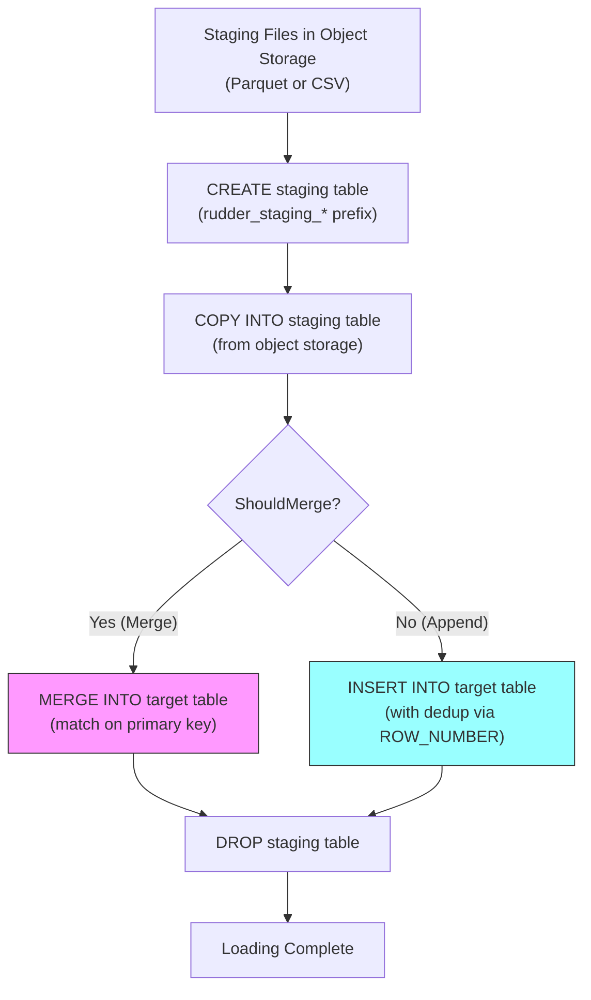

# Databricks Delta Lake Connector Guide

RudderStack's Databricks Delta Lake connector loads event data into Databricks-managed Delta tables through the Databricks SQL connector (`databricks-sql-go`). It supports both **merge** and **append** loading strategies, staging table management with automatic cleanup, COPY INTO / INSERT INTO / MERGE INTO SQL flows, date-based partitioning via generated columns, and AWS temporary credentials (STS tokens) for secure cross-account S3 access. The connector uses the `sqlconnect-go` library to manage Databricks SQL endpoint connections with configurable retry semantics, slow query detection, and credential masking.

> **Internal package name:** `deltalake`, mapped to `warehouseutils.DELTALAKE`

**Related Documentation:**

[Warehouse Overview](overview.md) | [Schema Evolution](schema-evolution.md) | [Encoding Formats](encoding-formats.md)

> Source: `warehouse/integrations/deltalake/deltalake.go`

---

## Prerequisites

Before configuring the Databricks Delta Lake connector, ensure you have:

- **Databricks workspace** with an active SQL warehouse or SQL endpoint (serverless or classic)
- **Databricks access token** or **OAuth credentials** (client ID + client secret) for authentication
- **Object storage** for staging files — Amazon S3, Azure Data Lake Storage (ADLS), or Google Cloud Storage (GCS)
- **Catalog and schema** (namespace) configured in Unity Catalog or Hive Metastore
- **Network connectivity** from the RudderStack server to the Databricks SQL endpoint host and port

**Constraints:**

| Constraint | Value | Description |
|-----------|-------|-------------|
| Maximum table name length | `127` characters | Enforced by `rudder-transformer` for Delta Lake destinations |
| Excluded columns | `event_date` | Auto-generated partition column; excluded from query generation |

> Source: `warehouse/integrations/deltalake/deltalake.go:36-98`

---

## Setup Steps

### 1. Configure Databricks SQL Endpoint

Obtain the following connection details from your Databricks workspace:

1. Navigate to **SQL Warehouses** in the Databricks UI
2. Select your SQL warehouse and click **Connection details**
3. Record the **Server hostname**, **Port**, and **HTTP path**

### 2. Configure Authentication

The connector supports two authentication methods:

**Access Token Authentication (default):**
1. In Databricks, navigate to **User Settings → Access Tokens**
2. Generate a new personal access token
3. Configure the token in the RudderStack destination settings

**OAuth Authentication:**
1. Register an OAuth application in your Databricks workspace
2. Record the **Client ID** and **Client Secret**
3. Enable OAuth in the destination configuration by setting `useOAuth = true`

When OAuth is enabled, the connector uses `OAuthClientID` and `OAuthClientSecret` instead of the access token for authentication.

> Source: `warehouse/integrations/deltalake/deltalake.go:186-220`

### 3. Configure Catalog and Schema

Set the Unity Catalog **catalog** name and the target **schema** (namespace) for your data tables. The connector automatically creates the schema if it does not exist using `CREATE SCHEMA IF NOT EXISTS`.

```sql
CREATE SCHEMA IF NOT EXISTS <namespace>;
```

> Source: `warehouse/integrations/deltalake/deltalake.go:467-506`

### 4. Configure Staging Storage

Configure the object storage backend (S3, ADLS, or GCS) where staging files are stored. For S3 with STS token support, ensure your IAM roles and policies grant the Databricks SQL endpoint READ access to the staging bucket.

If using an **external location**, enable the external location setting and provide the storage path. Tables will be created with an explicit `LOCATION` clause:

```sql
CREATE OR REPLACE TABLE <namespace>.<table>
  ( ... )
  USING DELTA
  LOCATION '<external_location>/<namespace>/<table>';
```

> Source: `warehouse/integrations/deltalake/deltalake.go:566-576`

---

## Configuration Parameters

### Connection Parameters

| Parameter | Type | Description |
|-----------|------|-------------|
| `host` | string | Databricks SQL endpoint server hostname |
| `port` | int | Databricks SQL endpoint port |
| `path` | string | HTTP path for the SQL warehouse |
| `token` | string | Personal access token (when not using OAuth) |
| `catalog` | string | Unity Catalog catalog name |
| `useOAuth` | bool | Enable OAuth authentication instead of token-based |
| `oauthClientId` | string | OAuth client ID (when `useOAuth = true`) |
| `oauthClientSecret` | string | OAuth client secret (when `useOAuth = true`) |
| `enableExternalLocation` | bool | Use external storage location for table data |
| `externalLocation` | string | External storage path (e.g., `s3://bucket/prefix`) |
| `useSTSTokens` | bool | Use AWS STS temporary credentials for S3 access |

> Source: `warehouse/integrations/deltalake/deltalake.go:186-220`

### Tuning Parameters

| Parameter | Default | Type | Description |
|-----------|---------|------|-------------|
| `Warehouse.deltalake.allowMerge` | `true` | bool | Enable MERGE-based deduplication loading strategy |
| `Warehouse.deltalake.enablePartitionPruning` | `true` | bool | Enable partition pruning for date-based partitions |
| `Warehouse.deltalake.slowQueryThreshold` | `5m` | duration | Threshold for logging slow SQL queries |
| `Warehouse.deltalake.maxRetries` | `10` | int | Maximum number of retry attempts for transient failures |
| `Warehouse.deltalake.retryMinWait` | `1s` | duration | Minimum wait time between retries |
| `Warehouse.deltalake.retryMaxWait` | `300s` | duration | Maximum wait time between retries (exponential backoff cap) |
| `Warehouse.deltalake.maxErrorLength` | `65536` | int | Maximum error message length in bytes (64 KB); longer messages are truncated |
| `Warehouse.deltalake.loadTableStrategy` | `MERGE` | string | Default load table strategy |

> Source: `warehouse/integrations/deltalake/deltalake.go:136-161`, `config/config.yaml:182-183`

### Session Parameters

The connector sets the following Databricks SQL session parameter on every connection:

| Parameter | Value | Purpose |
|-----------|-------|---------|
| `ansi_mode` | `false` | Disables ANSI SQL mode to permit implicit type conversions and non-standard SQL behavior required by the loading pipeline |

> Source: `warehouse/integrations/deltalake/deltalake.go:214-216`

---

## Data Type Mappings

### RudderStack → Delta Lake

When creating tables and columns, RudderStack types are mapped to Delta Lake types as follows:

| RudderStack Type | Delta Lake Type |
|-----------------|----------------|
| `boolean` | `BOOLEAN` |
| `int` | `BIGINT` |
| `float` | `DOUBLE` |
| `string` | `STRING` |
| `datetime` | `TIMESTAMP` |
| `date` | `DATE` |

> Source: `warehouse/integrations/deltalake/deltalake.go:50-58`

### Delta Lake → RudderStack

When fetching schema from the warehouse, Delta Lake types are reverse-mapped to RudderStack types:

| Delta Lake Type | RudderStack Type |
|----------------|-----------------|
| `TINYINT` / `tinyint` | `int` |
| `SMALLINT` / `smallint` | `int` |
| `INT` / `int` | `int` |
| `BIGINT` / `bigint` | `int` |
| `DECIMAL` / `decimal` | `float` |
| `FLOAT` / `float` | `float` |
| `DOUBLE` / `double` | `float` |
| `BOOLEAN` / `boolean` | `boolean` |
| `STRING` / `string` | `string` |
| `DATE` / `date` | `date` |
| `TIMESTAMP` / `timestamp` | `datetime` |

**Note:** The reverse mapping supports both uppercase and lowercase Delta Lake type names to handle varying case conventions from the Databricks DESCRIBE output.

> Source: `warehouse/integrations/deltalake/deltalake.go:60-85`

### Semi-Structured Types

The following Delta Lake semi-structured types are recognized but do not have a direct RudderStack mapping. When encountered during schema fetch, they are tracked via the `rudder_missing_datatype` metric and the column is excluded from the schema:

- `array`
- `map`
- `struct`

> Source: `warehouse/integrations/deltalake/deltalake.go:87-91`

### Generated Columns

Tables containing a `received_at` column automatically receive a generated partition column:

```sql
event_date DATE GENERATED ALWAYS AS ( CAST(received_at AS DATE) )
```

The `event_date` column is excluded from all query generation (inserts, merges, copies) via the `excludeColumnsMap` to avoid conflicts with the auto-generated value. Tables with `received_at` are also partitioned by `event_date` using `PARTITIONED BY(event_date)`.

> Source: `warehouse/integrations/deltalake/deltalake.go:93-98`, `warehouse/integrations/deltalake/deltalake.go:508-564`

---

## Loading Strategies

The Databricks Delta Lake connector implements a multi-step loading pipeline that selects between **merge** and **append** strategies based on the `ShouldMerge()` decision function. The decision is made as follows:

- **Merge** is used when the uploader cannot append (`Uploader.CanAppend()` returns `false`), OR when merge is explicitly allowed (`Warehouse.deltalake.allowMerge = true`) and the destination does not prefer append mode
- **Append** is used when the uploader can append AND either merge is disabled or the destination prefers append mode

> Source: `warehouse/integrations/deltalake/deltalake.go:1434-1440`

### Loading Flow



### Step 1: Create Staging Table

For every table load, the connector creates a temporary staging table with the `rudder_staging_` prefix:

```sql
CREATE TABLE IF NOT EXISTS <namespace>.rudder_staging_<table>
  ( <columns> )
  USING DELTA
  [PARTITIONED BY(event_date)];
```

The staging table uses the full warehouse schema (not just the upload schema) to accommodate schema evolution — new columns are included with their Delta Lake types. Tables with a `received_at` column include the auto-generated `event_date` partition column.

> Source: `warehouse/integrations/deltalake/deltalake.go:508-539`, `warehouse/integrations/deltalake/deltalake.go:659-668`

### Step 2: COPY INTO Staging Table

Data is copied from object storage into the staging table using Databricks' `COPY INTO` command. The file format depends on the load file type:

**Parquet format:**

```sql
COPY INTO <namespace>.rudder_staging_<table>
FROM (
  SELECT <columns>::<types>
  FROM '<load_folder>'
)
FILEFORMAT = PARQUET
PATTERN = '*.parquet'
COPY_OPTIONS ('force' = 'true')
[CREDENTIALS (...)];
```

**CSV format:**

```sql
COPY INTO <namespace>.rudder_staging_<table>
FROM (
  SELECT CAST(_c0 AS <type>) AS <col>, ...
  FROM '<load_folder>'
)
FILEFORMAT = CSV
PATTERN = '*.gz'
FORMAT_OPTIONS (
  'compression' = 'gzip',
  'quote' = '"',
  'escape' = '"',
  'multiLine' = 'true'
)
COPY_OPTIONS ('force' = 'true')
[CREDENTIALS (...)];
```

For Parquet files, column references use the `column::type` cast syntax. For CSV files, positional column references (`_c0`, `_c1`, ...) are cast to the target type. Columns that exist in the warehouse schema but not in the upload schema are filled with `NULL`.

> Source: `warehouse/integrations/deltalake/deltalake.go:711-785`, `warehouse/integrations/deltalake/deltalake.go:943-976`

### Step 3a: Merge Strategy (Dedup Tables)

When `ShouldMerge()` returns `true`, the connector uses a `MERGE INTO` statement to upsert data from the staging table into the target table. Deduplication is performed via a `ROW_NUMBER()` window function partitioned by the primary key and ordered by `RECEIVED_AT DESC`, ensuring only the latest record per key is merged.

```sql
MERGE INTO <namespace>.<table> AS MAIN
USING (
  SELECT * FROM (
    SELECT *,
      row_number() OVER (
        PARTITION BY <primary_key>
        ORDER BY RECEIVED_AT DESC
      ) AS _rudder_staging_row_number
    FROM <namespace>.rudder_staging_<table>
  ) AS q
  WHERE _rudder_staging_row_number = 1
) AS STAGING
ON MAIN.<primary_key> = STAGING.<primary_key>
WHEN MATCHED THEN UPDATE SET
  MAIN.<col1> = STAGING.<col1>, ...
WHEN NOT MATCHED THEN INSERT (<columns>)
VALUES (STAGING.<col1>, ...);
```

The merge returns four metrics: `rows_affected`, `rows_updated`, `rows_deleted`, and `rows_inserted`.

> Source: `warehouse/integrations/deltalake/deltalake.go:838-902`

### Step 3b: Append Strategy (Event Tables)

When `ShouldMerge()` returns `false`, the connector uses an `INSERT INTO` statement with deduplication:

```sql
INSERT INTO <namespace>.<table> (<columns>)
SELECT <columns>
FROM (
  SELECT * FROM (
    SELECT *,
      row_number() OVER (
        PARTITION BY <primary_key>
        ORDER BY RECEIVED_AT DESC
      ) AS _rudder_staging_row_number
    FROM <namespace>.rudder_staging_<table>
  ) AS q
  WHERE _rudder_staging_row_number = 1
);
```

Even in append mode, within-batch deduplication is applied using `ROW_NUMBER()` to ensure only the latest record per primary key within the current batch is inserted. The insert returns `rows_affected` and `rows_inserted`.

> Source: `warehouse/integrations/deltalake/deltalake.go:787-836`

### Step 4: Drop Staging Table

After the load completes (whether merge or append), the staging table is dropped via a deferred cleanup:

```sql
DROP TABLE <namespace>.rudder_staging_<table>;
```

If the staging table drop fails, a warning is logged but the load is not rolled back — the data has already been committed to the target table.

> Source: `warehouse/integrations/deltalake/deltalake.go:670-677`

### Primary Key Mapping

The primary key used for deduplication varies by table:

| Table | Primary Key Column |
|-------|-------------------|
| `users` | `id` |
| `identifies` | `id` |
| `rudder_discards` | `row_id` |
| All other tables | `id` (default) |

> Source: `warehouse/integrations/deltalake/deltalake.go:100-104`

### Staging Table Patterns

The connector uses regex patterns to distinguish between staging and non-staging tables:

| Pattern | Regex | Purpose |
|---------|-------|---------|
| Staging tables | `^rudder_staging_.*$` | Matches `rudder_staging_*` tables for cleanup operations |
| Non-staging tables | `^(?!rudder_staging_.*$).*` | Matches all tables except staging; used during schema fetch |

> Source: `warehouse/integrations/deltalake/deltalake.go:45-48`

---

## User Table Loading

The Databricks connector implements a specialized loading flow for `identifies` and `users` tables that maintains user-level deduplication across identify events.

### Flow

1. **Load identifies table** — The `identifies` table is loaded first using the standard merge/append flow, but the staging table is retained (not dropped immediately)
2. **Build users staging table** — A `CREATE TABLE ... AS SELECT` query builds the users staging table by:
   - Selecting existing user records from the `users` table where the user ID appears in the identifies staging table
   - Unioning with new identify records (using `user_id` from identifies)
   - Applying `FIRST_VALUE(<column>, TRUE) OVER (PARTITION BY id ORDER BY received_at DESC)` to resolve each trait to its most recent non-null value
   - Selecting `DISTINCT *` to eliminate duplicates
3. **Merge or insert users** — The users staging table is merged or inserted into the target `users` table using the same merge/append strategy as regular tables
4. **Cleanup** — Both the identifies and users staging tables are dropped

> Source: `warehouse/integrations/deltalake/deltalake.go:1022-1248`

---

## AWS Temporary Credentials

When staging files are stored in Amazon S3, the connector supports AWS Security Token Service (STS) temporary credentials for secure cross-account access. This avoids storing long-lived AWS access keys in the destination configuration.

### How It Works

1. The connector checks if the object storage type is S3 **and** either RudderStack-managed storage or STS tokens are enabled
2. If eligible, it calls `warehouseutils.GetTemporaryS3Cred()` to obtain a temporary access key ID, secret access key, and session token
3. The credentials are injected into the `COPY INTO` SQL statement as a `CREDENTIALS` clause:

```sql
CREDENTIALS (
  'awsKeyId' = '<temp_access_key_id>',
  'awsSecretKey' = '<temp_secret_access_key>',
  'awsSessionToken' = '<session_token>'
)
```

### S3A Protocol

When AWS credentials are present (either permanent or temporary), the connector rewrites the staging file URI from `s3://` to `s3a://` protocol. The S3A client is required for STS authentication and provides better compatibility with Databricks' COPY INTO command.

> Source: `warehouse/integrations/deltalake/deltalake.go:978-1020`

### Security

Credential values are masked in SQL query logs using regex-based secret redaction:

| Pattern | Replacement |
|---------|-------------|
| `'awsKeyId' = '<value>'` | `'awsKeyId' = '***'` |
| `'awsSecretKey' = '<value>'` | `'awsSecretKey' = '***'` |
| `'awsSessionToken' = '<value>'` | `'awsSessionToken' = '***'` |

> Source: `warehouse/integrations/deltalake/deltalake.go:249-253`

---

## Schema Operations

### Schema Creation

The connector creates the target schema (namespace) before every schema fetch operation. This ensures the schema always exists, even on first run:

```sql
SHOW SCHEMAS LIKE '<namespace>';
-- If no rows returned:
CREATE SCHEMA IF NOT EXISTS <namespace>;
```

> Source: `warehouse/integrations/deltalake/deltalake.go:467-506`

### Schema Fetch

Schema discovery uses a two-step process:

1. **List tables** — Executes `SHOW TABLES FROM <namespace> LIKE '<regex>'` to discover non-staging tables
2. **Describe columns** — For each table, executes `DESCRIBE QUERY TABLE <namespace>.<table>` to retrieve column names and types

The schema is filtered to exclude:
- Staging tables (matched by `rudder_staging_*` pattern)
- The `event_date` generated column
- Semi-structured types (`array`, `map`, `struct`) which are tracked via metrics but excluded from the schema

If the schema does not exist, the `[SCHEMA_NOT_FOUND]` sentinel in the error message triggers a graceful empty-schema return instead of a failure.

> Source: `warehouse/integrations/deltalake/deltalake.go:344-465`

### Table Creation

Tables are created with the `USING DELTA` clause and optional partitioning:

```sql
CREATE TABLE IF NOT EXISTS <namespace>.<table>
  ( <columns_with_types> )
  USING DELTA
  [LOCATION '<external_location>/<namespace>/<table>']
  [PARTITIONED BY(event_date)];
```

When an external location is configured, `CREATE OR REPLACE TABLE` is used instead of `CREATE TABLE IF NOT EXISTS` to ensure the table definition is updated.

> Source: `warehouse/integrations/deltalake/deltalake.go:508-539`

### Column Addition

New columns are added to existing tables using `ALTER TABLE ADD COLUMNS`. The connector first fetches the current table attributes and filters out columns that already exist, adding only truly new columns:

```sql
ALTER TABLE <namespace>.<table>
ADD COLUMNS ( <col1> <type1>, <col2> <type2>, ... );
```

> Source: `warehouse/integrations/deltalake/deltalake.go:578-615`

For comprehensive schema evolution behavior including TTL caching, diff detection, and type widening, see [Schema Evolution](schema-evolution.md).

---

## Error Handling and Troubleshooting

### Error Mappings

The connector classifies the following Databricks error patterns into structured error types for automated retry and alerting:

| Error Pattern | Error Type | Description |
|--------------|------------|-------------|
| `UnauthorizedAccessException: PERMISSION_DENIED: User does not have READ FILES on External Location` | Permission Error | The Databricks service principal or user lacks READ FILES permission on the external storage location |
| `SecurityException: User does not have permission CREATE on CATALOG` | Permission Error | The authenticated user lacks CREATE permission on the Unity Catalog |
| `ENDPOINT_NOT_FOUND` | Resource Not Found | The configured SQL endpoint does not exist or has been deleted |
| `RESOURCE_DOES_NOT_EXIST` | Resource Not Found | A referenced resource (table, schema, catalog) does not exist |

> Source: `warehouse/integrations/deltalake/deltalake.go:106-123`

### Connection Timeout

When a connection test (`TestConnection`) times out with `context.DeadlineExceeded`, the connector returns a specific guidance message:

> *"connection timeout: verify the availability of the SQL warehouse/cluster on Databricks (this process may take up to 15 minutes). Once the SQL warehouse/cluster is ready, please attempt your connection again"*

This commonly occurs when the Databricks SQL warehouse is in a stopped state and needs to start up.

> Source: `warehouse/integrations/deltalake/deltalake.go:1308-1319`

### Error Truncation

Error messages exceeding `maxErrorLength` (default: 64 KB) are truncated to prevent oversized error payloads in the job queue. This is configured via `Warehouse.deltalake.maxErrorLength`.

> Source: `warehouse/integrations/deltalake/deltalake.go:541-548`

### Troubleshooting Guide

| Symptom | Likely Cause | Resolution |
|---------|-------------|------------|
| `PERMISSION_DENIED: User does not have READ FILES` | Missing external location permission | Grant `READ FILES` on the external location to the Databricks service principal |
| `User does not have permission CREATE on CATALOG` | Missing catalog permission | Grant `CREATE` permission on the target catalog |
| `ENDPOINT_NOT_FOUND` | SQL warehouse deleted or misconfigured | Verify the SQL warehouse exists and the host/path configuration is correct |
| `RESOURCE_DOES_NOT_EXIST` | Schema or table deleted externally | The connector will auto-create the schema; check if the table was dropped manually |
| Connection timeout | SQL warehouse is starting up | Wait up to 15 minutes for the SQL warehouse to become available |
| `[SCHEMA_NOT_FOUND]` in logs | Schema does not exist yet | This is handled gracefully — the connector creates the schema automatically |
| Slow queries logged | Queries exceed `slowQueryThreshold` | Increase SQL warehouse size or optimize the query workload; adjust `Warehouse.deltalake.slowQueryThreshold` |
| `rudder_missing_datatype` metric | Semi-structured column type (array/map/struct) | These types are not supported in the schema mapping; the column is excluded |

---

## Idempotency and Backfill

### MERGE-Based Idempotent Loading

When the merge strategy is active, loading is **idempotent by design**:

- The `MERGE INTO` statement matches on the primary key column (`id`, `row_id`)
- If a record with the same primary key already exists, it is **updated** with the new values
- If no matching record exists, the record is **inserted**
- Within each batch, `ROW_NUMBER() OVER (PARTITION BY <pk> ORDER BY RECEIVED_AT DESC)` ensures only the most recent event per key is applied

This means re-loading the same staging files produces the same final state in the target table — duplicate events are deduplicated automatically.

### Append Mode Deduplication

Even in append mode, within-batch deduplication is applied. The `INSERT INTO` statement uses the same `ROW_NUMBER()` window function to select only the latest record per primary key within the current batch. However, append mode does **not** deduplicate against records already in the target table — it only prevents duplicates within a single load batch.

### Staging Table Cleanup

Staging tables are cleaned up at two points:

1. **After each load** — The staging table is dropped in a deferred cleanup after the merge/insert completes
2. **During cleanup** — The `Cleanup()` method (called at the end of each upload cycle) drops all dangling staging tables matching the `^rudder_staging_.*$` pattern

This two-level cleanup ensures staging tables do not accumulate even if individual loads fail before reaching the drop step.

> Source: `warehouse/integrations/deltalake/deltalake.go:258-329`, `warehouse/integrations/deltalake/deltalake.go:1284-1301`

### Backfill Support

Backfill operations leverage the same COPY INTO pipeline used for regular loads:

1. Historical staging files are placed in object storage following the standard folder structure
2. The warehouse upload state machine processes them through the normal 7-state lifecycle (see [Warehouse Overview — Upload State Machine](overview.md#upload-state-machine))
3. The merge strategy ensures backfilled data is deduplicated against existing records
4. `COPY_OPTIONS ('force' = 'true')` ensures files are re-loaded even if previously processed by COPY INTO

The `force = true` copy option is critical for backfill — without it, Databricks' COPY INTO would skip files that have been previously loaded, preventing data corrections.

> Source: `warehouse/integrations/deltalake/deltalake.go:746-751`, `warehouse/integrations/deltalake/deltalake.go:771-772`

---

## Performance Tuning

### Parallel Load Configuration

The warehouse service controls load parallelism through global and per-connector settings:

| Parameter | Default | Description |
|-----------|---------|-------------|
| `Warehouse.noOfWorkers` | `8` | Number of concurrent warehouse worker routines |
| `Warehouse.noOfSlaveWorkerRoutines` | `4` | Number of slave worker goroutines (distributed mode) |
| `Warehouse.uploadFreq` | `1800s` | Upload frequency (time between upload cycles) |
| `Warehouse.stagingFilesBatchSize` | `960` | Maximum staging files per upload batch |

For Databricks specifically, parallel load behavior is controlled by the number of table uploads processed concurrently within each upload cycle. Unlike some other warehouse connectors, the Delta Lake connector does not have a dedicated `maxParallelLoads` setting in the default configuration — parallelism is governed by the global `Warehouse.noOfWorkers` setting.

> Source: `config/config.yaml:145-161`

### SQL Endpoint Sizing

For optimal throughput, size your Databricks SQL endpoint based on the expected load:

| Workload | Recommended Size | Rationale |
|----------|-----------------|-----------|
| Development / low volume | Small (2X-Small) | Sufficient for < 1M events/day |
| Production / medium volume | Medium | Handles 1M–50M events/day with concurrent loads |
| Production / high volume | Large or X-Large | Required for > 50M events/day or many concurrent tables |

**Scaling considerations:**

- Each table load executes COPY INTO + MERGE/INSERT as separate SQL statements — larger endpoints reduce query execution time
- The `maxRetries` (default: 10) with exponential backoff (`retryMinWait`: 1s, `retryMaxWait`: 300s) handles transient failures from endpoint auto-scaling
- Set `slowQueryThreshold` (default: 5 minutes) to detect queries that may benefit from a larger endpoint

### Staging File Organization

Staging files are organized in object storage using the following folder hierarchy:

```
<bucket>/<prefix>/<source_id>/<destination_id>/<table_name>/
```

For Parquet files, the connector uses `PATTERN = '*.parquet'` to load all files in the folder. For CSV files, `PATTERN = '*.gz'` loads all gzipped CSV files. This pattern-based loading allows multiple staging files to be loaded in a single COPY INTO operation.

### Retry Configuration

The connector implements exponential backoff retry for transient Databricks errors:

| Parameter | Default | Description |
|-----------|---------|-------------|
| `Warehouse.deltalake.maxRetries` | `10` | Maximum retry attempts |
| `Warehouse.deltalake.retryMinWait` | `1s` | Initial retry wait time |
| `Warehouse.deltalake.retryMaxWait` | `300s` | Maximum retry wait time (5 minutes) |

The retry parameters are passed to the `sqlconnect-go` driver, which handles automatic retries for connection-level and query-level transient errors.

> Source: `warehouse/integrations/deltalake/deltalake.go:157-159`, `warehouse/integrations/deltalake/deltalake.go:217-219`

### Monitoring

Key metrics emitted by the Databricks connector:

| Metric | Type | Tags | Description |
|--------|------|------|-------------|
| `dedup_rows` | Counter | `sourceID`, `sourceType`, `sourceCategory`, `destID`, `destType`, `workspaceId`, `tableName` | Number of rows deduplicated during user table loading |
| `rudder_missing_datatype` | Counter | `datatype` | Count of unrecognized Delta Lake data types encountered during schema fetch |
| SQL query duration | Histogram | (via `sqlmiddleware`) | Query execution time, with slow query logging above `slowQueryThreshold` |

> Source: `warehouse/integrations/deltalake/deltalake.go:1225-1233`, `warehouse/integrations/deltalake/deltalake.go:394-404`

---

## Unsupported Operations

The following operations are not supported by the Databricks Delta Lake connector:

| Operation | Status | Notes |
|----------|--------|-------|
| `AlterColumn` | No-op | Returns empty response; Delta Lake column type changes require table recreation |
| `DeleteBy` | Not implemented | Returns `NotImplementedErrorCode`; row-level deletion by criteria is not supported |
| `LoadIdentityMergeRulesTable` | No-op | Identity merge rules are not loaded to Delta Lake |
| `LoadIdentityMappingsTable` | No-op | Identity mappings are not loaded to Delta Lake |
| `IsEmpty` | Always returns `false` | Emptiness check is not implemented |

> Source: `warehouse/integrations/deltalake/deltalake.go:618-620`, `warehouse/integrations/deltalake/deltalake.go:1274-1306`, `warehouse/integrations/deltalake/deltalake.go:1430-1432`
