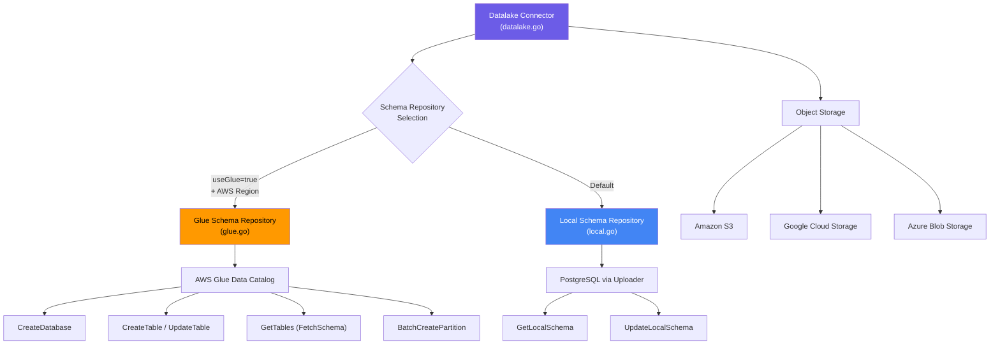
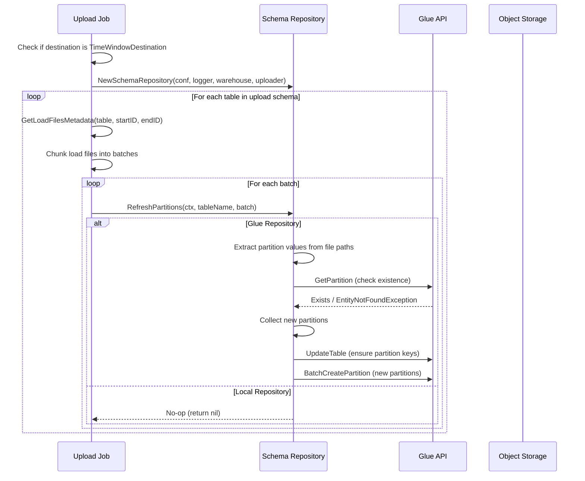

# S3/GCS/Azure Datalake Connector Guide

RudderStack's Datalake connector exports event data as Parquet files to Amazon S3, Google Cloud Storage (GCS), or Azure Blob Storage. Schema management is handled via a pluggable **Schema Repository** layer — either the **AWS Glue Data Catalog** for production S3-based data lake architectures, or a **Local** PostgreSQL-backed repository for development, GCS, and Azure scenarios. The Datalake connector enables columnar data lake architectures with standard file formats, time-window partitioning, and automatic schema evolution.

The connector supports three destination types that share a unified codebase:

| Destination Type | Storage Backend | Constant |
|------------------|----------------|----------|
| S3 Datalake | Amazon S3 | `S3_DATALAKE` |
| GCS Datalake | Google Cloud Storage | `GCS_DATALAKE` |
| Azure Datalake | Azure Blob Storage | `AZURE_DATALAKE` |

**Related Documentation:**

[Warehouse Overview](overview.md) | [Schema Evolution](schema-evolution.md) | [Encoding Formats](encoding-formats.md)

> Source: `warehouse/integrations/datalake/datalake.go`, `warehouse/utils/utils.go:53-55`

---

## Prerequisites

Before configuring the Datalake connector, ensure you have the following:

- **Storage bucket or container** — One of:
  - An Amazon S3 bucket (for `S3_DATALAKE`)
  - A Google Cloud Storage bucket (for `GCS_DATALAKE`)
  - An Azure Blob Storage container (for `AZURE_DATALAKE`)
- **Storage access credentials** — IAM role, service account, or access key with read/write permissions to the target bucket or container
- **For AWS Glue schema management** (optional, S3 only):
  - AWS Glue Data Catalog access in the target AWS region
  - IAM permissions for Glue operations: `glue:CreateDatabase`, `glue:CreateTable`, `glue:UpdateTable`, `glue:GetTables`, `glue:GetPartition`, `glue:BatchCreatePartition`
  - AWS Lake Formation permissions if Lake Formation governance is enabled
- **For Local schema management** (default):
  - No additional prerequisites — schema is tracked in the RudderStack warehouse PostgreSQL database via the Uploader interface

> **Note:** The Datalake connector delegates all schema operations to a `SchemaRepository` interface. The connector itself does not directly interact with the warehouse schema — it relies entirely on the selected schema repository implementation for metadata management.

> Source: `warehouse/integrations/datalake/datalake.go:32-38`, `warehouse/integrations/datalake/schema-repository/schema_repository.go:38-45`

---

## Setup Steps

### Step 1: Select Storage Backend

Choose your storage backend based on your cloud infrastructure. Each maps to a specific RudderStack destination type:

```
S3 Datalake    → Amazon S3 bucket
GCS Datalake   → Google Cloud Storage bucket
Azure Datalake → Azure Blob Storage container
```

Configure the destination in your RudderStack workspace with the appropriate connection credentials for your chosen cloud provider.

### Step 2: Configure Schema Repository

The schema repository determines how table metadata is tracked. RudderStack automatically selects the repository based on two destination configuration settings:

- **`useGlue`** — Boolean flag enabling AWS Glue catalog integration
- **AWS region availability** — Whether the destination config includes an AWS region

The selection logic is:

```
if useGlue == true AND hasAWSRegion == true:
    → Glue Schema Repository
else:
    → Local Schema Repository
```

> Source: `warehouse/integrations/datalake/schema-repository/schema_repository.go:47-58`

**For Glue Schema Repository** (recommended for S3 Datalake production):

1. Enable the `useGlue` setting in your destination configuration
2. Configure the AWS region in your destination settings
3. Ensure IAM credentials have Glue API access
4. Optionally configure an S3 prefix for table data organization

**For Local Schema Repository** (default for GCS/Azure or development):

1. No additional configuration required
2. Schema is automatically tracked in the RudderStack warehouse PostgreSQL database
3. Schema operations use the Uploader's `GetLocalSchema` and `UpdateLocalSchema` methods

### Step 3: Configure Namespace and Storage Path

Configure the namespace (database/schema name) and optional storage prefix:

- **Namespace** — The Glue database name (for Glue) or logical schema grouping (for Local)
- **Bucket name** (`bucketName`) — The target S3 bucket name
- **Prefix** (`prefix`) — Optional path prefix within the bucket for organizing data
- **Time window layout** (`timeWindowLayout`) — Partition layout pattern for time-based partitioning (Glue only)

Object storage paths follow the pattern:

```
s3://<bucket>/<prefix>/<WAREHOUSE_DATALAKE_FOLDER_NAME>/<namespace>/<tableName>/
```

Where `WAREHOUSE_DATALAKE_FOLDER_NAME` defaults to `rudder-datalake`.

> Source: `warehouse/integrations/datalake/schema-repository/glue.go:351-359`, `warehouse/utils/utils.go:611-614`

---

## Configuration Parameters

### Server-Side Configuration

The following parameters are configured in `config/config.yaml` or via environment variables:

| Parameter | Default | Type | Range | Description |
|-----------|---------|------|-------|-------------|
| `Warehouse.s3_datalake.maxParallelLoads` | `8` | int | ≥ 1 | Maximum number of parallel table load operations for S3 Datalake destinations |
| `Warehouse.gcs_datalake.maxParallelLoads` | `8` | int | ≥ 1 | Maximum number of parallel table load operations for GCS Datalake destinations |
| `Warehouse.azure_datalake.maxParallelLoads` | `8` | int | ≥ 1 | Maximum number of parallel table load operations for Azure Datalake destinations |
| `Warehouse.s3_datalake.columnCountLimit` | `10000` | int | ≥ 1 | Maximum number of columns allowed per table for S3 Datalake destinations |
| `WAREHOUSE_DATALAKE_FOLDER_NAME` | `"rudder-datalake"` | string | Valid folder name | Root folder name in object storage for datalake table data |

> Source: `warehouse/integrations/config/config.go:17-18,31`, `warehouse/utils/utils.go:613`

### Destination Configuration Settings

The following settings are configured per-destination in the RudderStack workspace:

| Setting | Config Key | Type | Description |
|---------|-----------|------|-------------|
| Use Glue | `useGlue` | bool | Enable AWS Glue Data Catalog for schema management (S3 only) |
| Bucket Name | `bucketName` | string | Target S3 bucket name |
| Prefix | `prefix` | string | Optional path prefix within the storage bucket |
| Time Window Layout | `timeWindowLayout` | string | Partition time window layout (e.g., `date=2006-01-02`); enables Glue partition management |
| Access Key | `accessKey` | string | AWS access key for authentication |
| Access Key ID | `accessKeyID` | string | AWS access key ID for authentication |
| Sync Frequency | `syncFrequency` | string | Warehouse sync frequency |
| Sync Start At | `syncStartAt` | string | Time of day to start syncs |

> Source: `warehouse/internal/model/settings.go:20,34-35,38`

### Data Type Mappings

The schema repository uses the following type mappings between RudderStack types and the Datalake/Glue storage layer:

**RudderStack → Datalake (Glue/Parquet) Type Mapping:**

| RudderStack Type | Datalake Type |
|-----------------|---------------|
| `boolean` | `boolean` |
| `int` | `bigint` |
| `bigint` | `bigint` |
| `float` | `double` |
| `string` | `varchar(65535)` |
| `datetime` | `timestamp` |

**Datalake → RudderStack Reverse Mapping:**

| Datalake Type | RudderStack Type |
|---------------|-----------------|
| `boolean` | `boolean` |
| `bigint` | `int` |
| `double` | `float` |
| `varchar(512)` | `string` |
| `varchar(65535)` | `string` |
| `timestamp` | `datetime` |
| `string` | `string` |

> Source: `warehouse/integrations/datalake/schema-repository/schema_repository.go:15-36`

---

## Schema Repository

The Datalake connector delegates all schema management operations to a `SchemaRepository` interface. This design decouples storage (Parquet files on object storage) from metadata management (table definitions and column types), enabling flexible schema tracking strategies.

### SchemaRepository Interface

```go
type SchemaRepository interface {
    FetchSchema(ctx context.Context, warehouse model.Warehouse) (model.Schema, error)
    CreateSchema(ctx context.Context) (err error)
    CreateTable(ctx context.Context, tableName string, columnMap model.TableSchema) (err error)
    AddColumns(ctx context.Context, tableName string, columnsInfo []warehouseutils.ColumnInfo) (err error)
    AlterColumn(ctx context.Context, tableName, columnName, columnType string) (model.AlterTableResponse, error)
    RefreshPartitions(ctx context.Context, tableName string, loadFiles []warehouseutils.LoadFile) error
}
```

The interface provides six operations: fetching the current schema, creating the schema (database/namespace), creating tables, adding columns, altering column types, and refreshing time-window partitions.

> Source: `warehouse/integrations/datalake/schema-repository/schema_repository.go:38-45`

### Architecture Diagram



### Glue Schema Repository

The Glue Schema Repository integrates with the **AWS Glue Data Catalog** to manage table metadata for S3-backed data lakes. It uses the Parquet Hive SerDe for serialization/deserialization, enabling compatibility with query engines such as Amazon Athena, Spark, and Presto.

**Initialization:**

The Glue repository creates an AWS SDK v2 Glue client using destination credentials and region:

1. Creates an AWS session configuration from destination settings
2. Builds `aws.Config` with credentials and region
3. Initializes the `glue.Client` with the session
4. Extracts S3 bucket name and prefix from destination configuration

> Source: `warehouse/integrations/datalake/schema-repository/glue.go:49-72`

**Glue Table Configuration:**

| Property | Value |
|----------|-------|
| SerDe Name | `ParquetHiveSerDe` |
| Serialization Library | `org.apache.hadoop.hive.ql.io.parquet.serde.ParquetHiveSerDe` |
| Input Format | `org.apache.hadoop.hive.ql.io.parquet.MapredParquetInputFormat` |
| Output Format | `org.apache.hadoop.hive.ql.io.parquet.MapredParquetOutputFormat` |
| Table Type | `EXTERNAL_TABLE` |

> Source: `warehouse/integrations/datalake/schema-repository/glue.go:28-32`

**Key Operations:**

| Operation | Behavior |
|-----------|----------|
| `CreateSchema` | Creates a Glue database with the namespace name. Idempotent — silently ignores `AlreadyExistsException`. |
| `CreateTable` | Creates an `EXTERNAL_TABLE` in Glue with partition keys (from `timeWindowLayout`), column definitions, and Parquet storage descriptor. Idempotent — silently ignores `AlreadyExistsException`. |
| `AddColumns` / `AlterColumn` | Updates the Glue table by fetching the current schema, merging new columns, and calling `UpdateTable` with the updated storage descriptor and partition keys. |
| `FetchSchema` | Paginated listing of all Glue tables in the namespace using `GetTables`. Maps Glue column types back to RudderStack types using the reverse type mapping. Handles `EntityNotFoundException` gracefully by returning an empty schema. |
| `RefreshPartitions` | Extracts partition values from load file paths using regex, checks for existing partitions via `GetPartition`, and batch-creates new partitions using `BatchCreatePartition`. Only active when `timeWindowLayout` is configured. |

> Source: `warehouse/integrations/datalake/schema-repository/glue.go:74-270`

**Partition Management:**

When `timeWindowLayout` is configured (e.g., `date=2006-01-02`), the Glue repository manages Hive-style partitions:

1. Extracts partition key-value pairs from load file S3 paths using regex: `.*/(?P<name>.*)=(?P<value>.*)$`
2. Deduplicates partition locations to avoid redundant Glue API calls
3. Checks each partition's existence via `GetPartition` to skip already-registered partitions (Glue has version limits per table)
4. Updates the table schema with partition key columns if needed
5. Batch-creates all new partitions via `BatchCreatePartition`

Each partition's storage descriptor includes the S3 location, Parquet SerDe info, and input/output formats.

> Source: `warehouse/integrations/datalake/schema-repository/glue.go:128-219`

**S3 Location Formatting:**

Table data is stored at:

```
s3://<bucket>/<prefix>/<WAREHOUSE_DATALAKE_FOLDER_NAME>/<namespace>/<tableName>/
```

Where the prefix is optional and `WAREHOUSE_DATALAKE_FOLDER_NAME` defaults to `rudder-datalake`.

> Source: `warehouse/integrations/datalake/schema-repository/glue.go:351-359`

### Local Schema Repository

The Local Schema Repository provides a simpler, PostgreSQL-backed schema tracking mechanism suitable for GCS/Azure Datalake destinations or development/testing environments where AWS Glue is not available.

**Initialization:**

The Local repository requires only the warehouse model and an `Uploader` interface that provides:

```go
type Uploader interface {
    GetLocalSchema(ctx context.Context) (model.Schema, error)
    UpdateLocalSchema(ctx context.Context, schema model.Schema) error
}
```

> Source: `warehouse/integrations/datalake/schema-repository/local.go:12-15`

**Concurrency Safety:**

The Local repository uses a `sync.RWMutex` to protect the read-modify-write pattern for schema operations. All mutation operations (`CreateTable`, `AddColumns`, `AlterColumn`) acquire an exclusive write lock, while read operations (`FetchSchema`) use a read lock.

| Operation | Lock Type | Behavior |
|-----------|-----------|----------|
| `FetchSchema` | `RLock` (shared) | Reads schema from PostgreSQL via `GetLocalSchema` |
| `CreateSchema` | None | No-op — returns nil (no database creation needed) |
| `CreateTable` | `Lock` (exclusive) | Fetches schema → validates table does not exist → adds table → persists |
| `AddColumns` | `Lock` (exclusive) | Fetches schema → validates table exists → adds columns → persists |
| `AlterColumn` | `Lock` (exclusive) | Fetches schema → validates table and column exist → updates type → persists |
| `RefreshPartitions` | None | No-op — partitions are only meaningful for Glue |

> Source: `warehouse/integrations/datalake/schema-repository/local.go:16-126`

---

## Loading Strategy

The Datalake connector uses a fundamentally different loading strategy compared to traditional warehouse connectors (Snowflake, BigQuery, Redshift). Instead of loading data into a relational database, the connector writes Parquet files directly to object storage and manages metadata separately through the schema repository.

### How Loading Works

1. **Staging files are generated** by the warehouse pipeline's load file generation stage, producing Parquet-format files from incoming event data
2. **Parquet files are uploaded** to the configured object storage bucket (S3, GCS, or Azure Blob) at the path: `<prefix>/<WAREHOUSE_DATALAKE_FOLDER_NAME>/<namespace>/<tableName>/`
3. **Schema is registered** in the schema repository (Glue catalog or local PostgreSQL) to track table definitions
4. **Partitions are refreshed** (Glue only) to register new data partitions in the Glue catalog for query engine discovery

### No-Op Table Loading

The `LoadTable` method is a deliberate **no-op** — it logs a skip message and returns success without performing any data movement. This is because data already resides in object storage after the staging file generation phase; no additional loading step is required.

```go
func (d *Datalake) LoadTable(_ context.Context, tableName string) (*types.LoadTableStats, error) {
    d.logger.Infon("Skipping load for table", logger.NewStringField("table", tableName))
    return &types.LoadTableStats{}, nil
}
```

Similarly, `LoadUserTables` returns nil errors for `identifies` and `users` tables without performing actual loading, marking them as succeeded:

```go
func (d *Datalake) LoadUserTables(context.Context) map[string]error {
    d.logger.Infon("Skipping load for user tables")
    errorMap := map[string]error{warehouseutils.IdentifiesTable: nil}
    if len(d.Uploader.GetTableSchemaInUpload(warehouseutils.UsersTable)) > 0 {
        errorMap[warehouseutils.UsersTable] = nil
    }
    return errorMap
}
```

> Source: `warehouse/integrations/datalake/datalake.go:83-101`

### Load File Format

All Datalake destinations use **Parquet** as the load file type. The `GetLoadFileType` function returns `LoadFileTypeParquet` for all three Datalake destination types (`S3_DATALAKE`, `GCS_DATALAKE`, `AZURE_DATALAKE`).

Parquet files are stored with the `.parquet` extension and support:

- Columnar storage with efficient compression
- Schema-embedded metadata for self-describing files
- Compatibility with all major query engines (Athena, Spark, Presto, BigQuery, Snowflake external tables)

> Source: `warehouse/utils/utils.go:807-823`

### Unsupported Operations

The following operations are explicitly **not supported** by the Datalake connector and return `"not implemented"` errors:

| Operation | Reason |
|-----------|--------|
| `DropTable` | Datalake files are append-only; table deletion requires manual object storage cleanup |
| `DeleteBy` | Parquet files are immutable; row-level deletion is not supported |
| `TestConnection` | No direct connection to a database endpoint — data is written via object storage APIs |
| `Connect` | No persistent database connection — schema operations go through the schema repository |
| `TestLoadTable` | Load operations are no-ops; testing load is not meaningful |
| `DownloadIdentityRules` | Identity rule download is not applicable for datalake destinations |

> Source: `warehouse/integrations/datalake/datalake.go:71-134`

---

## Partition Refresh Workflow

After data export completes, the warehouse upload job triggers a partition refresh for all Datalake destinations. This step ensures that newly written Parquet files are registered as partitions in the schema repository, making them discoverable by query engines.

### Partition Refresh Flow



The refresh is performed in configurable batch sizes to limit Glue API call volume. Existing partitions are skipped to avoid unnecessary Glue table version increments (Glue has a version limit per table).

> Source: `warehouse/router/state_export_data.go:813-850`

---

## Error Handling and Troubleshooting

### Known Error Patterns

The Datalake connector defines two mapped error patterns that are classified as `PermissionError`:

| Error Type | Pattern | Cause |
|-----------|---------|-------|
| `PermissionError` | `AccessDeniedException: Insufficient Lake Formation permission.*: Required Create Database on Catalog` | The IAM role or user lacks AWS Lake Formation permissions to create databases in the Glue catalog |
| `PermissionError` | `AccessDeniedException: User: .* is not authorized to perform: .* on resource: .*` | The IAM role or user lacks the required IAM permissions for the attempted Glue or S3 operation |

> Source: `warehouse/integrations/datalake/datalake.go:21-30`

### Resolution Steps

**For Lake Formation Permission Errors:**

1. Open the AWS Lake Formation console in the target AWS region
2. Navigate to **Permissions** → **Data lake permissions**
3. Grant the IAM role or user the `Create Database` permission on the **Catalog** resource
4. If using cross-account access, ensure the account has been registered as a data lake administrator

**For IAM Authorization Errors:**

1. Verify the IAM policy attached to the role or user includes the following actions:
   - `glue:CreateDatabase`
   - `glue:CreateTable`
   - `glue:UpdateTable`
   - `glue:GetTables`
   - `glue:GetPartition`
   - `glue:BatchCreatePartition`
   - `s3:PutObject`
   - `s3:GetObject`
   - `s3:ListBucket`
2. Verify the resource ARNs in the policy match the target Glue database and S3 bucket
3. Check for any Service Control Policies (SCPs) or permission boundaries that may restrict access

### Common Troubleshooting Scenarios

| Symptom | Likely Cause | Resolution |
|---------|-------------|------------|
| Schema creation fails with `AccessDeniedException` | Missing Glue `CreateDatabase` permission or Lake Formation governance | Grant Lake Formation `Create Database` on Catalog; add `glue:CreateDatabase` to IAM policy |
| Table creation fails silently | Table already exists in Glue (idempotent behavior) | Normal behavior — `AlreadyExistsException` is handled gracefully |
| Partitions not appearing in Athena queries | `timeWindowLayout` not configured | Set `timeWindowLayout` in destination config (e.g., `date=2006-01-02`) |
| Schema fetch returns empty for existing tables | Glue database not found (namespace mismatch) | Verify the namespace matches the Glue database name; check `EntityNotFoundException` in logs |
| Local schema operations fail | PostgreSQL connection issue | Check warehouse PostgreSQL connectivity and credentials |
| Column type not recognized in Glue | Unmapped data type | Check the data type mapping table; unsupported types are skipped during schema fetch |

---

## Idempotency and Backfill

### Idempotency Guarantees

The Datalake connector provides idempotency through the following mechanisms:

- **Parquet files are immutable** — Once written to object storage, Parquet files are never modified in place. Each sync cycle produces new files with unique paths based on source, date, and hour
- **Schema operations are idempotent** — Both Glue and Local schema repositories handle duplicate operations gracefully:
  - `CreateSchema` (Glue): Ignores `AlreadyExistsException`
  - `CreateTable` (Glue): Ignores `AlreadyExistsException`
  - `CreateTable` (Local): Returns error if table exists (prevents duplicate creation)
  - Partition refresh: Checks for existing partitions before batch creation
- **No in-place updates** — The connector does not support `DeleteBy` or `DropTable`, ensuring data is only appended

### Backfill Strategy

Since Parquet files are write-once, backfill operates through re-export:

1. **Staging files are re-processed** — The warehouse upload pipeline re-generates load files from staging data
2. **New Parquet files are written** — Fresh Parquet files are uploaded to object storage at the appropriate path
3. **Schema is re-registered** — The schema repository ensures table definitions exist (idempotent)
4. **Partitions are re-registered** — Glue partitions are refreshed, skipping already-existing partitions

### Schema Evolution During Backfill

Schema changes during backfill are handled by the schema repository:

- **New columns** are added via `AddColumns` — existing data files retain their original schema, while new files include the additional columns
- **Type widening** (e.g., `string` → `text`) is handled via `AlterColumn` — the Glue catalog or local schema is updated to reflect the wider type
- **Backward compatibility** — Query engines (Athena, Spark) handle schema evolution across Parquet files by merging schemas at read time

> Source: `warehouse/integrations/datalake/datalake.go:63-81`, `warehouse/integrations/datalake/schema-repository/glue.go:74-118`

---

## Performance Tuning

### Parallel Load Configuration

Control the maximum number of concurrent table operations per Datalake destination:

| Parameter | Default | Recommended Range | Impact |
|-----------|---------|-------------------|--------|
| `Warehouse.s3_datalake.maxParallelLoads` | `8` | 4–16 | Higher values increase throughput for multi-table syncs but consume more memory and network bandwidth |
| `Warehouse.gcs_datalake.maxParallelLoads` | `8` | 4–16 | Same as above for GCS destinations |
| `Warehouse.azure_datalake.maxParallelLoads` | `8` | 4–16 | Same as above for Azure destinations |

Since `LoadTable` is a no-op for Datalake destinations, the parallel load setting primarily affects schema operations and partition refresh throughput.

> Source: `warehouse/integrations/config/config.go:17-18`

### Column Count Limits

The S3 Datalake destination enforces a column count limit per table:

| Parameter | Default | Description |
|-----------|---------|-------------|
| `Warehouse.s3_datalake.columnCountLimit` | `10000` | Maximum number of columns allowed in a single table |

When the column count approaches this limit, consider:
- Splitting high-cardinality event properties into separate tables
- Using event filtering to exclude unnecessary properties
- Reviewing tracking plan enforcement to limit schema sprawl

> Source: `warehouse/integrations/config/config.go:31`

### Parquet File Optimization

The encoding factory controls Parquet file generation behavior:

| Parameter | Default | Type | Range | Description |
|-----------|---------|------|-------|-------------|
| `Warehouse.parquetParallelWriters` | `8` | int64 | ≥ 1 | Number of parallel Parquet writers for staging file generation. Hot-reloadable. |
| `Warehouse.disableParquetColumnIndex` | `true` | bool | `true` / `false` | Disables Parquet column index generation for reduced file sizes. Hot-reloadable. |

For large-volume datalake workloads, consider:
- Increasing `parquetParallelWriters` to improve staging file generation throughput
- Enabling column index for faster predicate pushdown in Athena/Spark queries (default behavior)

See the [Encoding Formats](encoding-formats.md) reference for detailed Parquet configuration options.

### Storage Class Selection

Choose the appropriate storage class for your data access patterns:

| Storage Class | Provider | Use Case |
|--------------|----------|----------|
| S3 Standard | AWS | Frequently accessed data, active analytics |
| S3 Infrequent Access | AWS | Less frequently accessed data, lower cost |
| S3 Glacier | AWS | Archival data, rare access |
| Nearline | GCS | Data accessed less than once a month |
| Coldline | GCS | Data accessed less than once a quarter |
| Hot / Cool / Archive | Azure | Tiered access based on frequency |

Storage class selection is managed at the bucket/container level or through lifecycle policies — it is not configured directly in the RudderStack Datalake connector. Configure lifecycle rules on your storage bucket to automatically transition older Parquet files to lower-cost tiers.

### Warehouse Sync Parameters

General warehouse sync parameters that affect Datalake operation:

| Parameter | Default | Type | Range | Description |
|-----------|---------|------|-------|-------------|
| `Warehouse.uploadFreq` | `1800s` (30 min) | duration | > 0s | Frequency of warehouse upload cycles |
| `Warehouse.noOfWorkers` | `8` | int | ≥ 1 | Number of warehouse worker routines |
| `Warehouse.stagingFilesBatchSize` | `960` | int | ≥ 1 | Number of staging files processed per upload batch |
| `Warehouse.minRetryAttempts` | `3` | int | ≥ 1 | Minimum retry attempts before marking an upload as failed |
| `Warehouse.retryTimeWindow` | `180m` | duration | > 0s | Time window within which retries are attempted |
| `Warehouse.minUploadBackoff` | `60s` | duration | ≥ 0s | Minimum backoff between upload retry attempts |
| `Warehouse.maxUploadBackoff` | `1800s` | duration | ≥ 0s | Maximum backoff between upload retry attempts |

> Source: `config/config.yaml:145-161`

---

## Integration with Warehouse Pipeline

The Datalake connector integrates with the warehouse upload state machine, but several states behave differently compared to traditional warehouse connectors:

| Upload State | Datalake Behavior |
|-------------|-------------------|
| `generated_upload_schema` | Standard — merges staging file schemas |
| `created_table_uploads` | Standard — builds table upload list (no identity tables) |
| `generated_load_files` | Generates Parquet load files from staging data |
| `updated_table_uploads_counts` | Standard — propagates row counts |
| `created_remote_schema` | Creates/updates schema via Schema Repository (Glue or Local) |
| `exported_data` | **No-op for table loading** — data already in object storage; triggers partition refresh |

The key difference is that the `exported_data` state does not perform actual data movement. Instead, it:

1. Calls `LoadTable` (no-op) for each table
2. Calls `LoadUserTables` (no-op) for user tables
3. Calls `RefreshPartitions` to register new Glue partitions (if applicable)

Column count validation is also **skipped** for Datalake destinations, as the column limit is enforced separately.

> Source: `warehouse/router/state_export_data.go:785-850`

---

## Identity Resolution

The Datalake connector is **not** included in the `IdentityEnabledWarehouses` list. Identity resolution operations are not supported for Datalake destinations:

- `LoadIdentityMergeRulesTable` — Not implemented for Datalake
- `LoadIdentityMappingsTable` — Not implemented for Datalake
- `DownloadIdentityRules` — Not implemented for Datalake (explicitly listed as unsupported in the connector)

Datalake destinations serve as append-only, columnar storage backends optimized for analytical queries. Cross-touchpoint identity unification must be handled by downstream processing pipelines (e.g., Spark, Athena) operating on the exported Parquet data. Only Snowflake and BigQuery support dedicated identity resolution tables.

For full identity resolution documentation, see the [Warehouse Overview](overview.md) and [Identity Resolution](../guides/identity/identity-resolution.md).

> Source: `warehouse/integrations/datalake/datalake.go:71-134`

---

## Further Reading

- [Warehouse Overview](overview.md) — Warehouse service architecture, operational modes, and upload state machine
- [Schema Evolution](schema-evolution.md) — Automatic schema management, TTL caching, and schema diff detection
- [Encoding Formats](encoding-formats.md) — Parquet, JSON, and CSV encoding format reference
- [Capacity Planning](../guides/operations/capacity-planning.md) — Pipeline throughput tuning for 50k events/sec
- [Warehouse Sync Operations](../guides/operations/warehouse-sync.md) — Sync configuration, monitoring, and troubleshooting
