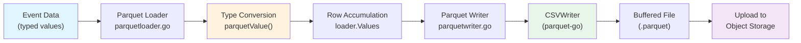
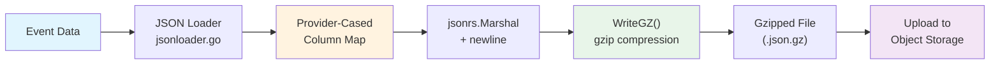
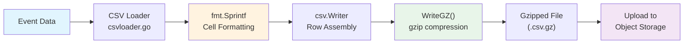
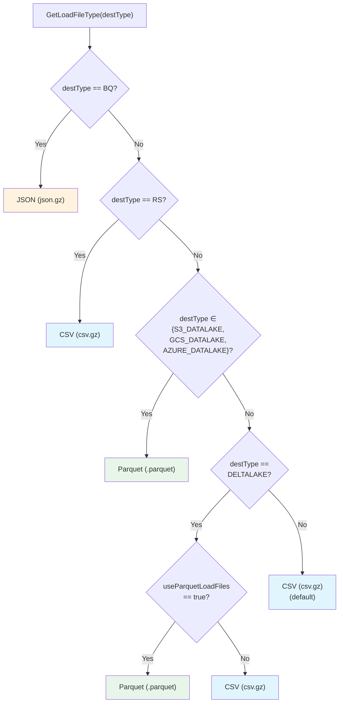

# Encoding Formats Reference

The RudderStack warehouse encoding package provides a factory-based abstraction for generating staging-ready load files in three formats: **Parquet** (for Datalake destinations and Databricks), **JSON** (for BigQuery), and **CSV** (for Redshift, Snowflake, PostgreSQL, ClickHouse, MSSQL, and Azure Synapse). The `Factory` pattern ensures format-agnostic interfaces that allow higher-level services — such as the warehouse router and slave workers — to produce and consume staging files without coupling to a specific serialization format.

**Related Documentation:**

[Warehouse Overview](overview.md) | [Schema Evolution](schema-evolution.md)

> Source: `warehouse/encoding/encoding.go`

---

## Factory Architecture

The encoding subsystem is organized around a central `Factory` struct that encapsulates configuration and exposes three factory methods for creating writers, loaders, and readers. All format-specific logic is hidden behind shared interfaces, enabling the warehouse pipeline to operate generically over any supported file format.

### Factory Struct

The `Factory` struct wraps three configuration parameters that control Parquet-specific behavior and staging file read buffer sizing. An instance is created via `NewFactory(conf)`, which binds each parameter to the RudderStack configuration system with hot-reloadable support where applicable.

```go
type Factory struct {
    config struct {
        maxStagingFileReadBufferCapacityInK int                          // static at startup
        parquetParallelWriters              config.ValueLoader[int64]    // hot-reloadable
        disableParquetColumnIndex           config.ValueLoader[bool]     // hot-reloadable
    }
}
```

> Source: `warehouse/encoding/encoding.go:21-27`

### Factory Methods

The `Factory` exposes three creation methods that dispatch to the correct format implementation based on the load file type or destination type:

| Method | Signature | Description |
|--------|-----------|-------------|
| `NewLoadFileWriter` | `(loadFileType, outputFilePath string, schema model.TableSchema, destType string) (LoadFileWriter, error)` | Creates a format-specific writer for staging files. For Parquet, builds a buffered Parquet writer with schema mapping. For all other types, creates a gzip-compressed file writer. |
| `NewEventLoader` | `(w LoadFileWriter, loadFileType, destinationType string) EventLoader` | Creates a format-specific loader that converts individual event rows into the target file format. Dispatches to JSON, Parquet, or CSV loader based on `loadFileType`. |
| `NewEventReader` | `(r io.Reader, destType string) EventReader` | Creates a format-specific reader for consuming staging files. Dispatches to JSON reader for BigQuery, CSV reader for all other destinations. |

> Source: `warehouse/encoding/encoding.go:47-91`

#### Dispatch Logic

```
NewLoadFileWriter:
  loadFileType == "parquet" → createParquetWriter(...)
  default                   → misc.CreateGZ(outputFilePath)

NewEventLoader:
  loadFileType == "json"    → newJSONLoader(w, destinationType)
  loadFileType == "parquet" → newParquetLoader(w, destinationType)
  default                   → newCSVLoader(w, destinationType)

NewEventReader:
  destType == "BQ"          → newJSONReader(r, bufferCapacityInK)
  default                   → newCsvReader(r)
```

> Source: `warehouse/encoding/encoding.go:47-91`

### Core Interfaces

The encoding package defines three interfaces that all format-specific implementations must satisfy:

#### LoadFileWriter

The `LoadFileWriter` interface provides low-level file output capabilities. Implementations either support gzip-based string/byte writes (CSV, JSON) or row-based writes (Parquet).

```go
type LoadFileWriter interface {
    WriteGZ(s string) error          // Write a gzip-compressed string (CSV/JSON)
    Write(p []byte) (int, error)     // Write raw bytes (CSV/JSON)
    WriteRow(r []any) error          // Write a typed row (Parquet)
    Close() error                    // Flush and close the underlying file
    GetLoadFile() *os.File           // Return a handle to the output file
}
```

> Source: `warehouse/encoding/encoding.go:38-45`

#### EventLoader

The `EventLoader` interface provides column-by-column event construction with load-time column detection and format-aware serialization.

```go
type EventLoader interface {
    IsLoadTimeColumn(columnName string) bool          // Detect system-managed columns
    GetLoadTimeFormat(columnName string) string        // Return timestamp format for load-time columns
    AddColumn(columnName, columnType string, val any)  // Add a typed column value
    AddRow(columnNames, values []string)                // Add a complete row of string values
    AddEmptyColumn(columnName string)                   // Add a NULL/empty column
    WriteToString() (string, error)                     // Serialize current row to string
    Write() error                                       // Persist current row to the writer
}
```

> Source: `warehouse/encoding/encoding.go:56-66`

#### EventReader

The `EventReader` interface provides sequential record reading from staging files.

```go
type EventReader interface {
    Read(columnNames []string) (record []string, err error)  // Read next record as string slice
}
```

> Source: `warehouse/encoding/encoding.go:79-82`

---

## Configuration Parameters

The following configuration parameters control encoding behavior. All parameters are set via `config/config.yaml` or equivalent environment variables.

| Parameter | Default | Type | Reloadable | Description |
|-----------|---------|------|------------|-------------|
| `Warehouse.maxStagingFileReadBufferCapacityInK` | `10240` | int | No | Maximum staging file read buffer capacity in kilobytes (10 MB default). Controls the `bufio.Scanner` buffer size for JSON reader to handle large JSON lines without truncation. |
| `Warehouse.parquetParallelWriters` | `8` | int64 | Yes | Number of parallel goroutine writers used by the Parquet CSVWriter from `parquet-go`. Higher values improve write throughput at the cost of memory. |
| `Warehouse.disableParquetColumnIndex` | `true` | bool | Yes | When `true`, disables Parquet column statistics index generation. Reduces file size and write latency for staging files where column-level filtering is not required. |
| `Warehouse.deltalake.useParquetLoadFiles` | `false` | bool | No | When `true`, Databricks (Delta Lake) destinations use Parquet load files instead of the default CSV format. |

> Source: `warehouse/encoding/encoding.go:29-34`, `warehouse/utils/utils.go:816-818`

---

## Special Columns

The encoding package defines constants for system-managed columns that are injected at load time rather than sourced from event data. These columns enable deduplication tracking and load audit trails across all warehouse destinations.

| Constant | Value | Purpose |
|----------|-------|---------|
| `UUIDTsColumn` | `"uuid_ts"` | Timestamp column used for deduplication tracking. Marks when a row's UUID was first observed. |
| `LoadedAtColumn` | `"loaded_at"` | Timestamp column recording when a row was loaded into the warehouse. |
| `BQLoadedAtFormat` | `"2006-01-02 15:04:05.999999 Z"` | BigQuery-specific format for the `loaded_at` timestamp (microsecond precision). |
| `BQUuidTSFormat` | `"2006-01-02 15:04:05 Z"` | BigQuery-specific format for the `uuid_ts` timestamp (second precision). |

> Source: `warehouse/encoding/encoding.go:14-19`

### Provider-Specific Timestamp Formats

Each loader implementation detects load-time columns and applies the appropriate timestamp format:

| Provider | `uuid_ts` Format | `loaded_at` Format |
|----------|-------------------|---------------------|
| **BigQuery** (JSON loader) | `"2006-01-02 15:04:05 Z"` (`BQUuidTSFormat`) | `"2006-01-02 15:04:05.999999 Z"` (`BQLoadedAtFormat`) |
| **Parquet destinations** (Parquet loader) | `time.RFC3339` (`"2006-01-02T15:04:05Z07:00"`) | N/A — only `uuid_ts` is a load-time column |
| **All other destinations** (CSV loader) | `misc.RFC3339Milli` (`"2006-01-02T15:04:05.000Z07:00"`) | N/A — only `uuid_ts` is a load-time column |

**Key distinction:** The JSON loader (BigQuery) treats both `uuid_ts` and `loaded_at` as load-time columns, while the Parquet and CSV loaders only treat `uuid_ts` as a load-time column.

> Source: `warehouse/encoding/jsonloader.go:25-38`, `warehouse/encoding/parquetloader.go:28-33`, `warehouse/encoding/csvloader.go:31-37`

---

## Parquet

Parquet is a columnar storage format used for Datalake destinations (S3, GCS, Azure) and optionally for Databricks (Delta Lake). The encoding package uses the `xitongsys/parquet-go` library to produce Parquet files with deterministic, provider-cased schemas.

### Writer (`parquetwriter.go`)

The Parquet writer creates buffered output files via `misc.CreateBufferedWriter` and generates a typed Parquet schema string from the RudderStack table schema.

**Creation flow:**

1. Create a buffered file writer at the specified output path
2. Build a deterministic Parquet schema by sorting column names alphabetically and mapping each RudderStack data type to a Parquet data type using the `rudderDataTypeToParquetDataType` map
3. Convert column names to provider-specific casing via `warehouseutils.ToProviderCase` (e.g., uppercase for Snowflake, lowercase for Datalake)
4. Instantiate a `writer.NewCSVWriterFromWriter` with the schema, buffered writer, parallel writer count, and column index configuration

**Primary methods:**

| Method | Behavior |
|--------|----------|
| `WriteRow(r []any)` | Writes a typed row to the Parquet file via the underlying CSVWriter |
| `Close()` | Calls `WriteStop()` on the Parquet writer to flush pending data and footer, then closes the buffered file writer |
| `GetLoadFile()` | Returns the underlying `*os.File` handle for upload |
| `WriteGZ(s string)` | Returns `"not implemented"` error — Parquet does not use gzip string writes |
| `Write(p []byte)` | Returns `"not implemented"` error — Parquet does not use raw byte writes |

> Source: `warehouse/encoding/parquetwriter.go:70-121`

### Loader (`parquetloader.go`)

The Parquet loader converts individual event values into typed Go primitives suitable for Parquet serialization. Each column value is type-converted based on the RudderStack column type before being appended to the row values slice.

**Type conversion logic:**

| RudderStack Type | Go Target Type | Parquet Logical Type | Conversion |
|------------------|----------------|----------------------|------------|
| `bigint` | `int64` | INT64 | Direct cast from `int` to `int64` |
| `int` | `int64` | INT64 | Direct cast from `int` to `int64` |
| `boolean` | `bool` | BOOLEAN | Direct type assertion |
| `float` | `float64` | DOUBLE | Direct type assertion |
| `datetime` | `int64` | TIMESTAMP_MICROS | Parse RFC3339 string → `types.TimeToTIMESTAMP_MICROS` |
| `string` | `string` | UTF8 (BYTE_ARRAY) | Direct type assertion |
| `text` | `string` | UTF8 (BYTE_ARRAY) | Direct type assertion |

**Load-time column behavior:**
- Only `uuid_ts` (provider-cased) is recognized as a load-time column
- Load-time format is always `time.RFC3339`

**Serialization:** The `Write()` method delegates to `LoadFileWriter.WriteRow(loader.Values)`, emitting the accumulated typed values as a single Parquet row.

> Source: `warehouse/encoding/parquetloader.go:1-125`

### Parquet Data Type Mappings by Destination

The `rudderDataTypeToParquetDataType` map defines per-destination type mappings. Destinations not in this map cannot produce Parquet files.

| Destination | `bigint` | `int` | `boolean` | `float` | `string` | `text` | `datetime` |
|-------------|----------|-------|-----------|---------|----------|--------|------------|
| **Redshift** (`RS`) | INT64 | INT64 | BOOLEAN | DOUBLE | UTF8 | UTF8 | TIMESTAMP_MICROS |
| **S3 Datalake** | INT64 | INT64 | BOOLEAN | DOUBLE | UTF8 | UTF8 | TIMESTAMP_MICROS |
| **GCS Datalake** | — | INT64 | BOOLEAN | DOUBLE | UTF8 | — | TIMESTAMP_MICROS |
| **Azure Datalake** | — | INT64 | BOOLEAN | DOUBLE | UTF8 | — | TIMESTAMP_MICROS |
| **Databricks** (`DELTALAKE`) | — | INT64 | BOOLEAN | DOUBLE | UTF8 | — | TIMESTAMP_MICROS |

> **Note:** GCS Datalake, Azure Datalake, and Databricks do not define separate `bigint` or `text` mappings — these types are not used in their schemas.

> Source: `warehouse/encoding/parquetwriter.go:28-68`

### Parquet Schema Generation

Schemas are built deterministically by sorting column names alphabetically, ensuring consistent file layouts across runs:

```go
// Example generated schema for S3 Datalake
["name=column1, type=INT64, repetitiontype=OPTIONAL",
 "name=column2, type=BOOLEAN, repetitiontype=OPTIONAL",
 "name=column3, type=BYTE_ARRAY, convertedtype=UTF8, repetitiontype=OPTIONAL"]
```

All Parquet columns use `repetitiontype=OPTIONAL` to support NULL values for empty columns or type-conversion failures.

> Source: `warehouse/encoding/parquetwriter.go:129-141`

### Parquet Encoding Flow



---

## JSON (Newline-Delimited)

The JSON encoding format produces newline-delimited JSON (NDJSON) files compressed with gzip. This format is used **exclusively by BigQuery**, which natively supports JSON-based bulk loading.

### Loader (`jsonloader.go`)

The JSON loader maintains an in-memory column-to-value map for each event row, applying provider-specific column name casing before serialization.

**Key behaviors:**

- **Column name casing:** All column names are converted to provider-specific casing via `warehouseutils.ToProviderCase` on every `AddColumn`, `AddRow`, and `AddEmptyColumn` call
- **Load-time column detection:** Both `uuid_ts` and `loaded_at` are recognized as load-time columns (unique to the JSON/BigQuery loader)
- **Serialization:** `WriteToString()` serializes the column map to JSON via `jsonrs.Marshal` and appends a newline character, producing one JSON object per line
- **Persistence:** `Write()` calls `WriteToString()` and delegates gzip compression to `LoadFileWriter.WriteGZ()`
- **Empty columns:** `AddEmptyColumn` stores `nil` for the column, which serializes to `null` in JSON

**Load-time formats:**

| Column | Format |
|--------|--------|
| `uuid_ts` | `"2006-01-02 15:04:05 Z"` (second precision) |
| `loaded_at` | `"2006-01-02 15:04:05.999999 Z"` (microsecond precision) |

> Source: `warehouse/encoding/jsonloader.go:1-71`

### Reader (`jsonreader.go`)

The JSON reader wraps a `bufio.Scanner` configured with a high-capacity buffer to handle large JSON lines without truncation.

**Key behaviors:**

- **Buffer sizing:** The scanner buffer capacity is set to `bufferCapacityInK * 1024` bytes (default 10 MB from factory config), preventing `bufio.Scanner: token too long` errors on large event payloads
- **Deserialization:** Each scanned line is unmarshalled into a `map[string]any` via `jsonrs.Unmarshal`
- **Column extraction:** Values are extracted by column name from the map and converted to strings via `cast.ToStringE`
- **EOF handling:** When the scanner reaches end-of-file, the reader returns an empty string slice and `io.EOF`

> Source: `warehouse/encoding/jsonreader.go:1-56`

### JSON Encoding Flow



---

## CSV

The CSV encoding format produces standard RFC 4180 CSV files compressed with gzip. This is the default format for all warehouse destinations except BigQuery and the Datalake family.

### Loader (`csvloader.go`)

The CSV loader accumulates cell values as formatted strings and writes complete rows through a standard `encoding/csv.Writer` buffered in memory before gzip persistence.

**Key behaviors:**

- **Cell formatting:** All values are formatted to strings via `fmt.Sprintf("%v", val)`, preserving Go's default string representation for each type
- **Row accumulation:** `AddColumn` and `AddRow` append to an internal `csvRow` string slice
- **Empty columns:** `AddEmptyColumn` appends an empty string `""`
- **Load-time column detection:** Only `uuid_ts` (provider-cased) is recognized as a load-time column
- **Load-time format:** `misc.RFC3339Milli` (`"2006-01-02T15:04:05.000Z07:00"`) — millisecond precision
- **Serialization:** `WriteToString()` writes the accumulated row through `csv.Writer`, flushes the internal buffer, and returns the CSV-formatted string
- **Persistence:** `Write()` calls `WriteToString()` and delegates gzip compression to `LoadFileWriter.WriteGZ()`

> Source: `warehouse/encoding/csvloader.go:1-70`

### Reader (`csvreader.go`)

The CSV reader is a thin wrapper over Go's standard `encoding/csv.Reader`, centralizing CSV parsing configuration for the warehouse pipeline.

**Key behaviors:**

- **Parsing:** Delegates directly to `csv.Reader.Read()` for RFC 4180-compliant CSV parsing
- **Column names ignored:** The `Read(columnNames []string)` method signature accepts column names for interface compatibility but does not use them — record order is determined by the CSV file structure
- **EOF handling:** Returns the standard `io.EOF` error when the end of the file is reached

> Source: `warehouse/encoding/csvreader.go:1-19`

### CSV Encoding Flow



---

## Format-to-Destination Mapping

The following table shows the default load file format assigned to each warehouse destination by `warehouseutils.GetLoadFileType()`. The format determines which loader and reader implementations are used for staging file production and consumption.

| Destination | Constant | Default Load File Format | File Extension | Loader | Reader |
|-------------|----------|--------------------------|----------------|--------|--------|
| **Redshift** | `RS` | CSV (gzipped) | `.csv.gz` | `csvloader` | `csvreader` |
| **BigQuery** | `BQ` | JSON (newline-delimited, gzipped) | `.json.gz` | `jsonloader` | `jsonreader` |
| **Snowflake** | `SNOWFLAKE` | CSV (gzipped) | `.csv.gz` | `csvloader` | `csvreader` |
| **PostgreSQL** | `POSTGRES` | CSV (gzipped) | `.csv.gz` | `csvloader` | `csvreader` |
| **ClickHouse** | `CLICKHOUSE` | CSV (gzipped) | `.csv.gz` | `csvloader` | `csvreader` |
| **MSSQL** | `MSSQL` | CSV (gzipped) | `.csv.gz` | `csvloader` | `csvreader` |
| **Azure Synapse** | `AZURE_SYNAPSE` | CSV (gzipped) | `.csv.gz` | `csvloader` | `csvreader` |
| **S3 Datalake** | `S3_DATALAKE` | Parquet | `.parquet` | `parquetloader` | — (external reader) |
| **GCS Datalake** | `GCS_DATALAKE` | Parquet | `.parquet` | `parquetloader` | — (external reader) |
| **Azure Datalake** | `AZURE_DATALAKE` | Parquet | `.parquet` | `parquetloader` | — (external reader) |
| **Databricks** | `DELTALAKE` | CSV (gzipped) ¹ | `.csv.gz` | `csvloader` | `csvreader` |

> ¹ Databricks (Delta Lake) defaults to CSV but can be switched to Parquet by setting `Warehouse.deltalake.useParquetLoadFiles=true`.

> **Note on Parquet readers:** The `Factory.NewEventReader()` method does not produce a Parquet reader — it dispatches BigQuery to `jsonreader` and all other destinations to `csvreader`. Parquet files produced for Datalake destinations are consumed externally by the destination systems (e.g., Spark, Athena, Presto) or via the `parquet-go` library directly in specialized code paths.

> Source: `warehouse/utils/utils.go:807-821`, `warehouse/encoding/encoding.go:84-91`

### Format Selection Decision Tree



> Source: `warehouse/utils/utils.go:807-821`

---

## Compression

All staging files produced by the encoding package are compressed to minimize storage consumption and transfer time during upload to object storage. The compression strategy differs by format.

### Gzip Compression (CSV and JSON)

Both CSV and JSON loaders delegate compression to the `LoadFileWriter.WriteGZ()` method, which writes gzip-compressed data to the underlying staging file.

- **File extensions:** `.csv.gz` for CSV, `.json.gz` for JSON
- **Compression level:** Default gzip compression (Go standard library `compress/gzip`)
- **Write path:** `EventLoader.Write()` → `EventLoader.WriteToString()` → `LoadFileWriter.WriteGZ(string)`
- **Read path:** Files must be decompressed through `gzip.NewReader()` before being passed to `EventReader`

The gzip writer is created by `misc.CreateGZ(outputFilePath)`, which is the default branch of `NewLoadFileWriter` for non-Parquet file types.

> Source: `warehouse/encoding/encoding.go:51-53`

### Parquet Self-Compression

Parquet files use built-in compression at the column chunk level. The `parquet-go` library applies **Snappy** compression by default, which provides a favorable balance of compression ratio and decompression speed for columnar data.

- **File extension:** `.parquet`
- **Compression codec:** Snappy (default in `parquet-go`)
- **No external gzip wrapper:** Parquet files are not wrapped in gzip — they are self-contained with internal compression
- **Column statistics:** Controlled by `Warehouse.disableParquetColumnIndex` (disabled by default to reduce file size)

> Source: `warehouse/encoding/parquetwriter.go:75-96`

---

## Testing and Validation

The encoding package includes comprehensive tests in `encoding_test.go` that validate round-trip correctness for all three formats, edge cases, and type conversion behavior.

### Test Coverage Summary

| Test Case | Format | Rows | Validates |
|-----------|--------|------|-----------|
| `TestReaderLoader/Parquet` | Parquet | 100 | Schema mapping, typed value persistence, NULL handling for type-conversion failures, empty columns serialized as nil, column statistics (null counts), `WriteGZ`/`Write` correctly return "not implemented" |
| `TestReaderLoader/JSON` | JSON | 100 | Gzipped NDJSON round-trip, provider-cased column names, load-time column detection for both `uuid_ts` and `loaded_at`, `AddRow` multi-column insertion, reader deserialization parity |
| `TestReaderLoader/CSV` | CSV | 100 | Gzipped CSV round-trip, `fmt.Sprintf` cell formatting, load-time column detection for `uuid_ts` only, `AddRow` multi-column insertion, reader parsing parity |
| `TestReaderLoader/Empty files/csv` | CSV | 0 | Empty gzipped CSV returns `io.EOF` on first read, `nil` record |
| `TestReaderLoader/Empty files/json` | JSON | 0 | Empty gzipped JSON returns `io.EOF` on first read, empty string slice |

### Parquet Column Statistics Validation

The Parquet test validates column-level null counts to confirm type-conversion failure handling. Columns with invalid type inputs (e.g., `float` value for `int` column, `string` value for `datetime` column) are stored as `nil` and counted as nulls in the column metadata:

```
column1:  0 nulls    (valid int64)
column9:  100 nulls  (all AddEmptyColumn)
column11: 100 nulls  (unsupported data type)
column12: 100 nulls  (float → int type mismatch)
column17: 100 nulls  (invalid datetime string)
```

> Source: `warehouse/encoding/encoding_test.go:1-382`

---

## Summary

The encoding package provides a clean, factory-based abstraction over three staging file formats. The key architectural decisions are:

1. **Interface-driven design** — `LoadFileWriter`, `EventLoader`, and `EventReader` interfaces decouple format-specific logic from the warehouse pipeline
2. **Provider-aware column naming** — All loaders apply `warehouseutils.ToProviderCase` to ensure column names match destination conventions (uppercase for Snowflake, lowercase for most others)
3. **Deterministic schema generation** — Parquet schemas sort columns alphabetically for reproducible file layouts
4. **Hot-reloadable configuration** — Parquet parallelism and column index settings can be tuned without server restart
5. **Graceful type-conversion failures** — Parquet loader stores `nil` for type-mismatched values rather than failing the entire row, preserving partial data

> Source: `warehouse/encoding/`
