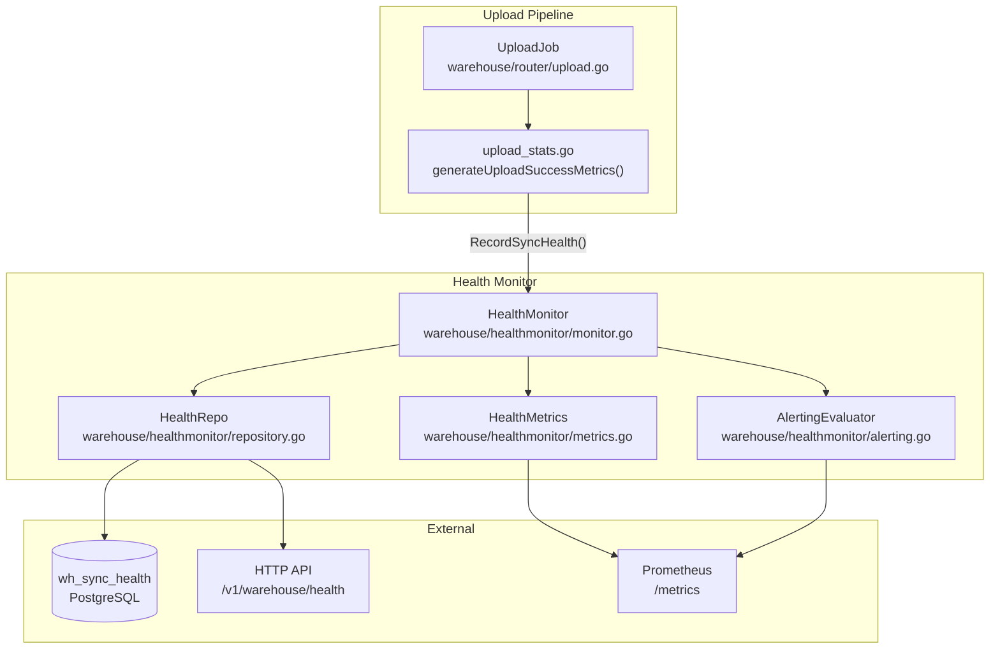

# Warehouse Health Monitoring

The warehouse health monitoring system provides per-upload metrics including sync status, duration, row counts, error classification, and schema changes. It exposes metrics as Prometheus counters, gauges, and histograms, and provides a dedicated HTTP API for dashboard integration.

Health monitoring runs as a periodic collection loop within the warehouse service, collecting data from recent uploads at configurable intervals, emitting Prometheus metrics, evaluating alerting thresholds, and persisting health records for historical analysis.

> Source: `warehouse/healthmonitor/`

---

## Architecture

The health monitor integrates with the existing warehouse upload pipeline at two levels:

1. **Per-upload recording** — After each upload completes (success or failure), the upload pipeline calls `RecordSyncHealth()` to persist a health record to the `wh_sync_health` table and emit real-time Prometheus metrics for that individual upload.
2. **Periodic aggregation** — A background collection loop runs at a configurable interval (default: 60 seconds), querying recent health records to compute aggregate metrics across all source/destination pairs, emitting aggregate Prometheus metrics, and evaluating alerting thresholds.



The `HealthMonitor` is instantiated during `warehouse/app.go Setup()` and its `Run()` goroutine is started during the `Run()` lifecycle phase. It receives the same `stats.Stats` factory, `config.Config`, and `sqlquerywrapper.DB` dependencies used by other warehouse sub-components.

> Source: `warehouse/healthmonitor/monitor.go:29-93`, `warehouse/app.go`

---

## Prometheus Metrics Reference

All health monitoring metrics are emitted via `statsFactory.NewTaggedStat()`, following the instrumentation pattern established in `warehouse/router/upload_stats.go`. Metrics are emitted both per-upload (real-time) and periodically (aggregate).

| Metric Name | Type | Description |
|---|---|---|
| `warehouse_sync_duration_seconds` | Histogram | Per-upload warehouse sync duration in seconds. Durations are converted from milliseconds (as stored in `wh_sync_health`) to seconds before observation. |
| `warehouse_sync_rows_total` | Counter | Total rows synced successfully across all uploads. Incremented by the number of rows successfully synced for each upload. |
| `warehouse_sync_errors_total` | Counter | Total sync errors, labeled by `error_category`. The `error_category` tag classifies the failure type (e.g., `permission_error`, `column_count_error`, `uncategorised`). |
| `warehouse_sync_status` | Gauge | Current sync status per source/destination pair. Values: `1.0` = healthy, `0.0` = unhealthy. A pair is considered unhealthy when its error rate exceeds 10%. |
| `warehouse_schema_changes_total` | Counter | Total schema evolution events detected during warehouse sync operations. Incremented when schema drift is detected between consecutive syncs. |

> Source: `warehouse/healthmonitor/metrics.go:11-37`

---

## Standard Tag Set

All health monitoring metrics include the standard warehouse tag set, ensuring consistent labeling for Prometheus queries and Grafana dashboard filtering:

| Tag | Description |
|---|---|
| `module` | Always `"warehouse"` |
| `workspaceId` | Workspace identifier for tenant isolation |
| `destID` | Destination identifier |
| `destType` | Destination type (e.g., `SNOWFLAKE`, `BQ`, `RS`, `CLICKHOUSE`, `POSTGRES`, `MSSQL`, `AZURE_SYNAPSE`, `DELTALAKE`, `S3_DATALAKE`) |
| `sourceID` | Source identifier |
| `sourceType` | Source type (e.g., `web`, `android`, `ios`, `cloud`) |

The `error_category` label is additionally applied to `warehouse_sync_errors_total` to classify errors. Error categories map to the `JobErrorType` constants defined in `warehouse/internal/model/upload.go`:

| Error Category | Description |
|---|---|
| `permission_error` | Authentication or authorization failures |
| `insufficient_resource_error` | Warehouse capacity or quota exceeded |
| `concurrent_queries_error` | Too many concurrent queries on the warehouse |
| `column_size_error` | Data exceeds column size limits |
| `column_count_error` | Table exceeds maximum column count |
| `resource_not_found_error` | Referenced resource (table, schema, database) does not exist |
| `alter_column_error` | Column type alteration failure |
| `uncategorised` | Default category for unmatched errors |

> Source: `warehouse/healthmonitor/metrics.go:68-95`, `warehouse/router/upload_stats.go:19-33`

---

## HTTP API Endpoints

The health monitoring HTTP API is registered on the warehouse service port (default: `8082`) alongside existing warehouse endpoints. All responses use `application/json` content type and are serialized via `jsonrs` (never `encoding/json`).

### GET /v1/warehouse/health — Overall Health Summary

Returns aggregated health data across all source/destination pairs within the most recent reporting window (default: 24 hours).

**Response (200 OK):**

```json
{
    "sources": [{
        "sourceID": "src_abc123",
        "sourceType": "Javascript",
        "workspaceID": "wks_def456",
        "destinations": [{
            "destID": "dest_xyz789",
            "destType": "SNOWFLAKE",
            "syncDuration": {
                "min": 5200,
                "max": 45000,
                "avg": 12500,
                "p95": 38000
            },
            "rowsSynced": 1250000,
            "errorRate": 0.02,
            "errorCount": 3,
            "errorCategory": "permission_error",
            "lastSync": "2024-01-15T10:30:00Z",
            "schemaChanges": 1
        }]
    }]
}
```

**Response Fields:**

| Field | Type | Description |
|---|---|---|
| `sources` | array | List of sources with health data |
| `sources[].sourceID` | string | RudderStack source identifier |
| `sources[].sourceType` | string | Source type (e.g., `Javascript`, `Android`, `iOS`) |
| `sources[].workspaceID` | string | Workspace identifier |
| `sources[].destinations` | array | Per-destination health metrics |
| `destinations[].destID` | string | Warehouse destination identifier |
| `destinations[].destType` | string | Destination type (e.g., `SNOWFLAKE`, `BQ`) |
| `destinations[].syncDuration` | object | Duration statistics in milliseconds |
| `destinations[].syncDuration.min` | int64 | Minimum sync duration (ms) |
| `destinations[].syncDuration.max` | int64 | Maximum sync duration (ms) |
| `destinations[].syncDuration.avg` | int64 | Average sync duration (ms) |
| `destinations[].syncDuration.p95` | int64 | 95th percentile sync duration (ms) |
| `destinations[].rowsSynced` | int64 | Total rows synced in reporting window |
| `destinations[].errorRate` | float64 | Ratio of failed syncs to total syncs (0.0–1.0) |
| `destinations[].errorCount` | int64 | Absolute number of failed syncs |
| `destinations[].errorCategory` | string | Most common error category (omitted if empty) |
| `destinations[].lastSync` | string | ISO 8601 timestamp of most recent sync completion |
| `destinations[].schemaChanges` | int64 | Number of schema changes detected |

**Error Responses:**

| Status | Body | Description |
|---|---|---|
| `500` | `{"status": "error", "message": "failed to retrieve health summary"}` | Internal server error during data retrieval |

> Source: `warehouse/healthmonitor/handler.go:66-102`

### GET /v1/warehouse/health/{sourceID}/{destID} — Per-Source/Destination Health

Returns health data filtered for a specific source-destination pair.

**Path Parameters:**

| Parameter | Type | Required | Description |
|---|---|---|---|
| `sourceID` | string | Yes | RudderStack source identifier |
| `destID` | string | Yes | Warehouse destination identifier |

**Response (200 OK):**

```json
{
    "sourceID": "src_abc123",
    "sourceType": "Javascript",
    "workspaceID": "wks_def456",
    "destinations": [{
        "destID": "dest_xyz789",
        "destType": "SNOWFLAKE",
        "syncDuration": {
            "min": 5200,
            "max": 45000,
            "avg": 12500,
            "p95": 38000
        },
        "rowsSynced": 1250000,
        "errorRate": 0.02,
        "errorCount": 3,
        "lastSync": "2024-01-15T10:30:00Z",
        "schemaChanges": 0
    }]
}
```

**Error Responses:**

| Status | Body | Description |
|---|---|---|
| `400` | `{"status": "error", "message": "sourceID and destID are required"}` | Missing or empty path parameters |
| `500` | `{"status": "error", "message": "failed to retrieve health data"}` | Internal server error during data retrieval |

When no health data exists for the given source-destination pair, a `200 OK` response is returned with an empty `destinations` array.

> Source: `warehouse/healthmonitor/handler.go:104-142`

---

## gRPC RPCs

The health monitoring system extends the existing warehouse gRPC service (port `8082`) with two additional RPCs:

| RPC | Request | Response | Description |
|---|---|---|---|
| `GetSyncHealth` | Upload ID | `SyncHealth` record | Returns the sync health record for a specific upload. Returns `NOT_FOUND` if no record exists. |
| `GetHealthSummary` | Empty | `HealthSummaryResponse` | Returns the aggregated health summary across all source/destination pairs. Equivalent to the `GET /v1/warehouse/health` HTTP endpoint. |

Both RPCs are served on the same port as the existing warehouse gRPC service and are available when the warehouse service runs in master or embedded mode.

> Source: `warehouse/api/grpc.go`

---

## Alerting Configuration

The alerting evaluator checks health metrics against configurable thresholds and emits `warehouse_health_alert` counter metrics via the Prometheus stats factory. Each alert type has an independent threshold and a shared per-source/destination cooldown to prevent alert flooding.

### Alert Types

| Alert Type | Metric Tag | Description |
|---|---|---|
| `failure_rate` | `alertType=failure_rate` | Sync failure rate exceeds configured threshold |
| `duration_spike` | `alertType=duration_spike` | Average sync duration exceeds configured threshold |
| `row_count_anomaly` | `alertType=row_count_anomaly` | Row count drops significantly from previous period |
| `schema_drift` | `alertType=schema_drift` | Schema changes detected during sync |

All alerts are emitted as increments to the `warehouse_health_alert` counter metric with the standard warehouse tag set plus the `alertType` tag.

> Source: `warehouse/healthmonitor/alerting.go:17-38`

### Failure Rate Alerting

- **Configuration key:** `Warehouse.healthMonitor.alerting.failureRateThreshold`
- **Type:** `float64`
- **Default:** `0.1` (10%)
- **Behavior:** When the ratio of failed uploads to total uploads within the evaluation window exceeds this threshold, a `warehouse_health_alert` counter is emitted with `alertType=failure_rate`. The error rate is calculated as a value between `0.0` (no failures) and `1.0` (all syncs failed).

### Duration Spike Detection

- **Configuration key:** `Warehouse.healthMonitor.alerting.durationSpikeThresholdMs`
- **Type:** `int`
- **Default:** `300000` (5 minutes)
- **Behavior:** When the average sync duration for a source/destination pair exceeds this threshold in milliseconds, a `warehouse_health_alert` counter is emitted with `alertType=duration_spike`.

### Row Count Anomaly Detection

- **Configuration key:** `Warehouse.healthMonitor.alerting.rowCountDropPercent`
- **Type:** `int`
- **Default:** `50`
- **Behavior:** When the current period's synced row count drops below `(100 - rowCountDropPercent)%` of the previous period's row count, a `warehouse_health_alert` counter is emitted with `alertType=row_count_anomaly`. If there is no previous period data (e.g., first sync), no anomaly check is performed.

The anomaly formula: alert fires when `currentRows < previousRows × (1 - rowCountDropPercent / 100)`.

### Schema Drift Detection

- **Configuration key:** `Warehouse.healthMonitor.alerting.schemaDriftEnabled`
- **Type:** `bool`
- **Default:** `true`
- **Behavior:** When enabled, schema changes detected during any sync operation trigger a `warehouse_health_alert` counter with `alertType=schema_drift`. Schema changes include added columns, removed columns, and type-changed columns. Set to `false` to disable schema drift alerts entirely.

### Alert Cooldown

- **Configuration key:** `Warehouse.healthMonitor.alerting.cooldownMinutes`
- **Type:** `int`
- **Default:** `30`
- **Behavior:** Per-source/destination/alert-type cooldown to prevent alert flooding. After a `warehouse_health_alert` is emitted for a given combination of `alertType`, `sourceID`, and `destID`, no further alerts of the same type for the same pair are emitted until the cooldown period elapses. Expired cooldown entries are periodically pruned to prevent unbounded memory growth.

> Source: `warehouse/healthmonitor/alerting.go:40-129`

---

## Configuration Reference

All configuration keys support runtime reload without restart, following the `config.GetReloadable*Var()` pattern established throughout the warehouse package.

| Configuration Key | Type | Default | Description |
|---|---|---|---|
| `Warehouse.healthMonitor.enabled` | `bool` | `true` | Enable/disable health monitoring. When disabled, no metrics are collected, no alerts are evaluated, and `RecordSyncHealth()` returns immediately. |
| `Warehouse.healthMonitor.collectionIntervalSeconds` | `int` | `60` | Metric collection interval in seconds. Controls how frequently the health monitor queries recent upload records to compute aggregate statistics. |
| `Warehouse.healthMonitor.retentionDays` | `int` | `30` | Health record retention period in days. Records older than this threshold are purged during periodic cleanup to prevent unbounded table growth. |
| `Warehouse.healthMonitor.alerting.failureRateThreshold` | `float64` | `0.1` | Failure rate alert threshold (10%). Alerts fire when the error rate exceeds this value. |
| `Warehouse.healthMonitor.alerting.durationSpikeThresholdMs` | `int` | `300000` | Duration spike threshold in milliseconds (5 minutes). Alerts fire when average sync duration exceeds this value. |
| `Warehouse.healthMonitor.alerting.rowCountDropPercent` | `int` | `50` | Row count drop percentage for anomaly detection. Alerts fire when row count drops below this percentage of the previous period. |
| `Warehouse.healthMonitor.alerting.schemaDriftEnabled` | `bool` | `true` | Enable schema drift detection. When enabled, schema changes trigger alerts. |
| `Warehouse.healthMonitor.alerting.cooldownMinutes` | `int` | `30` | Alert cooldown period in minutes. Prevents repeated alerts for the same source/destination/alert-type within this window. |

> Source: `warehouse/healthmonitor/config.go:25-76`

---

## Database Schema

Health monitoring data is persisted to the `wh_sync_health` table, created by migration `000044_add_health_monitoring_tables.up.sql`.

### Table: `wh_sync_health`

| Column | Type | Constraints | Description |
|---|---|---|---|
| `id` | `BIGSERIAL` | `PRIMARY KEY` | Auto-generated record identifier |
| `upload_id` | `BIGINT` | `REFERENCES wh_uploads(id)` | Foreign key to the warehouse upload record |
| `source_id` | `VARCHAR(64)` | `NOT NULL` | RudderStack source identifier |
| `destination_id` | `VARCHAR(64)` | `NOT NULL` | Warehouse destination identifier |
| `dest_type` | `VARCHAR(64)` | `NOT NULL` | Destination type (e.g., `SNOWFLAKE`, `BQ`) |
| `source_type` | `VARCHAR(64)` | `NOT NULL` | Source type (e.g., `web`, `android`) |
| `workspace_id` | `VARCHAR(64)` | `NOT NULL` | Workspace identifier |
| `status` | `VARCHAR(64)` | `NOT NULL` | Final upload status (e.g., `exported_data`, `aborted`) |
| `duration_ms` | `BIGINT` | `NOT NULL` | Total sync duration in milliseconds |
| `rows_synced` | `BIGINT` | `NOT NULL` | Number of rows successfully synced |
| `rows_failed` | `BIGINT` | `NOT NULL` | Number of rows that failed during sync |
| `error_category` | `VARCHAR(64)` | | Error classification (empty for successful syncs) |
| `schema_changes` | `JSONB` | | JSON object describing schema changes detected during sync |
| `created_at` | `TIMESTAMPTZ` | `DEFAULT NOW()` | Timestamp when the health record was created |

### Indexes

| Index | Columns | Purpose |
|---|---|---|
| `idx_wh_sync_health_source_dest_created` | `(source_id, destination_id, created_at)` | Efficient aggregate queries by source/destination pair within time windows |
| `idx_wh_sync_health_upload` | `(upload_id)` | Fast lookup of health records by upload ID |

> Source: `sql/migrations/warehouse/000044_add_health_monitoring_tables.up.sql`, `warehouse/healthmonitor/repository.go:16-37`

---

## Usage Examples

### Get Overall Health Summary

```bash
curl http://localhost:8082/v1/warehouse/health
```

**Example response:**

```json
{
    "sources": [{
        "sourceID": "src_abc123",
        "sourceType": "Javascript",
        "workspaceID": "wks_def456",
        "destinations": [{
            "destID": "dest_xyz789",
            "destType": "SNOWFLAKE",
            "syncDuration": {
                "min": 5200,
                "max": 45000,
                "avg": 12500,
                "p95": 38000
            },
            "rowsSynced": 1250000,
            "errorRate": 0.02,
            "errorCount": 3,
            "lastSync": "2024-01-15T10:30:00Z",
            "schemaChanges": 1
        }]
    }]
}
```

### Get Health for Specific Source/Destination

```bash
curl http://localhost:8082/v1/warehouse/health/src_abc123/dest_xyz789
```

### Query Prometheus Metrics

Use PromQL to query warehouse health metrics:

```promql
# Average sync duration per destination type
rate(warehouse_sync_duration_seconds_sum[5m]) / rate(warehouse_sync_duration_seconds_count[5m])

# Error rate per source/destination
rate(warehouse_sync_errors_total[5m]) / rate(warehouse_sync_rows_total[5m])

# Unhealthy destinations (status gauge = 0)
warehouse_sync_status == 0

# Active health alerts
increase(warehouse_health_alert[1h])
```

### Configuration via Environment Variables

Configuration keys can be set via environment variables using the standard RudderStack configuration format:

```bash
# Enable health monitoring (default: true)
export RSERVER_WAREHOUSE_HEALTH_MONITOR_ENABLED=true

# Set collection interval to 30 seconds
export RSERVER_WAREHOUSE_HEALTH_MONITOR_COLLECTION_INTERVAL_SECONDS=30

# Set failure rate alert threshold to 5%
export RSERVER_WAREHOUSE_HEALTH_MONITOR_ALERTING_FAILURE_RATE_THRESHOLD=0.05
```

---

## Health States

The health monitor classifies each source/destination pair into one of three health states based on the current metrics:

| State | Sync Status Gauge | Description |
|---|---|---|
| **Healthy** | `1.0` | All syncs completing successfully within expected duration and row count thresholds |
| **Degraded** | `0.0` | Some syncs failing or exceeding duration thresholds, but the system is still partially operational |
| **Unhealthy** | `0.0` | Critical failure state — syncs consistently failing or severely degraded (error rate > 10%) |

> Source: `warehouse/healthmonitor/model.go:196-212`

---

## Source File Reference

| File | Description |
|---|---|
| `warehouse/healthmonitor/monitor.go` | `HealthMonitor` core with periodic collection loop, `RecordSyncHealth()` entry point |
| `warehouse/healthmonitor/handler.go` | HTTP handler for `GET /v1/warehouse/health` and `GET /v1/warehouse/health/{sourceID}/{destID}` |
| `warehouse/healthmonitor/metrics.go` | Prometheus metric definitions (`warehouse_sync_duration_seconds`, `warehouse_sync_rows_total`, `warehouse_sync_errors_total`, `warehouse_sync_status`, `warehouse_schema_changes_total`) |
| `warehouse/healthmonitor/alerting.go` | Alerting evaluator with configurable thresholds for failure rate, duration spikes, row count anomalies, and schema drift |
| `warehouse/healthmonitor/model.go` | Data models: `SyncHealth`, `HealthSummaryResponse`, `SourceHealth`, `DestinationHealth`, `DurationStats` |
| `warehouse/healthmonitor/repository.go` | Database persistence for `wh_sync_health` table: `RecordSyncHealth()`, `GetHealthSummary()`, `GetHealthBySourceDest()`, `PurgeOldRecords()` |
| `warehouse/healthmonitor/config.go` | Configuration key constants and default value constants |
| `warehouse/router/upload_stats.go` | Integration point — per-upload metric emission calls `RecordSyncHealth()` at upload success/failure |
| `warehouse/api/http.go` | Endpoint registration for health monitoring routes in `addMasterEndpoints()` |
| `warehouse/api/grpc.go` | gRPC RPC registration for `GetSyncHealth` and `GetHealthSummary` |
| `sql/migrations/warehouse/000044_add_health_monitoring_tables.up.sql` | Database migration creating the `wh_sync_health` table and indexes |

---

## Related Documentation

- **Warehouse Overview:** [Architecture and State Machine](overview.md) — complete warehouse service architecture, upload state machine, and operational modes
- **Backfill:** [Configurable Date-Range Backfill](backfill.md) — backfill API, archiver integration, and state machine extension
- **Selective Sync:** [Per-Table and Per-Column Filtering](selective-sync.md) — selective sync configuration and filtering behavior
- **Replay:** [Warehouse Replay from Archived Events](replay.md) — replay pipeline architecture and usage
