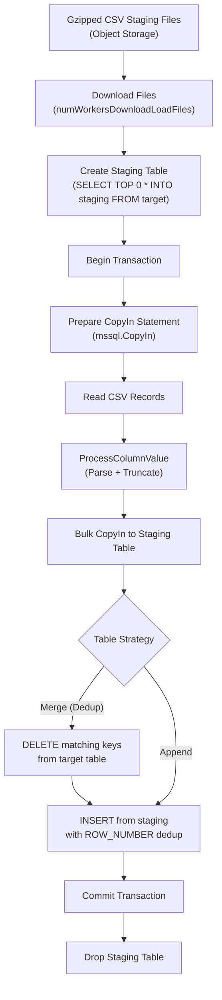

# SQL Server (MSSQL) Connector Guide

RudderStack's MSSQL connector loads event data into Microsoft SQL Server using **bulk CopyIn ingestion** with CSV-based staging files. The connector handles column value parsing and type-aware truncation via `ProcessColumnValue`, supports merge-aware delete-then-insert patterns for deduplication, and provides configurable delete-by-job support for source-aware cleanup. Staging tables are created as regular tables (not temporary) to accommodate SQL Server's scope limitations with prepared statements.

**Related Documentation:**

[Warehouse Overview](overview.md) | [Schema Evolution](schema-evolution.md) | [Encoding Formats](encoding-formats.md)

> Source: `warehouse/integrations/mssql/mssql.go`

---

## Prerequisites

Before configuring the MSSQL connector, ensure the following requirements are met:

| Requirement | Details |
|-------------|---------|
| **SQL Server Version** | Microsoft SQL Server 2016 or later recommended |
| **Database Permissions** | Database user with `CREATE SCHEMA`, `CREATE TABLE`, `ALTER TABLE`, `INSERT`, `SELECT`, `DELETE`, and `BULK INSERT` permissions |
| **Network Connectivity** | RudderStack warehouse service must be able to reach the SQL Server instance on the configured host and port |
| **Object Storage** | Configured object storage (S3, GCS, Azure Blob, or MinIO) for staging file storage — staging files are downloaded from object storage during the load phase |
| **Table Name Limit** | Table names must not exceed 127 characters (enforced by the connector) |

> Source: `warehouse/integrations/mssql/mssql.go:38-43`

---

## Connection Configuration

The MSSQL connector connects using a `sqlserver://` connection URL constructed from the following destination configuration parameters. The connector uses the `github.com/microsoft/go-mssqldb` driver.

### Connection Parameters

| Parameter | Config Key | Type | Required | Description |
|-----------|-----------|------|----------|-------------|
| **Host** | `host` | string | Yes | SQL Server hostname or IP address |
| **Port** | `port` | string | Yes | SQL Server port (default: `1433`) |
| **Database** | `database` | string | Yes | Target database name |
| **User** | `user` | string | Yes | Database username |
| **Password** | `password` | string | Yes | Database password |
| **SSL Mode** | `sslMode` | string | No | Encryption setting for the connection (see SSL/TLS section below) |

> Source: `warehouse/integrations/mssql/mssql.go:196-206`

### Namespace Configuration

The MSSQL connector maps the RudderStack **namespace** to an MSSQL **schema**. All tables are created within this schema. If the schema does not already exist, the connector creates it automatically using:

```sql
IF NOT EXISTS (SELECT * FROM sys.schemas WHERE name = N'<namespace>')
    EXEC('CREATE SCHEMA [<namespace>]');
```

The namespace is derived from the warehouse configuration and determines the organizational boundary for all tables managed by this connector.

> Source: `warehouse/integrations/mssql/mssql.go:794-805`

### SSL/TLS Configuration

The connector supports SSL/TLS encryption through the `sslMode` (mapped to the `encrypt` query parameter) and always sets `TrustServerCertificate=true`. The following combinations apply:

| `sslMode` Value | `TrustServerCertificate` | Behavior |
|-----------------|--------------------------|----------|
| `disable` | `true` | Encryption disabled (works only if `forceSSL` is not enabled on the server) |
| `false` | `true` | Encryption attempted but not required |
| `true` | `true` | Encryption required; server certificate trusted without validation |

> **Note:** If `forceSSL` is enabled on the SQL Server instance, the `disable` option will not work. All other options function correctly alongside `TrustServerCertificate=true`.

The connection URL is constructed as:

```
sqlserver://<user>:<password>@<host>:<port>?database=<database>&encrypt=<sslMode>&TrustServerCertificate=true&dial+timeout=<timeout_seconds>
```

> Source: `warehouse/integrations/mssql/mssql.go:145-194`

---

## Configuration Parameters

The following configuration parameters control MSSQL connector behavior. Parameters are read from `config/config.yaml` or environment variable overrides.

### MSSQL-Specific Parameters

| Parameter | Default | Type | Range | Description |
|-----------|---------|------|-------|-------------|
| `Warehouse.mssql.maxParallelLoads` | `3` | int | ≥ 1 | Maximum number of tables loaded in parallel during a warehouse upload job. Controls concurrency of the loading phase. |
| `Warehouse.mssql.enableDeleteByJobs` | `false` | bool | `true` / `false` | Enables delete-by-job support. When `true`, the `DeleteBy` method executes cleanup queries that delete rows from previous job runs based on `context_sources_job_run_id`, `context_sources_task_run_id`, and `context_source_id`. |
| `Warehouse.mssql.numWorkersDownloadLoadFiles` | `1` | int | ≥ 1 | Number of concurrent workers used to download staging (load) files from object storage before the CopyIn phase. |
| `Warehouse.mssql.slowQueryThreshold` | `5m` | duration | ≥ 0s | Queries exceeding this threshold are logged as slow queries by the SQL query wrapper middleware. |

> Source: `warehouse/integrations/mssql/mssql.go:132-143`, `config/config.yaml:171-172`

### General Warehouse Parameters (Applicable to MSSQL)

| Parameter | Default | Type | Range | Description |
|-----------|---------|------|-------|-------------|
| `Warehouse.uploadFreq` | `1800s` | duration | > 0s | Interval between warehouse upload cycles. |
| `Warehouse.noOfWorkers` | `8` | int | ≥ 1 | Number of concurrent warehouse worker goroutines. |
| `Warehouse.stagingFilesBatchSize` | `960` | int | ≥ 1 | Maximum number of staging files processed per upload batch. |
| `Warehouse.minRetryAttempts` | `3` | int | ≥ 1 | Minimum number of retry attempts for failed uploads before marking as aborted. |
| `Warehouse.retryTimeWindow` | `180m` | duration | > 0s | Time window within which failed uploads are retried. |
| `Warehouse.minUploadBackoff` | `60s` | duration | ≥ 0s | Minimum backoff duration between upload retry attempts. |
| `Warehouse.maxUploadBackoff` | `1800s` | duration | ≥ 0s | Maximum backoff duration between upload retry attempts. |
| `Warehouse.enableIDResolution` | `false` | bool | `true` / `false` | Enables identity resolution table injection during schema consolidation. |

> Source: `config/config.yaml:145-161`

---

## Data Type Mappings

The MSSQL connector maps RudderStack's internal data types to SQL Server–native types for table creation and column definition. A reverse mapping is used during schema fetch to translate SQL Server types back to RudderStack types.

### RudderStack → MSSQL Type Mapping

| RudderStack Type | MSSQL Type | Notes |
|------------------|------------|-------|
| `int` | `bigint` | 64-bit integer for maximum range compatibility |
| `float` | `decimal(28,10)` | High-precision decimal with 28 digits, 10 fractional |
| `string` | `nvarchar(512)` | Unicode string with default 512-character limit |
| `datetime` | `datetimeoffset` | Timezone-aware datetime type |
| `boolean` | `bit` | SQL Server boolean equivalent (0 or 1) |
| `json` | `jsonb` | JSON binary storage type |

> Source: `warehouse/integrations/mssql/mssql.go:45-52`

### MSSQL → RudderStack Type Mapping (Schema Fetch)

The following reverse mappings are used when fetching the existing warehouse schema from `INFORMATION_SCHEMA.COLUMNS`:

| MSSQL Type | RudderStack Type |
|------------|------------------|
| `integer` | `int` |
| `smallint` | `int` |
| `bigint` | `int` |
| `tinyint` | `int` |
| `double precision` | `float` |
| `numeric` | `float` |
| `decimal` | `float` |
| `real` | `float` |
| `float` | `float` |
| `text` | `string` |
| `varchar` | `string` |
| `nvarchar` | `string` |
| `ntext` | `string` |
| `nchar` | `string` |
| `char` | `string` |
| `datetimeoffset` | `datetime` |
| `date` | `datetime` |
| `datetime2` | `datetime` |
| `timestamp with time zone` | `datetime` |
| `timestamp` | `datetime` |
| `jsonb` | `json` |
| `bit` | `boolean` |

> Source: `warehouse/integrations/mssql/mssql.go:54-77`

### ProcessColumnValue — Parsing and Truncation

The `ProcessColumnValue` function is responsible for converting raw string values from CSV staging files into their appropriate Go types before insertion via CopyIn. It enforces length constraints for string types and handles Unicode encoding for diacritical characters.

**Type Conversion Logic:**

| Value Type | Conversion | Details |
|------------|------------|---------|
| `int` | `strconv.Atoi` | Parses string to integer |
| `float` | `strconv.ParseFloat(value, 64)` | Parses string to 64-bit float |
| `datetime` | `time.Parse(time.RFC3339, value)` | Expects RFC 3339 formatted timestamps |
| `boolean` | `strconv.ParseBool` | Accepts `true`, `false`, `1`, `0`, `t`, `f` |
| `string` | Truncation + UCS-2 encoding | See string handling below |
| (default) | Pass-through | Value returned as-is for unrecognized types |

**String Handling:**

1. If the column's `CHARACTER_MAXIMUM_LENGTH` is `-1` (i.e., `varchar(max)` / `nvarchar(max)`), the value is returned without truncation.
2. The effective maximum length is `max(varcharLength, 512)` — the default varchar length of 512 is used as a floor.
3. If the value exceeds the effective maximum, it is truncated to that length.
4. If the value contains **diacritical characters** (multi-byte UTF-8 runes), it is encoded to **UCS-2** (UTF-16LE) byte representation and the byte array is truncated to the maximum length.

> Source: `warehouse/integrations/mssql/mssql.go:519-558`

---

## Loading Strategy

The MSSQL connector uses a **staging table + CopyIn** pattern for all data loading operations. This approach provides transactional consistency and supports both merge (dedup) and append strategies.

### Loading Flow



> Source: `warehouse/integrations/mssql/mssql.go:251-386`

### Step-by-Step Loading Process

#### 1. Download Staging Files

The connector downloads gzipped CSV staging files from object storage using a configurable number of worker goroutines (`Warehouse.mssql.numWorkersDownloadLoadFiles`, default: `1`).

> Source: `warehouse/integrations/mssql/mssql.go:268-274`

#### 2. Create Staging Table

A staging table is created as a **regular table** (not a temporary table) by copying the structure of the target table with zero rows:

```sql
SELECT TOP 0 * INTO <namespace>.<staging_table>
FROM <namespace>.<target_table>;
```

> **Why regular tables instead of temporary tables?** SQL Server's temporary tables have limited scope when used with prepared statements — they are automatically purged after the transaction commits. The MSSQL connector uses regular tables as an alternative to ensure staging data persists across the CopyIn and merge phases within the same transaction.

> Source: `warehouse/integrations/mssql/mssql.go:282-302`

#### 3. Bulk CopyIn Ingestion

The connector uses the `mssql.CopyIn` prepared statement for high-throughput bulk insertion into the staging table:

1. A `CopyIn` statement is prepared with `CheckConstraints: false` for maximum insertion speed.
2. The varchar column length map is fetched from `INFORMATION_SCHEMA.COLUMNS` to determine per-column truncation limits.
3. Each gzipped CSV file is opened, decompressed, and read record-by-record.
4. Empty/whitespace-only values are converted to `nil` (SQL NULL).
5. Non-null values are processed through `ProcessColumnValue` for type conversion and string truncation.
6. Type conversion failures produce a warning and insert `nil` instead of failing the load.
7. Each processed record is sent to the CopyIn statement via `stmt.ExecContext`.
8. After all files are processed, a final `stmt.ExecContext` flushes the CopyIn buffer.

> Source: `warehouse/integrations/mssql/mssql.go:324-356`, `warehouse/integrations/mssql/mssql.go:429-517`

#### 4. Delete Matching Keys (Merge Strategy)

For tables that require deduplication (e.g., `users`, `identifies`, `discards`), the connector deletes existing rows from the target table that have matching primary keys in the staging table:

```sql
DELETE FROM <namespace>.<target_table>
FROM <namespace>.<staging_table> AS _source
WHERE _source.<primary_key> = <namespace>.<target_table>.<primary_key>;
```

**Primary Key Mapping:**

| Table | Primary Key |
|-------|-------------|
| `users` | `id` |
| `identifies` | `id` |
| `discards` | `row_id` (with additional `table_name` and `column_name` matching) |
| All other tables | `id` (default) |

> Source: `warehouse/integrations/mssql/mssql.go:113-123`, `warehouse/integrations/mssql/mssql.go:560-602`

#### 5. Insert with Deduplication

After deleting matched rows, the connector inserts deduplicated data from the staging table using `ROW_NUMBER()` window function:

```sql
INSERT INTO <namespace>.<target_table> (<columns>)
SELECT <columns>
FROM (
    SELECT *,
        ROW_NUMBER() OVER (
            PARTITION BY <partition_key>
            ORDER BY received_at DESC
        ) AS _rudder_staging_row_number
    FROM <namespace>.<staging_table>
) AS _
WHERE _rudder_staging_row_number = 1;
```

This ensures that when multiple records exist for the same partition key in the staging data, only the most recent one (by `received_at`) is inserted.

**Partition Key Mapping:**

| Table | Partition Key |
|-------|---------------|
| `users` | `id` |
| `identifies` | `id` |
| `discards` | `row_id, column_name, table_name` |
| All other tables | `id` (default) |

> Source: `warehouse/integrations/mssql/mssql.go:119-123`, `warehouse/integrations/mssql/mssql.go:604-650`

#### 6. Users Table Loading

The `users` table follows a specialized loading flow that merges data from the `identifies` staging table:

1. Load `identifies` table first, retaining the staging table.
2. Create a union staging table combining existing `users` rows with new `identifies` rows (matched by `user_id`).
3. For each user column, extract the most recent non-null value using a correlated subquery ordered by `received_at DESC`.
4. Delete existing users from the target table that match the staging data.
5. Insert the merged, deduplicated user records.

This ensures that user profiles are always updated with the latest trait values from both direct `users` events and `identifies` events.

> Source: `warehouse/integrations/mssql/mssql.go:672-792`

---

## Schema Management

The MSSQL connector supports automatic schema management including schema creation, table creation, and column addition. Schema operations are performed using SQL Server system catalog queries.

### Schema Creation

Schemas are created using `IF NOT EXISTS` checks against `sys.schemas`:

```sql
IF NOT EXISTS (SELECT * FROM sys.schemas WHERE name = N'<namespace>')
    EXEC('CREATE SCHEMA [<namespace>]');
```

> Source: `warehouse/integrations/mssql/mssql.go:794-805`

### Table Creation

Tables are created using `IF NOT EXISTS` checks against `sys.objects`:

```sql
IF NOT EXISTS (SELECT 1 FROM sys.objects WHERE object_id = OBJECT_ID(N'<name>') AND type = N'U')
    CREATE TABLE <name> (<column_definitions>);
```

Column definitions are generated from the RudderStack → MSSQL type mapping, with each column name double-quoted for identifier safety.

> Source: `warehouse/integrations/mssql/mssql.go:818-833`

### Column Addition

New columns are added using `ALTER TABLE ADD` with an existence guard for single-column additions:

```sql
-- Single column addition (with guard):
IF NOT EXISTS (
    SELECT 1 FROM SYS.COLUMNS
    WHERE OBJECT_ID = OBJECT_ID(N'<namespace>.<table>') AND name = '<column>'
)
ALTER TABLE <namespace>.<table> ADD "<column>" <type>;

-- Multi-column addition (without guard):
ALTER TABLE <namespace>.<table> ADD "<col1>" <type1>, "<col2>" <type2>;
```

> Source: `warehouse/integrations/mssql/mssql.go:844-888`

### Column Type Alteration

The MSSQL connector does **not** support in-place column type alteration. The `AlterColumn` method is a no-op that returns an empty response. Schema evolution through type widening (e.g., `string` → `text`) is not available for MSSQL destinations.

> Source: `warehouse/integrations/mssql/mssql.go:890-892`

### Schema Fetch

The connector fetches the current warehouse schema by querying `INFORMATION_SCHEMA.COLUMNS`, excluding staging tables:

```sql
SELECT table_name, column_name, data_type
FROM INFORMATION_SCHEMA.COLUMNS
WHERE table_schema = @schema
  AND table_name NOT LIKE '<staging_prefix>%';
```

Column types are mapped back to RudderStack types using the MSSQL → RudderStack reverse mapping. Unrecognized SQL Server types are logged as missing datatype metrics.

> Source: `warehouse/integrations/mssql/mssql.go:962-1009`

For more details on schema evolution behavior, see [Schema Evolution](schema-evolution.md).

---

## Idempotency and Backfill

The MSSQL connector is designed for **idempotent loading** and **backfill support**, ensuring that re-processing the same data produces consistent results without duplicates.

### Delete-Then-Insert Merge Strategy

The core idempotency mechanism is the **delete-then-insert** pattern executed within a single database transaction:

1. **Delete** — All existing rows in the target table that match primary keys in the staging table are removed.
2. **Insert** — Deduplicated rows from the staging table (most recent by `received_at`) are inserted.
3. **Commit** — Both operations are committed atomically.

If the transaction fails at any point, the entire operation is rolled back, leaving the target table unchanged. This ensures that partial loads never corrupt the warehouse state.

### Staging File–Based Backfill

Backfill operations are supported through the standard staging file pipeline:

1. The warehouse upload state machine generates staging files from historical event data.
2. Staging files are uploaded to object storage in the standard gzipped CSV format.
3. The MSSQL connector downloads and processes these files identically to regular loads.
4. The delete-then-insert merge strategy ensures that backfilled data correctly replaces or supplements existing records.

No special configuration is required for backfill — the connector treats backfill uploads identically to regular uploads.

### Delete-by-Job Support

The `DeleteBy` method provides source-aware cleanup that removes stale data from previous job runs:

```sql
DELETE FROM "<namespace>"."<table>"
WHERE context_sources_job_run_id <> @jobrunid
  AND context_sources_task_run_id <> @taskrunid
  AND context_source_id = @sourceid
  AND received_at < @starttime;
```

This is controlled by the `Warehouse.mssql.enableDeleteByJobs` configuration parameter (default: `false`). When enabled, it removes rows from previous job executions for the same source, ensuring that re-run jobs produce clean results.

> Source: `warehouse/integrations/mssql/mssql.go:219-249`

---

## Error Handling and Troubleshooting

### Error Mappings

The MSSQL connector classifies known error patterns for automated error handling and retry decisions:

| Error Type | Pattern | Description |
|------------|---------|-------------|
| `PermissionError` | `unable to open tcp connection with host .*: dial tcp .*: i/o timeout` | Network connectivity failure — the connector cannot reach the SQL Server instance within the configured timeout |

> Source: `warehouse/integrations/mssql/mssql.go:125-131`

### Common Errors and Resolution

| Error | Cause | Resolution |
|-------|-------|------------|
| **Login failed for user** | Incorrect username or password in destination configuration | Verify the `user` and `password` settings in the destination configuration. Ensure the user has access to the target database. |
| **Cannot open database** | Target database does not exist or the user does not have access | Verify the `database` setting. Ensure the database exists and the configured user has `db_datareader` and `db_datawriter` roles. |
| **CREATE TABLE permission denied** | Insufficient permissions for the database user | Grant `CREATE TABLE` and `ALTER SCHEMA` permissions on the target schema, or grant the `db_ddladmin` role. |
| **Bulk CopyIn failed** | Data type mismatch, constraint violation, or network interruption during bulk load | Check the warehouse logs for the specific column and value causing the error. Verify that staging file data matches the expected schema. |
| **Connection timeout** | Network connectivity issues or SQL Server not reachable | Verify network connectivity, firewall rules, and the `host`/`port` settings. Increase the connection timeout if needed. |
| **Column count mismatch** | Staging file has a different number of columns than expected by the table schema | This indicates a schema drift between staging file generation and the current table schema. Re-trigger the upload to regenerate staging files. |
| **Dangling staging tables** | Previous upload failed between staging table creation and cleanup | The connector automatically cleans up dangling staging tables during the `Cleanup` phase by querying `information_schema.tables` for tables matching the staging prefix pattern. |

> Source: `warehouse/integrations/mssql/mssql.go:919-960` (dangling staging cleanup), `warehouse/integrations/mssql/mssql.go:464-470` (column count mismatch)

### Connection Testing

The connector provides a `TestConnection` method that validates connectivity by executing a `PingContext` call against the database. A `context.DeadlineExceeded` error is wrapped as a connection timeout for clear error reporting.

> Source: `warehouse/integrations/mssql/mssql.go:894-904`

---

## Performance Tuning

### Parallel Loading

Configure `Warehouse.mssql.maxParallelLoads` to control how many tables are loaded concurrently during a single upload job. The default of `3` is conservative — increase this value if your SQL Server instance has sufficient CPU, memory, and I/O capacity.

```yaml
# config/config.yaml
Warehouse:
  mssql:
    maxParallelLoads: 5  # Increase for higher throughput
```

### Download Concurrency

The `Warehouse.mssql.numWorkersDownloadLoadFiles` parameter controls parallel staging file downloads from object storage. Increase this value when:

- Object storage latency is the bottleneck
- Tables have many staging files per upload
- Network bandwidth to object storage is underutilized

```yaml
Warehouse:
  mssql:
    numWorkersDownloadLoadFiles: 4  # Parallel downloads
```

### CopyIn Optimization

The bulk CopyIn mechanism is the primary performance lever for MSSQL loading. Key considerations:

- **Disable constraint checking** — The connector sets `CheckConstraints: false` in the `BulkOptions` to maximize CopyIn throughput.
- **Staging table strategy** — Using `SELECT TOP 0 * INTO` creates staging tables with matching column definitions but no indexes or constraints, which accelerates bulk inserts.
- **Transaction scope** — All CopyIn operations, deletes, and inserts occur within a single transaction, avoiding unnecessary transaction overhead.

> Source: `warehouse/integrations/mssql/mssql.go:325-326`

### Slow Query Monitoring

Configure `Warehouse.mssql.slowQueryThreshold` to adjust the threshold for slow query logging. The default of `5m` is appropriate for most workloads. Lower this value to catch queries that may indicate performance degradation:

```yaml
Warehouse:
  mssql:
    slowQueryThreshold: 2m  # Flag queries slower than 2 minutes
```

### Connection Pooling

The MSSQL connector uses Go's `database/sql` connection pooling. The pool is managed by the SQL query wrapper middleware with configurable timeouts. The `Warehouse.maxOpenConnections` parameter (default: `20`) controls the maximum pool size across all warehouse connectors.

### Upload Frequency

The `Warehouse.uploadFreq` parameter (default: `1800s` / 30 minutes) controls how frequently the warehouse service triggers upload cycles. For near real-time loading, reduce this value:

```yaml
Warehouse:
  uploadFreq: 300s  # Upload every 5 minutes
```

> **Note:** More frequent uploads increase the number of smaller staging files, which may reduce CopyIn batch efficiency. Balance upload frequency against batch size for optimal throughput.

---

## Staging Table Cleanup

The MSSQL connector performs automatic cleanup of dangling staging tables during the `Cleanup` phase of each upload job. This handles cases where previous uploads failed between staging table creation and cleanup.

The cleanup process:

1. Queries `information_schema.tables` for tables in the configured namespace matching the staging table prefix pattern.
2. Drops all matching staging tables.
3. Logs warnings (but does not fail) if cleanup encounters errors.

This ensures that the SQL Server database does not accumulate orphaned staging tables over time.

> Source: `warehouse/integrations/mssql/mssql.go:919-960`, `warehouse/integrations/mssql/mssql.go:1025-1043`

---

## Identity Resolution

MSSQL (SQL Server) is **not** included in the `IdentityEnabledWarehouses` list. The identity resolution operations are no-ops for MSSQL:

- `LoadIdentityMergeRulesTable` — No-op (identity merge rules are not loaded to MSSQL)
- `LoadIdentityMappingsTable` — No-op (identity mappings are not loaded to MSSQL)

Although the `Warehouse.enableIDResolution` configuration parameter is available in the general warehouse config, enabling it has no effect for MSSQL destinations because the connector does not implement identity table loading. Cross-touchpoint user unification must be handled at the application layer or via external identity processing pipelines. Only Snowflake and BigQuery support dedicated identity resolution tables.

For full identity resolution documentation, see the [Warehouse Overview](overview.md) and [Identity Resolution](../guides/identity/identity-resolution.md).

> Source: `warehouse/integrations/mssql/mssql.go:1002-1010`
