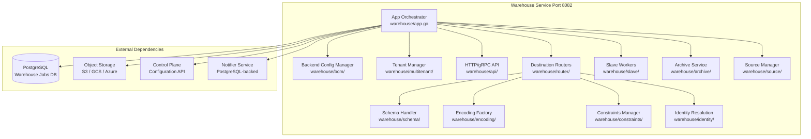
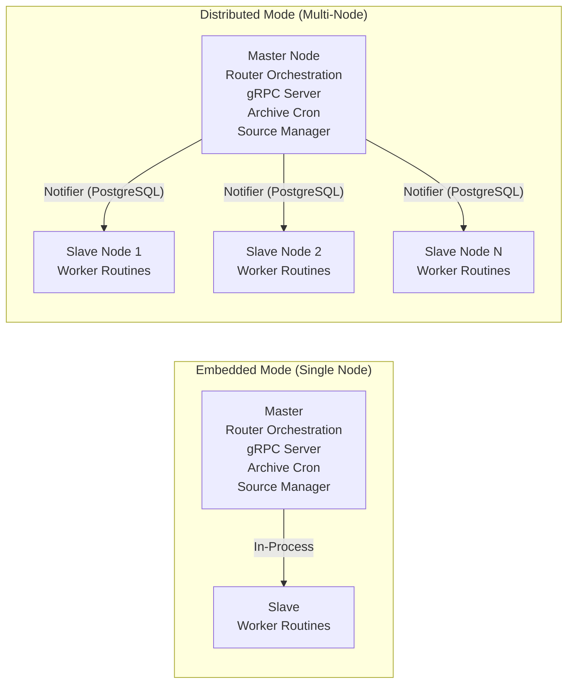
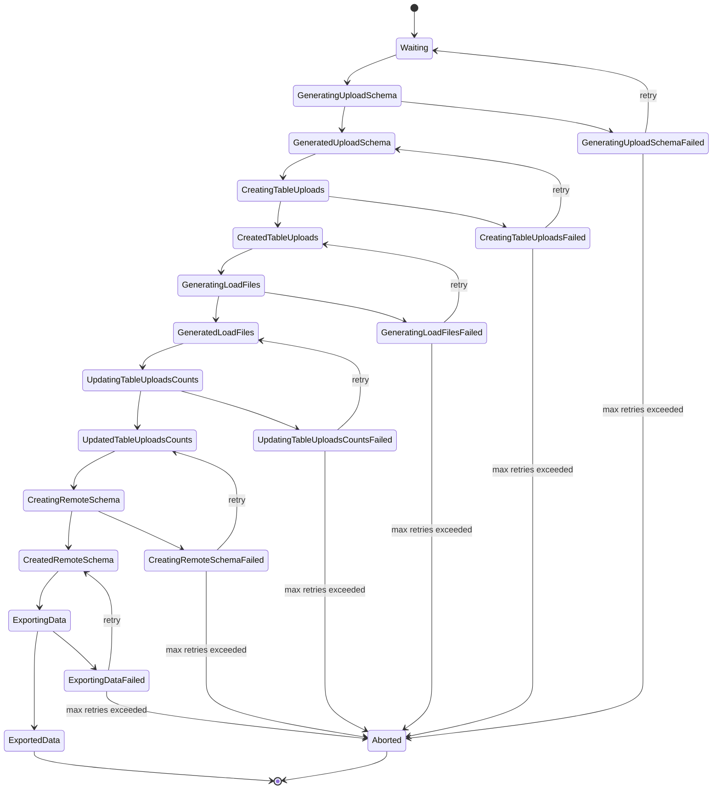
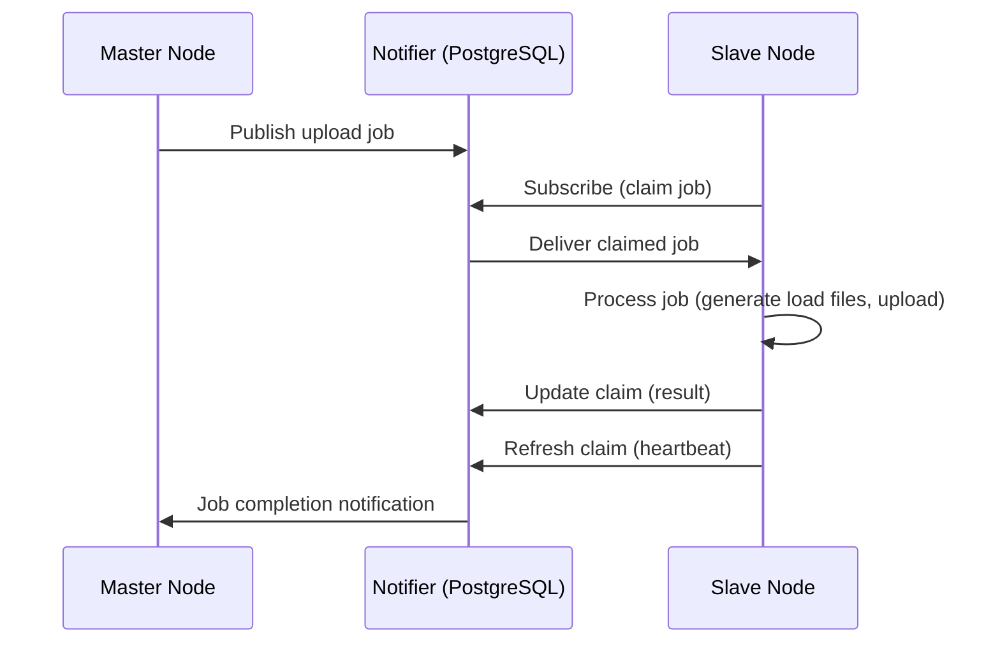

# Warehouse Service Architecture

The RudderStack warehouse service is a self-contained pipeline component responsible for loading event data into warehouse destinations. It operates as a modular orchestrator spanning 20+ sub-packages, supporting 9 warehouse connectors with configurable operational modes, a 7-state upload state machine, and both gRPC and HTTP API surfaces.

The warehouse service runs as part of the RudderStack server process (in embedded mode) or as independent master/slave nodes for distributed deployments. It receives staging files from the Processor, transforms them into load files, and executes warehouse-specific loading operations with automatic schema evolution, identity resolution, and archival.

**Supported Warehouse Connectors:**

[Snowflake](snowflake.md) | [BigQuery](bigquery.md) | [Redshift](redshift.md) | [ClickHouse](clickhouse.md) | [Databricks](databricks.md) | [PostgreSQL](postgres.md) | [SQL Server](mssql.md) | [Azure Synapse](azure-synapse.md) | [Datalake](datalake.md)

**Related Documentation:**

[Schema Evolution](schema-evolution.md) | [Encoding Formats](encoding-formats.md)

> Source: `warehouse/app.go`

---

## Architecture Overview

The warehouse service is composed of a central App orchestrator that coordinates multiple sub-components for configuration management, upload lifecycle orchestration, distributed processing, API serving, and archival. The following diagram illustrates the high-level component topology.



The App orchestrator initializes all sub-components during `Setup()` and coordinates their lifecycle during `Run()`. Each destination type (e.g., Snowflake, BigQuery) gets its own `router.Router` instance that manages the upload state machine for that destination.

> Source: `warehouse/app.go:51-72` (App struct), `warehouse/app.go:130-217` (Setup)

---

## App Orchestrator

The `App` struct is the central coordination point for the warehouse service. It wires together all sub-components and manages their lifecycle through `Setup()` and `Run()` methods.

### Core Dependencies

| Component | Type | Purpose |
|-----------|------|---------|
| `app.App` | Parent application | RudderStack application context |
| `backendconfig.BackendConfig` | Configuration | Workspace and destination configuration |
| `sqlquerywrapper.DB` | Database | PostgreSQL connection pool with query timeout and stats |
| `notifier.Notifier` | Inter-service | Master/slave work distribution via PostgreSQL-backed notifications |
| `multitenant.Manager` | Tenant management | Workspace isolation and config watching |
| `controlplane.Client` | Control plane | Remote configuration and feature reporting |
| `bcm.BackendConfigManager` | Config subscription | Backend config subscription and namespace normalization |
| `api.Api` | HTTP server | HTTP API on port 8082 |
| `api.GRPC` | gRPC server | gRPC API for control plane communication |
| `constraints.Manager` | Constraint enforcement | Merge constraint limits for BigQuery/Snowflake |
| `encoding.Factory` | Encoding | Parquet/JSON/CSV staging file generation |
| `source.Manager` | Source jobs | Source job management (HTTP API + async processing) |
| `whadmin.Admin` | Admin RPC | Admin operations (connection fetch, upload toggles, ad-hoc SQL) |

> Source: `warehouse/app.go:51-72`

### Setup Flow

The `Setup()` method initializes the warehouse service in the following order:

1. **`setupDatabase`** — Opens PostgreSQL connection, validates compatibility (requires PostgreSQL ≥ 10), runs schema migrations (on master only), and creates the `sqlquerywrapper.DB` with query timeout and stats collection.
2. **Create tenant manager** — Initializes `multitenant.Manager` for workspace isolation and config watching.
3. **Create control plane client** — Establishes connection to the configuration backend URL with optional region routing.
4. **Create backend config manager** — Sets up `bcm.BackendConfigManager` for subscribing to workspace configuration changes and namespace normalization.
5. **Create constraints manager** — Initializes merge constraint enforcement (column count and size limits per destination).
6. **Create encoding factory** — Sets up the factory for creating Parquet, JSON, and CSV file encoders.
7. **Create notifier** — Initializes the PostgreSQL-backed notifier for master/slave work distribution.
8. **Create source manager** — Sets up source job management with HTTP API and async processing.
9. **Create gRPC server** — Initializes the gRPC server for control plane communication.
10. **Create HTTP API** — Sets up the HTTP API server on port 8082.
11. **Create admin service** — Registers the admin RPC handler.

> Source: `warehouse/app.go:130-217`

---

## Operational Modes

The warehouse service supports three primary operational modes configured via `Warehouse.mode` (default: `"embedded"`) and a degraded running mode configured via `Warehouse.runningMode`.

### Embedded Mode

```
Warehouse.mode = "embedded"
```

- Runs **both master and slave** in the same process
- Router orchestration, gRPC server, archive cron, source manager, and slave workers are all active
- Suitable for single-node development and small-scale production deployments
- This is the default mode when no explicit configuration is provided

In embedded mode, the `IsMaster()` and `IsSlave()` functions both return `true`, enabling all components to run within a single process.

> Source: `warehouse/internal/mode/mode.go`

### Master Mode

```
Warehouse.mode = "master"
```

- Runs **router orchestration, gRPC server, archive cron, and source manager**
- Does **NOT** run slave workers
- Distributes work to remote slaves via the notifier service
- Monitors destination routers and creates per-destination `router.Router` instances
- Reports warehouse features to the control plane
- Clears stale notifier jobs on startup

Master mode is designed for distributed deployments where upload orchestration runs on a dedicated node while processing is distributed across slave nodes.

> Source: `warehouse/app.go:428-457`

### Slave Mode

```
Warehouse.mode = "slave"
```

- Runs **slave workers only**
- Receives work from master via the notifier service
- Each slave spawns `Warehouse.noOfSlaveWorkerRoutines` (default: 4) concurrent worker goroutines
- Workers claim jobs from the notifier, process them (generate load files, execute uploads), and report results back
- Does **NOT** run router orchestration, gRPC server, or archive cron

Slave mode is designed for horizontal scaling — additional slave nodes can be added to increase upload throughput.

> Source: `warehouse/app.go:412-426`, `warehouse/slave/slave.go:67-84`

### Degraded Mode

```
Warehouse.runningMode = "degraded"
```

- **Minimal operation** — only gRPC server (if master) and HTTP API are started
- No router orchestration, slave processing, archive cron, or source manager
- Tenant manager and backend config manager still run for configuration awareness
- Used for **maintenance windows** where the warehouse service needs to remain accessible for health checks and API queries but should not process uploads

Degraded mode can be combined with any operational mode (embedded, master, slave).

> Source: `warehouse/app.go:369-383`

### Deployment Topology



### Mode Configuration Reference

| Parameter | Default | Type | Range | Description |
|-----------|---------|------|-------|-------------|
| `Warehouse.mode` | `"embedded"` | string | `embedded`, `master`, `slave`, `master_slave`, `embedded_master` | Operational mode |
| `Warehouse.runningMode` | `""` | string | `""`, `"degraded"` | Running mode: `"degraded"` or empty for normal operation |
| `WAREHOUSE_JOBS_DB_HOST` | `"localhost"` | string | Valid hostname/IP | PostgreSQL host for warehouse jobs database |
| `WAREHOUSE_JOBS_DB_PORT` | `5432` | int | 1–65535 | PostgreSQL port |
| `WAREHOUSE_JOBS_DB_USER` | `"ubuntu"` | string | Valid username | PostgreSQL user |
| `WAREHOUSE_JOBS_DB_PASSWORD` | `"ubuntu"` | string | Valid password | PostgreSQL password |
| `WAREHOUSE_JOBS_DB_DB_NAME` | `"ubuntu"` | string | Valid database name | PostgreSQL database name |
| `WAREHOUSE_JOBS_DB_SSL_MODE` | `"disable"` | string | `disable`, `require`, `verify-ca`, `verify-full` | PostgreSQL SSL mode |
| `Warehouse.maxOpenConnections` | `20` | int | ≥ 1 | Maximum PostgreSQL connection pool size |
| `Warehouse.webPort` | `8082` | int | 1–65535 | HTTP API listen port |
| `Warehouse.dbHandleTimeout` | `5m` | duration | ≥ 0s | Database query timeout |

> **⚠️ Security Advisory:** The default PostgreSQL credentials (`WAREHOUSE_JOBS_DB_USER="ubuntu"`, `WAREHOUSE_JOBS_DB_PASSWORD="ubuntu"`) are intended for development only. **Override these with secure credentials in production deployments.**

> Source: `warehouse/app.go:111-124`

---

## Upload State Machine

The upload state machine is the core orchestration mechanism for warehouse loading operations. Each upload progresses through 7 sequential states, with each state having an in-progress variant and a failed variant. A terminal `Aborted` state handles unrecoverable failures.

### State Definitions

The states are defined in `warehouse/internal/model/upload.go` and the transition logic is implemented in `warehouse/router/state.go`:

| # | State (Completed) | In-Progress | Failed | Implementation File |
|---|-------------------|-------------|--------|---------------------|
| 1 | `waiting` | — | — | Initial state; upload queued for processing |
| 2 | `generated_upload_schema` | `generating_upload_schema` | `generating_upload_schema_failed` | `state_generate_upload_schema.go` — merges staging file schemas and persists the consolidated upload schema |
| 3 | `created_table_uploads` | `creating_table_uploads` | `creating_table_uploads_failed` | `state_create_table_uploads.go` — builds the table upload list including identity tables for identity-enabled warehouses |
| 4 | `generated_load_files` | `generating_load_files` | `generating_load_files_failed` | `state_generate_load_files.go` — orchestrates load file creation from staging data and validates output |
| 5 | `updated_table_uploads_counts` | `updating_table_uploads_counts` | `updating_table_uploads_counts_failed` | `state_update_table_uploads.go` — propagates row counts to table upload entries |
| 6 | `created_remote_schema` | `creating_remote_schema` | `creating_remote_schema_failed` | `state_create_schema.go` — creates or updates the remote warehouse schema (tables, columns) with automatic schema evolution |
| 7 | `exported_data` | `exporting_data` | `exporting_data_failed` | `state_export_data.go` — drives the data export across user tables, identity tables, and regular tables |
| — | `aborted` | — | — | Terminal failure state for unrecoverable errors |

### State Transition Chain

```
Waiting → Generated Upload Schema → Created Table Uploads → Generated Load Files
→ Updated Table Uploads Counts → Created Remote Schema → Exported Data
```

Each state transition follows the same pattern:
1. The upload enters the **in-progress** variant of the next state
2. The state handler executes its logic
3. On success, the upload advances to the **completed** variant
4. On failure, the upload moves to the **failed** variant, which may trigger retry or transition to **Aborted**

The `nextState` wiring in `warehouse/router/state.go` defines the linear progression:

```
waitingState → generateUploadSchemaState → createTableUploadsState
→ generateLoadFilesState → updateTableUploadCountsState
→ createRemoteSchemaState → exportDataState → nil (terminal)
```

> Source: `warehouse/router/state.go:74-81`

### State Machine Diagram



### State Descriptions

**1. Waiting** — The initial state assigned when an upload is created. The upload is queued and waiting for a worker to pick it up for processing.

**2. Generated Upload Schema** — The upload schema is merged from all associated staging files. This consolidates individual staging file schemas into a unified schema representing all tables and columns for this upload batch.

**3. Created Table Uploads** — Individual table upload entries are created for each table in the upload schema. For identity-enabled warehouses (Snowflake, BigQuery, Redshift), identity merge rule and mapping tables are also included.

**4. Generated Load Files** — Load files are generated from staging data. This involves either local processing or distributed processing via the notifier (in master/slave deployments). The load file generator creates destination-specific formatted files (Parquet, JSON, CSV) and uploads them to object storage.

**5. Updated Table Upload Counts** — Row counts from generated load files are propagated to the table upload entries for tracking and monitoring purposes.

**6. Created Remote Schema** — The remote warehouse schema is inspected and updated to match the upload schema. New tables are created, new columns are added to existing tables, and schema evolution is handled automatically. See [Schema Evolution](schema-evolution.md) for details.

**7. Exported Data** — The actual data export to the warehouse is executed. This is driven by the destination-specific connector implementation, which loads data from load files into the warehouse tables. The export processes tables in a specific order: user tables first, then identity tables, then all remaining tables.

**Aborted** — Terminal failure state entered when an upload exceeds the maximum retry attempts or encounters an unrecoverable error. Aborted uploads are not retried automatically.

> Source: `warehouse/router/state.go:1-103`, `warehouse/internal/model/upload.go:12-25`

---

## Router Orchestration

The router orchestration layer manages per-destination upload lifecycles. When the warehouse service starts in master mode, it monitors the tenant configuration and creates a `router.Router` instance for each unique destination type that appears in the workspace configuration.

### Per-Destination Router Creation

The `monitorDestRouters` function watches the tenant manager's config channel for configuration updates. When a new destination type is detected (e.g., a user enables Snowflake for the first time), a new `router.Router` is created and started:

1. `monitorDestRouters` receives config data from `tenantManager.WatchConfig()`
2. `onConfigDataEvent` iterates through all sources and destinations in the workspace
3. For each warehouse destination type not yet tracked, a new `router.Router` is created via `router.New()`
4. The new router is started via `router.Start()` which launches its internal goroutines

Each router manages its own set of worker channels, one per unique `destinationID_namespace` combination. This ensures that uploads for different source-destination pairs within the same destination type are processed independently.

> Source: `warehouse/app.go:470-530`

### Router Lifecycle

When a `router.Router` starts, it launches four concurrent goroutines:

1. **`backendConfigSubscriber`** — Subscribes to backend config changes filtered by destination type. Updates the list of active warehouses, sets up identity tables for identity-enabled warehouses, and spawns worker channels for new source-destination pairs.

2. **`runUploadJobAllocator`** — Picks up pending uploads from the database and allocates them to available worker channels. Respects the `maxConcurrentUploadJobs` limit per destination.

3. **`mainLoop`** — The primary scheduling loop that:
   - Iterates over all active warehouses
   - Checks scheduling constraints (frequency, exclude windows, manual sync)
   - Creates new uploads from pending staging files
   - Groups staging files into upload batches using `stagingFilesBatchSize`

4. **`cronTracker`** — Monitors stale uploads and triggers retry logic for uploads that have been in-progress for too long.

> Source: `warehouse/router/router.go:183-205`

### Scheduling

The scheduler determines when uploads can be created for each warehouse. The scheduling logic respects several constraints:

| Constraint | Description | Error |
|------------|-------------|-------|
| **Force upload** | Admin override via `createUploadAlways` flag | Always allows |
| **Manual trigger** | Upload triggered via API or admin | Always allows |
| **Manual sync mode** | Destination configured for manual-only syncs | `errManualSyncModeEnabled` |
| **Sync frequency ignore** | Global override to bypass scheduled frequencies | Checks upload frequency only |
| **Exclude windows** | Configurable time ranges (start/end in HH:MM format) where no uploads should start | `errCurrentTimeExistsInExcludeWindow` |
| **Scheduled frequency** | Configured sync frequency (e.g., every 30 minutes) with start time | `errBeforeScheduledTime` |

The `prevScheduledTime` function calculates the most recent scheduled sync time and compares it against the last upload creation time to determine if a new upload should be started.

> Source: `warehouse/router/scheduling.go:28-80`

### Error Classification

The router includes an error classification system that maps runtime errors from warehouse connectors to categorized error types via regex pattern matching:

| Error Type | Description |
|------------|-------------|
| `permission_error` | Authentication or authorization failures |
| `insufficient_resource_error` | Warehouse capacity or quota exceeded |
| `concurrent_queries_error` | Too many concurrent queries on the warehouse |
| `column_size_error` | Data exceeds column size limits |
| `column_count_error` | Table exceeds maximum column count |
| `resource_not_found_error` | Referenced resource (table, schema, database) does not exist |
| `alter_column_error` | Column type alteration failure |
| `uncategorised` | Default category for unmatched errors |

Each warehouse connector implements the `errorMapper` interface, providing destination-specific regex patterns that map error strings to these categories.

> Source: `warehouse/router/errors.go`, `warehouse/internal/model/upload.go:27-49`

---

## API Surface

The warehouse service exposes both HTTP and gRPC API surfaces for external communication, control plane integration, and operational management.

### HTTP API (Port 8082)

The HTTP API is served on the port configured by `Warehouse.webPort` (default: `8082`) and is available in all operational modes. In master mode, additional endpoints are registered for staging file processing and warehouse management.

**Common Endpoints (All Modes):**

| Method | Path | Description |
|--------|------|-------------|
| `GET` | `/health` | Health check — verifies database and notifier connectivity |

**Master-Only Endpoints:**

| Method | Path | Description |
|--------|------|-------------|
| `POST` | `/v1/process` | Staging file notification — receives staging file metadata from the Processor |
| `POST` | `/v1/warehouse/pending-events` | Check pending staging files and uploads for a source |
| `POST` | `/v1/warehouse/trigger-upload` | Manually trigger an upload for a specific destination |
| `POST` | `/v1/warehouse/jobs` | Insert a new source job |
| `GET` | `/v1/warehouse/jobs/status` | Check status of a source job |
| `GET` | `/v1/warehouse/fetch-tables` | Fetch table lists for source-destination connections |
| `GET` | `/internal/v1/warehouse/fetch-tables` | Internal endpoint for fetching table lists |

> Source: `warehouse/api/http.go:126-201`

### gRPC API

The gRPC server implements the `WarehouseServer` interface defined in `proto/warehouse/`. It provides 15 unary RPCs for control plane communication, upload management, and validation:

| RPC | Description |
|-----|-------------|
| `GetHealth` | Health check returning boolean status |
| `GetWHUploads` | List warehouse uploads with filtering |
| `GetWHUpload` | Get details of a specific upload |
| `TriggerWHUpload` | Trigger a specific upload |
| `TriggerWHUploads` | Trigger uploads matching filter criteria |
| `Validate` | Validate a warehouse destination configuration |
| `RetryWHUploads` | Retry failed uploads matching filter criteria |
| `CountWHUploadsToRetry` | Count uploads eligible for retry |
| `ValidateObjectStorageDestination` | Validate object storage configuration |
| `RetrieveFailedBatches` | Retrieve details of failed upload batches |
| `RetryFailedBatches` | Retry specific failed batches |
| `GetFirstAbortedUploadInContinuousAbortsByDestination` | Find the first aborted upload in a series of continuous aborts |
| `GetSyncLatency` | Get sync latency metrics for a destination |
| `SyncWHSchema` | Synchronize warehouse schema |
| `GetDestinationNamespaces` | List namespaces for a destination |

> Source: `proto/warehouse/*.proto:11-25`, `warehouse/api/grpc.go`

---

## Sub-Package Reference

The warehouse service spans 20+ sub-packages, each responsible for a bounded slice of the warehouse loading pipeline:

| Package | Path | Purpose |
|---------|------|---------|
| `router` | `warehouse/router/` | Upload lifecycle orchestration, 7-state machine, scheduling, error classification, worker management, cron tracking |
| `integrations` | `warehouse/integrations/` | Per-destination connector implementations for 9 warehouses, shared middleware (SQL query wrapper, tunnelling), and connector manager |
| `schema` | `warehouse/schema/` | Schema caching, diff detection, staging file schema consolidation, identity resolution schema injection, discards table management |
| `encoding` | `warehouse/encoding/` | Staging and load file encoding factories for Parquet, JSON, and CSV formats with destination-aware naming and timestamp formatting |
| `identity` | `warehouse/identity/` | Identity resolution pipeline implementing merge-rule resolution, identity mapping tables, and cross-touchpoint unification |
| `slave` | `warehouse/slave/` | Distributed processing workers that claim jobs from the notifier, download staging files, generate load files, and report results |
| `source` | `warehouse/source/` | Source job management with HTTP handlers for insert/status operations, validation, notifier interactions, and async processing |
| `api` | `warehouse/api/` | gRPC and HTTP API endpoint implementations with multi-tenant awareness, instrumentation, and health checking |
| `admin` | `warehouse/admin/` | Admin RPC service providing connection fetch, upload toggle, ad-hoc SQL execution, and destination configuration testing |
| `bcm` | `warehouse/bcm/` | Backend config manager handling subscription to workspace configuration, namespace normalization (including ClickHouse overrides), SSH tunnelling enrichment, and subscriber management |
| `archive` | `warehouse/archive/` | Staging and load file archival to object storage with configurable retention, cron-based sweep scheduling, and batch backup operations |
| `constraints` | `warehouse/constraints/` | Merge constraint enforcement for BigQuery and Snowflake destinations, mapping metadata to human-readable violation messages behind a reloadable feature flag |
| `client` | `warehouse/client/` | Unified SQL and BigQuery client abstractions, legacy `/v1/process` HTTP ingestion client with stats, and control-plane SSH key helpers |
| `internal` | `warehouse/internal/` | Core domain models (`model/`), repository implementations (`repo/`), internal services, load file generation (`loadfiles/`), mode detection (`mode/`), snapshot management, and the `/v1/process` handler |
| `multitenant` | `warehouse/multitenant/` | Tenant management and workspace configuration watching with pub/sub distribution |
| `validations` | `warehouse/validations/` | Destination validation orchestration covering object storage, connections, schema, and loading validation steps with instrumentation |
| `safeguard` | `warehouse/safeguard/` | Concurrency watchdog (`Guard.MustStop`) ensuring async cleanup routines complete within timeout |
| `testhelper` | `warehouse/testhelper/` | Deterministic test utilities for windowed duration statistics (max, percentile, average) |
| `utils` | `warehouse/utils/` | Shared utilities including context propagation, JSON patch wrappers, query classification, reserved keywords maps, stats normalization, destination/object-storage helpers, and AWS credential resolution |
| `logfield` | `warehouse/logfield/` | Structured logging field definitions for consistent log key usage across all warehouse sub-packages |

> Source: `warehouse/` directory structure

---

## Parallel Loading

The warehouse service supports parallel loading to maximize upload throughput. The parallel loading architecture is configurable per-destination type and operates at multiple levels.

### Per-Destination Configuration

Each destination type has a configurable maximum number of parallel loads:

| Destination | Config Parameter | Default |
|-------------|-----------------|---------|
| Snowflake | `Warehouse.snowflake.maxParallelLoads` | `3` |
| BigQuery | `Warehouse.bigquery.maxParallelLoads` | `20` |
| Redshift | `Warehouse.redshift.maxParallelLoads` | `3` |
| PostgreSQL | `Warehouse.postgres.maxParallelLoads` | `3` |
| ClickHouse | `Warehouse.clickhouse.maxParallelLoads` | `3` |
| SQL Server | `Warehouse.mssql.maxParallelLoads` | `3` |
| Azure Synapse | `Warehouse.azure_synapse.maxParallelLoads` | `3` |
| Databricks | See destination-specific config | Varies |
| Datalake | See destination-specific config | Varies |

> Source: `config/config.yaml:160-184`

### Worker Pool Architecture

The parallel loading system operates through several layers:

1. **Router Workers** — Each router spawns `Warehouse.noOfWorkers` (default: `8`) worker goroutines per destination type. Workers are mapped to unique `destinationID_namespace` pairs, ensuring isolated processing per source-destination combination.

2. **Concurrent Upload Jobs** — Within each worker, `Warehouse.<destination>.maxConcurrentUploadJobs` (default: `1`) controls how many upload jobs can run simultaneously for a single destination identifier.

3. **Slave Worker Routines** — In distributed deployments, each slave node runs `Warehouse.noOfSlaveWorkerRoutines` (default: `4`) concurrent worker goroutines that claim and process jobs from the notifier.

4. **Table-Level Parallelism** — During the `Exported Data` state, the export processes tables in a prioritized order (user tables → identity tables → regular tables) with per-destination parallel load limits controlling concurrent table operations.

### Constraints Manager

The `constraints.Manager` enforces merge constraints that limit parallel operations based on destination-specific capabilities:

- **BigQuery** — Enforces column count limits per table and merge operation constraints
- **Snowflake** — Enforces similar column and merge constraints

These constraints are checked before initiating parallel load operations to prevent warehouse-side failures.

> Source: `warehouse/constraints/`, `warehouse/router/router.go:702`

---

## Master/Slave Communication

In distributed deployments (master/slave mode), the master and slave nodes communicate through a PostgreSQL-backed notifier service. This design ensures reliable work distribution with at-least-once delivery semantics.

### Communication Flow



### Master Responsibilities

- Creates upload jobs based on pending staging files
- Publishes jobs to the notifier with destination type, workspace, and configuration metadata
- Clears stale jobs on startup via `notifier.ClearJobs()`
- Monitors job completion and updates upload status

### Slave Responsibilities

- Each slave generates a unique `slaveID` using `misc.FastUUID()`
- Subscribes to the notifier with a buffer size equal to `noOfSlaveWorkerRoutines`
- Spawns worker goroutines that listen on the notification channel
- Each worker:
  1. Claims a job from the notification channel
  2. Downloads staging files from object storage
  3. Generates load files using the encoding factory
  4. Uploads load files to object storage
  5. Reports results back via `notifier.UpdateClaim()`
  6. Periodically refreshes the claim via `notifier.RefreshClaim()` to prevent timeout

### Notifier Configuration

The notifier uses a dedicated PostgreSQL connection (separate from the main warehouse jobs database when `WAREHOUSE_JOBS_DB_*` environment variables are set). The workspace identifier is derived from the Kubernetes namespace and a hashed workspace token to ensure multi-tenant isolation.

> Source: `warehouse/slave/slave.go:44-84`, `warehouse/app.go:160-174`

---

## Archival and Retention

The warehouse service includes a cron-based archival system that manages the lifecycle of staging files and load files, archiving completed data to object storage and cleaning up expired records.

### Archive Cron Worker

The `CronArchiver` function runs as a background goroutine in master mode. It executes on a configurable ticker interval and performs two operations:

1. **Archive Upload Records** — When `Warehouse.archiveUploadRelatedRecords` is enabled (default: `true`), the archiver backs up completed upload records and their associated staging/load file metadata to object storage. Records are processed in batches of `Warehouse.Archiver.backupRowsBatchSize` (default: `100`).

2. **Delete Expired Uploads** — When `Warehouse.Archiver.canDeleteUploads` is enabled, the archiver deletes upload records that have exceeded the retention period, along with their associated staging and load files.

### Archival Flow

1. The archiver queries `wh_uploads` for completed uploads eligible for archival
2. For each upload, it gathers associated staging files and load files
3. Records are serialized and uploaded to the configured object storage (S3, GCS, Azure Blob)
4. Source database records are marked as archived or deleted after successful backup
5. File manager handles the actual object storage operations with retry logic

### Configuration

| Parameter | Default | Type | Range | Description |
|-----------|---------|------|-------|-------------|
| `Warehouse.archiveUploadRelatedRecords` | `true` | bool | `true` / `false` | Enable archival of completed upload records |
| `Warehouse.Archiver.backupRowsBatchSize` | `100` | int | ≥ 1 | Number of records per archival batch |
| `Warehouse.Archiver.canDeleteUploads` | Varies | bool | `true` / `false` | Enable deletion of expired uploads |

> Source: `warehouse/archive/cron.go:10-33`, `warehouse/archive/archiver.go:63-96`

---

## Configuration Reference

The following table provides a comprehensive reference of all warehouse-level configuration parameters. Destination-specific parameters are documented in the respective connector guides.

### Core Configuration

| Parameter | Default | Type | Range | Description |
|-----------|---------|------|-------|-------------|
| `Warehouse.mode` | `"embedded"` | string | `embedded`, `master`, `slave`, `master_slave`, `embedded_master` | Operational mode |
| `Warehouse.runningMode` | `""` | string | `""`, `"degraded"` | Running mode: `"degraded"` or empty for normal operation |
| `Warehouse.webPort` | `8082` | int | 1–65535 | HTTP API listen port |
| `Warehouse.dbHandleTimeout` | `5m` | duration | ≥ 0s | Database query timeout for all warehouse DB operations |
| `Warehouse.maxOpenConnections` | `20` | int | ≥ 1 | Maximum PostgreSQL connection pool size |

### Database Configuration

| Parameter | Default | Type | Range | Description |
|-----------|---------|------|-------|-------------|
| `WAREHOUSE_JOBS_DB_HOST` | `"localhost"` | string | Valid hostname/IP | PostgreSQL host for warehouse jobs database |
| `WAREHOUSE_JOBS_DB_PORT` | `5432` | int | 1–65535 | PostgreSQL port |
| `WAREHOUSE_JOBS_DB_USER` | `"ubuntu"` | string | Valid username | PostgreSQL user |
| `WAREHOUSE_JOBS_DB_PASSWORD` | `"ubuntu"` | string | Valid password | PostgreSQL password |
| `WAREHOUSE_JOBS_DB_DB_NAME` | `"ubuntu"` | string | Valid database name | PostgreSQL database name |
| `WAREHOUSE_JOBS_DB_SSL_MODE` | `"disable"` | string | `disable`, `require`, `verify-ca`, `verify-full` | PostgreSQL SSL mode |

> **⚠️ Security Advisory:** The default PostgreSQL credentials (`WAREHOUSE_JOBS_DB_USER="ubuntu"`, `WAREHOUSE_JOBS_DB_PASSWORD="ubuntu"`) are intended for development only. **Override these with secure credentials in production deployments.**

### Upload Scheduling

| Parameter | Default | Type | Range | Description |
|-----------|---------|------|-------|-------------|
| `Warehouse.uploadFreqInS` | `1800` | int (seconds) | ≥ 1 | Default upload frequency when no destination-level schedule is configured |
| `Warehouse.uploadFreq` | `1800s` | duration | > 0s | Upload frequency (alternate key) |
| `Warehouse.noOfWorkers` | `8` | int | ≥ 1 | Number of worker goroutines per destination router |
| `Warehouse.mainLoopSleep` | `5s` | duration | > 0s | Sleep interval between main scheduling loop iterations |
| `Warehouse.stagingFilesBatchSize` | `960` | int | ≥ 1 | Maximum number of staging files grouped into a single upload batch |
| `Warehouse.enableJitterForSyncs` | `false` | bool | `true` / `false` | Add random jitter to sync schedules to prevent thundering herd |
| `Warehouse.warehouseSyncFreqIgnore` | `false` | bool | `true` / `false` | Ignore destination-configured sync frequency; use `uploadFreqInS` instead |
| `Warehouse.uploadBufferTimeInMin` | `180m` | duration | ≥ 0s | Buffer time for upload scheduling decisions |
| `Warehouse.maxParallelJobCreation` | `8` | int | ≥ 1 | Maximum concurrent upload job creation operations |

### Slave Configuration

| Parameter | Default | Type | Range | Description |
|-----------|---------|------|-------|-------------|
| `Warehouse.noOfSlaveWorkerRoutines` | `4` | int | ≥ 1 | Number of concurrent worker goroutines per slave node |

### Retry and Backoff

| Parameter | Default | Type | Range | Description |
|-----------|---------|------|-------|-------------|
| `Warehouse.retryTimeWindow` | `180m` | duration | > 0s | Maximum time window for retrying failed uploads |
| `Warehouse.minRetryAttempts` | `3` | int | ≥ 1 | Minimum retry attempts before aborting |
| `Warehouse.minUploadBackoff` | `60s` | duration | ≥ 0s | Minimum backoff between upload retries |
| `Warehouse.maxUploadBackoff` | `1800s` | duration | ≥ 0s | Maximum backoff between upload retries |
| `Warehouse.maxFailedCountForJob` | `128` | int | ≥ 1 | Maximum failure count before a job is permanently aborted |
| `Warehouse.cronTrackerRetries` | `5` | int | ≥ 0 | Number of retries for cron tracker operations |

### Identity Resolution

| Parameter | Default | Type | Range | Description |
|-----------|---------|------|-------|-------------|
| `Warehouse.enableIDResolution` | `false` | bool | `true` / `false` | Enable identity resolution for supported warehouses |
| `Warehouse.populateHistoricIdentities` | `false` | bool | `true` / `false` | Backfill historic identity data when identity resolution is enabled |

### Archival

| Parameter | Default | Type | Range | Description |
|-----------|---------|------|-------|-------------|
| `Warehouse.archiveUploadRelatedRecords` | `true` | bool | `true` / `false` | Enable archival of completed upload records to object storage |
| `Warehouse.Archiver.backupRowsBatchSize` | `100` | int | ≥ 1 | Number of records per archival batch |

### Per-Destination Parallel Loads

| Destination | Parameter | Default |
|-------------|-----------|---------|
| Snowflake | `Warehouse.snowflake.maxParallelLoads` | `3` |
| BigQuery | `Warehouse.bigquery.maxParallelLoads` | `20` |
| Redshift | `Warehouse.redshift.maxParallelLoads` | `3` |
| PostgreSQL | `Warehouse.postgres.maxParallelLoads` | `3` |
| SQL Server | `Warehouse.mssql.maxParallelLoads` | `3` |
| Azure Synapse | `Warehouse.azure_synapse.maxParallelLoads` | `3` |
| ClickHouse | `Warehouse.clickhouse.maxParallelLoads` | `3` |

### ClickHouse-Specific Configuration

| Parameter | Default | Type | Range | Description |
|-----------|---------|------|-------|-------------|
| `Warehouse.clickhouse.queryDebugLogs` | `false` | bool | `true` / `false` | Enable ClickHouse query debug logging |
| `Warehouse.clickhouse.blockSize` | `1000` | int | ≥ 1 | ClickHouse block size for batch inserts |
| `Warehouse.clickhouse.poolSize` | `10` | int | ≥ 1 | ClickHouse connection pool size |
| `Warehouse.clickhouse.disableNullable` | `false` | bool | `true` / `false` | Disable nullable columns in ClickHouse |
| `Warehouse.clickhouse.enableArraySupport` | `false` | bool | `true` / `false` | Enable array column support for ClickHouse |

### Databricks-Specific Configuration

| Parameter | Default | Type | Range | Description |
|-----------|---------|------|-------|-------------|
| `Warehouse.deltalake.loadTableStrategy` | `"MERGE"` | string | `"MERGE"`, `"APPEND"` | Load strategy: `MERGE` (dedup) or `APPEND` |

> Source: `warehouse/app.go:111-124`, `config/config.yaml:145-184`, `warehouse/router/router.go:702-722`

---

## Related Documentation

- **Per-Connector Guides:** [Snowflake](snowflake.md) · [BigQuery](bigquery.md) · [Redshift](redshift.md) · [ClickHouse](clickhouse.md) · [Databricks](databricks.md) · [PostgreSQL](postgres.md) · [SQL Server](mssql.md) · [Azure Synapse](azure-synapse.md) · [Datalake](datalake.md)
- **Schema Management:** [Schema Evolution](schema-evolution.md) — automatic schema creation, column addition, and type evolution
- **File Formats:** [Encoding Formats](encoding-formats.md) — Parquet, JSON, and CSV staging/load file reference
- **Architecture:** [System Architecture](../architecture/overview.md) · [Data Flow](../architecture/data-flow.md) · [Warehouse State Machine](../architecture/warehouse-state-machine.md)
- **Operations:** [Warehouse Sync Guide](../guides/operations/warehouse-sync.md) · [Capacity Planning](../guides/operations/capacity-planning.md)
