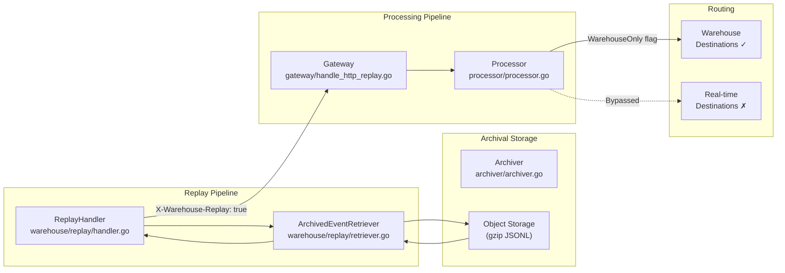
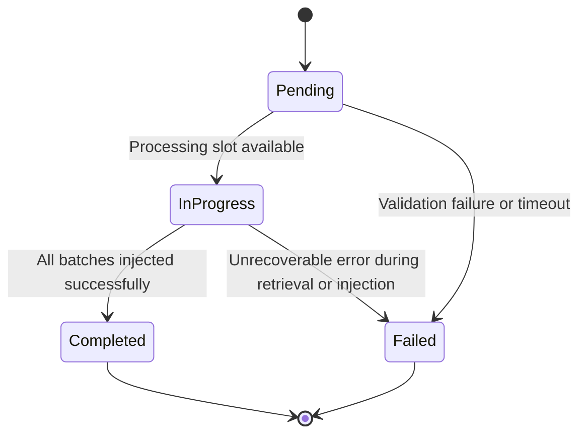

# Warehouse Replay

Warehouse replay enables re-processing of archived events exclusively through the warehouse pipeline, bypassing real-time destination routing. This allows warehouse state to be rebuilt from historical data without triggering duplicate deliveries to downstream destinations (webhooks, cloud destinations, etc.).

The replay pipeline flows from the archiver through the Gateway and Processor, with a warehouse-only routing flag that ensures events are routed exclusively to warehouse destinations.

> Source: `warehouse/replay/`

---

## Pipeline Architecture

The replay pipeline orchestrates the full event lifecycle from archived storage through the Gateway and Processor and into the warehouse, while explicitly bypassing real-time Router delivery. The `ReplayHandler` coordinates retrieval, batching, and injection, while the `X-Warehouse-Replay` header ensures the Processor routes events exclusively to warehouse destinations.



The `ReplayHandler` receives a replay request via the HTTP API, delegates to the `ArchivedEventRetriever` to fetch archived events from object storage, batches them, and injects each batch into the Gateway replay endpoint with the `X-Warehouse-Replay: true` header. The Processor detects the `WarehouseOnly` flag on replay events and routes them exclusively to warehouse destinations, skipping Router-stage real-time delivery.

> Source: `warehouse/replay/handler.go`, `warehouse/replay/retriever.go`

---

## Core Concepts

### Warehouse-Only Routing Flag

The warehouse-only routing flag is the mechanism that ensures replayed events flow exclusively to warehouse destinations and do not trigger duplicate deliveries to real-time destinations (webhooks, cloud destinations, etc.).

| Component | File | Behavior |
|-----------|------|----------|
| ReplayHandler | `warehouse/replay/handler.go` | Sets `X-Warehouse-Replay: true` HTTP header on all batches sent to the Gateway |
| Gateway | `gateway/handle_http_replay.go` | `webReplayHandler()` detects the header and tags event metadata with a warehouse-only routing flag |
| Backend-Config | `backend-config/replay_types.go` | `EventReplayConfig` struct carries a `WarehouseOnly bool` field; `ApplyReplaySources()` propagates the flag to replay source/destination copies |
| Processor | `processor/processor.go` | 6-stage pipeline detects the `WarehouseOnly` flag on replay events and routes them exclusively to warehouse destinations, bypassing Router-stage real-time delivery |

When the `ReplayHandler` injects events into the Gateway, it sets the `X-Warehouse-Replay: true` HTTP header via the `GatewayClient` interface. The Gateway's `webReplayHandler()` function wraps the replay call type and detects this header, tagging the event metadata for warehouse-only routing. The Processor's main processing loop then detects this flag and skips Router-stage destinations, ensuring events flow only into the warehouse pipeline.

> Source: `warehouse/replay/handler.go:52-57`, `gateway/handle_http_replay.go`, `backend-config/replay_types.go:64-68`, `processor/processor.go`

### Archived Event Retrieval

The `ArchivedEventRetriever` queries the archiver for gateway events within a specified date range, decompresses them from gzipped JSONL format, and prepares batches for replay injection.

**Retrieval flow:**

1. Query the `ArchiverQuerier` interface for archived event batches matching the source ID and date range
2. For each batch, decompress gzip-compressed JSONL data
3. Parse each JSONL line into an `ArchivedEvent` struct using `jsonrs.Unmarshal`
4. Return all events as a flat slice for downstream batching by the `ReplayHandler`

Archived events are stored as gzipped JSONL files in object storage (S3, GCS, or Azure Blob). Each line in the JSONL file represents a single gateway event payload. The retriever uses a buffered scanner with a maximum token size of 10 MB to accommodate large event payloads.

Batch size during injection is controlled by the `Warehouse.replay.batchSize` configuration key (default: 1000 events per batch).

> Source: `warehouse/replay/retriever.go`, `warehouse/archive/archiver.go`

### Job Tracking

Each replay request creates a `ReplayJob` with a unique monotonic job ID, tracked in memory by the `ReplayHandler`'s thread-safe job store (`replayJobStore`).

- Jobs are assigned sequential IDs starting at 1
- The job store uses `sync.RWMutex` for concurrent read access (`GetStatus`) and serialized writes (`Create`, `UpdateStatus`)
- Job status follows the lifecycle: `Pending` → `InProgress` → `Completed` / `Failed`
- Terminal jobs (`Completed` / `Failed`) can be pruned from memory after a configurable retention period via `PruneTerminalJobs()`

> Source: `warehouse/replay/handler.go:67-172`

---

## REST API Endpoints

### POST /v1/warehouse/replay — Trigger Warehouse Replay

Triggers a new warehouse replay job that re-processes archived events through the warehouse pipeline.

**Request:**

```json
{
    "source_id": "src_abc123",
    "destination_id": "dest_xyz789",
    "start_time": "2024-01-01T00:00:00Z",
    "end_time": "2024-01-15T23:59:59Z",
    "replay_type": "full"
}
```

| Field | Type | Required | Description |
|-------|------|----------|-------------|
| `source_id` | string | Yes | Source identifier for the events to replay |
| `destination_id` | string | Yes | Warehouse destination to replay events to |
| `start_time` | RFC 3339 timestamp | Yes | Beginning of the replay time range (inclusive) |
| `end_time` | RFC 3339 timestamp | Yes | End of the replay time range (inclusive) |
| `replay_type` | string | No | Type of replay; defaults to `"full"` if omitted |

**Response (201 Created):**

```json
{
    "jobID": 42,
    "status": "pending"
}
```

**Error Responses:**

| HTTP Status | Sentinel Error | Description |
|-------------|---------------|-------------|
| `400 Bad Request` | `ErrInvalidReplayRequest` | Missing or invalid fields (`source_id`, `destination_id`, `start_time`, `end_time`), or `start_time` is after `end_time` |
| `403 Forbidden` | `ErrReplayDisabled` | Warehouse replay feature is disabled via `Warehouse.replay.enabled` |
| `429 Too Many Requests` | `ErrConcurrentLimitReached` | Maximum concurrent replay jobs limit reached (`Warehouse.replay.maxConcurrentReplays`) |
| `500 Internal Server Error` | — | Unexpected internal error |
| `503 Service Unavailable` | `ErrGatewayNotConfigured` | Gateway replay endpoint is not configured |

> Source: `warehouse/replay/handler.go:500-521`, `warehouse/replay/model.go:52-68`

### GET /v1/warehouse/replay/{jobID} — Get Replay Job Status

Retrieves the current status and details of a replay job by its ID.

**Path Parameter:**

| Parameter | Type | Description |
|-----------|------|-------------|
| `jobID` | int64 | Unique identifier of the replay job |

**Response (200 OK):**

```json
{
    "id": 42,
    "source_id": "src_abc123",
    "destination_id": "dest_xyz789",
    "start_time": "2024-01-01T00:00:00Z",
    "end_time": "2024-01-15T23:59:59Z",
    "replay_type": "full",
    "status": "in_progress",
    "total_events": 15000,
    "total_batches": 15,
    "error": "",
    "created_at": "2024-01-20T10:00:00Z",
    "updated_at": "2024-01-20T10:05:00Z"
}
```

| Field | Type | Description |
|-------|------|-------------|
| `id` | int64 | Unique replay job identifier |
| `source_id` | string | Source identifier for the replayed events |
| `destination_id` | string | Warehouse destination for the replayed events |
| `start_time` | RFC 3339 timestamp | Beginning of the replay time range |
| `end_time` | RFC 3339 timestamp | End of the replay time range |
| `replay_type` | string | Type of replay (e.g., `"full"`) |
| `status` | string | Current job status (`pending`, `in_progress`, `completed`, `failed`) |
| `total_events` | int64 | Total number of events processed |
| `total_batches` | int64 | Total number of batches sent to the Gateway |
| `error` | string | Error details if the job failed; empty otherwise |
| `created_at` | RFC 3339 timestamp | Timestamp when the job was created |
| `updated_at` | RFC 3339 timestamp | Timestamp when the job was last updated |

**Error Responses:**

| HTTP Status | Sentinel Error | Description |
|-------------|---------------|-------------|
| `400 Bad Request` | — | Invalid job ID (non-numeric) |
| `404 Not Found` | `ErrReplayJobNotFound` | No replay job exists with the given ID |
| `500 Internal Server Error` | — | Unexpected internal error |

> Source: `warehouse/replay/handler.go:523-549`, `warehouse/replay/model.go:133-173`

---

## Replay Job Lifecycle

Each replay job follows a defined lifecycle through four status states. The `ReplayHandler` manages state transitions as the replay pipeline executes asynchronously in a background goroutine.

### Status Constants

| Status | Value | Description |
|--------|-------|-------------|
| Pending | `pending` | Replay job created, waiting for a processing slot |
| InProgress | `in_progress` | Archived events being retrieved and injected into the pipeline |
| Completed | `completed` | All events successfully replayed through the warehouse pipeline |
| Failed | `failed` | Replay failed due to an error; check the `error` field for details |

> Source: `warehouse/replay/model.go:20-32`

### State Transitions



| Transition | Trigger |
|------------|---------|
| Pending → InProgress | A processing slot becomes available (limited by `Warehouse.replay.maxConcurrentReplays`) |
| InProgress → Completed | All archived event batches have been successfully injected into the Gateway and acknowledged |
| InProgress → Failed | Unrecoverable error during event retrieval, batch marshalling, or Gateway injection |
| Pending → Failed | Request validation failure or job timeout before processing begins |

The `IsTerminal()` helper returns `true` for `Completed` and `Failed` states. The `IsActive()` helper returns `true` for `Pending` and `InProgress` states.

> Source: `warehouse/replay/model.go:223-235`

---

## Configuration Reference

All replay configuration keys are defined in `warehouse/replay/config.go` using the reloadable config pattern from `rudder-go-kit/config`. Values support runtime hot-reloading without process restart — changes take effect on the next `.Load()` call.

| Configuration Key | Type | Default | Description |
|---|---|---|---|
| `Warehouse.replay.enabled` | bool | `false` | Enable or disable the warehouse replay feature. When disabled, all replay API requests are rejected with `ErrReplayDisabled`. |
| `Warehouse.replay.maxConcurrentReplays` | int | `2` | Maximum number of concurrent replay jobs that can execute simultaneously. Requests exceeding this limit are rejected with `ErrConcurrentLimitReached`. |
| `Warehouse.replay.batchSize` | int | `1000` | Number of events per batch sent to the Gateway replay endpoint during replay processing. Larger values improve throughput but increase per-batch memory consumption. |
| `Warehouse.replay.timeoutMinutes` | int | `60` | Maximum duration (in minutes) for a single replay job. Jobs exceeding this timeout are cancelled via context cancellation and marked as `Failed`. |

> Source: `warehouse/replay/config.go`

---

## Full Pipeline Trace

The following trace documents the complete data flow through all components touched during a warehouse replay operation, from the initial HTTP request through the warehouse state machine.

### Step-by-Step Flow

1. **Replay Handler** (`warehouse/replay/handler.go`)
   - Receives replay request via `POST /v1/warehouse/replay`
   - Validates request parameters (source ID, destination ID, time range)
   - Checks that the replay feature is enabled and the concurrent job limit is not exceeded
   - Creates a `ReplayJob` in the in-memory job store with `Pending` status
   - Launches a background goroutine with a timeout-bounded context to execute the replay pipeline asynchronously

2. **Archived Event Retriever** (`warehouse/replay/retriever.go`)
   - Queries the `ArchiverQuerier` interface for archived gateway events matching the source ID and date range
   - Decompresses gzip-compressed JSONL data from object storage
   - Parses each JSONL line into an `ArchivedEvent` using `jsonrs.Unmarshal`
   - Returns all events as a flat slice to the `ReplayHandler` for batching
   - Checks context cancellation between batch iterations for graceful shutdown support

3. **Archiver** (`warehouse/archive/archiver.go`)
   - Provides the `QueryArchivedEvents(sourceID, startTime, endTime)` method via the `ArchiverQuerier` interface
   - Returns an iterator over archived gateway event payloads stored as gzipped JSONL in object storage (S3, GCS, Azure Blob)
   - Archival is configured via `Warehouse.uploadsArchivalTimeInDays` (default: 5 days) and `Warehouse.uploadRetentionTimeInDays` (default: 90 days)

4. **Gateway** (`gateway/handle_http_replay.go`)
   - `webReplayHandler()` receives batched events with the `X-Warehouse-Replay: true` HTTP header
   - Wraps the replay call type via `callType("replay")` with `replaySourceIDAuth` for source authentication
   - Tags event metadata for warehouse-only routing based on the replay header

5. **Backend-Config** (`backend-config/replay_types.go`)
   - `EventReplayConfig` struct defines replay source and destination mappings
   - `ApplyReplaySources()` clones original sources and destinations for replay, with `IsProcessorEnabled: true`
   - The `WarehouseOnly` field propagates the warehouse-only routing flag through the configuration layer

6. **Processor** (`processor/processor.go`)
   - 6-stage processing pipeline detects the `WarehouseOnly` flag on replay events
   - Routes flagged events exclusively to warehouse destinations
   - Skips Router-stage real-time delivery (webhooks, cloud destinations, streaming destinations)
   - Events proceed through the standard processing pipeline stages (user transform, destination transform, etc.) but only warehouse-bound routing is activated

7. **Warehouse Pipeline**
   - Events flow through the normal 7-state warehouse upload state machine:
     `Waiting` → `GeneratedUploadSchema` → `CreatedTableUploads` → `GeneratedLoadFiles` → `UpdatedTableUploadsCounts` → `CreatedRemoteSchema` → `ExportedData`
   - The warehouse connector's merge/dedup strategy (SQL MERGE, DELETE+INSERT, dedup views, etc.) handles idempotency at the warehouse level
   - No special handling is needed — replayed events are processed identically to regular warehouse uploads

> Source: `warehouse/replay/handler.go:358-470`, `warehouse/replay/retriever.go:156-211`, `warehouse/archive/archiver.go`, `gateway/handle_http_replay.go`, `backend-config/replay_types.go:13-62`, `processor/processor.go`

---

## Usage Examples

### Trigger a Warehouse Replay

```bash
curl -X POST http://localhost:8082/v1/warehouse/replay \
  -H "Content-Type: application/json" \
  -d '{
    "source_id": "src_abc123",
    "destination_id": "dest_xyz789",
    "start_time": "2024-01-01T00:00:00Z",
    "end_time": "2024-01-15T23:59:59Z"
  }'
```

**Expected response (201 Created):**

```json
{
    "jobID": 1,
    "status": "pending"
}
```

### Check Replay Job Status

```bash
curl http://localhost:8082/v1/warehouse/replay/1
```

**Expected response (200 OK):**

```json
{
    "id": 1,
    "source_id": "src_abc123",
    "destination_id": "dest_xyz789",
    "start_time": "2024-01-01T00:00:00Z",
    "end_time": "2024-01-15T23:59:59Z",
    "replay_type": "full",
    "status": "completed",
    "total_events": 15000,
    "total_batches": 15,
    "error": "",
    "created_at": "2024-01-20T10:00:00Z",
    "updated_at": "2024-01-20T10:25:00Z"
}
```

### Trigger a Replay with Explicit Replay Type

```bash
curl -X POST http://localhost:8082/v1/warehouse/replay \
  -H "Content-Type: application/json" \
  -d '{
    "source_id": "src_abc123",
    "destination_id": "dest_xyz789",
    "start_time": "2024-02-01T00:00:00Z",
    "end_time": "2024-02-28T23:59:59Z",
    "replay_type": "full"
  }'
```

---

## Limitations and Constraints

- **Disabled by default** — The replay feature is disabled by default (`Warehouse.replay.enabled: false`) and must be explicitly enabled in the configuration before use.

- **Concurrent replay limit** — A maximum of 2 concurrent replay jobs are allowed by default. Additional requests are rejected with HTTP 429 (`ErrConcurrentLimitReached`). This limit is configurable via `Warehouse.replay.maxConcurrentReplays`.

- **Archiver dependency** — Replay depends on archived event availability. Events must exist in the archiver's output (gzipped JSONL in object storage). Data that has been purged from the archiver is unavailable for replay. The archival window is controlled by `Warehouse.uploadsArchivalTimeInDays` (default: 5 days) and retention by `Warehouse.uploadRetentionTimeInDays` (default: 90 days).

- **Job timeout** — Replay timeout defaults to 60 minutes per job. Long date ranges with large event volumes may require an increased timeout via `Warehouse.replay.timeoutMinutes`. Jobs exceeding the timeout are cancelled via context cancellation and marked as `Failed`.

- **Processing overhead** — Replayed events flow through the full Processor 6-stage pipeline, incurring normal processing overhead (user transforms, destination transforms, etc.). This is by design — events are re-processed identically to live events.

- **No injection-time deduplication** — Replay does NOT deduplicate events at injection time. The warehouse connector's merge/dedup strategy (SQL MERGE for Snowflake/PostgreSQL/Delta Lake, DELETE+INSERT for Redshift, dedup views for BigQuery, engine-level dedup for ClickHouse, bulk CopyIn for MSSQL/Azure Synapse, append-only for Datalake) handles idempotency at the warehouse level.

- **Real-time destination bypass** — Real-time destinations (Router/BatchRouter) are explicitly bypassed. Replayed events will NOT be delivered to webhooks, cloud destinations, streaming destinations, or any other non-warehouse destinations. This is enforced by the `WarehouseOnly` routing flag detected in the Processor.

- **In-memory job store** — Replay jobs are currently tracked in an in-memory store. Job state is lost on process restart. Terminal jobs (`Completed`/`Failed`) are pruned after a retention period to prevent unbounded memory growth.

---

## Relationship to Backfill

Warehouse Replay (E-035) and Warehouse Backfill (E-032) are complementary features that serve different use cases for historical data processing.

| Aspect | Backfill (E-032) | Replay (E-035) |
|--------|-------------------|----------------|
| **Data source** | Staging files and archiver within the warehouse pipeline | Archived gateway events in object storage |
| **Pipeline path** | Operates directly within the warehouse upload state machine | Full pipeline: Gateway → Processor → Warehouse |
| **Processing scope** | Warehouse-only (no Gateway/Processor involvement) | Full event re-processing through all pipeline stages |
| **Deduplication** | Handled by warehouse connector merge strategies | Handled by warehouse connector merge strategies |
| **Use case** | Fill missing warehouse data within the archiver retention window | Re-process historical events through the complete pipeline path |

**When to use Backfill:**
- You need to fill gaps in warehouse data from staging files
- The data exists within the archiver's retention window
- You want minimal processing overhead (warehouse pipeline only)

**When to use Replay:**
- You need to re-process archived gateway events through the full pipeline
- Events require re-transformation through the Processor's 6-stage pipeline
- You want events to flow through user transforms and destination transforms before reaching the warehouse

Replay leverages the backfill infrastructure for warehouse-targeted re-processing, sharing the same warehouse upload state machine for the final loading stage.

> Source: `warehouse/replay/handler.go`, `warehouse/backfill/service.go`

---

## Source File References

| File | Description |
|------|-------------|
| `warehouse/replay/handler.go` | `ReplayHandler` orchestrating the full replay pipeline, `Handler` HTTP wrapper, `replayJobStore` in-memory job tracking |
| `warehouse/replay/config.go` | Configuration keys (`Warehouse.replay.*`), default values, reloadable `Config` struct |
| `warehouse/replay/model.go` | `ReplayRequest`, `ReplayResponse`, `ReplayJob` domain models, `ReplayStatus` constants, sentinel errors, `ArchivedEvent` and `ArchivedEventBatch` types |
| `warehouse/replay/retriever.go` | `ArchivedEventRetriever` for querying and deserializing archived gateway events, `ArchiverQuerier` interface, gzip JSONL decompression |
| `gateway/handle_http_replay.go` | Gateway replay endpoint, `webReplayHandler()` wrapping `callType("replay")` with `replaySourceIDAuth` |
| `backend-config/replay_types.go` | `EventReplayConfig` struct with source/destination mappings, `ApplyReplaySources()` for replay source cloning |
| `processor/processor.go` | Processor 6-stage pipeline with `WarehouseOnly` flag detection for warehouse-exclusive routing |
| `warehouse/archive/archiver.go` | `Archiver` struct with `QueryArchivedEvents` interface for archived event access |
| `warehouse/api/http.go` | HTTP API endpoint registration for replay routes (`POST /v1/warehouse/replay`, `GET /v1/warehouse/replay/{jobID}`) |
