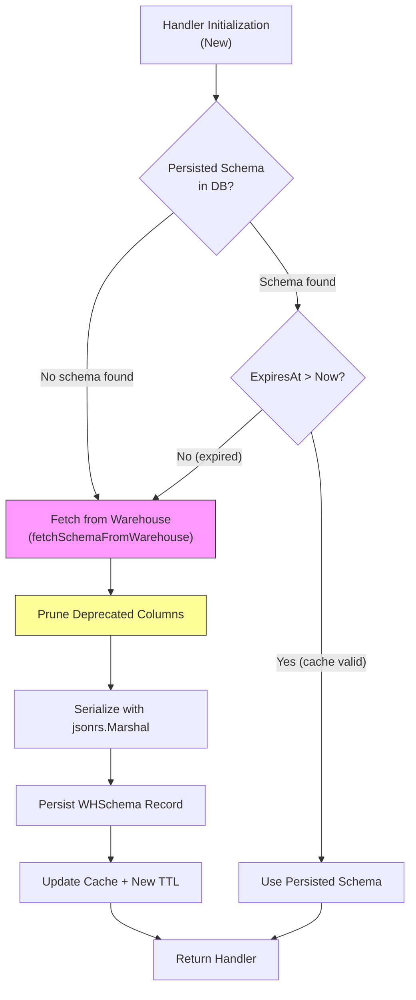
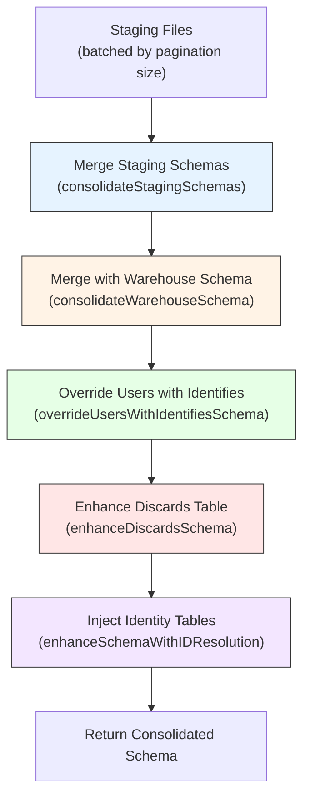
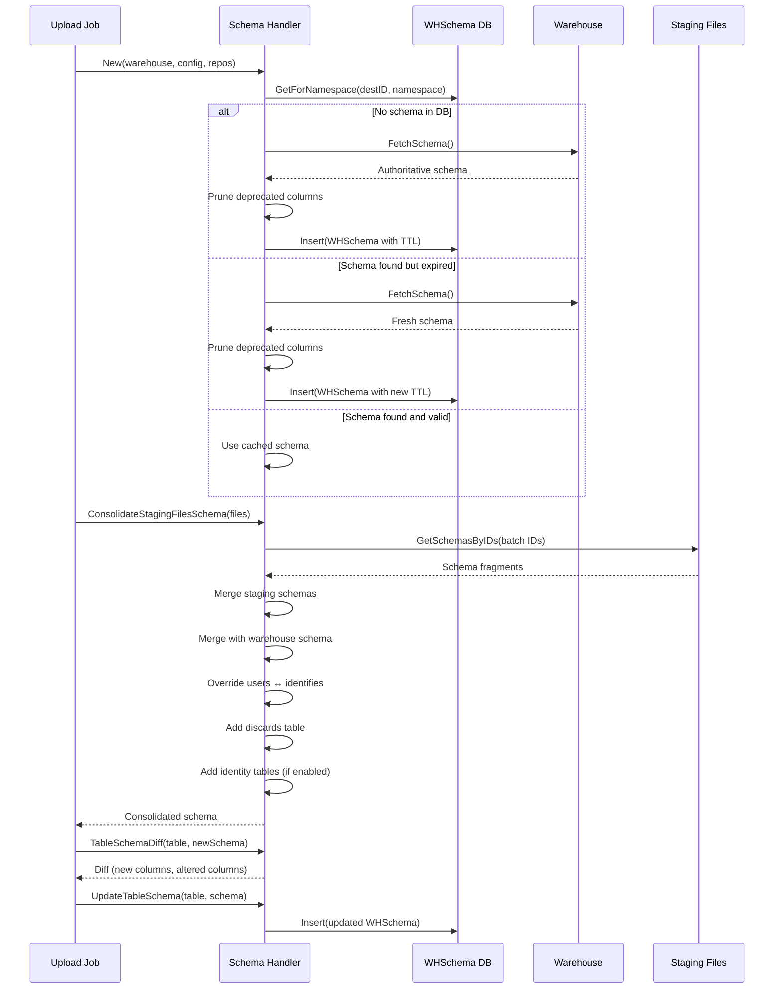

# Schema Evolution Reference

RudderStack's warehouse schema system provides automatic schema management with TTL-based caching, staging file schema consolidation, type coercion policies, column additions and alterations, deprecated column cleanup, and identity resolution integration. The `Handler` manages the full lifecycle of warehouse metadata — from staging file ingestion through schema diffing and DDL execution at the destination warehouse.

The schema subsystem ensures that warehouse tables automatically evolve to accommodate new event properties without manual DDL intervention. It handles type widening (e.g., `string` → `text`), cross-table schema alignment (users ↔ identifies), provider-specific casing (uppercase for Snowflake, lowercase for others), and conditional identity resolution table injection.

**Related Documentation:**

[Warehouse Overview](overview.md) | [Encoding Formats](encoding-formats.md)

> Source: `warehouse/schema/schema.go`

---

## Handler Architecture

The schema system is built around a `Handler` interface implemented by the `schema` struct. The Handler provides eight public operations for schema inspection, mutation, consolidation, diffing, and staleness detection.

### Handler Interface

```go
type Handler interface {
    IsSchemaEmpty(ctx context.Context) bool
    GetTableSchema(ctx context.Context, tableName string) model.TableSchema
    UpdateSchema(ctx context.Context, updatedSchema model.Schema) error
    UpdateTableSchema(ctx context.Context, tableName string, tableSchema model.TableSchema) error
    GetColumnsCount(ctx context.Context, tableName string) (int, error)
    ConsolidateStagingFilesSchema(ctx context.Context, stagingFiles []*model.StagingFile) (model.Schema, error)
    TableSchemaDiff(ctx context.Context, tableName string, tableSchema model.TableSchema) (whutils.TableSchemaDiff, error)
    IsSchemaOutdated(ctx context.Context) (bool, error)
}
```

> Source: `warehouse/schema/schema.go:51-69`

### Repository Dependencies

The Handler relies on three repository interfaces for data access:

| Interface | Methods | Purpose |
|-----------|---------|---------|
| `schemaRepo` | `GetForNamespace(ctx, destID, namespace)` → `WHSchema`, `Insert(ctx, *WHSchema)` | Persistence layer for WHSchema records in PostgreSQL |
| `stagingFileRepo` | `GetSchemasByIDs(ctx, []int64)` → `[]Schema` | Retrieves schema fragments from staging files |
| `fetchSchemaRepo` | `FetchSchema(ctx)` → `Schema` | Fetches the authoritative schema directly from the warehouse destination (e.g., Snowflake `INFORMATION_SCHEMA`) |

> Source: `warehouse/schema/schema.go:38-49`

### Constructor Behavior

The `New()` constructor initializes the Handler by:

1. **Reading configuration** — Loads TTL, staging file pagination size, and the `enableIDResolution` flag from the config system.
2. **Creating instrumented metrics** — Registers a `warehouse_schema_size` histogram tagged by `workspaceId`, `sourceId`, `sourceType`, `destinationId`, and `destType`.
3. **Hydrating persisted schema** — Calls `schemaRepo.GetForNamespace` to check for an existing `WHSchema` record:
   - If **no schema found** in DB → fetches directly from the warehouse via `fetchSchemaFromWarehouse`.
   - If **schema found and not expired** (`ExpiresAt` is in the future) → reuses the cached schema as-is.
   - If **schema found but expired** → triggers a fresh `fetchSchemaFromWarehouse` to refresh the cache.

The constructor ensures the schema is stable for the entire duration of a warehouse upload job — once initialized, the schema does not change mid-job.

> Source: `warehouse/schema/schema.go:89-145`

---

## Configuration Parameters

The schema system reads three configuration parameters at initialization time. These parameters are not present in `config/config.yaml` by default and rely on code-level defaults.

| Parameter | Config Key | Default | Type | Description |
|-----------|-----------|---------|------|-------------|
| Schema TTL | `Warehouse.schemaTTLInMinutes` | `720` (12 hours) | `time.Duration` (minutes) | Time-To-Live for cached schema. After expiry, the next Handler initialization fetches fresh metadata from the warehouse. |
| Staging Files Pagination Size | `Warehouse.stagingFilesSchemaPaginationSize` | `100` | `int` | Maximum number of staging files processed per batch during `ConsolidateStagingFilesSchema`. Controls memory usage during schema merging. |
| Enable ID Resolution | `Warehouse.enableIDResolution` | `false` | `bool` | When `true`, enables injection of `identity_merge_rules` and `identity_mappings` tables into the consolidated schema (for supported warehouses only). |

**Deprecated Column Regex:**

Columns matching the following precompiled regex pattern are pruned during warehouse schema fetch:

```
.*-deprecated-[0-9a-f]{8}-[0-9a-f]{4}-[0-9a-f]{4}-[0-9a-f]{4}-[0-9a-f]{12}$
```

This pattern identifies columns that have been marked as deprecated using a UUID suffix (e.g., `old_column-deprecated-dba626a7-406a-4757-b3e0-3875559c5840`).

> Source: `warehouse/schema/schema.go:34-36` (regex), `warehouse/schema/schema.go:99-108` (config reads)

---

## Schema Caching

The Handler maintains an in-memory cached schema with TTL-based expiration. The cache is protected by a read/write mutex (`cachedSchemaMu`) for concurrent access safety.

### Cache State

| Field | Type | Purpose |
|-------|------|---------|
| `cachedSchema` | `model.Schema` | The in-memory representation of the warehouse schema (map of table name → column map) |
| `cachedSchemaExpiresAt` | `time.Time` | Timestamp when the cached schema expires; only refreshed on warehouse fetch |
| `cachedSchemaMu` | `sync.RWMutex` | Protects concurrent access to the cached schema |

### Lock Strategy

| Operation | Lock Type | Description |
|-----------|-----------|-------------|
| `IsSchemaEmpty` | `RLock` | Checks if the schema has zero tables |
| `GetTableSchema` | `RLock` | Retrieves column map for a specific table |
| `GetColumnsCount` | `RLock` | Counts columns in a specific table |
| `UpdateSchema` | `Lock` (exclusive) | Replaces the entire cached schema and persists |
| `UpdateTableSchema` | `Lock` (exclusive) | Updates a single table's columns and persists |

### TTL Refresh Policy

The `cachedSchemaExpiresAt` timestamp is **only updated** when the schema is fetched from the warehouse via `fetchSchemaFromWarehouse`. Routine schema updates through `UpdateSchema` or `UpdateTableSchema` preserve the existing `expiresAt` value. This design ensures the system eventually recovers from corrupted or stale schemas by re-fetching from the warehouse when the original TTL expires.

> Source: `warehouse/schema/schema.go:258-269` (design comments)

### Fetch from Warehouse

The `fetchSchemaFromWarehouse` method performs the following steps:

1. **Timestamps the operation** — Records the start time via the `now` hook.
2. **Fetches authoritative metadata** — Calls `fetchSchemaRepo.FetchSchema(ctx)` to retrieve the current schema directly from the warehouse (e.g., querying `INFORMATION_SCHEMA` in Snowflake or BigQuery).
3. **Prunes deprecated columns** — Iterates all tables and columns, deleting any column whose name matches the deprecated column regex.
4. **Computes new expiry** — Sets `expiresAt` to `now + ttlInMinutes`.
5. **Persists via `saveSchema`** — Serializes the schema using `jsonrs.Marshal`, emits a byte-length histogram metric (`warehouse_schema_size`), and inserts a `WHSchema` record via `schemaRepo.Insert`.
6. **Updates the in-memory cache** — Sets `cachedSchema` and `cachedSchemaExpiresAt`.

> Source: `warehouse/schema/schema.go:147-165`

### Schema Staleness Detection

The `IsSchemaOutdated` method determines whether the cached schema has drifted from the actual warehouse state:

1. **Snapshots the current cached schema** under a read lock using `maps.Copy` for a deep copy.
2. **Fetches fresh metadata** from the warehouse via `fetchSchemaFromWarehouse` (which also updates the cache).
3. **Compares** the original snapshot with the newly fetched schema using `reflect.DeepEqual`.
4. Returns `true` if the schemas differ (indicating the warehouse was modified externally).

> Source: `warehouse/schema/schema.go:228-246`

### Caching Flow Diagram



---

## Schema Diff Detection

The `TableSchemaDiff` method computes the difference between the existing cached schema for a table and a newly proposed schema. This diff drives DDL operations during the warehouse upload state machine's "Created Remote Schema" state.

### Diff Result Structure

```go
type TableSchemaDiff struct {
    Exists           bool              // true if there are any differences
    TableToBeCreated bool              // true if the table does not exist in the warehouse
    ColumnMap        model.TableSchema // new columns to add
    UpdatedSchema    model.TableSchema // merged schema after applying the diff
    AlteredColumnMap model.TableSchema // columns with type changes (widening)
}
```

> Source: `warehouse/utils/utils.go:244-250`

### Diff Computation Logic

The diff is computed as follows:

1. **Table does not exist** in the cached schema → all columns in the proposed schema are new. Sets `TableToBeCreated = true` and returns the entire proposed schema as `ColumnMap`.
2. **Table exists** — for each column in the proposed schema:
   - If the column **does not exist** in the current schema → added to `ColumnMap` (new column).
   - If the column **exists** and the proposed type is `text` while the current type is `string` → added to `AlteredColumnMap` (type widening from string to text).
   - Otherwise → no change (the existing type is preserved).
3. `UpdatedSchema` is built by copying the current table schema and overlaying new/altered columns.

### DDL Operations Driven by Diff

| Diff Result | DDL Operation | Description |
|------------|---------------|-------------|
| `TableToBeCreated = true` | `CREATE TABLE` | A new table is created with all columns from `ColumnMap` |
| `ColumnMap` has entries | `ALTER TABLE ADD COLUMN` | New columns are added to the existing table |
| `AlteredColumnMap` has entries | `ALTER TABLE ALTER COLUMN` | Column types are widened (e.g., `string` → `text`) |

### Example: Diff Detection

Given a cached schema:

```
table: "events"
  column1: string
  column2: int
  column3: string
```

And a proposed schema:

```
table: "events"
  column2: int
  column3: text     ← type widening (string → text)
  column4: float    ← new column
```

The diff result would be:

| Field | Value |
|-------|-------|
| `Exists` | `true` |
| `TableToBeCreated` | `false` |
| `ColumnMap` | `{column4: float}` |
| `AlteredColumnMap` | `{column3: text}` |
| `UpdatedSchema` | `{column1: string, column2: int, column3: text, column4: float}` |

> Source: `warehouse/schema/schema.go:437-472`

---

## Staging File Consolidation

The `ConsolidateStagingFilesSchema` method merges schemas from multiple staging files with the authoritative warehouse schema to produce a single consolidated schema for an upload job. This consolidated schema determines which tables and columns will be created or altered in the warehouse.

### Consolidation Pipeline

The consolidation follows a five-step pipeline:



### Step 1: Batch and Merge Staging Schemas

Staging files are divided into batches using `lo.Chunk` with the configured pagination size (default: 100). For each batch:

1. Staging file IDs are extracted and passed to `stagingFileRepo.GetSchemasByIDs`.
2. The returned schema fragments are merged via `consolidateStagingSchemas`.

**Merge rules for staging schemas:**

- If a column has type `text` in **any** staging file, the consolidated type is `text` (text always wins).
- For non-text types, the **first occurrence** of a column's type is preserved — later staging files cannot narrow or change the type.
- New tables and columns are accumulated additively across all staging files.

> Source: `warehouse/schema/schema.go:294-315`

### Step 2: Merge with Warehouse Schema

The `consolidateWarehouseSchema` function overlays the authoritative warehouse schema onto the staging-derived schema:

- For each column that exists in **both** the staging schema and the warehouse schema:
  - The warehouse type **overwrites** the staging type.
  - **Exception:** If the staging type is `text` and the warehouse type is `string`, the `text` type is preserved (text is wider than string).
- Columns that exist only in the staging schema (new columns) are not affected by this step.
- Tables that exist only in the warehouse schema (not in staging) are ignored — only staging-originated tables are included.

> Source: `warehouse/schema/schema.go:317-344`

### Step 3: Override Users with Identifies Schema

The `overrideUsersWithIdentifiesSchema` function ensures the `users` table schema aligns with the `identifies` table schema:

1. Copies all columns from the `identifies` table to the `users` table.
2. For any columns present in the warehouse's `users` table but **not** in the warehouse's `identifies` table, those columns are added to **both** tables.
3. Sets `users.id` to the same type as `identifies.user_id` (the identity column mapping).
4. Removes the `user_id` column from the `users` table (since it maps to `id`).

All table and column names are converted to provider-specific casing via `whutils.ToProviderCase`.

> Source: `warehouse/schema/schema.go:346-373`

### Step 4: Enhance Discards Table

See [Discards Table](#discards-table) section below.

### Step 5: Inject Identity Resolution Tables

See [Identity Resolution Tables](#identity-resolution-tables) section below.

### Provider-Specific Casing

All table and column names pass through `whutils.ToProviderCase` which applies destination-specific casing rules:

| Warehouse Provider | Casing Rule | Example |
|-------------------|-------------|---------|
| Snowflake | `UPPERCASE` | `users` → `USERS`, `column_name` → `COLUMN_NAME` |
| Snowpipe Streaming | `UPPERCASE` | Same as Snowflake |
| All others (BigQuery, Redshift, PostgreSQL, ClickHouse, etc.) | `lowercase` (no change) | `users` → `users` |

> Source: `warehouse/utils/utils.go:519-525`

---

## Type Coercion Rules

RudderStack's schema system applies automatic type coercion to handle evolving event schemas. The coercion follows a "widening only" policy — types can be widened but never narrowed.

### Supported Data Types

| Type | Constant | Description |
|------|----------|-------------|
| `string` | `StringDataType` | Standard string type |
| `boolean` | `BooleanDataType` | Boolean true/false |
| `int` | `IntDataType` | Integer values |
| `bigint` | `BigIntDataType` | Large integer values |
| `float` | `FloatDataType` | Floating-point values |
| `json` | `JSONDataType` | JSON object type |
| `text` | `TextDataType` | Unrestricted text (widest string type) |
| `datetime` | `DateTimeDataType` | Date and time values |
| `array(boolean)` | `ArrayOfBooleanDataType` | Array of booleans |

> Source: `warehouse/internal/model/schema.go:14-23`

### Widening Rules

The schema system recognizes one explicit type widening path:

| Current Type | Proposed Type | Result | Behavior |
|-------------|---------------|--------|----------|
| `string` | `text` | `text` | Column is altered to `text` (widened) |
| `text` | `string` | `text` | Text type is preserved (text is wider) |
| Any non-text type | Same type | No change | Types match; no action needed |
| Any type | Different non-text type | No change | Only `string` → `text` widening is recognized |

**Key principle:** `text` is the widest string type and always wins over `string`. In all other cases, the first-seen type (in staging) or the warehouse type takes precedence.

### Coercion Examples

**Example 1: Staging has wider type**

```
Staging schema:  column_a: text
Warehouse schema: column_a: string
Result:          column_a: text  (text preserved — wider than string)
```

**Example 2: Warehouse has wider type**

```
Staging schema:  column_a: string
Warehouse schema: column_a: int
Result:          column_a: int   (warehouse type overwrites staging)
```

**Example 3: New column in staging**

```
Staging schema:  new_column: float
Warehouse schema: (column does not exist)
Result:          new_column: float  (new column added via ALTER TABLE)
```

**Example 4: First staging file wins (non-text)**

```
Staging file 1:  column_b: int
Staging file 2:  column_b: float
Result:          column_b: int   (first occurrence preserved)
```

**Example 5: Text always wins across staging files**

```
Staging file 1:  column_c: string
Staging file 2:  column_c: text
Staging file 3:  column_c: string
Result:          column_c: text  (text discovered in any file → text wins)
```

> Source: `warehouse/schema/schema.go:294-344` (consolidation functions), `warehouse/schema/schema.go:460-469` (diff type widening)

---

## Identity Resolution Tables

When identity resolution is enabled, the schema consolidation pipeline injects two additional tables for cross-touchpoint identity unification.

### Activation Conditions

Identity resolution tables are injected when **both** conditions are met:

1. `Warehouse.enableIDResolution` is set to `true` in configuration.
2. The warehouse type is in the `IdentityEnabledWarehouses` list: **Snowflake** and **BigQuery**.

Additionally, the `identity_merge_rules` table must already exist in the consolidated staging schema (i.e., the staging files must contain identity events) for the enhancement to take effect.

> Source: `warehouse/schema/schema.go:248-250`, `warehouse/utils/utils.go:132`

### Identity Merge Rules Table

Table name: `rudder_identity_merge_rules` (provider-cased: `RUDDER_IDENTITY_MERGE_RULES` for Snowflake)

| Column | Type | Description |
|--------|------|-------------|
| `merge_property_1_type` | `string` | Type of the first merge property (e.g., `email`, `user_id`) |
| `merge_property_1_value` | `string` | Value of the first merge property |
| `merge_property_2_type` | `string` | Type of the second merge property |
| `merge_property_2_value` | `string` | Value of the second merge property |

### Identity Mappings Table

Table name: `rudder_identity_mappings` (provider-cased: `RUDDER_IDENTITY_MAPPINGS` for Snowflake)

| Column | Type | Description |
|--------|------|-------------|
| `merge_property_type` | `string` | Type of the identity property |
| `merge_property_value` | `string` | Value of the identity property |
| `rudder_id` | `string` | Unified RudderStack identity identifier |
| `updated_at` | `datetime` | Timestamp of last identity mapping update |

All column names are passed through `whutils.ToProviderCase` for destination-specific casing.

> Source: `warehouse/schema/schema.go:392-416`

---

## Discards Table

The schema consolidation pipeline automatically adds a `rudder_discards` table to every consolidated schema. This table stores records that failed validation or type coercion during the load process.

### Standard Discards Schema

Table name: `rudder_discards` (provider-cased: `RUDDER_DISCARDS` for Snowflake)

| Column | Type | Description |
|--------|------|-------------|
| `table_name` | `string` | Name of the target table where the record was destined |
| `row_id` | `string` | Unique identifier for the discarded row |
| `column_name` | `string` | Name of the column that caused the discard |
| `column_value` | `string` | The value that failed validation or coercion |
| `received_at` | `datetime` | Timestamp when the event was originally received |
| `uuid_ts` | `datetime` | UUID-derived timestamp for deduplication |
| `reason` | `string` | Reason for the discard |

### BigQuery-Specific Extension

For BigQuery destinations (`warehouseType == "BQ"`), an additional column is included:

| Column | Type | Description |
|--------|------|-------------|
| `loaded_at` | `datetime` | Timestamp when the record was loaded (BigQuery-specific, for Segment compatibility) |

> Source: `warehouse/schema/schema.go:375-390`, `warehouse/utils/utils.go:174-182`

---

## Deprecated Column Cleanup

The schema system automatically removes deprecated columns during warehouse schema fetches to prevent stale metadata from accumulating.

### Deprecation Pattern

Columns are identified as deprecated when their name matches the following regex:

```
.*-deprecated-[0-9a-f]{8}-[0-9a-f]{4}-[0-9a-f]{4}-[0-9a-f]{4}-[0-9a-f]{12}$
```

This matches any column name suffixed with `-deprecated-` followed by a standard UUID v4 format.

### Examples

| Column Name | Deprecated? |
|------------|-------------|
| `abc-deprecated-dba626a7-406a-4757-b3e0-3875559c5840` | Yes |
| `old_field-deprecated-12345678-1234-1234-1234-123456789abc` | Yes |
| `active_column` | No |
| `deprecated-notes` | No (no UUID suffix) |

### Cleanup Behavior

During `fetchSchemaFromWarehouse`, after retrieving the authoritative schema from the warehouse:

1. The system iterates over all tables and their columns.
2. Any column matching the deprecated regex is deleted from the schema map using `delete(schema[tableName], columnName)`.
3. A debug log entry is emitted for each pruned column with the source ID, destination ID, destination type, workspace ID, namespace, table name, and column name.

This cleanup ensures that columns deprecated through schema migrations do not persist in the cached schema or affect staging file consolidation.

> Source: `warehouse/schema/schema.go:34-36` (regex), `warehouse/schema/schema.go:418-435` (cleanup function)

---

## Concurrency and Thread Safety

The schema Handler is designed for concurrent access from multiple goroutines within the warehouse upload pipeline.

### Synchronization Model

The `cachedSchemaMu` field (`sync.RWMutex`) provides read/write lock synchronization:

- **Read operations** (`IsSchemaEmpty`, `GetTableSchema`, `GetColumnsCount`) acquire `RLock`, allowing multiple concurrent readers.
- **Write operations** (`UpdateSchema`, `UpdateTableSchema`) acquire exclusive `Lock`, blocking all other readers and writers.
- **Mixed operations** (`ConsolidateStagingFilesSchema`) acquire `RLock` for the warehouse schema merge phase after completing the staging file merge.
- **Snapshot operations** (`IsSchemaOutdated`) take a deep copy under `RLock`, release the lock, then perform the warehouse fetch.

### Concurrent Access Guarantees

The following concurrent access patterns are safe:

| Pattern | Safety | Mechanism |
|---------|--------|-----------|
| Multiple goroutines reading schema | Safe | `RLock` allows concurrent readers |
| Multiple goroutines writing schema | Safe | `Lock` serializes writes |
| Concurrent reads and writes | Safe | `RWMutex` ensures read-write exclusion |
| Concurrent table updates (different tables) | Safe | Writes are serialized; each persists the full schema |

The test suite validates concurrency safety with:

- **10 concurrent goroutines** updating different tables simultaneously (`ConcurrentUpdateTableSchema` test).
- **10,000 iterations** of concurrent read/write operations across two goroutines (`ConcurrentReadAndWrite` test).

> Source: `warehouse/schema/schema_test.go:1301-1399`

---

## Schema Lifecycle Summary

The following diagram illustrates the complete schema lifecycle during a warehouse upload:



---

## Related Topics

- **[Warehouse Overview](overview.md)** — High-level warehouse service architecture and operational modes
- **[Encoding Formats](encoding-formats.md)** — Parquet, JSON, and CSV encoding formats for staging and load files
- **[Identity Resolution](../guides/identity/identity-resolution.md)** — Cross-touchpoint identity unification guide
