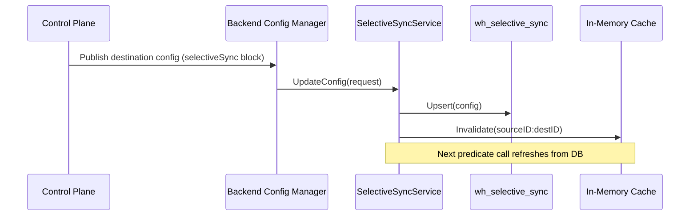
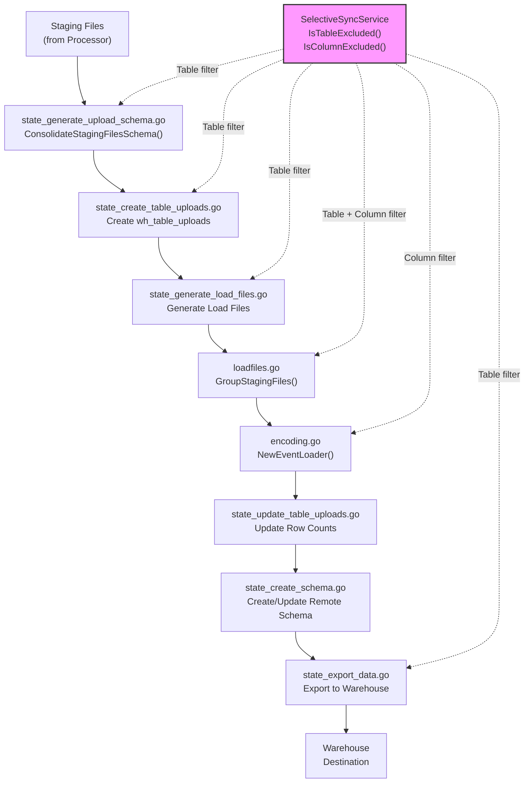

# Warehouse Selective Sync

Selective sync enables per-table and per-column filtering for warehouse sync, allowing users to include or exclude specific tables and columns from the warehouse sync pipeline. This reduces storage costs, improves sync performance, and provides fine-grained control over which data reaches the warehouse.

Configuration is delivered via backend-config as part of the destination configuration object, with runtime filtering applied at the load file generation stage of the upload state machine.

> Source: `warehouse/selectivesync/`

---

## Configuration Delivery

Selective sync configuration flows from the Control Plane through backend-config to the warehouse service, where it is persisted and cached for runtime evaluation.

### Backend-Config Path

The `selectiveSync` block is part of the destination configuration payload pushed from the Control Plane via the `TopicBackendConfig` pub/sub mechanism. When a workspace administrator configures selective sync rules for a warehouse destination, the Control Plane publishes an updated destination configuration containing the new exclusion rules.

### BCM Integration

The `BackendConfigManager` in `warehouse/bcm/backend_config.go` subscribes to backend-config updates and parses the `selectiveSync` block from the destination config map. When an update arrives, the manager extracts `excluded_tables` and `excluded_columns` from the destination configuration and propagates them to the `SelectiveSyncService`.

### Caching

The `SelectiveSyncService` caches configurations in memory with a configurable TTL (default: 5 minutes) to minimize database queries during the hot path of load file generation and schema consolidation. Cache entries are keyed by `sourceID:destID` and are automatically refreshed on expiry. When a configuration update arrives via the API or backend-config, the cache entry for the affected source/destination pair is immediately invalidated.



> Source: `warehouse/bcm/backend_config.go`, `warehouse/selectivesync/service.go:129-156`

---

## Table-Level Exclusion

Table-level exclusion removes entire tables from the warehouse sync pipeline. When a table is listed in `excluded_tables`, it is completely skipped at every stage of the upload state machine.

### Behavior

- Table names are matched **exactly** (case-sensitive) against the exclusion list
- Excluded tables produce **no** `wh_table_uploads` records
- Excluded tables generate **no** load files
- Excluded tables are skipped during the data export phase
- Excluded tables are omitted from the consolidated upload schema

### Example

Excluding the `raw_events` and `debug_logs` tables:

```json
{
    "source_id": "src_abc123",
    "destination_id": "dest_xyz789",
    "excluded_tables": ["raw_events", "debug_logs"]
}
```

With this configuration, the `raw_events` and `debug_logs` tables will not appear in the warehouse destination, while all other tables continue to sync normally.

> Source: `warehouse/selectivesync/service.go:158-194` (`IsTableExcluded`)

---

## Column-Level Exclusion

Column-level exclusion removes specific columns from specific tables during warehouse sync. This is useful for excluding PII fields (email, phone, IP address) without removing the entire table.

### Behavior

- Column names are matched **per-table** against the exclusion map
- Excluded columns are omitted during load file encoding (Parquet, JSON, CSV formats)
- Excluded columns are removed from the consolidated schema during schema consolidation
- The table itself continues to sync with the remaining columns
- A table can have both table-level and column-level exclusions, but table-level exclusion takes precedence — if a table is in `excluded_tables`, its column-level exclusions are irrelevant

### Example

Excluding the `email` and `phone` columns from the `users` table, and the `ip` column from the `tracks` table:

```json
{
    "source_id": "src_abc123",
    "destination_id": "dest_xyz789",
    "excluded_columns": {
        "users": ["email", "phone"],
        "tracks": ["ip"]
    }
}
```

With this configuration, the `users` table will sync all columns except `email` and `phone`, and the `tracks` table will sync all columns except `ip`.

> Source: `warehouse/selectivesync/service.go:196-237` (`IsColumnExcluded`)

---

## REST API Endpoints

The selective sync feature exposes two HTTP endpoints on the warehouse API server (default port `8082`).

### PUT /v1/warehouse/selective-sync — Update Configuration

Creates or updates the selective sync configuration for a source/destination pair. Uses PostgreSQL `ON CONFLICT` upsert semantics — if a configuration already exists for the pair, it is replaced entirely.

**Request:**

```bash
PUT /v1/warehouse/selective-sync
Content-Type: application/json
```

**Request Body:**

```json
{
    "source_id": "src_abc123",
    "destination_id": "dest_xyz789",
    "workspace_id": "wsp_001",
    "excluded_tables": ["raw_events", "debug_logs"],
    "excluded_columns": {
        "users": ["email", "phone", "ip_address"],
        "tracks": ["ip"]
    }
}
```

| Field | Type | Required | Description |
|-------|------|----------|-------------|
| `source_id` | string | **Yes** | RudderStack source identifier |
| `destination_id` | string | **Yes** | Warehouse destination identifier |
| `workspace_id` | string | No | Workspace identifier (derived from auth context if omitted) |
| `excluded_tables` | string[] | No | List of table names to exclude from sync |
| `excluded_columns` | map[string]string[] | No | Map of table name → column names to exclude |

**Success Response (200 OK):**

```json
{
    "status": "updated",
    "sourceID": "src_abc123",
    "destID": "dest_xyz789"
}
```

**Error Responses:**

| Status | Condition | Response Body |
|--------|-----------|---------------|
| `400 Bad Request` | Missing `source_id` or `destination_id`, invalid JSON | `{"status": "error", "message": "source_id is required"}` |
| `403 Forbidden` | Selective sync feature is disabled | `{"status": "error", "message": "selective sync feature is disabled"}` |
| `500 Internal Server Error` | Unexpected service failure | `{"status": "error", "message": "internal server error"}` |

> Source: `warehouse/selectivesync/handler.go:95-125` (`UpdateSelectiveSync`)

### GET /v1/warehouse/selective-sync/{sourceID}/{destID} — Retrieve Configuration

Retrieves the full selective sync configuration for a specific source/destination pair.

**Request:**

```bash
GET /v1/warehouse/selective-sync/{sourceID}/{destID}
```

**Path Parameters:**

| Parameter | Type | Description |
|-----------|------|-------------|
| `sourceID` | string | RudderStack source identifier |
| `destID` | string | Warehouse destination identifier |

**Success Response (200 OK):**

```json
{
    "id": 42,
    "source_id": "src_abc123",
    "destination_id": "dest_xyz789",
    "workspace_id": "wsp_001",
    "excluded_tables": ["raw_events", "debug_logs"],
    "excluded_columns": {
        "users": ["email", "phone", "ip_address"],
        "tracks": ["ip"]
    },
    "created_at": "2024-01-15T10:30:00Z",
    "updated_at": "2024-01-20T14:45:00Z"
}
```

**Error Responses:**

| Status | Condition | Response Body |
|--------|-----------|---------------|
| `400 Bad Request` | Missing `sourceID` or `destID` path parameter | `{"status": "error", "message": "sourceID is required"}` |
| `403 Forbidden` | Selective sync feature is disabled | `{"status": "error", "message": "selective sync feature is disabled"}` |
| `404 Not Found` | No configuration exists for the pair | `{"status": "error", "message": "selective sync configuration not found"}` |
| `500 Internal Server Error` | Unexpected service failure | `{"status": "error", "message": "internal server error"}` |

> Source: `warehouse/selectivesync/handler.go:143-171` (`GetSelectiveSync`)

---

## Runtime Filtering Pipeline

Selective sync filtering is applied at multiple stages of the upload state machine pipeline. The following diagram illustrates where filtering occurs in the data flow from staging files to the warehouse destination.



### Filtering Stages

**1. Schema Consolidation (`schema.go`)**

`ConsolidateStagingFilesSchema()` produces a consolidated schema from all staging files for an upload. When selective sync is active, excluded tables are removed from the consolidated schema map, and excluded columns are removed from individual table schemas. This ensures that downstream stages never see excluded elements.

> Source: `warehouse/schema/schema.go`

**2. Table Upload Creation (`state_create_table_uploads.go`)**

When creating per-table upload records in `wh_table_uploads`, excluded tables are filtered out. No `wh_table_uploads` row is created for excluded tables, preventing them from entering the upload tracking pipeline.

> Source: `warehouse/router/state_create_table_uploads.go`

**3. Load File Generation (`state_generate_load_files.go`)**

Before generating load files, the selective sync configuration is retrieved for the current source/destination pair. The exclusion predicates are passed to the loadfiles pipeline. Tables in `excluded_tables` are skipped entirely — no load files are generated for them.

> Source: `warehouse/router/state_generate_load_files.go`

**4. Staging File Grouping (`loadfiles.go`)**

`GroupStagingFiles()` applies table-level exclusions when grouping staging files for load file generation. Staging files belonging to excluded tables are skipped, ensuring no processing resources are spent on excluded data.

> Source: `warehouse/internal/loadfiles/loadfiles.go`

**5. Event Encoding (`encoding.go`)**

`NewEventLoader()` receives a column exclusion list for the current table. During event serialization to Parquet, JSON, or CSV format, excluded columns are skipped. The resulting load files contain only the included columns.

> Source: `warehouse/encoding/encoding.go`

**6. Data Export (`state_export_data.go`)**

The export pipeline iterates over user tables, identity tables, and regular tables. Excluded tables are skipped during the data export phase, ensuring they are not loaded into the warehouse destination.

> Source: `warehouse/router/state_export_data.go`

---

## Configuration Reference

| Configuration Key | Type | Default | Description |
|---|---|---|---|
| `Warehouse.selectiveSync.enabled` | bool | `false` | Enable or disable selective sync filtering. When disabled, all tables and columns are included in sync. |
| `Warehouse.selectiveSync.cacheRefreshMinutes` | int | `5` | Interval (in minutes) at which the selective sync configuration cache is refreshed from the database. Minimum value: 1. |

All configuration keys use the `config.GetReloadableBoolVar` / `config.GetReloadableIntVar` pattern and support runtime reload without process restart.

> Source: `warehouse/selectivesync/config.go:14-44`

---

## JSON Configuration Examples

### Example 1: Exclude Entire Tables

Exclude the `raw_events`, `debug_logs`, and `internal_metrics` tables from warehouse sync. All columns in all other tables continue to sync normally.

```json
{
    "source_id": "src_abc123",
    "destination_id": "dest_xyz789",
    "excluded_tables": ["raw_events", "debug_logs", "internal_metrics"]
}
```

### Example 2: Exclude Specific Columns

Exclude PII columns from specific tables while keeping the tables themselves in sync. The `users` table syncs without `email`, `phone`, and `ip_address`; the `identifies` table syncs without `email`; the `tracks` table syncs without `ip` and `user_agent`.

```json
{
    "source_id": "src_abc123",
    "destination_id": "dest_xyz789",
    "excluded_columns": {
        "users": ["email", "phone", "ip_address"],
        "identifies": ["email"],
        "tracks": ["ip", "user_agent"]
    }
}
```

### Example 3: Combined Table and Column Exclusion

Combine table-level and column-level exclusions. The `debug_logs` table is excluded entirely. The `users` table syncs without `email` and `phone`. The `tracks` table syncs without `ip`.

```json
{
    "source_id": "src_abc123",
    "destination_id": "dest_xyz789",
    "excluded_tables": ["debug_logs"],
    "excluded_columns": {
        "users": ["email", "phone"],
        "tracks": ["ip"]
    }
}
```

> Source: `warehouse/selectivesync/model.go:15-48` (`SelectiveSyncConfig`)

---

## Backward Compatibility

Selective sync is designed for full backward compatibility with existing warehouse configurations:

- **No `selectiveSync` block:** Destinations without a `selectiveSync` block in their backend-config default to all tables and columns included — no exclusions are applied.
- **Feature disabled (default):** The `Warehouse.selectiveSync.enabled` flag defaults to `false`. When disabled, all predicate methods (`IsTableExcluded`, `IsColumnExcluded`) return `false`, ensuring no filtering occurs regardless of stored configurations.
- **Existing configurations unchanged:** Existing warehouse configurations continue to work without modification. No migration or reconfiguration is needed for deployments that do not use selective sync.
- **Empty exclusion lists:** An empty `excluded_tables` array (`[]`) and an empty `excluded_columns` map (`{}`) are equivalent to no filtering — all tables and columns are included.
- **Fail-open error handling:** If a configuration lookup fails due to a transient database error, the service defaults to including all tables and columns (fail open, not fail closed). This prevents accidental data loss from transient infrastructure issues.

> Source: `warehouse/selectivesync/service.go:54-59`, `warehouse/selectivesync/config.go:34-44`

---

## Database Schema

Selective sync configurations are persisted in the `wh_selective_sync` table, created by migration `000043_add_selective_sync_config.up.sql`.

### Table: `wh_selective_sync`

| Column | Type | Constraints | Description |
|--------|------|-------------|-------------|
| `id` | `BIGSERIAL` | `PRIMARY KEY` | Auto-generated unique identifier |
| `source_id` | `VARCHAR(64)` | `NOT NULL` | RudderStack source identifier |
| `destination_id` | `VARCHAR(64)` | `NOT NULL` | Warehouse destination identifier |
| `workspace_id` | `VARCHAR(64)` | `NOT NULL` | Workspace identifier |
| `excluded_tables` | `JSONB` | | JSON array of excluded table names |
| `excluded_columns` | `JSONB` | | JSON object mapping table names to arrays of excluded column names |
| `created_at` | `TIMESTAMPTZ` | `DEFAULT NOW()` | Record creation timestamp |
| `updated_at` | `TIMESTAMPTZ` | | Last update timestamp |

### Constraints and Indexes

- **Unique constraint:** `(source_id, destination_id)` — ensures at most one selective sync configuration per source/destination pair. Enables atomic upsert via PostgreSQL `ON CONFLICT`.

### JSONB Column Formats

**`excluded_tables`** — JSON array of strings:
```json
["raw_events", "debug_logs", "internal_metrics"]
```

**`excluded_columns`** — JSON object with table names as keys and arrays of column names as values:
```json
{
    "users": ["email", "phone", "ip_address"],
    "tracks": ["ip"]
}
```

> Source: `sql/migrations/warehouse/000043_add_selective_sync_config.up.sql`, `warehouse/selectivesync/repository.go:20-33`

---

## Usage Examples

### Set Selective Sync Configuration

```bash
curl -X PUT http://localhost:8082/v1/warehouse/selective-sync \
  -H "Content-Type: application/json" \
  -d '{
    "source_id": "src_abc123",
    "destination_id": "dest_xyz789",
    "excluded_tables": ["debug_logs"],
    "excluded_columns": {
        "users": ["email"]
    }
  }'
```

**Expected response:**

```json
{"status":"updated","sourceID":"src_abc123","destID":"dest_xyz789"}
```

### Retrieve Selective Sync Configuration

```bash
curl http://localhost:8082/v1/warehouse/selective-sync/src_abc123/dest_xyz789
```

**Expected response:**

```json
{
    "id": 1,
    "source_id": "src_abc123",
    "destination_id": "dest_xyz789",
    "workspace_id": "",
    "excluded_tables": ["debug_logs"],
    "excluded_columns": {
        "users": ["email"]
    },
    "created_at": "2024-01-15T10:30:00Z",
    "updated_at": "2024-01-15T10:30:00Z"
}
```

### Remove All Exclusions

To remove all exclusions and resume full sync, send an update with empty lists:

```bash
curl -X PUT http://localhost:8082/v1/warehouse/selective-sync \
  -H "Content-Type: application/json" \
  -d '{
    "source_id": "src_abc123",
    "destination_id": "dest_xyz789",
    "excluded_tables": [],
    "excluded_columns": {}
  }'
```

---

## Source File References

| File | Description |
|------|-------------|
| `warehouse/selectivesync/service.go` | `SelectiveSyncService` with `IsTableExcluded()` and `IsColumnExcluded()` predicates, config caching, and cache invalidation |
| `warehouse/selectivesync/handler.go` | HTTP handler for `PUT` and `GET` selective sync endpoints with JSON request/response handling |
| `warehouse/selectivesync/config.go` | Configuration key definitions and defaults (`Warehouse.selectiveSync.enabled`, `Warehouse.selectiveSync.cacheRefreshMinutes`) |
| `warehouse/selectivesync/model.go` | Domain models (`SelectiveSyncConfig`, `SelectiveSyncRequest`, `SelectiveSyncResponse`) and sentinel errors |
| `warehouse/selectivesync/repository.go` | Database persistence for `wh_selective_sync` table with `Upsert()`, `Get()`, `Delete()`, `ListByWorkspace()` |
| `warehouse/bcm/backend_config.go` | Backend-config parser for the `selectiveSync` block in destination configuration |
| `warehouse/schema/schema.go` | Schema consolidation with selective sync table and column exclusions |
| `warehouse/encoding/encoding.go` | Column exclusion during event encoding to Parquet, JSON, and CSV formats |
| `warehouse/internal/loadfiles/loadfiles.go` | Table exclusion during staging file grouping and load file generation |
| `warehouse/router/state_generate_load_files.go` | Selective sync config retrieval before load file generation |
| `warehouse/router/state_export_data.go` | Table exclusion during the data export phase |
| `warehouse/router/state_create_table_uploads.go` | Table upload filtering — excluded tables produce no `wh_table_uploads` records |
| `warehouse/api/http.go` | Endpoint registration for selective sync routes in the Chi router |
| `sql/migrations/warehouse/000043_add_selective_sync_config.up.sql` | Database migration creating the `wh_selective_sync` table |

---

## Related Documentation

- **Warehouse Overview:** [Architecture and State Machine](overview.md)
- **Schema Management:** [Schema Evolution](schema-evolution.md) — automatic schema creation and column addition
- **File Formats:** [Encoding Formats](encoding-formats.md) — Parquet, JSON, and CSV reference
- **Backfill:** [Backfill Guide](backfill.md) — configurable date-range backfill (respects selective sync exclusions)
- **Health Monitoring:** [Health Monitoring](health-monitoring.md) — per-upload sync health metrics and alerting
- **Replay:** [Warehouse Replay](replay.md) — replay archived events to warehouse destinations
