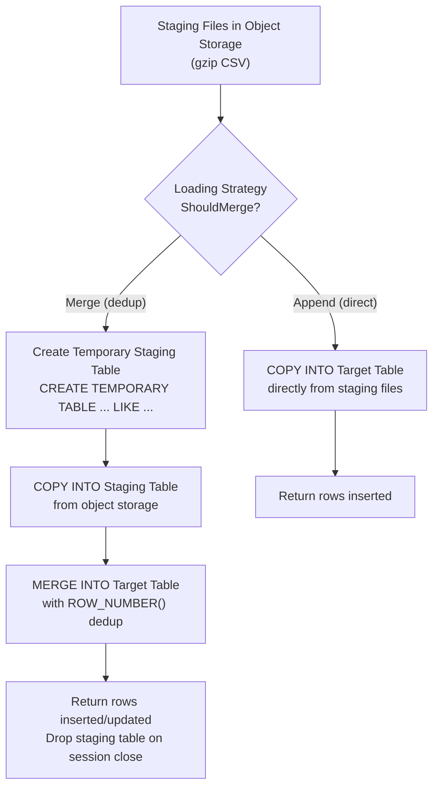
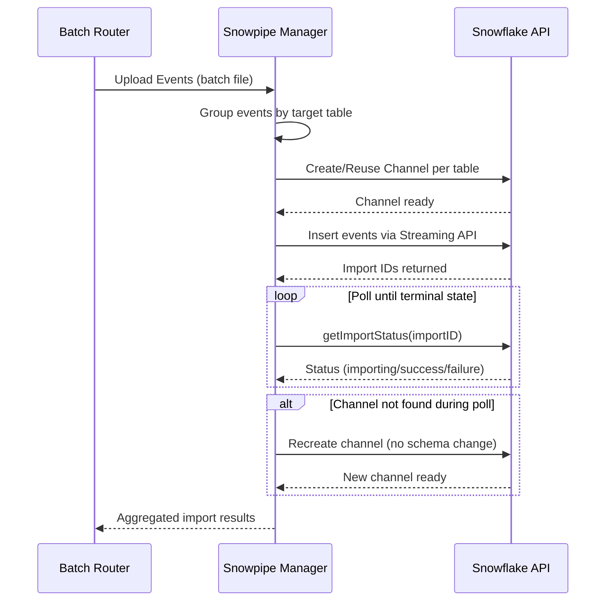

# Snowflake Connector Guide

RudderStack's Snowflake connector enables warehouse-native data loading with support for both traditional staging-file-based loading and Snowpipe Streaming API integration. The connector handles the complete lifecycle of data delivery — from staging file generation through schema evolution, identity resolution, and parallel table loading — while maintaining idempotent, backfill-capable semantics.

**Key capabilities:**

- **Copy-based loading** — Bulk data ingestion using Snowflake `COPY INTO` with gzip-compressed CSV staging files
- **Merge and append strategies** — Configurable deduplication via `MERGE INTO` with primary/partition key semantics, or direct append for event tables
- **Iceberg table management** — Native support for Snowflake-managed Iceberg tables with external volumes and catalog integration
- **Identity resolution** — Cross-touchpoint identity unification via `RUDDER_IDENTITY_MERGE_RULES` and `RUDDER_IDENTITY_MAPPINGS` tables
- **Parallel loading** — Concurrent table loading with configurable parallelism for high-throughput warehouse sync
- **Snowpipe Streaming** — Real-time event ingestion via the Snowpipe Streaming API with channel management and status polling

**Related Documentation:**

[Warehouse Overview](overview.md) | [Schema Evolution](schema-evolution.md) | [Encoding Formats](encoding-formats.md)

> Source: `warehouse/integrations/snowflake/snowflake.go`

---

## Prerequisites

Before configuring the Snowflake connector, ensure the following requirements are met:

1. **Snowflake account** — An active Snowflake account with a provisioned virtual warehouse, database, and at least one schema.

2. **User privileges** — A Snowflake user with the following minimum permissions on the target database and schema:
   - `CREATE TABLE`
   - `CREATE SCHEMA`
   - `USAGE` (on warehouse, database, and schema)
   - `INSERT`
   - `SELECT`
   - `ALTER TABLE`
   - `DROP TABLE`

3. **Object storage** — External object storage configured for staging file delivery. Supported providers:
   - **Amazon S3** — With IAM credentials or Snowflake Storage Integration
   - **Google Cloud Storage (GCS)** — With Storage Integration
   - **Azure Blob Storage** — With Storage Integration

4. **RudderStack warehouse service** — Running and accessible on port `8082` (default).

5. **Table name constraint** — Snowflake table names are limited to **127 characters**. Names exceeding this limit will be truncated.

> Source: `warehouse/integrations/snowflake/snowflake.go:42` (`tableNameLimit = 127`)

---

## Setup

Follow these steps to configure the Snowflake warehouse connector:

### Step 1: Configure Snowflake Destination

In the RudderStack Control Plane, create a new Snowflake warehouse destination and provide the following connection credentials:

| Parameter | Description | Required |
|-----------|-------------|----------|
| **Account** | Snowflake account identifier (e.g., `xy12345.us-east-1`) | Yes |
| **Warehouse** | Virtual warehouse name for query execution | Yes |
| **Database** | Target database name | Yes |
| **Schema** | Target schema name (maps to the RudderStack namespace) | Yes |
| **User** | Snowflake login username | Yes |
| **Password** | Snowflake login password (not required if using key pair auth) | Conditional |
| **Role** | Snowflake role to assume for the session (optional — uses user default if empty) | No |

> Source: `warehouse/integrations/snowflake/snowflake.go:1073-1086` (connect function credential extraction)

### Step 2: Configure Authentication

The connector supports two authentication modes:

**Password Authentication (default):**
Provide the `User` and `Password` fields. The connector establishes a session using standard Snowflake credentials.

**Key Pair Authentication:**
Enable `useKeyPairAuth` and provide:
- `privateKey` — The RSA private key in PEM format
- `privateKeyPassphrase` — The passphrase for the encrypted private key (optional if the key is unencrypted)

Key pair authentication is **mandatory** for Snowpipe Streaming destinations.

> Source: `warehouse/integrations/snowflake/snowflake.go:1081-1083, 1102-1106`

### Step 3: Configure Object Storage

Configure the staging file upload destination. For S3 with temporary credentials, the connector automatically requests short-lived AWS STS credentials. For other cloud providers, configure a Snowflake Storage Integration:

```
STORAGE_INTEGRATION = <your_integration_name>
```

The `StorageIntegration` setting in the destination configuration controls which authentication method is used for the `COPY INTO` command.

> Source: `warehouse/integrations/snowflake/snowflake.go:281-294` (authString)

### Step 4: Set Namespace

The namespace maps directly to a Snowflake schema. The connector creates the schema automatically if it does not exist:

```sql
CREATE SCHEMA IF NOT EXISTS "<namespace>"
```

> Source: `warehouse/integrations/snowflake/snowflake.go:257-267` (createSchema)

### Step 5 (Optional): Enable Snowpipe Streaming

For real-time ingestion, enable Snowpipe Streaming in the destination configuration. This requires key pair authentication and uses the Snowpipe Streaming API instead of staging-file-based `COPY INTO` loading.

See the [Snowpipe Streaming](#snowpipe-streaming) section below for details.

### Testing the Connection

Use the warehouse validation API to verify connectivity:

```bash
curl -X POST http://localhost:8082/v1/warehouse/validate \
  -H "Content-Type: application/json" \
  -d '{
    "destination": {
      "config": {
        "account": "xy12345.us-east-1",
        "warehouse": "COMPUTE_WH",
        "database": "RUDDERSTACK_DB",
        "user": "rudder_user",
        "password": "your_password",
        "namespace": "RUDDERSTACK_SCHEMA"
      },
      "destinationDefinition": {
        "name": "SNOWFLAKE"
      }
    }
  }'
```

> Source: `warehouse/integrations/snowflake/snowflake.go:1349-1359` (Setup), `warehouse/integrations/snowflake/snowflake.go:1361-1371` (TestConnection)

---

## Configuration Parameters

The following parameters control the Snowflake connector's behavior. Parameters are configured via the RudderStack configuration system (`config/config.yaml` or environment variables).

### Connector-Specific Parameters

| Parameter | Default | Type | Description |
|-----------|---------|------|-------------|
| `Warehouse.snowflake.maxParallelLoads` | `3` | int | Maximum number of tables loaded concurrently during a single upload job. Higher values increase throughput but consume more Snowflake warehouse credits. |
| `Warehouse.snowflake.allowMerge` | `true` | bool | Enables the merge (deduplication) loading strategy. When `false`, all tables use append-only mode regardless of table type. |
| `Warehouse.snowflake.enableDeleteByJobs` | `false` | bool | Enables the `DeleteBy` operation, which removes stale records from tables based on source job metadata (`context_sources_job_run_id`, `context_sources_task_run_id`). |
| `Warehouse.snowflake.slowQueryThreshold` | `5m` | duration | Queries exceeding this duration are logged as slow queries for monitoring. Format: Go duration string (e.g., `5m`, `10m`, `1h`). |
| `Warehouse.snowflake.appendOnlyTables` | `[]` (nil) | string slice | List of table names that should always use append-only loading, bypassing the merge strategy even when merge is enabled. Table names are case-sensitive (UPPERCASE in Snowflake). |

> Source: `warehouse/integrations/snowflake/snowflake.go:186-191` (New constructor config reads)

### Privilege Validation Parameters

| Parameter | Default | Type | Description |
|-----------|---------|------|-------------|
| `Warehouse.snowflake.privileges.fetchSchema.enabled` | `false` | bool | When enabled, the connector validates schema-level privileges before fetching schema metadata. Adds a `SHOW GRANTS ON SCHEMA` check during connection testing. |
| `Warehouse.snowflake.privileges.fetchSchema.required` | `["USAGE"]` | string slice | List of required privilege types that the user's role must possess on the schema. Only checked when `fetchSchema.enabled` is `true`. |

> Source: `warehouse/integrations/snowflake/snowflake.go:199-200`

### Debug and Diagnostics Parameters

| Parameter | Default | Type | Description |
|-----------|---------|------|-------------|
| `Warehouse.snowflake.debugDuplicateWorkspaceIDs` | `[]` (nil) | string slice | Workspace IDs for which duplicate row sampling is enabled during merge operations. Used for diagnostics only. |
| `Warehouse.snowflake.debugDuplicateTables` | `[]` (nil) | string slice | Table names (case-insensitive, normalized to UPPERCASE) for which duplicate sampling is enabled. |
| `Warehouse.snowflake.debugDuplicateIntervalInDays` | `30` | int | Lookback window in days for duplicate row sampling queries. |
| `Warehouse.snowflake.debugDuplicateLimit` | `100` | int | Maximum number of duplicate rows to sample per table per upload. |

> Source: `warehouse/integrations/snowflake/snowflake.go:193-198`

### Merge Window Parameters

| Parameter | Default | Type | Description |
|-----------|---------|------|-------------|
| `Warehouse.snowflake.mergeWindow.<destID>.tables` | `[]` (nil) | string slice | Tables for which the merge window optimization is applied (scoped to a specific destination ID). |
| `Warehouse.snowflake.mergeWindow.<destID>.duration` | `720h` (30 days) | duration | Time window applied to the merge join condition. Only rows within this window are considered for matching. |
| `Warehouse.snowflake.mergeWindow.<destID>.column` | `"RECEIVED_AT"` | string | Column used for the merge window filter condition. |

> Source: `warehouse/integrations/snowflake/snowflake.go:465-477`

### Connection Parameters

| Parameter | Description |
|-----------|-------------|
| `connectTimeout` | Connection and query timeout for the Snowflake session. Set via `SetConnectionTimeout()`. Controls both the login timeout and the SQL query wrapper timeout. |
| `Application` | Hardcoded as `"Rudderstack_Warehouse"` in the Snowflake connection DSN for Snowflake query history attribution. |
| `ABORT_DETACHED_QUERY` | Session-level setting — automatically set to `TRUE` on every new connection to abort queries from disconnected sessions. |

> Source: `warehouse/integrations/snowflake/snowflake.go:1099-1121`

---

## Data Type Mappings

The Snowflake connector maps RudderStack internal data types to Snowflake-native column types. The mapping differs between standard Snowflake tables and Snowflake-managed Iceberg tables.

### RudderStack → Snowflake (Standard Tables)

| RudderStack Type | Snowflake Type | Notes |
|------------------|----------------|-------|
| `boolean` | `BOOLEAN` | Native boolean type |
| `int` | `NUMBER` | Arbitrary-precision integer |
| `bigint` | `NUMBER` | Same as `int` — maps to `NUMBER` |
| `float` | `DOUBLE PRECISION` | 64-bit IEEE 754 floating point |
| `string` | `VARCHAR` | Variable-length character string (default max 16 MB) |
| `datetime` | `TIMESTAMP_TZ` | Timestamp with time zone |
| `json` | `VARIANT` | Semi-structured data (JSON, Avro, etc.) |

> Source: `warehouse/integrations/snowflake/table_manager.go:32-41` (standardTableManager.dataTypesMap)

### RudderStack → Snowflake (Iceberg Tables)

| RudderStack Type | Snowflake Type | Notes |
|------------------|----------------|-------|
| `boolean` | `BOOLEAN` | Native boolean type |
| `int` | `NUMBER(10,0)` | 10-digit integer (Iceberg requires explicit precision) |
| `bigint` | `NUMBER(19,0)` | 19-digit integer for large values |
| `float` | `DOUBLE PRECISION` | 64-bit IEEE 754 floating point |
| `string` | `VARCHAR` | Variable-length character string |
| `datetime` | `TIMESTAMP_NTZ(6)` | Timestamp without time zone, microsecond precision (Iceberg constraint) |
| `json` | `VARCHAR` | JSON stored as string (Iceberg does not support `VARIANT`) |

> Source: `warehouse/integrations/snowflake/table_manager.go:75-83` (icebergTableManager.dataTypesMap)

### Snowflake → RudderStack (Reverse Mapping)

When fetching existing schema metadata from Snowflake's `INFORMATION_SCHEMA.COLUMNS`, the connector reverse-maps Snowflake native types back to RudderStack types:

| Snowflake Type | RudderStack Type | Notes |
|----------------|------------------|-------|
| `NUMBER`, `DECIMAL`, `NUMERIC`, `INT`, `INTEGER`, `BIGINT`, `SMALLINT` | `int` | If `numeric_scale > 0`, maps to `float` instead |
| `FLOAT`, `FLOAT4`, `FLOAT8`, `DOUBLE`, `REAL`, `DOUBLE PRECISION` | `float` | All floating-point variants |
| `BOOLEAN` | `boolean` | Direct mapping |
| `TEXT`, `VARCHAR`, `CHAR`, `CHARACTER`, `STRING`, `BINARY`, `VARBINARY` | `string` | All text and binary types |
| `TIMESTAMP_NTZ`, `DATE`, `DATETIME`, `TIME`, `TIMESTAMP`, `TIMESTAMP_LTZ`, `TIMESTAMP_TZ` | `datetime` | All temporal types |
| `VARIANT` | `json` | Semi-structured data |

**Special behavior:** If a `NUMBER`-family column has a `numeric_scale > 0` (i.e., it has decimal places), it is mapped to `float` instead of `int`. This is determined by the `CalculateDataType` function which inspects the `numeric_scale` metadata from `INFORMATION_SCHEMA.COLUMNS`.

> Source: `warehouse/integrations/snowflake/datatype_mapper.go:3-43`

---

## Loading Strategies

The Snowflake connector supports two loading strategies: **Merge** (for deduplication) and **Append** (for direct insertion). The strategy is determined per-table based on configuration and table type.

### Strategy Selection Logic

The `ShouldMerge()` method determines the loading strategy for each table:

1. If `Warehouse.snowflake.allowMerge` is `false` → always **Append**
2. If the table is in `Warehouse.snowflake.appendOnlyTables` → always **Append**
3. If the warehouse destination has `preferAppend` enabled → **Append** (unless the uploader indicates it cannot append safely)
4. Otherwise → **Merge**

> Source: `warehouse/integrations/snowflake/snowflake.go:845-858` (ShouldMerge)

### Merge Strategy

The merge strategy is the default for tables requiring deduplication (e.g., `USERS`, `IDENTIFIES`, `DISCARDS`). It uses a staging table workflow with Snowflake's `MERGE INTO` statement.

**Primary Keys (used for merge matching):**

| Table | Primary Key |
|-------|-------------|
| `USERS` | `ID` |
| `IDENTIFIES` | `ID` |
| `DISCARDS` | `ROW_ID` |
| All other tables | `ID` (default) |

> Source: `warehouse/integrations/snowflake/snowflake.go:45-49` (primaryKeyMap)

**Partition Keys (used for deduplication window):**

| Table | Partition Key(s) |
|-------|-----------------|
| `USERS` | `"ID"` |
| `IDENTIFIES` | `"ID"` |
| `DISCARDS` | `"ROW_ID", "COLUMN_NAME", "TABLE_NAME"` |
| All other tables | `"ID"` (default) |

> Source: `warehouse/integrations/snowflake/snowflake.go:51-55` (partitionKeyMap)

**Merge Workflow:**

1. **Create staging table** — A temporary table is created with the same schema as the target: `CREATE TEMPORARY TABLE <schema>."<staging>" LIKE <schema>."<target>"`
2. **Copy into staging** — Staging files are loaded from object storage into the temporary table using `COPY INTO` with gzip-compressed CSV format
3. **Deduplicate staging** — Within the `MERGE` statement, a window function (`ROW_NUMBER() OVER (PARTITION BY <partition_keys> ORDER BY RECEIVED_AT DESC)`) selects the most recent record per key
4. **Merge into target** — The `MERGE INTO` statement inserts new records and updates existing ones based on primary key matching
5. **Drop staging table** — Temporary tables are automatically cleaned up by Snowflake session scope

```sql
MERGE INTO <schema>."<target>" AS original USING (
  SELECT *
  FROM (
    SELECT *,
      row_number() OVER (
        PARTITION BY <partition_keys>
        ORDER BY RECEIVED_AT DESC
      ) AS _rudder_staging_row_number
    FROM <schema>."<staging>"
  ) AS q
  WHERE _rudder_staging_row_number = 1
) AS staging ON (
  original."<primary_key>" = staging."<primary_key>"
)
WHEN NOT MATCHED THEN
  INSERT (<columns>) VALUES (<staging_columns>)
WHEN MATCHED THEN
  UPDATE SET <column_updates>;
```

> Source: `warehouse/integrations/snowflake/snowflake.go:433-519` (mergeIntoLoadTable)

### Append Strategy

The append strategy performs a direct `COPY INTO` from staging files to the target table without deduplication. This is used for event tables where dedup is not required or when append mode is preferred.

```sql
COPY INTO <schema>."<table>"(<columns>)
FROM '<staging_location>' <auth>
PATTERN = '.*\.csv\.gz'
FILE_FORMAT = (
  TYPE = csv
  FIELD_OPTIONALLY_ENCLOSED_BY = '"'
  ESCAPE_UNENCLOSED_FIELD = NONE
)
TRUNCATECOLUMNS = TRUE;
```

The `TRUNCATECOLUMNS = TRUE` option ensures that values exceeding column length limits are truncated rather than causing load failures.

> Source: `warehouse/integrations/snowflake/snowflake.go:586-676` (copyInto)

### Loading Flow Diagram



---

## Snowpipe Streaming

Snowpipe Streaming provides real-time event ingestion into Snowflake using the Snowpipe Streaming API, bypassing traditional staging-file-based loading. This mode offers lower latency compared to the standard `COPY INTO` workflow.

### How It Works

The Snowpipe Streaming integration operates through the following lifecycle:

1. **Event File Created** — Events are batched and written to a file by the Batch Router.
2. **Upload Initiated** — The Snowpipe Manager reads events from the file and begins the upload process.
3. **Group by Table** — Events are grouped by their target Snowflake table name.
4. **Channel Preparation** — For each target table, a Snowpipe Streaming channel is created or reused via `initializeChannelWithSchema` (which internally calls `createChannel`).
5. **Event Insertion** — Events are inserted into the channel via the Snowpipe Streaming API.
6. **Discards Handling** — Invalid or unprocessable events are routed to a discards table.
7. **Result** — The upload returns lists of importing and failed job IDs, along with import parameters for status polling.

> Source: `warehouse/.cursor/docs/snowpipe-streaming.md`

### Status Polling

After events are submitted, the system polls for completion status:

1. **Poll** — The system periodically checks the status of each import using the import ID.
2. **getImportStatus** — For each channel, the status is fetched via the Snowpipe Streaming API. If the channel is missing (e.g., due to a Snowpipe restart), it is recreated without schema changes and polling continues.
3. **Completion** — Once all jobs reach a terminal state (success or failure), results are aggregated and returned to the Batch Router.

### Error Handling

- **Auth/Backoff** — If authentication or authorization errors occur, backoff logic prevents repeatedly waking up the Snowflake warehouse, reducing unnecessary credit consumption.
- **Channel Recreation** — If a channel is not found during polling, it is automatically recreated to maintain operation continuity.
- **Cleanup** — Failed imports trigger channel cleanup and statistics updates.

### Snowpipe Streaming Sequence Diagram



### Key Components

| Component | File | Purpose |
|-----------|------|---------|
| `Manager.Upload` | `snowpipestreaming.go` | Orchestrates the upload process, event grouping, and channel management |
| `initializeChannelWithSchema` | `channel.go` | Ensures the channel exists and schema is up to date |
| `createChannel` | `channel.go` | Handles channel creation and cache updates |
| `getImportStatus` | `snowpipestreaming.go` | Polls for job status, recreates channels if needed, and updates cache |
| Backoff Logic | `snowpipestreaming.go` | Prevents repeatedly waking up the warehouse when persistent errors occur |

> Reference: `router/batchrouter/asyncdestinationmanager/snowpipestreaming/snowpipestreaming.go`

### Configuration

Snowpipe Streaming requires **key pair authentication** — the connector automatically sets `UseKeyPairAuth = true` for Snowpipe Streaming destinations, even when the UI configuration does not explicitly expose this option.

> Source: `warehouse/integrations/snowflake/snowflake.go:1102-1106`

---

## Table Management

The Snowflake connector supports two table management modes: **Standard** (default) and **Iceberg**. The table manager is selected based on the `enableIceberg` destination configuration setting.

### Standard Tables

Standard Snowflake tables use conventional DDL operations:

**Create Table:**
```sql
CREATE TABLE IF NOT EXISTS <schema>."<table>" (
  "<column1>" <type1>,
  "<column2>" <type2>,
  ...
)
```

**Add Columns:**
```sql
ALTER TABLE <schema>."<table>"
ADD COLUMN IF NOT EXISTS "<column>" <type>, ...;
```

> Source: `warehouse/integrations/snowflake/table_manager.go:44-65` (standardTableManager)

### Iceberg Tables

When `enableIceberg` is set to `true` in the destination configuration, the connector creates Snowflake-managed Iceberg tables with an external volume and Snowflake catalog integration:

**Create Table:**
```sql
CREATE OR REPLACE ICEBERG TABLE <schema>."<table>" (
  "<column1>" <type1>,
  "<column2>" <type2>,
  ...
)
CATALOG = 'SNOWFLAKE'
EXTERNAL_VOLUME = '<external_volume>'
BASE_LOCATION = '<schema>/<table>'
```

**Add Columns:**
```sql
ALTER ICEBERG TABLE <schema>."<table>"
ADD COLUMN IF NOT EXISTS "<column>" <type>, ...;
```

**Key differences from standard tables:**
- Uses `CREATE OR REPLACE ICEBERG TABLE` instead of `CREATE TABLE IF NOT EXISTS`
- Requires an `EXTERNAL_VOLUME` for data storage (configured in destination settings)
- Uses `CATALOG = 'SNOWFLAKE'` for Snowflake-managed catalog
- `VARIANT` type is not supported — JSON columns map to `VARCHAR` instead
- `TIMESTAMP_TZ` is replaced by `TIMESTAMP_NTZ(6)` for datetime columns
- Integer precision is explicit: `NUMBER(10,0)` for `int`, `NUMBER(19,0)` for `bigint`

> Source: `warehouse/integrations/snowflake/table_manager.go:67-118` (icebergTableManager)

### Drop Table

Both table types use the same drop syntax:

```sql
DROP TABLE <schema>."<table>"
```

> Source: `warehouse/integrations/snowflake/snowflake.go:1172-1181` (DropTable)

---

## Identity Resolution

The Snowflake connector supports RudderStack's identity resolution system for cross-touchpoint user unification. When enabled, the connector creates and manages two identity tables in the Snowflake schema.

### Identity Tables

| Table | Purpose | Columns |
|-------|---------|---------|
| `RUDDER_IDENTITY_MERGE_RULES` | Stores merge rule pairs linking identity properties | `MERGE_PROPERTY_1_TYPE`, `MERGE_PROPERTY_1_VALUE`, `MERGE_PROPERTY_2_TYPE`, `MERGE_PROPERTY_2_VALUE` |
| `RUDDER_IDENTITY_MAPPINGS` | Stores resolved identity mappings from merge property to unified RudderStack ID | `MERGE_PROPERTY_TYPE`, `MERGE_PROPERTY_VALUE`, `RUDDER_ID`, `UPDATED_AT`, `ID` (auto-increment) |

### Loading Merge Rules

Merge rules are loaded via a direct `COPY INTO` from staging files into the `RUDDER_IDENTITY_MERGE_RULES` table. No deduplication is applied — merge rules are appended directly.

> Source: `warehouse/integrations/snowflake/snowflake.go:678-732` (LoadIdentityMergeRulesTable)

### Loading Identity Mappings

Identity mappings use a merge-based approach to ensure idempotent updates:

1. A temporary staging table is created with an auto-increment `ID` column
2. Staging data is loaded via `COPY INTO`
3. A `MERGE INTO` statement matches on `MERGE_PROPERTY_TYPE` and `MERGE_PROPERTY_VALUE`, updating existing mappings and inserting new ones
4. Deduplication uses `ROW_NUMBER() OVER (PARTITION BY "MERGE_PROPERTY_TYPE", "MERGE_PROPERTY_VALUE" ORDER BY "ID" DESC)` to select the latest record

> Source: `warehouse/integrations/snowflake/snowflake.go:734-843` (LoadIdentityMappingsTable)

### Downloading Identity Rules

For identity resolution processing, the connector downloads distinct `ANONYMOUS_ID` and `USER_ID` combinations from the `TRACKS`, `PAGES`, `SCREENS`, `IDENTIFIES`, and `ALIASES` tables. Results are written as gzip-compressed CSV for upstream processing.

> Source: `warehouse/integrations/snowflake/snowflake.go:1207-1311` (DownloadIdentityRules)

For comprehensive identity resolution documentation, see [Identity Resolution](../guides/identity/identity-resolution.md).

---

## Schema Management

The Snowflake connector handles schema creation, column evolution, and metadata discovery with Snowflake-specific behaviors.

### Snowflake-Specific Schema Behaviors

- **Provider casing: UPPERCASE** — All column names in Snowflake are stored in UPPERCASE. The connector normalizes column names to uppercase using `whutils.ToProviderCase(whutils.SNOWFLAKE, ...)` for all table and column references.

- **Schema creation** — Schemas are created on demand using `CREATE SCHEMA IF NOT EXISTS "<namespace>"`. The connector checks for schema existence before creation to avoid unnecessary DDL calls.

- **Deprecated column cleanup** — During schema fetching from `INFORMATION_SCHEMA.COLUMNS`, columns matching the deprecated column regex pattern (`.*-deprecated-[0-9a-f]{8}-...-[0-9a-f]{12}$`) are automatically pruned from the schema representation.

- **Schema fetching** — The connector queries `INFORMATION_SCHEMA.COLUMNS` for the target schema namespace, mapping each column's `data_type` and `numeric_scale` through the `CalculateDataType` function to build the schema model.

> Source: `warehouse/integrations/snowflake/snowflake.go:1148-1166` (CreateSchema), `warehouse/integrations/snowflake/snowflake.go:1373-1421` (FetchSchema)

For comprehensive schema evolution documentation including TTL-based caching, staging file consolidation, and type coercion policies, see [Schema Evolution](schema-evolution.md).

---

## Troubleshooting

The Snowflake connector maps common Snowflake errors to categorized error types for structured error handling and actionable diagnostics.

### Permission Errors

| Error Pattern | Cause | Resolution |
|---------------|-------|------------|
| `The requested warehouse does not exist or not authorized` | The configured Snowflake virtual warehouse is either missing or the user lacks `USAGE` permission | Verify the warehouse name in destination settings. Grant `USAGE` privilege: `GRANT USAGE ON WAREHOUSE <wh> TO ROLE <role>;` |
| `The requested database does not exist or not authorized` | The configured database is either missing or the user lacks access | Verify the database name. Grant access: `GRANT USAGE ON DATABASE <db> TO ROLE <role>;` |
| `failed to connect to db. verify account name is correct` | The Snowflake account identifier is incorrect or unreachable | Verify the account identifier format (e.g., `xy12345.us-east-1`). Check network connectivity and firewall rules. |
| `Incorrect username or password was specified` | Invalid credentials | Verify the username and password. If using key pair auth, check the private key and passphrase. |
| `Insufficient privileges to operate on table` | The user role lacks required table-level permissions | Grant table privileges: `GRANT INSERT, SELECT, ALTER ON ALL TABLES IN SCHEMA <schema> TO ROLE <role>;` |
| `IP <ip> is not allowed to access Snowflake` | The source IP is blocked by Snowflake network policies | Add the RudderStack server IP to the Snowflake network policy allowlist. Contact your Snowflake administrator. |
| `User temporarily locked` | Too many failed authentication attempts have triggered an account lockout | Wait for the lockout period to expire (typically 15 minutes). Verify credentials are correct before retrying. |
| `Schema <name> already exists, but current role has no privileges on it` | The schema exists but the configured role cannot access it | Grant schema privileges: `GRANT USAGE ON SCHEMA <schema> TO ROLE <role>;` Or switch to a role with existing access. |
| `The AWS Access Key Id you provided is not valid` | The S3 temporary credentials or configured access key are invalid | Verify the S3 storage configuration. If using RudderStack-managed storage, check the IAM role configuration. If using a Storage Integration, verify it is correctly configured. |
| `Location <loc> is not allowed by integration <int>` | The staging file location is not in the Storage Integration's allowed location list | Run `DESC INTEGRATION <integration_name>` to check allowed/blocked locations. Update the Storage Integration to include the staging file bucket path. |

> Source: `warehouse/integrations/snowflake/snowflake.go:67-107` (errorsMappings — PermissionError entries)

### Resource Errors

| Error Pattern | Cause | Resolution |
|---------------|-------|------------|
| `Warehouse <name> cannot be resumed because resource monitor <name> has exceeded its quota` | The Snowflake resource monitor has hit its credit quota, suspending the warehouse | Increase the resource monitor credit quota or wait for the next billing period reset. Alternatively, configure a different warehouse with available quota. |
| `Your free trial has ended and all virtual warehouses have been suspended` | The Snowflake trial period has expired | Add billing information in the Snowflake web UI to resume warehouse operations. |

> Source: `warehouse/integrations/snowflake/snowflake.go:109-115` (errorsMappings — InsufficientResourceError entries)

### Data Errors

| Error Pattern | Cause | Resolution |
|---------------|-------|------------|
| `Table <name> does not exist` | A referenced table has been dropped or never created | The connector will recreate the table during the schema creation phase of the next upload. If the issue persists, check the upload state machine logs for schema creation failures. |
| `Operation failed because soft limit on objects of type 'Column' per table was exceeded` | The table has reached Snowflake's per-table column count limit | Review the event schema for unnecessary properties. Contact Snowflake support to request a column limit increase. Consider splitting high-cardinality event types into separate tables. |

> Source: `warehouse/integrations/snowflake/snowflake.go:117-124` (errorsMappings — ResourceNotFoundError, ColumnCountError)

### Grant Errors

| Error Pattern | Cause | Resolution |
|---------------|-------|------------|
| `no grants found` | The `SHOW GRANTS TO USER` query returned no results during privilege validation | Verify the Snowflake user has at least one role assigned. Grant a role: `GRANT ROLE <role> TO USER <user>;` |

> Source: `warehouse/integrations/snowflake/snowflake.go:57` (errNoGrants)

---

## Performance Tuning

Optimize Snowflake connector performance by tuning parallel loading, warehouse sizing, query thresholds, and merge windows.

### Parallel Load Configuration

The `Warehouse.snowflake.maxParallelLoads` parameter controls how many tables are loaded concurrently within a single upload job. The default of `3` provides a balance between throughput and Snowflake credit consumption.

**Recommendations:**
- **Small workloads (< 20 tables):** Default `3` is sufficient
- **Medium workloads (20-50 tables):** Increase to `5-8` for faster upload completion
- **Large workloads (50+ tables):** Increase to `10-15` but monitor warehouse queue depth and credit usage

> Source: `config/config.yaml:165` (maxParallelLoads default)

### Snowflake Warehouse Sizing

The Snowflake virtual warehouse size directly impacts `COPY INTO` and `MERGE INTO` performance:

| Warehouse Size | Recommended For | Typical Throughput |
|----------------|-----------------|-------------------|
| X-Small | Development, testing, low-volume production | < 1M rows/hour |
| Small | Standard production workloads | 1-10M rows/hour |
| Medium | High-volume production with parallel loads | 10-50M rows/hour |
| Large+ | Very high-volume with 50+ concurrent tables | 50M+ rows/hour |

Configure auto-suspend on the Snowflake warehouse to control credit usage:

```sql
ALTER WAREHOUSE COMPUTE_WH SET
  AUTO_SUSPEND = 300        -- Suspend after 5 minutes of inactivity
  AUTO_RESUME = TRUE        -- Auto-resume on query arrival
  MIN_CLUSTER_COUNT = 1
  MAX_CLUSTER_COUNT = 3;    -- Multi-cluster for concurrent loads
```

### Slow Query Monitoring

The `Warehouse.snowflake.slowQueryThreshold` parameter (default: `5m`) controls the threshold for logging slow queries. Queries exceeding this duration are logged with full metadata including source ID, destination ID, workspace ID, and the sanitized SQL statement.

**Tuning guidance:**
- Lower the threshold (e.g., `2m`) during performance optimization to identify bottlenecks
- Raise the threshold (e.g., `15m`) for large batch operations to reduce log noise

> Source: `warehouse/integrations/snowflake/snowflake.go:188` (slowQueryThreshold config), `warehouse/integrations/snowflake/snowflake.go:1137` (middleware WithSlowQueryThreshold)

### Merge Window Optimization

For tables with large volumes of historical data, the merge window optimization limits the `MERGE INTO` join to a configurable time window, reducing the scan scope on the target table:

```
Warehouse.snowflake.mergeWindow.<destination_id>.tables: ["IDENTIFIES", "USERS"]
Warehouse.snowflake.mergeWindow.<destination_id>.duration: 720h  # 30 days
Warehouse.snowflake.mergeWindow.<destination_id>.column: RECEIVED_AT
```

This adds a filter to the merge join condition:

```sql
AND original.RECEIVED_AT >= DATEADD(hour, -720, CURRENT_TIMESTAMP())
```

**When to use:**
- Tables with millions of historical rows where full-table merges cause credit spikes
- `IDENTIFIES` and `USERS` tables in high-volume production environments
- Tables where events older than the window are unlikely to have duplicates

> Source: `warehouse/integrations/snowflake/snowflake.go:465-477`

### Connection Timeout Configuration

The connect timeout controls both the Snowflake login timeout and the SQL query execution timeout. Set via the warehouse service configuration — the same timeout value is applied to both the `LoginTimeout` in the Snowflake DSN and the SQL query wrapper timeout.

For environments with high-latency network connections to Snowflake or large merge operations, increase the timeout to prevent premature query cancellations.

> Source: `warehouse/integrations/snowflake/snowflake.go:1100, 1138`

---

## Idempotency and Backfill

The Snowflake connector is designed for idempotent loading and supports full backfill operations, ensuring that repeated loads of the same data produce consistent results without duplicates.

### Idempotent Merge Operations

The merge loading strategy ensures idempotency through the following mechanisms:

1. **Primary key matching** — The `MERGE INTO` statement matches incoming records against existing records using the primary key (`ID` for most tables, `ROW_ID` for discards). Records with matching keys are updated; new records are inserted.

2. **Partition key deduplication** — Within each staging batch, the `ROW_NUMBER() OVER (PARTITION BY <partition_keys> ORDER BY RECEIVED_AT DESC)` window function selects only the most recent record per key, eliminating intra-batch duplicates.

3. **Atomic merge execution** — The `MERGE INTO` statement executes as a single atomic transaction in Snowflake. If the merge fails, no partial updates are committed.

4. **Staging table isolation** — Each upload creates a new temporary staging table scoped to the database session. Failed uploads do not leave residual data in the target tables.

### Backfill Process

Backfill operations use the same staging-file-based loading mechanism as regular uploads:

1. **Staging files generated** — The warehouse router generates staging files from the backfill source data (archived events or replayed events)
2. **Standard upload lifecycle** — The upload progresses through the 7-state upload state machine (see [Warehouse Overview](overview.md) for state details)
3. **Merge or append applied** — The configured loading strategy handles deduplication:
   - **Merge mode** — Existing records are updated with backfill data based on primary key matching; new records are inserted
   - **Append mode** — Backfill records are appended directly; deduplication is the caller's responsibility

### Staging Table Cleanup

Staging tables are managed with session-scoped lifecycle:

- **On success** — Temporary staging tables are automatically dropped when the Snowflake database session closes. The `TEMPORARY` keyword ensures session-scoped lifecycle.
- **On failure** — If the upload fails mid-merge, the staging table is still session-scoped and will be cleaned up on session close. No manual cleanup is required.
- **Session management** — Each `loadTable` call opens a new database connection. If `skipClosingDBSession` is `false` (the default for single-table loads), the connection is closed immediately via `defer db.Close()`, triggering staging table cleanup.

> Source: `warehouse/integrations/snowflake/snowflake.go:326-431` (loadTable with staging table lifecycle)

### DeleteBy Operations

When `Warehouse.snowflake.enableDeleteByJobs` is `true`, the connector supports targeted deletion of stale records based on source job metadata:

```sql
DELETE FROM "<namespace>"."<table>"
WHERE
  context_sources_job_run_id <> ? AND
  context_sources_task_run_id <> ? AND
  context_source_id = ? AND
  received_at < ?
```

This enables clean backfill semantics where old data from previous job runs is removed before new data is loaded.

> Source: `warehouse/integrations/snowflake/snowflake.go:296-324` (DeleteBy)

### Users Table Loading

The `USERS` table has special loading semantics that combine identifies and users data:

1. The `IDENTIFIES` table is loaded first (merge or append)
2. A staging users table is created by joining existing `USERS` records with new `IDENTIFIES` records, using `FIRST_VALUE(...IGNORE NULLS)` window functions to select the most recent non-null value for each column
3. The staging users table is merged into the target `USERS` table via `MERGE INTO` with `ID` as the primary key

This ensures that user profile traits are always populated with the latest non-null values from identify events.

> Source: `warehouse/integrations/snowflake/snowflake.go:860-1071` (LoadUserTables)
